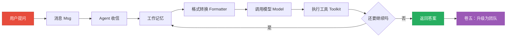

# 理解 AgentScope 2.0.1——从第一个 Agent 到智能体团队

> 一本概念与设计之书。不需要 Agent 框架经验，只需要对编程的好奇心。
> 读完你会：理解 AgentScope 每个组件是什么 → 理解它为什么这样设计 → 知道怎么用它构建应用 → 能看懂从单 Agent 到多智能体团队的完整图景。

本书是《AgentScope 源码之旅》的姊妹篇，面向 **2.0.1** 版本。它不逐行解读框架源码，也不提供可运行的 demo，而是用散文、图示和精简的示意代码片段，讲清楚每个组件的**概念、职责与设计意图**。如果你想知道"消息是怎么流转的""为什么要分 Formatter 和 Model""Agent Team 到底是什么"，这本书给你答案。

---

## 这本书适合谁

- 想理解 Agent 框架内部思想，而不只是会调 API 的开发者
- 即将基于 AgentScope 构建应用、需要做技术选型的工程师
- 对"大模型如何变成会行动的智能体"感兴趣的任何人

## 前置知识

- 对"函数、类、列表、字典"有基本印象即可
- 不需要：LLM API 经验、Agent 框架经验、async/await、设计模式
- 所有进阶概念在书中逐步引入，并用日常类比解释

## 六卷简介

| 卷 | 你会获得什么 | 章节 |
|----|------------|------|
| **卷零：出发前的地图** | 理解 LLM 和 Agent 是什么，建立全程的心智模型 | ch01-ch02 |
| **卷一：一次 agent() 调用的旅程** | 像追一趟列车一样，看懂一次请求如何穿过各大组件 | ch03-ch12 |
| **卷二：拆开每个齿轮** | 理解框架用到的设计模式，看懂任意组件的组织方式 | ch13-ch20 |
| **卷三：造一个新齿轮** | 理解如何扩展框架：新工具、新模型、新记忆、新 Agent | ch21-ch28 |
| **卷四：为什么要这样设计** | 理解关键设计决策背后的权衡，能参与架构讨论 | ch29-ch36 |
| **卷五：智能体团队与生产部署** | 理解 2.0.1 的新主线——从单 Agent 到协作团队，再到服务化部署 | ch37-ch40 |

## 章节目录

### 卷零：出发前的地图
1. 什么是大模型（LLM）
2. 什么是 Agent

### 卷一：一次 agent() 调用的旅程
3. 准备工具箱：初始化与异步
4. 第 1 站：消息诞生
5. 第 2 站：Agent 收信
6. 第 3 站：工作记忆
7. 第 4 站：检索与知识
8. 第 5 站：格式转换
9. 第 6 站：调用模型
10. 第 7 站：执行工具
11. 第 8 站：循环与返回
12. 旅程复盘

### 卷二：拆开每个齿轮
13. 模块系统：命名与导入
14. 继承体系：从 StateModule 到 AgentBase
15. 元类与 Hook：方法调用的拦截
16. 策略模式：Formatter 的多态分发
17. 工厂与 Schema：从函数到 JSON Schema
18. 中间件与洋葱模型
19. 发布-订阅：多 Agent 通信（团队协作的雏形）
20. 可观测性与持久化

### 卷三：造一个新齿轮
21. 扩展准备
22. 造一个新 Tool
23. 造一个新 Model Provider
24. 造一个新 Memory Backend
25. 造一个新 Agent 类型
26. 集成 MCP Server
27. 高级扩展：中间件与分组
28. 终章：集成实战

### 卷四：为什么要这样设计
29. 消息为什么是唯一接口
30. 为什么不用装饰器注册工具
31. 上帝类 vs 模块拆分
32. 编译期 Hook vs 运行时 Hook
33. 为什么 ContentBlock 是 Union
34. 为什么用 ContextVar
35. 为什么 Formatter 独立于 Model
36. 架构的全景与边界

### 卷五：智能体团队与生产部署（2.0.1 新主线）
37. 智能体团队是什么：从单兵到协作
38. 工作空间与技能：团队的"工位"与"本事"
39. 权限与凭证：安全地连接工具与数据
40. 从开发到部署：服务化与生产考量

### 附录
- Python 进阶概念速查
- 术语表

## 阅读路径建议

- **线性阅读**：从 ch01 到 ch40，适合完整理解。
- **按需跳读**：已了解 LLM/Agent 的读者可直接从 ch03 开始；只关心扩展的读者直接看卷三；只想理解 2.0.1 新特性的读者直奔卷五。

## 自包含原则

本书面向**离线读者**。因此：

1. **不依赖外部链接**：所有参考资料的核心内容直接融入正文，而不只是放一个网址。
2. **官方文档要点内嵌**：把 docs.agentscope.io 的关键用法以"官方文档的建议是……"自然写进正文。
3. **论文观点摘录**：在相关位置直接摘录 AgentScope 论文的关键论断（1-3 句）并注明出处。
4. **规范要点提取**：Python 官方文档、PEP 等引用，把相关条款用自己的话讲清楚。

## 版本说明

本书基于 **AgentScope 2.0.1**。框架会持续演进，书中描述的概念与组件名以该版本为准。

## 贯穿示例

全书追踪一个"天气查询智能体"的完整生命周期：用户问"北京今天天气怎么样？"，这条请求从被组织成一条消息开始，依次经过 Agent 接收、写入记忆、格式化、调用大模型、执行天气工具、循环判断，最终把答案返回给用户。卷五里，这个单兵智能体会升级成一支能分工协作的"团队"。

准备好了，我们出发。
