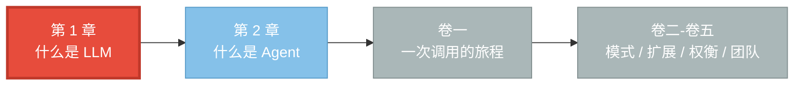
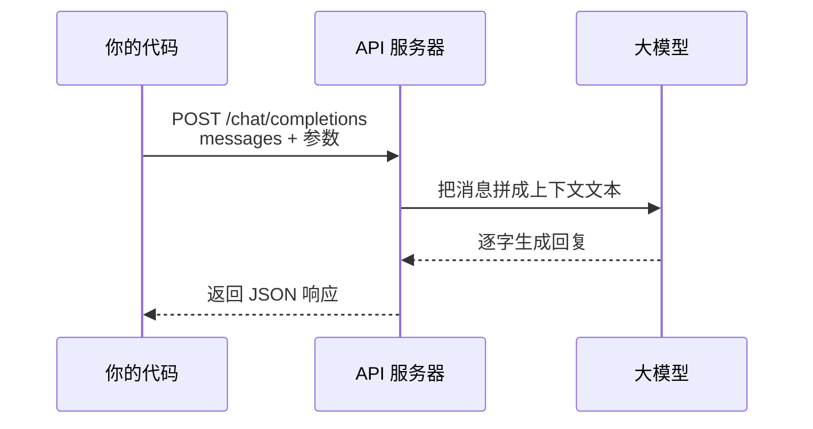
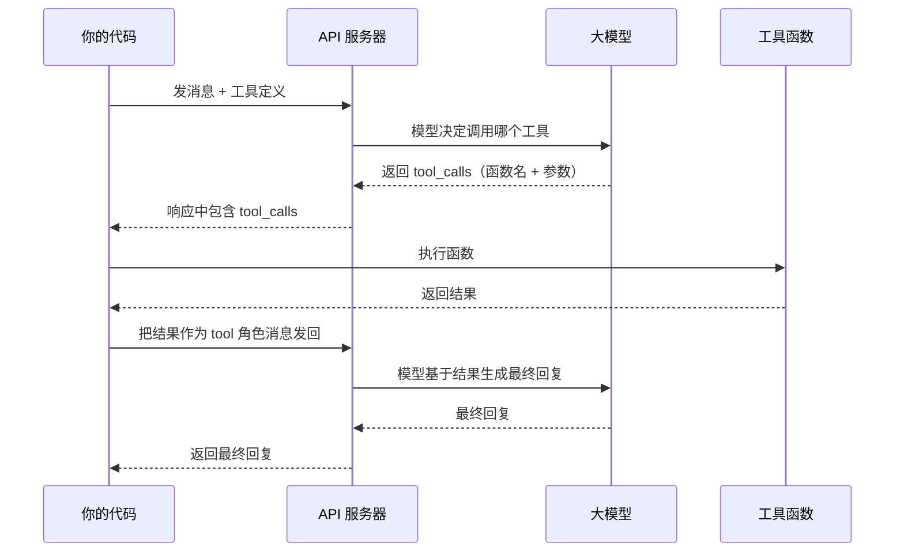
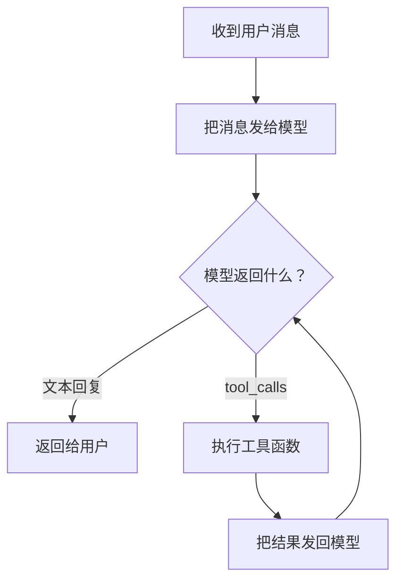
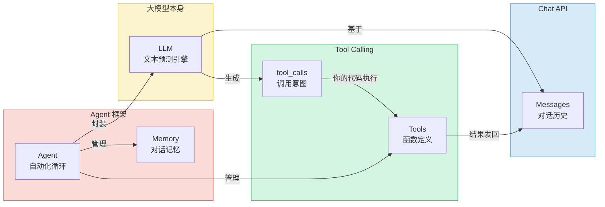

# 第 1 章 什么是大模型（LLM）

你大概已经听腻了"大模型"这三个字。新闻里说它能写代码、能画画、能陪你聊天；同事说它要取代程序员；广告说用了它的产品"更智能"。这些说法都对一点，也都漏了最关键的一点——**大模型到底是什么东西，它在你的程序里究竟扮演什么角色**。

这一章不打算把"Transformer 架构""注意力机制""训练损失"这些词再讲一遍。我们要回答的是更贴近开发者的三个问题：大模型是什么、它怎么跟你对话、它怎么调用外部工具。读完之后，你会理解全书追踪的那个"天气查询智能体"到底依赖了哪些底层能力，也会知道为什么后来需要一个叫 AgentScope 的框架把它管起来。

> 大模型本质上是一个读了整个互联网的"超级输入法"：你给它一段开头，它接着往下预测。真正让这件事变得了不起的，是规模——规模大到一定程度，"预测下一个字"竟然涌现出了理解指令、推理和按格式输出的能力。

> 源码之旅的起点，也是理解一切 Agent 的起点。

## 1.1 路线图

本书一共六卷，从"什么是 LLM"一路讲到"如何把一群智能体部署成服务"。你现在站在最开头——卷零，出发前的地图。这一章先把地图上的第一块拼图摆好：大模型本身。



本章只解决"模型本身能做什么"，下一章再讲"Agent 是怎么在模型外面套一层壳、让它变成会做事的智能体"。把它想成建房子：这一章是看地基（大模型），下一章是看上层结构（Agent）。地基不稳，上层就全是空中楼阁。

## 1.2 知识补全：调一个模型，到底在调什么

在正式讲概念之前，先把几个绕不开的小词说清楚。这些是后面所有章节都会反复出现的"通行证"。

**HTTP 请求与 JSON。** 你平时打开网页，浏览器就是向服务器发了一个 HTTP 请求。调用大模型也是同一回事——你发一个请求，服务器处理后回一个响应，只不过这里的请求和响应体都用一种叫 **JSON** 的格式包装。JSON 你可以理解为"嵌套的字典和列表"，跟 Python 里的 `dict` 和 `list` 几乎一模一样。下面这个片段就是一段合法的 JSON，长这样：

```json
{
  "model": "gpt-4o",
  "messages": [
    {"role": "user", "content": "你好"}
  ]
}
```

`model` 是你想调用的模型名字，`messages` 是你要发给它的对话内容。仅此而已——调模型没有什么神秘的，本质就是"把一段 JSON 扔过去，收一段 JSON 回来"。

**Token。** 这是模型计量文本的基本单位。你可以粗略地把 1 个汉字记成 1.5 到 2 个 Token。计费按 Token 算，模型一次能"看进去"的上下文长度（叫 context window）也按 Token 算。它就像快递按重量收费、图书馆按页数限制借阅——Token 是大模型世界的"基本度量衡"。

**流式响应（Streaming）。** 模型可以"全部想完再一次性返回"，也可以"想出几个字就立刻吐出来"。后者就是流式响应，你看到的"打字机效果"就是这么来的。这两种模式后面都会反复出现，这里先有个印象就行。

> **设计一瞥**
>
> 注意到没有：模型既不知道你用什么编程语言，也不在乎你是从浏览器还是从服务器调它。它只认 JSON。这种"统一的数据契约"是后面一切抽象的基础——AgentScope 的 Model 层之所以能同时支持 OpenAI、Anthropic、DashScope、Gemini、Ollama，靠的就是"大家最后都把请求变成某种 JSON，把响应也变成某种 JSON"这个共同点。

## 1.3 LLM 是什么：从输入法到推理引擎

### 超级输入法

你用手机输入法打过字吧？当你敲下"今天天气"四个字，输入法会在候选栏蹦出"很好""不错""怎么样"——它在做一件事：**预测下一个词**。

大模型（Large Language Model，LLM）干的事本质上和它一模一样，只是规模大了几亿倍：

| | 手机输入法 | 大模型 |
|---|---|---|
| 训练数据 | 你的打字历史 | 互联网上海量的文本 |
| 预测范围 | 下一个词 | 下一段话、整篇文章 |
| 理解深度 | 局部字词搭配 | 上下文语义、逻辑推理 |

所以你可以把大模型想象成一个**读过整个互联网的超级输入法**。你给它一段开头（叫 prompt，提示词），它接着往下"预测"。

但这里有个关键区别：输入法只预测你"可能想打"的字，而大模型能根据你的**指令**生成结构化的回答——甚至生成代码、调用函数。它是怎么从"打字补全"跳到"听懂人话"的？

### 规模带来的涌现

答案藏在"规模"两个字里。当模型足够大、训练数据足够多，"预测下一个字"这件事会**涌现**出三种能力：

| 能力 | 例子 |
|---|---|
| **理解指令** | 你说"用一句话解释 X"，它真的只写一句话 |
| **推理** | 你说"如果 A > B 且 B > C，A 和 C 谁大？"，它能推出 A > C |
| **格式输出** | 你说"用 JSON 列出三个城市"，它输出合法的 JSON |

这三种能力组合起来，就让"预测下一个字"变成了一件极其有用的事。它不再只是补全，而是变成了一个能听懂话、能想事、还能按要求交作业的**文本推理引擎**。

记住这一点很重要：大模型的所有本事，归根结底都建立在"给一段文字，续写一段文字"这个最朴素的机制上。后面看到它会调工具、会思考、会有"记忆"，那都不是模型自己长出来的器官，而是别人**在它外面**加上去的脚手架。Agent 框架，就是搭这个脚手架的人。

## 1.4 Chat API：模型怎么跟你对话

### 一次对话的全貌

目前最主流的大模型调用方式叫 **Chat API**（聊天接口）。无论你用 OpenAI、Anthropic 还是阿里云百炼，套路都一样：你发一段消息列表过去，它回一段消息过来。



请求体里的核心是一个叫 `messages` 的**消息列表**。每条消息有两个关键字段：

- `role`（角色）：这条话是谁说的
- `content`（内容）：具体说了什么

一个典型的多轮对话，`messages` 长这样：

```json
{
  "messages": [
    {"role": "system", "content": "你是一个天气助手。"},
    {"role": "user", "content": "北京天气怎么样？"},
    {"role": "assistant", "content": "让我帮你查一下。"},
    {"role": "user", "content": "好的，请查。"}
  ]
}
```

模型拿到这整段历史，要做的事情非常简单：**预测下一条 `assistant` 消息的 `content`**。它读完前面所有话，然后接着往下"写"——只不过这次它写的是自己作为助手该说的话。

### 四种角色，各司其职

每条消息的 `role` 是 Chat API 里一个很巧妙的设计。它告诉模型"这话是谁说的"，从而让模型在续写时知道自己的身份和约束：

| 角色 | 谁说的 | 作用 |
|---|---|---|
| `system` | 开发者设定 | 给模型定"人设"和规则，优先级最高（如"你是天气助手，只回答天气问题"） |
| `user` | 真实用户 | 用户的提问或指令 |
| `assistant` | 大模型 | 模型的回复（包括文本回答和"想调用工具"的意图） |
| `tool` | 你的代码 | 工具函数执行后的返回值，发回给模型供它参考 |

模型本身**没有记忆**。这一点怎么强调都不过分。它每次都是"从零开始读你给它的 `messages`"。所以多轮对话里，你必须把历史消息也一起塞进 `messages`——上一轮它说过什么，是你帮它"回想"起来的，不是它自己记的。

> **设计一瞥**
>
> 这就是为什么 Agent 框架里一定要有个叫 **Memory（记忆）** 的组件：它的全部职责，就是帮你**维护这份 `messages` 列表**。没有 Memory，模型每次跟你说话都像第一次见面。Memory 不是为了让模型"更聪明"，而是为了补上模型天生缺失的那块——它从来记不住任何事。

### 响应里有什么

模型回你的也是一段 JSON，结构大致是这样：

```json
{
  "choices": [
    {
      "message": {
        "role": "assistant",
        "content": "大模型是通过海量文本训练的 AI 系统。"
      }
    }
  ],
  "usage": {
    "prompt_tokens": 15,
    "completion_tokens": 25,
    "total_tokens": 40
  }
}
```

两块内容：`choices` 是回复（一般只有一条），`usage` 是这趟调用花了多少 Token。`usage` 看着不起眼，但它是你**控制成本**的唯一线索——每次调用花了多少钱、还有多少额度，都从这里读。

到这里，你已经掌握了"和模型对话"的全部要素：发 `messages`，收 `choices`，关注 `usage`。就这么简单。

## 1.5 Tool Calling：让模型"动手做事"

### 一个尴尬的真相

模型只会生成文本。你说"北京今天天气怎么样"，它能根据常识瞎猜"北京现在大概是春天，十几度"——但这不是真数据，是幻觉。

如果你真要它查实时天气，得让它**去调一个函数**。可是模型本身根本跑不了你机器上的代码，它只能输出文字。怎么办？

**Tool Calling**（工具调用）就是解决这个尴尬的机制。它的核心思路是：**模型不亲自执行函数，它只输出"我想调用哪个函数、传什么参数"，真正执行的，是你的代码。**

### 工作流程

整个流程是一次"接力赛"，模型和你的代码来回传球：



分四步看：

1. **你告诉模型有哪些工具。** 在请求里多带一个 `tools` 字段，描述每个函数的名字、作用、参数。这本质是给模型一份"菜单"。
2. **模型决定点哪道菜。** 它不直接执行，而是返回一段叫 `tool_calls` 的"调用意图"——函数名加参数。
3. **你的代码去厨房做菜。** 你解析这段意图，真正去跑那个函数（比如查天气），拿到结果。
4. **把菜端回桌上。** 你把结果包装成一条 `role: "tool"` 的消息，再发给模型，让它基于真数据生成自然语言回复。

### 给模型看的"菜单"长什么样

你在请求里描述工具，用的是一种叫 **JSON Schema** 的格式——它就是一份"函数说明书"。比如一个查天气的函数：

```json
{
  "tools": [
    {
      "type": "function",
      "function": {
        "name": "get_weather",
        "description": "查询指定城市的天气",
        "parameters": {
          "type": "object",
          "properties": {
            "city": {
              "type": "string",
              "description": "城市名称"
            }
          },
          "required": ["city"]
        }
      }
    }
  ]
}
```

注意这里没有任何代码逻辑，**只有描述**。模型看到 `description`（"查询指定城市的天气"）就知道这函数干嘛用，看到 `parameters` 就知道要传哪些参数。当用户问"北京天气怎么样"，它会自己推断："我该调 `get_weather`，参数 `city` 应该填'北京'"。

模型回你的"调用意图"则长这样：

```json
{
  "tool_calls": [
    {
      "id": "call_abc123",
      "function": {
        "name": "get_weather",
        "arguments": "{\"city\": \"北京\"}"
      }
    }
  ]
}
```

注意 `arguments` 是个**字符串**（里面装着 JSON），不是直接的 JSON 对象——这是各家 API 的约定，你拿到后要自己解析。这种"字符串套 JSON"的小细节，正是后面 Formatter、Toolkit 这些组件要帮你抹平的。

> **设计一瞥**
>
> 模型只输出"意图"、不亲自执行——这个分工是整个 Agent 范式的基石。它意味着模型可以"想"（决定调什么工具），而执行权始终握在你的代码手里。你想让它调真天气 API 还是假数据，想限制它一天只能调 10 次，想记录每次调用做审计——全都可以，因为最后那一脚是你踢的。**模型出主意，你的代码干活，权力边界清清楚楚。**

## 1.6 从单次调用到循环：ReAct 与 Agent 框架

### 为什么需要循环

Tool Calling 一次来回，往往不够。用户问"北京天气怎么样，顺便告诉我该穿什么"，模型可能要先调 `get_weather("北京")` 拿到"22 度晴"，再调 `get_clothing_advice(22, "晴")` 拿到穿衣建议，最后才能组织出完整回答。这是一个**多步、带判断**的过程：



先**想**（Reasoning：模型决定该做什么），再**做**（Acting：执行工具），看看结果够不够，不够就继续想、继续做——直到模型给出最终的纯文本回复。这种"思考与行动交替"的模式，有个名字叫 **ReAct**（Reason + Act）。

如果让你手写这段循环，你得自己管：什么时候停、把工具结果塞回 `messages` 的哪个位置、解析 `tool_calls` 字符串、处理调用失败……繁琐、易错、每个模型提供商的细节还都不一样。

**Agent 框架**（AgentScope 就是其中之一）就是来帮你把这些事自动化的。你只管告诉它"用这个模型、有这些工具、对话历史放这儿"，剩下"模型决定调工具 → 执行 → 把结果发回 → 循环判断"全由框架兜底。

### AgentScope 里的角色分工

回头看全书贯穿的那个天气查询智能体，它的骨架大致是这样一段示意（这是给你看 API 形态的，不是让你跑的程序）：

```python
import agentscope
from agentscope.agent import ReActAgent
from agentscope.model import OpenAIChatModel
from agentscope.formatter import OpenAIChatFormatter
from agentscope.tool import Toolkit
from agentscope.memory import InMemoryMemory
from agentscope.message import Msg

agentscope.init(project="weather-demo")

model = OpenAIChatModel(model_name="gpt-4o", stream=True)
toolkit = Toolkit()
toolkit.register_tool_function(get_weather)

agent = ReActAgent(
    name="assistant",
    sys_prompt="你是天气助手。",
    model=model,
    formatter=OpenAIChatFormatter(),
    toolkit=toolkit,
    memory=InMemoryMemory(),
)

result = await agent(Msg("user", "北京今天天气怎么样？", "user"))
```

现在你能对上号了——这段代码里的每个组件，都对应着本章讲过的一个概念：

| 代码 | 对应本章概念 | 它的职责 |
|---|---|---|
| `OpenAIChatModel` | Chat API 的调用 | 把 `messages` 发给 OpenAI，把响应解析回来 |
| `OpenAIChatFormatter` | JSON 与消息的互转 | 把 AgentScope 内部的 `Msg` 转成 OpenAI 认的 JSON 格式 |
| `toolkit.register_tool_function(get_weather)` | Tool Calling 的"菜单" | 自动把 Python 函数变成上一节那种 JSON Schema |
| `InMemoryMemory()` | 维护 `messages` 列表 | 替模型"记住"对话历史 |
| `ReActAgent` | 自动化 ReAct 循环 | 把上面这一切串起来，自动决定何时调工具、何时返回 |
| `Msg("user", "...", "user")` | 一条消息 | 包含 `role` 和 `content` 的消息对象，AgentScope 的基本数据单位 |
| `await agent(...)` | 启动整个流程 | 异步等待 Agent 跑完一轮 |

这里有个新东西：`await`。它是 Python 异步编程的关键字，意思是"等这个操作完成，但等待期间程序可以去做别的事"。调模型、执行工具都是耗时的 I/O 操作，用异步可以让框架在等一个请求时去干别的活。卷一第 3 章会详细讲 async/await，现在你只要把它读成"启动并等结果"就行。

> **设计一瞥**
>
> 注意 `formatter` 和 `model` 是**分开的两个组件**。为什么不把它们合在一起？因为不同模型提供商（OpenAI、Anthropic、DashScope……）要的 JSON 格式各不相同，但"消息该怎么组织、对话该怎么进行"这件事是相通的。把"格式翻译"（Formatter）和"发请求"（Model）拆开，你换模型提供商时只需换 Formatter + Model，Agent 的其余部分一行都不用动。这是策略模式在框架里的真实落地，卷二第 16 章会专门拆解。

## 1.7 概念关系总览

把这一章讲的所有概念拼到一张图里，是这样：



从内往外读：最内核是 LLM 这个文本预测引擎；外面套一层 Chat API，让"预测"变成"对话"；再外面套一层 Tool Calling，让"对话"能驱动"行动"；最外面是 Agent 框架，把这一切循环、记忆、管理自动化。

每一层都不是凭空设计的，都是在补**上一层缺失的能力**：LLM 没记忆，所以有 Memory；LLM 不会动手，所以有 Tool Calling；调用要循环、要管格式，所以有 Agent 框架。理解了这个"层层补缺"的逻辑，你就理解了 AgentScope 整个架构为什么是今天这个样子。

> 与官方文档的对应：AgentScope 官方文档的 Basic Concepts 页详细介绍了 Message、Agent、Model 三大基础概念——其中 Message（`Msg`）是基本数据结构，负责在 Agent、用户和工具之间传递信息，支持文本、图像、工具调用等多种内容类型；Agent 是独立实体，通过 `reply`（处理消息并生成回复）和 `observe`（接收外部信息更新内部状态）两个核心方法运作；Model 层提供统一的异步抽象，覆盖多家模型提供商。官方文档侧重"怎么调 API"，本章则侧重"LLM 和 Agent 的基本原理"。

> 关于设计动机，AgentScope 1.0 论文（arXiv:2508.16279）第 1 节是这样说的："Driven by rapid advancements of Large Language Models (LLMs), agents are empowered to combine intrinsic knowledge with dynamic tool use, greatly enhancing their capacity to address real-world tasks. ... AgentScope introduces major improvements in a new version (1.0), towards comprehensively supporting flexible and efficient tool-based agent-environment interactions." 论文还指出，框架将 Agent 行为建立在 **ReAct 范式**之上，并提供基于系统性异步设计的高级 Agent 基础设施。这一章讲的 LLM、Chat API、Tool Calling、ReAct 循环，正是这段话里每一个关键词的具体含义。

## 检查点

回顾一下你现在掌握了什么。下面几个问题，试着用自己的话回答，再往下对答案。

**问题 1：为什么说"模型本身没有记忆"？多轮对话是怎么实现的？**

模型每次调用都是从零开始读你发给它的 `messages` 列表，它内部不保存任何上一次对话的痕迹。所谓多轮对话，是**你**（或者说 Agent 框架里的 Memory 组件）把历史消息一直累积着，每次调用都把完整历史重新塞进 `messages` 发过去。模型"记得"昨天说过什么，其实是你帮它"复述"了一遍。所以 Memory 不是装饰，而是补上模型天生缺失的关键能力。

**问题 2：Tool Calling 里，模型到底做了什么？它真的执行了函数吗？**

没有。模型只输出一段"调用意图"（`tool_calls`），告诉你"我想调 `get_weather` 这个函数，参数是 `city="北京"`"。真正去执行函数、拿到结果的，是你的代码。模型全程没碰过你的运行环境。这种"模型出主意、代码干活"的分工，是 Agent 范式的根基——执行权始终在你手里。

**问题 3：Chat API 里的四种 `role` 分别是谁在说话？为什么要有 `system` 这个角色？**

四种角色是：`system`（开发者设定的人设和规则）、`user`（真实用户）、`assistant`（大模型自己）、`tool`（工具执行后的返回结果）。`system` 角色的作用是给整个对话定调子——比如"你是天气助手，只回答天气问题"。它的优先级最高，相当于一份"岗位说明书"，约束模型在后续所有回复里守住边界。

**问题 4：一段用户消息在 AgentScope 里是怎么表示的？它和 Chat API 的 `messages` 是什么关系？**

在 AgentScope 里，一条用户消息大概是 `Msg("user", "北京今天天气怎么样？", "user")` 这样构造——它把 `role` 和 `content` 打包成一个对象，是框架里信息流动的基本单位。它和 Chat API 的 `messages` 不是同一个东西，但**对应**：Formatter 组件负责把一组 `Msg` 翻译成某个模型提供商认的 `messages` JSON。也就是说，`Msg` 是框架内部的统一表示，`messages` 是对外的"方言"。

**问题 5：为什么需要 Agent 框架？手写 Tool Calling 循环不行吗？**

单次 Tool Calling 你当然可以手写。但真实任务往往要多步循环——模型可能要连调几个工具、要判断什么时候该停、要把工具结果正确地塞回历史、要处理各种提供商的格式差异。手写这些代码繁琐、易错、还难复用。Agent 框架（如 AgentScope 的 `ReActAgent`）把这些事标准化、自动化了，让你专注定义"模型、工具、记忆"这三样东西，循环逻辑由框架兜底。

## 下一站预告

这一章我们把地图上"大模型"这块拼图摆好了：它是一个文本预测引擎，通过 Chat API 和你对话，通过 Tool Calling 调用外部函数，而 Agent 框架把这一切循环自动化。

但仔细想想，这里还缺了点什么。模型只会"说"，不会"做"；它没有记忆，没有判断力，不会主动决定"现在该调工具了还是该回答了"。把这些能力补齐的，正是下一章的主角——**Agent**。下一章我们会拆开 Agent 的内部结构，看看"记忆 + 工具 + 循环"是怎么把一个只会说话的 LLM，变成一个会做事的智能体的。

> **下一章：[第 2 章 什么是 Agent](./ch02-what-is-agent.md)**
