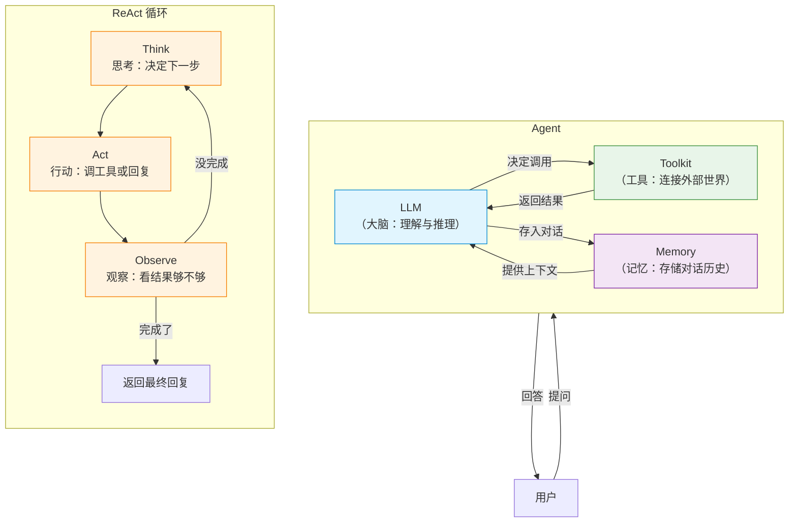
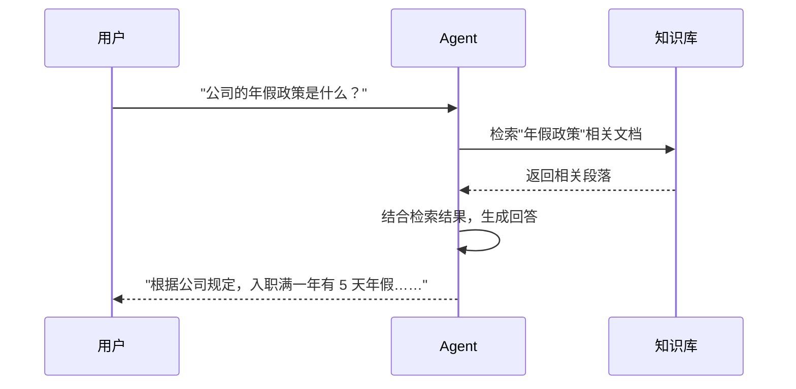
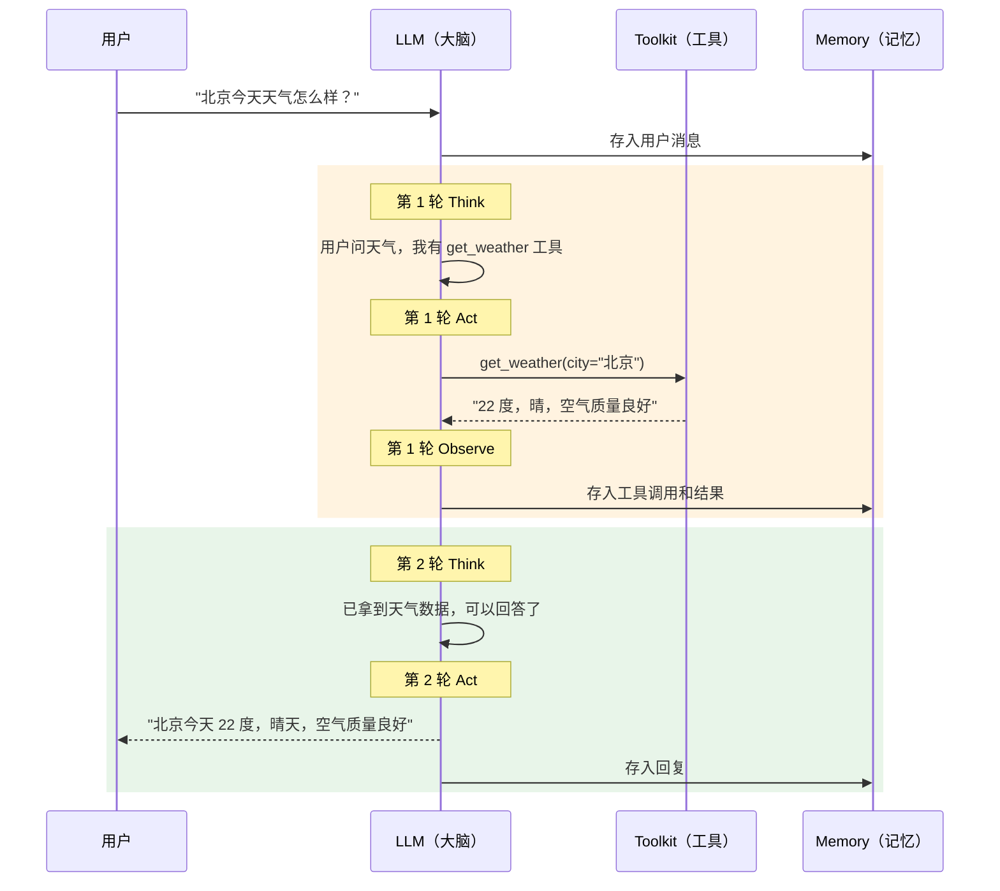
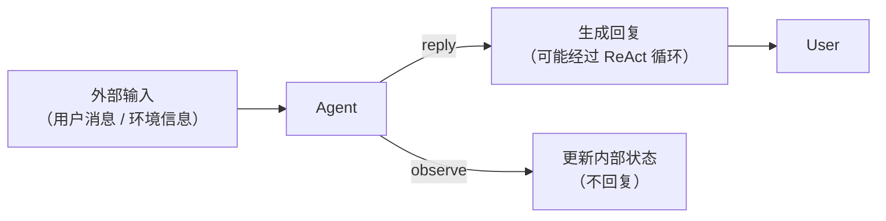
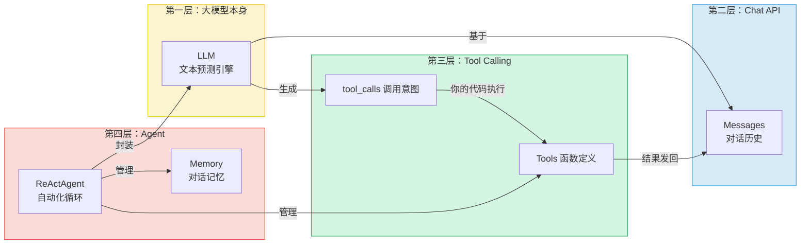

# 第 2 章 什么是 Agent

上一章我们认识了 LLM：你给它一段文字，它接着往下预测。它很聪明，会听指令、会推理、会按格式交作业，但它有一个致命的局限——**它只会"说"，不能"做"**。它不能帮你查实时天气，不能帮你订票，也记不住你昨天问过它什么。

这一章的主角 Agent（智能体），就是来补这些能力的那层"脚手架"。它把一个只会输出文字的 LLM，包装成一个能记住上下文、能动手调用工具、能自己决定"现在该干什么"的角色。理解了 Agent，你才理解 AgentScope 这个框架到底在帮你管什么。

> Agent 的本质，是给一个只会"说"的大脑，配上记忆、工具和一个"先想再做"的工作流程，让它从"顾问"变成"助手"。

> **上一章：[什么是大模型（LLM）](./ch01-what-is-llm.md)**

## 2.1 路线图

我们正站在卷零的第二站。上一章看的是地基——LLM 本身；这一章看的是地基上面搭起来的第一层结构——Agent。从这一章往后，全书会反复围绕一个"天气查询智能体"展开，所以这一章的任务，就是把"Agent 到底由哪几部分组成、它们怎么配合"这件事讲透。


这一章只回答一个问题：**Agent 是什么，它由哪些零件拼起来的，这些零件怎么协作。** 至于每个零件内部怎么实现，那是卷一的事——卷一会跟着一条消息，从进入 Agent 到被回复，把这条路径上的每一段走一遍。你在这里只要先建立一张"全景地图"。

## 2.2 知识补全：从上一章带过来的三块拼图

在正式拆 Agent 之前，先把上一章讲过、但这一章会反复用到的三个要点拎出来，免得你来回翻。

第一，**模型没有记忆**。LLM 每次调用都是从零开始读你发给它的 `messages` 列表，它内部不保存任何上一次对话的痕迹。所谓"多轮对话"，是你（或框架）把历史消息一直累积着，每次都重新塞进去。

第二，**模型不会动手**。它只会输出文字，连"我想调用 `get_weather` 这个函数、参数是 `city="北京"`"这件事，它也是用一段叫 `tool_calls` 的 JSON 表达出来的。真正去执行函数、拿到结果的，是你的代码。

第三，**模型不会自己决定"什么时候该停"**。给它一个任务，它可能要先调一个工具、再调一个工具、看看结果够不够、不够继续调——这个"想-做-看-再想"的循环，需要有人来组织。

这三条加起来，恰好暴露了 LLM 的三个缺口：没记忆、不会动手、不会自己规划流程。Agent 这个概念，就是为这三个缺口量身定做的补丁。

> **设计一瞥**
>
> 注意一个关键点：补这三个缺口的，**都不是模型自己长出来的能力**，而是在模型"外面"加上去的组件。模型从头到尾都只是那个"预测下一段文字"的引擎。这件事想清楚，你就不会被"Agent 有记忆""Agent 会调工具"这种说法误导——记忆和工具是 Agent 这个**系统**的组成部分，不是 LLM 的组成部分。

## 2.3 一个类比：从"只会说的顾问"到"全能助手"

在拆技术之前，先建立一个生活化的直觉。

想象你雇了一个顾问，他学识渊博但只能口头表达。你问他"北京天气怎么样"，他能根据常识回答"北京现在应该是春天，大概十几度"——但这不是真数据，只是猜测，跟 LLM 的"幻觉"如出一辙。

现在，你给他配了三样东西：

1. **一个笔记本**——每次对话你都帮他记下来，下次见面他就记得你之前问过什么。
2. **一个工具箱**——里面有一部电话，可以打给气象局查实时天气。
3. **一套工作流程**——"先想想要做什么，再动手做，做完看看结果够不够，不够就继续"。

有了这三样，他就从"只会说的顾问"升级成"全能助手"：你问北京天气，他想"我得查一下实时数据"，拿起电话打给气象局，把结果告诉你，顺手把这次对话记进笔记本。下一次你再问"上海呢"，他翻开笔记本就知道你还在问天气，直接去查上海。

这个"全能助手"，就是 Agent。把它翻译成技术语言，就是这一章的核心公式：

```
Agent = LLM + 记忆(Memory) + 工具(Tool) + 循环(Loop)
```

- **LLM**：大脑，负责理解和推理（那个学识渊博的顾问）。
- **Memory**：笔记本，记住对话历史。
- **Tool**：工具箱，连接外部世界（电话、气象局）。
- **Loop**：工作流程，反复"想→做→看"直到完成任务。

这个公式你可以先记死。后面几节，我们就是逐个零件地把它拆开看。

## 2.4 概念讲解：Agent 的四个组件

### 2.4.1 整体架构一张图

把公式画成图，Agent 的内部结构和它跟外界的交互长这样：



四样东西各司其职：LLM 是大脑、Memory 是记忆、Toolkit 是手脚、Loop 是把它们串起来的工作流。下面一个一个说。

### 2.4.2 Memory（记忆）：替模型记住昨天

Memory 的全部职责，就是上一章反复强调的那句"模型没记忆"的解药——它帮你**维护那份 `messages` 列表**。

想象你和一个完全没有记忆的人对话：

```
你："北京天气怎么样？"
Agent："北京今天 22 度，晴天。"
你："上海呢？"
Agent："上海什么？你之前没提过任何话题。"   ← 没记忆的惨剧
```

没有 Memory，Agent 每次都像第一次见面。有了 Memory，对话才能连贯：

```
你："北京天气怎么样？"
Agent："北京今天 22 度，晴天。"
你："上海呢？"
Agent："上海今天 18 度，多云。"   ← Agent 理解"呢"指的是天气
```

在 AgentScope 里，最常用的记忆实现叫 `InMemoryMemory`，构造起来就一行：

```python
memory = InMemoryMemory()
```

它对外暴露的核心动作很朴素，无非两件：

| 动作 | 含义 | 什么时候发生 |
|---|---|---|
| 往里加一条消息 | 记下"用户说了什么""工具返回了什么""助手回了什么" | 每发生一次交互 |
| 把全部历史取出来 | 拼成上下文，随请求发给 LLM | 每次向 LLM 发请求前 |

`InMemoryMemory` 把消息存在一个 Python 列表里，简单直接。但记忆不一定要住在内存里——AgentScope 还提供了住在 Redis 里的 `RedisMemory`、住在数据库里的 `AsyncSQLAlchemyMemory` 等等。它们的对外接口一致，差别只在"数据放在哪儿"。这点设计很关键：换了存储，Agent 的其余部分一行都不用改。

> **设计一瞥**
>
> Memory 不是为了让模型"更聪明"，而是为了**补上模型天生缺失的那块**。它没有做任何花哨的事，就是老老实实地当一个"消息列表管理员"。正因为职责单一、接口统一，你才能在进程内存、Redis、数据库之间自由切换，而不用动 Agent 的逻辑。

### 2.4.3 Tool（工具）：让模型能动手

Tool 解决的是上一章讲过的那个尴尬：LLM 只会生成文字，不会真去查天气、不会真去搜网页、不会真去操作数据库。Tool 让它能"动手做事"。

在 AgentScope 里，把一个 Python 函数变成 Agent 能用的工具，靠的是 `Toolkit`：

```python
toolkit = Toolkit()
toolkit.register_tool_function(get_weather)
```

`register_tool_function` 做了两件事，正好对应上一章 Tool Calling 的两端：

1. **给模型看"菜单"**：它读 `get_weather` 函数的签名和文档字符串（参数名、类型、说明），自动生成一份 JSON Schema 格式的函数说明书，告诉模型"这里有个工具，叫这个名字，干这个用，要这些参数"。
2. **替模型"跑腿"**：它把函数存起来，等模型决定调用时，由框架替模型执行这个函数，把结果再送回去。

这里要再强调一次上一章那条铁律：**LLM 自己不执行代码**。它只输出一段"调用意图"（函数名加参数的 JSON），真正去跑函数的是你的代码。这个过程可以类比成公司里的分工——LLM 是经理，Tool 是下属：经理说"帮我查一下北京的天气"，下属去查、把结果汇报给经理，经理自己从不亲自动手查。

这个分工不是技术细节，而是 Agent 范式的**权力边界**：模型出主意，你的代码干活。这意味着你想限制它一天只能调 10 次工具、想记录每次调用做审计、想用假数据替换真 API——全都可以，因为最后那一脚始终是你在踢。

### 2.4.4 RAG（检索增强生成）：给模型塞参考资料

除了"记忆"和"工具"，还有一类知识来源值得一提——RAG（Retrieval-Augmented Generation，检索增强生成）。它解决的是另一个尴尬：LLM 的知识有截止日期，而且不包含你的私有数据。问它"北京天气"它还能靠工具查，但问它"我们公司的年假政策是什么"，它两眼一抹黑。

RAG 的工作方式像一个图书管理员：Agent 收到问题后，先去知识库里检索相关文档，把检索到的段落塞进上下文，再让 LLM 基于这些"参考资料"组织回答。



在 AgentScope 里，RAG 通过 `KnowledgeBase` 这类组件实现。它的定位很清晰：在"模型自己知道的知识"和"工具实时查到的数据"之外，再补一个"你提前准备好的私有知识"通道。本书卷一第 7 章会专门讲它的检索机制，这里你只要知道"有这么一类知识来源"就够了。

### 2.4.5 ReAct 循环：先想再做，反复到完成

把记忆、工具串起来让 Agent 真正"动起来"的，是 **ReAct 循环**。ReAct 是 **Re**asoning + **Act**ing 的缩写，意思是"推理 + 行动"。它的核心思想可以用四步说清楚：

```
循环开始：
  1. Think（思考）   —— LLM 分析当前情况，决定下一步做什么
  2. Act（行动）     —— 执行动作（调用工具，或直接给出最终回复）
  3. Observe（观察） —— 看看动作的结果
  4. 任务完成就返回，没完成就回到第 1 步
```

注意它的精髓不在"循环"两个字，而在"**先推理，再行动**"。也就是说，模型在每一步动手之前，都会先吐出一段"我打算干嘛、为什么这么干"的思考过程，然后再决定调哪个工具、传什么参数。这种显式的中间推理，给模型留出了纠错和规划的空间——它可以在思考里意识到"这个方法不对，换个思路"，而不是闷头乱试。

用天气 Agent 走一遍这个循环，过程是这样的：



两个细节值得注意。

第一，**循环不是无限转的**。AgentScope 里有一个 `max_iters` 参数（默认 10），防止 Agent 陷入"一直调工具、一直不满意"的死循环。对于简单问题，通常 2-3 轮就收工了。

第二，**每一轮的 Think、Act、Observe 都会被记进 Memory**。这意味着模型在下一轮思考时，能看到自己上一轮想了什么、做了什么、拿到了什么——这种"自我对话"的上下文，正是 ReAct 能纠错、能规划的根本。

> **设计一瞥**
>
> 为什么叫 ReAct 而不直接叫"循环"？因为还存在另一种设计：让 LLM 直接输出工具调用指令，中间不夹显式的推理步骤。ReAct 的优势在于那段被"说出来"的思考——它让模型在动手前先做一次自我检查，实践证明这能显著提升复杂任务的完成准确率。代价是多了些 Token 开销和一点延迟，但在需要可靠性的时候，这笔账划得来。

关于 ReAct，它的出处值得一记。ReAct 由 Shunyu Yao 等人在 2022 年的论文中提出（ICLR 2023, arXiv:2210.03629），摘要里这样描述核心思想：他们探索让 LLM **以交替的方式**生成推理轨迹（reasoning traces）和具体动作（task-specific actions），让两者相互增强——推理轨迹帮助模型制定、追踪和调整行动计划并处理异常，而动作让模型能与外部环境（如知识库）交互、获取额外信息。简言之，"想"和"做"不是分开的两件事，而是一对相互喂料的搭档。

### 2.4.6 四个组件怎么落到代码上

把上面四个组件对应到 AgentScope 的 API 上，你会发现它们一一映射得清清楚楚。下面这段是给你看 API 形态的示意（不是让你跑的程序）：

```python
agent = ReActAgent(
    name="assistant",
    sys_prompt="你是天气助手。",          # 给 LLM 定人设
    model=model,                        # LLM（大脑）
    formatter=OpenAIChatFormatter(),     # 消息格式翻译器
    toolkit=toolkit,                     # Tool（工具箱）
    memory=InMemoryMemory(),             # Memory（记忆）
)
```

逐行对一遍：

| 代码 | 对应的组件 | 它的职责 |
|---|---|---|
| `sys_prompt="你是天气助手。"` | 人设 | 告诉 LLM 它是谁、该怎么回答 |
| `model=model` | LLM | 把请求发给模型，把响应拿回来 |
| `formatter=OpenAIChatFormatter()` | 格式翻译 | 把统一的 `Msg` 转成 OpenAI 认的 JSON 格式 |
| `toolkit=toolkit` | Tool | 管理"菜单"和"跑腿" |
| `memory=InMemoryMemory()` | Memory | 维护对话历史 |
| `ReActAgent` | Loop | 把上面这一切串起来，自动跑 ReAct 循环 |

这里有两个新东西值得点一下。

**`sys_prompt`（系统提示词）。** 它对应上一章讲的 `system` 角色，是给整个对话定调子的"岗位说明书"。它是 Agent 里**改一行就能改行为**的地方——同样一个 Agent，`sys_prompt` 写成"你是天气助手"和写成"你是一个热情的天气助手，回答要带感叹号并给穿衣建议"，对同样的输入会给出风格完全不同的回复。你不用改任何逻辑代码，只改这一行文字。

**`formatter`（格式器）。** 它是上一章埋的伏笔——不同模型提供商（OpenAI、Anthropic、Google……）对消息 JSON 的要求各不一样，Formatter 负责把 AgentScope 内部统一的 `Msg` 格式翻译成对应提供商认的格式。把"格式翻译"和"发请求"拆成 `formatter` 和 `model` 两个独立组件，好处是：你换模型提供商时，只需换这一对，Agent 的其余部分一行都不用动。

## 2.5 Agent 的两个核心动作：reply 与 observe

到目前为止我们说的都是 Agent 的"组成零件"。但 Agent 自己作为一个整体，对外暴露的是什么接口？在 AgentScope 里，Agent 的行为可以归结为两个核心方法——理解这两个方法，你就理解了"跟 Agent 打交道"的全部方式。



**`reply`（回复）。** 这是 Agent 的主入口：它收到一条消息，基于当前的记忆和工具，经过 ReAct 循环推理，最后给出回复。当你写下 `await agent(Msg("user", "北京天气怎么样？", "user"))`，调用的就是这条路径——Agent 会真刀真枪地想、调工具、组织答案。

**`observe`（观察）。** 这个动作更轻：它让 Agent 接收一些外部信息，把这些信息记进内部状态，但**不触发回复**。它适合用来"喂数背景知识进去"。比如你想让 Agent 在正式对话前先了解一些公司制度，可以用 `observe` 把这些材料喂进去，Agent 会默默记下，等你真正提问时再拿出来用。

两者的区别，可以类比成"被点名回答问题"和"旁听会议做笔记"：`reply` 是前者，必须开口；`observe` 是后者，只听不说。这个区分在后面构建多智能体团队时特别有用——当一个 Agent 只是需要"知道"另一个 Agent 在做什么，而不需要回应时，`observe` 就派上用场了。

> **设计一瞥**
>
> 把"回复"和"观察"拆成两个独立动作，背后是对 Agent 角色的精确刻画：Agent 不只是一个"收到就回"的应答机，它还可以是一个"持续感知环境、择机表态"的参与者。这种刻画让 AgentScope 后面能很自然地支撑多智能体协作——每个 Agent 既能主动 `reply`，也能被动 `observe` 别人的动静，团队的信息流动就丰富起来了。

## 2.6 概念关系总览：四层壳，层层补缺

把这一章和上一章的概念拼到一张图里，是从内往外读的"四层壳"：



从内往外读：最内核是 LLM 这个文本预测引擎；外面套一层 Chat API，让"预测"变成"对话"；再外面套一层 Tool Calling，让"对话"能驱动"行动"；最外面是 Agent，把这一切用循环、记忆、格式翻译管理起来，自动化成"一个会做事的角色"。

每一层都不是凭空设计的，都是在补**上一层缺失的能力**：LLM 没记忆，所以有 Memory；LLM 不会动手，所以有 Tool Calling；调用要循环、要管格式、要判断何时停，所以有 Agent。理解了这个"层层补缺"的逻辑，你就理解了 AgentScope 整个架构为什么长成今天这个样子——它不是某个人拍脑袋发明的一堆名词，而是对着 LLM 的每一个缺口，逐一打上的补丁。

关于这一层架构的定位，AgentScope 1.0 论文（arXiv:2508.16279）说得很直白：随着 LLM 的快速进步，Agent 得以把内在知识与动态工具使用结合起来，大大增强了处理真实世界任务的能力；而 AgentScope 在 1.0 版本里系统性地支持了"灵活高效的基于工具的智能体-环境交互"，并把 Agent 行为建立在 **ReAct 范式**之上，配以系统性的异步设计。本章讲的"记忆 + 工具 + 循环"，正是这段话里每一个关键词的具体含义。

## 检查点

读到这儿，你应该能用自己的话回答下面几个问题了。先想答案，再对。

**问题 1：Agent 的核心公式是什么？为什么是"加法"而不是别的？**

Agent 可以写成 `LLM + Memory + Tool + Loop` 这个加法。之所以是加法，是因为这四样东西各管一摊、互不重叠，而且每一样都是补 LLM 的一个具体缺口：Memory 补"没记忆"，Tool 补"不会动手"，Loop 补"不会自己规划流程"。LLM 本身从头到尾都只是那个"预测下一段文字"的引擎，剩下三个组件都是在它外面套的壳。加法的好处是职责清晰——想换记忆实现，动 Memory；想加工具，动 Toolkit；想改循环逻辑，动 Agent 本身，互不干扰。

**问题 2：ReAct 和普通的"循环"有什么不同？它多出来的那一步为什么重要？**

ReAct 的关键不是"循环"，而是"先推理、再行动"。普通循环可能让模型直接输出工具调用，中间没有显式的思考步骤；ReAct 则要求模型在每一步动手前，先生成一段"我打算干嘛、为什么"的推理轨迹。多出来的这一步看似啰嗦，却给模型留出了自我纠错和规划的空间——它可以在思考里发现"这条路走不通，换一个"，从而显著提升复杂任务的准确率。代价是多花些 Token，但可靠性上的收益通常划得来。

**问题 3：Memory 在 Agent 里到底起什么作用？换个存储实现（比如从内存换成 Redis）会影响 Agent 的逻辑吗？**

Memory 的全部职责，是替没记忆的 LLM 维护那份对话历史——每次向模型发请求前，它把累积的消息全部取出来拼成上下文。它不参与推理、不调用工具，就是老老实实当个"消息列表管理员"。正因为职责单一、对外接口统一，从 `InMemoryMemory` 换成 `RedisMemory` 或 `AsyncSQLAlchemyMemory` 不会影响 Agent 的任何逻辑——它们都提供同样的"加一条""取全部"动作，差别只在数据落在哪儿。

**问题 4：`reply` 和 `observe` 这两个动作有什么区别？什么时候用哪个？**

`reply` 是"被点名回答"：Agent 收到消息，经过 ReAct 循环推理，给出回复。`observe` 是"旁听做笔记"：Agent 接收信息、更新内部状态，但不触发回复。当你需要 Agent 正面回应一个问题时用 `reply`；当你只想往它脑子里塞一些背景知识或环境信息、又不想它此刻就开口时，用 `observe`。这个区分在多智能体协作时尤其有用——一个 Agent 可以默默 `observe` 另一个 Agent 的动静，只在必要时才 `reply`。

**问题 5：`sys_prompt` 改一行就能改变 Agent 的行为，这件事说明了什么？**

它说明 Agent 的"性格"和"边界"主要是由文字定义的，而不是由代码逻辑定义的。你不需要改任何分支判断、不需要加任何 if/else，只改 `sys_prompt` 这一段系统提示词，就能让同一个 Agent 从"简洁助手"变成"热情助手"或"只回答天气的严格助手"。这正是 LLM 驱动的 Agent 跟传统软件不同的地方——很多"行为规范"是用自然语言写进提示词里的，模型读着这些话来约束自己。

## 下一站预告

这一章我们把地图上"Agent"这块拼图摆好了：它是给 LLM 套上记忆、工具和 ReAct 循环后，变成的那个会做事的角色。四个组件怎么分工、循环怎么转、Agent 对外暴露哪两个动作，你心里应该都有一张图了。

但图归图，真正要让这套东西跑起来，还得先把"施工环境"搭好。下一章我们会回到地面，做几件务实的准备：装好依赖、初始化项目，还有一件绕不开的事——搞清楚代码里那个 `await agent(...)` 中的 `await` 到底是什么意思。AgentScope 全程是异步的，不理解 `await`，后面几乎每一章的代码都会读得磕磕绊绊。所以我们下一章先把这个工具箱备齐，再正式开始追踪一次完整的调用。

> **下一章：[准备工具箱：初始化与异步](../volume-1-journey/ch03-toolbox.md)**
