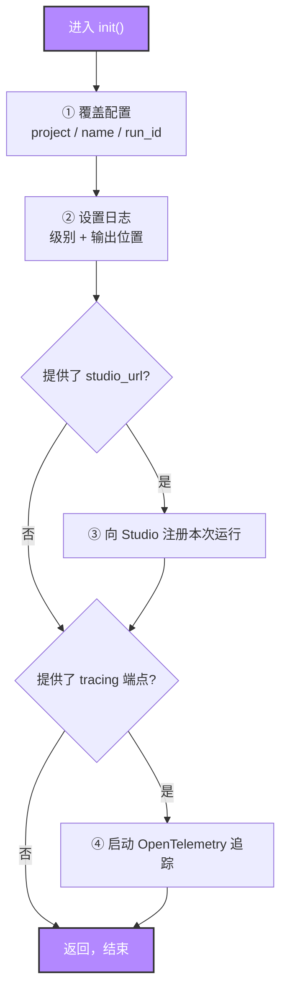
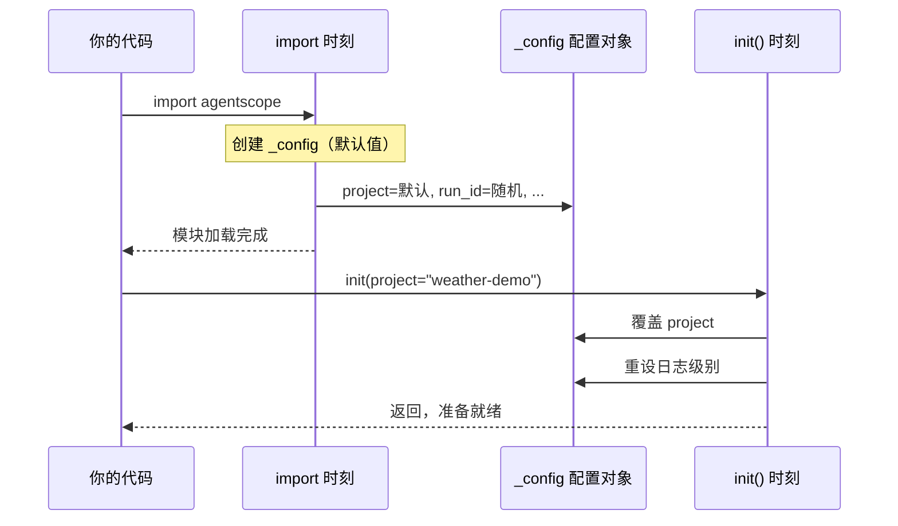
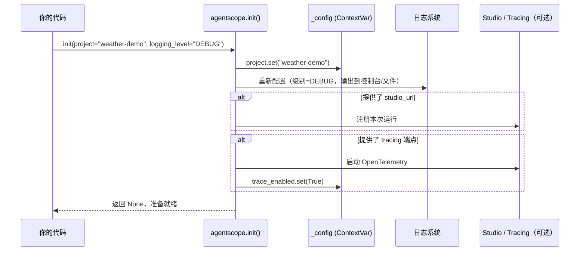

# 第 3 章 准备工具箱：初始化与异步

上一章我们认识了 Agent 的全貌：大模型负责思考，工具负责行动，记忆负责记住上下文，循环把它们串成一段对话。贯穿全书的那行代码也已经摆在了桌上：

```python
result = await agent(Msg("user", "北京今天天气怎么样？", "user"))
```

从这一章开始，我们要追踪这行代码的完整旅程。但在出发之前，得先把工具箱准备好——理解 `agentscope.init()` 到底做了什么，以及那个突兀的 `await` 到底意味着什么。这两件事一个是"装填弹药物资"，一个是"发动机的工作方式"，缺一不可。

> 初始化不是仪式，而是约定：在第一声"出发"之前，先让框架知道这一趟叫什么名字、属于哪个项目、日志该往哪里写。

> **上一章：[什么是 Agent](../volume-0-basics/ch02-what-is-agent.md)**

---

## 3.1 路线图

先看一眼我们要走的完整路线：


高亮的紫色节点就是本章位置。我们还在"出发前"的准备阶段：`init()` 不在那行请求的主干路上，但它是所有后续代码能跑起来的前提——没有它，Agent 不知道自己叫什么名字、属于哪个项目、日志该写到哪里。本章就把这趟旅程的地基铺好，并顺手把 `await` 这块语言基石讲透。

---

## 3.2 知识补全：async / await 基础

贯穿示例里那一行 `await agent(...)` 中的 `await`，对没写过异步代码的读者可能有点扎眼。这一节就把它讲清楚，因为整个 AgentScope 的 API 都是异步的——理解了 `await`，你就理解了为什么 Agent 的调用长这个样子。

### 同步代码的烦恼

假设你要调用一个 LLM API，一次网络请求需要 2 秒：

```python
result1 = call_llm("今天天气怎么样？")   # 卡住 2 秒，期间什么也干不了
result2 = call_llm("明天天气怎么样？")   # 再卡 2 秒
# 总共 4 秒，CPU 大部分时间在发呆
```

同步代码在等待网络响应时，整个程序"卡死"在那里：CPU 空闲，但谁也不能用。对一次请求来说无所谓，可 Agent 一会儿要调模型、一会儿要调工具、一会儿又要写记忆，几乎每一步都在等 IO（网络、磁盘）。如果全程同步，效率会非常低。

### async / await 的解法

异步写法把"等待"这件事变得不阻塞：

```python
import asyncio

async def main():
    result1 = await call_llm("今天天气怎么样？")
    result2 = await call_llm("明天天气怎么样？")

asyncio.run(main())
```

`await` 的含义一句话就能说清：**"我要等这个操作完成，但在等待期间，程序可以去做别的事。"**

打个比方：你在饭店点菜。同步是站在厨房门口死等，菜不端出来你哪也不去；异步是回到座位上刷手机，菜好了服务员叫你，你再去取。厨房（网络/磁盘）一直在忙，但你（CPU）没闲着——可以招呼下一桌客人，也可以核对菜单。

### 三个关键字，各司其职

| 关键字 | 角色 | 一句话理解 |
|--------|------|-----------|
| `async def` | 定义异步函数（也叫"协程"） | 给函数贴上"我是异步的"标签 |
| `await` | 在协程内等待一个耗时操作 | "等，但不闲着" |
| `asyncio.run()` | 启动事件循环 | 让异步代码真正跑起来的那个引擎 |

事件循环（Event Loop）是幕后的调度员，它负责在多个"正在等待"的任务之间来回切换。你写 `await`，它就去看看有没有别的任务可以推进；那个任务也卡住了，它再回来。这套机制让我们可以在一个进程里"同时"处理很多 IO，而不必真的开多线程。

> **设计一瞥**：为什么 AgentScope 全异步？
>
> Agent 的本质就是一连串"等待"：等模型吐字、等工具返回、等记忆落盘。这些等待几乎全是 IO。异步模型让单个进程就能撑住大量并发对话，也让 Agent 团队（多个 Agent 协作）天然可以并行工作。代价是用户必须习惯 `async/await`，但这是一次性学习成本，换来的是后续所有并发场景的顺滑。

### 你现在需要记住的

这一章你只需要三句话：

1. `await agent(...)` 表示"等待 Agent 把这条消息处理完"。
2. `await` 让程序在等待 IO 时不闲着，事件循环负责在任务间切换。
3. 事件循环的细节我们在第 7 章再展开，那时候你会遇到真正的并发——多个 Agent 同时工作。现在只要记住"await = 等但不闲着"。

---

## 3.3 init()：一次"开工前的清点"

讲完 `await`，回到本章主角 `agentscope.init()`。

在贯穿示例里，它是第一行被调用的代码：

```python
import agentscope

agentscope.init(project="weather-demo")    # 先初始化
model = OpenAIChatModel(...)
toolkit = Toolkit()
# ... 然后才创建 Agent、发出请求
```

`init()` 做的事情可以用一个生活类比概括：**开工前的清点**。你接了个装修活儿，进场第一件事不是抡锤子，而是确认——这单叫什么名字（`project`）、本次施工编号是多少（`run_id`）、图纸日志放哪儿（`logging_path`）、要不要连上远程监控屏（`studio_url`）。`init()` 就是这场清点。

它有 7 个参数，全部可选：

| 参数 | 默认值 | 用途 |
|------|--------|------|
| `project` | `None`（有默认值兜底） | 项目名称 |
| `name` | `None`（有默认值兜底） | 本次运行的名称 |
| `run_id` | `None`（自动生成） | 运行实例的唯一 ID |
| `logging_path` | `None` | 日志文件保存路径 |
| `logging_level` | `"INFO"` | 日志级别 |
| `studio_url` | `None` | AgentScope Studio 的地址（浏览器里的可视化调试平台） |
| `tracing_url` | `None` | OpenTelemetry 追踪端点 |

注意"全部可选"这四个字。这是 `init()` 最重要的设计特征：**它不是必须的**。哪怕你一行 `init()` 都不写，框架也能正常跑——因为所有配置在更早的一个时刻就已经有了默认值。`init()` 的作用，仅仅是让你"覆盖"那些默认值。

> **设计一瞥**：可省略的入口
>
> 很多框架把"初始化"设计成强制门槛——不调就报错。AgentScope 反其道而行：`init()` 是可选的增强，不是必经的关卡。这样最小示例可以短到只有创建 Agent、发请求两步，新手不会被一长串配置参数吓退。而真正部署到生产时，再通过 `init()` 把项目名、日志、追踪一一接上。这种"零配置可跑、按需可调"的梯度，是面向不同水平用户的体贴。

### init() 内部的四步流程

撇开细节，`init()` 的函数体可以归纳成四步：



- **第一步，覆盖配置。** 如果你传了 `project`/`name`/`run_id`，就写进全局配置；没传的保持默认。
- **第二步，设置日志。** 重新配置日志级别（`INFO`/`DEBUG`/`WARNING`…）和输出位置（控制台 + 可选文件）。
- **第三步，连接 Studio（可选）。** 如果你给了 `studio_url`，框架会向那台 Studio 服务器注册本次运行，之后你能在浏览器里观察、甚至交互式输入。
- **第四步，启动追踪（可选）。** 如果你给了 `tracing_url`（或者给了 `studio_url` 让框架自动推断出一个追踪端点），就启动 OpenTelemetry，把每次模型调用、工具执行的耗时和链路记录下来。

第三、四步是锦上添花，不影响核心流程，初读完全可以跳过。真正要理解的是前两步，以及它们背后那个看不见的主角——全局配置对象 `_config`。

---

## 3.4 两个时刻：import 与 init

要理解 `_config` 从哪来，必须分清两个时刻：**`import agentscope` 和 `agentscope.init()` 是两件事**。

`import` 发生在前。Python 执行 `import agentscope` 时，会找到包的入口文件（`__init__.py`），从上到下把里面所有"模块级代码"跑一遍。所谓模块级代码，就是不在任何函数/类体内的那些语句——包括 `import`、变量赋值、函数和类的定义本身。

```python
# __init__.py 里的模块级代码（import 时立即执行）
SOME_CONFIG = compute_default()       # ← import 时就执行

def init():                           # ← 定义本身在 import 时注册
    print("调用时才执行")              # ← 函数体，调用 init() 时才执行
```

`init()` 发生在后。它是用户主动调用的一次函数，函数体里的代码此刻才执行。

对 AgentScope 来说，`import` 这一刻已经悄悄做了很多事：

1. **创建了全局配置对象 `_config`**，并填好了一组默认值——一个随机的 `run_id`、一个带时间戳的项目名、`trace_enabled = False` 等等。这就是为什么"不调 `init()` 也能跑"的根源：默认值在 import 时就备好了。
2. **加载所有子模块**：`message`、`model`、`tool`、`memory`、`agent`、`formatter`……你在卷零用过的 `Msg`、`ReActAgent`、`OpenAIChatModel`，都在这一刻被注册进命名空间。
3. **初始化日志系统**，默认级别 `INFO`。
4. **设置废弃警告过滤**，让同一条 `DeprecationWarning` 只显示一次，避免老 API 被反复调用时日志刷屏。

等到用户调用 `init()` 时，`_config` 已经存在了，`init()` 只是把用户传入的参数"覆盖"上去。



一句话总结：**import 把空白的配置表填好默认值，init() 让你在上面改写几栏。**

> **设计一瞥**：为什么把默认值的创建放在 import？
>
> 如果默认值要等 `init()` 才生成，那 `init()` 就成了强制门槛——任何代码访问配置前都得先 init。把默认值前置到 import，配置对象就"永远可用"，`init()` 退化为可选的覆盖操作。这降低了 API 的使用门槛，也让框架内部代码可以放心地随时读 `_config`，不必担心"还没初始化"的状态。

---

## 3.5 _config 与 ContextVar：每个任务一份"配置视图"

`_config` 不是普通的 Python 对象。它的每个字段背后，都站着一个 `ContextVar`——这是整章最精巧的设计，也是理解 AgentScope 为什么"全异步"的关键一块拼图。

### 普通全局变量的麻烦

假设我们用一个普通变量来存项目名：

```python
config_project = "weather-demo"

# 异步任务 A 想换成自己的项目名
config_project = "task-a-project"
# 异步任务 B 此刻读到的，也被改成了 "task-a-project" —— 串台了！
```

普通全局变量是"全进程共享"的，谁改了大家都看得到。在单线程同步代码里这没问题，可 AgentScope 是异步框架——同一个进程里可能同时跑着好几个 Agent，甚至好几个不同的应用。如果配置是普通全局变量，一个 Agent 改了 `project`，所有 Agent 都受影响，日志和追踪会乱成一锅粥。

### ContextVar：上下文隔离的全局变量

`ContextVar` 来自 Python 标准库 `contextvars` 模块（3.7+），可以理解为**"每个异步任务有自己一份独立视图"的全局变量**：

```python
from contextvars import ContextVar

project = ContextVar("project", default="default-project")

# 异步任务 A
project.set("weather-demo")
# 异步任务 B
project.set("other-project")
# 任务 A 再读 —— 依然是 "weather-demo"，和 B 互不干扰
```

每个异步任务（在 `asyncio.create_task()` 创建时）会自动复制一份当前的上下文。于是任务 A 和任务 B 各自维护自己的"配置视图"，set 和 get 互不干扰。对 AgentScope 来说，这意味着同一个进程里跑两个不同项目的 Agent，它们的 `project` 名互不污染。

| 对比项 | 普通全局变量 | ContextVar |
|--------|-------------|-----------|
| 可见范围 | 全进程共享 | 每个异步任务/线程一份独立视图 |
| 多任务并发写 | 互相覆盖、串台 | 各写各的，互不影响 |
| 读写方式 | 直接赋值 `x = ...` | `.set()` / `.get()` |
| 适用场景 | 单线程、配置不变 | 异步/多任务、配置可能因任务而异 |

### _config：把 ContextVar 包成友好接口

`_config` 是一个配置容器类，构造时接收一组 `ContextVar`，然后用 `property` 把它们包成普通属性的样子：

```python
class _ConfigCls:
    def __init__(self, run_id, project, name, created_at, trace_enabled):
        # 这五个参数本身就是 ContextVar，由外部传入
        self._project = project
        # ...

    @property
    def project(self) -> str:
        return self._project.get()      # 读：从当前上下文取值

    @project.setter
    def project(self, value: str) -> None:
        self._project.set(value)        # 写：写到当前上下文
```

于是外部代码看起来就是在用普通属性：

```python
agentscope._config.project       # 像读属性，背后是 ContextVar.get()
agentscope._config.project = "x" # 像写属性，背后是 ContextVar.set()
```

这层封装把 `ContextVar` 的 `.get()/.set()` 藏在了 property 后面，让配置读写看起来和普通对象无异。代价是代码多绕了一层，但换来的是使用上的直观。

> **设计一瞥**：为什么 ContextVar 要从外部注入？
>
> `_config` 是模块级全局单例，整个进程只需要一组 `ContextVar`。如果把 `ContextVar` 的创建放在 `_ConfigCls.__init__` 内部，那每次 new 一个 `_ConfigCls` 就会冒出一组新的 `ContextVar`，全局唯一性就被破坏了。AgentScope 的做法是：在 `__init__.py` 的模块级代码里创建好这组 `ContextVar`，再把它们**注入**给 `_ConfigCls`。这是一种依赖注入——`_ConfigCls` 只负责封装读写逻辑，不负责创建底层数据，创建和单例的管理交给外层。卷四我们会更系统地讨论这个设计取舍。

### 你现在需要记住的

`_config` 是全局配置对象，它的每个字段背后是一个 `ContextVar`，在多任务异步环境下安全隔离。`init()` 对 `_config.project = "..."` 的赋值，本质是在当前上下文里 `ContextVar.set()`。至于 `ContextVar` 的所有内部细节，卷四第 34 章会深入展开，现在记住这一句就够了。

---

## 3.6 init() 的全流程串讲

把前面几节拼起来，`init()` 的完整故事是这样的：



落到一句话：**`init()` = 覆盖配置 + 重置日志 + 可选地接上 Studio/Tracing**。

如果你只写 `agentscope.init()` 不传任何参数，它照样能跑——所有字段都用 import 时准备好的默认值。换句话说，`init()` 是"按需调音"，不是"开机自检"。这一节也呼应了 AgentScope 1.0 论文里对基础模块的定位：

> "we abstract foundational components essential for agentic applications and provide unified interfaces and extensible modules"
>
> —— AgentScope 1.0: A Comprehensive Framework for Building Agentic Applications, arXiv:2508.16279, Section 2

`init()` 初始化的，正是支撑这些基础模块（Message、Model、Memory、Tool）运行的那一层"地基"——项目身份、运行编号、日志、追踪。

---

## 3.7 入口处校验：尽早暴露错误

`init()` 还体现了一个贯穿全框架的设计习惯：**在入口处校验参数，尽早把错误暴露出来**。

举个例子，如果你传了一个不合法的日志级别：

```python
agentscope.init(logging_level="VERBOSE")
```

框架不会等到第 N 次写日志时才出问题，而是在 `init()` 里、在 `setup_logger()` 内部就抛出：

```
ValueError: Invalid logging level: VERBOSE. Must be one of
'INFO', 'DEBUG', 'WARNING', 'ERROR', 'CRITICAL'.
```

这种"快速失败"（fail fast）的思路好处很明显：错误发生在配置阶段，堆栈干净、原因清楚，远比"运行到一半才诡异崩溃"好排查。你在后续章节（模型创建、工具注册）会反复看到这个模式——参数一进来就检查，不合格立刻报错，绝不把脏数据带进运行时。

| 设计原则 | 表现 | 收益 |
|---------|------|------|
| 快速失败 | 入口处校验参数 | 错误堆栈干净，定位快 |
| 默认值兜底 | `_config` 在 import 时就有默认值 | 最小示例无需任何配置即可跑 |
| 可选增强 | Studio/Tracing 默认关闭 | 不增加新手负担，进阶按需开启 |

这三条加在一起，构成了 AgentScope 入口设计的整体气质：**门槛低，天花板高，错误早暴露。**

---

## 3.8 检查点

读到这里，你应该能回答下面几个问题了。先自己想，再对照后面的参考。

**问题 1：** 如果我只写 `import agentscope`，从来不调 `init()`，框架能用吗？为什么？

**问题 2：** `import agentscope` 和 `agentscope.init()` 是同一个时刻吗？它们各做了什么事？

**问题 3：** 为什么 `_config` 的字段要用 `ContextVar` 而不是普通全局变量？用一个生活类比说明。

**问题 4：** 连续调用两次 `init()`，第二次只传了 `name`，没传 `project`。第一次传入的 `project` 还在吗？

**问题 5：** 传入一个不合法的 `logging_level`，错误会在什么时候、以什么形式暴露？这体现了什么设计原则？

**参考答案：**

1. **能用。** 因为 `_config` 在 `import agentscope` 时就已经创建并填好了默认值（随机 `run_id`、带时间戳的项目名、`trace_enabled = False` 等）。`init()` 只是让你覆盖这些默认值，不是必须的关卡。

2. **不是同一个时刻。** `import` 在前：执行 `__init__.py` 的模块级代码，创建 `_config`（默认值）、加载所有子模块（message/model/tool/...）、初始化日志、设置废弃警告过滤。`init()` 在后：是你主动调用的一次函数，覆盖你传入的配置项、重置日志、可选地连接 Studio/Tracing。前者是"把空白表格填好默认值"，后者是"在表格上改写几栏"。

3. **因为 AgentScope 是异步框架，同一进程可能并发跑多个 Agent 甚至多个应用。** 普通全局变量全进程共享，一个 Agent 改了 `project`，所有 Agent 都受影响，日志和追踪会串台。`ContextVar` 让每个异步任务有自己的独立"视图"，互不干扰。生活类比：普通全局变量像公共白板，谁都能擦谁都能写；`ContextVar` 像每个服务员手里自己的点菜单，A 桌点的菜不会跑到 B 桌的单子上。

4. **还在。** `init()` 里用的是 `if project: _config.project = project` 这种"传了才覆盖"的逻辑。第二次没传 `project`，`if None:` 不成立，赋值不执行，原来的 `"weather-demo"` 原样保留。所以 `init()` 的行为是"传什么覆盖什么，没传的保持不变"，可以安全地多次调用做增量调整。

5. **会在 `init()` 调用时、`setup_logger()` 内部立刻抛出 `ValueError`**，而不是等到运行中第一次写日志才出问题。这体现了"快速失败"——在入口处校验参数，尽早暴露错误，让堆栈干净、原因明确，避免脏数据带进运行时。

---

## 3.9 下一站预告

工具箱准备好了。`init()` 把项目身份、日志、追踪都安顿好了，`await` 的含义也讲清楚了。现在，我们要追踪的那行代码即将开始执行：

```python
result = await agent(Msg("user", "北京今天天气怎么样？", "user"))
```

最先发生的是 `Msg("user", "北京今天天气怎么样？", "user")`——一条消息即将诞生。下一章，我们打开 `message/` 目录，看看这条消息的内部长什么样：它由哪些内容块（ContentBlock）组成、又是怎么在 Agent 之间流动的。

> **下一章：[第 1 站：消息诞生](./ch04-message-born.md)**