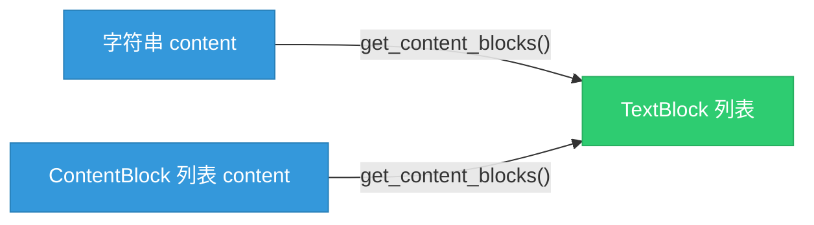
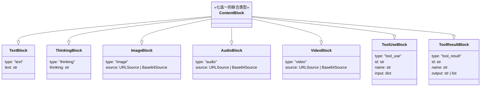
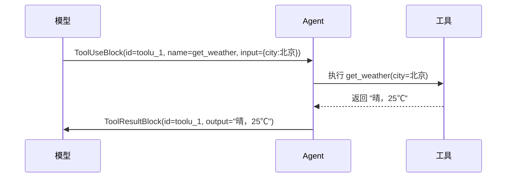
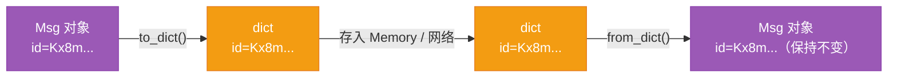

# 第 4 章 第 1 站：消息诞生

在前面几章里，我们准备好了工具箱——装好了 AgentScope，理解了它为什么把"同步的写法"和"异步的执行"分得那么清楚。现在，旅程正式上路。我们的导游是一条简单到不能再简单的代码：

```python
result = await agent(Msg("user", "北京今天天气怎么样？", "user"))
```

这一行做了两件事：先造出一条消息，再把它交给一个 Agent 处理。本章只管第一件事——那条 `Msg(...)` 是怎么从无到有、变成一个能在框架里到处流动的对象的。看起来平淡无奇，但 AgentScope 把多少心思藏在了一行 `Msg(...)` 里，是接下来几页想讲清楚的事。

> 一切 Agent 间的对话，无论多复杂，最小的流通货币都是同一种东西：一条带角色、带内容、带时间戳的 `Msg`。

> **上一章：[第 3 章 准备工具箱：初始化与异步](./ch03-toolbox.md)**

---

## 4.1 路线图

整本书第一卷都在追踪上面那一行代码的执行过程。把它拆成站点看，就是这样一条流水线：


红色那格就是我们现在站的位置——流水线的最上游。后面几章会一格一格往下走，直到消息走完一整圈，又安静地躺进 Memory。

本章只回答三个问题：一条消息里到底装了什么？它为什么设计成这个样子？它又是怎么做到既能装一句简单的问候，又能装下图片、音频、工具调用的？

---

## 4.2 知识补全：TypedDict，一种"自带说明书的 dict"

要理解 AgentScope 的消息设计，得先认识一个 Python 标准库里不太起眼的角色：`TypedDict`。它是后面整个 ContentBlock 体系的基石。

### 普通 dict 的痛

Python 的 `dict` 是个万能口袋——什么都能往里塞，但塞完之后没人记得里面有什么。类型检查器看着 `user["name"]` 两眼一抹黑：它可能是字符串，也可能是 None，甚至根本不存在。在多 Agent 系统里，一条消息会被序列化成 JSON、发到模型 API、再存进 Memory 读出来，如果内容结构全靠人脑记，调试时一定抓狂。

`TypedDict` 就是给 dict 戴上一副"说明书"：声明这个 dict 一定有哪些 key、每个 key 是什么类型。

```python
from typing_extensions import TypedDict

class UserInfo(TypedDict):
    name: str
    age: int

# 类型检查器知道 user["name"] 一定是 str
user: UserInfo = {"name": "Alice", "age": 30}
```

关键在于：运行时它**就是一个普通 dict**，没有任何额外方法或属性。类型标注只在静态分析和 IDE 提示时生效——你写的时候有人帮你盯着，跑起来零成本。

### 为什么不是 dataclass

Python 还有一个结构化数据容器：`dataclass`。它能定义带类型标注的字段，看起来好像也能干这活儿：

```python
from dataclasses import dataclass

@dataclass
class TextBlock:
    type: str
    text: str
```

但 dataclass 创建出来的实例**不是 dict**。它是一个对象。而 OpenAI 的 Chat Completion API、Anthropic 的 Messages API，期待的请求体都是 JSON——也就是 dict。如果用 dataclass，每次和 API 打交道都得做一次转换：`dataclasses.asdict(block)`，或者手写一个 `to_dict()`。多一层转换，就多一层出错的可能。

TypedDict 天然就是 dict，和 JSON 之间零距离：

```python
block = TextBlock(type="text", text="你好")  # 这就是一个 dict
json.dumps(block)                              # 直接序列化，无需转换
```

这条性质对 AgentScope 极其重要——消息内容块要在 Model Adapter 和 LLM API 之间来回穿梭，少一道转换就是少一道麻烦。

### `total=False` 是什么意思

你会看到 ContentBlock 的定义里都有这么一行：

```python
class TextBlock(TypedDict, total=False):
    type: Required[Literal["text"]]
    text: str
```

`total=False` 的意思是"不是所有字段都必须存在"。TypedDict 默认 `total=True`，所有字段都必填。一旦设成 `False`，就只有标了 `Required[...]` 的字段才是必填的，其余全是可选。这给了内容块一层弹性——比如 `ToolUseBlock` 的 `raw_input` 字段，只在某些模型返回原始输入时才有值，平时可以不存在。

| 选择 | 运行时本质 | 与 JSON 的距离 | 类型提示 |
|------|-----------|---------------|---------|
| 普通 dict | dict | 零距离 | 无 |
| TypedDict | dict（带说明书） | 零距离 | 有 |
| dataclass | 对象 | 需要转换 | 有 |

记住这张表，它解释了为什么 AgentScope 在"内容块"这种高频序列化的地方选了 TypedDict。

---

## 4.3 一条消息装了什么：Msg 的五个核心属性

终于回到正题。在 AgentScope 里，一条消息就是一个 `Msg` 对象。它的构造函数签名长这样：

```python
class Msg:
    def __init__(
        self,
        name: str,
        content: str | Sequence[ContentBlock],
        role: Literal["user", "assistant", "system"],
        metadata: dict[str, JSONSerializableObject] | None = None,
        timestamp: str | None = None,
        invocation_id: str | None = None,
    ) -> None: ...
```

六个参数，三个必填（`name`、`content`、`role`），三个可选。一旦你写下 `Msg("user", "你好", "user")`，这条消息就有了五个核心属性，外加两个自动生成的标识。

把它想象成一封寄出去的信，可以这样对应：

| 属性 | 类型 | 信件类比 | 用途 |
|------|------|---------|------|
| `name` | `str` | 寄信人署名 | 区分"是谁发的"，尤其在多 Agent 场景 |
| `content` | `str \| list` | 信的正文 | 消息内容，两种形态（见 4.4） |
| `role` | `Literal[...]` | 信封上的角色标签 | 对应 LLM API 的 user/assistant/system |
| `metadata` | `dict` | 信封背面的小字 | 附加元数据，如结构化输出 |
| `timestamp` | `str` | 寄出时间，精确到毫秒 | 何时诞生 |

两个自动生成的标识：

- **`id`**——一个短唯一标识符（Short UUID）。用的是 Base57 编码，刻意去掉了 `0/O`、`1/l` 这些肉眼容易混淆的字符，比标准 UUID 更短，更适合出现在日志和调试输出里。
- **`invocation_id`**——关联的模型调用 ID。用来回答"这条消息是在哪一次 API 调用里产生的"，是运行时追踪用的，不参与持久化。

> **设计一瞥：快速失败的两道闸门**
>
> 构造函数里有两处 `assert`：一个检查 `content` 必须是 str 或 list，一个检查 `role` 必须是三种合法值之一。这是典型的"快速失败"思路——参数不对，立刻在你眼前炸开，而不是让错误悄悄溜进流水线，等到 Formatter 或 Memory 那里才冒出一个莫名其妙的异常。早期把错误摁住，是调试体验的关键。

### 为什么 `role` 只有三个值

你可能注意到 `role` 被 `Literal["user", "assistant", "system"]` 死死锁住，只有三个取值。这不是随手画的边界——这三个角色正好对应主流 LLM API 的对话角色划分：

- `user`：用户发的消息。
- `assistant`：模型（Agent）回的消息。
- `system`：系统提示词，给整场对话立规矩。

AgentScope 没有自创一套角色体系，而是直接对齐 API 的既有约定。好处是：当 Formatter 把消息翻译成各家风 API 的请求体时，这一步几乎是零成本——`role` 字段原样搬过去就行。

---

## 4.4 content 的两种形态：便捷与灵活的平衡

`content` 是 Msg 里最有设计感的属性。它有两种形态，像一件可以两面穿的外套。

### 形态一：纯字符串

```python
msg = Msg("user", "你好", "user")
# msg.content 的类型是 str
```

这是绝大多数消息的样子——一句简简单单的文本。谁都不想为了发一句"你好"还得先写一个结构体。

### 形态二：ContentBlock 列表

```python
msg = Msg("user", [
    TextBlock(type="text", text="这张图片里有什么？"),
    ImageBlock(type="image", source={"type": "url", "url": "https://example.com/photo.jpg"}),
], "user")
# msg.content 的类型是 list
```

当一条消息要装多种内容——文字加图片、文字加工具调用、思考加回答——content 就退化成一个列表，每个元素是一个 ContentBlock。

为什么允许两种形态？这是个典型的**90/10 权衡**：九成的消息是纯文本，给它们最轻的写法；剩下的一成需要结构化，列表来兜底。而 Msg 提供了一个桥梁方法 `get_content_blocks()`，需要的时候自动把字符串包成 `TextBlock` 列表。也就是说，下游组件永远可以假设"内容是一组 block"，不必关心上游写的是字符串还是列表。



这张图说明了一件重要的事：无论上游怎么写，经过 `get_content_blocks()` 之后都统一成同一种形式。这就是"统一消息格式"的底气——下游的 Formatter、Memory、Model 都只跟 block 列表打交道。

---

## 4.5 七种内容块：ContentBlock 的家族

把 ContentBlock 看成一个"联合类型"——它不是一个具体的类，而是七种内容块的总称。每一条非纯文本消息，都是由这七种里的若干种拼起来的。



这七种可以分成三组来看，比较好记。

### 第一组：文本与思考

**TextBlock**——最基础的一种，一条纯文本。`"你好"` 这个字符串，等价于 `[TextBlock(type="text", text="你好")]`。

```python
class TextBlock(TypedDict, total=False):
    type: Required[Literal["text"]]
    text: str
```

**ThinkingBlock**——承载模型的"思考过程"。像 Claude 这类支持扩展思考（extended thinking）的模型，会先输出一段内心独白，再给出正式回答。这段独白不能丢进 `TextBlock` 里混在一起——它不是给用户看的回答，而是模型的草稿纸。所以单独给它一个类型。

```python
class ThinkingBlock(TypedDict, total=False):
    type: Required[Literal["thinking"]]
    thinking: str
```

> **设计一瞥：为什么 thinking 要单独成块**
>
> 把思维链和正式回答塞进同一个 TextBlock 看起来更省事，但会埋下隐患：Formatter 在把消息翻给模型 API 时，对"思考"和"回答"的处理方式完全不同——有些 API 要把 thinking 放进专门的字段，有些要剥离掉避免污染上下文。如果类型上不分，逻辑上就得靠字符串匹配去猜，脆且丑。一个 `type` 标签把两种语义隔开，下游处理起来干净利落。

### 第二组：多模态媒体

**ImageBlock / AudioBlock / VideoBlock**——三种媒体块。它们结构几乎一样，只是 `type` 不同。每种都接受两种来源：

- `URLSource`：`{"type": "url", "url": "https://..."}`——给一个网址，让 API 自己去取。
- `Base64Source`：`{"type": "base64", "media_type": "image/jpeg", "data": "..."}`——把文件直接编码成 Base64 字符串塞进去。

```python
class ImageBlock(TypedDict, total=False):
    type: Required[Literal["image"]]
    source: Required[Base64Source | URLSource]
```

AudioBlock 和 VideoBlock 把 `type` 换成 `"audio"` / `"video"`，其余照搬。媒体块的统一结构意味着 Formatter 写起来很省心——三种媒体一套逻辑。

### 第三组：工具的来与回

这是 ReAct 循环里最关键的一组。

**ToolUseBlock**——当模型决定"我要调一个工具"时，就产出这种块。它描述一次工具调用的请求：

```python
class ToolUseBlock(TypedDict, total=False):
    type: Required[Literal["tool_use"]]
    id: Required[str]
    name: Required[str]
    input: Required[dict[str, object]]
    raw_input: str            # 可选，模型原始返回的字符串
```

比如模型想查天气，就会产生这样一块：

```python
ToolUseBlock(type="tool_use", id="toolu_abc123", name="get_weather", input={"city": "北京"})
```

**ToolResultBlock**——工具执行完，结果用这种块装回来：

```python
class ToolResultBlock(TypedDict, total=False):
    type: Required[Literal["tool_result"]]
    id: Required[str]
    name: Required[str]
    output: Required[str | list]   # 可以是字符串，也可以嵌套更多 block
```

这两块通过 `id` 配对——一次工具调用的请求和结果，靠同一个 `id` 串起来。把它想成快递：`ToolUseBlock` 是寄件单，`ToolResultBlock` 是回执，两张单子上的编号必须对上，才知道这份回执属于哪次寄件。



注意 `ToolResultBlock` 的 `output` 可以是字符串，也可以是另一组 ContentBlock 列表——比如工具查回来一张图，那就嵌套一个 `ImageBlock`。这种"块中块"的能力，让工具返回的内容和普通消息内容用同一套表达方式。

### 七种块一览表

收个尾，用一张表把这七种块归拢：

| 块 | `type` 值 | 一句话用途 |
|----|----------|-----------|
| TextBlock | `"text"` | 纯文本 |
| ThinkingBlock | `"thinking"` | 模型思维链（草稿） |
| ImageBlock | `"image"` | 图片（URL 或 Base64） |
| AudioBlock | `"audio"` | 音频 |
| VideoBlock | `"video"` | 视频 |
| ToolUseBlock | `"tool_use"` | 工具调用请求 |
| ToolResultBlock | `"tool_result"` | 工具调用结果 |

每种块都用 `type` 字段自报家门——这个字段就是整个 ContentBlock 体系的"路由键"。Formatter 拿到一个块，先看 `type`，再决定怎么翻译成各家 API 的格式。这也是为什么 `type` 在每个块里都被标成 `Required`：它是必须存在的。

---

## 4.6 两种访问风格：属性 vs 方括号

讲到这儿，可能有人会问：消息内容块用 TypedDict，那 Msg 自己呢？它也是 dict 吗？

答案是：**不是**。Msg 是一个朴素的 Python class，没有任何父类。它的字段（`name`、`content`、`role` 等）是固定的一组，用点号访问就够了：

```python
msg.name        # OK
msg["name"]     # 不行，Msg 不支持方括号
```

这种"固定结构用属性"的设计是有意为之——Msg 的字段就那几个，不会动态增减，用属性访问最清晰，类型检查也最友好。

但框架里另一类对象就不一样了。比如模型 API 的响应 `ChatResponse`，不同模型返回的字段五花八门：有的带 `usage`，有的带 `stop_reason`，有的还有些私有字段。这种"结构会变"的对象，AgentScope 用了一个叫 **DictMixin** 的小工具——让它同时支持点号和方括号两种访问：

```python
# 用了 DictMixin 的对象
response = ChatResponse(content=[...])
response.content        # 点号访问，OK
response["content"]     # 方括号访问，也 OK
response["custom"] = 1  # 还能动态加字段
```

DictMixin 的原理说穿了很简单：Python 里 `obj.x = 5` 实际上是调用 `obj.__setattr__("x", 5)`，而 `obj["x"] = 5` 是调用 `obj.__setitem__("x", 5)`。DictMixin 把这两组魔法方法指向同一个实现（dict 自己的存取），于是点号和方括号操作的是同一份数据。

于是 AgentScope 形成了一条清晰的分工线：

| 场景 | 结构特征 | 访问方式 | 代表类 |
|------|---------|---------|--------|
| Msg 及其字段 | 固定、已知 | 属性（点号） | `Msg` |
| 内容块 ContentBlock | 固定结构，但天然是 dict | 方括号（TypedDict） | `TextBlock` 等 |
| 模型响应等动态结构 | 字段可能扩展 | 点号 + 方括号（DictMixin） | `ChatResponse` |

固定结构给属性，动态结构给 DictMixin，纯数据高频序列化的给 TypedDict——三种选择各自服务一类场景，互不越界。

---

## 4.7 消息怎么存下来：to_dict 与 from_dict

消息生来是要流动的，但流动的过程中总有需要"停下脚步"的时候——存进 Memory、发到网络、写进日志。这时候就需要把 Msg 转成 dict，或者反过来从 dict 重建 Msg。

Msg 提供了一对方法：`to_dict()` 和 `from_dict()`。`to_dict()` 的输出大致长这样：

```python
def to_dict(self) -> dict:
    return {
        "id": self.id,
        "name": self.name,
        "role": self.role,
        "content": self.content,
        "metadata": self.metadata,
        "timestamp": self.timestamp,
    }
```

注意一个细节：这里**没有包含 `invocation_id`**。这是个有意识的选择——`to_dict()` 的产物主要用来持久化和传输，而 `invocation_id` 是运行时追踪用的，属于"这一刻才有的上下文"，不该跟着消息一起被冻进存储里。

`from_dict()` 则是反过来，从一段 dict 数据重建 Msg。它有一个值得点出的小心思：构造函数本来已经会用 `shortuuid.uuid()` 生成一个新 `id`，但如果传入的 dict 里带着原来的 `id`，就用原来的。这保证了一条消息被存下来再读出来，`id` 不变——这对追踪消息的来龙去脉至关重要，否则存盘前后就成了两条不同的消息。



这条"id 不变"的保证，是后面 Memory 章节能做"对话回放""去重"等事情的前提。

---

## 4.8 设计一瞥：为什么是这种消息格式

走到这里，本章的几个设计选择已经摊开在桌上了。把它们并在一起看，AgentScope 的消息设计其实是围绕一个核心信念展开的——**统一的消息格式，是整个框架能跑起来的地基**。

AgentScope 1.0 论文在讲框架基础组件时是这么说的：

> "we abstract foundational components essential for agentic applications and provide unified interfaces"
>
> —— AgentScope 1.0: A Comprehensive Framework for Building Agentic Applications, arXiv:2508.16279, Section 2.1

"统一接口"听起来抽象，落到 Msg 上就是一句话：**框架里所有组件，都只认同一种消息类型**。Agent 发消息是 Msg，Formatter 收的是 Msg，Memory 存的是 Msg，Model 返回的还是 Msg。这一致性带来了三个好处：

1. **组件可替换**——你想换一个 Memory 实现，只要它能存读 Msg 就行，不用动其他部分。
2. **管道可拼接**——Msg 像流水线上的标准托盘，从一站流到下一站，无需中途改包装。
3. **调试可追踪**——任何一步出问题，打印出来的都是同一种结构，定位起来不用切换思维。

而 ContentBlock 用 TypedDict、Msg 用普通 class、动态响应用 DictMixin，这些"局部选择"都是在为这个"全局统一"服务的：让消息既能贴着 LLM API 的 JSON 跑，又能给开发者清晰的类型提示，还能在结构需要扩展时留出余地。

> **设计一瞥：统一格式的代价与回报**
>
> 统一不是免费的。为了让一条 Msg 既能装文本又能装图片和工具调用，`content` 不得不设计成"字符串或列表"两种形态，下游组件都得处理这种二义性。这是一种有意识的复杂度交换——用一个 `get_content_blocks()` 把分歧抹平，换来的是整条流水线对上游写法的无感知。框架的价值，往往就体现在这种"把复杂度收拢到一处"的取舍上。

---

## 4.9 检查点

走到这儿，停一下，用几个问题检查自己对消息系统的理解。答案都用散文讲，必要时带一两行示意片段。

**1. Msg 有哪些属性？哪些必填，哪些自动生成？**

必填的是 `name`、`content`、`role` 这三个，决定了一条消息"谁发的、发了什么、以什么身份发"。`metadata` 和 `timestamp` 是可选的，给不给你都行。自动生成的是两个标识：`id`（一段 Short UUID，方便出现在日志里）和 `invocation_id`（关联这次模型调用的运行时追踪号）。可以把 Msg 想成一封信，必填项是信封正面的署名、正文、角色标签，自动生成的是信封背面的条形码和寄出时间戳。

**2. content 什么时候是字符串，什么时候是 ContentBlock 列表？这个分歧是怎么被抹平的？**

发一句纯文本就用字符串，最轻省；一旦要塞图片、音频、工具调用这类结构化内容，就退成一个 ContentBlock 列表。分歧只在"消息怎么写"这一层存在，下游组件通过 `get_content_blocks()` 统一拿到列表形式——字符串会被自动包成 `TextBlock`。所以 Formatter、Memory 这些下游永远只面对"一组 block"，不必关心上游写的是字符串还是列表。

**3. 七种 ContentBlock 各自的 `type` 值是什么，分别装什么？**

把它们记成三组：文本与思考（`text` 纯文本、`thinking` 模型草稿）、媒体（`image`/`audio`/`video`，都接受 URL 或 Base64 两种来源）、工具的来与回（`tool_use` 调用请求、`tool_result` 调用结果，靠 `id` 配对）。每种块都靠 `type` 字段自报家门，Formatter 看一眼 `type` 就知道该怎么翻译。

**4. 为什么 ContentBlock 用 TypedDict 而不是 dataclass？**

因为内容块生来就是要被序列化成 JSON 发给 LLM API 的。TypedDict 运行时就是 dict，和 JSON 之间零转换；dataclass 创建的是对象，每次和 API 打交道都得 `asdict()` 一次，多一道手续多一处出错。在"高频序列化"这个场景下，TypedDict 是更贴肤的选择。

**5. Msg 的 `to_dict()` 为什么不包含 `invocation_id`？**

`to_dict()` 的产物是用来持久化和传输的——存进 Memory、发到网络上。`invocation_id` 是"这次运行中这条消息属于哪次 API 调用"的运行时上下文，换一次运行就失去意义，不该跟着消息一起被冻进存储。固定不变的才进 `to_dict()`，会变的留在运行时。同时，`from_dict()` 会保留原来的 `id`，保证消息存盘再读出来还是同一条。

如果这五个问题你都不用翻书就能答上来，那消息系统的地基你已经踩实了。接下来，消息要上路了。

---

## 4.10 下一站预告

消息已经诞生。它带着用户的请求，安安静静地等在一个变量里。下一步，它要被交到一个 Agent 手中——`ReActAgent` 会接收这条消息，决定怎么处理。

但 Agent 不是孤军奋战。它需要 Formatter 把消息翻译成 LLM API 能理解的格式，需要 Model 把翻译后的请求发给大模型，需要 Memory 记住这次对话。下一站，我们跟着这条消息，走进 Agent 的第一道门——看它是如何被接收、如何触发一次推理的。

> **下一章：[第 5 章 第 2 站：Agent 收信](./ch05-agent-receives.md)**