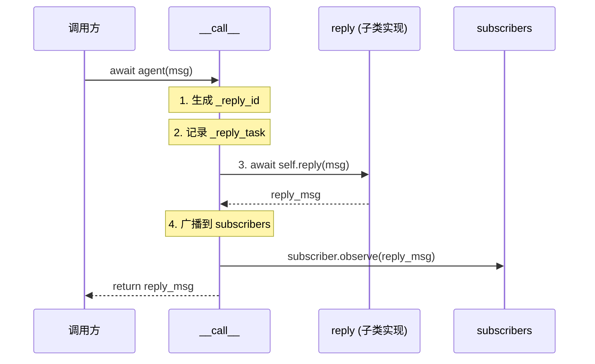
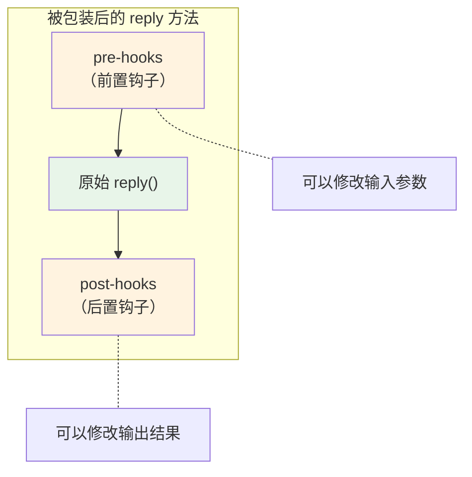
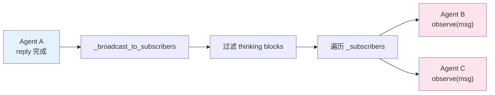
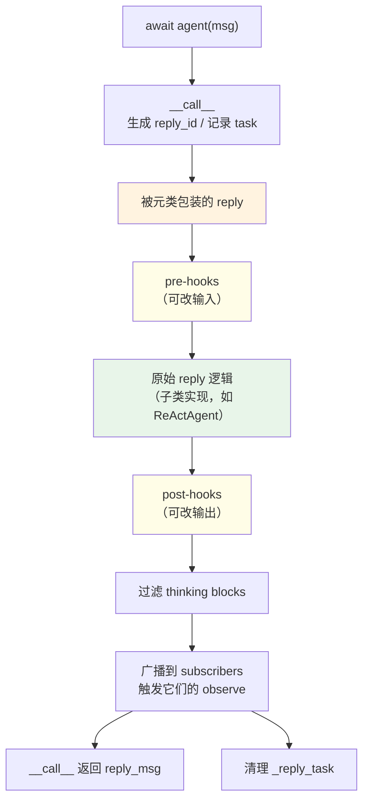

# 第 5 章 第 2 站：Agent 收信

> 一条消息从被 `await agent(msg)` 接住的那一刻起，就走进了一条看不见的流水线：先过一道安检门（Hook），再交给真正的逻辑（reply），最后还要在广播台上喊一嗓子。这章我们拆开这道流水线。

> **上一章：[第 1 站：消息诞生](./ch04-message-born.md)**

上一章我们见证了消息（Msg）的诞生。那条写着"北京今天天气怎么样？"的消息，现在要被交到 Agent 手里了。这就是我们的第二站——Agent 收信。

---

## 5.1 路线图

先看一眼全局路线，确认我们脚下踩在哪一格：


收信这一站，代码本身不长，但它背后藏着两套精巧的机制——**元类（Metaclass）** 和 **Hook 系统**。理解了它们，你就握住了 AgentScope 扩展性的根。本章不讲源码怎么写，而是讲清楚：Agent 收到消息后到底经过哪几道关，每一道关为什么这么设计。

---

## 5.2 知识补全：元类——"自动给方法套一层包装"

进入正题前，我们需要补一个 Python 进阶概念：**元类**。这一节只讲你需要懂的那一点，细节留到卷二。

### 一句话理解

元类是"类的类"。普通类定义对象的行为，元类定义**类本身**的行为。

你只需要记住一件事：**元类可以在类定义的那一刻，自动给某些方法套上一层包装。**

### 日常类比：连锁餐厅的后厨监控

想象你开了一家连锁餐厅。每开一家分店，总部都会自动派人去后厨装上监控摄像头。你不需要每家分店的店长自己去装——这条规则在分店"被创建"时就已经生效了。

元类就是那个"总部规则"。当你定义一个 Agent 子类时，元类会自动检查：这个类里有没有 `reply`、`observe`、`print` 方法？如果有，就给它们套上一层"监控"——也就是我们马上要讲的 Hook。

### 两种写法对比

不用元类，每个子类都得记得加装饰器，一旦忘了一个就是隐蔽的 bug：

```python
class MyAgent(AgentBase):
    @wrap_with_hooks   # 容易忘
    async def reply(self, *args, **kwargs):
        ...

    @wrap_with_hooks   # 也容易忘
    async def observe(self, msg):
        ...
```

用元类，类定义的那一刻包装就自动完成了：

```python
class MyAgent(AgentBase):           # AgentBase 注册了 _AgentMeta 元类
    async def reply(self, *args, **kwargs):   # 自动被包装
        ...

    async def observe(self, msg):             # 也自动被包装
        ...
```

这就是你全部需要知道的。子类的作者甚至不需要知道 Hook 的存在，只要继承 `AgentBase`，就自动拥有了 Hook 能力。

> **设计一瞥**：为什么用元类而不是装饰器？
>
> 装饰器方案把责任压在每个子类作者身上——忘了加 `@wrap_with_hooks`，Hook 就静默失效，没有任何报错。元类把这件事变成了"继承即生效"的默认规则，从一个"必须记住的约定"变成了一个"无法绕过的保证"。代价是增加了一点理解门槛：不熟悉元类的人在调试时，可能会困惑"为什么我的方法执行前后多了额外逻辑"。

---

## 5.3 收信的入口：`__call__` 四步走

当你写下 `await agent(msg)` 时，Python 会去调用 `agent.__call__(msg)`。这个 `__call__` 就是 Agent 的"收发室"，所有进来的消息都从这里进门。

它一共做四件事，我们一节一节拆。

### 第一步：生成回复 ID

```python
self._reply_id = shortuuid.uuid()
```

每次收信，都生成一个唯一 ID。这个 ID 在后面用来标识"这是哪一次回复"——流式输出、中断恢复，都得靠它区分。就像快递分拣中心给每一件包裹贴一个运单号，后面所有环节都靠这个号找人。

### 第二步：记录当前任务

```python
self._reply_task = asyncio.current_task()
```

把当前的 asyncio Task 记下来。这一步是为**中断机制**埋的伏笔：如果用户想打断 Agent 的回复，框架可以通过这个 Task 句柄把它取消掉。`agent.interrupt()` 的能力，根就在这里。

### 第三步：调用 reply

```python
reply_msg = await self.reply(*args, **kwargs)
```

这是核心动作：把收到的消息转发给 `reply` 方法。注意，`reply` 在基类里只是一个抽象占位：

```python
async def reply(self, *args: Any, **kwargs: Any) -> Msg:
    """The main logic of the agent."""
    raise NotImplementedError(...)
```

真正的逻辑在子类里实现——比如 `ReActAgent`。我们会在第 11 章钻进它。这里只需记住：`__call__` 自己不做业务逻辑，它只是个"门房"，把活儿派给 `reply`。

### 第四步：广播 + 清理

```python
finally:
    if reply_msg:
        await self._broadcast_to_subscribers(reply_msg)
    self._reply_task = None
```

注意这个 `finally`——无论 `reply` 是正常完成、抛异常，还是被中断，广播和清理都会执行。这一步保证了两件事：回复消息会通知到所有订阅者；`_reply_task` 被复位，下一次收信干干净净。

### 一张图收住四步



你会发现 `__call__` 自己几乎没有"业务"——它是一层薄薄的编排壳：编号、登记、转发、广播。真正的智能在 `reply` 里，而 `reply` 又被一层看不见的 Hook 包着。我们接着看这层壳。

---

## 5.4 Hook 系统：方法前后的"安检门"

### 钩子是什么

回到那个餐厅类比。餐厅后厨除了炒菜这道主流程（原始 `reply`），通常还会有两道"安检门"：

- **前置门**（pre-hook）：服务员下单后、菜进厨房前，先过一道检查。比如核对桌号、改一下口味备注。
- **后置门**（post-hook）：菜出锅后、上桌前，再过一道。比如摆盘、贴个"微辣"标签。

AgentScope 的 Hook 就是这两道门：

- **pre-hook** 在原始方法之前跑，**可以修改输入参数**。
- **post-hook** 在原始方法之后跑，**可以修改输出结果**。

三个被包装的方法 `reply`、`observe`、`print`，各自都有这么一对门。

### 三明治结构

被元类包装后的方法，执行起来像一个三明治：



用伪代码勾勒这个包装器的形态（注意这只是示意，不是源码抄录）：

```python
async def async_wrapper(self, *args, **kwargs):
    if getattr(self, hook_guard_attr, False):   # 防重入：已经在 Hook 里
        return await original_func(self, *args, **kwargs)

    normalized_kwargs = _normalize_to_kwargs(...)        # 参数归一化

    for pre_hook in pre_hooks:                           # 前置门
        modified = await pre_hook(self, normalized_kwargs)
        if modified is not None:
            normalized_kwargs = modified

    output = await original_func(self, **normalized_kwargs)  # 主流程

    for post_hook in post_hooks:                         # 后置门
        modified = await post_hook(self, normalized_kwargs, output)
        if modified is not None:
            output = modified

    return output
```

三件事值得记住：

1. **前置钩子能改输入**——所以你可以在消息真正进入逻辑前，做参数清洗、注入上下文、打日志。
2. **后置钩子能改输出**——所以你可以在结果返回前，做敏感词过滤、格式修正、埋点上报。
3. 钩子返回 `None` 表示"我不改"，返回非 `None` 才覆盖原值。这是钩子能优雅地"路过"而不破坏主流程的关键约定。

### Hook 的两层：实例级与类级

Hook 分两层，按作用范围组织：

| 层级 | 存储位置 | 生效范围 | 典型用途 |
|------|---------|---------|---------|
| **实例级** | `_instance_pre_reply_hooks` 等 | 单个 Agent 实例 | 给某一个特定 Agent 加定制逻辑 |
| **类级** | `_class_pre_reply_hooks` 等 | 该类的所有实例 | 给整类 Agent 统一加行为（如全局日志） |

执行顺序是**先实例级，后类级**。两层都默认是空的 `OrderedDict`，所以平时 `reply` 就老老实实跑原始逻辑。需要扩展时，用 `register_instance_hook` 或 `register_class_hook` 注册自定义 Hook。

这个分层很有用：你可以给"客服 Agent"这个类整体加一道合规审计钩子，同时再给某一个具体的"VIP 客服实例"加一道个性化钩子，两者互不打架。

### 防重入：为什么需要守卫

注意包装器开头这段：

```python
if getattr(self, hook_guard_attr, False):
    return await original_func(self, *args, **kwargs)
```

这是防重入的守卫。为什么要它？

当继承层次很深时——比如 `ReActAgent → ReActAgentBase → AgentBase`——每一层都可能定义自己的 `reply`，而元类给**每一层**的 `reply` 都套了包装。如果不加守卫，外层 `reply` 调用内层 `reply` 时，钩子会一层一层再跑一遍，造成重复执行甚至死循环。

守卫的语义是：**只有最外层那一层负责跑钩子，内层调用直接跳到原始函数**。就像大楼的安检只在入口做一次，进了大楼之后去哪个办公室都不再重复安检。

---

## 5.5 广播机制：回复之后的"喊一嗓子"

`__call__` 的最后一步是广播。当 `reply` 完成后，Agent 会把回复消息通知给所有订阅者。这一步是多 Agent 协作的基础。

### 两个关键细节

**细节一：过滤 thinking 块**

```python
broadcast_msg = self._strip_thinking_blocks(msg)
```

Agent 在回复过程中可能产生"思考"内容（thinking blocks）——那是模型内部推理的记录。这些内容是给 Agent 自己看的"草稿纸"，不该暴露给别的 Agent。所以广播前，会把 thinking 块剥掉，只发"正式答案"。

这就像你给同事发邮件时，不会把便签纸上那些涂涂改改的草稿也附上，只发正式那一版。

**细节二：订阅者按 MsgHub 分组**

订阅者列表不是一个大杂烩，而是按 MsgHub（消息中心）的名字分组的：

```python
self._subscribers: dict[str, list[AgentBase]] = {}
```

key 是 MsgHub 的名字，value 是该 Hub 里所有订阅 Agent 的列表。MsgHub 是 AgentScope 多 Agent 通信的核心组件——当一个 Agent 在某个 Hub 里发言，只有同一个 Hub 的成员会收到通知，不会串台。

广播的完整流程：



注意一个有意思的环：广播时调用的正是订阅者的 `observe` 方法，而 `observe` 本身也是被元类包装过的——它也有自己的 pre/post Hook。所以一条消息在 Agent 之间传递时，每经过一个 Agent，都会再过一道"安检门"。这是 AgentScope 把"收发可信、可观测"做成基础设施的体现。

> AgentScope 1.0 论文对 Agent 行为的设计目标是这样描述的：
>
> "we ground agent behaviors in the ReAct paradigm and offer advanced agent-level infrastructure based on a systematic asynchronous design"
>
> —— AgentScope 1.0: A Comprehensive Framework for Building Agentic Applications, arXiv:2508.16279, Section 2.2

这里的 "advanced agent-level infrastructure"，在本章的具体形态就是元类 + Hook + 广播这三件套：一个保证"方法必然被包装"，一个保证"行为可被插入与观测"，一个保证"消息在团队里能流动"。

---

## 5.6 把收信流水线串起来

现在我们把这一站的全景图拼出来。一条消息从被 `await agent(msg)` 接住，到 `__call__` 返回，走过的是这样一条流水线：



记住几个关键词，这一站就掌握了：

| 关键词 | 作用 | 类比 |
|--------|------|------|
| `__call__` | 收信门房，编排四步 | 快递分拣中心入口 |
| `_reply_id` | 标识一次回复 | 包裹运单号 |
| `_reply_task` | 支持中断 | 挂号条，随时能撤 |
| 元类 `_AgentMeta` | 类定义时自动包装方法 | 总部规则，分店开张即装监控 |
| pre/post Hook | 方法前后的安检门 | 后厨前置门 / 出锅后置门 |
| 防重入守卫 | 钩子只跑最外层一层 | 大楼入口安检只做一次 |
| `_subscribers` | 按 MsgHub 分组的订阅者 | 按频道分组的广播听众 |
| `_strip_thinking_blocks` | 广播前剥掉思考块 | 发邮件不带草稿纸 |

---

## 检查点

**1. `await agent(msg)` 实际上调用了什么方法？它自己干业务逻辑吗？**

调用的是 `AgentBase.__call__`。它自己几乎不碰业务，只做四件编排活：生成 `reply_id`、记录 `_reply_task`、把消息转发给 `reply`、最后广播并清理。真正的智能在子类的 `reply` 里。

**2. 元类 `_AgentMeta` 在什么时候生效？**

在**类定义时**——不是实例化时。当 Python 解释器读到 `class MyAgent(AgentBase):` 这行，元类的 `__new__` 就已经跑过了，`reply`/`observe`/`print` 在那一刻就被包上了 Hook。等你 `agent = MyAgent(...)` 创建实例时，包装早就完成了。

**3. Hook 的"三明治结构"是什么？前置和后置钩子分别能改什么？**

三明治是：pre-hooks → 原始方法 → post-hooks。前置钩子能**修改输入参数**，后置钩子能**修改输出结果**。钩子返回 `None` 表示"我不动"，返回非 `None` 才覆盖原值——这个约定让钩子可以优雅地"路过"。

**4. 为什么需要防重入守卫？**

因为元类给继承链上**每一层**的 `reply` 都套了包装。外层 `reply` 调用内层 `reply` 时，如果没有守卫，钩子会一层层重复跑。守卫保证"只有最外层跑钩子，内层直接跳到原始函数"，就像大楼安检只在入口做一次。

**5. 广播机制做了两件容易被忽略的事，分别是什么？**

第一件：广播前用 `_strip_thinking_blocks` 把思考块剥掉，不把模型的内部草稿暴露给别的 Agent。第二件：订阅者按 MsgHub 名字分组，只有同一个 Hub 的成员会收到通知，不会串台。而订阅者收信用的 `observe` 方法，本身也被元类包过——每经过一个 Agent 都再过一道 Hook。

---

## 下一站预告

消息到达 Agent 之后，`__call__` 把它交给了 `reply`。但 `reply` 做的第一件事不是去敲 LLM 的门，而是先把这条消息存进记忆（Memory）。

为什么？因为 LLM 要给出靠谱的回答，必须看到完整的对话历史——它是个"看着上下文说话"的角色。下一章，我们走进工作记忆的仓库，看消息是如何被存放、又如何被取出来喂给模型的。

> **下一章：[第 3 站：工作记忆](./ch06-memory-store.md)**
