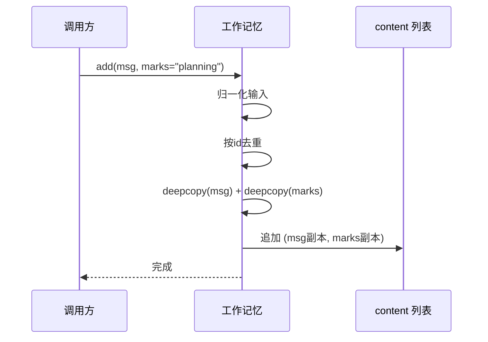
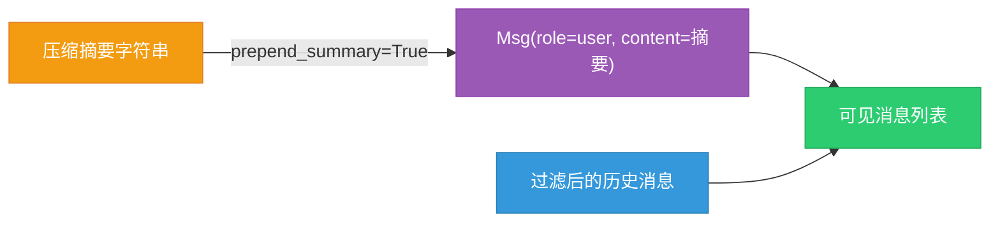

# 第 6 章 第 3 站：工作记忆

天气 Agent 收到了"北京今天天气怎么样？"这条消息。它没有立刻被送给模型去推理——在这之前，Agent 先得找一个地方把这条消息"放下"。这块地方叫**工作记忆（Working Memory）**。消息从外部世界涌入 Agent，第一件事不是思考，而是被记住。

> 工作记忆是 Agent 的短期记忆区：对话来了先存进去，推理时再翻出来，一条不漏，一条不乱。

> **上一章：[第 5 章 第 2 站：Agent 收信](./ch05-agent-receives.md)**

---

## 6.1 路线图

整本书第一卷都在追踪 `await agent(Msg(...))` 这一行的执行过程。把它拆成站点看，就是下面这条流水线：


红色那一格就是我们现在站的位置——消息已经出生，已经进了 Agent 的门，接下来要在 Agent 脑子里找个住处。本章要回答三个问题：工作记忆到底长什么样？它凭什么能让同一段对话被有选择地看见？它又为什么把消息存成"消息加一组标签"这种奇怪的搭配？

---

## 6.2 知识补全

### 抽象基类：先立规矩，再造东西

工作记忆的设计从一条抽象基类 `MemoryBase` 开始。抽象基类是 Python `abc` 模块提供的能力——它**只声明方法的签名，不给出实现**，并用 `@abstractmethod` 标记。子类必须把这些方法一个个填上，否则连实例化都做不到。

```python
class MemoryBase(StateModule):
    @abstractmethod
    async def add(self, memories, marks=None): ...
    @abstractmethod
    async def get_memory(self, mark=None): ...
```

这种"先立规矩"的好处是：上层代码只跟 `MemoryBase` 的方法签名打交道，根本不用关心底下到底是放在内存里的列表、还是 Redis、还是数据库。换实现的时候，业务代码一行不改。这种解耦在 Agent 框架里尤其值钱——记忆是每个 Agent 都要用的基础设施，把它锁死在某一种存储上，整条链路就被绑死了。

注意 `MemoryBase` 自己也不是凭空冒出来的，它继承自 `StateModule`——一个专门管"状态保存与恢复"的基类。子类只要把想被持久化的属性登记一下，就能自动跟着 Agent 的会话状态一起被存盘、读回。工作记忆里那个装消息的列表，就是这么被登记进去的。

### tuple 与 list：一对分工明确的好搭档

Python 有两种序列容器，长得像，性格不同：

- **tuple（元组）**：不可变。一旦创建，长度固定，不能增删元素。适合表示"一条记录"——比如一条消息配上它的一组标签，整体当成一个不可拆改的单元。
- **list（列表）**：可变。可以随时往里塞东西、往外拿东西。适合表示"会增长的集合"——比如一整段对话的消息历史。

工作记忆巧妙地让两者分工：外层用 list（对话会变长），每条记录内部用 tuple（一条消息和它的标签绑成一对），而标签本身又是个 list（一条消息可以被打好几个标签）。这种"可变容器套不可变单元，单元里再套可变容器"的嵌套，听起来绕，但每一层的选择都有明确理由，后面会逐一拆开。

### deepcopy：记忆是一份隔离的快照

`deepcopy` 会递归地把一个对象连同它引用的所有东西复制一份。工作记忆存消息时，对每条消息都做一次 deepcopy。这意味着：哪怕外部代码之后改了原来那条消息对象，已经存进记忆的那份也不会被波及——记忆里的消息是冻结在存入那一刻的样子。

这条保证听起来不起眼，但它让"记忆"配得上"记忆"两个字：存进去的是什么样，取出来就是什么样，不会被后续的副作用悄悄篡改。

---

## 6.3 工作记忆长什么样：一个列表，里面装着"消息加标签"

抽象基类立了规矩，具体实现 `InMemoryMemory` 则是把这套规矩落地成最朴素的形式：一个 Python 列表。这个列表就是工作记忆的全部存储。

它内部的样子可以这样理解：

```python
self.content: list[tuple[Msg, list[str]]] = []
```

读这行类型标注要拆成三层：

1. 最外层是 `list`，一个会增长的列表——对话进行多少轮，列表就有多长。
2. 每个元素是一个 `tuple`，把"一条消息"和"它的标签列表"绑成不可拆的一对。
3. 标签那部分又是一个 `list[str]`——一条消息可以同时挂着零个、一个或多个标签。

把它想象成一个图书馆的借阅卡柜子：

| 层级 | 容器 | 图书馆类比 |
|------|------|-----------|
| 外层 list | 对话历史 | 整面卡柜 |
| tuple | 一条记录 | 一张借阅卡 |
| Msg | 消息本身 | 书的内容信息 |
| list[str] | 标签集合 | 卡片上贴的彩色贴纸 |

卡片本身是固定的（tuple），但卡片上贴几张什么颜色的贴纸可以变（list[str]）。柜子可以一直往里塞新卡片（外层 list）。

为什么一条消息要配一组标签？因为同一段对话里，不同消息的"可见性"可能不一样。比如 Agent 在做规划时产生的草稿，只在自己脑子里转一圈，不该让用户看见；而正式回答既要给用户看，又要留作历史。标签就是用来给消息打这种"谁能看见"的标记的——这个机制有个正式名字，叫 **mark**。

---

## 6.4 mark 机制：给消息贴标签

mark 是工作记忆最有设计感的部分。它让同一段对话被不同的人以不同的样子看见——不是把消息复制成好几份，而是给每条消息贴上一组标签，谁该看见什么，取的时候按标签过滤。

`add` 方法存消息时，可以顺便打标签，签名长这样：

```python
async def add(
    self,
    memories: Msg | list[Msg] | None,
    marks: str | list[str] | None = None,
) -> None: ...
```

注意 `marks` 参数的类型——`str | list[str] | None`，三种形态都合法。这是 AgentScope 里常见的**宽进**设计：调用方想打一个标签就直接写字符串，想打多个就写列表，不想打就传 `None`，不用每次都费劲构造列表。框架内部会把这三种输入统一成一份标签列表再往下走。类似的宽容也体现在 `memories` 上——单条消息和一批消息都接受。

取消息的时候，`get_memory` 提供了两个对称的过滤参数：

```python
async def get_memory(
    self,
    mark: str | None = None,
    exclude_mark: str | None = None,
    prepend_summary: bool = True,
) -> list[Msg]: ...
```

- `mark`：正向过滤，只返回带着这个标签的消息。
- `exclude_mark`：反向排除，把带着这个标签的消息踢掉。

两个参数可以组合。比如 `mark="planning"` 加上 `exclude_mark="draft"`，意思就是"我要做规划用的那批消息，但别把草稿算进来"。两道过滤是串行执行的——先把带 planning 标签的全捞出来，再从里面把带 draft 标签的筛掉。


这里有一个需要使用者自己当心的细节：`mark` 和 `exclude_mark` 用同一个值时会发生什么？比如 `mark="planning"` 且 `exclude_mark="planning"`。答案是**返回空列表**——先把带 planning 的全捞出来，再全部排除掉。框架不做任何冲突检测，也不会报错。文档里特意注明"两者不应重叠"，这是调用者的责任。这种"把约定写进文档、而不是写进断言"的做法，是 mark 机制保持轻量的一种取舍。

标签不是只能加和查。`update_messages_mark` 是一个统一的标签编辑入口：传 `new_mark` 就是加标签，传 `new_mark=None` 配合 `old_mark` 就是摘标签，同时给两个就是换标签。它还支持按 `msg_ids` 或 `old_mark` 限定作用范围——只改某几条消息的标签，不动其他。

---

## 6.5 消息的来与回：add 与 get_memory

`add` 和 `get_memory` 是工作记忆最常被调用的两个方法，一个负责进，一个负责出。把它们合在一起看，能看清消息在记忆里的完整生命周期。

### add：进记忆时要做的三件事

一条消息从外面进来，`add` 大致做三件事：

1. **归一化输入**——把单条消息包成列表，把单个标签字符串包成标签列表。对外宽容，对内统一。
2. **去重**——默认情况下，已经存过的消息（按消息 `id` 判断）不会被重复存入。去重用的是集合查找，速度是常数级，比逐条比对快得多。如果确实想让同一条消息出现两次，可以传 `allow_duplicates=True`。
3. **深拷贝后追加**——每条消息连同它的标签列表都做一次 deepcopy，再追加到 `content` 列表里。

第三步值得多说一句。标签列表也做了 deepcopy，看着有点多余——不就是几个字符串吗？其实是为了避免一个隐蔽的坑：如果多条消息共享同一个标签列表对象的引用，那么给其中一条加标签，其它几条也会跟着变。深拷贝切断这种共享，让每条消息的标签都独立。



### get_memory：出记忆时的一条龙

取消息时，`get_memory` 串起了过滤、排除、摘要前置这一整套流程。先用 `mark` 正向捞，再用 `exclude_mark` 反向筛，最后再决定要不要把压缩摘要顶到列表最前面。返回的是一个纯净的 `list[Msg]`——tuple 和标签这些内部结构都被剥掉了，调用方拿到的就是一段可以直接交给模型的历史消息。

这层"剥皮"很重要：工作记忆内部用 tuple 存储是为了管理可见性，但模型推理、Formatter 格式化这些下游环节根本不关心标签，它们只想要一串消息。`get_memory` 就像一个前台，把后台复杂的存储细节挡在身后，递出来的永远是清爽的消息列表。

---

## 6.6 压缩摘要：用一句话顶替一长串

对话越长，记忆里的消息就越多，送给模型时消耗的 token 也越多。这是所有对话式 Agent 迟早要撞上的墙。工作记忆内置了一个轻量的应对手段——**压缩摘要**。

它的形态简单到只有一个字符串字段：

```python
self._compressed_summary: str = ""
```

默认是空字符串，相当于没启用。当外部（通常是某个记忆管理策略）认为一段历史已经足够久、可以浓缩了，就调用 `update_compressed_summary` 写入一段摘要文本。这段文本怎么生成、什么时候触发，工作记忆本身完全不管——它只负责把这段字存下来，并在合适的时候把它顶到消息列表前面。

`get_memory` 的 `prepend_summary` 参数（默认 `True`）控制的就是这件事：如果摘要非空，就在返回的消息列表最前面，塞一条以 user 角色承载这段摘要文本的 Msg。



把摘要放最前面，是因为模型读对话是从上往下读的——先给它一段"之前聊了什么"的总览，再接详细消息，等于先递一份会议纪要，再翻会议记录。

要特别强调一点：工作记忆**不会自己压缩**。生成摘要这种费脑子的活，属于上层的记忆管理策略。工作记忆只提供"存摘要"和"把摘要顶到前面"这两个原子能力，把它们组合成完整的压缩流程是别人的事。这种"只做最基础的、把策略留给上层"的分工，是抽象基类设计的一条暗线。

> **设计一瞥：摘要为什么是字符串而不是消息列表**
>
> 用一个字符串而不是一组 Msg 来当摘要，是因为摘要是"已经被消化过的结论"，不再具备消息的时序、角色这些结构。把它塞进消息列表时，是临时包成一条 user 消息的——包法是固定的，也不需要让调用方去构造结构化的 Msg。一个字符串字段，最小成本撬动了"长对话省 token"这件事。

---

## 6.7 删除与清理：CRUD 的最后一块拼图

完整的存储容器少不了删除能力。工作记忆提供三种删除口径，对应不同的"想删什么"：

| 方法 | 删除依据 | 什么时候用 |
|------|---------|-----------|
| `delete(msg_ids)` | 按消息 id | 知道具体要删哪几条 |
| `delete_by_mark(mark)` | 按标签 | 一类消息整体作废，比如把所有草稿清掉 |
| `clear()` | 全部 | 会话重启、彻底清空 |

`delete_by_mark` 接受单个标签或一组标签。传一组时，它会**逐个标签轮着过滤**——每轮把带当前标签的消息剔除，多轮下来就把这组标签涉及的消息全清掉。

这里有个设计上的细节值得点出来：`delete_by_mark` 和 `update_messages_mark` **不是抽象方法**。它们在 `MemoryBase` 里的默认实现是抛出 `NotImplementedError`。这是个挺讲究的安排——

如果把这俩方法也设成 `@abstractmethod`，那每一个记忆实现（哪怕是只想做最基础存取的）都被迫实现按标签删除/改标签的能力，哪怕它的存储模型根本不适合这么做。而如果不提供任何默认，调用方又没法判断"这个记忆到底支不支持按标签操作"。

现在的折中方案是：基类提供一个"会明确告诉你'我没实现'"的默认行为。子类按需覆盖：能做就做，不能做就让它继续抛 `NotImplementedError`，调用方一调用就知道这个能力在这个实现里不可用。这是一种把"可选能力"表达得很体面的方式——不强迫，也不含糊。

---

## 6.8 一组能力，多种实现

讲到这里，工作记忆的全部能力清单已经摊开了。把它们归拢成一张表：

| 能力 | 方法 | 抽象方法？ | 一句话用途 |
|------|------|-----------|-----------|
| 增 | `add` | 是 | 存消息，可带标签，默认去重 |
| 查 | `get_memory` | 是 | 取消息，支持标签过滤与摘要前置 |
| 按id删 | `delete` | 是 | 删指定消息 |
| 量 | `size` | 是 | 看存了多少条 |
| 清空 | `clear` | 是 | 一次性清光 |
| 按标签删 | `delete_by_mark` | 否（默认抛错） | 成批删一类消息 |
| 改标签 | `update_messages_mark` | 否（默认抛错） | 增/删/换标签 |
| 写摘要 | `update_compressed_summary` | 否（已实现） | 设置压缩摘要 |

五个抽象方法是"必须有的能力"——任何自称工作记忆的实现都得提供。两个非抽象方法是"可以有的能力"——子类按存储模型的特性决定要不要支持。这种"核心强制、扩展可选"的分层，让 `MemoryBase` 既能保证基础可用，又不对子类管得太死。

`InMemoryMemory` 是这套接口的参考实现，也是最常被用到的一种：所有消息都放在进程内存的一个列表里。它轻、它快、它不需要任何外部依赖。代价也明摆着——进程一结束，记忆就烟消云散。这对单次对话够用，但跨会话记住用户偏好、多个 Agent 共享一份记忆，它就力不从心了。

好在这正是抽象基类的价值所在：接口不变，换一种实现就行。后面会看到 Redis、SQLAlchemy 这些实现，它们处理的是跨进程、需要持久化的场景，但调用的还是同一组方法。对 Agent 的业务代码而言，记忆存在哪，几乎是无感的。

> **设计一瞥：为什么用 list[tuple[Msg, list[str]]] 而不是别的**
>
> 这个嵌套结构看着繁琐，其实每一层都踩在需求上。最外层用 list 不用 dict，是因为对话本质是时序性的——"你好"在"再见"之前，这个顺序不能丢，而 list 的天然语义就是有序遍历。每条记录用 tuple 而不是再开个 dict，是因为"一条消息加它的一组标签"是个不可拆的整体，tuple 正好表达"绑死的一对"。标签用 list[str] 而不是 set，是因为同一条消息上同一标签出现两次没意义但保序更直观，而且 deepcopy、序列化时 list 都比 set 顺手。没有一处是为了显得聪明，全是为了贴着真实需求走。

---

## 6.9 设计一瞥：工作记忆的三个取舍

把这一章的设计选择并在一起看，工作记忆其实是在三个维度上做了明确的取舍。

**第一，轻量优先。** `InMemoryMemory` 用一个 Python 列表存一切，没有索引、没有数据库、没有外部依赖。这让它能被随手创建、随手丢弃，适合绝大多数单进程对话。代价是持久化和跨进程要交给别的实现——但那本来就是另一类问题。

**第二，隔离优先。** 存入时 deepcopy，取出的消息和内部存储互不污染。这让"记忆"这个概念名副其实——存进去的就是那一刻的真相，不会被后续副作用悄悄改写。代价是存大消息时有拷贝开销，但在工作记忆这种"短期、量不大"的场景里，这点开销换来的是 correctness，值。

**第三，策略与机制分离。** 工作记忆只提供存、取、过滤、删、存摘要这些**机制**。什么时候该压缩、摘要该怎么生成、哪些消息该打什么标签，这些**策略**全留给上层。这让工作记忆能配合各种各样的记忆管理方案，自己却保持简单。AgentScope 1.0 论文在讲框架基础组件时是这么定位的：

> "we abstract foundational components essential for agentic applications and provide unified interfaces"
>
> —— AgentScope 1.0: A Comprehensive Framework for Building Agentic Applications, arXiv:2508.16279, Section 2.1

"统一接口"这四个字，落到工作记忆上就是：不管底下是列表还是数据库，对外都是同一组 `add` / `get_memory` / `delete`。Agent 的推理逻辑只认这套接口，永远不用知道记忆躺在哪。

---

## 6.10 检查点

走到这儿，停一下，用几个问题检查自己对工作记忆的理解。答案都用散文讲，必要时带一两行示意片段。

**1. 工作记忆的内部存储结构是什么？为什么要这么搭？**

最外层是一个 `list`，因为对话会增长、需要保序。列表里每个元素是一个 `tuple[Msg, list[str]]`，把一条消息和它的标签列表绑成不可拆的一对——这种绑定用 tuple 表达最贴切。标签本身又是 `list[str]`，因为一条消息可以挂多个标签，而且标签需要能增删。可以把整段记忆想成一面卡柜：柜子能加新卡片，每张卡片上贴着几张贴纸，卡片内容和贴纸绑在一起不会散。

**2. mark 机制解决什么问题？`mark` 和 `exclude_mark` 同时给同一个值会怎样？**

mark 给消息打"谁能看见"的标签，让同一段对话被不同视角有选择地看见——比如规划草稿只给 Agent 自己看，正式回答才进用户可见的历史。`get_memory` 用 `mark` 正向捞、`exclude_mark` 反向筛，两步串行。如果两者给同一个值，结果是空列表——先把带这个标签的全捞出来，再全部排除掉。框架不做冲突检测也不报错，"两者不应重叠"是写在文档里、留给调用方自己遵守的约定。

**3. `add` 存消息时为什么要做 deepcopy？标签列表为什么也要一起 deepcopy？**

deepcopy 让存进记忆的消息成为独立副本，外部之后对原消息的修改不会污染已存储的数据——记忆是冻结在存入那一刻的快照。标签列表也 deepcopy，是为了切断多条消息之间可能共享的同一个标签列表引用：不切断的话，给一条消息加标签会意外地牵动其它几条。多花一点拷贝开销，换来的是"每条消息的标签各自独立"这个不易踩坑的保证。

**4. 压缩摘要什么时候生效？它和工作记忆自身的职责边界在哪？**

当 `_compressed_summary` 这个字符串非空、且 `get_memory` 的 `prepend_summary=True`（默认就是 True）时，取消息会在列表最前面塞一条以 user 角色承载摘要文本的 Msg。但工作记忆**自己不生成摘要**——`update_compressed_summary` 只是写入外部给的一段文本。摘要怎么生成、什么时候触发，属于上层记忆管理策略的职责。工作记忆只提供"存摘要"和"把摘要顶到前面"这两个原子能力，把它们组合成完整压缩流程是别人的事。

**5. `delete_by_mark` 和 `update_messages_mark` 为什么不是抽象方法？**

因为它们是"可选能力"。如果设成抽象方法，每个记忆实现都被迫实现按标签删除/改标签，哪怕它的存储模型根本不适合。现在的做法是基类提供一个"抛 NotImplementedError"的默认实现——子类按需覆盖，能做就做，不能做就让它继续抛错，调用方一调用就知道这个能力在这个实现里不可用。这是一种把"可选能力"表达得既不强迫、又不含糊的方式。

如果这五个问题都能不翻书答上来，工作记忆的地基你已经踩实了。

---

## 6.11 下一站预告

`InMemoryMemory` 把所有消息放在进程内存的一个列表里。进程活着，记忆就在；进程结束，记忆消失。这对单次对话绰绰有余，但如果 Agent 需要跨会话记住用户偏好、或者一群 Agent 要共享同一份记忆呢？

工作记忆之外，还有**长期记忆**和**知识库**。下一站我们会看到长期记忆如何管理那些需要跨会话留存的持久知识，以及检索（Retrieval）如何从海量内容里捞出和当前提问最相关的那一部分。到那时，"记忆"这个词的内涵，会从"一个列表"扩展成"一整套知识的存与取"。

> **下一章：[第 7 章 第 4 站：检索与知识](./ch07-retrieval-knowledge.md)**