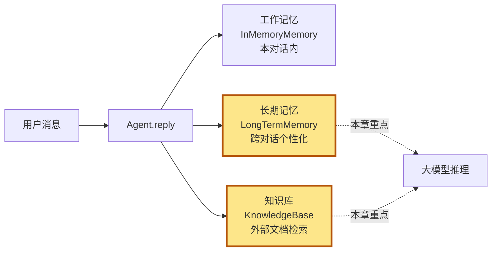
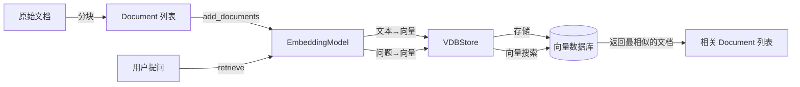
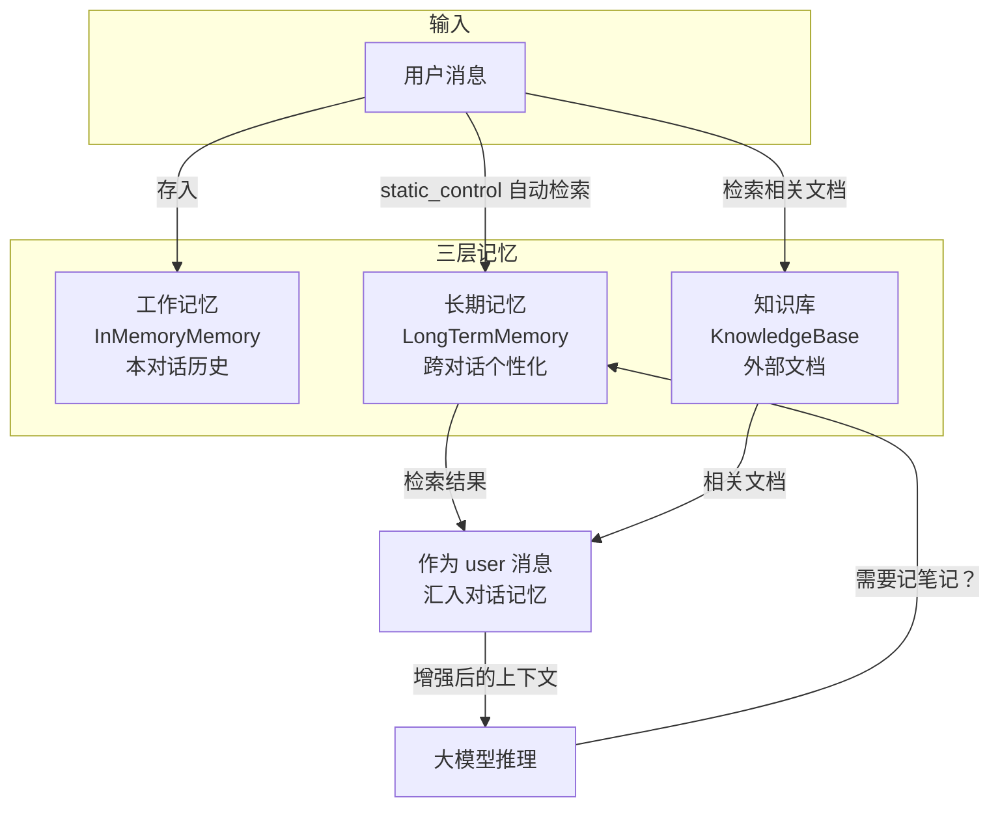

# 第 7 章 第 4 站：检索与知识

天气 Agent 收到"北京今天天气怎么样？"之后，光会查天气工具还不够。如果用户昨天才说过"我对花粉过敏，麻烦每天提醒我带口罩"，Agent 能记得吗？产品手册里写着"退货需在 7 天内申请"，Agent 能翻到吗？这两件事，工作记忆都帮不上忙——它只活在一次对话里，对话一结束就清零了。

> 记忆让 Agent 在时间上"有过去"，知识让 Agent 在空间上"有世界"。工作记忆只是此时此刻，长期记忆和知识库把它撑开成"跨对话的个性化"和"对外部世界的认知"。

> **上一章：[第 3 站：工作记忆](./ch06-memory-store.md)**

## 7.1 路线图

上一站我们把消息存进了工作记忆（`InMemoryMemory`），它是 Agent 的"短期记忆"。但只靠短期记忆，Agent 每次对话都像失忆一样从零开始。这一站，我们走出工作记忆，追踪两条平行的"长期记忆"路径，看 Agent 如何把信息留下来、把知识找回来。



读完本章，你会理解：

- 长期记忆的两种控制模式：`static_control` 与 `agent_control`，谁该来决定"记什么、查什么"
- RAG 知识库的完整管道：文档 → Embedding → 向量存储 → 检索
- 为什么一个 Agent 要同时背上"工作记忆""长期记忆""知识库"这三层

## 7.2 知识补全：Embedding 与向量检索

讲检索之前，必须先讲清楚一件事：**计算机怎么判断两段文本"意思相近"？** 答案是 Embedding。

### 把文本变成一串数字

Embedding（嵌入向量）就是给一段文本算出一组数字。语义越接近的文本，这组数字越接近。

```
"北京天气"     → [0.12, -0.34, 0.56, ...]    （假设 1536 维）
"北京气候"     → [0.11, -0.33, 0.55, ...]    （和上面几乎一样！）
"今天吃什么"   → [0.87,  0.22,-0.41, ...]    （完全不同方向）
```

这么一来，"找语义相关的文档"就被翻译成了一个数学问题：**找数字最接近的向量**。两个向量之间的距离（常用余弦相似度、欧氏距离）就是它们语义的"远近"。计算机做这种数学运算，比逐字匹配关键词快得多、准得多。

> 不用纠结 Embedding 模型内部是什么神经网络结构。记住这条流水线就够了：**文本 → 一串数字 → 用数字的距离衡量语义的远近**。

### 一个图书馆的类比

把 Embedding 想象成图书馆的"主题坐标"。每本书按内容被标上一个三维坐标（比如 [科幻度, 历史度, 爱情度]）。你想找"和《三体》类似的书"时，不用读完每本书，只要在三维空间里找离《三体》最近的几本书就行——它们大概率主题相近。

真实的 Embedding 维度不是 3 维而是几百上千维，但道理一样：**把"相似度"变成"距离"，让检索变成几何问题。**

### 为什么不是关键词搜索？

你可能问：直接用关键词匹配不就行了？问题在于关键词不懂同义词、不懂上下文。"退货政策"和"如何退换货"几乎没共同关键词，但语义一致；而"苹果手机"和"苹果好吃"都有"苹果"，语义却天差地别。Embedding 捕捉的是语义层面的一致性，这是它比传统全文搜索强的地方。

下面不管是长期记忆的检索，还是 RAG 知识库的检索，底层都靠 Embedding 这套机制在转。

## 7.3 长期记忆：跨对话的个性化

工作记忆里装的是"这一句话刚刚说了"，长期记忆里装的是"上一次对话留下的痕迹"。一个用户聊过三次天，工作记忆每次都从空白开始，但长期记忆会把三次的痕迹累积起来。

AgentScope 用 `LongTermMemoryBase` 这个抽象基类来定义长期记忆的"接口形状"。它继承自 `StateModule`——还记得吗？这意味着它也能 `state_dict()` / `load_state_dict()`，可以被序列化保存、跨会话恢复。

### 四个方法，两组职责

这个基类对外暴露四个方法，分成两组，区别在于**谁来调用**。

第一组是给开发者用的，会在 Agent 的 `reply` 流程里被自动调用：

```python
async def record(self, msgs: list[Msg | None], **kwargs) -> Any:
    """从消息中提取信息，存入长期记忆"""

async def retrieve(self, msg: Msg | list[Msg] | None, limit: int = 5, **kwargs) -> str:
    """根据当前消息检索长期记忆，返回一段字符串"""
```

第二组是给 Agent 自己用的，长得像普通的工具函数：

```python
async def record_to_memory(self, thinking: str, content: list[str], **kwargs) -> ToolResponse:
    """Agent 可以主动调用的'记笔记'工具"""

async def retrieve_from_memory(self, keywords: list[str], limit: int = 5, **kwargs) -> ToolResponse:
    """Agent 可以主动调用的'查笔记'工具"""
```

注意基类里这四个方法都只是声明——方法体直接抛 `NotImplementedError`。它定义的是"长期记忆应该长什么样"，至于怎么提取事实、存到哪、怎么查，留给具体的实现。

> **设计一瞥**：为什么基类方法都抛 `NotImplementedError`？
> 这是一种"按需实现"的约定。不是每个长期记忆实现都要支持全部四种用法。比如你只想让开发者自动控制检索、不想让 Agent 自由翻笔记，那只实现 `record` / `retrieve` 就够了，把工具方法留给基类的占位。接口先定下来，实现按场景挑着填。

### 两种控制模式：谁说了算

光有方法不够，还得决定**谁来触发**它们。ReActAgent 通过一个 `long_term_memory_mode` 参数把这件事说清楚，它有三个取值：`static_control`、`agent_control`、`both`。

| 模式 | 谁来决定记什么 / 查什么 | 怎么工作 |
|------|----------------------|---------|
| `static_control` | **开发者**在代码里预设 | 每次对话开始时自动检索长期记忆，结果作为 `user` 角色消息塞进对话记忆 |
| `agent_control` | **Agent**（大模型）自己判断 | 把 `record_to_memory` / `retrieve_from_memory` 注册成工具，Agent 像调天气工具一样自由决定何时记、何时查 |
| `both` | 两种都开 | 两条路径并存 |

用一个比喻来区分这两种模式。

**static_control 像一家有固定菜谱的食堂**：厨师（开发者）事先决定每天提供什么菜，到点就上，客人不用操心。简单可控，但客人想吃菜单上没有的就得饿着——开发者必须事先预测到所有该记的场景。

**agent_control 像一家点菜餐厅**：客人（Agent）自己看情况点菜。灵活，但客人可能忘了点、点了不该点的，或者乱点一通。Agent 可能记不住本该记的偏好，也可能把无关紧要的闲聊当大事记下来。

当 `agent_control` 打开时，ReActAgent 会把长期记忆的两个方法注册进 `toolkit`：

```python
if self._agent_control:
    self.toolkit.register_tool_function(long_term_memory.record_to_memory)
    self.toolkit.register_tool_function(long_term_memory.retrieve_from_memory)
```

对 Agent 来说，"记笔记"和"查笔记"从此和"查天气""发邮件"是同一类东西——都是它能调用工具来完成的动作。是否真的调用、什么时候调用、调用几次，完全由大模型在 ReAct 循环里自己决定。

> **设计一瞥**：为什么把记忆暴露成工具？
> 把记忆操作变成工具，是给 Agent 一种"反思"能力。它能在对话里突然意识到"这个偏好我该记下来"，然后主动调用 `record_to_memory`——这种自我驱动的记忆形成，是 `static_control` 那种"事先编程"做不到的。代价是不可控：你没法保证 Agent 一定会记住你希望它记的东西。卷四第 36 章会专门讨论这两者的取舍。

### 两个现成的实现：Mem0 与 ReMe

`LongTermMemoryBase` 是接口，真正干活的是它的实现。AgentScope 提供两条路线。

**Mem0 路线**：对接开源记忆管理库 Mem0。Mem0 会自动从对话里抽取"事实"（"用户喜欢 Python""用户在用 AgentScope 2.0.1"）并存储，检索时再把这些事实拼成上下文。它的卖点是"开箱即用、自动提取"，开发者不用自己写抽取逻辑。

**ReMe 路线**：AgentScope 自带的实现，特点是把记忆按用途分了三类：

- **个人记忆**：用户是谁、偏好什么、忌讳什么
- **任务记忆**：之前做过什么任务、踩过什么坑
- **工具使用记忆**：哪个工具用得顺手、参数怎么填最稳

这种分类背后是一个洞察：不同类型的"记住"服务于不同目的。记住"用户对花生过敏"是为了回答得体贴；记住"上次调那个 API 总是超时要加超时参数"是为了行动更准。把它们分开存，检索时按需取，比一股脑塞进同一个池子要清爽。

> 记忆不是越攒越多就好。一份不分类的记忆库，最后会变成一锅粥，检索出来的"相关记忆"互相打架。ReMe 的三分类，本质是在"记忆多了之后怎么不糊"这件事上先做了规划。

### 长期记忆的检索结果去哪了

不管是 `static_control` 自动检索，还是 `agent_control` 让 Agent 自己查，检索出来的内容最终都汇入同一个地方：**作为 `user` 角色消息加进对话记忆**，和系统提示、历史消息一起喂给大模型。

注意这个细节——检索结果不是写进系统提示，而是作为对话历史的一部分。原因很实在：系统提示通常是开发者写死的、整场对话不变的"人设"，而检索结果是每次对话都可能变动的"补充信息"，把它们放在对话历史里更符合"这一轮我额外知道了这些事"的语义。

## 7.4 知识库：对外部世界的认知

长期记忆解决的是"Agent 自己聊出来的经验"，但 Agent 还需要另一类知识：**外部文档**。

举个例子。你想让 Agent 根据公司的产品手册回答售后问题，手册有几百页。这种知识既不是 Agent"聊出来的"，也不该塞进系统提示（太长了，塞不下），更不该让大模型在训练时就记住（手册天天改，模型不可能天天重训）。答案是 RAG——检索增强生成：**先检索，再生成**。AgentScope 里这条路由叫 `KnowledgeBase`。

### RAG 的三个零件

`KnowledgeBase` 自己不存数据、不算向量，它是把三样东西粘起来的"协调者"。先认识这三样。

**第一个零件：Document（文档分块）**

一份长文档不能整篇当一个向量来检索——太粗了，命中精度差。标准做法是把长文本切成小块，每块独立成一个 `Document`，独立算向量、独立被检索。`Document` 这个数据结构大致长这样：

```python
@dataclass
class Document:
    metadata: DocMetadata      # 文档元信息：内容、ID、分块号
    id: str                    # 这个分块的唯一标识
    embedding: Embedding | None  # 这个分块的向量
    score: float | None        # 检索时的相似度得分
```

一个 `Document` 对应一个**分块**。`metadata` 里放着这块的原始文本和它在父文档里的位置（第几块），`embedding` 是这块算出来的向量，`score` 是检索时它和查询的相似度——这三个字段刚好覆盖了"存什么、是什么、有多相关"。

**第二个零件：EmbeddingModelBase（嵌入模型）**

它干一件事：把文本变成向量。

```python
class EmbeddingModelBase:
    model_name: str
    supported_modalities: list[str]   # 支持哪些模态：文本、图像……
    dimensions: int                    # 输出向量多少维

    async def __call__(self, *args, **kwargs) -> EmbeddingResponse:
        """调用嵌入 API，把文本变成向量"""
```

具体的实现对接各家嵌入服务：OpenAI、DashScope、Gemini、Ollama。`dimensions` 这个字段值得记一下——不同嵌入模型输出维度不同（1536、768、1024 都常见），而向量数据库的表结构通常要先定好维度。所以换嵌入模型往往意味着要重建知识库，这是 RAG 一个不太显眼的成本。

**第三个零件：VDBStoreBase（向量数据库）**

它负责"把向量存下来，按相似度找回来"：

```python
class VDBStoreBase:
    async def add(self, documents: list[Document], **kwargs) -> None: ...
    async def delete(self, *args, **kwargs) -> None: ...
    async def search(self, query_embedding: Embedding, limit: int, ...) -> list[Document]: ...
```

`search` 的输入是查询向量（不是查询文本——文本到向量这步由嵌入模型做），输出是一组按相似度排序的 `Document`。AgentScope 适配了多种向量库：Milvus、Qdrant、MongoDB、OceanBase、阿里云 MySQL。它们的接口形状统一在 `VDBStoreBase` 下，所以你写代码时基本不用关心底下到底是哪家。

> **设计一瞥**：为什么嵌入模型和向量库是分开的两个抽象？
> 因为它们是正交的两个选择。你可以用 OpenAI 的嵌入模型 + Milvus 的向量库，也可以用 DashScope 的嵌入 + Qdrant 的库，任意组合。把它们拆成两个抽象，意味着 4 种嵌入 × 5 种向量库 = 20 种合法组合都开箱可用，而不用为每种组合写一个类。这是"正交抽象"换来的乘法级灵活性。

### KnowledgeBase：把三样粘起来

三个零件凑齐了，`KnowledgeBase` 把它们组成一条流水线。它持有两个引用——一个嵌入模型、一个向量库——然后提供两个核心动作：

```python
class KnowledgeBase:
    embedding_store: VDBStoreBase
    embedding_model: EmbeddingModelBase

    async def retrieve(self, query: str, limit: int = 5, ...) -> list[Document]:
        """检索相关文档"""

    async def add_documents(self, documents: list[Document], ...) -> None:
        """添加文档（自动算 embedding 并存入向量库）"""
```

`add_documents` 是"灌库"：你给它一批文档分块，它内部调嵌入模型算向量、调向量库存下来，你不用操心中间步骤。`retrieve` 是"查询"：给它一句查询文本，它内部把查询也变成向量、再去向量库里搜最像的几块、把 `Document` 列表还给你。

完整的 RAG 流程可以画成这样：



注意一个对称性：**灌库和查询走的是同一条"文本→向量"的管道**。灌库时把每个分块变成向量存起来，查询时把问题也变成向量去找邻居。两边用同一个嵌入模型，才能保证"问题的向量"和"分块的向量"在同一个语义空间里可比——这是 RAG 能 work 的根本前提。换句说话，如果灌库用 A 模型、查询用 B 模型，两边向量维度都对不上，更别提语义可比了。

### 一个快递分拣的类比

把 RAG 想象成一个超大的快递分拣中心。

- **原始文档**：一整车一整车进站的包裹（长文本）
- **分块**：分拣员把大包裹拆成标准小件（Document）
- **Embedding**：每件小件贴上一个"语义条形码"（向量），同类的条形码数字接近
- **向量数据库**：按条形码摆上对应货架的巨型仓库
- **检索**：顾客来取件，拿着"我要找和这件最像的几件"，系统扫一遍条形码，把货架上数字最接近的几件递出来

顾客从来不用读完每个包裹的说明书，分拣员也从来不用记全仓库几百万件货——靠的都是"条形码相近 = 内容相近"这个数学等价。

## 7.5 Agent 怎么把三层记忆串起来

讲了长期记忆和知识库各自的内部结构，最后看 ReActAgent 怎么把它们和上一章的工作记忆一起用起来。

先说数量。Agent 可以挂**多个**知识库，不止一个：

```python
if isinstance(knowledge, KnowledgeBase):
    knowledge = [knowledge]
self.knowledge: list[KnowledgeBase] = knowledge or []
```

传一个也行，传一组也行。这意味着你可以同时挂"产品手册库""FAQ 库""历史工单库"三个，检索时分别去查，再把结果合并。这比把所有文档塞进同一个库要灵活——不同库可以用不同的嵌入模型、不同的分块策略。

再说时序。三层记忆在 `reply()` 流程里出场顺序是固定的：



**工作记忆**是底盘——每轮对话的当前消息、历史消息都存这儿，必选项。**长期记忆**和**知识库**是可选的增强层。流程大致是：用户消息进来，先存进工作记忆；如果开了 `static_control`，自动去长期记忆里捞相关的个性化信息；如果挂了知识库，根据用户消息去检索相关文档分块。这些检索结果都作为 `user` 角色消息汇入对话记忆，和系统提示一起在推理阶段喂给大模型。大模型据此回答——如果开了 `agent_control`，它还可能在回答过程中主动调用 `record_to_memory` 把新事实记下来。

三者分工可以这样归纳：

| 层 | 装什么 | 时间跨度 | 谁来填 |
|----|--------|---------|--------|
| 工作记忆 | 本次对话说了什么 | 一次对话 | 系统自动（每轮） |
| 长期记忆 | 跨对话的偏好、经验 | 跨对话持久 | 开发者预设 或 Agent 自主 |
| 知识库 | 外部世界的文档知识 | 离线灌入 | 开发者离线准备 |

> **设计一瞥**：为什么检索结果要"汇入对话记忆"而不是直接拼进系统提示？
> 系统提示是 Agent 的人设和指令，整场对话不变；检索结果是每轮都可能变的"补充材料"。把后者塞进前者会让系统提示反复重写、难以维护，也会干扰模型对人设的稳定遵循。把检索结果作为对话历史的一部分，更符合"这一轮我额外知道了这些"的语义，也让缓存、token 统计等机制更好处理。这是"什么信息放哪儿"的一个细小但关键的取舍。

### 一个公司组织架构的类比

把三层记忆想成公司里的三种"信息源"：

- **工作记忆**像会议室白板——这场会开到一半，大家刚说了什么，会散了就擦掉。每场会重新开始。
- **长期记忆**像员工的个人笔记本——这个客户上次提过什么要求、上次项目踩了什么坑，跨项目累积，跟着人走。
- **知识库**像公司的文档库——产品手册、规章制度、技术规范，所有人共享，由专人维护更新，开会时按需翻出来引用。

一个聪明的员工回答客户问题时，会同时动用这三样：白板上的当前讨论（工作记忆）、自己笔记本里的客户偏好（长期记忆）、文档库里的产品规范（知识库）。AgentScope 的 ReActAgent 就是按这个模型组织的。

## 7.6 一句话总览

这一站我们走完了 AgentScope 的"信息供给体系"。从上一站的工作记忆出发，向外延伸出两条长期路径：长期记忆把对话里聊出来的东西沉淀成跨对话的个性化，知识库把外部世界的文档变成可检索的认知。三者各司其职、可叠加使用，共同回答一个问题——**Agent 在回答用户之前，能调动的信息到底从哪来**。

> 我们抽象出智能体应用所需的基础组件，并提供统一接口与可扩展模块。
>
> —— AgentScope 1.0: A Comprehensive Framework for Building Agentic Applications, arXiv:2508.16279, Section 2.1

Memory 模块的可扩展设计，意味着存储后端可以从最简单的内存列表一路换到分布式向量数据库，而 Agent 的逻辑不用改。这正是"统一接口 + 可扩展模块"在记忆这一层的具体兑现。

## 检查点

到这里你应该能回答下面几个问题。先自己想，再对答案。

**1. 用户希望 Agent 自动记住"我喜欢用英文交流"，应该用 `static_control` 还是 `agent_control`？**

用 `agent_control`。"自动记住"意味着要由大模型在对话里**主动判断**——它得先识别出"哦，这是个语言偏好"，再决定记下来。`static_control` 是开发者预设的、每次 `reply` 开始固定检索/记录的模式，没法处理"什么时候该记"这种需要语义判断的场景。代价是 Agent 可能识别不出、或者记错了，这正是 `agent_control` 灵活性的另一面。

**2. RAG 灌库和查询为什么必须用同一个嵌入模型？**

因为两边都要把文本变成向量，并且要让"问题的向量"和"分块的向量"处在同一个语义空间里可比。不同嵌入模型输出维度不同（一个 1536 维、一个 768 维根本对不上），就算维度凑巧相同，语义空间的"坐标系"也不同——A 模型里距离近的，在 B 模型里未必近。用同一个模型，灌库的向量和查询的向量才在同一个空间里，相似度才有意义。

**3. 长期记忆的检索结果，为什么是作为 `user` 消息加入对话记忆，而不是写进系统提示？**

因为系统提示是"人设"，整场对话不变；检索结果是每轮都可能变的"补充材料"。把变动的检索结果塞进固定的系统提示，既难维护，也会干扰模型对人设的稳定遵循。作为对话历史的一部分，更贴合"这一轮我额外知道了这些"的语义。

**4. 工作记忆、长期记忆、知识库三者能不能同时用？分工是什么？**

能，而且这是常见配置。工作记忆装本次对话的历史，长期记忆装跨对话的个性化（用户偏好、任务经验），知识库装外部文档（手册、FAQ）。三者时间跨度和填充方都不同，叠加起来才能让 Agent"既有当前上下文，又有过去经验，又有世界知识"。

**5. 为什么嵌入模型和向量数据库是分开的两个抽象，而不是合在一起？**

因为它们是正交的两个选择——嵌入模型决定"文本怎么变向量"，向量数据库决定"向量怎么存怎么搜"。把它们拆开，意味着你可以任意组合（OpenAI 嵌入 + Milvus、DashScope 嵌入 + Qdrant……），不用为每种组合单独写一个类。这是用"正交抽象"换"乘法级灵活性"。

## 下一站预告

信息备齐了——工作记忆里有对话历史，长期记忆里有个性化补充，知识库里有相关文档。但这里有个绕不开的问题：大模型 API 不接受 `Msg` 对象，也不接受一堆裸的 `Document`，它只认特定格式的 JSON。`Msg` 怎么变成 OpenAI 要的 `messages` 数组？工具调用怎么编码进请求？这些"翻译"工作由谁来干？下一站我们追踪 **Formatter（格式器）**，看 AgentScope 怎么把内部统一的消息表示，翻译成各家模型 API 听得懂的语言。

> **下一章：[第 5 站：格式转换](./ch08-formatter.md)**
