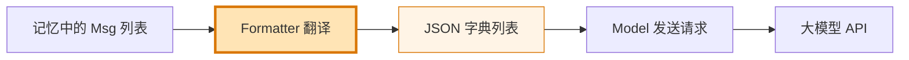
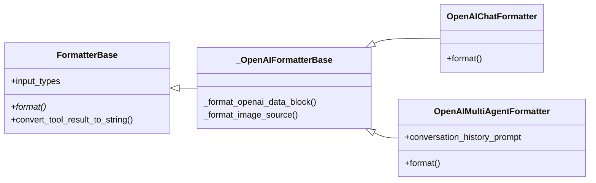
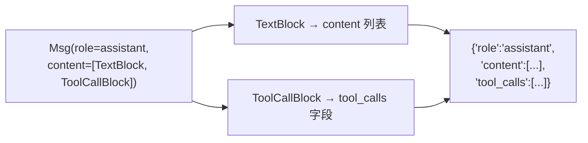

# 第 8 章 第 5 站：格式转换

前几站我们看着消息从诞生、被记住、到检索回来。现在消息整装待发，准备发给大模型——可就在临门一脚，发现一个尴尬的事：**Agent 内部说的"话"和大模型 API 听得懂的"话"，根本不是同一种语言**。

> `Msg` 是 AgentScope 的母语，JSON 字典列表才是各家模型 API 的官方语言。Formatter 就是夹在中间的那位翻译官。

> **上一章：[第 4 站：检索与知识](./ch07-retrieval-knowledge.md)**

## 8.1 路线图

消息在 AgentScope 里以 `Msg` 对象流动：有 `name`、`role`，`content` 里装着一串内容块（`TextBlock`、`DataBlock`、`ToolCallBlock`、`ToolResultBlock`……）。但 OpenAI 的接口要的是这样：

```python
{"role": "user", "content": "北京今天天气怎么样？"}
```

Anthropic 要的又不一样，Gemini 又是另一套。**同一份对话，要翻成好几国语言**。这一站我们就打开 Formatter（格式转换器），看翻译是怎么完成的，以及——为什么这件事要单独立一个组件。



读完本章，你会理解：

- Formatter 的继承结构：`FormatterBase`（接口）→ `_OpenAIFormatterBase`（共享逻辑）→ `OpenAIChatFormatter` / `OpenAIMultiAgentFormatter`
- 不同内容块（TextBlock、DataBlock、ToolCallBlock、ToolResultBlock、ThinkingBlock）在翻译后分别落到 JSON 的哪个位置
- 为什么 Formatter 必须独立于 Model，而不是让 Model 自己翻译

## 8.2 知识补全：API 的"官方语言"

要理解 Formatter 在干什么，先得看清它要翻译成的目标语言长什么样。

各家模型 API 接收的请求，本质上都是**一个 JSON 字典列表**。OpenAI 的 Chat Completions 接口大概是这种感觉：

```python
[
    {"role": "system", "content": "你是天气助手。"},
    {"role": "user", "content": "北京天气如何？"},
    {
        "role": "assistant",
        "content": "让我查一下。",
        "tool_calls": [
            {"id": "call_1", "type": "function",
             "function": {"name": "get_weather", "arguments": "{\"city\":\"北京\"}"}}
        ],
    },
    {"role": "tool", "tool_call_id": "call_1", "content": "晴，25℃"},
]
```

注意几个关键点，它们后面会反复出现：

- 每条消息有一个 `role`（system / user / assistant / tool）。
- 工具调用（tool call）不是塞在 `content` 里，而是放在**独立的 `tool_calls` 字段**。
- 工具结果不是 assistant 的回复，而是**一条独立的 `role: tool` 消息**，靠 `tool_call_id` 和调用配对。
- 图片、音频这类多模态数据，进 `content` 列表，但用专门的类型标记（如 `{"type": "image_url", ...}`）。

这套规矩是 OpenAI 定的。Anthropic、Gemini、DashScope 各有各的规矩——系统提示放哪、工具结果怎么表达、多模态怎么编码，全都不一样。**Formatter 存在的全部理由，就是吃下 AgentScope 的 `Msg`，吐出某一家 API 认的那套 JSON。**

打个比方：AgentScope 内部像一家跨国公司的总部，员工之间用统一的内部备忘录格式（`Msg`）交流。但要把备忘录发到海外的分公司（OpenAI 分公司、Anthropic 分公司、Gemini 分公司），每家分公司都要求按自己的报关单格式重填一遍。Formatter 就是总部那位熟悉各国报关格式的翻译兼报关员——你给它一摞内部备忘录，它给你一摞对应分公司的报关单。

> JSON Schema 是一种描述"JSON 长什么样"的规范——这个字段必须是字符串、那个字段只能取 user/assistant/system 之一。各模型 API 用 JSON Schema 来约束请求体。你不需要背 Schema 规范，只要记住 Formatter 的产出物就是"符合某家 API JSON 格式的字典列表"。

## 8.3 第一层：FormatterBase——只定一件事

整个 Formatter 体系的根是 `FormatterBase`，它的核心契约极其简单——**一个抽象方法**：

```python
class FormatterBase(BaseModel):
    input_types: list[str] = ["text/plain", ...]

    @abstractmethod
    async def format(self, *args, **kwargs) -> list[dict[str, Any]]:
        """把 Msg 对象格式化为符合 API 要求的字典列表"""
```

输入是 `Msg` 列表，输出是字典列表。整个抽象基类就抓住这一件事：**翻译的接口形状**。具体怎么翻，交给子类。

`FormatterBase` 还带了两个值得留意的"行李"。

**第一件：`input_types` 字段。** 它声明这个 Formatter 愿意放行哪些媒体类型，写法是 glob 风格的媒体类型模式，比如：

```python
input_types = ["text/plain", "image/*", "audio/*"]
```

意思是"文本、任意图片、任意音频我都收"。翻译时如果遇到 `input_types` 不涵盖的多模态块，Formatter 会跳过或降级处理（下一节细讲）。这一招让 Formatter 能根据目标模型的能力做裁剪——给一个只懂文字的模型配 `["text/plain"]`，图片就不会被硬塞过去。

**第二件：`convert_tool_result_to_string` 方法。** 它处理一类棘手的边缘情况：**工具返回了图片或音频，但目标 API 不允许在工具结果里塞多模态数据**。这时 Formatter 把工具结果拆成两部分——

```python
textual_output, multimodal_data = formatter.convert_tool_result_to_string(block.output)
# textual_output: 纯文本，放进 role:tool 消息的 content
# multimodal_data: 被拆出来的图片/音频块，稍后提升为一条独立的 user 消息
```

文本部分照常进 `role: tool` 消息；多模态部分则被"提升"成一条单独的 user 消息送给模型，并在文本里插一句类似"A(n) image file is returned and will be presented to you with the identifier [xxx]"的提示，告诉模型"图片等会儿单独给你看"。这种**降级 + 提示**的策略，保证工具的多模态产出不会因为某个 API 的限制而丢失。

## 8.4 第二层：provider 子类——真正在翻译

`FormatterBase` 只画了道门，真正干活的是各家 provider 的子类。以 OpenAI 系为例，共享逻辑放在一个私有基类 `_OpenAIFormatterBase` 里（专门处理图片、音频这类 `DataBlock` 怎么编码成 OpenAI 的 `image_url` / `input_audio` 格式），再由两个公开子类继承：



`OpenAIChatFormatter` 是最常用的一个，它身上最值得读懂的，是 **`format` 方法如何把一条 `Msg` 里的各个内容块分发到 JSON 的不同位置**。这里有一张关键的"落点表"：

| `Msg` 里的内容块 | 翻译后落到 OpenAI JSON 的位置 | 备注 |
|---|---|---|
| `TextBlock` | 消息的 `content` 列表：`{"type": "text", "text": "..."}` | 最常见 |
| `DataBlock`（图片/音频） | 消息的 `content` 列表：`{"type": "image_url", ...}` / `input_audio` | 受 `input_types` 过滤，URL/本地/base64 三种来源都能编码 |
| `ToolCallBlock` | 消息**独立的 `tool_calls` 字段**，不进 `content` | 形如 `{"id","type":"function","function":{"name","arguments"}}` |
| `ToolResultBlock` | **生成一条独立的 `role: tool` 消息**，靠 `tool_call_id` 配对 | 多模态产出会被 `convert_tool_result_to_string` 拆出提升为 user 消息 |
| `HintBlock`（提示块） | 拆成一条**独立的 `role: user` 消息** | 把上下文提示单独送进对话 |
| `ThinkingBlock`（思维链） | **静默丢弃** | OpenAI 历史消息不接受推理内容 |

这张表是理解 Formatter 行为的钥匙。最反直觉的两条，值得单独展开。

**反直觉一：工具调用和工具结果，都不在"当前消息"里。** 一条 assistant 消息如果既有文本又有工具调用，文本进 `content`，调用进 `tool_calls`，两者并列。而工具结果更"离家出走"——它根本不是 assistant 的回复，而是一条全新的 `role: tool` 消息，只能靠 `tool_call_id` 找回它回应的是哪次调用。Formatter 在遍历到 `ToolResultBlock` 时，会先把当前攒着的 `content`/`tool_calls` 冲洗（flush）成一条消息，再单独 append 一条 `role: tool` 消息。



**反直觉二：思维链被悄悄扔掉。** 模型（尤其是推理模型）回复里常带一段 `ThinkingBlock`，记录它"想了什么"。但 OpenAI 的 Chat 接口不接受把这种推理内容塞回历史——如果硬塞会报错。所以 Formatter 遇到 `ThinkingBlock` 直接 `pass`，什么都不输出。这是 Formatter 在替你处理"不同 API 对历史消息容忍度不同"的脏活：**生成时模型可以思考，但回放历史时这段思考得抹掉。**

> **设计一瞥**：注意 `DataBlock` 的编码是按"来源"分别处理的——远程 `https://` URL 原样透传；`file://` 本地路径会被读出来转成 base64 数据 URI；本来就是 base64 的直接拼数据 URI。换句话说，Formatter 不光翻译结构，还顺手把"数据住在哪"统一成 API 认的形式。一条本地图片，模型 API 是看不到你硬盘的，Formatter 得替它"读出来、装进信封"。

## 8.5 多智能体场景：OpenAIMultiAgentFormatter

`OpenAIChatFormatter` 适用于"一个用户 + 一个 Agent"的聊天场景，它用 OpenAI 的 `name` 字段来区分说话人。可一旦对话里出现多个 Agent（Agent 团队 / Agent Team），事情就复杂了：OpenAI 的 `role` 只有四种，塞不下"AgentA 对 AgentB 说话"这种结构。

`OpenAIMultiAgentFormatter` 就是为这种场景准备的。它的策略是**把消息分组**：先用 `_group_messages` 把整段历史切成两类片段——

- `tool_sequence`：一连串工具调用与结果（assistant 调用工具 + tool 返回结果）；
- `agent_message`：Agent 之间普通的对话消息。

然后对每组分别格式化。对于 `agent_message` 组，它会用一段固定的提示词把多 Agent 的历史包起来，塞进一条 user 消息——默认提示词长这样：

```python
conversation_history_prompt = (
    "# Conversation History\n"
    "The content between <history></history> tags contains "
    "your conversation history\n"
)
```

之所以这么做，是因为 OpenAI 的 `role` 体系表达不了"这是另一个 Agent 说的"，于是 Formatter 退一步：**把多 Agent 的对话历史当成"参考资料"喂给当前 Agent**，用 `<history>` 标签和一句提示词交代清楚来龙去脉。这是一个很典型的"适配器妥协"——目标 API 表达力不够时，Formatter 用提示工程补上语义。

> **设计一瞥**：`OpenAIMultiAgentFormatter` 的 docstring 特别注明它"兼容 OpenAI API 及 OpenAI 兼容服务（vLLM、Azure OpenAI 等）"。这正点出了 Formatter 独立的价值——凡是长得像 OpenAI 的接口，同一套翻译都能用。

## 8.6 各家 provider 的格式差异

AgentScope 为不同模型 API 各配了一个 Formatter。它们都继承自 `FormatterBase`，但翻译目标不同。下面这张表归纳了几家的关键差异，也是"为什么不能一个 Formatter 通吃"的核心证据：

| Provider | 系统提示放哪 | 工具结果怎么表达 | 多模态 |
|---|---|---|---|
| **OpenAI（Chat）** | `{"role": "system", "content": "..."}` 一条消息 | 独立的 `{"role": "tool", "tool_call_id": ...}` 消息 | 图片 `image_url`、音频 `input_audio`，进 content |
| **Anthropic** | **独立的顶层 `system` 参数**，不在 messages 列表里 | 放进 `{"role": "user", "content": [ToolResultBlock]}`，**没有 tool 角色** | 支持，但用 Anthropic 自己的 source 结构 |
| **Gemini** | `{"role": "user", "parts": [{"text": "..."}]}`，用 `parts` 而非 `content` | 不同的 parts 结构 | 支持 |
| **Ollama / DeepSeek / Moonshot / xAI** | 基本兼容 OpenAI Chat 格式 | 兼容 OpenAI 格式 | 视模型而定 |

差异最扎眼的两处正是**系统提示**和**工具结果**：

- OpenAI 把系统提示当成 `messages` 里的第一条；Anthropic 把它拎到请求顶层，`messages` 里压根没有 system 角色。
- OpenAI 用专门的 `role: tool` 消息表达工具结果；Anthropic 把工具结果塞回 user 消息的内容块里。

正因为这些结构性差异，每种 provider 都得有自己的 Formatter 子类——这不是"换个字段名"的小修小补，而是**消息列表的整体拓扑都不一样**。Formatter 把这种拓扑差异封装在内部，对上层的 Agent 完全透明：Agent 永远只生产 `Msg`，至于它最终被翻成 OpenAI 还是 Anthropic 的 JSON，Agent 不用关心。

## 8.7 设计一瞥：为什么 Formatter 独立于 Model

你可能会问：翻译这种事，让 Model 自己干不就行了？干吗非要单拎一个组件？

把它分开，最大的好处是**同一个 Formatter 可以搭配多种 Model，同一个 Model 也可以换 Formatter**。举几个真实场景：

- OpenAI、DeepSeek、Moonshot、xAI、本地 Ollama，全都兼容 OpenAI Chat 格式——它们共用同一套翻译逻辑，只是 HTTP 端点和密钥不同。如果 Formatter 长在 Model 里，每接一个兼容服务就得新写一个 Model 类。
- 反过来，同一个 OpenAI 模型，既可以配 `OpenAIChatFormatter`（单 Agent 聊天），也可以配 `OpenAIMultiAgentFormatter`（多 Agent 场景）。换的是"对话怎么组织"，不是"模型怎么调"。

代价当然是：用户需要自己挑选 Formatter 和 Model 的搭配。但这是一次性的配置成本，换来的是组合上的极大灵活。AgentScope 1.0 论文把这种思路概括为"统一接口 + 可扩展模块"：

> "we abstract foundational components essential for agentic applications and provide unified interfaces and extensible modules"
>
> —— AgentScope 1.0: A Comprehensive Framework for Building Agentic Applications, arXiv:2508.16279, Section 2.1

Formatter 的独立设计，正是"可扩展模块"思想的直接体现——新增一个模型提供商，只要写一个 Formatter 子类，不用动 Model 的代码；新增一种对话组织方式，也只要换 Formatter，不用换模型。

## 检查点

花几分钟自检一下，看看概念是否真的通了。

1. **一条 assistant 消息同时含有 `TextBlock` 和 `ToolCallBlock`，Formatter 翻译后这条消息在 OpenAI JSON 里长什么样？** 文本进 `content` 列表，工具调用进**并排的 `tool_calls` 字段**，两者同属一条 assistant 消息。工具调用不会混进 `content`。

2. **工具结果（`ToolResultBlock`）为什么不能直接塞回 assistant 消息的 content？** 因为 OpenAI 用一条**独立的 `role: tool` 消息**表达工具结果，并靠 `tool_call_id` 和当初的调用配对。它根本不是 assistant 的"发言"，而是工具的"回执"。

3. **一条带 `ThinkingBlock` 的 assistant 回复，回放历史时会发生什么？** Formatter 会**静默丢弃** `ThinkingBlock`——OpenAI 的 Chat 接口不接受把推理内容放回历史。生成时可以思考，回放时这段被抹掉。

4. **Anthropic 的系统提示和 OpenAI 有什么不同，为什么这逼出了一个独立的 Formatter？** OpenAI 把系统提示当成 `messages` 的第一条（`role: system`）；Anthropic 把它拎到请求顶层的 `system` 参数，`messages` 里没有 system 角色。这是消息列表拓扑层面的差异，不是字段重命名能解决的，所以必须各写一个 Formatter。

5. **为什么 Formatter 要独立于 Model，而不是让 Model 自己翻译？** 为了组合灵活：兼容 OpenAI 格式的多家服务可共用一套 Formatter；同一模型又可配不同 Formatter 适配不同对话组织（单 Agent / 多 Agent）。翻译与传输解耦，两边都能独立扩展。

> **参考要点**：
>
> 1. TextBlock → content；ToolCallBlock → 同条消息的 tool_calls 字段。
> 2. 工具结果是独立的 role:tool 消息，靠 tool_call_id 配对。
> 3. ThinkingBlock 在 OpenAI 历史中被静默丢弃。
> 4. Anthropic 系统提示在顶层 system 参数，不在 messages 里 → 需独立 Formatter。
> 5. Formatter 与 Model 解耦，换来"一套翻译多用 / 一模型多组织"的组合灵活性。

## 下一站预告

消息已经被 Formatter 翻译成目标 API 认的 JSON 字典列表了。下一站，我们追踪最核心的一步——**真正把请求发给大模型**。看看 `ChatModelBase` 如何把这份 JSON 送出去、如何接住响应、又如何处理流式返回，把模型的回复再变回 `Msg`。

> **下一章：[第 6 站：调用模型](./ch09-model.md)**