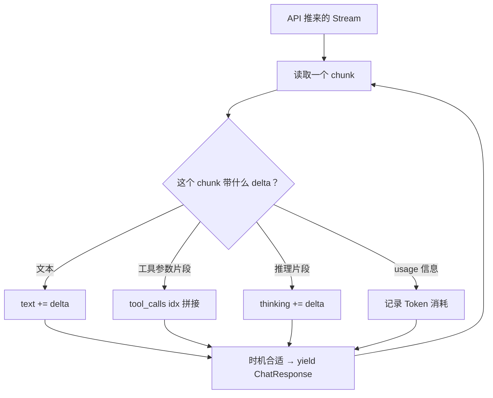
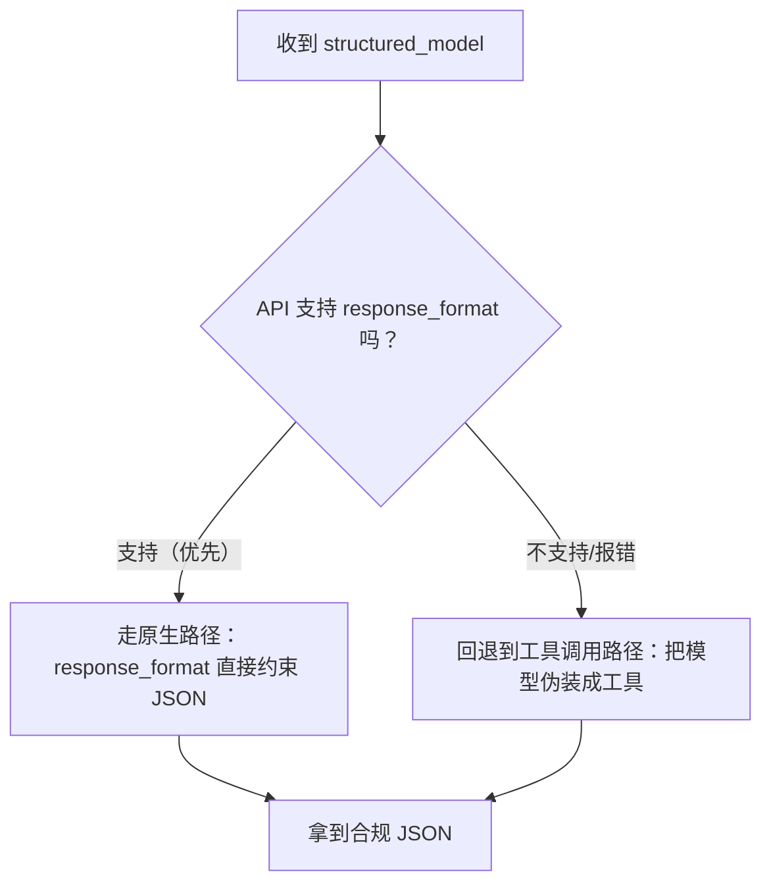
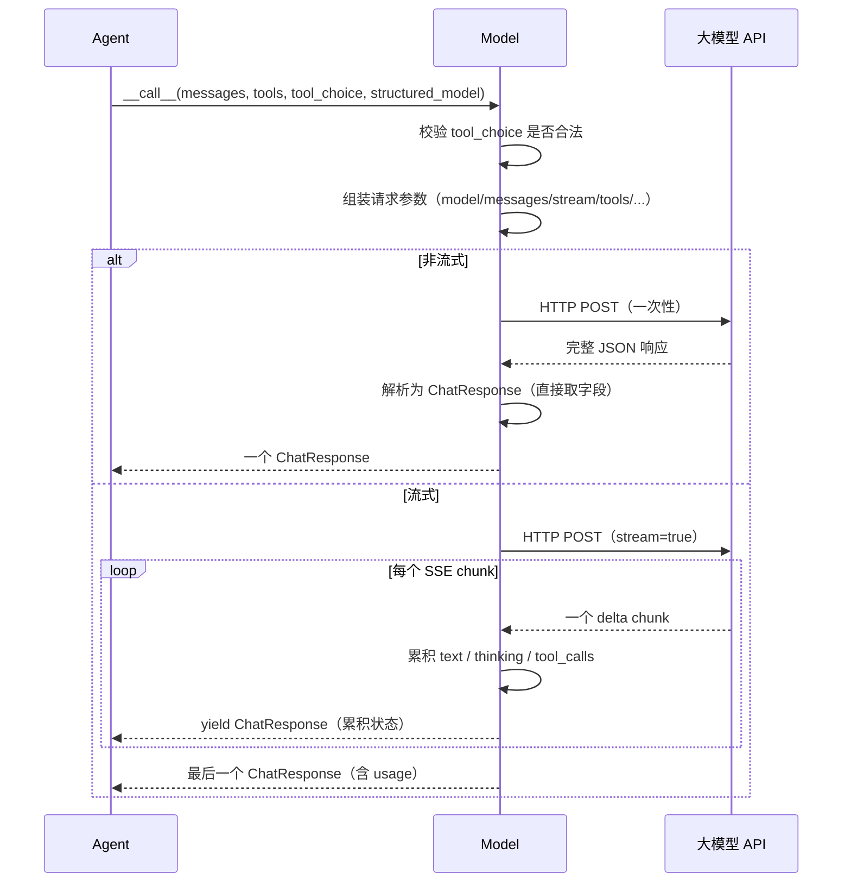

# 第 9 章 第 6 站：调用模型

上一站，Formatter 把内部备忘录翻成了 OpenAI（或 Anthropic、Gemini）认的 JSON 字典列表。报关单齐了，货还没出门。真正把这份单子塞进信封、贴上邮票、送进大模型那头、再等着拆回信的，是一个夹在 Agent 和 API 之间的角色——**Model（模型适配器）**。

> Formatter 负责翻译，Model 负责投递与回执。它把各家 API 千差万别的请求/响应，收拢成框架里统一的 `ChatResponse`，让上层 Agent 完全不用关心自己到底在跟哪家的模型打交道。

> **上一章：[第 5 站：格式转换](./ch08-formatter.md)**

---

## 9.1 路线图

到这一站为止，消息已经走完了"内部旅程"——诞生、收信、入记忆、被检索、翻成目标 API 的 JSON。现在它要离开 AgentScope 的国境，跨海去大模型的服务器走一遭，再带着回复回来。这一来一回，正是 Model 的工作。


读完本章，你会理解：

- `ChatModelBase` 这个统一接口凭什么能盖住 OpenAI、Anthropic、Gemini、DashScope、Ollama 这一票形态各异的模型；
- 流式（stream）和非流式两种返回方式到底差在哪，`AsyncGenerator` 在这里扮演什么角色；
- 模型的回复如何被拆成 `TextBlock` / `ToolUseBlock` / `ThinkingBlock` / `AudioBlock` 四种内容块，装进一个统一的 `ChatResponse`；
- 所谓"结构化输出"是怎么把一个 Pydantic 模型"伪装"成工具调用，骗模型吐出合规 JSON 的。

---

## 9.2 知识补全：异步生成器与"打字机"

要读懂 Model 的接口，得先补一个 Python 概念：**异步生成器（AsyncGenerator）**。

普通的异步函数，`await` 一次，拿一个结果，结束。就像写信问朋友问题，等几天，收到一封完整的回信。但大模型的"流式输出"不是这么回事——它是**一边想一边往外吐字**，像你看着对方在即时通讯软件上一个字一个字地敲。

异步生成器就是为这种"一个一个给"的场景准备的。它的形态是：

```python
async for chunk in model(messages):
    # 每循环一次，拿到一小段
```

`model(messages)` 此时不再返回一个完整对象，而是返回一个**可以反复 `yield` 的管道**。每来一小段（一个 chunk），循环体就被触发一次。用户在界面上看到的"打字机效果"，底层就是这个。

| | 非流式（`stream=False`） | 流式（`stream=True`） |
|---|---|---|
| 等待体验 | 干等几秒，一次性蹦出全文 | 边等边看，第一个字很快出现 |
| 返回类型 | 一个 `ChatResponse` | 一个 `AsyncGenerator`，反复产出 `ChatResponse` |
| 适合场景 | 后台批处理、要完整结果再决策 | 聊天界面、要给用户即时反馈 |
| 解析复杂度 | 直接取字段，简单 | 要把零散的 delta 一点点拼起来，复杂 |

Model 的接口签名把这两种形态用一个联合类型盖在了一起：

```python
async def __call__(self, ...) -> ChatResponse | AsyncGenerator[ChatResponse, None]:
```

这其实是一种妥协——调用方得自己判断这次拿到的是"一个对象"还是"一台打字机"。设计一瞥里我们会聊为什么 AgentScope 选了这种分叉，而不是把两者强行统一。

> **设计一瞥**：另一种设计是让流式和非流式都返回 `AsyncGenerator`，非流式只是 `yield` 一次就结束——接口统一，调用方代码只有一份。AgentScope 没这么做，因为绝大多数调用方只用其中一种模式，强行统一反而让"只想要一个完整结果"的代码也得写 `async for`。把分叉暴露在类型上，是"诚实比聪明更重要"的取舍。详见卷四第 33 章。

---

## 9.3 ChatModelBase：一个接口盖住所有家

整个 Model 体系的根是 `ChatModelBase`。它的契约极其克制——基本上只规定了"模型对象可以像函数一样被调用"这一件事：

```python
class ChatModelBase:
    model_name: str    # 模型名称，如 "gpt-4o"
    stream: bool       # 是否流式输出

    async def __call__(self, *args, **kwargs) -> ChatResponse | AsyncGenerator[ChatResponse, None]:
        ...
```

注意是 `__call__`——这意味着模型对象本身就能当函数用：

```python
response = await model(messages, tools=...)
```

这一行背后发生的事，各家实现天差地别：OpenAIChatModel 走的是 OpenAI 的 `/chat/completions` 端点；AnthropicChatModel 走的是 Anthropic 的 `/messages`；DashScope、Gemini、Ollama 又各有各的 SDK。但对上层 Agent 来说，它们长得一模一样——都是一个能 `await` 的"黑箱"，吞进消息列表，吐出 `ChatResponse`。

打个比方：Model 就像机场的"统一航站楼"。不管你坐的是哪家航空公司的飞机（OpenAI 航空、Anthropic 航空、Gemini 航空），办登机牌、过安检、登机的流程对外都一样；区别只是廊桥后面停的飞机不同、飞的航线不同。Agent 这个"旅客"只需要知道"去航站楼登机"，不需要关心自己坐的是哪家。

`ChatModelBase` 上还有一个小工具方法 `_validate_tool_choice`，它和"工具选择策略"有关，我们在 9.6 节单独讲。先看 Model 真正产出的东西——`ChatResponse`。

---

## 9.4 ChatResponse：把回信拆成内容块

模型回信了。但这份回信里装的未必只是文字——可能是一段话，也可能是一张"请帮我调用 `get_weather`"的工具调用单，推理模型还可能附上一段"内心独白"，语音模型甚至可能直接给音频。

AgentScope 的做法是：**把这些形态各异的内容，统一拆成若干个"内容块（ContentBlock）"，装进一个 `ChatResponse`**。它的核心字段长这样：

```python
@dataclass
class ChatResponse:
    content: Sequence[TextBlock | ToolUseBlock | ThinkingBlock | AudioBlock]
    id: str
    created_at: str
    type: Literal["chat"]
    usage: ChatUsage | None
    metadata: dict | None
```

`content` 是主角——一个内容块列表。四种可能的成员：

| 内容块 | 含义 | 什么时候出现 |
|--------|------|-------------|
| `TextBlock` | 普通文本回答 | 模型直接回话 |
| `ToolUseBlock` | 工具调用（名字 + 参数） | 模型决定"我得借助工具" |
| `ThinkingBlock` | 推理模型的内部思考过程 | o1/o3/DeepSeek-R1 这类推理模型 |
| `AudioBlock` | 语音数据 | 语音模型返回音频 |

为什么要拆成块，而不是像 OpenAI 原生响应那样，文本放 `content`、工具调用放 `tool_calls` 两个独立字段？因为**同一次回复里，这些内容是可能并存的**。推理模型经常是"先思考一段，再给出结论，中间还可能插一个工具调用"。用列表把它们按顺序串起来，才不会丢掉"谁先谁后、谁挨着谁"的信息。这也和上一章 Formatter 看到的 `Msg.content` 是一个块列表的设计一脉相承——整个框架都在用"内容块列表"这个统一形状。

除了 `content`，还有 `usage` 字段值得单独看一眼：

```python
@dataclass
class ChatUsage:
    input_tokens: int     # 输入 Token 数
    output_tokens: int    # 输出 Token 数
    time: float           # 本次调用耗时（秒）
```

每次调模型都在烧 Token，烧多少得记账。`ChatUsage` 就是这本账——它在卷二讲成本控制、限流、缓存时会反复用到。

---

## 9.5 流式：把 delta 一点一点拼起来

现在重点看流式。这是 Model 里最难、也最有意思的一段。

非流式很简单：API 一次性返回完整 JSON，框架直接从里面取 `content`、`tool_calls` 就行。流式则是 API 把回复切成无数个小 chunk，通过 SSE（Server-Sent Events）一条一条推过来。**每个 chunk 只带一小段增量（delta）**——也许是半个词，也许是工具参数 JSON 里的一截，也许是几个字符的推理。

解析流式响应，本质上是在做"拼图"。框架内部维护着几个累积变量：

```python
text = ""                       # 文本一点点往这里加
thinking = ""                   # 推理内容往这里加
audio = ""                      # 音频往这里加
tool_calls = OrderedDict()      # 工具调用按索引累积
```

每收到一个 chunk，就判断它带的是哪种 delta，往对应的变量上拼。到了合适的时机（比如一段文本结束、一个工具调用凑齐），就 `yield` 一个 `ChatResponse` 给上层。整个过程像下面这样：



这里有两个容易被忽略的细节：

**第一，每次 `yield` 出去的，是"累积后的完整状态"，不是"这次的增量"。** 也就是说，第 N 次 yield 的那个 `ChatResponse.content` 里的 `TextBlock`，装的是从开头到现在拼出来的全部文本，而不是只有这一个小 chunk。这样调用方每收到一次，直接覆盖显示就行，不用自己做累加。这是"打字机效果"能简单实现的关键。

**第二，工具调用的参数会被切成好几段发过来。** 模型生成 `{"city": "北京"}` 这种参数 JSON 时，不是一个 chunk 吐完整段，而是 `{"ci` → `ty":` → `"北京` → `"}` 这样零碎地来。框架得按工具调用的索引（第几个工具调用）把碎片按顺序粘起来，粘完了还得做一次 JSON 修复——因为碎片拼起来未必是合法 JSON（可能少了闭合括号、引号没配齐）。这就是为什么非流式有 `_json_loads_with_repair` 一次修复，流式有专门的"逐步修复"逻辑在盯着这个拼接过程。

两种模式的对比，可以浓缩成一张表：

| | 流式 | 非流式 |
|---|---|---|
| 输入 | 一个 `AsyncStream`，多个 chunk | 一个 `ChatCompletion` 对象 |
| 累积 | 需要 `text +=`、按索引拼 `tool_calls` | 直接取 `choice.message.content` |
| 产出 | 多次 yield，每次含累积后的完整状态 | 一次性返回一个 `ChatResponse` |
| JSON 修复 | 边拼边修复，逐步纠正 | 用 `_json_loads_with_repair` 一次修复 |

---

## 9.6 工具选择策略：tool_choice

Model 还要处理一件和工具有关的事：**当 `tools` 参数告诉了模型"有这些工具可用"时，模型到底该不该调？** 这由 `tool_choice` 参数控制。

`tool_choice` 有四类取值：

| 值 | 含义 |
|----|------|
| `"auto"` | 模型自己判断要不要调工具（默认） |
| `"none"` | 明令禁止调工具，哪怕 `tools` 给了 |
| `"required"` | 强制必须调工具，不许只回文字 |
| `"get_weather"` 这样的具体名字 | 指定调某个工具 |

Model 在发请求前，会用 `_validate_tool_choice` 做一道校验。逻辑很直白：如果传的是三个预设模式（`auto` / `none` / `required`），直接放行；如果传的是一个具体名字，就去 `tools` 列表里查这个工具到底注没注册过——没注册就报错。

这道校验是"防御性"的：模型 API 自己也会校验 `tool_choice`，但框架提前在本地拦一道，能给出更清晰、更早的错误信息，不用等请求发出去、API 返回 400 才知道写错了名字。

> 这个参数和下一章 Toolkit 的关系是：Toolkit 负责"注册和执行工具"，而 `tool_choice` 只负责"让模型别乱调 / 必须调"。前者管手脚怎么动，后者管大脑被允许指挥手脚到什么程度。

---

## 9.7 结构化输出：把模型当填表员

最后看一个巧妙的设计：**结构化输出（Structured Output）**。

有时候你不想让模型自由发挥写一段话，而是想让它"填一张表"——比如让它返回一个严格符合某个 Pydantic 模型的 JSON，字段、类型都定死。比如：

```python
class WeatherReport(BaseModel):
    city: str
    temperature: float
    is_raining: bool
```

你希望模型的回复能直接被解析成一个 `WeatherReport` 对象。问题是，怎么"逼"模型吐出这种格式的 JSON？

AgentScope 的做法很取巧：**把 Pydantic 模型翻译成一个"工具"的 JSON Schema，骗模型说"这有一个工具可以调"，模型一"调用"这个工具，吐出来的参数 JSON 正好就是你要的结构化数据。** 它其实根本没执行什么工具——参数本身就是想要的产物。

这背后有两种实现路径，框架会自动选：



1. **原生路径（优先）**：用 OpenAI 的 `response_format` 参数，让 API 在服务端就强制返回结构化 JSON，最稳。框架先尝试这条。
2. **工具调用回退（fallback）**：如果 API 不支持 `response_format`（一些兼容服务会直接报 `BadRequestError`），框架就自动改走"伪装工具调用"那条路。

这里有个聪明的优化：**第一次尝试失败后，框架会记住"这家 API 不支持原生结构化输出"，之后所有调用直接走回退路径，不再每次都白试一遍。** 这是典型的"试一次，记住结论"模式——避免每次请求都付出一次失败的成本。

> **设计一瞥**：结构化输出的两条路径，背后是同一个目标的两套实现。为什么不全走工具调用路径？因为原生 `response_format` 在服务端就做了约束，模型的整个生成过程都"知道"自己要产出合法 JSON，质量更高；工具调用路径是模型"顺便"产出参数 JSON，合规性略弱。框架默认选更稳的那条，又留了回退，是典型的"尽力而为 + 兜底"工程哲学。

---

## 9.8 全程：一次调用的来龙去脉

把前面几节拼起来，一次 Model 调用的完整生命周期是这样的：



几个贯穿全程的细节值得再点一下：

- **请求参数的合并有优先级**。模型构造时可以预设一批 `generate_kwargs`（比如 `temperature`、`max_tokens`），每次调用时还能再传一批。调用时传的同名参数会**覆盖**构造时的预设——把"开发者的默认值"和"这一次的临时覆盖"分清楚。
- **`__call__` 上还套着一层 `@trace_llm` 装饰器**。这是 OpenTelemetry 追踪的钩子，会在卷三的"可观测性"一章详讲。这里只要知道：每一次模型调用，都会在分布式追踪里留下一条记录，方便事后回放和排障。
- **兼容多家靠的是"分别实现"，不是"配置切换"**。OpenAIChatModel、AnthropicChatModel、GeminiChatModel 是各自独立的子类，每个都精确处理自家的请求/响应格式差异。`ChatModelBase` 只负责定契约，不强行塞一套通用逻辑——这和上一章 Formatter 的设计思路一致：翻译和投递都解耦，两边各自扩展。

---

## 检查点

走到这里，本章的核心概念应该都连起来了。用这几个问题自测一下：

1. **`ChatResponse.content` 为什么是一个内容块列表，而不是像 OpenAI 原生响应那样把文本放 `content`、工具调用放 `tool_calls` 两个字段？** （提示：想想同一次回复里，推理、文本、工具调用会不会并存，以及"谁先谁后"这件事重不重要。）

2. **流式模式下，框架每次 `yield` 出去的 `ChatResponse`，里面装的到底是"这次的增量 delta"还是"累积后的完整文本"？这个选择对上层实现"打字机效果"有什么影响？** （提示：如果每次都是增量，上层就得自己累加；如果是完整状态，上层直接覆盖渲染即可。）

3. **模型生成的工具参数 JSON 被切成好几个 chunk 发过来，框架最后是怎么把它变成合法 JSON 对象的？** （提示：先按工具调用索引把碎片按顺序粘起来，再做一次 JSON 修复——因为拼起来未必合法。）

4. **结构化输出的"工具调用回退"路径是什么意思？框架第一次失败后，为什么要记住这个结论、后续直接走回退？** （提示：把 Pydantic 模型伪装成一个"工具"，让模型"调用"它吐出参数 JSON；记住结论是为了避免每次请求都白付一次失败的成本。）

5. **`tool_choice="none"` 和干脆不传 `tools` 参数，效果上有什么区别？什么时候你会显式用 `"none"`？** （提示：前者是"工具还摆在那，但这一轮不许碰"；后者是"这轮压根没告诉模型有工具"。想测试模型在不调工具时的纯文本能力、或者节省 token，会用 `"none"`。）

> **参考要点**：
>
> 1. 列表能保留多种内容块的**并存和先后顺序**（推理→文本→工具调用可能同框出现），双字段结构会丢失顺序信息。
> 2. 每次 yield 的是**累积后的完整状态**，上层收到后直接覆盖渲染，无需自己累加——这是打字机效果能简单实现的关键。
> 3. 碎片按索引粘接后，用 `_json_loads_with_repair`（非流式）或逐步修复（流式）补成合法 JSON；模型生成的 JSON 常有缺括号、引号没配齐的问题，靠这个兜底。
> 4. "伪装工具调用"：把 Pydantic 模型编成工具 JSON Schema，模型一"调"它，参数 JSON 即为结构化结果。记住失败结论避免重复试错成本。
> 5. `"none"` = 工具可见但不许调；不传 `tools` = 工具压根不存在。显式用 `"none"` 常为了测纯文本能力或省 token。

---

## 下一站预告

模型回信了，但这次回的不是一句答话，而是一张 `ToolUseBlock`——"请帮我调用 `get_weather`，参数是 `city=北京`。" 模型只会写纸条，它自己并不会真去开窗看天。从这张纸条到真正跑一次 `get_weather("北京")`、再把结果写成 `ToolResultBlock` 喂回去，中间这一段路，就是下一站 Toolkit 的全程。我们会看 Toolkit 如何把一个普通 Python 函数登记成模型能调用的工具，又如何把那张纸条变成真实执行。

> **下一章：[第 7 站：执行工具](./ch10-toolkit.md)**
