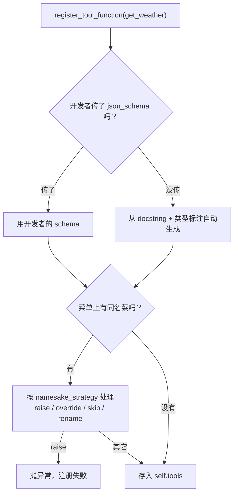
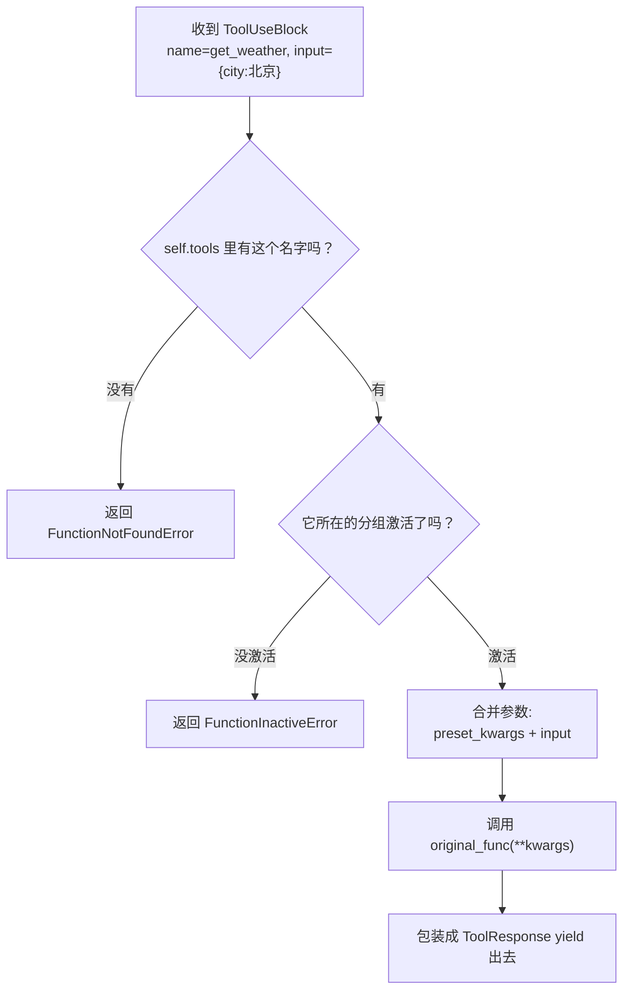
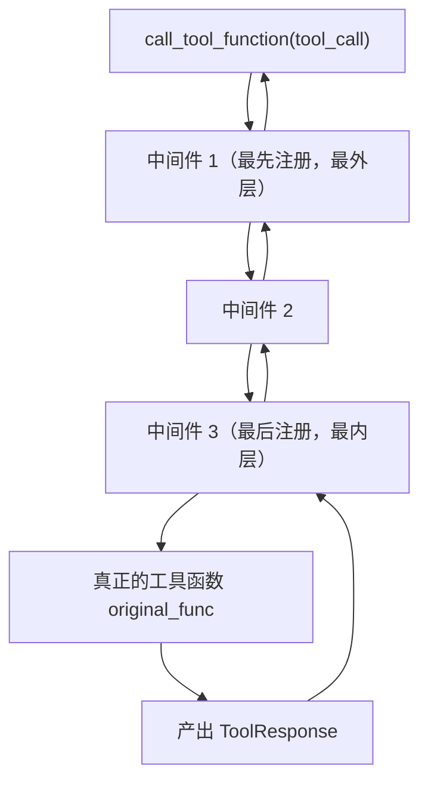
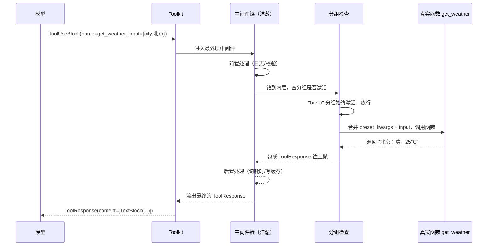

# 第 10 章 第 7 站：执行工具

上一站，模型终于开口了。但它没有直接回答"北京今天 25 度"，而是递回来一张小纸条，上面写着："请帮我调用 `get_weather`，参数是 `city=北京`。"——这就是 `ToolUseBlock`。问题是：模型只会写纸条，它自己并不会真去开窗看天。从这张纸条到真正跑一次 `get_weather("北京")`、再把结果写成 `ToolResultBlock` 喂回去，中间这一段路，就是本章要走的全程。

> 模型是大脑，工具是手脚。大脑发出的"行动意图"只是一个名字加几个参数，真正让它落地的，是一个叫 **Toolkit** 的总管——它登记工具、找到工具、执行工具、再用中间件把整个过程包成可以监控的洋葱。

> **上一章：[第 6 站：调用模型](./ch09-model.md)**

---

## 10.1 路线图

这一站要解决的，是 ReAct 循环里"行动"那一半的落地问题。模型给了一个名字和一袋参数，框架得：找到这个名字对应的真实 Python 函数 → 检查它现在能不能用 → 把参数拼好 → 执行 → 把返回值打包成 `ToolResponse`。


读完本章，你会理解：

- `Toolkit` 是怎么把一个普通 Python 函数"登记"成模型能调用的工具的；
- 从一张 `ToolUseBlock` 纸条，到真实函数跑起来的完整路径；
- 工具分组（Tool Group）为什么能让 Agent 自己决定"现在哪些工具可见"；
- 中间件（Middleware）的"洋葱模型"如何把日志、缓存、限流这些横切关注点干净地插进执行链路。

---

## 10.2 知识补全：装饰器与"包装"

在正式进入 Toolkit 之前，先补一个会用到的概念：**装饰器（decorator）**。

装饰器是 Python 里"给一个函数套一层壳"的写法。想象你有一台收音机（原函数），你不动它内部的电路，只在它外面套一个外壳（装饰器），外壳上加了音量旋钮和录音口。从外面看，还是那台收音机，但调用时多了一些行为。

```python
def 加日志(func):
    def 壳(*args, **kwargs):
        print(f"调用 {func.__name__}")
        result = func(*args, **kwargs)
        print(f"完成 {func.__name__}")
        return result
    return 壳

@加日志
def get_weather(city):
    return f"{city}: 晴"
```

调用 `get_weather("北京")` 时，真正跑起来的是那层"壳"——它先打日志，再调真正的函数，再打日志。多个装饰器可以层层嵌套，像俄罗斯套娃，也像洋葱——一层剥开还有一层。Toolkit 的中间件机制，正是这个思路的"工业化版本"。

> **设计一瞥**：洋葱模型不是 AgentScope 的发明。它来自 Web 框架（Django/Flask 的中间件、ASP.NET 的 pipeline、Koa 的洋葱）那一脉。把"真正的业务"放在最里面，外面一圈圈套上横切逻辑（鉴权、日志、限流），是后端工程里成熟的解耦手法。AgentScope 把它搬到了 Agent 的工具执行上。

---

## 10.3 Toolkit：工具箱的总管

现在请出本章的主角：`Toolkit`。

它是一个**模块**（继承自 `StateModule`，所以可以被序列化保存），职责只有四个字——**注册、执行**。你可以把它想象成一家餐厅的"后厨调度台"：

- **注册**：厨师（开发者）把一道菜的菜谱（Python 函数）交给调度台，调度台给它编号、抄一份说明书（JSON Schema），登记进菜单；
- **执行**：前厅（模型）递来一张点菜单（`ToolUseBlock`，写着菜名和加料），调度台按菜名找到菜谱，按说明把食材拼好，让厨师开炒，再把成品端回去。

### 调度台上的四本账

`Toolkit` 内部维护着四本"账本"，分别管不同的事：

| 账本 | 类型 | 作用 | 类比 |
|---|---|---|---|
| `tools` | 函数名 → 已注册工具 | 所有登记过的工具函数 | 餐厅的菜单正本 |
| `groups` | 分组名 → 工具分组 | 把工具归类、控制整组的开关 | "午市套餐""夜宵套餐" |
| `skills` | 技能名 → Agent 技能 | 较高层的技能封装 | 一整套搭配好的招牌菜 |
| `_middlewares` | 中间件列表 | 包在执行链外面的洋葱层 | 后厨的验收、留样、打包流程 |

最核心的是 `tools` 这本账。账里每一条记录，是一个 `RegisteredToolFunction` 对象，它不止存了原始函数，还存了一堆"元信息"。

### 一条记录里有什么

`RegisteredToolFunction` 这个名字听起来很正式，其实它就是"菜谱 + 一堆备注"。关键字段如下：

| 字段 | 含义 | 为什么需要 |
|---|---|---|
| `name` | 工具名 | 模型用它来"点菜" |
| `group` | 所属分组 | 决定它现在是否对模型可见 |
| `source` | 来源（函数 / MCP / 函数组） | 区分是自己写的，还是从外部接进来的 |
| `original_func` | 真正的 Python 函数 | 执行时调的就是它 |
| `json_schema` | 自动生成的参数说明 | 给模型看，让它知道怎么填参数 |
| `preset_kwargs` | 预设参数 | 开发者偷偷塞进去、不让模型看见的固定值（如 API key） |
| `postprocess_func` | 后处理函数 | 对返回值再做一道加工 |
| `async_execution` | 是否异步执行 | 长任务（如爬虫）可标记为异步 |

注册一个工具函数时，`Toolkit` 干三件事：从函数的 docstring 和类型标注里**自动抽出 JSON Schema** → 把这些信息打包成一条 `RegisteredToolFunction` 记录 → 存进 `self.tools`。

> **设计一瞥**：自动生成 JSON Schema 是这一步的灵魂。开发者只要写一个"带类型标注、带 docstring 的普通 Python 函数"，框架就能替它翻译成模型能读懂的工具说明。这就是 AgentScope 工具系统"低门槛"的根源——你写的还是普通 Python，没有框架侵入。

---

## 10.4 注册：把一个函数变成工具

注册这一步，是把"厨师手里的家常做法"标准化为"菜单上的一道菜"。它的入口叫 `register_tool_function`，签名长这样（示意）：

```python
def register_tool_function(
    self,
    tool_func,                  # 那个普通 Python 函数
    group_name="basic",         # 放进哪个分组
    preset_kwargs=None,         # 预设参数
    func_name=None,             # 自定义工具名（默认用函数 __name__）
    func_description=None,      # 自定义说明（默认用 docstring）
    json_schema=None,           # 自定义 schema（默认自动生成）
    namesake_strategy="raise",  # 同名冲突怎么办
    ...
) -> None
```

四步走完注册：

1. **定名字**——没传 `func_name` 就用函数自己的 `__name__`；
2. **造说明**——没传 `json_schema` 就从 docstring + 类型标注现抽一份；
3. **查冲突**——如果菜单上已经有同名菜，按 `namesake_strategy` 处理；
4. **入库**——构造 `RegisteredToolFunction`，写进 `self.tools`。



### 同名冲突的四种处置

`namesake_strategy` 是一个常被忽略、却很实用的参数。它决定当两个函数重名时怎么办：

| 取值 | 行为 | 适用场景 |
|---|---|---|
| `"raise"`（默认） | 直接抛异常 | 想尽早发现命名冲突，绝不偷偷覆盖 |
| `"override"` | 新函数顶掉旧函数 | 后注册的版本是"升级版" |
| `"skip"` | 保留旧函数，忽略新的 | 防止重复注册时把好东西覆盖掉 |
| `"rename"` | 给新函数自动改个名 | 两个同名工具都想保留 |

默认值是 `"raise"`——这是一个"宁可大声报错，也不默默吞掉"的选择，符合框架"早失败、好排查"的一贯偏好。

### 为什么不用 `@tool` 装饰器

很多框架（LangChain、LlamaIndex）喜欢用 `@tool` 装饰器来声明工具。AgentScope 选的是显式的 `toolkit.register_tool_function(fn)`。这两种风格背后是两种哲学：

- **装饰器 = 声明式**：函数定义的那一刻就和框架绑定了。优点是写起来顺手；代价是函数一被 import 就自动注册，运行时很难动态决定"这趟要不要这个工具"。
- **显式注册 = 命令式**：函数本身是干净的普通 Python，注册与否、什么时候注册、注册到哪个分组，都是运行时一句话的事。

AgentScope 选了后者，是因为 Agent 场景下"工具集会动态变化"是常态——同一个函数，在 A 任务里要给模型用，在 B 任务里要藏起来。显式注册让这种动态控制变得自然。

---

## 10.5 执行：从一张纸条到一次真实调用

注册是"备料"，执行才是"开火"。这一步的入口叫 `call_tool_function`，它吃进一个 `ToolUseBlock`，吐出一个 `ToolResponse` 的异步流。它的形态大致是：

```python
async def call_tool_function(
    self,
    tool_call: ToolUseBlock,
) -> AsyncGenerator[ToolResponse, None]:
    ...
```

为什么是异步生成器（`AsyncGenerator`）而不是普通函数？因为工具可能要**流式返回**——比如一个长爬虫，每抓到一段就 yield 一次，让 Agent 能边收边处理。这一点在 11 章讲循环时会再发挥作用。

### 执行的四步检查

剥掉中间件的外壳，`call_tool_function` 的核心逻辑其实很朴素，四步走：



这四步里有两步是"安全检查"，值得单独说一说。

**检查一：工具是否存在。** 模型有可能"幻觉"出一个根本没注册过的函数名。这时框架不会傻乎乎地抛异常让整个 Agent 崩掉，而是返回一个写着 `FunctionNotFoundError` 的 `ToolResponse`，让模型自己看到这个错误、自己改主意。

**检查二：分组是否激活。** 这就引出了下一节的工具分组机制。先记住一点：即便一个工具注册了，如果它所在的分组当前是"关"的，模型也调不动——会得到 `FunctionInactiveError`。

> **设计一瞥**：把"工具找不到"也包装成正常的 `ToolResponse` 而不是抛异常，是 ReAct 循环能稳定跑下去的关键之一。模型有自我纠错的本事——只要它"看得到"错误信息，下一轮往往就会换个工具或换个参数重试。框架的任务不是替模型做对，而是把世界里发生的事忠实地告诉它。

### 参数合并：预设值 + 模型填的值

第三步"合并参数"看起来不起眼，却是理解工具系统的一个关键点。合并的写法大致是：

```python
kwargs = {**tool_func.preset_kwargs, **(tool_call.get("input", {}) or {})}
```

这行代码的意思是：**先铺一层开发者预设的参数，再用模型传进来的参数覆盖同名键**。也就是说，如果两边都给了 `city`，模型说的算。

为什么要分两层？

- `preset_kwargs` 是开发者偷偷塞进去的**固定值**——比如某个工具必须用某个 API key、某个固定地区。这些值**不会出现在 JSON Schema 里**，模型根本看不见，也就改不了。这是把"敏感信息"和"模型可调节旋钮"分开的手段。
- `tool_call["input"]` 是模型根据 JSON Schema 自己填的**变量**——比如 `city=北京`。

合起来，工具函数拿到的，是"开发者的底料 + 模型的调味"。模型调一个工具，既受开发者暗中约束，又有它自己的发挥空间。

### ToolResponse：工具的回信

执行完函数，结果要回传给 Agent。回信的信封是 `ToolResponse`：

```python
@dataclass
class ToolResponse:
    content: list[TextBlock | ImageBlock | AudioBlock | VideoBlock]
    metadata: dict | None
    stream: bool
    is_last: bool
    is_interrupted: bool
```

注意 `content` 是一个**内容块列表**，而且类型不止 `TextBlock`——图片、音频、视频都行。这意味着工具的返回天然支持多模态：一个"截图工具"可以直接把截图作为 `ImageBlock` 塞进 `content`，Agent 拿到后能直接"看到"这张图。

`is_last` 和 `is_interrupted` 是给流式场景用的：前者标记"这是最后一帧"，后者标记"中途被打断了（比如用户喊停）"。这些标志在 11 章讲循环时会让 Agent 知道该不该继续。

---

## 10.6 工具分组：让 Agent 自己掌管"现在能用什么"

到目前为止，我们假设所有注册过的工具，模型都能看见。但现实里，一个 Agent 可能挂着几十上百个工具——一股脑全塞给模型，既费 token，又会让模型眼花、降低选对的概率。

工具分组（Tool Group）就是来解决这个问题的。

### basic 分组：默认的家常菜

默认情况下，所有工具都进 `"basic"` 分组，**始终激活**，模型随时能看见。这就是"日常菜单"——常驻、稳定、随时可点。

### 自定义分组：按需供应的套餐

开发者可以创建自定义分组：

```python
toolkit.create_tool_group("advanced", description="高级分析工具", active=False)
toolkit.register_tool_function(complex_tool, group_name="advanced")
```

`"advanced"` 分组默认是 `active=False`——它里面的工具，模型**看不见、也调不动**，除非有人把它的开关拨到 `True`。

谁来拨这个开关？是 Agent 自己。AgentScope 提供了一个特殊的 **meta 工具**（"管理工具的工具"）叫 `reset_equipped_tools`，它本身也是一个工具，模型可以调用它来激活或停用某个分组。于是出现了一个有趣的循环：

- 模型发现当前工具不够用 → 调用 `reset_equipped_tools` 把 `"advanced"` 分组打开；
- 下一轮，`"advanced"` 里的工具出现在菜单上 → 模型调用真正的分析工具；
- 任务做完 → 再调用 `reset_equipped_tools` 把它关掉，省 token。

这是一种**动态工具管理**。不是把工具一次性全堆给模型，而是让 Agent 自己判断"这一步我需要哪些工具"，按需取用。这背后是一种很务实的工程判断：菜单太长，客人反而不会点菜。

| 维度 | `"basic"` 分组 | 自定义分组 |
|---|---|---|
| 默认激活 | 是 | 可配（常默认关闭） |
| 模型可见性 | 始终可见 | 仅当分组 `active=True` 时可见 |
| 调用 `reset_equipped_tools` | 一般不动它 | 用来开关整组 |
| 适用场景 | 高频、稳定的核心工具 | 按任务阶段才需要的高级/专项工具 |

> **设计一瞥**：分组机制把"工具集"从"静态清单"变成了"动态可切换的视图"。这和人类工作很像——你去开会，不会把整间办公室都搬去，而是按这场会的主题，挑几样相关的东西带过去。AgentScope 让 Agent 也学会"看场合带工具"。

---

## 10.7 中间件：洋葱模型

到这里，我们已经能注册、能执行、能分组。但真实工程里，工具执行前后总有一堆"围绕在主流程边上"的需求：

- **记日志**：每次调用了哪个工具、参数是什么、耗时多少；
- **做缓存**：同样的查询别重复算；
- **限流**：某个外部 API 一分钟只能调 10 次；
- **鉴权**：这个 Agent 有没有权限调这个工具；
- **监控**：把调用情况上报到追踪系统。

如果把这些逻辑直接写进 `call_tool_function`，那个函数会变得又长又乱，而且每加一个需求都得改它。中间件（Middleware）就是来把它们**抽出去、一层层套在外面**的机制。

### 中间件长什么样

一个中间件，本质上就是一个"既会前置处理、又会后置处理、还能选择是否继续往下传"的异步函数。它的签名大致是：

```python
async def 我的中间件(
    kwargs: dict,           # 里面有 tool_call
    next_handler: Callable  # 下一层（另一个中间件，或真正的工具函数）
) -> AsyncGenerator[ToolResponse, None]:
    # —— 前置处理 ——
    print(f"即将调用: {kwargs['tool_call']['name']}")

    # —— 往下传，并接住返回的流 ——
    async for response in await next_handler(**kwargs):
        yield response   # 也可以在这里改写 response 再 yield

    # —— 后置处理 ——
    print("工具调用完成")
```

一个中间件能做四件事：

| 能力 | 实现方式 | 典型用途 |
|---|---|---|
| 前置处理 | 在调 `next_handler` 之前写代码 | 日志、参数校验、改参数 |
| 拦截响应 | 在 `async for` 循环里改 `response` | 脱敏、加水印 |
| 后置处理 | 在 `async for` 结束后写代码 | 记耗时、写缓存 |
| 短路返回 | 压根不调 `next_handler` | 缓存命中直接返回、限流拒绝 |

最后一项"短路返回"特别有力——它意味着中间件可以在**完全不碰真正工具函数**的情况下，直接给 Agent 一个答复。比如缓存中间件发现"北京天气"五分钟前刚查过，就不往下传了，直接把缓存结果 yield 出去。

### 洋葱是怎么叠起来的

多个中间件按注册顺序，一层层套在真正的工具函数外面。执行时从最外层钻进去，再一层层钻出来，形状像个洋葱：



这里有个容易绕晕的细节：**注册顺序和嵌套顺序是反的**。最先注册的中间件在最外层（请求最先经过它、响应最后经过它）；最后注册的中间件在最内层（最贴近真正的函数）。这就像穿衣服——最先穿的是内衣（最内层），最后穿的是外套（最外层），但脱的时候反过来。

### 一个计时中间件的骨架

举个最典型的例子——一个记录耗时的中间件。骨架长这样（示意，不可直接当 demo 跑）：

```python
async def timing_middleware(kwargs, next_handler):
    start = time.time()
    name = kwargs["tool_call"]["name"]
    # 往下传
    async for resp in await next_handler(**kwargs):
        yield resp
    # 后置：记一笔
    print(f"[计时] {name} 耗时 {time.time()-start:.3f}s")

toolkit.register_middleware(timing_middleware)
```

注意它**完全不知道**下面被调的到底是 `get_weather` 还是 `search_db`——它只关心"包裹这一层"的横切逻辑。这就是中间件的价值：把"和具体工具无关的通用需求"从工具本身剥离出去，工具函数保持纯粹。

> **设计一瞥**：洋葱模型让"加一个新需求"变成"注册一个新中间件"，而不是"改 N 个工具函数"。这是开闭原则（对扩展开放、对修改封闭）在 Agent 工具系统上的具体落地。当你日后想给所有工具加监控、加链路追踪、加灰度开关时，会感谢这个设计。

---

## 10.8 把四块拼起来：一次完整的工具执行

现在把本章的四块——**注册、执行、分组、中间件**——拼成一次完整的工具调用，看看它们怎么配合：



这张图把本章所有概念串在了一起。值得在脑子里多过几遍的几个要点：

1. **模型只产纸条，不执行**——所有"把纸条变成行动"的工作都落在 Toolkit 肩上；
2. **执行前的两道安全门**——存在性检查、分组激活检查，决定了模型这次能不能调到这个工具；
3. **参数是两层叠的**——开发者的底料 + 模型的调味，敏感信息藏在前者里；
4. **中间件是横向的**——它包裹所有工具，处理的是"和具体工具无关"的通用需求；
5. **返回是多模态的**——`ToolResponse.content` 可以是文字，也可以是图、音频、视频。

理解了这五点，你就握住了 AgentScope 工具系统的骨架。

---

## 检查点

走到这里，本章的概念应该已经在脑子里成型了。用这几个问题自测一下：

1. **为什么 `call_tool_function` 找不到工具时不抛异常，而是返回一个写着 `FunctionNotFoundError` 的 `ToolResponse`？** 想想这对 ReAct 循环的稳定性意味着什么。（提示：模型能"看到"错误，就能在下一轮自己纠错；抛异常则会打断整个循环。）

2. **`preset_kwargs` 和 `tool_call["input"]` 里有同名键时，谁覆盖谁？为什么这样设计？** （提示：合并写法是 `{**preset_kwargs, **input}`——后者覆盖前者。这样模型能微调，但开发者塞的"看不见的固定值"只要不和模型参数重名，就始终生效。）

3. **注册两个同名工具函数时，默认会发生什么？如果你想两个都保留，应该把 `namesake_strategy` 设成什么？** （提示：默认 `"raise"` 会报错；想都保留用 `"rename"`，让框架给后来的那个自动改名。）

4. **中间件的"洋葱"里，最先注册的中间件在哪一层？请求和响应分别最先/最后经过它吗？** （提示：最先注册 = 最外层。请求最先经过它，响应最后经过它——所以它适合做整体的计时和监控。）

5. **如果想让一个 Agent 在"分析阶段"才看到高级工具，平时看不到，该怎么用工具分组实现？** （提示：把高级工具注册到一个自定义分组、默认 `active=False`；让 Agent 通过 `reset_equipped_tools` 这个 meta 工具，在需要时打开、用完关掉。）

---

## 下一站预告

工具执行完了，结果也包成了 `ToolResponse` 递回给 Agent。但 ReAct Agent 的故事远没结束——拿到工具结果后，它不会直接回答用户，而是把这个结果**塞回记忆**，再调一次模型，让模型"消化"这个结果、决定下一步是继续调工具、还是收尾作答。于是，单次的"调一次模型 + 调一次工具"被拉长成了一个会反复转圈的环。

下一站是卷一最长的一章。我们会跳出"单步执行"的视角，站到循环的最外层，看 `ReActAgent.reply()` 这个总指挥如何把前面七站串成一条会自我反复的环线，以及它最终是怎么知道"该停下来了"的。

> **下一章：[第 8 站：循环与返回](./ch11-loop-return.md)**
