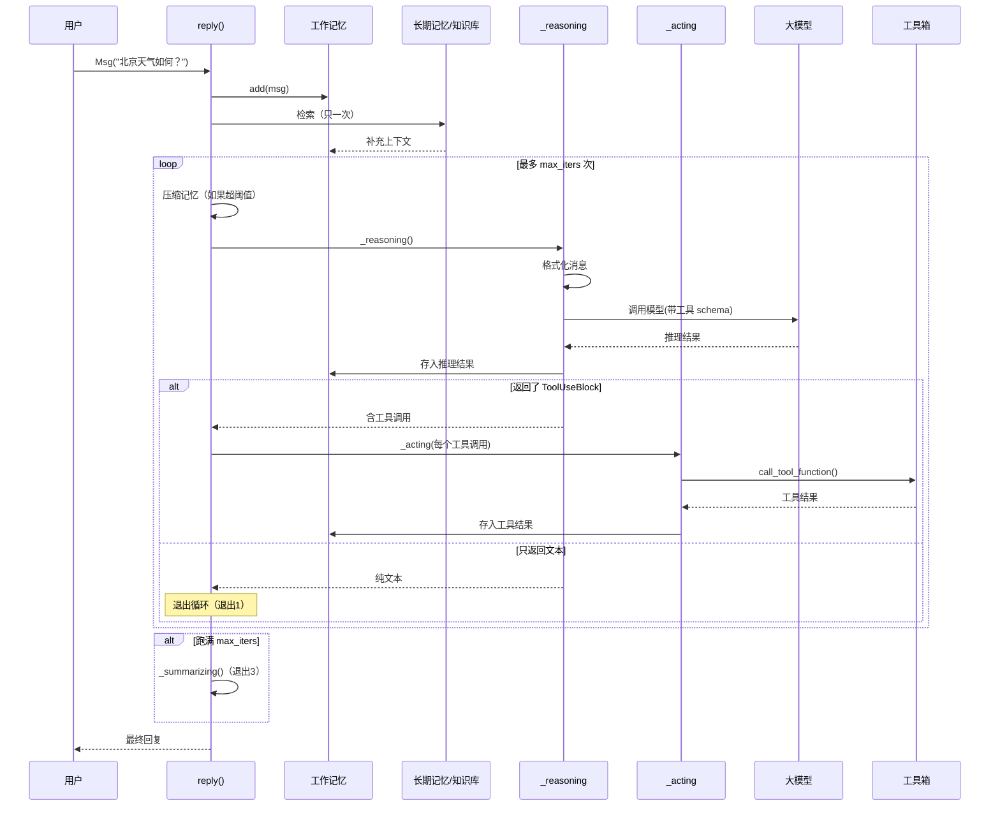
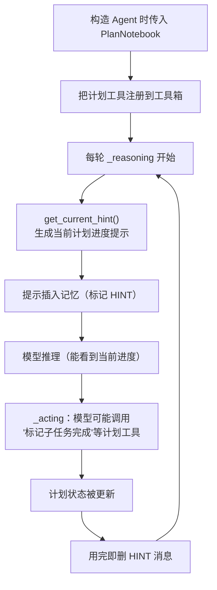

# 第 11 章 第 8 站：循环与返回

前七站，我们像跟拍一条消息那样，一站一站地把它走过的路走了个遍：消息怎么出生、怎么被 Agent 接住、怎么在记忆里排队、怎么被检索补全、怎么被格式器翻译、怎么送进大模型、模型想要用工具时工具又怎么被执行。现在我们站到了这条路的最高处，往下俯瞰——把这些分散的环节，重新拼成一个会自我反复的**循环**。这一章要回答的核心问题是：为什么 Agent 不只是"调一次模型就回答"，而要"思考—行动—再思考"地绕好几圈？以及，它最终是怎么知道该停下来的？

> 循环不是机械重复，而是"每走一步都重新看一眼世界"——ReAct 让 Agent 在每一次工具结果回来后，重新决定下一步该怎么走。

> **上一章：[第 7 站：执行工具](./ch10-toolkit.md)**

## 11.1 路线图

前几站我们追踪的是 ReAct 循环内部的每一站。这一站我们跳到最外层，看 `ReActAgent.reply()` 这个"总指挥"如何把它们串成一条会反复跑的环线。这是卷一的最后一站——读完它，你就拥有了一次完整 `agent(msg)` 调用的全貌。


图中加深的粉色方块就是本章所在的位置——它既是终点，也是"把结果回头喂给模型再走一轮"的那个回环。

## 11.2 知识补全：为什么需要"循环"

先退一步问个朴素的问题：为什么 Agent 不能一次搞定？

答案很简单——**大模型本身是被动的**。你给它一句话，它吐一段文字。它没法"自己去看天气、自己查数据库、自己读文件"。它唯一的本事是：根据你给的信息，给出一段回答，或者告诉你"我需要用某个工具"。而一旦它说"我要用工具"，框架就得真去执行那个工具，把结果拿回来，再让模型"消化"这个结果，决定下一步。

这就构成了一个天然的两段式节拍：

```
模型说："我要查北京天气"
        ↓ 框架执行工具
工具结果："北京：晴，25°C"
        ↓ 喂回给模型
模型说："北京今天天气晴朗，气温 25 度"
```

一次工具调用就需要"思考—行动—再思考"两轮。如果一个任务需要连查三次、或者先查再算再确认呢？那就需要更多轮。所以循环不是设计者拍脑袋加的，而是**工具使用的本质决定的**。

### ReAct：推理与行动的交替

ReAct（Reasoning + Acting）是这套思路的名字，由 2022 年的同名论文提出。它的核心主张一句话就能说完：

> 让 Agent 在"推理"（reasoning）和"行动"（acting）之间交替进行，而不是一次性规划好所有动作。每采取一个行动、拿到结果后，重新推理下一步该怎么做。
>
> —— ReAct: Synergizing Reasoning and Acting in Language Models, Yao et al., 2022

AgentScope 把 Agent 的行为"锚定"在 ReAct 范式上：

> "we ground agent behaviors in the ReAct paradigm and offer advanced agent-level infrastructure based on a systematic asynchronous design"
>
> —— AgentScope 1.0: A Comprehensive Framework for Building Agentic Applications, arXiv:2508.16279, Section 2.2

### 一个日常类比：在超市找东西

把 ReAct 循环想成**你打电话给朋友，让他帮你在陌生超市里找一瓶特定牌子的酱油**：

| 节拍 | 你朋友做的 | Agent 里对应的事 |
|------|-----------|----------------|
| 推理 | "酱油一般在调味品区，我先去那边看看" | 模型根据上下文决定要调哪个工具 |
| 行动 | 走到调味品区，看看货架 | 框架执行工具，拿到结果 |
| 推理 | "货架上没看到这个牌子，可能是缺货了，问一下店员" | 模型消化工具结果，决定下一步 |
| 行动 | 找店员问 | 执行下一个工具 |
| 推理 | "店员说在角落的特价区，我去那边" | 再次推理 |
| 行动 | 走过去，拿到了 | 工具返回最终数据 |
| 推理 | "找到了，可以告诉朋友了" | 模型给出纯文字回答，循环结束 |

关键在于：你朋友**不会**在出门前就把所有动作排好——他每走一步都要根据看到的新情况重新判断。这就是 ReAct 区别于"预编排流水线"的地方。它是**反应式**的，对每一次行动的反馈都做出新的反应。

### 结构化输出：另一种"返回方式"

在讲循环之前，先补一个和"返回"相关的前置概念。

有时候你不想要一段自然语言，而想要一个规整的数据结构。比如让天气 Agent 直接返回 `{"city": "北京", "temp": 25, "condition": "晴"}`，而不是说一句话。

这就是**结构化输出（Structured Output）**：你用 Pydantic 的 `BaseModel` 定义一个期望的格式，模型会被强制按这个格式吐 JSON 回来。`reply()` 方法有一个可选参数就是干这个的：

```python
async def reply(
    self,
    msg: Msg | list[Msg] | None = None,
    structured_model: Type[BaseModel] | None = None,
) -> Msg
```

它的实现思路很巧妙——**把目标数据结构伪装成一个"工具"**。模型以为自己是在"调用一个叫 `generate_response` 的工具"，于是老老实实按工具的参数 schema 吐 JSON，框架再把这个 JSON 解成你想要的 Pydantic 对象。这件事后面讲退出条件时会再回来一次。

> **设计一瞥**：用"工具调用"的机制去实现"结构化输出"，是一个典型的"一鱼两吃"。框架不需要为大模型再加一套新的"约束输出"管道，而是复用了已有的工具调用通道——既省了实现，又保证了行为一致性。

## 11.3 reply()：循环的总指挥

现在进入正题。`ReActAgent.reply()` 是整个循环的入口和总指挥。我们可以用一段示意伪代码把它的骨架勾勒出来——注意，这不是真实源码，是去掉细节后的结构骨架，用来让你看清它分几个阶段、每个阶段干什么：

```python
async def reply(self, msg, structured_model=None):
    # 阶段 A：记录输入
    await self.memory.add(msg)

    # 阶段 B：检索增强（在循环之前，只做一次）
    await self._retrieve_from_long_term_memory(msg)
    await self._retrieve_from_knowledge(msg)

    # 阶段 C：结构化输出准备（如果需要）
    if structured_model:
        # 把目标 schema 伪装成 generate_response 工具
        ...
        tool_choice = "required"     # 强制模型必须调用工具

    # 阶段 D：ReAct 主循环
    for _ in range(self.max_iters):
        await self._compress_memory_if_needed()    # 先看看要不要压缩记忆
        msg_reasoning = await self._reasoning(...) # 思考

        # 对模型返回的每个工具调用，执行它
        results = [await self._acting(tc)
                   for tc in msg_reasoning.get_content_blocks("tool_use")]

        # 检查退出条件
        if not msg_reasoning.has_content_blocks("tool_use"):
            return msg_reasoning    # 没有工具调用 → 任务完成，退出

    # 阶段 E：跑满 max_iters 还没退出 → 紧急总结
    return await self._summarizing()
```

五个阶段，一气呵成。下面我们把每个阶段拆开讲清楚。

### 阶段 A：记录输入

```python
await self.memory.add(msg)
```

把用户发来的消息存进工作记忆。这是每次对话的起点——后面模型每次推理时，都要回看这条消息。这一步我们在[第 3 站：工作记忆](./ch06-memory-store.md)已经讲透了。

### 阶段 B：检索增强（只在循环前做一次）

```python
await self._retrieve_from_long_term_memory(msg)
await self._retrieve_from_knowledge(msg)
```

两个检索动作，对应[第 4 站：检索与知识](./ch07-retrieval-knowledge.md)学过的两个来源：

- **长期记忆**：如果开启了静态检索控制，用当前消息当查询，去翻跨会话的历史记忆，命中后作为一条 `user` 消息加进工作记忆
- **知识库**：如果配置了 RAG 知识库，用当前消息检索相关文档片段，同样以 `user` 消息加进工作记忆

注意一个关键点：**这两个检索只在 `reply()` 开头做一次**，循环内部的每一轮推理不会再检索。这背后的假设是：一次用户请求通常对应一个话题，开头检索一次足够覆盖整个任务。如果你的任务话题会动态漂移，可能需要在工具里手动触发检索。

### 阶段 C：结构化输出准备

如果调用方传了 `structured_model`，框架会把这个 schema 当成"工具"注册进工具箱，并设置 `tool_choice="required"`——强制模型这一轮必须调用工具。这样模型吐出来的就一定是符合 schema 的结构化 JSON。

如果没传，框架会把之前可能注册的 `generate_response` 工具移除，避免污染普通对话。这是"用完即清"的好习惯。

## 11.4 循环体：思考与行动的反复

真正的戏在阶段 D 的 `for` 循环里。我们把它拆成三个小步骤来看。

### 步骤 1：先看看要不要压缩记忆

```python
await self._compress_memory_if_needed()
```

每一轮循环开头，第一件事不是思考，而是**收拾记忆**。为什么？因为 Agent 在循环里会不断往工作记忆里塞消息——推理结果、工具结果，越攒越多。如果一直不清理，对话会膨胀到模型上下文窗口装不下，或者成本爆表。

记忆压缩用的是一种**"滑动窗口 + 摘要"**策略：

| 处理对象 | 策略 |
|---------|------|
| 最近 N 条消息（`keep_recent`） | 原样保留，模型能看清最近的上下文 |
| 更早的消息 | 如果总 Token 数超过阈值，就用大模型把它们压成一段摘要 |

这里有一个特别值得说的设计细节：**工具调用和工具结果必须成对保留**。

设想一个反面场景——循环里某轮模型决定调用 `get_weather`（工具调用），框架执行后把"北京：晴"塞回记忆（工具结果）。这是一对成对的消息。如果压缩时不小心把"工具调用"压进了摘要，却把"工具结果"留在了窗口里，模型下一轮就会看到一条**没有对应调用**的结果，API 大概率会直接报错。

所以压缩算法在数"保留几条"时，会追踪工具调用的配对关系：只有当一对工具调用—结果都落在保留窗口内时，才算"一个完整的保留单位"。这是一个不起眼但极其关键的工程细节。

### 步骤 2：思考——_reasoning

```python
msg_reasoning = await self._reasoning(tool_choice)
```

`_reasoning` 是"思考"阶段，它要做的事可以概括为：

1. **如果有计划子系统**，把当前的计划提示插入记忆（标记为"临时"）
2. **格式化消息**：拼出系统提示 + 工作记忆里的消息，交给格式器翻译成模型看得懂的格式
3. **调用大模型**：带上工具箱的 JSON schema（如果开了结构化输出，还要带上强制调用工具的指令）
4. **处理响应**：流式的话边收边打印，非流式的话一次性接收
5. **把推理结果存进记忆**

模型这一轮可能返回三种东西之一：一段纯文字、若干个 `ToolUseBlock`（要调工具）、或者两者都有。

> **设计一瞥**：计划提示这类"只用一次"的消息，用完后会被立刻从记忆里删掉（用 `delete_by_mark` 按标记清理）。这避免了它们污染后续上下文——这是一种"即时清扫"的设计，让每轮推理的记忆保持干净。

### 步骤 3：行动——_acting

如果模型返回了 `ToolUseBlock`，对每一个工具调用执行 `_acting`：

```python
results = [await self._acting(tc)
           for tc in msg_reasoning.get_content_blocks("tool_use")]
```

`_acting` 对每个工具调用做的事：

1. 准备一个承载结果的 `ToolResultBlock` 消息
2. 通过工具箱真正执行工具函数（这一步在[第 7 站](./ch10-toolkit.md)讲过）
3. 把工具的产出流式填进结果消息
4. 把结果消息存入工作记忆

这一步有一个巧妙的错误处理模式值得提一下：`_acting` 用的是 `try/finally`，没有 `except`。意思是——**工具抛异常时，异常会照常向上冒泡**，让 `reply()` 知道出了问题；但**无论成功失败，工具结果消息都会被记进记忆**。为什么必须记？因为如果工具失败了却没在记忆里留下"结果"痕迹，下一轮模型就会看到一个"调用了却没有结果"的工具调用，API 立刻报错。这个"哪怕失败也要把痕迹留下"的设计，体现了对模型协议契约的尊重。

### 工具的并行 vs 顺序执行

当模型一次返回多个工具调用时（比如同时查北京和上海的天气），用并行还是顺序执行？由 `parallel_tool_calls` 参数决定：

```python
futures = [self._acting(tc) for tc in tool_calls]
if self.parallel_tool_calls:
    results = await asyncio.gather(*futures)   # 并行：所有工具同时跑
else:
    results = [await f for f in futures]       # 顺序：一个一个来
```

两种模式的取舍：

| 维度 | 并行（`asyncio.gather`） | 顺序（逐个 `await`） |
|------|----------------------|-------------------|
| 速度 | 快，所有工具同时跑 | 慢，一个接一个 |
| 资源 | 可能同时占用多个连接 | 每次只占一个连接 |
| 风险 | 工具有隐式依赖时可能乱序出错 | 天然安全 |
| 默认值 | `False` | `False` |

**默认是顺序执行**。这是一个保守但合理的选择：大多数任务里的工具有隐式依赖——比如"查完天气再决定要不要查空气质量"。只有当你确信多个工具彼此独立、且都耗时（比如同时查好几个城市的天气）时，才值得打开并行。

## 11.5 三种退出条件：循环什么时候停

循环不是无限跑下去的。它有三种正常的退出方式，理解它们就理解了 ReAct 的"收尾逻辑"。

### 退出 1：模型只返回文本，不调工具

```python
if not msg_reasoning.has_content_blocks("tool_use"):
    return msg_reasoning    # 没有工具调用 → 退出
```

这是**最常见也最健康**的退出方式。模型消化完所有信息，认为不需要再调工具了，直接给出一段文字回答——这就是最终回复，循环结束。

天气 Agent 的典型两轮循环就是这样：第 1 轮模型决定调 `get_weather`（有工具调用，继续），第 2 轮模型基于工具结果给出纯文字回答（没有工具调用，退出）。

### 退出 2：结构化输出成功

如果开了结构化输出，模型调用了那个伪装成工具的 `generate_response`，并成功吐出了符合 schema 的 JSON，循环也会退出。框架会把 JSON 解成 Pydantic 对象，挂在返回消息的 `metadata` 上。

### 退出 3：跑满最大迭代次数

```python
for _ in range(self.max_iters):   # 默认 max_iters = 10
    ...
# 如果循环跑完还没退出
return await self._summarizing()
```

如果循环跑满 `max_iters` 次（默认 10）还没自然退出，说明 Agent 卡住了——可能工具一直返回不理想的结果，或者模型一直在打转。这时候 `_summarizing()` 被调用，它是一个**紧急出口**：告诉模型"你已经用完了所有迭代次数，现在直接根据已知情况给个总结"。

```python
hint = "You have failed to generate response within the maximum iterations. "
       "Now respond directly by summarizing the current situation."
```

注意：这不是一次"正常回答"，而是兜底。如果你的任务经常触发 `_summarizing`，多半是 `max_iters` 设小了，或者工具设计有问题。

> **设计一瞥**：为什么 `max_iters` 默认是 10？
> 这是一个经验值。简单任务（查个天气、翻译一段话）通常 2-3 轮就搞定；复杂多步任务（查资料、汇总、再写报告）可能要 5-8 轮。10 是一个"既能覆盖大多数复杂任务、又不会让卡死的 Agent 烧太多钱"的上限。你可以按需调整：`max_iters=3` 适合简单对话，`max_iters=20` 适合需要反复检索的深度任务。

## 11.6 一张图看完整个循环

把上面的所有阶段拼起来，一次完整的 `reply()` 调用长这样：



这张时序图把"思考—行动—再思考"的节拍、记忆的写入、检索的时机、以及三种退出全部画在一起了。建议你停下来顺着箭头走一遍，确认每一站你都能说出它在干什么。

## 11.7 辅助子系统：计划与语音

循环体之外，还有两个可选的子系统会插进 ReAct 循环里"搭把手"。它们不影响主干流程，但理解它们能帮你看到 AgentScope 设计的延展性。

### PlanNotebook：让 Agent 会"做计划"

普通 ReAct Agent 是"走一步看一步"的。但有些复杂任务需要更结构化的规划——比如"写一篇综述"这种任务，最好先列个提纲再分步执行。

`PlanNotebook` 就是干这个的。它管理一棵**计划树**：一个 `Plan` 下面挂若干 `SubTask`，每个子任务有状态（待办、进行中、完成）。它的工作流如下：



它的精妙之处在于：计划子系统**不破坏 ReAct 的单循环结构**——它只是在每一轮推理前插入一条"你现在进展到哪一步了"的提示，让模型在推理时心中有数。计划本身也是一个特殊工具，模型可以像调用普通工具一样去更新它。这种"一切皆工具"的统一性，是 AgentScope 的一个一贯美学。

关于计划工具的注册，还有一个细节：如果开启了"元工具"模式（`enable_meta_tool`），计划工具会被放进一个**独立的工具组**，Agent 可以在运行时动态激活或停用它们；否则它们就和普通工具混在一起，始终可用。前者让"管理计划"这件事本身变成可控的——避免 Agent 在不需要计划的任务里也去瞎折腾计划工具。

### TTS：让 Agent 会"说话"

`_reasoning` 和 `_summarizing` 里还埋了一条语音合成（TTS）的处理逻辑。语音的来源有两种：

1. **模型原生输出音频**：多模态模型（比如一些语音模型）可以直接在响应里返回 `AudioBlock`，框架直接拿来用
2. **TTS 后处理**：模型只输出文字，框架再用一个独立的 TTS 模型把文字合成成语音

这里有个有意思的实现点：TTS 模型被当作一个**异步上下文管理器**使用——它在整个推理过程中要保持会话状态（比如维护一条到 TTS 服务的 WebSocket 连接）。所以你会看到 `async with tts_context:` 这样的写法，把推理过程包在上下文里，确保连接在推理期间一直活着，推理结束自动释放。

## 11.8 回看整条路：循环为什么是 ReAct 的灵魂

走到这里，我们终于可以回答开头的那个问题了：**为什么 Agent 不能一次搞定，而要循环？**

因为大模型是被动的、不主动获取信息的能力是有限的。它只能基于"已经看到的东西"做判断，而"新信息"必须靠框架去执行工具才能拿到。每一次工具执行，都是给模型喂一份新数据；每一次喂完新数据，模型都要重新判断一次。这种"行动—反馈—再判断"的往复，就是循环存在的全部理由。

而循环的退出条件，本质上是模型在说"我已经掌握够了"——要么它直接给出文字回答（最自然），要么它按要求吐了结构化数据（最规整），要么它实在走不动了让框架兜底（最无奈）。

ReAct 不是 AgentScope 发明的，但 AgentScope 把它落地成了一套清晰的、异步的、可扩展的循环结构——记忆、检索、格式化、模型、工具，每一个环节都被这个循环串起来，既各司其职，又浑然一体。

> **设计一瞥**：注意整个循环是 `async` 的。这意味着 Agent 在等待大模型响应、等待工具执行时，事件循环可以把 CPU 让给别的任务——你可以同时跑成百上千个 Agent。这套"系统化的异步设计"是 AgentScope 1.0 论文反复强调的特性，也是它和许多早期框架的根本区别。

## 检查点

走到这里，你应该能回答下面几个问题了。

**1. 天气 Agent 处理一个"查天气"的请求，ReAct 循环会跑几轮？每轮在做什么？**

默认情况下恰好 2 轮。第 1 轮 `_reasoning`：模型看到用户问天气，决定调用 `get_weather`，返回一个 `ToolUseBlock`——因为有工具调用，循环不退出，进入 `_acting` 执行工具、把"北京：晴，25°C"塞回记忆。第 2 轮 `_reasoning`：模型看到工具结果，认为信息够了，直接返回一段纯文字回答（比如"北京今天晴，25 度"）——没有工具调用，循环退出。如果 Agent 没注册任何工具、模型纯靠自身知识作答，那就只有 1 轮。

**2. 如果把 `max_iters` 设成 1，天气 Agent 还能正常工作吗？为什么？**

不能。"查天气"需要 2 轮（先调工具、再回答）。`max_iters=1` 时，第 1 轮模型调用了工具、`_acting` 执行完，因为这一轮有工具调用所以不会走"退出 1"，循环直接到上限结束——最终触发 `_summarizing()` 兜底，用户拿到的是一段"总结当前状态"的回复，而不是真正的天气回答。所以凡是需要工具的任务，`max_iters` 至少要 ≥ 2。

**3. 记忆压缩的"滑动窗口"策略保留了哪些消息不压缩？**

保留**最近 `keep_recent` 条消息**原样不动，并且**成对保留工具调用和工具结果**（不能把一对拆开，否则模型会看到悬空的工具调用或悬空的结果，触发 API 报错）。只有超出窗口范围的旧消息才会被压缩成摘要。值得一提的是，系统提示根本不参与压缩——它每次推理都是临时拼上去的，不在工作记忆里。

**4. 工具的并行执行默认是开还是关？为什么默认这么选？**

默认是关（顺序执行）。因为顺序执行天然安全——多个工具之间如果有隐式依赖（比如"先查天气再决定要不要带伞"），顺序执行不会乱序。并行只有在确信工具彼此独立且都耗时（比如同时查多个城市的天气）时才值得开。保守默认避免了用户在不知情的情况下踩到依赖乱序的坑。

## 下一站预告

我们已经跟着一条消息走完了它从出生到返回的全部旅程——八个站点，串成了一个完整的 ReAct 循环。下一站是卷一的**复盘章**。我们会拉远视角，把这次"现场跟拍"拍到的所有片段重新摊开，画一张完整的全景长卷，把八个站点在更高层次上重新组织一遍。这是卷一的收束，也是通往卷二"拆开齿轮看模式"的交接。

> **下一章：[旅程复盘](./ch12-journey-review.md)**
