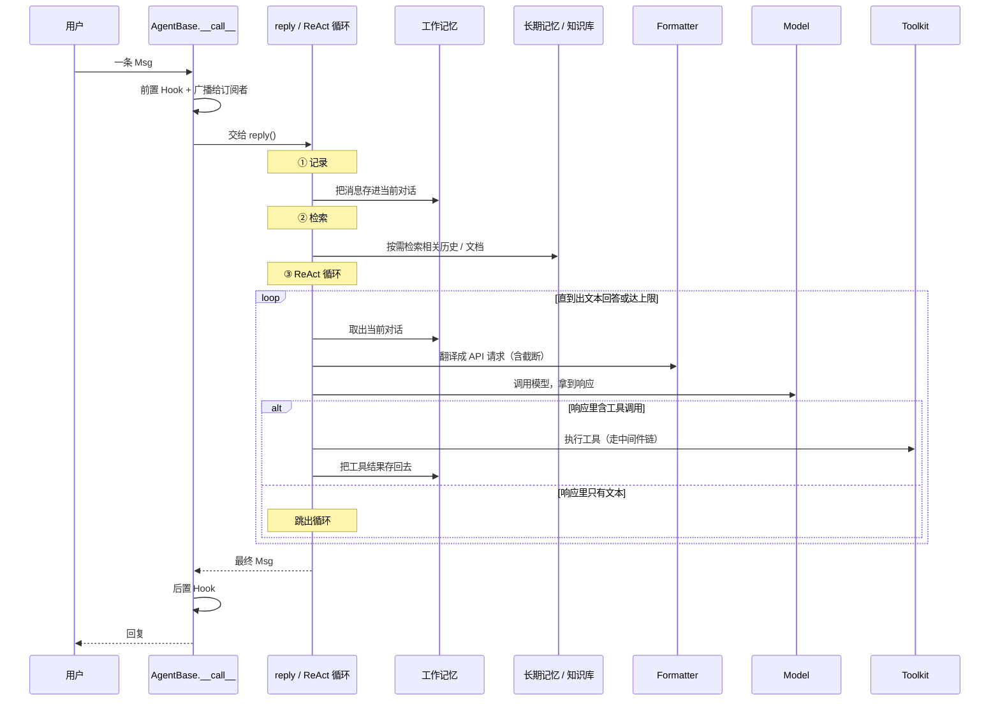
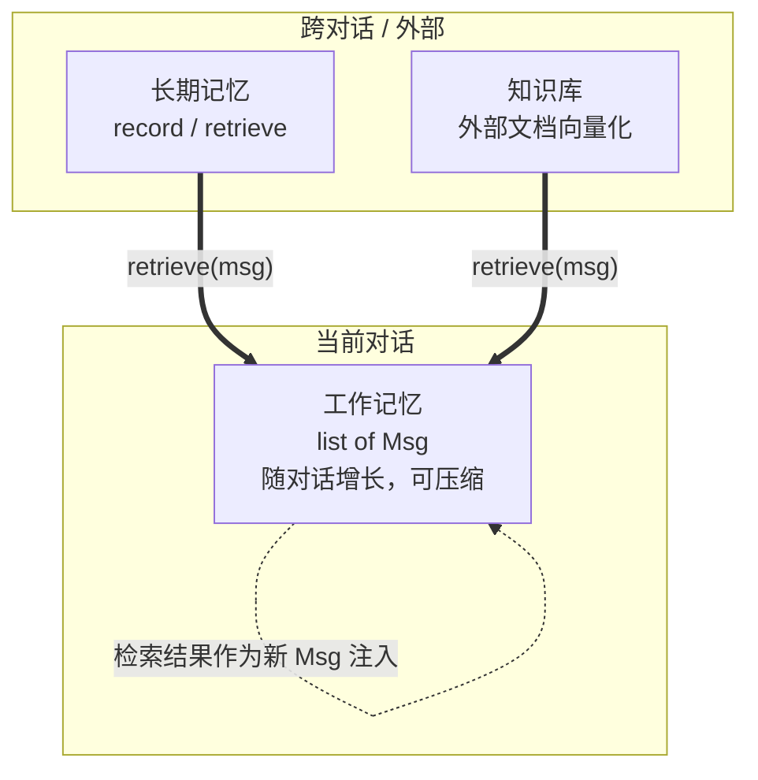
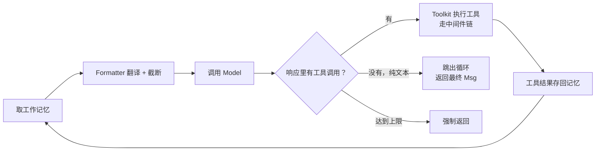

# 第 12 章 旅程复盘

恭喜你走完了卷一的全部 8 个站点。前面 7 章我们像是跟着一条消息做了一次"现场跟拍"——看它怎么出生、怎么被 Agent 接住、怎么在记忆里排队、怎么被翻译成模型听得懂的话、怎么触发工具、最后怎么回到用户面前。这一章我们不再追任何一条消息，而是站到高处，把整段旅程拍成的"长卷"重新摊开看一遍。

> 一次 `agent(msg)` 调用，看起来只是一句对话，背后却是一场由消息、记忆、格式器、模型、工具接力完成的编排——卷一带你走过每一个交接点。

> **上一章：[第 8 站：循环与返回](./ch11-loop-return.md)**

## 12.1 路线图

卷一的目标很单纯：让你**亲眼看到**一次 Agent 调用从头到尾发生了什么。我们把这条路径切成 8 个站点，每个站点是一个职责清晰的组件。现在你已经把每个站点都站过一遍了，这一章是回望，也是交接——把"做了什么"交接给卷二的"为什么这样设计"。

```mermaid
flowchart LR
    A["卷一<br/>跟着请求走"]:::done --> B["卷二<br/>拆开齿轮看模式"]:::next
    B --> C["卷三<br/>造新齿轮"]:::todo
    C --> D["卷四<br/>设计权衡"]:::todo

    subgraph 卷一·八站
      S1["1 消息诞生"]:::done
      S2["2 Agent 收信"]:::done
      S3["3 工作记忆"]:::done
      S4["4 检索与知识"]:::done
      S5["5 格式转换"]:::done
      S6["6 调用模型"]:::done
      S7["7 执行工具"]:::done
      S8["8 循环与返回"]:::done
    end

    A --> 卷一·八站
    classDef done fill:#1f6feb,color:#fff,stroke:#1f6feb,stroke-width:2px;
    classDef next fill:#d6336c,color:#fff,stroke:#d6336c,stroke-width:3px;
    classDef todo fill:#6c757d,color:#fff,stroke:#6c757d;
```

图中加深的粉色方块就是我们现在站的位置——卷一的终点、卷二的起点。

## 12.2 知识补全：把"现场跟拍"变成"全景长卷"

读前几章时，你可能有一种"信息很碎"的感觉：消息是一个 dataclass，记忆是一个 list，格式器是个翻译官，模型是个封装，工具是个带中间件的注册表……它们各自都讲清楚了，但拼在一起到底是什么样？

我们用一个日常类比把整件事串起来。

### 饭店后厨的比喻

把一次 `agent(msg)` 调用想象成**顾客在饭店点了一道菜**：

| AgentScope 组件 | 饭店里的角色 | 干什么 |
|----------------|------------|-------|
| 用户的消息 `Msg` | 顾客递进来的点菜单 | "我要一份番茄炒蛋" |
| `AgentBase.__call__` | 前台接待员 | 接单、广播给常客（订阅者）、再交厨房 |
| Hook（前置/后置） | 前台墙上贴的"迎客流程"和"送客流程"纸条 | 接待员每接一单都自动执行一遍 |
| `reply()` | 厨师长 | 真正决定这道菜怎么做 |
| 工作记忆 Memory | 厨房灶台旁的小黑板 | 写着"这一桌"点过的所有菜，随点随擦 |
| 长期记忆 / 知识库 | 老顾客档案柜 / 菜谱书 | 跨桌、跨天的信息，按需翻出来参考 |
| Formatter | 帮厨把菜名翻译成后厨术语 | "番茄炒蛋" → 后厨听得懂的工序单 |
| Model | 灶台 + 主厨的手艺 | 真正"做菜"的地方，产出一道菜或一句"还缺个调料" |
| Toolkit | 调料柜 / 配菜窗口 | 主厨伸手就能拿的工具，每拿一次都有一套取用流程 |
| ReAct 循环 | 主厨"尝一口 → 缺什么拿什么 → 再尝"的反复 | 直到味道对了（出文本回答）或时间到 |

记住这张表，后面每一段复盘都能在它上面找到对应。读完这一章你会发现，AgentScope 的所有"花活"，其实都是在让这个后厨跑得更顺、更松耦合、更可替换。

### 一条贯穿始终的数据：Msg

卷一反复出现的主角只有一个——`Msg`。它从第 1 站出生，到第 8 站回到用户手里，全程没换过形态。回忆一下它的长相（示意，不是可运行程序）：

```python
@dataclass
class Msg:
    name: str
    content: list[ContentBlock]
    role: str
    ...
```

`content` 字段是一个列表，里面可以装文字、图片、工具调用、工具结果、思维链等多种内容块。正是这个"内容是列表"的设计，让一条消息可以同时承载"我想说的"和"我想调用的工具"——这是后面 ReAct 循环能跑起来的前提。

> **设计一瞥**：为什么 `content` 是一个块列表而不是单个字符串？因为一次模型输出可能"既说话又动手"——比如"好的，我帮你查一下天气"这句话和一次天气查询工具调用，常常是同一轮里并排产出的。把它们放进同一个列表，就保留了这种"边说边做"的天然结构。

## 12.3 全景序列：一次调用到底走了多远

现在我们把第 1 到第 8 站的细节折叠起来，只保留主干，画出这条消息从进入到离开的完整旅程。这张图是本章的核心，建议你把它和饭店那张表对着看。



这张图把八站浓缩成了三个阶段：**记录 → 检索 → 循环**。下面三节我们分别把每个阶段再展开，重点不是再走一遍细节，而是说清楚"为什么是这个顺序"。

## 12.4 阶段一：接信与记录——为什么入口要做这么多事

很多人第一次看 AgentScope 会奇怪：为什么不能直接 `model.chat(msg)`，非要在中间塞进 `__call__`、Hook、广播、记忆这一堆？

答案在于**"接信"这个动作其实承担了三件不同的事**，而它们恰好对应了三种不同的扩展点：

| 动作 | 谁来做 | 为什么不能省 |
|-----|-------|------------|
| 前置 Hook | Agent 自己（元类自动收集） | 让你能在"每次 Agent 被调用前"插一段逻辑，比如记日志、改入参，而不碰核心代码 |
| 广播给订阅者 | `__call__` 内部 | 让别的 Agent 或监听器能"听见"这次对话，这是多智能体通信的基础 |
| 存进工作记忆 | `reply()` 开头 | 不存下来，模型下一轮就不知道这一轮发生了什么 |

注意一个关键设计：**子类只需要实现 `reply()`**。所有"接信"的杂事都在 `__call__` 和元类里处理掉了。这意味着你写一个新 Agent 时，脑子里只需要想一件事——"给我一条消息，我该怎么回"，而不必关心 Hook、广播、记忆初始化这些。

> **设计一瞥**：`__call__` 像一个"前台经理"，它把迎宾、广播、派单这些固定流程全包了，然后把真正"做菜"的 `reply()` 留给子类。这种"固定骨架 + 可变填空"的写法，就是面向对象里常说的模板方法（Template Method）。

## 12.5 阶段二：检索——为什么记忆要分成两层

第 3、4 两站讲了两种记忆：工作记忆和长期记忆（外加知识库）。为什么不能只用一个？

想象饭店后厨只有一块小黑板。如果这块黑板上既要写"这一桌刚点了什么"，又要写"老王上次来爱吃什么"，还要写"番茄炒蛋的标准菜谱"——那黑板很快就乱了，主厨也分不清哪些是"眼前要做的"、哪些是"参考资料"。

所以 AgentScope 把记忆拆成两层：



关键点是那条虚线：**长期记忆和知识库检索出来的内容，最终都要"化身成一条 Msg"塞回工作记忆**。模型自始至终只看工作记忆这一块"黑板"，它根本不知道有些信息是从档案柜或菜谱书里临时搬过来的。

这个设计有两个好处：

1. **模型侧零改动**：不管你接了多复杂的外部知识源，模型看到的永远是它熟悉的工作记忆格式。
2. **可替换**：长期记忆可以换成 Redis、向量库、Mem0，只要它还能产出 `Msg`，工作记忆这一层完全不用改。

> **设计一瞥**：长期记忆有两种控制模式——`static_control`（系统在每轮自动检索注入）和 `agent_control`（把"记住这件事""回忆那件事"注册成工具，让模型自己决定何时调用）。前者像主厨每道菜都自动翻一次菜谱，后者像把菜谱锁在柜子里、主厨需要时自己去拿钥匙。两种各有适用场景：前者省心但可能注入噪声，后者灵活但依赖模型的判断力。

## 12.6 阶段三：ReAct 循环——推理与行动的接力

这是卷一最绕的一段，也是最能体现 Agent "智能"的地方。我们用最简的话再过一遍。

ReAct 的核心想法很朴素：**别指望模型一次性给出最终答案，让它"想一步、做一步、再想一步"**。每一步它可能产出文字（推理），也可能产出工具调用（行动）。只有当它不再调用工具、给出一段纯文本时，才认为它"说完了"。



这里藏着卷一里几个最容易混的概念，我们集中澄清一下。

### Formatter 在循环里到底干了什么

`Formatter` 的职责只有一句话：**把 `Msg` 列表翻译成模型 API 需要的字典列表**。不同厂商的 API 格式不一样（OpenAI 一套、Anthropic 一套、Gemini 又一套），Formatter 就是那层方言翻译。

但翻译之外它还干了一件隐秘的事——**截断**。工作记忆可能越来越长，超出模型的 Token 上限。截断格式器在翻译的同时会"数 token"，超了就从最旧的消息开始砍。砍之前它先做一份深拷贝，所以**原始工作记忆里的消息不会被改坏**。

> **设计一瞥**：为什么 Formatter 独立于 Model？因为"翻译"和"调用"是两件正交的事。同一段工作记忆，可能要被翻译成 OpenAI 格式，也可能要被翻译成 Anthropic 格式，但"调用 HTTP 接口"这件事是一样的。把它们拆开，你就能自由组合"任何 Formatter × 任何 Model"，这是典型的策略模式（Strategy Pattern）——卷二第 16 章会展开。

### Hook 和中间件，到底谁管谁

这两个词在卷一里反复出现，长得又像（都是"在某个动作前后插逻辑"），初学很容易混。区别在于**作用层级**：

| | Hook | 中间件 |
|--|------|--------|
| 作用在 | **Agent 层**，拦截 `reply()` | **工具层**，拦截 `call_tool_function()` |
| 注册方式 | 元类自动收集带特定前缀的方法 | `register_middleware()` 手动注册 |
| 典型用途 | 改入参、记日志、改出参 | 工具调用前鉴权、调用后缓存 |

一句话：**Hook 管"Agent 的行为"，中间件管"工具的行为"**。前者是"整个厨房的流程规定"，后者是"调料柜的取用规定"。

### Toolkit 为什么不用 `@tool` 装饰器

很多框架用 `@tool` 装饰器把函数注册成工具。AgentScope 选了另一条路：**用 `Toolkit.register_tool_function(普通函数)`**。好处是注册时才决定"这是个工具"，函数本身保持纯净、能被别处正常 import 调用。注册时框架会读函数签名和 docstring，自动生成 JSON Schema 喂给模型——模型靠这份 schema 知道有哪些工具可用、参数叫什么。

工具执行时还有一层"洋葱"：你注册的中间件会从外到内、再从内到外地把真正的工具函数包起来，每一层都能在调用前后插逻辑（鉴权、日志、限流、缓存）。最后注册的中间件是最内层、最先接触真实函数；最早注册的是最外层、最先接触原始请求。

### `_compress_memory_if_needed` 什么时候动手

工作记忆不能无限长。当它逼近模型的上下文上限时，ReAct 循环每轮开头会做一次"压缩"：把较旧的消息**概括成一条摘要**塞回去，为新对话腾地方。但有几类消息**永远不会被压缩**——比如系统提示词、最近几轮的对话、刚刚的工具结果。卷一第 8 站讲过这个细节，这里你只需要记住一个直觉：**重要的、眼前的、系统级的东西留下，模糊的、久远的对话被折叠成摘要**。

## 12.7 八站一句话回顾

如果你要向别人用最短的话讲清楚卷一，下面这张表就够了：

| 站 | 一句话 | 核心产物 |
|----|-------|---------|
| 消息诞生 | `Msg` 是 Agent 世界的"信封"，`content` 是一个内容块列表 | `Msg` + `ContentBlock` |
| Agent 收信 | `__call__` 包办接信杂事，子类只写 `reply()` | 模板方法骨架 |
| 工作记忆 | 一个按时间排好序的消息列表，可过滤、可压缩 | `MemoryBase` |
| 检索与知识 | 长期记忆和知识库检索结果都"伪装成 Msg"注入工作记忆 | `LongTermMemoryBase` + RAG |
| 格式转换 | 把 `Msg` 翻译成各家 API 的字典，超长就自动截断 | `FormatterBase` |
| 调用模型 | 封装 API 调用，流式响应逐块累积，结构化输出伪装成工具调用 | `ChatModelBase` |
| 执行工具 | 注册普通函数为工具，自动生成 Schema，执行走中间件洋葱 | `Toolkit` |
| 循环与返回 | 推理 → 行动 → 推理……直到纯文本回答或达上限 | `reply()` 的 ReAct 循环 |

## 12.8 易混淆点集中澄清

读完一整卷，有几个概念放在一起才更容易看清边界。

**工作记忆 vs 长期记忆**：这是两个完全独立的类，没有继承关系。ReActAgent 同时持有 `self.memory`（当前对话的工作记忆）和 `self.long_term_memory`（跨对话的长期记忆）。前者像灶台旁的小黑板，后者像档案柜。

**Formatter 的 `format` vs Toolkit 的 `_apply_middlewares`**：都涉及"包装"，但层次完全不同。Formatter 是**数据格式转换**（Msg → API 字典），中间件是**行为增强**（在工具调用前后插逻辑）。一个是翻译官，一个是安检门。

**`_reasoning` 里调的 `format` vs `__call__` 里的处理**：`_reasoning` 每轮都调一次 `formatter.format()` 把当前工作记忆翻译出去；这次翻译只在内存里发生，**不会修改原始工作记忆**（因为有深拷贝保护）。`__call__` 里的处理则是接信层面的，和格式翻译无关。

## 12.9 叙事转折：从"做了什么"到"为什么这样设计"

卷一像一场旅行——我们跟着一条请求从头走到尾，现在你知道每个站点在做什么了。但有些问题卷一始终没有回答：

- **为什么**消息是 `Msg` 这个 dataclass，而不是普通的字典？为什么 ContentBlock 要用 TypedDict？
- **为什么** Hook 用元类自动收集，而不是用装饰器手动标注？
- **为什么** Formatter 要独立于 Model，而不是让每个 Model 自己处理格式？
- **为什么**工具注册用 `Toolkit.register_tool_function`，而不是流行的 `@tool` 装饰器？
- **为什么**长期记忆要分 `static_control` 和 `agent_control` 两种模式？

这些"为什么"，每一个背后都藏着一个被反复掂量过的设计权衡。卷二要做的，就是把每一颗"齿轮"拆下来单独研究——看它的齿是怎么啮合的、为什么是这个形状、换个形状行不行。

> AgentScope 1.0 论文（arXiv:2508.16279）的 Figure 1 把整个框架画成了三层：Foundational Components（Message、Model、Memory、Tool）→ Agent Infrastructure（ReAct、Hook、Async）→ Multi-Agent Orchestration（MsgHub、Pipeline）。卷一带你走完了第一层和第二层的第一种组合，卷二会带你把第二层的每个零件都翻过来看背面。

## 12.10 检查点

下面几个问题帮你确认是否真的把八站串起来了。答案是散文，你可以在心里作答后再对照。

**1. 如果让你向一个没读过本书的人解释"为什么一次 `agent(msg)` 调用不能直接写成 `model.chat(msg)`"，你会怎么说？**

参考要点：因为接信这一步除了"把消息送给模型"之外，还要做三件不该让子类操心的事——前置 Hook（让框架能在每次调用前后插逻辑）、广播给订阅者（多智能体通信的基础）、把消息存进工作记忆（让模型下一轮还记得这一轮）。直接 `model.chat` 等于跳过了 Agent 这个"前台经理"，把这些扩展点全丢了。

**2. 长期记忆和知识库检索出来的内容，模型是怎么"看到"的？**

参考要点：模型自始至终只看工作记忆。检索结果会被包装成一条 `Msg`（通常伪装成用户消息），直接塞进工作记忆里。所以无论信息来自档案柜还是菜谱书，到了模型眼里都是"工作记忆里的一条消息"。

**3. Formatter 在 ReAct 循环里每一轮都被调用一次，这会不会修改原始工作记忆？为什么？**

参考要点：不会。截断格式器在翻译前会对消息列表做一次深拷贝，所有的截断、删减都发生在这份拷贝上，原始工作记忆不动。这是必要的——因为截断是为了"这一轮请求不超过 Token 上限"，不应该真的删掉历史对话。

**4. Hook 和中间件都"在某个动作前后插逻辑"，它们的本质区别是什么？**

参考要点：作用层级不同。Hook 作用在 Agent 层，拦截的是 `reply()`，管的是"Agent 的行为"；中间件作用在工具层，拦截的是 `call_tool_function()`，管的是"工具的行为"。一个是整个厨房的流程规定，一个是调料柜的取用规定。

**5. ReAct 循环有哪几种退出方式？**

参考要点：两种正常退出加一种兜底。一是模型这一轮的响应里**只有文本、没有工具调用**——认为它"说完了"，正常返回；二是循环达到了 `max_iters` 上限——强制返回，避免无限循环。（工作记忆压缩不算退出，它只是循环内每轮开头的一个维护动作。）

## 12.11 下一站预告

卷一是一场"现场跟拍"，我们追着一条消息跑完了全程。但追完全程只是开始——接下来我们要换一种看法：不再跟着请求走，而是**横向**打开框架，把每一颗齿轮单独拿出来研究。

- **模块系统**：`agentscope.init()` 是怎么自动发现和注册所有模块的？命名约定在其中起了什么作用？
- **继承体系**：`StateModule → AgentBase → ReActAgent` 和 `StateModule → MemoryBase → InMemoryMemory` 这两棵继承树是怎么长出来的？为什么序列化能力要放在最顶上的 `StateModule`？
- **元类与 Hook**：那个"零代码自动收集 Hook"的魔法，底层到底是怎么实现的？
- **策略模式**：为什么不同的模型 API 能共享同一套调用逻辑？
- **工厂与 Schema**：从 Python 函数签名到 JSON Schema，自动生成工具描述需要写几行？
- **中间件洋葱**：`functools.partial` 怎么把一串中间件层层套起来？
- **发布-订阅**：多 Agent 场景下，广播和路由是怎么实现的？

每个问题都是一个设计模式的实战案例。准备好了吗？让我们从一颗齿轮——模块系统——开始拆起。

> **下一章：[模块系统：命名与导入](../volume-2-patterns/ch13-module-system.md)**
