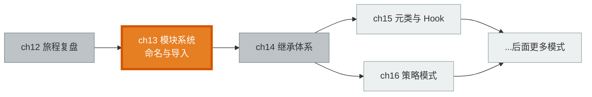
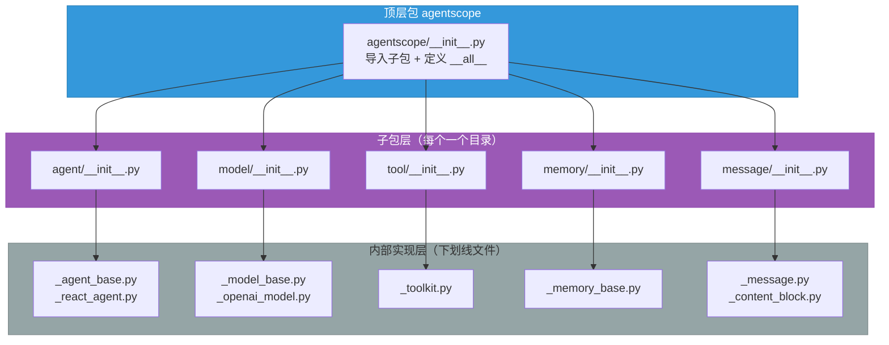
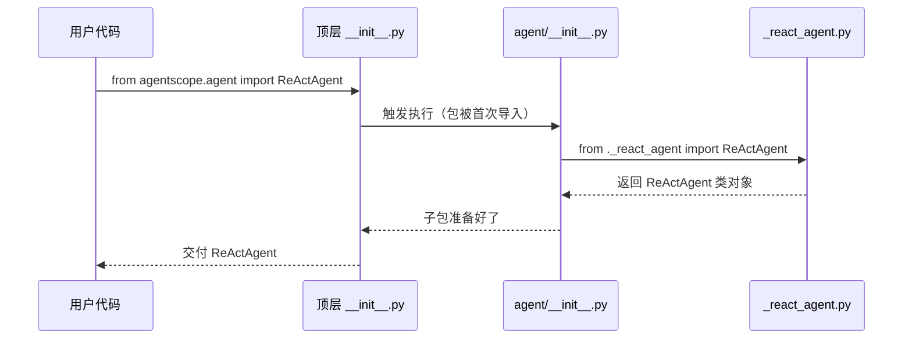

# 第 13 章 模块系统：命名与导入

你 clone 了 AgentScope，打开 `src/agentscope/` 目录，第一眼看到的就是一堆下划线开头的文件——`_agent_base.py`、`_react_agent.py`、`_model_base.py`……为什么有些文件要戴一顶下划线"帽子"？而你在写代码时，导入的却永远是 `from agentscope.agent import ReActAgent` 这样不带下划线的路径。这两件事是怎么对上的？

> 一套框架的"公共脸面"和"内部机房"被一道命名约定隔开：下划线前缀是门牌，`__init__.py` 是前台，用户只在前台办业务，永远不进机房。

> **上一章：[第 12 章 旅程复盘](../volume-1-journey/ch12-journey-review.md)**

## 13.1 路线图

卷二的主题是"拆开每个齿轮"——理解 AgentScope 用来组织代码的设计模式。这一章是卷二的第一站，我们先不进入任何一个具体的组件（那是后面几章的事），而是先看一眼**整个仓库是怎么把代码分门别类摆好的**。你可以把它理解成：进了一家大工厂，先参观它的平面图和门牌系统，再走进具体的车间。



这一章的位置很特殊：它讲的不是某一个"运行时"组件，而是**代码仓库本身的组织规则**。理解了它，你在后面读任何一章、看任何一个组件时，都能立刻判断"这是公开给用户用的，还是框架内部自己用的"。

## 13.2 知识补全：Python 的模块与包

在讲 AgentScope 怎么用之前，先把 Python 本身组织代码的规矩捋清楚。这块如果你已经很熟，可以跳过；不熟的话，花两分钟过一遍就够了。

### 文件就是模块，目录就是包

Python 组织代码的思路朴素得像图书馆：

- 一个 `.py` 文件，就是一个**模块**（module）——一本书。
- 一个里面放了 `__init__.py` 的目录，就是一个**包**（package）——一个书架，里面整齐摆着好几本书。
- 书架还可以套书架，于是包可以嵌套。

```python
# 一个典型的导入语句，拆开看就是一段"去哪个书架、拿哪本书、翻到哪一页"
from agentscope.agent import ReActAgent
#   └─包 agentscope─┘ └子包 agent┘    └符号 ReActAgent┘
```

### `__init__.py` 是前台

`__init__.py` 这个文件很特殊，它是包的"前台"。当你写 `from agentscope.agent import X` 时，Python 干的第一件事就是**执行** `agentscope/agent/__init__.py`，前台决定了你能从这个包"领走"哪些东西。

用一个表格把这套规矩收一下：

| 概念 | 对应的实体 | 日常类比 |
|------|-----------|---------|
| 模块（module） | 一个 `.py` 文件 | 图书馆里的一本书 |
| 包（package） | 含 `__init__.py` 的目录 | 一个书架 |
| `__init__.py` | 包的初始化文件 | 书架前台的借阅清单 |
| 导入路径 | `包.子包.符号` | "二楼·科幻区·《三体》" |

理解了"前台"这个比喻，下一节 AgentScope 的命名约定就好懂了：它本质上是规定了**哪些书放在前台展示，哪些书锁在后台库房**。

## 13.3 命名约定：下划线前缀与公共 API 边界

现在进入正题。AgentScope 仓库里几乎所有文件名都遵循一条约定：

> 以 `_`（下划线）开头的文件，是**内部实现**，不应该被外部直接导入；不以 `_` 开头的才是给用户的公共 API。

打开任何一个子目录，你都会看到同样的排版——内部实现文件齐刷刷戴着下划线帽子，前台 `__init__.py` 站在最前面：

```
agentscope/agent/
├── __init__.py            # 前台：暴露公共 API
├── _agent_base.py         # 内部：AgentBase 抽象基类
├── _react_agent_base.py   # 内部：ReActAgentBase
├── _react_agent.py        # 内部：ReActAgent
├── _user_agent.py         # 内部：UserAgent
├── _user_input.py         # 内部：用户输入处理
├── _a2a_agent.py          # 内部：A2AAgent
└── _realtime_agent.py     # 内部：RealtimeAgent
```

### 两种导入，一条规矩

同一个类，你可以用两种方式导入它，但只有一种是"被祝福"的：

```python
# ❌ 不推荐：直接钻进内部文件
from agentscope.agent._react_agent import ReActAgent

# ✅ 推荐：走前台
from agentscope.agent import ReActAgent
```

注意：第一种写法在技术上是**能跑通的**——Python 并不会拦你，下划线前缀只是个**约定**，不是语言强制。但框架作者用这条约定画出了一道"公共 API 边界"，越过这条边界，就意味着你接受了"以后这块随时可能改、改了也不通知你"的风险。

### 这道边界解决的是"信任"问题

为什么非要画这道线？用一个比喻：想象一家饭店。顾客只看菜单（公共 API），后厨怎么切菜、用什么牌子的灶台（内部实现）顾客并不关心。如果某天主厨把后厨重新装修了一遍，只要菜单上的菜还是那个味道，顾客的体验就不受影响。

AgentScope 的下划线约定，本质上就是"菜单"和"后厨"的分界：

| 角色 | 文件特征 | 类比 | 对你的承诺 |
|------|---------|------|-----------|
| 公共 API | 无下划线 / 通过 `__init__.py` 暴露 | 菜单上的菜 | 跨小版本尽量保持稳定，改了会写进升级说明 |
| 内部实现 | `_` 前缀文件 | 后厨的灶台 | 可以随时重构、改名、合并，不另行通知 |

这条规矩带来的三个实际好处：

1. **内部可以放心重构**——只要 `__init__.py` 导出的名字不变，外部代码一根毫毛都不会伤到。
2. **IDE 的自动补全更干净**——敲下 `from agentscope.agent import` 时，提示框里只出现菜单上的菜，不会塞给你一堆后厨灶台的名字。
3. **文档天然有条理**——公共 API 就是前台展示的那几张牌，文档照着写就行，不必解释每一个内部辅助类。

> **设计一瞥**：下划线前缀是整个 Python 社区的惯例，不是 AgentScope 的发明，也不是语言层面的强制。Python 没有"真正的私有"，`_` 只是写在名字里的一句"请勿打扰"。但在一个会被成百上千人依赖的框架里，这句礼貌的提醒比任何语言强制都重要——它定义了**契约的边界**，让"哪些东西算承诺、哪些不算"变得一目了然。

## 13.4 导入路径的三层结构

理解了"前台/后厨"的分界，AgentScope 的导入路径就只剩下"数楼层"了。整个导入体系可以看成三层楼：



- **顶层包 `agentscope`**：整个框架的入口，它的 `__init__.py` 负责把所有子包挂上来，还负责定义 `__all__`。
- **子包层**：按职责切分的目录——`agent`、`model`、`tool`、`memory`、`message`、`formatter`、`module`……每个目录是一个"功能区"。
- **内部实现层**：每个子包里那些戴下划线帽子的 `.py` 文件，真正干活的代码住在这里。

### 顶层 `__init__.py` 做的两件事

最顶层那个 `agentscope/__init__.py`，你可以把它想象成工厂大门的传达室，干两件事：

```python
# 第一件：把所有"车间"（子包）登记上墙
from . import agent
from . import model
from . import formatter
from . import tool
from . import memory
# ……以及其余子包
```

```python
# 第二件：列出对外承诺的"名片"
__all__ = ["init", "agent", "model", "formatter", "tool", "memory", ...]
```

第一件让 `agentscope.agent` 这样的路径变得可用；第二件 `__all__` 则是一张明确的"白名单"，告诉工具和别的开发者：`from agentscope import *` 时，只许带走这些名字。

### 子包 `__init__.py`：前台的借阅清单

每个子包的 `__init__.py`，就是它自己的前台。它的工作单一而重要——**从一堆内部文件里挑出该亮相的公共类，摆上柜台**：

```python
# agentscope/agent/__init__.py 长这个样子
from ._agent_base import AgentBase
from ._react_agent_base import ReActAgentBase
from ._react_agent import ReActAgent
from ._user_agent import UserAgent
from ._a2a_agent import A2AAgent
from ._realtime_agent import RealtimeAgent

__all__ = [
    "AgentBase", "ReActAgentBase", "ReActAgent",
    "UserAgent", "A2AAgent", "RealtimeAgent",
]
```

读懂了这段，你就读懂了 AgentScope 整个公共 API 的"清单逻辑"：左边那一列 `from ._xxx import` 把内部文件里的类拉到前台，右边 `__all__` 又给前台的名牌盖了个章——**这些，就是我们对用户承诺的菜单**。

### 一条 import 背后的接力

现在回头看开头那句 `from agentscope.agent import ReActAgent`，它其实跑完了一场三棒接力：



整个过程对用户是透明的——你写一行，Python 在背后帮你跑通整条链。而你拿到的 `ReActAgent`，和某个胆大的人绕过前台、直接从 `_react_agent.py` 里掏出来的 `ReActAgent`，是**同一个对象**（指向同一块内存里的类定义）。区别只在于：前者是框架承诺的、稳定的方式；后者是偷偷溜进后厨，下次重构时可能就找不到门了。

## 13.5 特殊模块：不是所有下划线都长在子包里

讲到这里，规则其实已经讲完了。但 AgentScope 里还有几类"特殊户"，值得单独点一下——它们也戴下划线帽子，但不住在子包里，而是直接坐在顶层 `agentscope/` 目录下。理解它们的位置，能帮你把心智模型补完整。

| 模块 | 住在哪 | 干什么的 | 为什么是"内部" |
|------|--------|---------|---------------|
| `_run_config.py` | 顶层 | 全局配置类 `_ConfigCls`，用 `ContextVar` 保证异步安全 | 配置细节随时调整，不该让用户直接依赖 |
| `_logging.py` | 顶层 | 日志初始化，被 `init()` 调用 | 日志后端是实现细节 |
| `_version.py` | 顶层 | 存 `__version__` 字符串 | 一个常量而已，没必当成 API |
| `_utils/` | 顶层（子包） | 框架内部用的工具函数、Mixin | 内部辅助代码，签名不承诺稳定 |

注意一个有趣的细节：`_utils/` 自己也是一个**包**（它有自己的 `__init__.py`），里面还套着 `_common.py`、`_mixin.py` 这些下划线文件。这印证了命名约定的一致性——**下划线前缀不分模块还是包，一律表示"内部"**。你可以把 `_utils/` 想成"后厨的工具间"，里面放着锅碗瓢盆（通用工具函数）和食谱小抄（像 `DictMixin` 这种 Mixin），这些家伙只供后厨自己用，绝不端上顾客的餐桌。

> **设计一瞥**：把配置类、日志、版本号都放在顶层、都加下划线，看似零散，其实是同一条原则的贯彻——**凡是"框架启动/运行时基础设施"，都归到内部**。用户只需要知道有一个 `agentscope.init()` 入口，至于它背后读了哪些配置、初始化了哪些日志后端，那是后厨的事。这种"把基础设施藏起来，只露一个入口"的做法，是框架保持表面简洁的关键。

## 13.6 `init()` 与模块发现：为什么你不用手动 import

如果你回想卷一第 3 章，我们一上来就调用了 `agentscope.init(...)`。那时我们只说它"做了初始化"，现在可以把"初始化"这件事在模块层面讲清楚了。

`init()` 在模块系统里扮演的角色，其实就是**工厂的"开机仪式"**：按下总开关，让所有车间（子包）依次就位、各自完成自己的启动准备工作。它的逻辑可以概括成三步：

```python
def init(project, ...):
    # 1. 安置全局配置（写到 ContextVar 里）
    _ConfigCls(...)
    # 2. 触发所有子包的导入（执行它们的 __init__.py）
    from . import agent, model, formatter, tool, memory, ...
    # 3. 装配日志系统
    _logging.setup()
```

第 2 步是关键，也是最容易被忽略的一步。当 `init()` 执行 `from . import agent` 时，Python 会去执行 `agent/__init__.py`，而后者又会去 `from ._react_agent import ReActAgent`……一条链路触发下去，所有相关的内部文件都被加载、注册。

这就解释了一个看似平淡、其实很重要的体验：**你从来不需要手动把每个子包 import 一遍**。`init()` 替你按下了那个总开关，所有子包的公共 API 在那一刻就全部就位了。如果将来框架新增了一个子包，作者只需要在顶层 `__init__.py` 里加一行 `from . import new_module`，`init()` 自然会带上它——用户代码一行都不用改。

### `__all__` 的三重身份

前面提了好几次 `__all__`，这里把它的真实作用一次性讲透。`__all__` 不只是一个清单，它同时服务于三个不同的"读者"：

1. **给 `import *` 看的门禁**——决定了 `from agentscope import *` 会带走哪些名字，防止把内部对象也顺带捎出来。
2. **给 IDE 看的提示清单**——大多数现代 IDE 会把 `__all__` 里的名字列为自动补全的优先候选，敲代码时更顺手。
3. **给文档工具看的目录**——Sphinx 这类文档生成器，会读取 `__all__` 来决定"哪些对象值得出现在文档里"。

一个简单的字符串列表，同时承担了三种职责——这是 Python 生态里非常划算的一个约定。

## 13.7 设计一瞥：为什么用约定而不是强制

这一章反复出现一个词：**约定**。下划线前缀是约定、`__all__` 是约定、"不要直接导入内部文件"也是约定。一个自然的疑问是：既然这套规矩这么重要，Python 为什么不干脆在语言层面强制它？

答案和 Python 整体的设计哲学有关——**Python 信任程序员**。它给你足够的灵活性（想绕过前台随时可以），同时用惯例（下划线、`__all__`）把"推荐做法"写进了社区共识。这背后是一种叫"we are all consenting adults"（我们都是自愿的成年人）的态度：语言不替你做决定，但你得自己承担越界的后果。

AgentScope 选择顺着这条社区惯例走，得到的是几样实在的东西：

- **零运行时成本**——下划线前缀不引入任何性能开销，它只是个名字里的字符。
- **与工具链无缝**——IDE、linter、文档工具全都认这套约定，不用框架自己造轮子。
- **可演进的内部**——内部文件可以自由重组、重命名、拆分合并，只要前台的清单不变，外部世界毫无感知。

> 反过来想，如果框架硬要靠"运行时检查"来阻止你导入内部文件（比如在 `__init__.py` 里加一堆校验），那既会增加每次导入的开销，又会和 Python 生态里数不清的工具打架。约定换来的，是**轻量、稳定、与生态融洽**——这是框架级代码尤其看重的品质。

AgentScope 1.0 论文在描述整体设计时，把这套组织的意图讲得很清楚：

> "we abstract foundational components essential for agentic applications and provide unified interfaces and extensible modules"
>
> —— AgentScope 1.0: A Comprehensive Framework for Building Agentic Applications, arXiv:2508.16279, Section 2

翻译过来就是：把构建智能体应用所必需的基础组件抽象出来，给它们**统一的接口**和**可扩展的模块**。注意两个关键词——"统一接口"对应前台那份干净的公共 API 清单，"可扩展的模块"对应那些被仔细隔开的内部实现。**这一章讲的命名约定，正是"统一接口"得以存在的物理基础。**

## 检查点

走到这里，你应该能回答下面几个问题了。每个问题先自己想想，再对一下后面的散文解答。

**问题 1：为什么 AgentScope 几乎所有内部文件都用下划线开头，而不是用"私有"关键字或运行时校验来保护？**

下划线前缀是 Python 社区的惯例，它**零成本、零运行时开销**，还能和 IDE、文档工具、linter 等整条工具链无缝配合。框架选择顺着社区共识走，换来的是轻量、稳定、与生态融洽。如果改用运行时校验来强制隔离，既会增加每次导入的开销，又会和各种工具打架，得不偿失。代价是它依赖程序员的自觉——但这是 Python"我们都是自愿的成年人"哲学的一贯取舍。

**问题 2：用户写 `from agentscope.agent import ReActAgent` 时，背后依次发生了什么？**

这条 import 是一场三棒接力。首先，Python 执行顶层 `agentscope/__init__.py`，把 `agent` 子包挂上来；接着执行 `agent/__init__.py`，这一步会触发 `from ._react_agent import ReActAgent`，把内部文件里的类对象取出来摆上前台；最后前台把 `ReActAgent` 交给用户。整个过程用户只写一行，但背后跨过了顶层、子包、内部文件三层。

**问题 3：如果你新增了一个 Agent 类型，写在了 `_my_agent.py` 里，用户要怎样才能用 `from agentscope.agent import MyAgent` 导入它？**

需要做两件小事。第一，在 `agentscope/agent/__init__.py` 里加一行 `from ._my_agent import MyAgent`，把新类拉到前台；第二，把字符串 `"MyAgent"` 加进同一个文件里的 `__all__` 列表，正式给它盖上"公共 API"的章。这两步缺一不可——前者让它能被导入，后者让它出现在补全、文档和 `import *` 的白名单里。

**问题 4：`_utils/` 这个目录为什么也带下划线？它和普通的子包（比如 `tool/`）有什么本质区别？**

带不带下划线，表示的是**面向内部还是面向用户**的承诺，与它是模块还是包无关。`_utils/` 带下划线，意味着它是"后厨的工具间"——里面的锅碗瓢盆（通用工具函数）和食谱小抄（Mixin 类）只供框架内部各车间使用，签名和行为可以随时调整，不会写进对用户的承诺。而 `tool/` 不带下划线，是用户会直接 import 的功能区。两者的目录形态可以一样，但"对外的承诺级别"完全不同。

## 下一站预告

这一章我们看的是"平面图和门牌系统"——AgentScope 怎么用下划线约定和 `__init__.py` 把代码分门别类、划出公共 API 边界。但我们一直没回答另一个更具体的问题：**那些摆在前台上的类，彼此之间是什么关系？** 比如 `AgentBase`、`ReActAgentBase`、`ReActAgent` 这三个名字，为什么一个比一个长？它们是平级的三兄弟，还是一层套一层的继承链？

下一章我们就走进继承体系，沿着 `StateModule` → `AgentBase` → `ReActAgentBase` → `ReActAgent` 这条四层链路，看清楚每一层各贡献了什么能力，以及为什么要把一个 Agent 拆成四层而不是写成一个"大而全"的类。

> **下一章：[第 14 章 继承体系：从 StateModule 到 AgentBase](./ch14-inheritance.md)**
