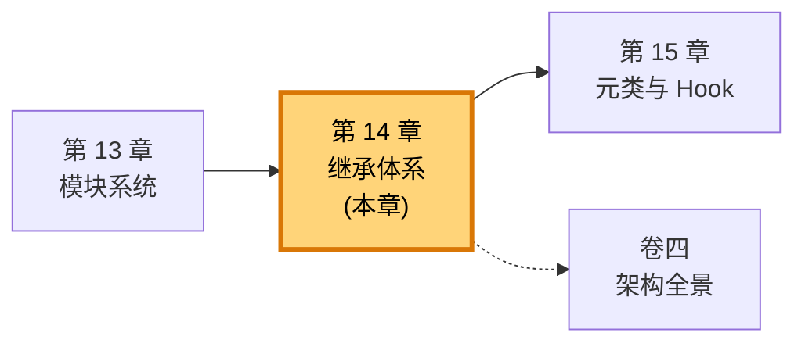
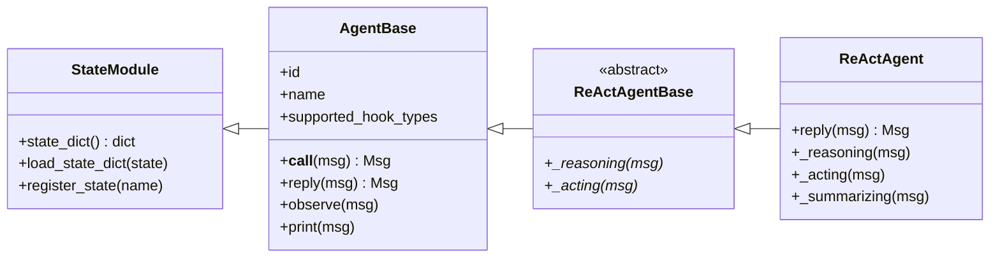
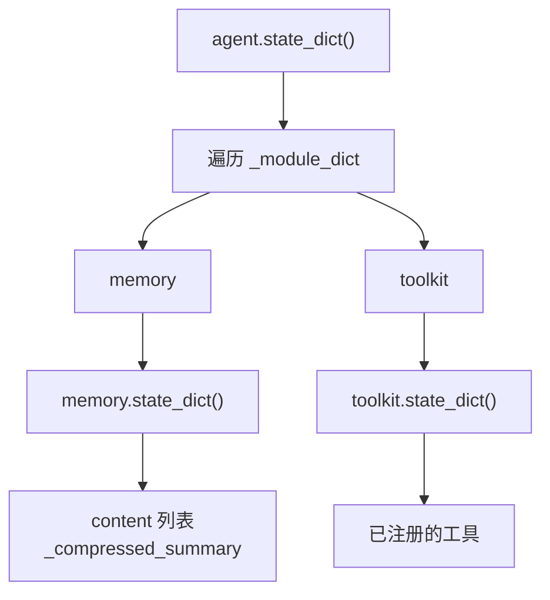
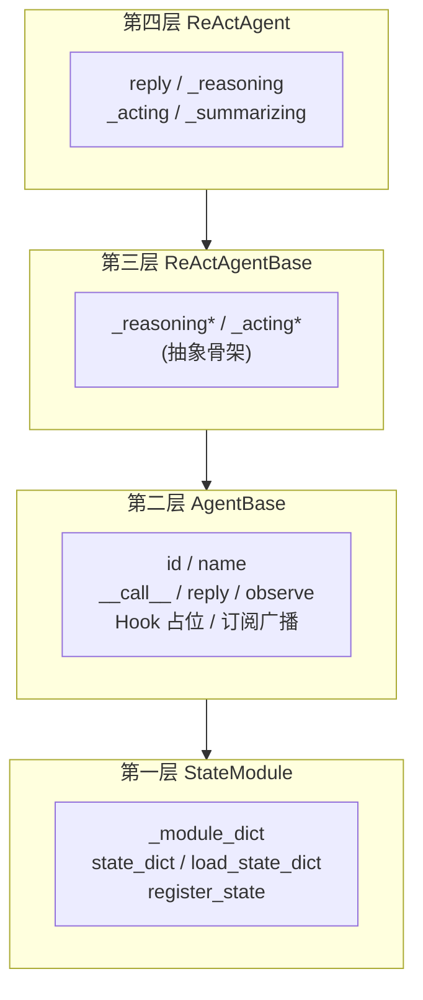

# 第 14 章 继承体系：从 StateModule 到 AgentBase

你在排查一个诡异的现象：一个 Agent 在序列化保存、再重新加载之后，原本聊得好好的记忆"凭空消失"了。Agent 本身恢复了，工具也能用，可对话历史像是被擦掉了一样。

排查这个 bug，绕不开一条贯穿全框架的继承链——`StateModule` → `AgentBase` → `ReActAgentBase` → `ReActAgent`。每一层都为这个 Agent 贡献了不同的能力，而记忆能不能被正确保存，正取决于这条链上最底层那一层的一个看似不起眼的设计。

> 一条继承链，就是一份职责的分工表。沿着它自底向上读，你能看清 AgentScope 把"序列化、调度、推理、实现"四件事拆成四层的全部理由。

> **上一章：[模块系统：命名与导入](./ch13-module-system.md)**

## 14.1 路线图

本章承接上一章对模块系统的讨论。上一章讲的是"包怎么组织、名字怎么导入"，本章要回答另一个问题：这些模块里的**类**之间，是怎样一层层搭起来的。我们会聚焦在最重要的一条继承主干上——所有 Agent 共享的那条。



本章先做一点面向对象的知识补全（继承、多态、`super()`、`__setattr__`），然后用一条清晰的线索走过四层继承：每一层加了什么能力、为什么单独成一层、以及最终那条序列化链路是怎样靠它们自动跑通的。结尾回到开篇的 bug，让你看清"记忆丢失"在概念层面的根因。

## 14.2 知识补全：继承、多态与属性拦截

在进入四层继承链之前，先快速对齐几个后面反复用到的概念。

**继承**是面向对象里"代码复用 + 类型抽象"的机制。子类继承父类，自动获得父类的所有方法，可以覆盖（override）或扩展它们：

```python
class Animal:
    def speak(self) -> str:
        return "..."

class Dog(Animal):
    def speak(self) -> str:        # 覆盖父类方法
        return "汪汪"
```

**多态**指：同一个方法调用，作用在不同子类上行为不同。`animal.speak()` 对 `Dog` 返回"汪汪"，对 `Cat` 返回"喵喵"——调用方不需要知道具体类型，只要对象"会 `speak`"就行。AgentScope 里这一点非常关键：上层代码只调用 `agent.reply(...)`，不关心底下是 `ReActAgent` 还是某个用户自定义的 Agent。

**`super()`** 用来调用父类版本的方法，常用于"先让父类做它该做的事，再加我自己的逻辑"：

```python
class ReActAgent(ReActAgentBase):
    def __init__(self, name: str, **kwargs):
        super().__init__(name=name, ...)   # 先让父类完成它的初始化
        # 再做 ReActAgent 特有的组装
```

本章里你还会遇到一个不太常见但极为重要的钩子：**`__setattr__` 拦截**。Python 中，每次给 `self.xxx = value` 赋值，都会调用对象的 `__setattr__` 方法。父类可以重写它，在"属性被存进去"这个时机做点额外的事——比如自动记录下"我有一个子模块"。这正是 `StateModule` 实现自动追踪的关键，后面会展开。

最后记住一张对照表，理解继承链时不断回看它：

| 概念 | 一句话 | 在本章的作用 |
|------|--------|--------------|
| 继承 | 子类获得父类方法 | 四层逐层累加能力 |
| 多态 | 同一调用，不同行为 | 上层只调 `reply`，不关心子类 |
| `super()` | 调父类版本 | 每层初始化都先调父类 |
| `__setattr__` 拦截 | 赋值时插入逻辑 | `StateModule` 自动追踪子模块 |
| 抽象方法 | 父类只定义不实现 | `ReActAgentBase` 立骨架 |

有了这套词汇，我们就可以走继承链了。

## 14.3 四层继承链：一张全景图

把四层放在一起看，先建立整体印象，再逐层下钻。



四层的分工，用一张表先说清楚，后面再展开：

| 层 | 类名 | 增加的能力 | 一句话定位 |
|----|------|-----------|-----------|
| 第一层 | `StateModule` | 序列化（保存/恢复状态） | "我能被存盘" |
| 第二层 | `AgentBase` | 身份、Hook、广播、打印、`__call__` | "我是个 Agent" |
| 第三层 | `ReActAgentBase` | ReAct 推理骨架（抽象方法） | "我按推理-行动循环组织" |
| 第四层 | `ReActAgent` | ReAct 的具体实现 | "我能真正干活" |

一个朴素的疑问会冒出来：**为什么不把这些都塞进一个大类里？** 答案在 14.7 节"设计一瞥"里。现在先一层层往下看。

## 14.4 第一层 StateModule：能被存盘

`StateModule` 是整条链的根，但它**不是 Agent 专用**的。AgentScope 里凡是"需要被保存/恢复状态"的组件——Agent、Memory、Toolkit、各种模块——都从它继承。

它解决的问题是：**怎么把一个内存里的对象，变成一坨可以落盘、可以传输、还能原样装回来的数据。** 类比成快递：你寄一个家具，不能整个儿塞箱子，得拆成零件、列清单；到了目的地照清单再拼起来。`StateModule` 就是那张清单的"标准化模板"。

### 核心数据结构

`StateModule` 内部维护两个有序字典，分别登记两种"需要被追踪"的东西：

```python
self._module_dict: OrderedDict     # 子模块——也是 StateModule 的对象
self._attribute_dict: OrderedDict  # 注册的普通属性
```

`_module_dict` 装的是"它自己也是个 StateModule"的子对象；`_attribute_dict` 装的是那些虽然不是 StateModule、但用户声明需要保存的普通字段（后面会讲怎么声明）。

### __setattr__：赋值即登记

这是整个序列化机制最巧妙的一笔。`StateModule` 重写了 `__setattr__`：每次你写 `self.xxx = value`，它都会偷瞄一眼 `value` 是不是 `StateModule` 的实例——如果是，顺手把它登记进 `_module_dict`。

```python
def __setattr__(self, key, value):
    if isinstance(value, StateModule):
        self._module_dict[key] = value   # 自动登记
    super().__setattr__(key, value)
```

类比成公司的人事系统：新员工入职时，HR 不需要你专门跑一趟去登记——只要这个人的合同类型属于"可调岗员工"，入职流程会自动把他写进员工名册。你只管写 `self.memory = InMemoryMemory(...)`，剩下的归系统处理。

正因为 `InMemoryMemory`、`Toolkit` 这些都是 `StateModule` 的子孙，赋值给 Agent 的那一刻就被自动追踪了。**这解释了为什么记忆通常能被自动保存——只要类型对，登记就是免费的。**

### state_dict 与 load_state_dict：递归的拆装

登记是自动的，保存则是递归的。`state_dict()` 遍历 `_module_dict`，对每个子模块再调它的 `state_dict()`——一级级往下展开：

```python
def state_dict(self) -> dict:
    state = {}
    for key in self._module_dict:
        attr = getattr(self, key)
        if isinstance(attr, StateModule):
            state[key] = attr.state_dict()   # 递归！
    # 再加上 _attribute_dict 里手动注册的属性
    return state
```

`load_state_dict()` 是逆操作：照着字典，一级级把状态装回去。

```python
agent.state_dict()       # 拆：ReActAgent → memory → content 列表
agent.load_state_dict(s) # 装：字典 → 还原成完整 Agent
```

数据流动是这样的：



> **设计一瞥**：为什么用"递归字典"而不是 pickle 整个对象？因为字典是语言中立的、可读的、可选择性读写的。你可以只恢复记忆、不恢复工具；也可以跨进程、跨机器传这一坨字典。pickle 是一锤子买卖，且和具体 Python 类绑死，迁移性差得多。

### register_state：手动补登记

`__setattr__` 只能自动追踪 `StateModule` 类型的值。如果你的属性是普通整数、字符串、字典，自动登记机制管不到——这时就要手动注册：

```python
class MyAgent(AgentBase):
    def __init__(self, ...):
        super().__init__(...)
        self.counter = 0                    # 普通 int，不会自动追踪
        self.register_state("counter")      # 手动登记进 _attribute_dict
```

一句话总结两条规则：

| 属性类型 | 是否自动追踪 | 如何让 state_dict 收集它 |
|---------|-------------|------------------------|
| `StateModule` 子类实例 | 是 | 不用做任何事，赋值即登记 |
| 普通 int / str / dict / list | 否 | 调用 `register_state("名字")` |

这就是为什么 FormatterBase 不需要、也不应该继承 StateModule——Formatter 是无状态的，没什么可保存的。继承不是越多越好，是要匹配"我有没有需要存盘的状态"这个问题。

## 14.5 第二层 AgentBase：成为 Agent

`AgentBase` 在 `StateModule` 之上，把一个"可序列化的对象"升级成"一个真正的 Agent"。它的声明长这样（注意那个 `metaclass`，下一章详讲）：

```python
class AgentBase(StateModule, metaclass=_AgentMeta):
    ...
```

这一层增加的能力，可以归成四组：

| 能力组 | 关键成员 | 作用 |
|-------|---------|------|
| 身份 | `id`、`name` | 每个 Agent 有唯一 id 和人类可读名字 |
| Hook 系统 | `supported_hook_types`、类级/实例级 hook 字典 | 方法调用前后可被拦截 |
| 调度与广播 | `__call__`、`reply`、`observe`、`_subscribers` | 接收消息、产生回复、通知订阅者 |
| 打印 | `print` 方法 | 把 Msg 美化输出到终端 |

### Hook 的占位

`AgentBase` 把支持哪些 Hook 明明白白列出来：

```python
supported_hook_types = [
    "pre_reply", "post_reply",
    "pre_print", "post_print",
    "pre_observe", "post_observe",
]
```

这是为下一章埋的伏笔：元类 `_AgentMeta` 会扫描这张表，给每个被支持的方法自动套上"前钩—真方法—后钩"的三明治结构。本章你只需要知道：**这一层声明了"我这些方法可以被 Hook 拦截"，但拦截机制本身由元类提供，下一章拆。**

### __call__：Agent 的总入口

外界和 Agent 打交道，几乎总是通过 `__call__`——也就是 `agent(msg)` 这种调用形态。它内部只做两件事，但每一件都重要：

```python
async def __call__(self, *args, **kwargs) -> Msg:
    reply_msg = await self.reply(*args, **kwargs)   # 1. 产生回复
    await self._broadcast_to_subscribers(reply_msg)  # 2. 广播给订阅者
    return reply_msg
```

第一行 `self.reply(...)` 看似普通，但它背后站着元类：**真正执行的 reply 已经被 Hook 包过了**，所以这一行实际跑的是"pre_reply hooks → 真 reply → post_reply hooks"。

第二行广播，是 AgentScope 多 Agent 协作的基石之一。Agent 产出的回复消息会被推送给所有订阅者——别的 Agent、MsgHub、监控组件……它们据此决定自己的下一步。类比成播报员：电台主持人说完一句话，这句话不只给提问的听众，而是广播给所有调到这个频道的人。

> **设计一瞥**：`__call__` 之所以又短又关键，是因为它把"做事"和"通知"解耦了。`reply` 只负责产出消息，`_broadcast_to_subscribers` 只负责分发。你想接入一个新的下游（比如把每次回复写进数据库），不用碰 reply，挂个订阅者即可。

### reply：留给子类填

`AgentBase` 自己并没有给出 `reply` 的具体实现——它只定义了"每个 Agent 必须能回复"这个契约。具体的回复逻辑（是直接调 LLM？还是走 ReAct 循环？）交给子类。这就是多态在继承链里的体现：上层说"要能 reply"，下层决定"怎么 reply"。

`observe` 同理：用于让 Agent"被动接收"一条消息而不必回复（比如旁听别的 Agent 的对话）。它的具体处理方式也由子类决定。

## 14.6 第三层 ReActAgentBase：立起推理骨架

走到第三层，名字里出现了 ReAct。ReAct（Reasoning + Acting）是一种让 Agent "想一想、做一步、再想一想"的循环模式：先用思维链推理当前该干嘛，再调工具行动，把行动结果塞回记忆，循环往复直到任务完成。

`ReActAgentBase` 的职责是**把这个循环的骨架立起来**，但不提供具体实现。它声明了两个抽象方法：

```python
class ReActAgentBase(AgentBase, metaclass=_ReActAgentMeta):
    def _reasoning(self, msg) -> ...: raise NotImplementedError   # 抽象
    def _acting(self, msg) -> ...: raise NotImplementedError      # 抽象
```

`_reasoning` 负责推理一步（调用 LLM、决定是继续思考还是要调工具），`_acting` 负责执行一步（真正调用工具、把结果写回记忆）。骨架规定了"推理和行动是两个独立环节"，但不规定每个环节具体怎么做。

它还换了一个不同的元类 `_ReActAgentMeta`——这个新元类在父类基础上扩展了 Hook 类型（比如 `pre_acting` / `post_acting`），让"行动"这一步也可以被拦截。下一章我们会看到，元类本身是可以继承扩展的。

类比成建筑图纸：`AgentBase` 给了"这是个会回复的实体"的总纲，`ReActAgentBase` 在总纲上加了一张"我按推理-行动循环组织"的施工图，但具体用什么材料、刷什么漆，留给真正施工的 `ReActAgent`。

> **设计一瞥**：为什么把"骨架"和"实现"分成两层？因为 ReAct 只是一种模式，骨架可以支撑很多种具体实现——标准 ReAct、带反思的 ReAct、流式 ReAct……它们共享"推理-行动循环"这个结构，只在每个环节的内部算法上不同。把抽象骨架和具体实现分开，未来扩展新模式时不必重写循环逻辑。

## 14.7 第四层 ReActAgent：真正能干活的 Agent

终于到了用户直接打交道的那一层。`ReActAgent` 是一个**完整、可用的 Agent**，它把骨架里所有抽象方法都填上了实现：

| 方法 | 实现内容 |
|------|---------|
| `reply(msg)` | 编排完整的 ReAct 循环：调 `_reasoning` 与 `_acting`，直到判定结束 |
| `_reasoning(msg)` | 调 LLM，解析思维链，决定下一步是行动还是收尾 |
| `_acting(msg)` | 执行工具调用，把结果写回记忆 |
| `_summarizing(msg)` | 在循环结束时生成最终回复 |

它的构造函数也是整个继承链上"参数最丰富"的——系统提示词、模型配置、记忆、工具、循环上限、收尾判定……全在这里组装。组装时，它会先 `super().__init__(...)` 把父类该做的初始化做完，再设置自己的字段。

至此，一个普通用户写 `ReActAgent(name=..., model_config=..., ...)` 拿到的对象，已经同时拥有了四层的能力：能被存盘（来自 StateModule）、能调度和广播（来自 AgentBase）、按 ReAct 骨架组织（来自 ReActAgentBase）、能真正推理行动（来自自己）。**四层分工加在一起，才是一个完整的 Agent。**



## 14.8 回到开头：记忆为什么会丢

现在重看开篇那个 bug：Agent 序列化后恢复，记忆丢失。

根因几乎总在第一层 `StateModule` 的追踪机制上。序列化时，`state_dict()` 只会遍历 `_module_dict` 里登记过的子模块。记忆能不能进 `_module_dict`，取决于两件事：

1. **记忆对象的类型**必须是 `StateModule` 的子孙——也就是 `InMemoryMemory` 必须正确继承 `MemoryBase`，而 `MemoryBase` 必须继承自 `StateModule`。
2. **赋值时用的是普通属性赋值**——`self.memory = ...`，这样 `__setattr__` 才能拦截并登记。

只要这两条满足，`agent.state_dict()` 返回的字典里就一定包含 `"memory"` 这个键，里面装着完整的对话历史。反过来，如果哪天有人把记忆换成了一个**不继承 StateModule** 的纯 Python 容器，或者绕过了 `__setattr__` 直接塞进 `__dict__`，记忆就不会被登记，序列化结果里也就不会有它——bug 就这么诞生了。

排查时不需要打开源码，只需要从概念上确认："`memory` 这个属性，到底有没有进 `_module_dict`？" 在概念上，这就是检查它是不是 `StateModule` 的实例。如果是，登记免费；如果不是，要么换类型，要么手动 `register_state`。

> **设计一瞥**：为什么用四层继承而不是一层？每一层都有独立的职责。`StateModule` 被超过 10 个类复用（Agent、Memory、Toolkit……），改序列化逻辑不会波及 Agent；`AgentBase` 被所有 Agent 类型复用，改调度逻辑不会波及序列化；`ReActAgentBase` 把循环骨架和具体实现分离，方便派生新模式。如果把这些全塞进一个"上帝类"，任何一个改动都会牵一发动全身——耦合度太高。详见卷四关于"上帝类问题"与架构全景的讨论。

## 14.9 检查点

走完这条链，自检几个理解性的问题。

**1. 用一句话说清每一层的职责，再说说"为什么 ReActAgentBase 和 ReActAgent 要分成两层"。**

四层分别是：序列化（StateModule）、Agent 基础（AgentBase）、ReAct 骨架（ReActAgentBase）、具体实现（ReActAgent）。分两层的好处是：骨架定义"推理-行动循环"这个结构，可以被多种具体实现（标准 ReAct、流式 ReAct、反思式 ReAct……）共享；改动循环编排只动骨架，改具体算法只动实现，互不干扰。

**2. 为什么 `self.memory = InMemoryMemory(...)` 之后，记忆会被自动保存？它经历了什么？**

`InMemoryMemory` 继承自 `MemoryBase`，`MemoryBase` 继承自 `StateModule`。赋值时 `StateModule.__setattr__` 拦截这次赋值，发现右侧是 `StateModule` 实例，于是顺手把 `"memory"` 登记进 `_module_dict`。之后 `state_dict()` 遍历 `_module_dict` 时就会递归调用 `memory.state_dict()`，把记忆的对话历史一起带出来。

**3. 给 Agent 加一个普通整数计数器 `self.counter = 0`，它会被序列化吗？怎么让它被序列化？**

不会。`__setattr__` 只自动追踪 `StateModule` 实例，整数不在此列。需要手动调用 `self.register_state("counter")`，把它登记进 `_attribute_dict`，`state_dict()` 才会收集它。

**4. `agent(msg)` 这一行背后发生了什么？为什么说它"又短又关键"？**

它内部先 `await self.reply(msg)` 产生回复，再把回复广播给所有订阅者。短，是因为它只有这两步；关键，是因为 `reply` 已被元类 Hook 包裹（实际跑的是 pre_reply → 真 reply → post_reply），而广播是 Agent 之间联动的纽带。这两步分别管"做事"和"通知"，干净解耦。

**5. Formatter 为什么不该继承 StateModule？**

Formatter 是无状态的——它只做消息格式转换，没有需要保存的内部状态。继承 StateModule 会徒增维护成本（要实现 `state_dict`/`load_state_dict`），却没有任何收益。继承应当匹配"我有没有状态要存"这个问题，不是越多越好。

## 14.10 下一站预告

我们在 `AgentBase` 那一层反复看到一个词：`metaclass=_AgentMeta`。元类是什么？它怎么把"`pre_reply` → 真 `reply` → `post_reply`"这套三明治自动套到方法上？`supported_hook_types` 这张表又是怎么被扫描、变成实际拦截行为的？

这些问题的答案，正是让 `__call__` 里那行普通的 `self.reply(...)` 背后能挂满 Hook 的全部秘密。下一章，我们走进元类的世界。

> **下一章：[元类与 Hook：方法调用的拦截](./ch15-metaclass-hooks.md)**
