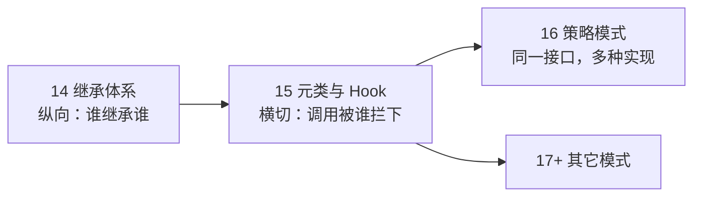
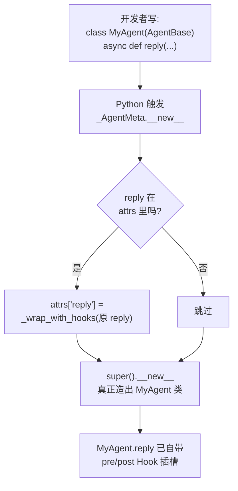
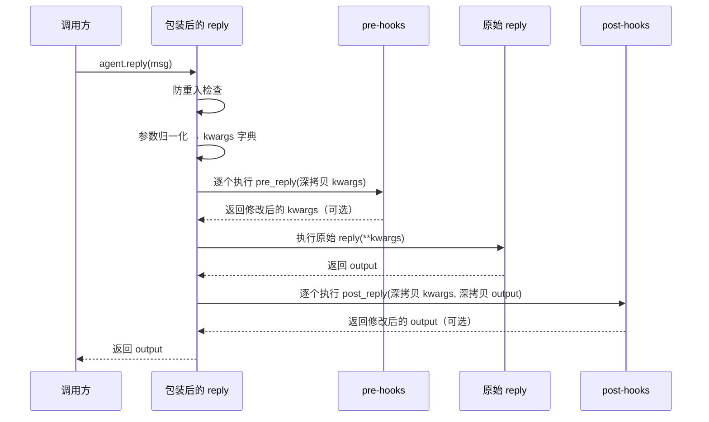
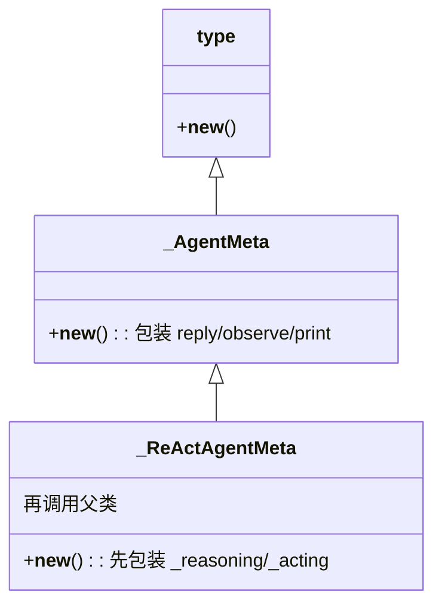

# 第 15 章 元类与 Hook：方法调用的拦截

你想在智能体每次 `reply` 前后自动插一段逻辑——记日志、校验参数、统计耗时——但又不想去改 `AgentBase` 的源码，也不想在每个子类里重复一遍样板。AgentScope 给的答案是 **Hook（钩子）**：在方法执行前后留出插槽，让外部代码挂上去。可这些插槽是从哪里冒出来的？谁来保证 `AgentBase` 的每一个子类都自动拥有它们？这一章我们就拆开这套机制——它的主角是 Python 里一个常被神化、其实很朴素的工具：**元类（metaclass）**。

> 类用来创建实例，元类用来创建类。把"创建类"这一刻拦下来，就能在类诞生前悄悄改它一笔。

> **上一章：[继承体系：从 StateModule 到 AgentBase](./ch14-inheritance.md)**

## 15.1 路线图

前一章我们看完了一棵继承树：`StateModule` → `AgentBase` → `ReActAgentBase` → `ReActAgent`。这一章我们换一个观察角度——**横切**。不再是"谁继承谁"，而是"方法的调用，在落到真正的业务代码之前，先经过哪几道关卡"。



本章的三件事：

1. **元类**怎么在"类定义时"就把方法包装好（15.2、15.3）；
2. **Hook 的执行链**长什么样：pre → 原始函数 → post，以及它如何避免被重复触发（15.4）；
3. **注册与参数**：实例级 vs 类级别、为什么 Hook 总是收一个 kwargs 字典（15.5、15.6）。

## 15.2 知识补全：元类是什么

在 Python 里，**类本身也是对象**。你写 `class Dog:`，Python 在后台真正做的事是：调用一个"造类的函数"把 `Dog` 这个对象造出来。这个造类的函数，默认就是内建的 `type`。

可以用一个对仗来记：

| 层级 | 谁创建谁 | 例子 |
|------|----------|------|
| 普通 | `Dog` 创建 `dog 实例` | `dog = Dog()` |
| 元 | `type` 创建 `Dog 类` | `Dog = type("Dog", (), {...})` |

**元类**就是"创建类的类"——它的实例是类，而不是普通对象。`type` 是 Python 的默认元类；你也可以自己写一个元类，去接管"造类"的过程。

为什么要接管？因为造类那一刻是个绝佳的拦截点：此时类的方法字典（`attrs`）已经准备好，但类本身还没"出生"。你可以在这一刻翻看字典、改写其中的方法、塞进新方法——所有这一切，都发生在任何实例被创建之前。

一个最小的心智模型：

```python
class MyMeta(type):
    def __new__(mcs, name, bases, attrs):
        # 此时 attrs 是"即将成为这个类"的全部属性/方法
        # 我们可以在这里改写它
        return super().__new__(mcs, name, bases, attrs)

class Foo(metaclass=MyMeta):
    pass   # Foo 被"造出来"之前，MyMeta.__new__ 已经跑过一遍
```

> **设计一瞥**：装饰器也能改写一个函数，但它要你逐个方法手动标注（`@decorate`）。元类不同——你只要让基类挂上某个元类，**所有子类在定义的瞬间就被统一加工**，子类作者完全无感。这正是 AgentScope 想要的效果：开发者写一个普通的 `class MyAgent(AgentBase)`，Hook 就已经接好了。

类比一下：装饰器像每个员工自己往工牌上别徽章；元类像公司前台的人力系统——你一入职，系统自动把工牌、门禁、邮箱一并办好，不需要你操心。

## 15.3 在类出生时下手：`_AgentMeta`

AgentScope 用一个叫 `_AgentMeta` 的元类来加工 `AgentBase` 的整个家族。它做的事可以浓缩成一句话：**凡是名叫 `reply` / `observe` / `print` 的方法，在类出生时统统包一层 Hook 外壳**。

示意性地看，它的逻辑是这样：

```python
class _AgentMeta(type):
    def __new__(mcs, name, bases, attrs):
        for name_ in ["reply", "print", "observe"]:
            if name_ in attrs:
                attrs[name_] = _wrap_with_hooks(attrs[name_])
        return super().__new__(mcs, name, bases, attrs)
```

读法：拿到"即将成为这个类"的属性字典 `attrs`；遍历三个关注的方法名；只要子类自己定义了某个，就用 `_wrap_with_hooks(...)` 把它包起来，再用包装后的版本替换原方法。最后才调用父类 `type.__new__` 把类真正造出来。

关键在于时机——这一切发生在**类定义时**，不是实例方法被调用时。后果是：任何继承自 `AgentBase` 的类，只要作者写了 `reply`，这个 `reply` 一出生就已经带好了 Hook 外壳，作者不需要加任何装饰器，甚至不需要知道 Hook 的存在。



> **设计一瞥**：为什么选元类而不是在 `AgentBase.reply` 里手写 Hook 调用？因为 `reply` 在 `AgentBase` 里是抽象的，真正的实现在每个子类里。元类加工发生在**每个子类**出生时，能保证子类自己的实现也被包上，而不用要求子类作者主动调用 `super().reply()`。这是一种"基类作者一次性努力、所有子类自动受益"的设计。

## 15.4 Hook 的执行链：pre → 原始函数 → post

被 `_wrap_with_hooks` 包过的方法，调用时的执行流程长这样：



把这张时序图读成一条流水线：

1. **防重入检查**：先看一个标志位。如果它已经被置上，说明当前已经处在 Hook 执行链里，就直接跳过 Hook、只执行原始函数。（为什么需要它，下面马上讲。）
2. **参数归一化**：把 `reply(msg, structured_model=None)` 不管怎么调用，统一化成一个字典 `{"msg": ..., "structured_model": ...}`。
3. **pre-hooks**：逐个跑。每个 pre-hook 拿到的是 kwargs 的**深拷贝**，可以改、也可以返回一个新的 kwargs 来替换。不返回（返回 `None`）就保持原样。
4. **原始函数**：用（可能被 pre-hook 改过的）kwargs 调用真正的 `reply`。
5. **post-hooks**：逐个跑。每个 post-hook 同时拿到 kwargs 和 output 的深拷贝，可以改 output。

### 为什么需要防重入

考虑继承链：`AgentBase.reply` 被包装过，`ReActAgentBase.reply` 也被包装过（因为两个类都挂了元类），子类可能还会再覆盖一次 `reply`。当调用最外层的 `reply` 时，如果不加保护，Hook 逻辑会一层层重复触发——pre 跑一遍、调用内层、内层又触发 pre 再跑一遍……

解决办法是一个简单的标志位，姑且叫"正在执行 Hook"的旗子：

- 最外层进入时，**先检查旗子**：旗子没立，就把旗子立起来，正常走 pre → 原始 → post，最后放下旗子。
- 内层进入时（比如最外层调用了 `super().reply(...)`），**发现旗子已经立着**，就直接跳过 Hook，只执行原始函数。

一句话：**整条继承链上，Hook 只在最外层执行一次**。

类比：寄一封跨国信。你家门口的邮筒是最外层邮局，它给你盖一次"已收寄"的章就够了。信再经过中转邮局、对方国家邮局、收件人楼下邮筒，这些中转都不应该再给你盖一次同样的章——它们只负责把信往下传。防重入标志就是"这封信已经盖过章了"的那个戳。

> **设计一瞥**：深拷贝参数和输出，是为了让 Hook 之间相互隔离——一个 pre-hook 修改了 kwargs，不应该影响另一个 pre-hook 看到的原始版本；post-hook 同理。代价是性能（每次都拷贝），换来的是 Hook 编写者可以放心大胆地改，不用担心副作用串扰。

### 注册的级别

Hook 可以注册在两个层级上，它们在执行链里的位置略有不同：

| 级别 | 注册方式 | 影响范围 | 执行顺序 |
|------|----------|----------|----------|
| 实例级 | `agent.register_instance_hook(...)` | 仅这一个 agent | 先执行 |
| 类级别 | `AgentBase.register_class_hook(...)` | 该类的**所有**实例 | 后执行 |

所以同一种 Hook（比如 `post_reply`），在同一个 agent 上的完整顺序是：

```
pre_reply(实例级) → pre_reply(类级别) → 原始 reply → post_reply(实例级) → post_reply(类级别)
```

类比：实例级 Hook 是"这个员工个人的备注"，类级别 Hook 是"全公司的规章制度"。处理一件事时，先看个人备注，再看公司规章。

## 15.5 参数归一化：让 Hook 拿到统一格式的"面单"

pre-hook 要能"修改参数"，但参数怎么传进来的并不固定——可能是位置参数 `reply(msg)`，也可能是关键字参数 `reply(msg=msg, structured_model=...)`。如果 Hook 直接拿到 `*args, **kwargs`，它就得自己猜"第 0 个位置是不是 msg"，非常脆弱。

解决办法是一道预处理：**把所有参数统一展开成一个 kwargs 字典**，再交给 Hook。这一步叫参数归一化。

| 调用方式 | 归一化后 Hook 看到的 |
|----------|----------------------|
| `await agent.reply(msg)` | `{"msg": msg}` |
| `await agent.reply(msg=msg)` | `{"msg": msg}` |
| `await agent.reply(msg, structured_model=m)` | `{"msg": msg, "structured_model": m}` |

这样 Hook 的作者面对的永远是一个字典：想读哪个参数就 `kwargs["msg"]`，想改就改完返回新字典。统一了入口，也统一了心智。

类比：快递公司不管你寄件时是怎么填的（手写面单、小程序下单、电话下单），分拣前都要把它转成内部统一的电子面单——字段固定、谁都能读。归一化就是"把调用转成统一面单"的工序。

## 15.6 扩展 Hook 种类：`_ReActAgentMeta`

`AgentBase` 的 Hook 只覆盖了三个通用方法（`reply` / `observe` / `print`）。ReAct 循环里还有两个更具特色的环节——**推理（reasoning）**和**行动（acting）**——开发者同样想在它们前后挂逻辑。于是 AgentScope 又造了一个元类 `_ReActAgentMeta`，它**继承自 `_AgentMeta`**，在父类的基础上再多包装两个方法：



`_ReActAgentMeta.__new__` 的思路：先自己在 `attrs` 里把 `_reasoning` 和 `_acting` 包好，然后调用 `super().__new__(...)`——也就是 `_AgentMeta.__new__`——由父类去包 `reply/observe/print`。两次加工叠加，ReAct 家族的类就同时拥有全部六种 Hook。

完整的 Hook 类型表：

| 元类 | Hook 时机 | 对应方法 |
|------|-----------|----------|
| `_AgentMeta` | `pre_reply` / `post_reply` | `reply()` |
| `_AgentMeta` | `pre_observe` / `post_observe` | `observe()` |
| `_AgentMeta` | `pre_print` / `post_print` | `print()` |
| `_ReActAgentMeta` | `pre_reasoning` / `post_reasoning` | `_reasoning()` |
| `_ReActAgentMeta` | `pre_acting` / `post_acting` | `_acting()` |

这张表读出来，就是 AgentScope 的"可挂载点地图"：通用的三个方法人人都有；ReAct 专属的两个方法只有推理型智能体才有。Hook 系统的对外 API（`register_instance_hook` / `register_class_hook`）就是往这张地图上的某个格子塞一个回调。

> **设计一瞥**：把"通用元类"和"扩展元类"做成继承关系，而不是写两个平行元类，好处是——将来如果又出现一种新的智能体家族（比如实时语音智能体），只需要再写一个 `_XxxAgentMeta(_AgentMeta)`，复用父类的三个通用 Hook 加工，只补自己特有的。元类继承是这套设计的可扩展性所在。

### 为什么要"造一个元类"而不是别的方式

到这里你可能会问：要给方法前后插逻辑，办法很多——装饰器、`__init_subclass__`、Mixin、甚至手动在每个方法里调 Hook——为什么偏偏选元类？把候选方案摆一摆：

| 方案 | 谁负责加工 | 子类作者负担 | 能否覆盖所有子类 |
|------|-----------|-------------|------------------|
| 装饰器 | 子类作者逐个标注 | 每个方法都要 `@hook` | 看作者自觉，可能漏 |
| `__init_subclass__` | 基类在子类创建时处理 | 无感 | 能 |
| Mixin | 子类作者主动继承 | 要记得继承 | 看作者自觉 |
| 元类 | 元类在类创建时处理 | 完全无感 | 能 |

`__init_subclass__` 和元类都能做到"无感覆盖所有子类"，能力上接近。AgentScope 选元类，部分是历史和风格原因——元类把"加工方法字典"这件事表达得更直接、更显式（它就在 `__new__` 里翻 `attrs`），也更符合"拦截类的创建"这个语义。重要的是它实现了**基类作者一次配置、所有子类自动受益**的目标，至于用元类还是 `__init_subclass__` 实现，是次要的工程选择。

Hook 系统是 AgentScope 自称的"高级智能体基础设施"的一部分，论文里这样概括它的定位：

> "we ground agent behaviors in the ReAct paradigm and offer advanced agent-level infrastructure based on a systematic asynchronous design"
>
> —— AgentScope 1.0: A Comprehensive Framework for Building Agentic Applications, arXiv:2508.16279, Section 2.2

这里的"基础设施"，就包括让你在不碰源码的前提下，往关键方法前后塞自定义逻辑的能力——而元类，是这套能力能"对子类无感生效"的根。

## 检查点

1. **元类加工发生在什么时候？** 为什么这个时机很重要？
   类被**创建**的那一刻（`class Foo:` 被解释执行时），早于任何实例诞生。选这个时机，是为了在方法字典 `attrs` 准备好之后、类对象正式出生之前改写它，从而保证类一出生，方法就已经带好 Hook 外壳——后续创建的每一个实例都天然拥有 Hook，无需运行时再加工。

2. **防重入保护解决什么问题？去掉它会怎样？**
   继承链上多个类都定义了同名方法（如 `reply`），每个都被元类包过。不加保护时，最外层调用会层层触发 Hook，pre/post 各跑多遍，逻辑重复、性能浪费、还可能引发意外副作用。加上一个"正在执行 Hook"的标志位，让最外层执行 Hook、内层只透传，保证整条链上 Hook 恰好执行一次。

3. **实例级 Hook 和类级别 Hook 谁先执行？这个顺序合理吗？**
   实例级先，类级别后。合理：实例级是"针对这一个具体 agent"的个性化逻辑，类级别是"针对整类 agent"的通用规则——个性化优先、通用兜底，符合"特殊先于一般"的直觉。

4. **为什么 pre-hook 收到的是 kwargs 字典而不是 `*args`？**
   因为 Hook 要能"读懂并修改"参数。位置参数对 Hook 不友好（它得猜第几个是什么），统一成字典后，Hook 可以按名字取参数、改参数、甚至注入新参数，再返回修改后的字典。这就是参数归一化的意义。

5. **`_ReActAgentMeta` 为什么继承 `_AgentMeta`，而不是平行另写一个？**
   为了复用父类对 `reply/observe/print` 的加工。`_ReActAgentMeta.__new__` 只需补上 `_reasoning/_acting`，再 `super().__new__` 让父类处理通用三件套。这样通用 Hook 逻辑只在一个地方维护，扩展时只需要增量叠加。

## 下一站预告

Hook 解决的是"在固定方法前后插逻辑"——插槽的位置是预定义好的（reply、observe、reasoning……）。还有一种更宽泛的横向模式：**同一个接口，根据不同情况挑选不同实现**。Formatter 正是这么干的——同一个"把消息发给模型"的抽象接口，落到 OpenAI、Anthropic、Gemini 各自不同的请求格式上。下一章我们看策略模式怎么让这套多形态适配干净地长出来。

> **下一章：[策略模式：Formatter 的多态分发](./ch16-formatter-strategy.md)**
