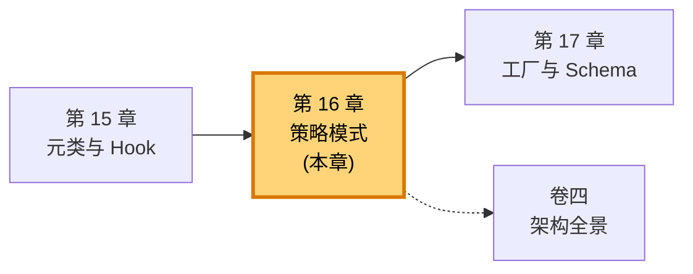
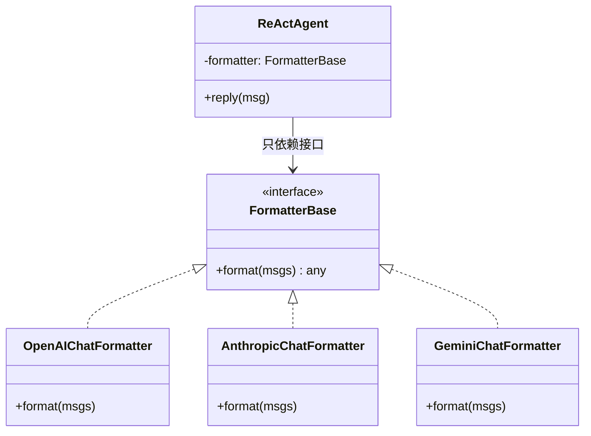
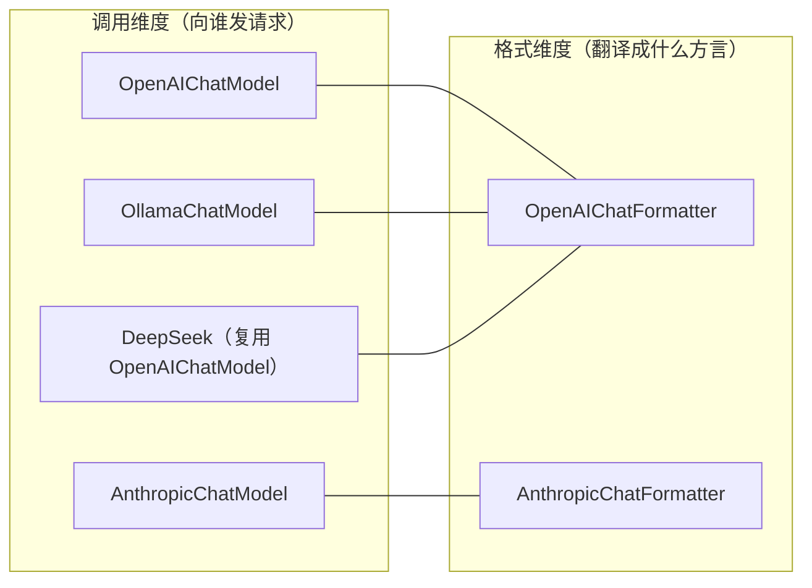
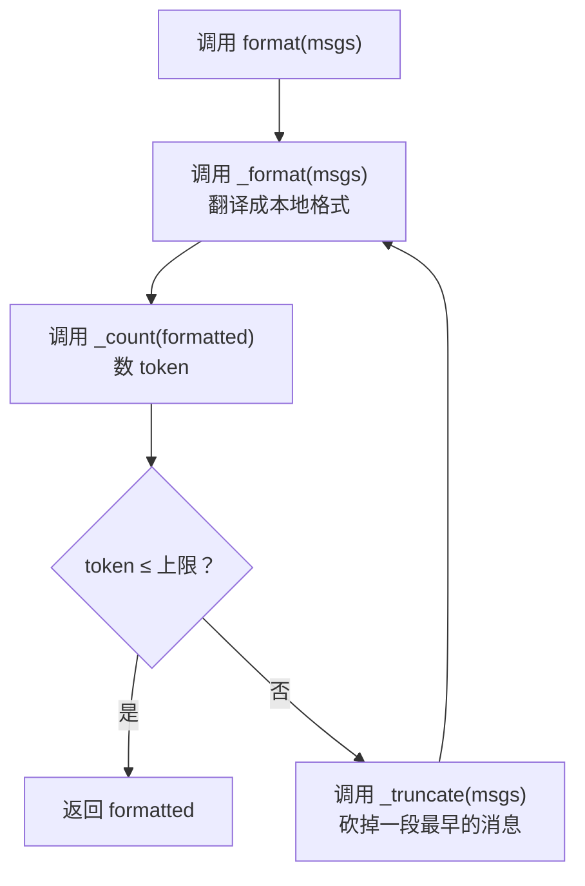
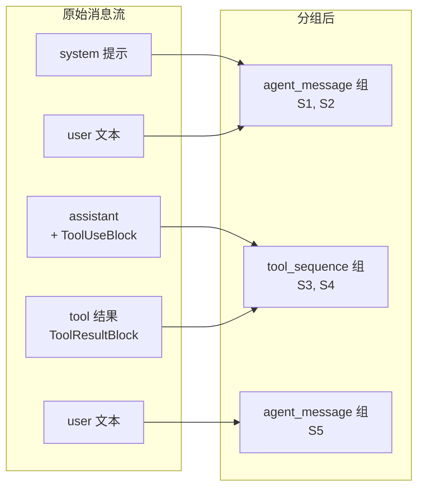

# 第 16 章 策略模式：Formatter 的多态分发

你把 Agent 的模型从 OpenAI 换成 Anthropic，对话的"感觉"一模一样——同一个 ReAct 循环、同一套工具调用、同一条记忆。可你抓包一看，发出去的 JSON 长得完全不一样：OpenAI 把工具调用塞进 `tool_calls` 数组，Anthropic 把它摊在 `content` 里当 `tool_use` 块。Agent 的代码一行没改，格式却天翻地覆。

这件事之所以成立，是因为 Agent 根本不认识"OpenAI 格式"或"Anthropic 格式"。它只认识一个抽象的 `Formatter`，对它说一句"把这些消息格式化一下"。至于格式化成什么样，是底下那个具体策略的事。这一章讲的就是这个"同一句话、不同实现"的设计——策略模式，以及它在 AgentScope 里最典型的化身：Formatter。

> 策略模式的本质不是"有很多类"，而是"调用者只依赖一个抽象接口，剩下的交给运行时替换"。Formatter 让 Agent 与百家的 JSON 格式彻底解耦。

> **上一章：[元类与 Hook：方法调用的拦截](./ch15-metaclass-hooks.md)**

## 16.1 路线图

上一章讲的是"方法调用发生时，框架怎么在背后插一脚"——元类、Hook、`__setattr__` 拦截，关注的是**时机**。这一章换一个维度：当同一段逻辑有多个候选实现时，框架怎么把它们组织起来、让上层无感地切换——关注的是**选择**。



本章先补两个设计模式的基础概念——策略模式与模板方法模式，用一个饭馆点菜的类比建立直觉；然后看 AgentScope 怎么把 Formatter 做成一组可替换的策略，以及为什么连 Model 本身也是一种策略；接着拆开 `format()` 这道门面，看清它内部用模板方法搭出的骨架（格式化 → 计数 → 截断）；最后落到最具体的地方：OpenAI 和 Anthropic 的 JSON 到底差在哪，以及这种差异是怎样被一行 `if isinstance` 都不写地消化掉的。

## 16.2 知识补全：策略模式与模板方法

在进入代码之前，先把两个会反复出现的设计模式对齐清楚。它们都是"把变化隔离开"的手段，但切的角度不同。

### 策略模式：换算法，不换调用方

**策略模式（Strategy Pattern）** 的核心一句话：定义一个统一接口，把"算法"封装成一个个可替换的实现，调用者只认接口、运行时挑实现。

用一个饭馆的类比。你是顾客，对服务员说"来一份套餐"。服务员背后可能有川菜厨师、粤菜厨师、日料厨师——你不需要点名哪一位，厨房按今天的排班决定谁来做。你点的"套餐"是接口，三位厨师是三套策略，你的体验（吃到一份饭）不因为换了厨师而改变。

落到类图上长这样：



关键的一点：调用方（`ReActAgent`）手里攥着的是 `FormatterBase` 这个类型，不是任何具体子类。它从不去问"你到底是谁"，只发指令 `format(...)`。谁答话、怎么答话，是运行时决定的。这就是"多态分发"——同一次调用，分派到不同的实现上。

### 模板方法：定骨架，留填空

**模板方法模式（Template Method）** 关注的是另一个问题：一件事的整体流程是固定的，但其中某些步骤会变。怎么在不重复写流程的前提下，让子类只填那几个变的步骤？

答案：父类把流程骨架写在一个具体方法里，把会变的步骤声明成抽象方法，留给子类去实现。骨架调用抽象方法时，自然就调到了子类的版本。

类比还是饭馆：套餐的出品流程是固定的——"接单 → 备料 → 烹饪 → 装盘"。这套流程写在后厨的总规程里。但"烹饪"这一步，川菜用爆炒、粤菜用清蒸——每个档口自己实现。总规程只调用"烹饪()"这个抽象动作，不关心具体怎么做。

| 模式 | 解决的问题 | 类比 | 在本章的体现 |
|------|-----------|------|-------------|
| 策略模式 | 同一件事有多种做法，要能整体替换 | 换厨师不换菜单 | Formatter 家族，可换 |
| 模板方法 | 一件事的骨架固定，部分步骤可变 | 总规程留"烹饪()"空位 | `format()` 骨架 + `_format()` 填空 |

这两个模式在 AgentScope 的 Formatter 里会**叠在一起**用——对外是策略（整个 Formatter 可以被换掉），对内是模板方法（`format()` 定骨架，子类填 `_format()`）。先记住这张对照表，后面具体看时随时回看。

> **设计一瞥**：策略模式解决"用什么算法"，模板方法解决"算法骨架长什么样"。一个管横向替换，一个管纵向复用。两者并不冲突，反而常常成对出现——一个类对外是策略、对内是模板，正是成熟框架里常见的组合拳。

## 16.3 策略在 AgentScope 中的体现：Formatter 家族

有了概念，看 AgentScope 把它落在哪里。Formatter 是策略模式最直白的实例。框架为每一家主流模型厂商准备了一个 Formatter，它们都实现同一个抽象接口，把 AgentScope 内部统一的 `Msg` 翻译成各家 API 听得懂的 JSON 方言。

| 类 | 翻译目标（API 方言） |
|----|---------------------|
| `OpenAIChatFormatter` | OpenAI Chat Completions 格式 |
| `AnthropicChatFormatter` | Anthropic Messages 格式 |
| `DashScopeChatFormatter` | 阿里云通义千问格式 |
| `GeminiChatFormatter` | Google Gemini 格式 |
| `OllamaChatFormatter` | Ollama 本地模型格式 |

它们的统一长这样（只展示形态，不贴源码）：

```python
class FormatterBase:
    async def format(self, msgs) -> Any:
        """把 Msg 列表翻译成某家 API 的请求体形态"""
        ...
```

调用方——也就是 ReActAgent 的推理循环——从头到尾只写一行：

```python
# Agent 的视角：我只管调用，不关心底下是谁
prompt = await self.formatter.format(msgs)
response = await self.model(prompt, tools=self.toolkit.get_json_schemas())
```

注意这里**没有** `if isinstance(self.formatter, OpenAIChatFormatter)` 这种判断。Agent 完全不知道、也不需要知道 `self.formatter` 具体是哪一位。这就是策略模式到位的标志：分支判断消失了，取而代之的是一次干干净净的方法调用，由多态负责分发到正确的实现。

### Model 也是一种策略

顺带说一句，Formatter 不是孤例。同一种思想在 Model 上也用了一遍：`ChatModelBase` 同样是一个抽象接口，底下的 `OpenAIChatModel`、`AnthropicChatModel`、`DashScopeChatModel`……是不同的"调用策略"。

```python
class ChatModelBase:
    async def __call__(self, messages, tools=None, ...) -> ChatResponse:
        """向某家模型 API 发起一次调用"""
        ...
```

Agent 手里同样只攥着 `ChatModelBase`，不关心它实际是哪家。所以一个完整的"对话回合"里，策略替换其实发生了两次：Formatter 决定怎么把消息"说出去"，Model 决定向谁说、怎么说回来。两者一前一后，把 Agent 与外部世界彻底隔开。

## 16.4 正交分解：为什么 Formatter 和 Model 要分开

读到这里你可能会问：Formatter 和 Model 干嘛要拆成两个？合在一起，每个厂商写一个"既懂格式又懂发请求"的类，不也挺顺吗？

想象不拆开的后果。假设有 5 家厂商、每家一种 JSON 方言，如果格式与调用绑死，就要写 5 个又大又重复的类，每个类里都混着"翻译消息"和"发 HTTP 请求"两摊逻辑。更要命的是组合：Ollama 兼容 OpenAI 的 API 格式，DeepSeek 走的也是 OpenAI 协议——它们的"格式策略"和 OpenAI 一模一样，但"调用策略"各不相同。绑死的话，要么复制粘贴一份格式逻辑，要么发明奇怪的继承关系。

拆开之后，这两个维度变成**正交**的——各自独立变化、自由组合：



Ollama 和 DeepSeek 都复用 `OpenAIChatModel` + `OpenAIChatFormatter`——因为它们说的就是 OpenAI 的方言。换一个本地部署的模型？换 Model 就行，Formatter 不用动。某家厂商升级了 API 字段？改 Formatter 就行，Agent 和其它厂商的代码一行不碰。

> **设计一瞥**：把"格式转换"和"API 调用"拆成两个正交维度，是 AgentScope 能用一套 Agent 代码对接十几种模型的关键。每个维度独立演化，组合时不必 1:1 绑定——这正是"正交分解"比"一厂一类"高明的地方。（这套组合的完整图景见卷四架构全景。）

用一个快递的类比收尾：Formatter 是"打包员"，决定你的包裹按哪家公司的面单格式来封装；Model 是"快递员"，决定包裹交给哪家公司去送。打包员和快递员各管一摊，你（Agent）只负责把货交到打包台上——后面的事，由你选的组合决定。

## 16.5 模板方法：`format()` 的骨架与子类的填空

到这里我们一直在讲"Formatter 可以整体替换"，这是策略模式的视角。但把镜头推近，看 `format()` 这个入口方法内部，会发现它自己又是一个模板方法——也就是说，所有 Formatter 共享同一套流程骨架，只有中间的"翻译"步骤因厂商而异。

这套骨架处理的是所有厂商都要面对的同一个麻烦：**消息太多，token 超了怎么办**。无论发往哪家 API，模型的上下文窗口都有限。Formatter 在真正翻译之前，得先保证消息总量在窗口之内。于是它反复走这么一个循环：



用代码形态表示这个骨架（示意，非源码）：

```python
class TruncatedFormatterBase(FormatterBase):
    async def format(self, msgs):
        while True:
            formatted = await self._format(msgs)      # 抽象步骤：子类填
            n_tokens = await self._count(formatted)   # 抽象步骤：子类填
            if n_tokens <= self.max_tokens:
                return formatted
            msgs = self._truncate(msgs)               # 抽象步骤：子类填
```

看清楚这里两件事的分工：

- **`format()` 是模板方法**——它是具体的、写在中间层基类里的、所有子类共享的。它定义了"格式化 → 计数 → 判断 → 截断 → 再来"这个算法骨架。子类**不需要**也不应该重写它。
- **`_format()`、`_count()`、`_truncate()` 是填空**——它们是抽象方法，每个具体 Formatter 自己实现：`_format` 决定翻成哪种方言，`_count` 用对应厂商的计数方式（不同厂商 token 化规则不同），`_truncate` 决定砍消息时保留哪些（系统提示通常不能砍）。

这就是模板方法的威力：流程只写一遍，永远只写一遍；变的只是中间那几个步骤。对比一下，如果不用模板方法，每个 Formatter 都要自己抄一遍这个 while 循环——五个类五份重复逻辑，改一处要改五处。

> **设计一瞥**：`TruncatedFormatterBase` 这个中间层是典型的"既有策略、又有模板"的双重身份。对 Agent 来说，它和它的子类们一起构成可替换的策略；对子类来说，它又是一份填空题的题面。框架里很多"Base"结尾的中间类，扮演的都是这种承上启下的角色。

## 16.6 消息分组：为什么要把对话切成两堆

模板方法里那个 `_format(msgs)`，子类实现它时并不是简单地把消息一条条翻译过去。它内部先做了一步关键操作——**把消息分成两组**，分别用不同的格式化策略。

为什么要分组？回到多 Agent 场景。一段对话历史里，消息来自四面八方：这个 Agent 说的、那个 Agent 说的、用户说的、还有工具调用和工具结果。其中有一个硬约束：**工具调用和它的结果必须紧挨着、按顺序出现**——这是所有主流 API 的共同要求，否则模型会困惑"这个 tool_use 是对哪条 tool_result 的回复"。

可真实对话里，工具调用序列很可能被别的消息打断。于是在格式化前，Formatter 先把消息过一道筛子：

- **`tool_sequence`（工具序列）**：含 `ToolUseBlock` 或 `ToolResultBlock` 的消息，它们必须被"归拢"成连续的块。
- **`agent_message`（纯消息）**：不含工具块的普通文本消息。



分组之后，两组各走各的格式化路径——`_format_tool_sequence` 和 `_format_agent_message` 两个抽象方法，分别负责把工具序列和纯消息翻译成本地方言。这正是为什么具体 Formatter 要实现两个 `_format_*` 而不是一个：它们在 JSON 里的长相差别很大。

用一个图书馆的类比：馆员整理归还的书时，先把"成套的系列小说"和"单本散书"分两堆。系列小说必须按卷号紧挨着上架（否则读者找不到下一卷），散书可以随便插空。Formatter 也是这么干——工具调用是一套必须连续的"系列"，纯消息是"散书"。这套分组逻辑对每家厂商都一样，所以它也住在中间层基类里，子类只管"格式化某一组"长什么样。

> **设计一瞥**：分组本身是一次对"消息语义"的抽象——框架识别出"工具相关 vs 纯文本"这个对 API 格式至关重要的维度，把它从具体厂商的 JSON 细节里提了出来。于是各家 Formatter 共享了"先分组、再分路格式化"的结构，只填最后那一步的 JSON 模板。

## 16.7 Provider 差异：同一段对话，三处不同长相

理论讲完了，来看最具体的东西——同样一段对话，OpenAI 和 Anthropic 要的 JSON 到底差在哪。这是策略模式价值的最终证明：差异再大，Agent 也看不见。

差异主要集中在三处：**系统提示**、**工具调用**、**工具结果**。我们一处一处对比。

### 系统提示：消息列表里 vs 顶层字段

OpenAI 把系统提示当成 messages 列表里普普通通的第一条：

```json
{"role": "system", "content": "你是天气助手。"}
```

Anthropic 则要求把它从 messages 里"提"出来，作为请求体的一个独立顶层字段：

```json
{"system": "你是天气助手。", "messages": [...]}
```

这里有一个很值得注意的分工细节：把系统消息从 messages 提升到顶层 `system` 字段，**不是 Formatter 干的**。Formatter 只负责把 `Msg` 翻译成本地消息格式，翻译完之后，系统消息仍然以 `{"role": "system"}` 的形态待在 messages 里。真正把它"搬"到顶层字段的是 **Model 层**——`AnthropicChatModel` 在真正发请求前，会检查 messages 的第一条是不是 system，是的话取出来塞进请求的 `system` 参数。

这是"正交分解"在细节处的体现：Formatter 管"消息长什么样"，Model 管"请求体怎么组装"。同一份翻译产物，到 Model 这一层才完成最后的 API 适配。这种分工让 Formatter 保持纯粹——它不必知道"顶层字段"这种 HTTP 请求级别的事。

### 工具调用：`tool_calls` 数组 vs `content` 里的块

OpenAI 把助手发起的工具调用，放在一个专门的 `tool_calls` 数组里：

```json
{
  "role": "assistant",
  "tool_calls": [
    {"id": "c1", "type": "function",
     "function": {"name": "get_weather", "arguments": "{\"city\": \"北京\"}"}}
  ]
}
```

Anthropic 则把工具调用摊平到 `content` 数组里，和文本块平起平坐，类型叫 `tool_use`：

```json
{
  "role": "assistant",
  "content": [
    {"type": "text", "text": "让我查一下。"},
    {"type": "tool_use", "id": "c1", "name": "get_weather", "input": {"city": "北京"}}
  ]
}
```

注意两个细节差别：OpenAI 的 `arguments` 是一段**字符串化**的 JSON（要再编码一次），Anthropic 的 `input` 是**结构化对象**（直接就是字典）。这种"字符串 vs 对象"的差异，正是每种 Formatter 必须各自实现 `_format_tool_sequence` 的根本原因——它们处理的是完全不同的数据形态。

### 工具结果：独立角色 vs 包装在 user 里

工具执行完，结果要送回模型。OpenAI 给它一个独立的角色 `tool`：

```json
{"role": "tool", "tool_call_id": "c1", "content": "北京：晴，25°C"}
```

Anthropic 则规定：工具结果必须挂在 `user` 角色名下，作为一个 `tool_result` 类型的内容块：

```json
{"role": "user", "content": [
  {"type": "tool_result", "tool_use_id": "c1", "content": "北京：晴，25°C"}
]}
```

这是 Anthropic API 的硬性约定——它没有 `tool` 这个角色，工具结果必须"借住"在 user 名下。Formatter 实现时就要专门为 Anthropic 做这层包装，而不是像 OpenAI 那样直接给一个新角色。

把三处差异收在一张表里：

| 差异点 | OpenAI | Anthropic |
|--------|--------|-----------|
| 系统提示 | messages 里第一条 `system` 消息 | 请求顶层 `system` 字段（由 Model 层提升） |
| 工具调用 | `tool_calls` 数组，`arguments` 为 JSON 字符串 | `content` 里的 `tool_use` 块，`input` 为对象 |
| 工具结果 | 独立 `tool` 角色 | 包装在 `user` 角色内的 `tool_result` 块 |

看完这张表，你就理解了为什么"一个 Formatter 走天下"是行不通的——概念虽然一致，JSON 结构却是三处都不同的三套方言。而策略模式的价值恰恰在这里闭环：**差异越大，越要把它关在 Formatter 这一个盒子里**，让 Agent 永远只面对统一的 `Msg`、`TextBlock`、`ToolUseBlock`、`ToolResultBlock`。盒子外面是岁月静好，盒子里是各显神通。

> **设计一瞥**：策略模式不是"消灭差异"，而是"给差异找一个固定的住所"。Formatter 就是 AgentScope 给各家 API 差异安排的住所——所有方言翻译都集中在这里，盒子的边界就是抽象接口。改一家厂商的适配，只动这一个盒子；加一家新厂商，只新增一个盒子。Agent 和其它厂商的代码，岿然不动。

## 检查点

走完这一章，用几个问题检验一下理解。建议先自己想答案，再往下看参考。

1. **如果 OpenAI 明天改了工具调用的 JSON 字段名，你需要改哪些地方？ReActAgent 要改吗？**
   只需要改 `OpenAIChatFormatter`（格式翻译）和可能涉及响应解析的 `OpenAIChatModel`。ReActAgent 一行都不用动——它处理的始终是统一的 `Msg` 和内容块，API 的字段名变动被 Formatter 这层挡在了外面。这正是策略模式最大的回报。

2. **策略模式和模板方法模式在 Formatter 上是怎么"叠"在一起的？**
   对外，整个 Formatter 是策略——Agent 只依赖 `FormatterBase`，运行时换成哪家都行。对内，中间层基类用模板方法搭出了 `format()` 的骨架（格式化 → 计数 → 截断循环），把会变的步骤声明成抽象方法，留给各子类填空。一个类同时是"可替换的策略"和"带填空的模板"。

3. **为什么 `_format` 内部要先做消息分组（`tool_sequence` / `agent_message`），而不是一条条顺序翻译？**
   因为所有主流 API 都有一个硬约束：工具调用和它的结果必须连续、按序出现。真实对话里它们可能被别的消息打断，所以格式化前必须先把它们"归拢"成连续块。分组后两组走各自的格式化路径（`_format_tool_sequence` 和 `_format_agent_message`），既满足 API 的连续性要求，又让"怎么翻工具序列"和"怎么翻纯文本"这两套差异很大的逻辑分开实现、各管各的。

4. **把系统消息提升到 Anthropic 的顶层 `system` 字段，是 Formatter 还是 Model 干的？为什么要这样分工？**
   是 Model 层干的。Formatter 只负责把 `Msg` 翻成本地消息格式，翻完之后系统消息仍以 `{"role": "system"}` 待在 messages 里；是 `AnthropicChatModel` 在发请求前把它搬到顶层字段。这样分工让 Formatter 保持纯粹——它只懂"消息形态"，不必关心"HTTP 请求体怎么组装"。格式维度和调用维度的边界，在这里划得很干净。

5. **Ollama 兼容 OpenAI 的 API，DeepSeek 也走 OpenAI 协议。这在 Formatter/Model 的正交分解里意味着什么？**
   意味着它们可以**复用** `OpenAIChatFormatter` + `OpenAIChatModel`，而不必新写一套格式逻辑。这正是正交分解的好处：格式维度独立于调用维度，同一种"方言"可以被多个"调用方"共享。如果没有这种拆分，要么复制粘贴，要么硬造继承关系，都会让代码膨胀。

## 下一站预告

这一章看到，Formatter 把统一的 `Msg` 翻译成各家 API 的 JSON 方言，让 Agent 与外部世界解耦。但翻译消息只是故事的一半——Agent 还要告诉模型"我有哪些工具可用"。这些工具的描述，是一份份 JSON Schema：参数叫什么、什么类型、有什么约束。可这些 Schema 不是手写的，它们是从 Python 函数的签名、类型标注、docstring 里**自动生成**的。怎么从一个普通函数，变出一份模型能读懂的工具说明书？下一章我们走进工厂与 Schema。

> **下一章：[工厂与 Schema：从函数到 JSON Schema](./ch17-schema-factory.md)**
