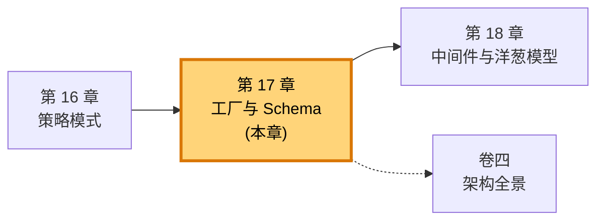
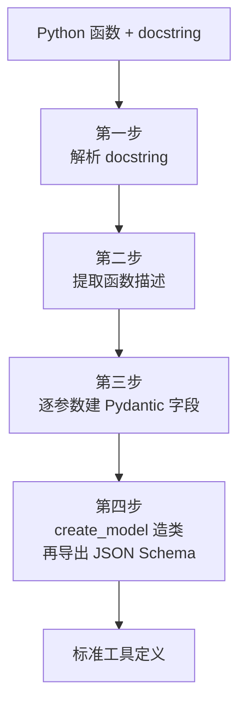
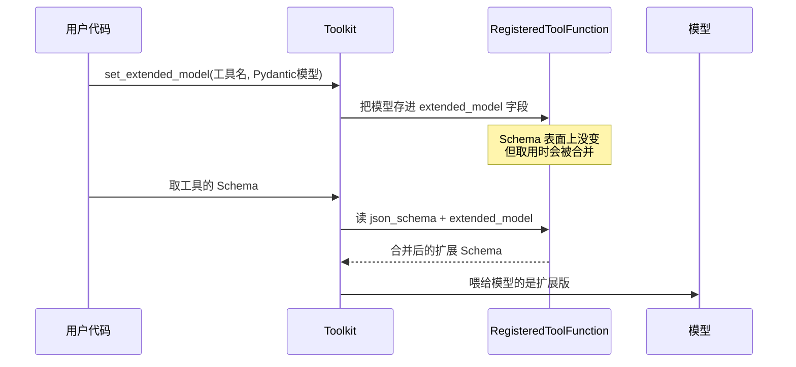

# 第 17 章 工厂与 Schema：从函数到 JSON Schema

你写了一个普通的 Python 函数 `get_weather(city: str, unit: str = "celsius")`，加了一段 Google 风格的 docstring。你没有手写任何 JSON、没有画任何表格、也没有调用任何"注册"接口去逐项声明参数——可 AgentScope 拿到这个函数后，能把它变成 OpenAI 工具调用 API 所要求的、结构完整的那份 JSON Schema，参数名、类型、描述、是否必填，一项不差。

这件事看起来像魔法，其实是两个老朋友在背后搭台唱戏：**工厂模式**搭的台，**Pydantic** 唱的戏。本章拆开这条"从函数到 Schema"的完整链路，让你看清一个普通的 Python 函数，是怎么被翻译成大模型能读懂的那份契约的。

> 工具调用的真正难点，从来不是"调用"，而是"描述"——你得用一种机器能解析的格式，把"我这个函数要什么参数、参数是什么类型、哪些可以省略"讲清楚。AgentScope 的解法是：让你只写一份 Python 代码，剩下的翻译交给工厂。

> **上一章：[策略模式：Formatter 的多态分发](./ch16-formatter-strategy.md)**

## 17.1 路线图

上一章我们跟着 Formatter 走了一圈：消息从 `Msg` 变成各家模型 API 要的 JSON，靠的是"同一接口、多种实现"的策略模式。那章关心的是**消息往模型方向怎么变**。本章要回答一个对称的问题：**工具往模型方向怎么变**。

工具也是个 Python 对象（一个函数），而模型 API 要的还是 JSON。这一次的翻译任务，策略模式不够用了——因为输入端是千变万化的函数签名，你没法为每种签名写一个子类。这里需要的是一种能"在运行时按需生产"的东西，也就是**工厂**。



本章的线索很清晰：先做一点前置知识补全（JSON Schema 是什么、Pydantic 干什么的），然后走进工厂内部——看它如何分四步把一个函数拆解、重组、再翻译成 Schema；接着看工厂的"姊妹流水线"，它干的是相反方向的活，从 Pydantic 类出发也能产出同一份 Schema；最后聊一个更精妙的设计——Schema 在运行时还能被动态扩展。结尾留下几个理解性的问题，帮你确认这条链路真的想明白了。

## 17.2 知识补全：JSON Schema 与 Pydantic

要听懂这条链路在做什么，得先认得两端的"语言"。

**JSON Schema** 是一份描述 JSON 数据格式的规范。你可以把它理解成一份"JSON 的说明书"：它不存数据，它只声明"符合我这份规则的 JSON，应该长什么样"。OpenAI 等模型厂商的工具调用 API，要求每个工具用 JSON Schema 描述自己的参数。一份最朴素的 Schema 长这样：

```json
{
  "type": "function",
  "function": {
    "name": "get_weather",
    "description": "获取天气信息",
    "parameters": {
      "type": "object",
      "properties": {
        "city": {"type": "string", "description": "城市名称"},
        "unit": {"type": "string", "description": "温度单位"}
      },
      "required": ["city"]
    }
  }
}
```

读这份 JSON 像读一张填空表：`city` 必填（出现在 `required` 里），是字符串，含义是"城市名称"；`unit` 可省略，也是字符串。模型拿到这张表，就知道调用 `get_weather` 时该往里塞什么。

**Pydantic** 是 Python 世界里专门做数据校验的库。它的核心是 `BaseModel`——你写一个继承它的类，声明几个带类型标注的字段，Pydantic 就帮你做两件事：一是**校验**传进来的数据合不合规，二是把它**导出**成标准的 JSON Schema。

```python
from pydantic import BaseModel

class Weather(BaseModel):
    city: str
    unit: str = "celsius"
```

就这么几行，`Weather.model_json_schema()` 立刻能吐出一份合法的 JSON Schema。Pydantic 的本事就在这：**Python 的类型标注 → JSON Schema**，几乎是一条直通车。

理解了这两样，AgentScope 这条链路的本质就露出来了——它把"Python 函数"先翻译成"Pydantic 模型"，再借 Pydantic 的直通车翻译成"JSON Schema"。Pydantic 是中转站，是翻译过程中的中间表示。带着这个认识，我们进工厂。

| 概念 | 一句话 | 在本章的位置 |
|------|--------|--------------|
| JSON Schema | 一份"JSON 长什么样"的说明书 | 工厂最终交付的产品 |
| Pydantic `BaseModel` | 声明字段+类型，自动校验+导出 Schema | 翻译过程的中间表示 |
| `create_model` | 运行时动态造一个 `BaseModel` 类 | 工厂的核心机械 |
| 工厂模式 | 输入原料、产出标准产品的设施 | 本章的总骨架 |

## 17.3 工厂的全貌：四步翻译

把工厂想象成一座翻译车间。原料从一头进来——是一个 Python 函数；产品从另一头出去——是一份 JSON Schema。车间里一共四道工序。



我们一道工序一道工序地看。

**第一步：解析 docstring。** 函数除了签名（参数名和类型），还带着一段说明文档。AgentScope 用一个叫 `docstring_parser` 的库，把这段 Google 风格的文档拆开——`Args:` 段落里每个参数的描述，被整理成一张 `{参数名: 描述文本}` 的字典。这一步是把"人写给文档的注释"抢救出来，变成后面能用得上的结构化数据。

**第二步：提取函数的整体描述。** docstring 的开头那句话（`short_description`），通常就是一句话讲清这个函数是干嘛的。这句话会被原样填进 Schema 的 `description` 字段，成为模型理解这个工具用途的依据。

**第三步：逐参数建 Pydantic 字段。** 这是真正出力气的一道工序。工厂用 `inspect.signature(func)` 把函数的签名"拆零件"，对每一个参数问三个问题：

- **你是什么类型？** 有类型标注（`city: str`）就用标注；没有标注就退回 `Any`——表示"什么都行"，但这其实是在告诉模型"我也不知道你该传啥"，通常是要避免的。
- **你有没有默认值？** 没有默认值的参数会标成必需（Pydantic 里用 `...` 占位，对应 Schema 的 `required`）；有默认值的参数天然可省略，默认值也会被写进 Schema。
- **文档怎么描述你？** 从第一步那张字典里查出来，填进字段的 `description`。

三个问题答完，每个参数就变成了一个 Pydantic 字段（类型、默认值、描述三件套）。这一步还要顺手处理两个特例：`*args`（可变位置参数）被翻译成 `list` 类型，`**kwargs`（可变关键字参数）被翻译成 `dict` 类型——让这两种 Python 特有语法也能在 JSON 世界里有个落脚点。

这一步可以用一段极简的示意片段表达它的形态：

```python
for name, param in signature(func).parameters.items():
    annotation = param.annotation or Any
    default = ... if param.default is empty else param.default
    description = params_doc.get(name)
    fields[name] = (annotation, Field(default=default, description=description))
```

注意这只是**形态示意**，告诉你"循环里做了什么"——真实代码会处理更多边界（`self`/`cls` 要跳过、空标注要兜底等），但骨架就是这三行：取类型、定默认、配描述。

**第四步：造类，导出 Schema。** 字段都备齐了，工厂调用 Pydantic 的 `create_model`，**在运行时凭空造出一个 `BaseModel` 子类**，把刚才那些字段一股脑塞进去。这个临时造出来的类没有任何业务意义，它存在的唯一目的，就是被立刻调用 `model_json_schema()`，吐出最终那份 JSON Schema。Schema 一到手，这个临时类的历史使命就完成了。

```python
DynamicModel = create_model("_StructuredOutputDynamicClass", **fields)
schema = DynamicModel.model_json_schema()
```

四步走完，一个 Python 函数就变成了一份标准工具定义。整个过程的妙处在于：**你写的只是 Python，工厂替你处理了 JSON。** 你不用记 JSON Schema 的字段名、不用纠结 `required` 怎么填、不用担心嵌套类型和 Optional 怎么表达——这些脏活累活，Pydantic 在第四步一次性接管了。

> **设计一瞥：** 为什么工厂非要在中转站停下来，造一个临时 Pydantic 类，而不是直接手写 JSON Schema？两条理由。一是**类型校验提前到位**：Pydantic 在生成 Schema 的过程中，会顺带检查你的类型标注合不合理，类型写错了它在生成阶段就报错，而不是等到模型调用时才出问题。二是**复杂类型有人替你兜底**：嵌套对象、Optional、Union、List 这些手写 JSON Schema 极易出错的地方，Pydantic 的 `model_json_schema()` 都能正确展开。代价是多了一个 Pydantic 依赖——但 AgentScope 本来就用它做结构化输出，这趟车不坐白不坐。

## 17.4 工厂的产品：RegisteredToolFunction

工厂产出的 Schema，最终要被装进一个叫 `RegisteredToolFunction` 的容器里。可以把它想成工厂的"产品包装盒"——Schema 只是盒子里的一格，盒子里还装着这个工具的其余身份信息。

| 字段 | 含义 | 干什么用 |
|------|------|----------|
| `name` | 工具名 | 模型调用时按名字点名 |
| `group` | 所属分组 | 一类工具批量启用/禁用 |
| `source` | 来源标记 | `"function"` 表示来自 Python 函数 |
| `json_schema` | 翻译好的工具定义 | 直接喂给模型 API |
| `original_func` | 原始 Python 函数 | 真正要被执行的那段代码 |
| `extended_model` | 可选的扩展模型 | 运行时往 Schema 里追加字段 |

这里有一个关键的对称设计值得停下来体会：**`json_schema` 和 `original_func` 并排放着。** 同一个工具，对模型说的一份语言（JSON Schema，告诉模型"怎么调用我"），对 Python 说的是另一份语言（原始函数，真正去执行）。注册工具时，工厂替你把前者翻译好；调用工具时，框架替你把后者拎出来跑。这两份"语言"在 `RegisteredToolFunction` 里第一次会师，之后就一直形影不离。

注册发生在 `Toolkit.register_tool_function()` 这个入口里，它的形态大致是：

```python
def register_tool_function(self, tool_func, ...):
    schema = _parse_tool_function(tool_func, ...)   # 工厂干完活
    self.tools[schema["function"]["name"]] = RegisteredToolFunction(
        name=...,
        json_schema=schema,
        original_func=tool_func,
        ...
    )
```

工厂的活儿在第一行就结束了，剩下的是把产品入库存档——存进 `Toolkit.tools` 这个以工具名为键的字典。从此以后，模型想要这份 Schema，框架从字典里取；用户想要执行这个工具，框架也从字典里取。一个仓库，两种用途。

## 17.5 姊妹流水线：从 Pydantic 类也能产出 Schema

工厂不止一条流水线。刚才那条吃的是 Python 函数，旁边还有一条姊妹流水线，吃的是 Pydantic 的 `BaseModel` 类。它干的是结构化输出的活儿——当你希望模型返回的不是自由文本，而是严格符合某个结构的对象时，就要靠它。

这条流水线的逻辑简单得多，因为 Pydantic 类本身就已经"半成品"了——它自己就带着类型标注，根本不需要从 docstring 里捞信息。工厂要做的事，翻译成日常语言就是三步：

1. 调用模型的 `model_json_schema()`，直接拿到一份 Schema。
2. 递归地把 Schema 里所有 `"title"` 字段清掉（理由见下）。
3. 把它套进 `{"type": "function", "function": {...}}` 这个标准外壳。

```python
def _create_tool_from_base_model(model, tool_name="generate_structured_output"):
    schema = model.model_json_schema()
    _remove_title_field(schema)
    return {
        "type": "function",
        "function": {"name": tool_name, "parameters": schema, ...},
    }
```

两条流水线，一个从函数出发、一个从 Pydantic 类出发，**最终都产出同样形状的标准工具定义**。这种"殊途同归"不是巧合，而是刻意的设计：无论你用哪种方式表达工具，最后送到模型面前的那份契约格式是统一的——模型不需要、也不应该关心你背后写的是函数还是类。

这里有个小细节值得专门点一下：**`_remove_title_field` 是干嘛的？** Pydantic 在生成 Schema 时有个习惯，它会在每个节点上自动塞一个 `"title"` 字段（比如 `"title": "Weather"`、`"title": "City"`）。这些 title 是 Pydantic 给人看的内部标识，对模型来说没有任何意义，反而可能造成干扰——模型有可能把 title 当成一种指令或约束去理解。所以工厂在送出 Schema 前，会递归地把所有 title 抹干净，确保送到模型手里的 Schema **只包含有用信息**。这是个不起眼但很贴心的设计，体现了"为下游消费者优化产物"的工程自觉。

把两条流水线放在一起对比：

| 维度 | 函数流水线 | Pydantic 流水线 |
|------|------------|-----------------|
| 输入 | Python 函数 + docstring | Pydantic `BaseModel` 类 |
| 中间表示 | `create_model` 造的临时类 | 输入类本身 |
| 主要工作 | 解析签名、提描述、逐字段建模 | 直接导出 + 清理 title |
| 典型用途 | 注册工具给模型调用 | 让模型按结构返回输出 |
| 产物 | 标准工具定义 | 标准工具定义（同形） |

## 17.6 动态扩展：Schema 在运行时还能长大

到目前为止，Schema 看起来都是"定义时定死"的——函数一注册，Schema 就生成了，之后不再变。但 `RegisteredToolFunction` 里那个 `extended_model` 字段，告诉我们 Schema 还有一项更精妙的能力：**运行时被动态扩展**。

什么场景需要这个？最典型的是结构化输出。假设你有一个搜索工具，正常情况下它只需要 `query` 一个参数。但在某些任务里，你希望模型调用这个工具时，**顺带**按某个固定结构返回结果（比如返回时必须带上 `confidence` 字段）。这时你不能去改原来的工具函数（那是别人写的、可能被多处复用），也不能为这一个场景新写一个工具（太啰嗦）。解法是：在运行时把一个 Pydantic 模型"贴"到现有工具的 Schema 上，让它凭空多出几个字段。



`Toolkit.set_extended_model()` 干的就是这个"贴标签"的活儿。它不修改原始 Schema，而是把扩展模型存到 `extended_model` 字段，等到真正要把 Schema 送出去时，再把它和原始 Schema 合并——这样模型看到的就是一份"原参数 + 额外约束"的合并版。

这个设计有几个聪明的点：

- **原始工具不动。** 扩展是叠加，不是篡改。同一个工具，在不同任务里可以被贴上不同的扩展模型，互不干扰。
- **扩展用 Pydantic 表达。** 又一次借助 Pydantic 的类型校验——扩展的字段本身也得是合规的类型，错误的扩展在生成阶段就会被发现。
- **延迟合并。** Schema 不是一注册就变厚的，而是取用的那一刻才合并。这意味着如果你不调用 `set_extended_model`，整个机制对你完全透明，没有任何额外开销。

AgentScope 官方文档的 Building Blocks > Tool Capabilities 一节，专门演示了这种"Extending JSON Schema Dynamically"的用法——通过 `Toolkit` 的扩展 API，在运行时给工具追加参数描述。本章从工厂的角度解释了这件事的来龙去脉：扩展之所以可行，正是因为 Schema 生成走的是 Pydantic 中间表示这条可逆、可叠加的路，而不是一次性写死的死 Schema。

> **设计一瞥：** 把"原始函数翻译出的 Schema"和"运行时叠加的扩展模型"分开存放，是一种很干净的**关注点分离**。前者是工具自身的固有契约，由作者在定义时决定；后者是调用方在特定场景下附加的需求，由使用者决定。两者在送出前才合并，相当于把"工具本来要什么"和"这次我额外要什么"这两件事彻底解耦。

## 17.7 把工厂放回大局里看

走到这里，可以把这条链路和前面几章串起来看了。

上一章的 Formatter 解决的是**消息怎么变**：同一条 `Msg`，到了不同模型厂商的 API 边界，要被翻译成不同的 JSON 形态。本章的工厂解决的是**工具怎么变**：同一个 Python 函数，要被翻译成模型能读懂的 JSON Schema。两者都是"翻译"，但翻译的对象和方向不同——Formatter 翻译的是日常对话的载体，工厂翻译的是能力清单的描述。

更有意思的是，工厂产出的 Schema，最终也是要被 Formatter 间接"用上"的。模型在一次推理调用里，既要看到对话消息（Formatter 翻译的），也要看到可用工具（工厂翻译的 Schema）。这两份翻译产物在 `model(prompt, tools=...)` 这个调用点汇合，一起送进模型。换句话说，Formatter 和工厂是模型 API 这场宴会上两位分工不同的厨师：一位做主菜（消息），一位做菜单（工具），最后一同端上桌。

而工厂内部又是一个微缩的"翻译车间"，Pydantic 充当中间表示，让"Python 函数"这种富表达力的原料，能被稳稳地降维成"JSON Schema"这种贫瘪但通用的产物。工厂模式的威力正在于此：**把多变的输入，归一成稳定的输出。** 不管你的函数签名多复杂、参数类型多花哨，工厂吐出来的永远是同一份格式、同一种形状的工具定义。

下一章我们会看到，这条"稳定的产物"还要再过一道关——工具真正被执行时，往往需要插入额外逻辑（打日志、查权限、加缓存）。这些逻辑既不能写进工具函数本身（每个工具都要重复写），也不能写死在调用入口（每加一种逻辑都要改源码）。中间件的洋葱模型，就是来解决这个"在执行前后插一刀"的需求的。工厂负责"把工具讲给模型听"，中间件负责"在工具被调用时包一层"，两者一前一后，构成了工具体系的完整骨架。

## 检查点

走完这条链路，用几个问题确认一下理解是否到位。

**1. 为什么工厂要在中转站停下来造一个 Pydantic 类，而不直接手写 JSON Schema？**
直接手写当然也能产出合法的 Schema，但代价很高：嵌套类型、Optional、Union 这些地方手写极易出错，而且没有任何前置校验——类型写错了得等模型调用失败才发现。引入 Pydantic 做中间表示后，类型校验在 Schema 生成阶段就完成了，复杂类型的展开也有了可靠的自动机制。Pydantic 本来就是 AgentScope 结构化输出的依赖，这次复用几乎零成本。

**2. 一个函数的参数没有类型标注（`def foo(x)` 而不是 `def foo(x: str)`），它的 Schema 会变成什么样？**
类型会退回成 `Any`。在 JSON Schema 里，这意味着这个参数不会有 `"type"` 约束，模型不知道该传什么类型的值。功能上工具还能注册成功，但模型调用时容易猜错类型——这正是为什么写工具时强烈建议给每个参数加类型标注。

**3. 两条流水线——从函数出发、从 Pydantic 类出发——为什么最终产出同一种形状的 Schema？**
这是刻意的设计。工具对模型来说是一份契约，契约的格式应该统一，跟背后用什么方式实现无关。两条流水线殊途同归，保证了"无论你用函数还是类来表达工具，模型看到的都是同一份标准描述"。这种统一让框架可以无差别地处理两类工具，调用代码也不需要 if/else 区分。

**4. `_remove_title_field` 为什么必须存在？不删会怎样？**
Pydantic 默认会在 Schema 每个节点塞一个 `"title"` 字段，这些是给人看的内部标识。对模型来说，title 既无用又可能有害——模型有可能把 title 当成一种指令或约束去理解，干扰它对真正参数的判断。递归清掉 title，是为了让送到模型手里的 Schema 只保留有用信息。

**5. 动态扩展 Schema 时，为什么不直接改原始 Schema，而要单独存一个 `extended_model`？**
因为扩展是"调用方的临时需求"，不是"工具自身的固有契约"。分开存放实现了关注点分离：原始工具可以被多处复用、贴上不同的扩展；同一个工具在不同任务里也能呈现不同的扩展形态。如果直接改原始 Schema，扩展就会污染工具本体，后续每次取用都得想办法"还原"——这种复杂度远比延迟合并高得多。

## 下一站预告

Schema 生成是静态的——工具一注册，描述它的那份契约就定死了。但工具真正被执行的那一刻，往往还有一堆横切的需求要插进来：调用前打个日志、调用后量个耗时、敏感操作前查一下权限。这些逻辑如果写进每个工具函数，就是无穷无尽的重复；如果写死在工具调用入口，每加一种逻辑就得改框架源码。

下一章我们看 AgentScope 怎么用**中间件的洋葱模型**优雅地解开这个结——让横切逻辑像洋葱皮一样一层层包在工具外面，互不打架，又随时可拆。

> **下一章：[中间件与洋葱模型](./ch18-middleware.md)**
