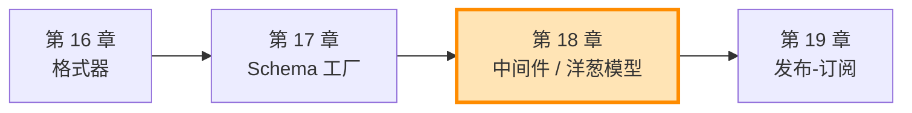
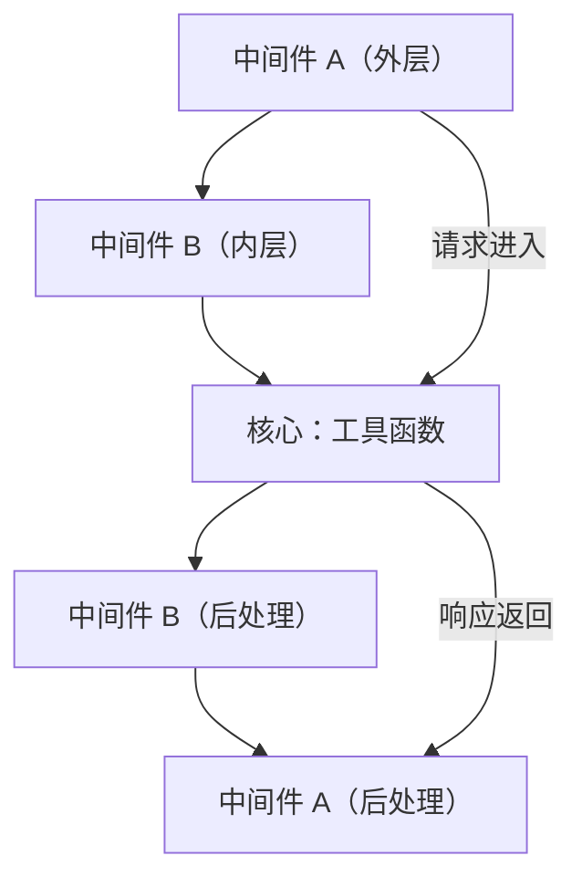
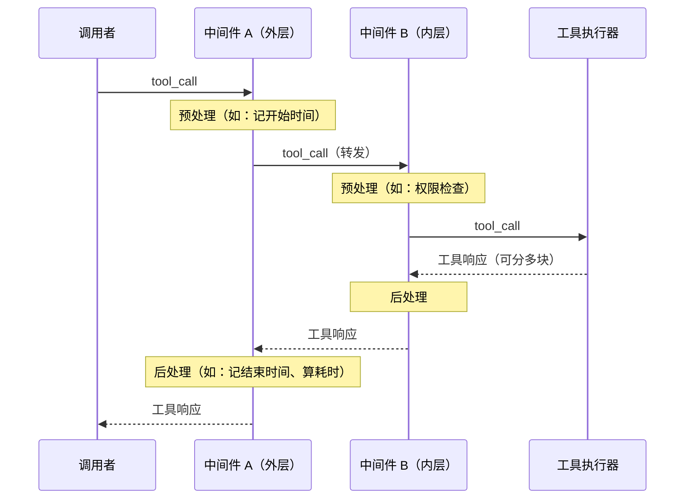
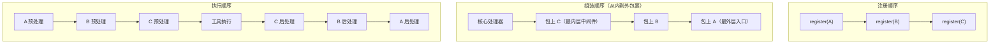

# 第 18 章 中间件与洋葱模型

> 工具是 Agent 的"手脚"，但你想给每一次工具调用都套上一层"安检、计时、日志"，又不想把工具函数改得面目全非。怎么办？答案是把横切关注点（cross-cutting concerns）从工具里抽出来，挂到一条"链"上——这就是中间件。

> **上一章：[工厂与 Schema：从函数到 JSON Schema](./ch17-schema-factory.md)**

---

## 18.1 路线图

上一章我们解决了"一个普通 Python 函数怎么变成模型能读懂的 JSON Schema"——这是工具"被发现、被描述"的问题。但当一个工具真正被调用的那一瞬间，还有另一类需求会悄悄冒出来：我想记录每次调用的耗时、我想检查调用方有没有权限、我想把昂贵的查询结果缓存起来……

这些问题有一个共同特征：它们**不属于任何一个具体工具**，却要作用在**每一次工具调用**上。如果直接写进每个工具函数，代码会变得又脏又难维护。这种"横着切一刀、作用在所有调用上"的需求，软件工程里叫**横切关注点**（cross-cutting concerns）。

本章看 AgentScope 的 Toolkit 如何用一条"中间件链"来收拾它。



我们仍在"单个工具被调用时"这个尺度上，关注的是**调用路径上的拦截与改写**。下一章才会跳出单工具视角，去看多 Agent 之间怎么通信。

---

## 18.2 知识补全：洋葱模型与"下一棒"

在讲 AgentScope 怎么做之前，先理解一个更通用的模式。

### 洋葱长什么样

**洋葱模型（Onion Model）** 描述了一种层层包裹的执行结构：每一层中间件像洋葱的一层皮，把核心操作裹在正中间。请求从最外层进去，一层层往里穿，直到核心；响应再从核心一层层往外传回来。



每一层中间件在"进入"时做一段预处理，在"返回"时再做一段后处理。横切一刀，前后夹击。

### 一个日常类比：快递公司的多道工序

想象你寄一个快递。包裹从你手里出发，要依次经过：取件员 → 安检机 → 打包台 → 分拣中心。分拣中心处理完后，结果（比如签收回执）再原路返回：分拣中心 → 打包台 → 安检机 → 取件员 → 你。

- 每一道工序都能在包裹"进来"时做点事：扫码、称重、拍照。
- 每一道工序也能在结果"回去"时做点事：贴签、归档。
- 某一道工序如果不放行——比如安检发现违禁品——后面所有工序都不会执行，直接返回一个"拒收"。

中间件就是这些工序，工具函数是分拣中心，而"把包裹递给下一道工序"这个动作，对应的就是中间件手里的"下一棒"。

### "把下一棒传进来"是关键

洋葱模型的灵魂，在于每一层中间件都不直接知道还有几层、是什么。它只拿到一个**"下一棒"**——一个可以调用的 `next_handler`。调用它，就把控制权交给内层；不调用它，链条就在这一层截断。

这个"把下一步当作参数传进来"的手法，本质上是 **continuation-passing style（续体传递风格）** 的简化版。它让中间件之间彻底解耦：日志中间件不需要知道权限中间件是否存在，它只管"做自己该做的，然后把球传下去"。

> **设计一瞥**：洋葱模型在 Web 框架里几乎是标配——Express.js 叫 middleware，Django 叫 middleware，Koa 直接就叫洋葱模型。AgentScope 把这套成熟模式搬到了工具调用上，让"工具的横切关注点"也能像 Web 请求一样被分层处理。学过任意一个 Web 框架的读者，会在这里感到熟悉。

---

## 18.3 Toolkit 的中间件：注册与组装

AgentScope 的中间件挂在 `Toolkit` 上。一个 Toolkit 实例可以注册若干中间件，它们会作用在这个 Toolkit 内**所有工具的调用**上。

### 注册的形态

注册接口极其朴素——就是把一个中间件追加到一个内部列表里：

```python
def register_middleware(self, middleware) -> None:
    self._middlewares.append(middleware)
```

用法也直接：

```python
toolkit.register_middleware(logging_middleware)
toolkit.register_middleware(auth_middleware)
```

注册是"累积"的，**先注册的会被排在外层**。这一点贯穿整章，会反复用到。

### 组装发生在调用时，而非注册时

注意上面只是"登记"。真正的洋葱链**不是在注册时就搭好的**，而是在每一次工具被调用时**临时搭起来、用完即弃**。这个时机选择很关键：

- 注册阶段：Toolkit 还不知道这次要调哪个工具、参数是什么，搭一条固定链没有意义。
- 调用阶段：拿到具体的 `tool_call`（包含工具名和入参），这时候临时把列表里的中间件层层包起来，正好把这次调用送进去。

搭链的思路是"从内到外包裹"。核心是真正的工具执行器，然后一层层往上套中间件，最后得到一个最外层的入口。下图展示了两个中间件 A、B（按注册顺序）的组装与执行：



为什么"先注册的在外层"？因为组装时会把列表**反过来**遍历：先拿到最里层的核心处理器，再包裹最后一个注册的中间件（B），再包裹前一个（A）。等组装完，A 自然就在最外面。这就保证了**注册顺序 = 执行顺序**——你写在前面的中间件最先看到请求、最后看到响应。这种"所见即所写"，比"注册顺序等于调用顺序的反面"要直观得多。

### 用一个签名把这一切说清楚

中间件本身是一个 async generator 函数，签名长这样：

```python
async def my_middleware(
    kwargs: dict,           # 至少包含 tool_call
    next_handler: Callable, # 下一层（内层中间件，或核心）
) -> AsyncGenerator[ToolResponse, None]:
    ...
```

- `kwargs`：字典风格的"载荷"，目前里面有 `tool_call`（描述要调哪个工具、入参是什么）。用字典而不是位置参数，是为了将来能往里加更多字段而不破坏老中间件——典型的"用可扩展性换一点繁琐"。
- `next_handler`：内层那一棒。调它就把控制权传向核心；不调它，链条在此截断。

返回的是一个**异步生成器**——它要逐块 `yield` 工具响应。这个选择不是随便挑的，下一节专门讲为什么。

---

## 18.4 为什么非要用异步生成器：为了流式

很多人第一次看中间件签名都会困惑：为什么不直接 `return await next_handler(**kwargs)`？为什么非得 `async for ... yield`？

答案藏在**流式返回**里。一个工具执行可能不是一次性吐出结果，而是分好几次产出 `ToolResponse` 片段——想象一个边查边返回的搜索工具，或者一个边跑边吐进度的长任务。如果中间件是普通函数，它只能等到整个工具执行完、拿到最终结果，**中间过程对它完全不可见**。

异步生成器正好解决了这个问题：

```python
async def my_middleware(kwargs, next_handler):
    # 预处理
    async for chunk in await next_handler(**kwargs):
        # 每来一块，我都能看到、能改、能记
        yield chunk
    # 后处理
```

`async for` 让中间件能**逐块消费**下层返回的内容，每一块都可以被观察、被改写、被累积；`yield` 又把这一块原样（或改写后）传给外层。于是流式能力从核心一路透传到最外层，每一层都有机会插手。

如果某个中间件根本不关心分块（比如只看个开始时间、结束时间），它只要写一行 `async for chunk in ...: yield chunk` 就够了——这是"透传"写法，几乎零成本。

| 中间件形态 | 能否看到流式过程 | 典型用途 |
|---|---|---|
| 普通函数 `return` | 不能，只看最终结果 | 不适用 |
| async 函数 `return` | 不能，只看最终结果 | 不适用 |
| async generator（`async for` + `yield`） | 能，逐块观察/改写 | 日志、缓存、过滤、改写 |

> **设计一瞥**：用"能处理最复杂情况（流式）的统一抽象"去同时覆盖简单情况，是框架常见的取舍。代价是写个最简单的中间件也得写 `async for ... yield`；收益是所有中间件只有一种形态，没有"流式版"和"非流式版"两套接口。一致性赢了简洁性，这种交换在框架设计里反复出现。

---

## 18.5 三种典型用法：观察、守卫、拦截

理解了结构，来看中间件到底能干什么。横切关注点花样繁多，但归纳起来基本是三种角色。

### 角色 1：观察者——只看不改

日志、计时、埋点都属于这类。中间件完整地把控制权传下去，把响应原样传回来，只在前后做点记录。它**绝不碰** `kwargs` 和响应的内容。

```python
async def logging_middleware(kwargs, next_handler):
    name = kwargs["tool_call"].name
    started = time.time()
    async for response in await next_handler(**kwargs):
        yield response          # 原样向上
    print(f"{name} 耗时 {time.time() - started:.3f}s")
```

这种中间件最安全——它不改变任何行为，加多少层都不会影响业务逻辑。生产环境里的"可观测性"几乎全靠它。

### 角色 2：守卫——不放行就截断

权限检查、参数校验、限流归这类。它的特点是**可能在预处理阶段就决定不往下传**，直接 yield 一个自己造的响应（通常是错误信息），工具函数根本不会被执行。

```python
async def auth_middleware(kwargs, next_handler):
    name = kwargs["tool_call"].name
    if not is_allowed(name):
        yield ToolResponse(content=[TextBlock(type="text", text="权限不足")])
        return                  # 不调 next_handler，链条到此为止
    async for response in await next_handler(**kwargs):
        yield response
```

关键就是那一句 `return`——不把球传给下一棒，整条内层链都不会跑。这相当于安检机扣下了包裹，分拣中心永远收不到它。

守卫放在最外层还是最内层，效果差别很大。放在外层，无权限的请求一开始就被挡住，连内层日志中间件的后处理都不会触发；放在内层，前面的中间件都跑完了才被拦。所以**注册顺序本身就是一种安全策略**。

### 角色 3：拦截器——改输入或改输出

缓存、结果改写、参数归一化归这类。它会让链条跑，但在过程中动点手脚：要么改 `kwargs` 再往下传，要么改响应再往上返，要么干脆用自己的结果替代。

```python
async def cache_middleware(kwargs, next_handler):
    key = make_cache_key(kwargs["tool_call"])
    if key in _cache:
        yield _cache[key]       # 命中缓存，完全不执行工具
        return
    async for response in await next_handler(**kwargs):
        yield response
        _cache[key] = response  # 未命中：执行并存起来
```

注意这里它既像守卫（命中就截断），又像观察者（没命中就透传）。三种角色并不互斥，真实中间件往往是混合体。缓存就是一个"条件性守卫 + 观察存储"的组合。

### 三种角色对比

| 角色 | 是否调用 next_handler | 是否改 kwargs | 是否改响应 | 典型场景 |
|---|---|---|---|---|
| 观察者 | 一定调用 | 否 | 否 | 日志、计时、埋点 |
| 守卫 | 条件性不调用 | 否（不通过时） | 造一个错误响应 | 权限、校验、限流 |
| 拦截器 | 通常调用 | 可能改 | 可能改 | 缓存、改写、归一化 |

记住这张表。遇到任何新的横切需求，先问自己："这是观察、守卫、还是拦截？"答案一出来，中间件的骨架就定了。

---

## 18.6 组装顺序与执行顺序：一图记住

把前面几节串起来，注册顺序和执行顺序的关系可以用一张图彻底讲清。假设按顺序注册了 A、B、C 三个中间件：



一句话总结：**预处理顺序 = 注册顺序（A→B→C），后处理顺序 = 注册顺序的反面（C→B→A）**。这也是为什么"先注册的在外层"——外层最先碰到请求，也最后放走响应。

这个对称结构非常实用。比如你想让"权限检查在日志之前发生"（避免日志里记一堆被拒的请求），就把权限中间件注册在日志前面。想让"缓存在权限之后"（避免缓存了无权访问的数据），就把缓存注册在权限后面。**顺序即策略**。

---

## 18.7 中间件 vs. 工具函数：职责的分界

到这里你可能会问：既然中间件这么强，为什么不把所有逻辑都写进中间件？反过来，为什么不把日志直接写进工具函数？

答案是**关注点分离**。工具函数只回答一个问题："给定输入，产出什么结果？"——这是业务逻辑，是"这个工具到底是干什么的"。中间件回答的是另一个问题："不管你是什么工具，每次被调用时还要顺手做点什么？"——这是横切逻辑，是"和工具本身无关的通用关注点"。

| 维度 | 工具函数 | 中间件 |
|---|---|---|
| 关心什么 | 具体业务（查天气、算加法） | 通用关注点（日志、权限、缓存） |
| 作用范围 | 只对自己的那一次调用负责 | 作用在 Toolkit 内**所有**工具调用上 |
| 改动成本 | 改一个工具只改一个函数 | 加一层关注点，所有工具自动获得 |
| 数量 | 通常很多（每个能力一个） | 通常很少（几个通用层） |

把日志写进每个工具函数，意味着每写一个工具都要抄一遍日志代码，漏抄一个就有盲区。把日志做成中间件注册一次，所有工具自动被覆盖——这就是横切关注点被"抽出来"的价值。

反过来，如果把"查天气"写进中间件，那它就不再是通用的了，变成了一个只对某个工具有效的特殊逻辑，失去了"作用于所有调用"的意义。分界线很清晰：**通用 → 中间件，专用 → 工具函数**。

> **设计一瞥**：这种"核心只管业务，外层挂横切关注点"的分层，和上一章的 Schema 工厂、再上一章的格式器其实是同一个思想的不同切面——都是"把变化的部分和不变的部分分开"。工具函数是"变化的部分"（每个都不一样），中间件是"相对稳定的部分"（日志、权限这类东西在所有项目里都长得差不多）。框架的价值，就是把这些稳定层沉淀成可复用的基础设施。

---

## 检查点

下面几个问题用来检验你是否真的理解了洋葱模型在 Toolkit 中的实现。

**问题 1**：如果按顺序注册了三个中间件 A、B、C，它们的预处理和后处理执行顺序分别是什么？

> **参考**：预处理是 A → B → C，后处理是 C → B → A。注册顺序决定了洋葱层级——A 在最外层最先碰到请求，C 在最内层最靠近工具。请求从外到内穿过（A→B→C），响应从内到外返回（C→B→A）。

**问题 2**：如果一个中间件在预处理阶段就 `return` 了、不调用 `next_handler`，会发生什么？这个特性有什么用？

> **参考**：内层的所有中间件和工具函数都不会执行，调用链在此截断，这个中间件通常会自己 `yield` 一个 `ToolResponse` 作为替代返回。这就是**守卫模式**的基础——权限检查中间件发现无权限时，直接返回"权限不足"，根本不去执行真正的工具。

**问题 3**：中间件为什么用"异步生成器（async generator）"而不是普通的 async 函数直接 `return`？

> **参考**：因为工具调用支持**流式返回**——一个工具可能分多次产出 `ToolResponse` 片段。普通函数只能拿到最终结果，看不到中间过程；异步生成器通过 `async for ... yield` 能逐块观察、改写、透传，让流式能力贯穿整条链。代价是即便最简单的中间件也得写 `async for ... yield`，但换来的是"所有中间件只有一种形态"的一致性。

**问题 4**：你想让"权限检查"在"日志记录"之前生效，应该怎么安排注册顺序？为什么？

> **参考**：把权限中间件注册在日志中间件之前（先 `register(auth)`，再 `register(logging)`）。因为预处理按注册顺序执行——先注册的先跑。这样无权限的请求会在日志之前就被挡掉，避免日志里堆满被拒的调用。这也说明"注册顺序即执行顺序"本身就能当一种策略用。

**问题 5**：中间件和工具函数各自的职责边界在哪？把"查天气"写进中间件合适吗？

> **参考**：工具函数负责具体业务（这个工具是干什么的），中间件负责通用横切关注点（不管什么工具都要做的事）。"查天气"是专用业务逻辑，应该写在工具函数里；写成中间件就失去了"作用于所有工具"的通用性，毫无意义。判断标准：通用 → 中间件，专用 → 工具函数。

---

## 下一站预告

本章的中间件是**点对点**的——一个工具调用从外到内穿过中间件链，最后回到调用者。它解决的是"一次调用内部的分层"。

但真实的 Agent 系统里，往往不是一个 Agent 在孤独地调工具，而是好几个 Agent 在互相配合：Agent A 跑完一步，把结果交给 Agent B 继续。这种"输出怎么自动流到下一个 Agent"的需求，靠中间件是解决不了的——它管的是工具调用，不管 Agent 之间。

下一章我们换个尺度，看 AgentScope 怎么用**发布-订阅模式**让多个 Agent 之间松耦合地通信——那是团队协作的雏形。

> **下一章：[发布-订阅：多 Agent 通信（团队协作的雏形）](./ch19-pubsub.md)**
