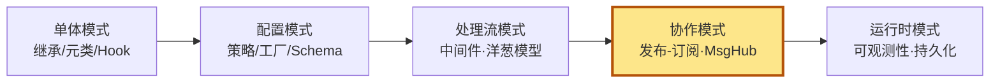
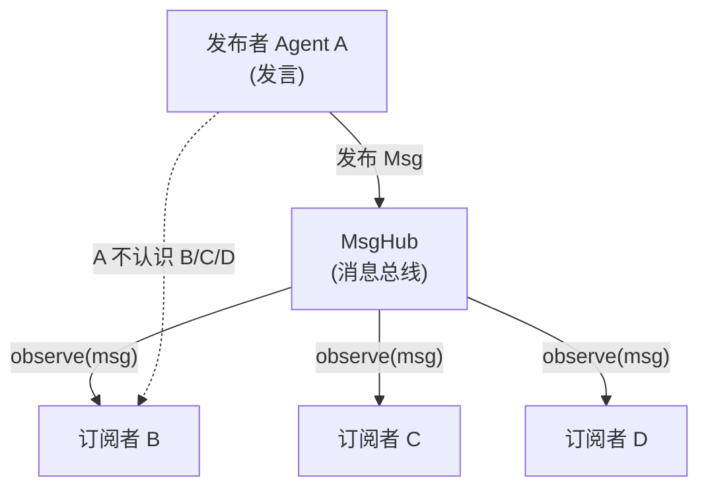
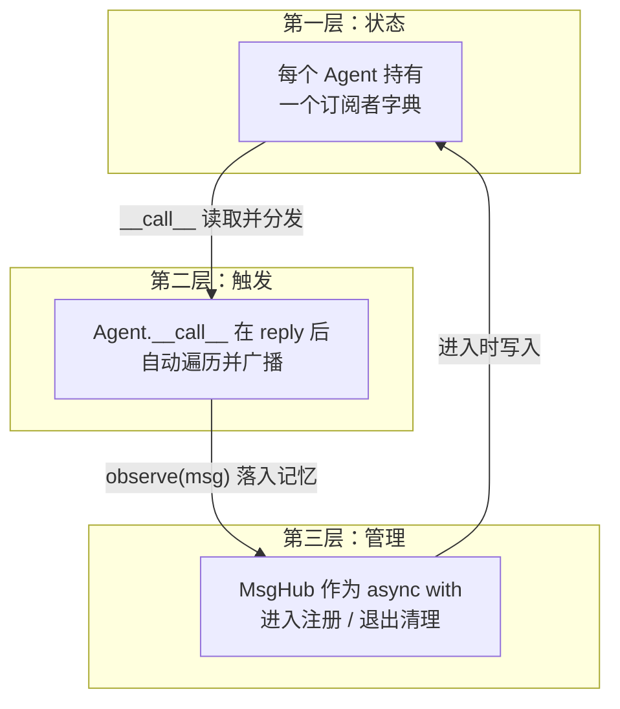
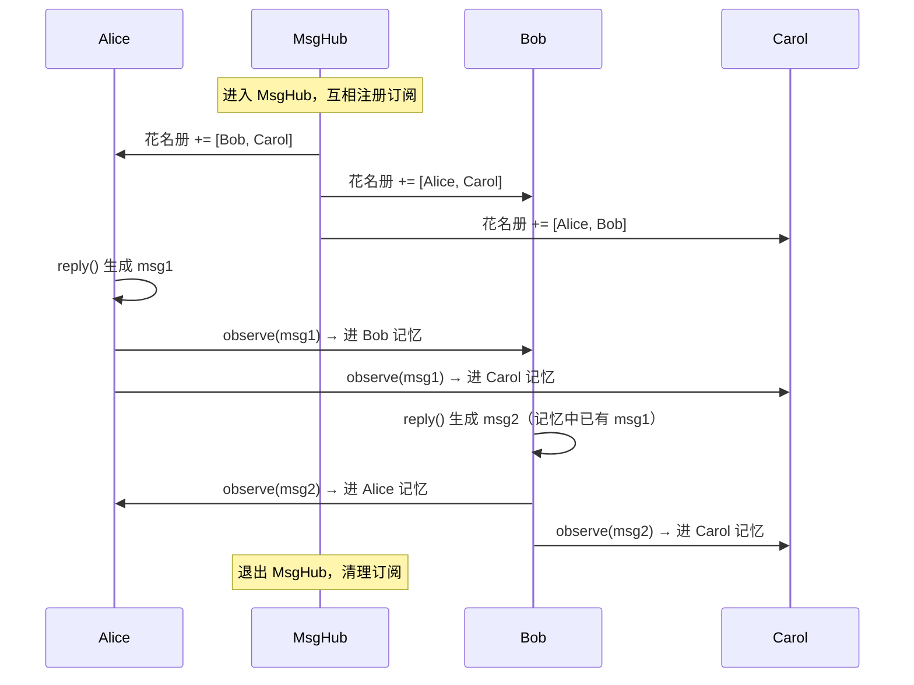

# 第 19 章 发布-订阅：多 Agent 通信（团队协作的雏形）

三个智能体围坐在一张虚拟圆桌旁轮流发言，每个人说的话其余人都能自动看到。这不是靠谁挨个去通知，而是一句话出口便自动广播给全桌——AgentScope 是怎么做到"一人开口、全员收听"的？

> **点题**：发布-订阅不是让 Agent 互相认识，而是让它们在同一个房间里说话。**MsgHub** 就是那个房间。

> **上一章：[中间件与洋葱模型](./ch18-middleware.md)**

## 19.1 路线图

前几章我们走完了"单体 Agent 如何被构造与增强"的旅程：继承与元类奠定骨架，Hook 注入横切逻辑，策略与 Schema 决定模型与配置，中间件把请求处理过程拆成洋葱般的同心圆。这些章节的主角始终是**单个 Agent**。

从这一章开始，聚光灯移到**多个 Agent 之间**。最自然的第一问是：它们怎么对话？

AgentScope 给出的答案是一个经典得不能再经典的设计模式——发布-订阅（Pub-Sub），并以一个叫 **MsgHub**（消息中心）的对象落地。本章就来拆解它。



本章你将理解三件事：

1. 发布-订阅为什么是"多 Agent 协作"的最优起点——它解决了什么耦合。
2. AgentScope 用 **订阅者字典** + **自动广播** + **上下文管理器** 这三件套，如何把抽象变成可用的 API。
3. 一条消息从某个 Agent 的"嘴"里出来，到其他 Agent 的"记忆"里落地，中间发生了什么，以及为什么思考块（ThinkingBlock）会被悄悄剥掉。

## 19.2 知识补全：发布-订阅模式

### 一个快递分拣中心的类比

想象一座城市的快递分拣中心。寄件人（发布者）把包裹丢到分拣中心的传送带上，**并不需要知道收件人是谁、住在哪里**。包裹上贴着标签，分拣中心根据标签把它派送到所有登记过对应类别的收件人（订阅者）邮箱。

关键特征是**解耦**：

- 寄件人**不需要认识**收件人。他只管投递。
- 多了一个收件人，**不用通知寄件人**，只要在分拣中心登记一下。
- 寄件人和收件人可以彼此完全陌生，却能完成投递。

如果换成"点对点直送"——寄件人必须亲手把包裹交到每一个收件人手上——那寄件人就要维护一份收件人通讯录，每加一个人都得更新通讯录、修改寄送代码。这就是**紧耦合**。

### 映射到 Agent 世界

把快递类比翻译过来：

| 现实世界 | Agent 世界 |
|---------|-----------|
| 寄件人 | 发言的 Agent（发布者） |
| 收件人 | 监听的 Agent（订阅者） |
| 包裹 | 一条 `Msg`（消息） |
| 分拣中心 | **MsgHub**（消息中心 / 调度总线） |
| 登记订阅 | 把 Agent 注册成彼此的订阅者 |
| 派送 | 调用订阅者的 `observe()` |

一句话概括模式本身：

> **发布者把消息丢给总线，总线把消息分发给所有订阅者；发布者与订阅者互不相识。**

这正是 MsgHub 的精神内核。下面三节我们看 AgentScope 怎么把它落地成可用的代码。



> **设计一瞥**：发布-订阅的核心红利是"加人无代价"。在 MsgHub 里再塞一个 Agent，已有 Agent 一行代码都不用改——它依然只管 `reply`，而新成员会自动收到广播。这种扩展性是后续"智能体团队"概念能成立的地基。

## 19.3 三件套：订阅者字典、自动广播、上下文管理器

AgentScope 的发布-订阅不是单一对象，而是**三个部分协作**：



我们逐层展开。

### 第一层：每个 Agent 都有一本"听众花名册"

任意一个 Agent 内部，都维护着这样一本花名册（伪字段示意）：

```python
class AgentBase:
    # 订阅者花名册：按 MsgHub 名字分组
    self._subscribers: dict[str, list[AgentBase]] = {}
```

它的形态很关键——**字典的 key 是 MsgHub 的名字，value 是订阅者列表**。

为什么按 MsgHub 名字分组？因为一个 Agent 可以**同时参与多个 MsgHub**。比如 Alice 同时在一个"写作组"和一个"评审组"里，她的花名册会长这样：

```
{
  "写作组": [Bob, Carol],
  "评审组": [Dave, Eve],
}
```

Alice 一旦开口，两个组的所有人都会听到。花名册按组名分桶，正是为了让多个 MsgHub 互不干扰——这呼应了快递分拣中心里"不同标签走不同传送带"的设计。

### 第二层：发言即广播

光有花名册还不够，得有人在 Agent 发完言后**主动照着花名册念一遍**。这件事发生在 `__call__` 的尾声：

```python
async def __call__(self, *args, **kwargs) -> Msg:
    reply_msg = await self.reply(*args, **kwargs)
    ...
    if reply_msg:
        await self._broadcast_to_subscribers(reply_msg)
    return reply_msg
```

`_broadcast_to_subscribers` 的职责极其朴素——**遍历花名册，挨家挨户敲门**：

```python
async def _broadcast_to_subscribers(self, msg):
    broadcast_msg = self._strip_thinking_blocks(msg)   # 先脱掉思考块
    for subscribers in self._subscribers.values():      # 遍历每个 MsgHub 的桶
        for subscriber in subscribers:                  # 桶里的每个订阅者
            await subscriber.observe(broadcast_msg)     # 敲门：请收下这条消息
```

注意两件事：

1. **广播不是免费的"附加操作"，而是 `__call__` 的固有责任**。也就是说，调用 `await agent()` 这一行，其实同时完成了"让 Agent 思考并回复"和"把回复广播出去"两件事。从调用方角度看，这一切是合二为一的——你只需要让它发言，收听的麻烦框架替你办了。
2. **广播前有一个 `_strip_thinking_blocks`**。这一步会把消息里的思考块（ThinkingBlock）剥掉再发出去。为什么？见 19.5 节。

### 第三层：MsgHub 用上下文管理器管花名册的生死

花名册由谁去填、由谁去清？答案是 MsgHub 这个"房间管理员"。它本身是一个异步上下文管理器，配合 `async with` 使用：

```python
async with MsgHub(participants=[alice, bob, carol]) as hub:
    await alice()    # alice 发言，bob/carol 自动收到
    await bob()      # bob 发言，alice/carol 自动收到
# 退出 with 块后，订阅关系被清理
```

MsgHub 的生命周期可以拆成两个时刻：

| 时刻 | 做什么 | 效果 |
|------|--------|------|
| **进入 `__aenter__`** | 把所有参与者互相注册成订阅者 | 花名册填满；若有开场白，先广播一遍 |
| **退出 `__aexit__`** | 从每个 Agent 的花名册里删掉自己这一组 | 花名册恢复原状，不残留 |

用一句话总结它的工作方式：**进入即注册，退出即清理**。把"互相订阅"这件容易忘掉的脏活，绑死在 `with` 块的作用域上。

> **设计一瞥**：为什么用上下文管理器，而不是一对 `start()` / `stop()` 方法？因为"忘记 stop"是分布式/并发代码里最常见的泄漏源——Agent 退出房间后，订阅关系却挂在花名册上，下次广播还会敲一扇没人的门。`async with` 把清理绑定到作用域结束，**编译器级别**地保证"有进必有出"。这种"用语言机制保证资源生命周期"的思路，我们在前一章中间件、在前几章 Hook 里都见过它的同款。

## 19.4 一条消息的完整旅程

把三件套拼起来，看一条消息从 alice 嘴里出来到 bob/carol 记忆里落地，到底走了哪些路。

### 场景：三人圆桌

```python
async with MsgHub(participants=[alice, bob, carol]):
    await alice()   # 第一轮：alice 发言
    await bob()     # 第二轮：bob 发言
```

### 时刻一：进入 MsgHub

`async with` 触发 `__aenter__`，MsgHub 让三个人互相注册：

```mermaid
sequenceDiagram
    participant H as MsgHub
    participant A as Alice
    participant B as Bob
    participant C as Carol

    Note over H: 进入 async with
    H->>A: 把 [Bob, Carol] 写进 Alice 花名册
    H->>B: 把 [Alice, Carol] 写进 Bob 花名册
    H->>C: 把 [Alice, Bob] 写进 Carol 花名册
    Note over A,B,C: 三人彼此订阅完成
```

此刻每个 Agent 的 `_subscribers` 字典里，都多了一项以 MsgHub 名字为 key 的列表。**没有人真正说过话，但线路已经接通。**

### 时刻二：alice() 被调用

1. `alice.reply()` 执行——alice 思考、调模型、生成一条 `Msg`。
2. `__call__` 的尾声触发 `_broadcast_to_subscribers(msg)`。
3. 遍历 alice 的花名册：对 bob 调 `bob.observe(msg)`，对 carol 调 `carol.observe(msg)`。
4. `observe` 的默认行为：**把这条消息塞进订阅者的记忆**（Memory）。

于是 bob 和 carol 各自的记忆里，都多出了 alice 刚才说的话——**他们还没开口，就已经"听见"了**。

### 时刻三：bob() 被调用

1. `bob.reply()` 执行。这一步的关键：bob 在思考时，记忆里已经有 alice 的话。所以模型看到的上下文是"alice 说过了 X，现在轮到我说"。
2. bob 生成自己的回复。
3. 同样触发广播：alice 和 carol 的记忆里，各多出一条 bob 的话。

### 时刻四：退出 MsgHub

`async with` 结束，`__aexit__` 触发，从三人的花名册里删除这一组的订阅关系。**线路断开，但已经落进各自记忆的消息还在。** 如果三人之后又被放进同一个新 MsgHub，又是干净的一轮。

把整段旅程画成一张时序图：



> **设计一瞥**：注意"记忆"在这套机制里扮演的角色。MsgHub **不维护消息历史**——它只是一个调度总线，消息发出就发出去了。真正"记住对话"的是每个 Agent 自己的 Memory。这又是单一职责的体现：MsgHub 管"分发谁给谁"，Memory 管"我记得什么"。两者正交，可以独立替换。

## 19.5 为什么广播前要剥掉思考块

`_broadcast_to_subscribers` 在遍历订阅者之前，会先调 `_strip_thinking_blocks(msg)`。这一步剥掉的是消息里的**思考块**（ThinkingBlock）——也就是模型在生成正式回复前那段"内心独白"式的推理过程。

剥掉的理由，可以用一个生活类比理解：

> 你开会发言前，脑子里可能会闪过一段独白："老板这话听着像要砍预算，我得把数据摆出来，先肯定他再转折……"这段独白是你**内部的策略推演**，绝不会说出口。但如果它被广播给同事，你的策略底牌就暴露了——别人会针对你的心思做应对，对话就变味了。

Agent 也是同理。一个 ReActAgent 在 `reply()` 时，模型的输出里可能既包含思考块，也包含最终答复。思考块是它"给自己看"的推理脚手架，**不该进入其他 Agent 的视野**。如果 alice 的思考块被广播给 bob：

- bob 可能基于"alice 心里其实是这么想的"做出本不该做的推理；
- alice 的推理策略（比如它打算怎么引导对话）被竞争对手看到，造成**信息泄漏**；
- 多个 Agent 互相看到对方的思考链，可能陷入"揣测揣测"的递归噪音。

所以框架在广播的**最后一道关口**统一剥掉思考块——

```python
broadcast_msg = self._strip_thinking_blocks(msg)   # 只保留可公开的内容块
for subscriber in subscribers:
    await subscriber.observe(broadcast_msg)         # 广播的是"净版"
```

> **设计一瞥**：注意这个"剥"是**单向、单次**的：剥的是**即将广播出去**的消息，而 Agent 自己的记忆里仍然保留完整的原始消息（含思考块）。换句话说，"我自己的内心独白我自己留着反思，但绝不外传"。这是对 Agent 私密性的尊重，也是对多 Agent 博弈公平性的保护。

## 19.6 observe：订阅者收到消息后做什么

广播链的终点是 `observe(msg)`。这是订阅者那一侧的"收件口"。它在基类里是个抽象占位——**具体怎么处理消息，由子类决定**：

```python
class AgentBase:
    async def observe(self, msg: Msg) -> None:
        raise NotImplementedError   # 基类只定义契约，不实现
```

对最常见的 `ReActAgent` 而言，`observe` 的行为是：**把这条消息存进自己的工作记忆**。

```
agent.observe(msg)  →  self.memory.add(msg)
```

就这么简单——广播的本质，是**让发言者的发言"长"在所有订阅者的记忆里**。等订阅者下一轮被 `reply()` 时，模型从记忆里读出的上下文里，自然就包含了别人的发言。**没有显式的"传递参数"，记忆是它们之间唯一的接触面。**

这种设计带来两个红利：

1. **可插拔的接收逻辑**。因为 `observe` 是虚方法，不同 Agent 可以有不同的"收件"行为。比如一个只读的观察者 Agent，收到消息后只更新某个统计计数器，而不写进推理记忆。
2. **可被 Hook 包裹**。`observe` 也可以挂上 `pre_observe` / `post_observe` 之类的钩子（与上一章中间件的洋葱模型同源）。于是消息在进入订阅者记忆之前，可以被过滤、翻译、脱敏。比如多语言团队里，把中文消息翻译成英文再交给英文 Agent——这就是一条天然的中间件链路。

## 19.7 把发布-订阅和点对点放在一起看

到现在为止，你应该能体会 MsgHub 相对于"Agent 直接互相调用"的优势。我们用一张对照表收束：

| 维度 | 点对点（A 直接调 B） | 发布-订阅（MsgHub） |
|------|---------------------|--------------------|
| 谁知道谁 | A 必须持有 B 的引用 | A 谁都不用认识 |
| 新增成员 | 改 A 的代码 | 加进 participants 即可 |
| 一次发言到几人 | 每个目标写一行调用 | 自动广播给全员 |
| 耦合度 | 紧 | 松 |
| 适合场景 | 两个 Agent 固定协作 | 多人圆桌 / 团队讨论 |
| 失败处理 | A 要处理 B 的异常 | A 只管发言，分发由总线负责 |

发布-订阅不是银弹——它牺牲了"精确点对点"的确定性，换来的是扩展性。当协作关系是"一对多、多对多、成员可能动态变化"时，它是最趁手的工具；当协作关系是"A 必须明确地把任务交给 B"时，直接调用反而更清晰。

AgentScope 把这两条路都留着：**点对点用 `await agent_b(msg)`，团队广播用 MsgHub**。本章讲的是后者。

## 19.8 多 MsgHub 共存与手动广播

最后两个边角，能帮你建立完整的"地图感"。

### 一个 Agent 同时在多个 MsgHub 里

因为 `_subscribers` 字典按 MsgHub 名字分桶，所以一个 Agent 完全可以同时挂在多个 MsgHub 上，互不干扰。Alice 可以既在"写作组"听 Bob/Carol，又在"评审组"听 Dave/Eve。她一开口，两个组的人**同时**收到——因为 `_broadcast_to_subscribers` 遍历的是 `self._subscribers.values()`，也就是所有桶。

这对应了现实里一个人同时参加多个会议频道：你在 A 群发消息，A 群所有人收到；你在 B 群发消息，B 群所有人收到。互不串台，靠的就是字典分桶。

### enable_auto_broadcast：关掉自动，留下手动

MsgHub 有个开关 `enable_auto_broadcast`。默认开——Agent 每次 `__call__` 自动广播。但如果你的场景需要**精确控制广播时机**（比如"等三个人都发完言，再统一广播一次总结"），可以把它关掉：

```python
async with MsgHub(participants=[a, b, c], enable_auto_broadcast=False) as hub:
    await a()   # a 发言，但此时不会自动广播
    await b()
    await c()
    await hub.broadcast(summary_msg)   # 手动广播，时机自己掌握
```

关掉自动广播后，MsgHub 退化成**一个手动可调度的总线**：订阅关系照常建立、退出照常清理，只是"发言即广播"这件事被你接管了。这种模式在编排复杂流程（比如先收集再汇总）时很常见。

## 检查点

1. **为什么说 MsgHub 实现了"发布者与订阅者解耦"？** 用快递分拣中心的类比说一说，新增一个订阅者需要改动发布者的代码吗？

2. **`_broadcast_to_subscribers` 遍历的是 `self._subscribers.values()` 而不是某个固定列表**。这个设计决策支持了什么能力？如果改成只维护一个扁平的订阅者列表，会失去什么？

3. **为什么思考块必须在广播前剥掉？** 如果不剥，多 Agent 协作会出现什么问题？这一步剥的是"即将发出去的消息"，那发言者自己的记忆里还留着思考块吗？

4. **`async with MsgHub(...)` 的退出阶段做了什么？** 如果框架没有在退出时清理订阅关系，长期运行的多轮对话会埋下什么隐患？

5. **`observe` 在基类里只是抽象占位，具体实现交给子类**。这种"基类定契约、子类填行为"的设计，给多 Agent 场景带来了什么灵活性？你能想到一个非"写进记忆"的 `observe` 实现吗？

> **要点回顾**：发布-订阅用三件套落地——每个 Agent 的订阅者花名册（按 MsgHub 名分桶）、`__call__` 尾声的自动广播、MsgHub 上下文管理器的进入注册/退出清理。消息走"reply → 剥思考块 → 遍历花名册 → observe 落入记忆"这条链路。这就是 AgentScope 里"团队协作雏形"的全部骨架。

## 下一站预告

到本章为止，我们用六章把 AgentScope 的设计模式巡礼走完：继承与元类、Hook、策略与 Schema、中间件洋葱、发布-订阅。它们解决的都是"如何让 Agent 被构造得对、被增强得好、被协作得顺"。但还有一个横切的问题没正面回答：**当系统真跑起来，你怎么知道它发生了什么？** 一轮对话里调了几次模型、谁广播给了谁、某条消息在记忆里到底长什么样——这些一旦出错就极难排查。下一章我们把镜头对准系统的"体检科"：日志、追踪（trace）和持久化。

> **下一章：[可观测性与持久化](./ch20-observability.md)**
