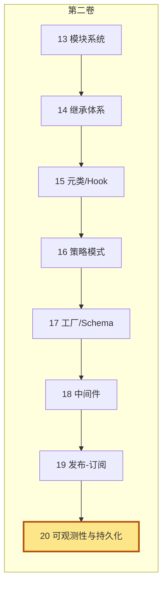
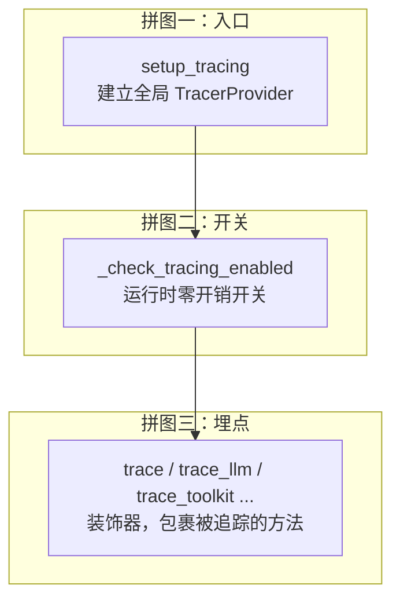
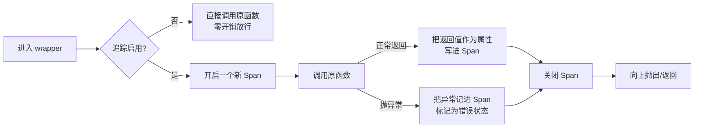
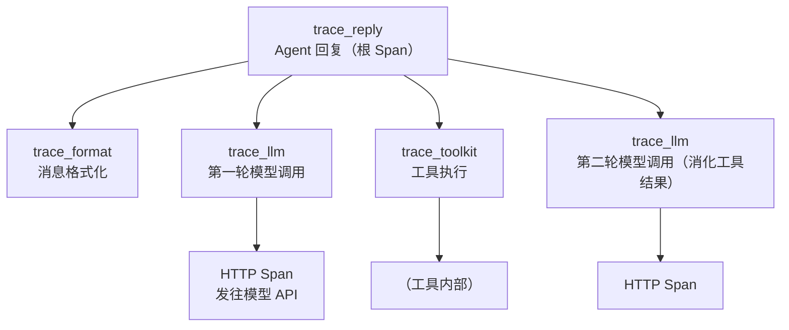
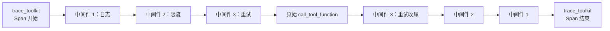
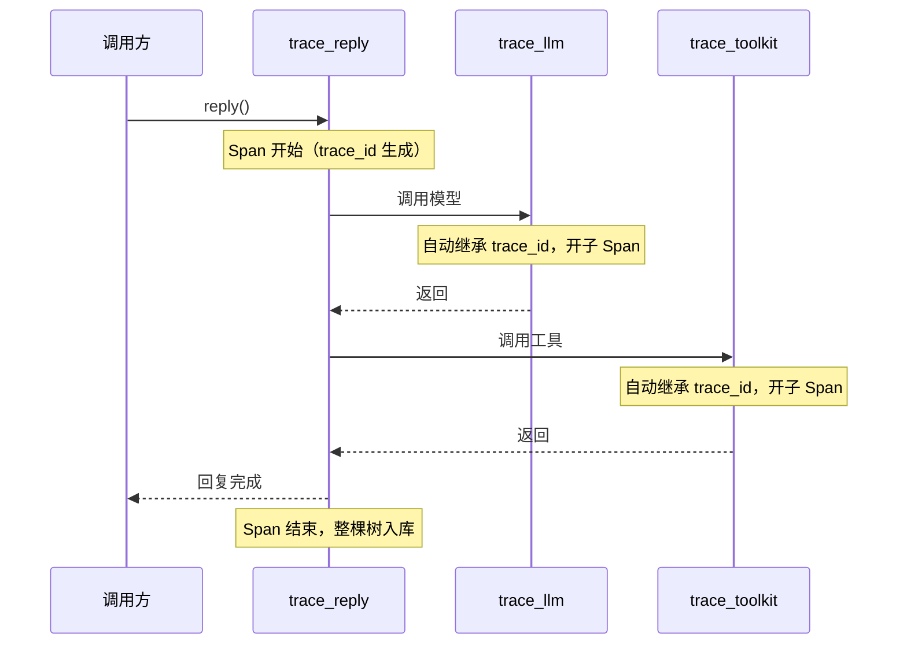
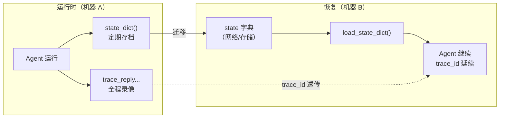

# 第 20 章 可观测性与持久化：追踪、序列化与状态管理

> 生产里的 Agent 不是"跑一次就结束"的脚本。一个复杂的 ReAct 循环可能持续几十分钟，调用几十次工具，发起几十次模型请求。中途出了偏差，你不可能靠肉眼盯着终端日志去还原"到底是哪一步、哪一次调用"出了问题。这一章谈两件事：**追踪**（runtime observation，运行时观测）让你看见调用链，**持久化**（serialization，状态序列化）让你把 Agent 的状态存下来、再恢复回去。

> 看不见的系统无法运维，存不下的状态无法恢复。可观测性和持久化是 Agent 从"玩具"走向"生产"的两根支柱。

> **上一章：[发布-订阅：多 Agent 通信（团队协作的雏形）](./ch19-pubsub.md)**

## 20.1 路线图

第二卷一路走来，我们看了七种设计模式：模块系统、继承体系、元类与 Hook、策略模式、工厂与 Schema、中间件（洋葱）、发布-订阅。这些都是"怎么组织代码"的内功。本章是第二卷的收尾，跳出"组织方式"，谈两个横切关注点——它们不属于某个具体组件，而是**横跨所有组件**。



这两个关注点分别面向两个时间维度：

- **追踪**面向"现在"——Agent 此刻在干什么、每一笔调用花了多久、有没有出错。
- **持久化**面向"跨时间"——把现在的状态存下来，将来某天再恢复成一个活着的 Agent。

一个是录像机，一个是存档点。本章先讲录像机，再讲存档点。

## 20.2 知识补全：OpenTelemetry 是什么

要理解 AgentScope 的追踪，得先认识它脚下的那座地基——**OpenTelemetry**（简称 OTel）。

OpenTelemetry 是云原生计算基金会（CNCF）旗下的可观测性标准，目标是"一次埋点，到处可观测"。它把"系统到底发生了什么"拆成三类信号：

| 信号 | 回答的问题 | 例子 |
|------|-----------|------|
| **Traces（追踪）** | 一个请求经过了哪些步骤、各花多久？ | 用户点了一下按钮，请求穿过网关→服务 A→数据库 |
| **Metrics（指标）** | 系统的整体表现如何？ | 当前 QPS、平均延迟、错误率 |
| **Logs（日志）** | 某个时刻发生了什么具体事件？ | "用户 U1234 登录失败，密码错误" |

AgentScope 只用了其中的 **Traces** 部分。原因很务实：Agent 的问题大多是"链路问题"——某一步走偏了，后面全错。追踪天然适合定位这种"哪一步出错"的排查。

### Trace 与 Span：两个核心概念

理解追踪只需要记住两个词：

- **Trace（追踪）**：一个完整请求从头到尾的调用链。可以把它想成**一笔快递的全流程单**——从下单、揽收、分拣、运输、派送，一整张记录。
- **Span（跨度）**：调用链里的一个节点，代表一次具体操作。每个 Span 有名字、开始时间、持续时间、属性（attributes）和状态。快递流程单上，每一次"扫件"就是一个小框，框里写着"什么时候扫的、在哪个网点、花了多久"。

很多 Span 嵌套起来，组成一棵树，就是 Trace：

```
Trace: agent.reply()                    ← 根 Span
├── Span: format()                      ← 消息格式化
├── Span: model.__call__()              ← 第一轮模型调用
│   └── Span: http_request              ← 底层 HTTP 请求
├── Span: tool.get_weather()            ← 工具执行
└── Span: model.__call__()              ← 第二轮模型调用
```

> **设计一瞥**：为什么用 OpenTelemetry 而不是自己写一套日志格式？因为 OTel 是行业标准，能对接 Jaeger、Zipkin、Datadog、Grafana Tempo、Honeycomb 等所有主流可视化后端。运维同学不需要学新工具，Agent 的追踪数据和已有微服务的追踪数据**进了同一张图**——这对"Agent + 后端服务"混合架构的排查极其重要。

## 20.3 追踪系统的三块拼图

AgentScope 的追踪系统不是一个大函数，而是三块职责清晰的拼图拼起来的。理解了这三块的分工，整套机制就豁然开朗。



### 拼图一：入口 `setup_tracing`

追踪不是凭空发生的——它需要有人建好"录像系统"。`setup_tracing` 就是那个一次性建好录像系统的函数。它干三件事：

```python
# 形态示意，非源码
def setup_tracing(endpoint: str) -> None:
    exporter = OTLPSpanExporter(endpoint=endpoint)   # 1. 出口：发到哪个后端
    processor = BatchSpanProcessor(exporter)          # 2. 批处理：攒一批再发
    provider = TracerProvider()
    provider.add_span_processor(processor)            # 3. 装到全局 Provider 上
    trace.set_tracer_provider(provider)
```

这三步可以类比为**装快递公司**：

| 步骤 | 类比 | 作用 |
|------|------|------|
| OTLP Exporter | 选定合作的派送公司（顺丰/京东） | 决定 Span 最终送到哪个可视化后端（Jaeger/Tempo/Datadog） |
| BatchSpanProcessor | 设一个集散中心，攒够一车再发 | 异步批量发送，避免每次生成 Span 都发一次网络请求 |
| TracerProvider | 在公司总部登记这套派送体系 | 全局唯一，所有 Tracer 都从这里取 |

`setup_tracing` 只需要调用一次。调用之后，整个进程里的追踪就"通电"了。

> **细节一瞥**：真实的 `setup_tracing` 会先检查全局是否已经存在 TracerProvider——如果你的应用自己已经集成了 OpenTelemetry（比如微服务框架统一接管），AgentScope 不会重建或覆盖它，只会**追加**自己的 Span Processor。这是"友好共存"的设计：框架不该抢用户对全局可观测性配置的控制权。

### 拼图二：开关 `_check_tracing_enabled`

不是每个用户都开了追踪。如果没开追踪，那些遍布代码的 trace 装饰器会不会拖慢正常调用？

答案是不会，关键就在这个开关。它的本质就是一个布尔判断：

```python
# 形态示意
def _check_tracing_enabled() -> bool:
    return _config.trace_enabled
```

这个布尔值存在一个 `ContextVar`（上下文变量）里，默认 `False`。每个 trace 装饰器在入口第一行就调它：

```python
# 形态示意
async def wrapper(*args, **kwargs):
    if not _check_tracing_enabled():
        return await func(*args, **kwargs)   # 未启用 → 直接放行，原样调用
    # ... 启用时才创建 Span、记录属性
```

未启用时的开销，是一次 `ContextVar.get()` 加一个 `if`——可以理解为零开销。这是把"可选特性"做便宜的典型手法：**先把开关放到最前面，关掉的时候什么都不做**。

### 拼图三：装饰器 `trace`

开关决定"要不要记录"，装饰器决定"记录什么"。最通用的 `trace` 装饰器的工作流可以归纳成四步：



最值得记住的细节是**异常也会被记录**。如果一个工具调用抛了异常，对应的 Span 不会被悄悄丢掉，而是被打上错误状态、附上异常信息，然后异常照常向上抛。这样你在追踪图里能直接看到"红色的、出错的 Span"，定位问题一步到位。

> **设计一瞥**：追踪不是"成功才记录"。失败、超时、异常的 Span 往往比成功的 Span 更有价值——因为出问题的时候你最需要看见发生了什么。把异常路径也纳入追踪，是可观测性系统的基本素养。

## 20.4 五种专用追踪装饰器

通用的 `trace` 装饰器提供了骨架。在此之上，AgentScope 为五类核心操作各写了一个专用装饰器，它们记录的属性各不相同——因为不同操作"值得看的东西"不一样。

| 装饰器 | 追踪的对象 | 记录的关键属性 |
|--------|-----------|---------------|
| `trace_reply` | Agent 的一次回复 | Agent 名、输入消息、输出消息 |
| `trace_llm` | 模型调用 | 模型名、token 用量、是否流式 |
| `trace_toolkit` | 工具执行 | 工具名、入参、返回值 |
| `trace_format` | 消息格式化 | Formatter 类型、消息规模 |
| `trace_embedding` | 向量嵌入 | 模型名、嵌入维度、文本长度 |

为什么要分五种，而不是统一一种？因为**每一层的属性是那一层才有的**。token 用量只有模型层知道；工具的入参和返回值只有工具层知道；Agent 的名字和回复内容只有 Agent 层知道。如果硬塞进一个通用装饰器，就得在每个调用点手动塞一堆属性，又啰嗦又容易漏。专用装饰器把"该记什么"内聚到各自那一层，调用点保持干净。

### 五种装饰器的嵌套关系

在一次完整的 Agent 回复里，这五种 Span 是**嵌套**的，组成一棵树。根是 `trace_reply`，下面挂着格式化、模型调用、工具调用等子 Span：



把这棵树丢进 Jaeger 或 Grafana Tempo，你会看到一个**瀑布图**：从上到下是时间轴，每一行是一个 Span，缩进表示父子关系。一眼就能看出：第一轮模型调用花了多久、工具调用卡在哪、第二轮又花了多久。这比看几万行日志直观一百倍。

> **类比**：追踪瀑布图就像医院的"诊疗流程单"。你挂号（trace_reply）→ 分诊台登记（trace_format）→ 见医生开检查（trace_llm）→ 去检查科室做检查（trace_toolkit）→ 拿结果回诊室（第二轮 trace_llm）。每个环节都盖一个章、写一个时间。最后出了医疗纠纷，一张流程单还原全过程。

## 20.5 装饰器的层级：追踪在中间件之外

第 18 章我们讲过 Toolkit 的中间件机制——洋葱模型，一层层包裹原始的工具调用。这一节要回答一个微妙但重要的问题：**追踪装饰器应该包在洋葱的哪一层？**

先看装饰器的写法形态（这里只看结构，不贴源码正文）：

```python
# 形态示意：装饰器从下往上应用
@trace_toolkit          # 外层：追踪
@_apply_middlewares     # 内层：中间件链
async def call_tool_function(self, tool_call):
    ...
```

Python 装饰器是**从下往上**应用的：先把中间件包在原始函数外面，再把追踪包在"已经包好中间件的函数"外面。结果是追踪在最外层，中间件在中间，原始函数在最里。从调用顺序看，一次工具调用是这样的：



也就是说，**追踪包裹了整个中间件链**。这一点非常重要，因为：

- 如果把追踪放在中间件**里面**（紧贴原始函数），那么中间件的执行时间就**测不到**——你只会看到原始函数耗时，限流、重试、日志这些中间件的耗时全被"吞掉"了。
- 放在最外层，意味着即便某个中间件拦截了请求（比如限流直接拒绝）、请求根本没走到原始函数，追踪也照样能记录到"这次调用被中间件拦了"。

> **设计一瞥**：装饰器的顺序不是随便写的，它是一份关于"我要观测到什么粒度"的声明。把追踪放在最外层，等于宣告：**所有经过这条路径的行为，包括中间件本身，都在我的观测范围之内。** 这是一个关于可观测性"覆盖范围"的设计决策。

### 推而广之：层级是追踪的灵魂

这个"外层包内层"的思路，不只用在工具调用上，而是贯穿整个追踪系统。回看 20.4 节那棵 Span 树——`trace_reply` 在最外层，`trace_llm` / `trace_toolkit` 是它的子 Span，HTTP 请求又是 `trace_llm` 的子 Span。每一层只负责"我开始/结束"和"我这一层特有的属性"，至于子层怎么嵌套，由 OpenTelemetry 的 Span 上下文自动传播处理。

OpenTelemetry 的 Span 上下文能在异步调用链里自动传递——父 Span 的身份（trace_id、span_id）会跟着 `async`/`await` 一路传下去，子 Span 自动认领父 Span。所以你不需要手动管理"我现在在第几层"，只要在被追踪的方法上加装饰器，父子关系自然成立。



## 20.6 持久化：StateModule 的另一面

追踪解决的是"看得见"，持久化解决的是"存得下、拿得回"。第 14 章我们从继承体系的角度认识了 `StateModule`——它是 AgentScope 里所有可序列化组件的基类。这一节从可观测性和运维的角度，重新看它的价值。

### 序列化要解决的真实问题

一个 Agent 跑到一半，把它的状态（state）完整存下来，能干嘛？至少四件事：

| 用途 | 场景 |
|------|------|
| **断点续跑** | 一个跑了二十分钟的长任务被中断，从中断点恢复，不用从头来 |
| **状态迁移** | 把 Agent 从一台机器搬到另一台（负载均衡、灰度发布） |
| **调试回放** | 出错的 Agent 当时内存里是什么？存下来，事后离线分析 |
| **A/B 测试** | 同一个初始状态，喂给不同参数的两个 Agent，对比行为差异 |

类比一下：追踪是**行车记录仪**（记录每一刻发生了什么），序列化是**游戏的存档点**（把当前进度冻住，下次接着玩）。两者互补——光有行车记录仪，你只能"看录像"不能"重玩"；光有存档点，你不知道存档之前到底发生了什么。

### 序列化的 API 形态

StateModule 暴露两个核心方法，名字借鉴了 PyTorch 的 `state_dict` / `load_state_dict`：

```python
# 形态示意
agent = ReActAgent(name="assistant", ...)

# 存档：把当前状态拍一张"快照"
state = agent.state_dict()

# 读档：在另一个 Agent 上恢复
agent2 = ReActAgent(name="assistant", ...)
agent2.load_state_dict(state)
```

这套 API 之所以借用 PyTorch 的命名，是因为两者的语义高度一致：**返回的是一个普通的、可序列化的字典**，你可以 `json.dumps` 它、存进 Redis、写进数据库、通过网络发走。恢复时再把字典灌回去。状态 = 字典，就这么简单。

### 序列化是递归的

一个 ReActAgent 的状态不是扁平的，而是**树状的**——因为 Agent 内部还有 Memory、Toolkit 等子模块，每个子模块自己也是 StateModule：

```
ReActAgent.state_dict()
├── memory: InMemoryMemory.state_dict()
│   ├── content: [消息列表]
│   └── compressed_summary: 压缩摘要
├── toolkit: Toolkit.state_dict()
│   └── tools: {工具名: 工具状态}
└── ...（其他 StateModule 子模块）
```

每一层只负责序列化**自己这一层**的状态，子模块的状态由子模块自己序列化。父模块通过一个内部的子模块字典，递归地把所有子模块的 `state_dict()` 收集起来，拼成完整的一棵树。

> **设计一瞥**：这种"每层只管自己、递归收集子层"的序列化模式，和文件系统很像——一个文件夹不关心里面文件的内容，只负责把文件和子文件夹列出来；序列化整个文件夹就是递归地序列化每个子项。好处是**新增子模块时，父模块的序列化代码不用改**——只要新模块也是 StateModule，它就自动被纳入序列化树。这是开闭原则在序列化上的体现。

### 追踪与持久化的配合

这两个机制不是各自为政，在生产里经常配合使用：

- **追踪定位、持久化复现**：追踪告诉你"第 47 步、第二次工具调用出了问题"，持久化让你把出错那一刻的状态存下来，离线复现。
- **检查点 + 追踪 = 完整审计**：定期存档（比如每 10 步存一次），同时全程追踪。出了问题，既有"录像"又有"存档"，可以精确还原任何时刻的内部状态。
- **迁移 + 追踪连续性**：Agent 从机器 A 迁到机器 B 时，OpenTelemetry 的 trace_id 能跨进程传递（通过 W3C TraceContext 头），迁移前后的追踪数据接得上，不会断成两段。



## 20.7 把第二卷串起来

本章是第二卷的收官。回过头看，第二卷讲的是"AgentScope 怎么组织代码"，八种关注点交织在同一个框架里：

| 章 | 关注点 | 一句话概括 |
|----|--------|-----------|
| 13 | 模块系统 | 用包结构和 `_` 前缀约定，把庞杂的能力收敛成清晰的公共 API |
| 14 | 继承体系 | `StateModule → AgentBase → ReActAgentBase → ReActAgent` 四层链，每层加一份职责 |
| 15 | 元类与 Hook | 用元类自动给方法套 Hook，让"前/后处理"和业务逻辑解耦 |
| 16 | 策略模式 | Formatter 多态，让"消息怎么变成模型输入"可替换 |
| 17 | 工厂与 Schema | 把普通函数自动变成带 JSON Schema 的工具声明 |
| 18 | 中间件 | 洋葱模型，让工具调用支持日志、限流、重试等横切逻辑 |
| 19 | 发布-订阅 | MsgHub 让多 Agent 之间能广播消息、组建协作团队 |
| 20 | 可观测性与持久化 | OpenTelemetry 追踪看得见，StateModule 序列化存得下 |

这些关注点**不是孤立**的。一个 ReActAgent 同时用了：继承（四层链）、元类（自动 Hook）、中间件（工具调用）、发布-订阅（MsgHub）、策略（Formatter），并且每一层都被追踪装饰器包裹、整个对象都能 `state_dict()`。第二卷的价值，就是让你在脑海里建起这张"同一份代码里多种模式并存"的全景图。

有了这张图，你不仅读得懂框架源码，更能判断"我要加一个新功能，应该在哪一层动手"——这是从"会用框架"到"理解框架"的关键一步。

## 检查点

1. **追踪和日志有什么本质区别？** 追踪记录的是**带结构的调用链**——每个 Span 知道自己的父是谁、什么时候开始、持续多久。日志是一条条孤立的文本，没有天然的父子关系和耗时信息。排查"链路问题"（哪一步慢、哪一步错）追踪远胜日志；排查"单点事件"（某条记录的具体内容）日志更顺手。两者互补。

2. **为什么 trace 装饰器要在最外层包住中间件？** 装饰器从下往上应用，`trace_toolkit` 在 `_apply_middlewares` 之外，意味着追踪覆盖了**包括中间件在内的整个调用过程**。如果反过来，中间件的耗时和拦截行为就测不到，可观测性出现盲区。

3. **未启用追踪时，性能损失从哪来、有多大？** 每个 trace 装饰器入口第一行调 `_check_tracing_enabled()`，它读一个 `ContextVar`（默认 `False`）然后 `if` 判断。未启用时不会创建 Span、不会导入 OpenTelemetry、不会提取属性——开销就是一次上下文变量读取加一次布尔判断，可视为零。

4. **`state_dict()` 返回的东西为什么是普通字典，而不是某个自定义类？** 因为普通字典**可序列化、可传输、可存储**——能 `json.dumps`、能进 Redis、能走网络。如果返回自定义类，使用者还得再写一层转换才能持久化。借用 PyTorch 的命名也传递了这个语义：状态就是数据，数据就该是朴素的结构。

5. **追踪和持久化怎么配合做"事后调试"？** 追踪是录像机，告诉你"第 47 步出错了"；持久化是存档点，让你把出错那一刻的内部状态冻结下来。两者配合：先用追踪定位到出错的 Span，再用持久化把那个时刻的状态恢复出来，离线重放、深入分析。光有录像只能看不能改，光有存档不知道存档前发生了什么——合起来才是完整的事故复盘工具链。

## 下一站预告

第二卷我们**读懂**了 AgentScope 的设计——八种关注点、一棵继承树、一套横切机制。理解了这些，框架在你眼里就不再是一团黑箱，而是一张清晰的设计图。

但读懂和会做是两回事。第三卷我们**动手**——亲手构建新的 Memory 实现、新的 Formatter、新的中间件、新的工具，把第二卷学到的每一种模式变成自己手里的本事。从"看懂别人怎么设计"走向"自己设计给别人看"。

> **下一章：[扩展准备](../volume-3-building/ch21-dev-setup.md)**
