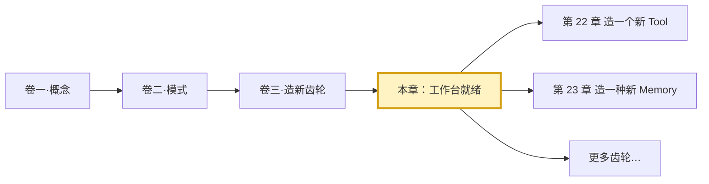
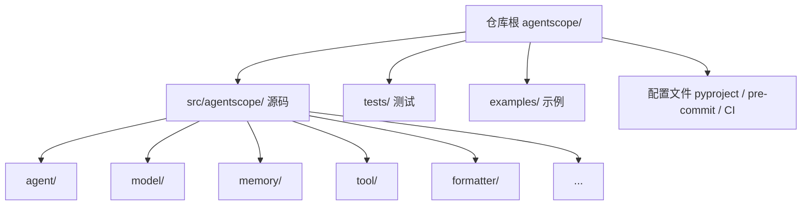
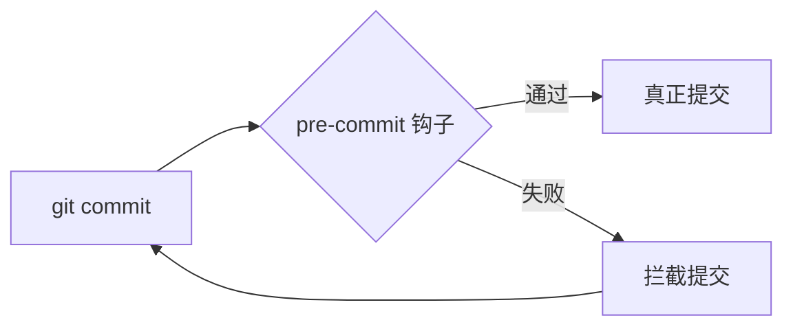
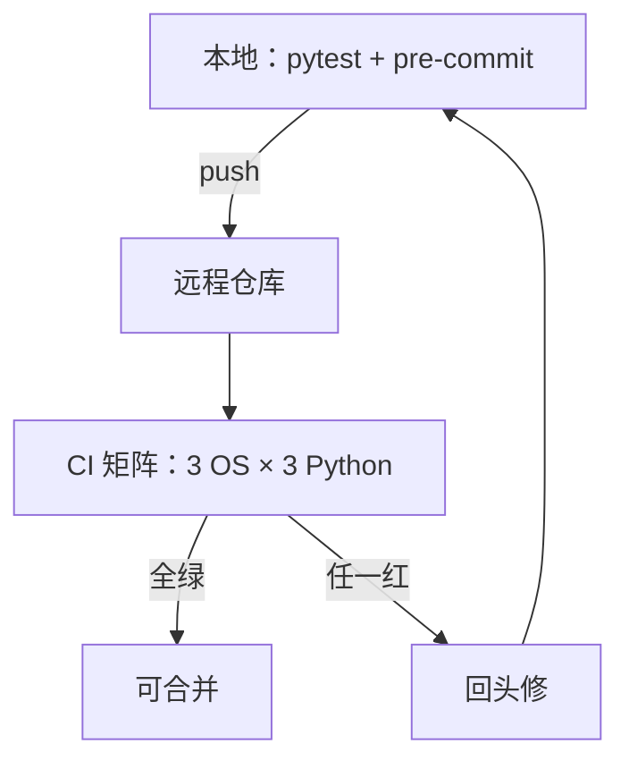

# 第 21 章 扩展准备——搭好造齿轮的工作台

> 卷三是一组"动手"的章节。前两卷我们在读图、读接口、读设计动机；从这一卷开始，我们要往框架里添新齿轮——自定义工具、自定义 Memory、自定义 Formatter、自定义中间件，乃至一整个新的 Agent。但在拿起车床之前，得先把工作台铺好：依赖装得上、测试跑得动、质量门能过。本章就是那张工作台。

> **上一章：[可观测性与持久化](../volume-2-patterns/ch20-observability.md)**

---

## 21.1 路线图

把整个 AgentScope 的学习路径想象成一次旅行：卷一让你看懂地图，卷二让你会读路标，卷三是让你亲手修一条新路。修路需要铲子、测量绳、安全帽——本章就是把这套工具发到你手上。



本章本身没有"新知识"——它讲的是工程基础设施：仓库怎么装、测试怎么写、提交前的门怎么过。这些事看似琐碎，但它们决定了后面每一章的代码到底"对不对"，而不是"在我电脑上能跑"。

本章会回答四个问题：

1. 一个能改、能跑、能验证的 AgentScope 开发环境长什么样？
2. 仓库的目录约定和模块化哲学是什么？
3. 框架为什么这样组织测试、用什么模式写测试？
4. 提交一道代码之前，必须跨过哪几道质量门？

理解了这些，后面每一章你就不会被"环境没装好""测试不会写""pre-commit 一直红"这些工程问题打断思路。

---

## 21.2 知识补全：现代 Python 包的三件套

在装环境之前，先补三块背景知识：`src` layout、可选依赖分组、可编辑安装。它们是后面所有命令的"为什么"。

### 三件套之一：`src` layout

一个 Python 项目可以有两种代码摆放方式。一种是"扁平布局"，把包目录直接放在仓库根：

```
my_project/
├── my_pkg/          # 包就在根目录
│   └── __init__.py
└── pyproject.toml
```

另一种是"`src` layout"，把源码塞进一个叫 `src/` 的子目录：

```
my_project/
├── src/
│   └── my_pkg/      # 包藏在 src 下面
│       └── __init__.py
└── pyproject.toml
```

AgentScope 用的是后者。`pyproject.toml` 里只有一行配置就说明了这一点：

```toml
[tool.setuptools]
packages = { find = { where = ["src"] } }
```

为什么非要绕一层 `src/`？关键在于**防止"未安装就能 import"的假象**。在扁平布局下，你在仓库根目录敲 `python -c "import my_pkg"`，Python 会因为当前目录在搜索路径上而成功——可这并不意味着包真的被打包对了。一旦发到别的机器，或者 CI 里没有进入这个目录，就 `import` 不到了。`src/` layout 强迫你"先安装、再用"：源码物理位置和包导入路径解耦，装好的是 `agentscope` 这个包，但文件在 `src/agentscope/`。

> **设计一瞥**：`src` layout 是个"小麻烦换大保险"的取舍。日常 `import agentscope` 的写法不变，只是开发时必须先 `pip install -e .` 一次。这个一次性成本，换来的是"能 import 一定意味着装好了"的可信赖直觉。

### 三件套之二：可选依赖分组

一个像 AgentScope 这样覆盖面广的框架，不会把所有依赖一股脑塞进"必装列表"。有人只想用本地模型，没必要被逼着装云端的 SDK；有人只跑单测，没必要拉一堆 RAG 向量库。`pyproject.toml` 用**可选依赖分组**（optional dependencies / "extras"）来拆：

```toml
[project.optional-dependencies]
full = [ ... ]     # 全功能依赖
dev = [ ... ]      # 开发与测试工具
a2a = [ ... ]      # A2A 协议相关
realtime = [ ... ] # 实时语音相关
```

装的时候用方括号指定要哪一组：

```bash
pip install -e ".[dev]"      # 只要开发工具
pip install -e ".[full]"     # 全功能
pip install -e ".[dev,a2a]"  # 多组并用
```

AgentScope 的 `[dev]` 组里塞了开发链上的几样东西：测试框架 `pytest`、进程隔离的 `pytest-forked`、Git 钩子管理器 `pre-commit`、文档用的 `myst_parser`、画图用的 `matplotlib`、以及测试里模拟 Redis 用的 `fakeredis`。关键的是，它**还把 `agentscope[full]` 也拉了进来**——意思是"开发者默认拥有全部运行依赖"。这样你在写代码时，不会因为缺某个云端 SDK 而被某个测试跳过。

### 三件套之三：可编辑安装（editable install）

`pip install -e` 里的 `-e` 是 editable 的缩写。普通安装会把代码"复制"到 Python 的 site-packages 里；可编辑安装则只在那里放一个"指回你仓库"的链接。结果是：你改了 `src/` 里的代码，下次 `import` 立刻生效，不用重装。对于要反复改代码的框架开发，这一条几乎不可妥协。

把三件套合起来，装环境就一句话：

```bash
pip install -e ".[dev]"
```

它同时做到了：以 `src` layout 的方式注册包、装上全部运行依赖、装上开发工具、并且让源码改动即时生效。

---

## 21.3 仓库地图：目录约定与模块化哲学

装好之后，仓库长什么样。这一节不贴源码，只看"地图"——理解每个目录承担什么职责，整个框架是怎么被切成一块块的。

### 顶层结构



源码全部住在 `src/agentscope/` 一个包里，下面按"能力域"切分子目录。这与卷一反复出现的"分层抽象"完全对应：

| 子目录 | 承担的能力域 | 卷一对应的概念 |
|--------|------------|--------------|
| `agent/` | 智能体实现（ReActAgent、UserAgent、A2AAgent、RealtimeAgent） | 智能体层 |
| `model/` | LLM 模型适配器（OpenAI、Anthropic、DashScope、Gemini、Ollama） | 模型层 |
| `formatter/` | 消息格式转换器 | 消息桥 |
| `memory/` | 记忆实现（InMemory、Redis、SQLAlchemy、Mem0、ReMe） | 记忆层 |
| `tool/` | 工具系统（Toolkit、工具函数） | 工具层 |
| `message/` | 消息类型（Msg、TextBlock、ToolUseBlock） | 内容块 |
| `pipeline/` | 多智能体编排（MsgHub） | 团队编排 |
| `session/` | 会话管理 | 持久化 |
| `rag/` | RAG 组件（读取器、向量库） | 检索增强 |
| `a2a/` | Agent-to-Agent 协议 | 跨进程协作 |
| `realtime/` | 实时语音交互 | 语音通道 |
| `tracing/` | OpenTelemetry 追踪 | 可观测性 |

这张表的价值在于：**卷三后面每造一个齿轮，都知道它该拧到哪个目录**。造新工具就动 `tool/`，造新记忆就动 `memory/`，造新格式器就动 `formatter/`——目录边界就是职责边界。

### 命名约定：下划线前缀

仔细看 `src/agentscope/` 下的文件名，会发现不少以 `_` 开头：`_toolkit.py`、`_agent_base.py`、`_config.py`。这不是强迫症，而是一条约定：

- 以 `_` 开头的文件是"内部实现"，不鼓励用户直接 import；
- 真正给用户用的公共 API，通过各模块的 `__init__.py` 重新导出。

打个比方：`_toolkit.py` 是后厨，`__init__.py` 是菜单。食客看菜单点菜（`from agentscope import Toolkit`），不需要也不应该直接冲进后厨（`from agentscope.tool._toolkit import ...`）。这条约定后面造齿轮时也要遵守：你写的新文件如果只是内部实现，就用 `_` 开头；要对外暴露的，写进 `__init__.py` 的 `__all__` 列表。

> **设计一瞥**：`_` 前缀 + `__init__.py` 重导出，本质是 Python 社区版的"门面模式"（Facade）。它让框架能自由重构内部文件结构，而用户代码只依赖稳定的公共名字。换句话说，今天叫 `_toolkit.py`，明天拆成三个文件，只要 `from agentscope import Toolkit` 还能用，用户就无感。

### 懒加载：第三方库推迟到用的时候

AgentScope 接的一大堆 SDK——OpenAI、Anthropic、Redis、各种向量库——并不是每个用户都要全装。如果框架在文件顶部就 `import redis`，那么任何不用 Redis 的用户一启动就崩。所以框架内部普遍采用"懒加载"：把第三方依赖的 import 推迟到函数体内部。

示意形态：

```python
# 顶部只 import 标准库与框架自己的东西
from agentscope.message import Msg

def use_redis():
    # 真正用到时才 import
    from redis import Redis
    ...
```

这样，没装 `redis` 的用户只要不调用 `use_redis`，就永远不会碰到 import 错误。这条规则在卷三写代码时同样适用：你造的新齿轮如果依赖某个不在 `dependencies` 列表里的库，就在函数里 import 它，别放顶部。

---

## 21.4 测试体系：异步、隔离、按模块组织

环境装好、地图看懂，下一个问题是"我怎么知道我的代码对"。答案藏在 `tests/` 目录里。这一节讲框架的测试哲学，不讲某条具体测试的细节。

### 测试文件怎么命名

`tests/` 下的文件按"被测模块 + 子功能"命名：

```
tests/
├── toolkit_basic_test.py            # Toolkit 基础功能
├── toolkit_async_execution_test.py  # Toolkit 异步执行
├── toolkit_middleware_test.py       # Toolkit 中间件
├── memory_test.py                   # Memory 基础测试
├── memory_compression_test.py       # Memory 压缩
├── config_test.py                   # 配置模块
├── formatter_openai_test.py         # OpenAI 格式器
├── react_agent_test.py              # ReActAgent
└── ...
```

模式是 `<模块>_<子功能>_test.py`。这条约定让"找测试"变成肌肉记忆：改了 `memory/` 下的压缩逻辑，直接去 `memory_compression_test.py` 找对应测试。卷三你造齿轮时，新齿轮的测试文件也照这个模式命名，方便自己和同伴定位。

### 异步测试：为什么是 `IsolatedAsyncioTestCase`

AgentScope 的核心 API（`await agent(msg)`、`await toolkit(...)`、`await memory.add(...)`）全是异步的。普通 `unittest.TestCase` 跑不了 `async def` 测试方法，所以框架统一用 `unittest.IsolatedAsyncioTestCase`——它为每个测试方法单独起一个事件循环。

一个典型测试类的骨架长这样：

```python
from unittest.async_case import IsolatedAsyncioTestCase

class ToolkitBasicTest(IsolatedAsyncioTestCase):
    """Toolkit 基础功能的测试套。"""

    async def asyncSetUp(self) -> None:
        """每个测试方法运行前：搭好被测对象。"""
        ...

    async def test_register_and_call(self) -> None:
        """注册一个工具，然后调用它，断言结果。"""
        ...

    async def asyncTearDown(self) -> None:
        """每个测试方法运行后：清理状态。"""
        ...
```

几个要点：

1. **类名**：`XxxTest(IsolatedAsyncioTestCase)`，一个文件一个主测试类。
2. **方法名**：以 `test_` 开头，pytest 会自动发现。
3. **`asyncSetUp` / `asyncTearDown`**：分别在每个测试方法的前后跑，用来初始化和清理，保证测试之间不串味。
4. **断言**：用 `self.assertEqual`、`self.assertListEqual`、`self.assertRaises` 等自带断言。

### 测试的"四拍"节奏

把一个测试方法展开看，几乎所有测试都遵循同一个节奏——"准备 → 注册/调用 → 断言状态 → 断言结果"。可以类比成饭店后厨的"备料 → 下锅 → 尝味 → 上菜"：

| 节奏 | 后厨类比 | 测试中做什么 |
|------|---------|------------|
| 准备 | 备料、切菜 | 在 `asyncSetUp` 里造好被测对象、依赖 |
| 操作 | 下锅翻炒 | 调用被测方法（注册工具、加消息、跑循环） |
| 状态断言 | 看火候 | 断言内部状态变了（注册数、消息条数） |
| 结果断言 | 尝味道 | 断言返回值符合预期 |

```python
async def test_register_tool(self) -> None:
    # 操作：注册一个工具
    self.toolkit.register_tool_function(tool_func=my_func)
    # 状态断言：工具列表里有它
    self.assertIn("my_func", self.toolkit.tool_names)
    # 结果断言：生成的 JSON schema 长得对
    schema = self.toolkit.get_json_schema("my_func")
    self.assertEqual(schema["name"], "my_func")
```

这种节奏的好处是可读性高——读测试像读说明书，一眼看出"测了什么、期望什么"。

### 运行测试：从一条到一片

pytest 的发现机制让我们能用很灵活的粒度跑测试：

```bash
pytest tests/                          # 全部
pytest tests/memory_test.py            # 一个文件
pytest tests/ -k "toolkit"             # 按关键字筛
pytest tests/config_test.py::ConfigTest::test_config_attributes  # 单个方法
```

还有一个对 AgentScope 特别重要的开关：`--forked`。

```bash
pytest tests/ --forked
```

`--forked` 让每个测试跑在独立子进程里。为什么需要它？因为 AgentScope 有不少全局状态——`agentscope.init()` 设置的配置、Toolkit 注册的工具、Memory 里的历史。普通模式下这些状态会在一个进程内的测试之间"漏"出去，导致"单独跑过、一起跑挂"。`--forked` 通过进程隔离把每个测试关进自己的小盒子，从根本上消除串味。框架 CI 里的测试命令就带着覆盖率收集：

```bash
coverage run -m pytest tests
coverage report -m
```

---

## 21.5 质量门：pre-commit 与 CI

代码写出来"能跑"只是及格线，要进仓库还得过两道闸：本地的 pre-commit，云端的 CI。这一节讲这两道闸拦什么、为什么这么拦。

### pre-commit 是什么

`pre-commit` 是一个 Git 钩子管理器。`git commit` 之前，Git 本身留了一个叫 `pre-commit` 的钩子点，pre-commit 这个工具就是把一整套检查塞进那个点。装一次（`pre-commit install`），以后每次提交都自动跑：

```bash
pre-commit install   # 把钩子装进 .git/
```

装完之后，提交代码的流程变成：



注意那个回环箭头：检查没过，提交根本进不去。这就把"代码风格"这种事从"事后 review 扯皮"前移到了"提交前当场挡住"。

### pre-commit 拦什么

`.pre-commit-config.yaml` 把检查分成几类。可以用"机场安检"来类比——不同检查对应不同仪器：

| 检查类别 | 代表钩子 | 安检类比 | 它拦什么 |
|---------|---------|---------|---------|
| 文件健康 | `check-yaml`、`check-toml`、`check-json` | 看行李有没有破 | 配置文件语法对不对 |
| 安全 | `detect-private-key` | 查违禁品 | 别把私钥提交上去 |
| 卫生 | `trailing-whitespace`、`end-of-file-fixer` | 查卫生死角 | 行尾空格、文件末尾空行 |
| 格式化 | `black` | 统一制服 | 代码格式全员一致 |
| 风格 | `flake8`、`pylint` | 查着装规范 | 代码风格上的问题 |
| 类型 | `mypy` | 查证件 | 类型标注与实现是否吻合 |
| 包配置 | `pyroma` | 查营业执照 | `pyproject.toml` 是否规范 |

一个有趣的点：`black`、`flake8`、`pylint`、`mypy` 这些工具**不在 `[dev]` 依赖里**。它们由 pre-commit 在各自隔离的小虚拟环境里装和跑。好处是：你的主开发环境不会被一堆 lint 工具污染，而且团队成员不需要纠结"该装哪个版本的 black"——pre-commit 配置文件里钉死了版本。

手动跑一遍全仓库的检查：

```bash
pre-commit run --all-files
```

第一次会比较慢（要装各钩子的环境），之后就快了。

> **设计一瞥**：把 lint 工具交给 pre-commit 独立管理，是一种"关注点分离"。`[dev]` 装的是"你写测试时需要的"（pytest、fakeredis），pre-commit 装的是"提交时替你把关的"。两套依赖不混在一起，升级、排查都更清爽。

### CI：把同一道闸搬上云端

`.github/workflows/` 下有两个关键工作流：`unittest.yml` 跑测试，`pre-commit.yml` 跑同样的代码检查。换句话说，**本地能过的检查，CI 也会再过一遍**；本地偷懒跳过，CI 会替你拦下来。

CI 还做了本地做不到的事——**跨平台、跨 Python 版本**。测试矩阵覆盖 Ubuntu / Windows / macOS 三个系统，以及 Python 3.10 / 3.11 / 3.12 三个版本。你在 macOS + 3.12 上跑通了，不代表 Windows + 3.10 上也通——这种差异只能靠 CI 矩阵暴露。所以卷三写完代码，本地绿只是第一步，等 CI 也绿了才算真正交付。



### 一个允许的例外

pre-commit 几乎对所有代码都一视同仁，但有一个被官方点名的例外：Agent 的系统提示词（system prompt）字符串里经常有 `\n`，而某些钩子会去"修正"这些字符串格式，结果把提示词改坏。这种情况下允许在那一行加跳过标记。除此之外，**永远修代码，不要跳检查**——这是框架的底线。

---

## 21.6 Docstring 与类型标注：写给人也写给工具

代码规范里有两件事值得单独拎出来讲，因为它们影响"你造的齿轮能不能被别人接手"：Docstring 格式和类型标注。

### Docstring 格式

AgentScope 的 docstring 遵循一套固定写法：参数类型用反引号包裹、可选参数标 `optional`、返回值也要标类型。形态如下：

```python
def create_tool(name: str, enabled: bool = True) -> "Toolkit":
    """Create a toolkit with the given name.

    Args:
        name (`str`):
            The tool name.
        enabled (`bool`, optional):
            Whether the tool is enabled. Defaults to True.

    Returns:
        `Toolkit`:
            The created toolkit instance.
    """
```

为什么要这么死板？因为这些 docstring 不只是给人读的，框架的文档构建工具会自动抽取它们生成 API 参考。格式不统一，生成的文档就乱。卷三写新函数时，照这个模板抄，省得 review 时来回返工。

### 类型标注与 mypy

mypy 在 pre-commit 里以 `--disallow-untyped-defs` 的严格模式跑，意思是**所有函数的参数和返回值都必须有类型标注**。没标的会被直接拦下：

```python
# 会被拦：缺返回值标注
def add(a: int, b: int):
    return a + b

# 通过：标注齐全
def add(a: int, b: int) -> int:
    return a + b
```

类型标注的价值不只是过 mypy 这一关。AgentScope 是一个强异步、多抽象层级的框架，IDE 的自动补全、类型检查器对"这个变量到底是不是 Msg"的判断，全靠这些标注。没有标注的代码在大型框架里会迅速变成黑箱。卷三写代码时，把"每个函数都标全类型"当成肌肉记忆。

---

## 检查点

走完这一章，用下面几个问题自测一下理解程度。

**1. 为什么 AgentScope 用 `src` layout 而不是扁平布局？**
核心是为了防止"未安装却误以为能用"的假象。扁平布局下，在仓库根目录 `import` 会因为当前路径在搜索路径上而意外成功，掩盖打包问题；`src/` layout 强制先安装再用，让"能 import"等价于"真装好了"，这是一个值得信赖的直觉。

**2. `[dev]` 可选依赖里为什么同时塞了 `agentscope[full]`？**
为了让开发者默认拥有全部运行依赖。这样写测试时不会因为缺某个云端 SDK 而被迫跳过某条测试。开发环境追求"全"，生产/用户环境追求"精"，靠可选分组区分。

**3. 一个典型的 AgentScope 测试方法遵循什么节奏？**
四拍：准备（在 `asyncSetUp` 搭好被测对象）→ 操作（调用被测方法）→ 状态断言（内部状态变了）→ 结果断言（返回值符合预期）。可类比"备料 → 下锅 → 看火候 → 尝味"。

**4. `pytest --forked` 解决什么问题？为什么 AgentScope 特别需要它？**
它让每个测试跑在独立子进程里，隔离全局状态。AgentScope 有不少全局状态（`agentscope.init()` 的配置、注册的工具、记忆历史），同一进程内测试之间会互相"串味"，导致"单跑过、合跑挂"。进程隔离从根本上消除这个问题。

**5. 为什么 `black`、`mypy` 这些 lint 工具不放进 `[dev]`，而交给 pre-commit？**
关注点分离。`[dev]` 装的是"写测试时直接用到的"（pytest、fakeredis），lint 工具是"提交时替你把关的"，由 pre-commit 在隔离环境里以钉死的版本运行。这样主环境不被一堆 lint 工具污染，团队也不必争论版本。

---

## 下一站预告

工作台铺好了，该上车床了。下一章我们会用这套环境从零造一个自定义工具——一个数据库查询工具。你会用到本章学到的测试四拍节奏来给它写测试，用 pre-commit 的门来验收，用 `__init__.py` 的重导出把它挂上框架的公共菜单。从"读别人写的齿轮"到"自己造一个齿轮"，就在下一章。

> **下一章：[造一个新 Tool](./ch22-new-tool.md)**
