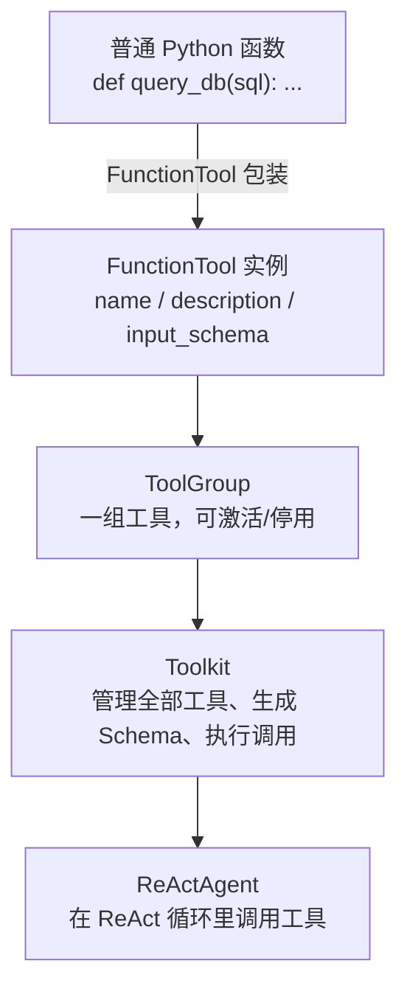
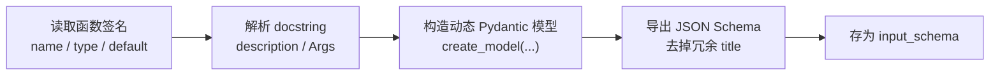
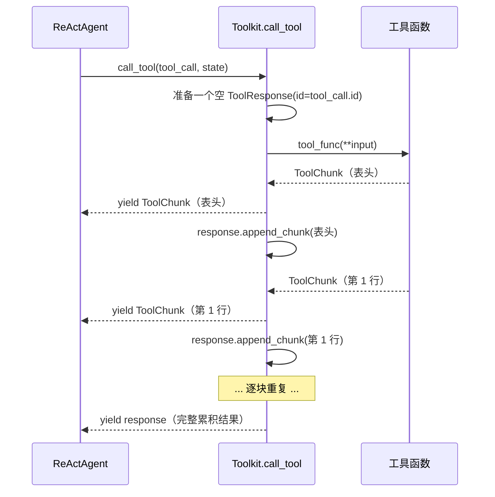

# 第 22 章 造一个新 Tool

> 把一个普通 Python 函数，变成智能体能"伸手去够"的能力。

Agent 之所以不只是"会聊天的模型"，是因为它有一双能办事的手——工具（Tool）。这一章我们不再站在调用者的角度用现成工具，而是**亲手造一个**：从写一个普通函数，到让它被 ReActAgent 在 ReAct 循环里自然调用。我们会看清 AgentScope 这套工具系统到底替你做了哪些事，又把哪些决定权留给了你。

> **上一章：[扩展准备](./ch21-dev-setup.md)**

## 22.1 路线图

这是"扩展卷"的第二站。上一章我们搭好了扩展开发者该有的环境和心智模型；本章我们落在最常见、也最轻量的一种扩展上——**新工具**。


本章的目标只有一句话：**让一个普通函数变成智能体可用的工具**。围绕这句话我们要回答四个问题：

1. 一个"工具"在 AgentScope 里到底长什么样？
2. 框架怎么从一个函数自动生成模型能看懂的 JSON Schema？
3. 工具执行后，结果以什么形态回到智能体？
4. 怎么把工具装进 Toolkit、再装进 Agent？

## 22.2 知识补全：工具系统的四块积木

在动手之前，先把工具系统里几个容易混的名字理清楚。你可以把它想成一家**外卖店**：

| 概念 | 类比 | 职责 |
|---|---|---|
| **工具 / Tool** | 一道菜单上的菜 | 一项原子能力（查数据库、发邮件、算汇率） |
| **FunctionTool** | 厨师照菜谱做出来的那道菜 | 把普通 Python 函数"包装"成符合工具协议的对象 |
| **ToolGroup** | 菜单的一个分区（"主食"/"甜点"） | 一组相关工具，可整体激活/停用 |
| **Toolkit** | 整本菜单 + 后厨调度 | 管理所有工具、生成 Schema 给模型、执行调用 |

它们的关系是一层包一层：



### 22.2.1 工具协议：ToolBase

所有工具最终都要满足一个抽象协议 `ToolBase`。它要求工具对外暴露四样东西：一个**名字**（`name`）、一段**给智能体看的描述**（`description`）、一份**输入的 JSON Schema**（`input_schema`），以及一个**被调用的方式**（`__call__`）。此外还有几个布尔标记，告诉系统这个工具是否只读、是否并发安全、是否需要注入 Agent 状态等。

`FunctionTool` 是最常用的实现：它**把一个普通函数适配成满足协议的工具**。你不必自己继承 `ToolBase`——绝大多数时候，写一个函数、交给 `FunctionTool` 就够了。

### 22.2.2 两类返回值：ToolChunk 与 ToolResponse

这是本章最容易踩坑的概念，必须一次讲透。AgentScope 的工具执行结果分两种对象：

- **`ToolChunk`**：**增量片段**。工具"边算边吐"的一个个小块，可以是文本块 `TextBlock`、多模态数据块 `DataBlock`。带一个 `state` 字段（`running` / `success` / `error` / `interrupted` / `denied`）和 `is_last` 标记。
- **`ToolResponse`**：**完整结果**。一次工具调用的最终汇总，包含累积后的全部内容块、最终状态和元数据。

它们的关系，像**快递**：`ToolChunk` 是一个个送达的包裹（有的装表头、有的装一行数据），`ToolResponse` 是签收时整批货的清单。关键在于——**你写工具时只负责产出 `ToolChunk`，累积成 `ToolResponse` 的工作由框架代劳**。

> **设计一瞥**：为什么不让工具直接返回 `ToolResponse`？
> 因为"累积"是一件有讲究的事：文本块要按顺序拼接、多模态数据块要按 `id` 归组、状态要按"最坏情况"取舍（一个 `error` 就把整体标成 `error`）。把这些规则散落到每个工具里去实现，既重复又容易写错。AgentScope 把"边吐边累积"收拢到 `Toolkit.call_tool` 里：工具只管产 `ToolChunk`，`call_tool` 一边把 chunk 往外 yield、一边用一个内部 `ToolResponse` 调 `append_chunk` 累积，最后再 yield 出这个完整的 `ToolResponse`。工具开发者因此只需要关心"这一刻我该吐什么"。

## 22.3 一个工具的"形态"

现在来看一个工具到底长什么样。假设我们要造一个数据库查询工具。它的"业务函数"和普通函数别无二致：

```python
def query_database(sql: str, db_path: str = "demo.db") -> str:
    """执行 SQL 查询并返回结果。

    Args:
        sql (`str`):
            要执行的 SQL 查询语句（仅支持 SELECT）
        db_path (`str`, optional):
            数据库文件路径，默认为 demo.db

    Returns:
        `str`: 查询结果
    """
    ...
    return "共 3 行：\n..."
```

注意三件事，它们决定了这个工具"好不好用"：

1. **类型标注**：每个参数都有类型（`str`、`int`、`list[str]`……）。框架会读这些标注，作为 JSON Schema 里字段类型的事实来源。
2. **docstring**：用 Google 风格写 `Args`，每个参数一行说明。框架会把这些说明原样塞进 Schema 的 `description`，模型据此判断"这个参数我该填什么"。
3. **默认值**：有默认值的参数在 Schema 里是"可选的"，没有默认值的是"必填的"。

> **日常类比**：写工具函数就像给新员工写岗位说明书。函数名是"岗位名称"，docstring 第一行是"岗位职责概述"，`Args` 是"每项任务的填写说明"。模型看不见你的代码，**它只能看见这份说明书**——说明书写得糊，它就会乱填参数。

`FunctionTool` 把这个函数包起来时，会做四件事，全程无需你插手：



最终拿到手的 Schema 长这样（示意，非真实输出）：

```json
{
  "type": "function",
  "function": {
    "name": "query_database",
    "description": "执行 SQL 查询并返回结果。",
    "parameters": {
      "type": "object",
      "properties": {
        "sql": {"type": "string", "description": "要执行的 SQL 查询语句（仅支持 SELECT）"},
        "db_path": {"type": "string", "description": "数据库文件路径，默认为 demo.db", "default": "demo.db"}
      },
      "required": ["sql"]
    }
  }
}
```

注意 `db_path` 因为有默认值，没进 `required`——这正是"默认值参数 = 可选参数"的体现。这份 Schema 会被 Formatter 转换成各家模型 API 认识的格式（OpenAI、Anthropic、Gemini 各有各的工具描述格式），随请求一起发给模型。

> **设计一瞥**：为什么用 docstring 而不是装饰器？
> 装饰器（`@tool(description="...")`）会逼你在两处维护信息：函数体一处、装饰器参数又一处。AgentScope 选择**单点真源**——以函数签名和 docstring 为唯一事实来源。代价是你必须把 docstring 写规范（用 `docstring_parser` 解析，Google 风格最稳）。这是"约定优于配置"的典型取舍：省了样板代码，换来了对文档风格的约束。

## 22.4 返回值的两种形态

工具函数怎么把结果交回去，决定了它是"一次性返回"还是"边算边吐"。两种形态都合法，区别在返回类型。

### 22.4.1 单次返回：最简单的形态

工具函数直接 `return` 一个结果。`FunctionTool` 很宽容——你返回 `ToolChunk` 最规范，但返回**裸字符串**或**普通对象**也行，它会把字符串包成 `TextBlock`、把对象 `json.dumps` 成文本，再装进 `ToolChunk`：

```python
# 最规范：自己构造 ToolChunk
def query_database(sql: str) -> ToolChunk:
    return ToolChunk(
        content=[TextBlock(text="共 3 行 ...")],
        state=ToolResultState.SUCCESS,
    )

# 最省事：直接返回字符串，框架自动包装
def get_user_count() -> str:
    return "活跃用户：42 人"
```

两种写法等价地被 `FunctionTool` 接受。选择哪种？如果工具需要表达**执行状态**（成功/失败/被中断）或返回**多模态内容**（图片、音频的 `DataBlock`），就用 `ToolChunk`；纯文本结果，直接返回字符串更省心。

### 22.4.2 流式返回：逐块吐出

当结果很大（比如查出一万行数据），等全部算完再返回会让 Agent 干等。这时把函数写成**异步生成器**，逐块 `yield`：

```python
async def query_database_stream(sql: str) -> AsyncGenerator[ToolChunk, None]:
    # 先吐表头
    yield ToolChunk(content=[TextBlock(text="id | name | status")])
    # 边查边吐每一行
    async for row in cursor:
        yield ToolChunk(content=[TextBlock(text=format_row(row))])
```

从 `FunctionTool` 的视角看，同步和流式的注册方式**完全一样**——它只看返回类型：是普通值就当单次返回，是生成器就当流式，自动迭代。工具开发者不必关心"我是不是流式工具"，写法自然。

### 22.4.3 框架如何把 chunk 累积成 response

这是工具系统的"魔法"所在。当你调用 `await toolkit.call_tool(tool_call, state)` 时，它是一个**异步生成器**，按这个顺序 yield：



两个要点：

1. **Agent 同时拿到增量与汇总**：每个 `ToolChunk` 让 Agent 能"边收边想"（比如把已到的部分塞回上下文），最后的 `ToolResponse` 给出权威的完整结果。Agent 拿哪个、怎么用，由 Agent 自己决定。
2. **累积规则藏在 `append_chunk` 里**：文本块按到达顺序拼接；多模态 `DataBlock` 按 `id` 归组（同一个图片的多个 chunk 会被拼成一张完整图）；状态取"最坏"——只要有一个 chunk 标了 `error`，整体就是 `error`。

> **设计一瞥**：`append_chunk` 为什么这么讲究？
> 想象一个返回图片的工具：它把一张大图切成几十块 `DataBlock`（每块带相同的 `id`）流式吐出。如果累积逻辑只是简单地"append 到列表"，Agent 最终拿到的会是几十张碎片图。`ToolResponse.append_chunk` 通过 `id` 把同 `id` 的 `DataBlock` 拼回完整数据，保证最终结果是"一张图"而不是"一堆图块"。这种"分块传输、归组重组"的模式，和 HTTP 分块传输、数据库分页是同一类设计。

## 22.5 把工具装进 Agent

工具写好了，怎么让 Agent 用上它？分两步：先进 Toolkit，再随 Toolkit 进 Agent。

### 22.5.1 用 FunctionTool 包装，注册进 Toolkit

`Toolkit` 在构造时就接收工具列表——这是最直接的注册方式：

```python
from agentscope.tool import Toolkit, FunctionTool

toolkit = Toolkit(
    tools=[
        FunctionTool(query_database),
        FunctionTool(get_user_count, is_read_only=True),
    ],
)
```

`FunctionTool` 还接受几个有用的可选参数：

| 参数 | 作用 |
|---|---|
| `name` | 自定义工具名（默认用函数 `__name__`） |
| `description` | 自定义描述（默认从 docstring 提取） |
| `is_read_only` | 是否只读，影响权限判定 |
| `is_concurrency_safe` | 是否可并发调用 |
| `is_state_injected` | 是否需要注入 Agent 状态 |

### 22.5.2 工具分组：ToolGroup

当你有很多工具时，把所有工具一次性塞给模型，会让模型的工具选择变难（"我到底该用哪个？"）。`ToolGroup` 解决这个问题——把工具按用途分组，按需激活：

```python
from agentscope.tool import Toolkit, FunctionTool, ToolGroup

analytics_group = ToolGroup(
    name="analytics",
    description="数据分析工具组，含数据库查询、统计计算",
    tools=[FunctionTool(query_database), FunctionTool(stats_calc)],
)

toolkit = Toolkit(tool_groups=[analytics_group])
```

`"basic"` 是一个特殊的默认组，永远激活；其他组默认**不激活**，需要 Agent 通过一个内置的元工具（`ResetTools`）主动激活后才能调用。这给了 Agent 一种"自我配置"的能力——它判断当前任务需要数据分析，就激活 `analytics` 组，工具列表里瞬间多出几个可用工具。

这像什么呢？像**食堂 vs 自助餐**。`"basic"` 组是食堂常备菜，永远点得到；其他组是自助餐档口，你说"我要吃日料"，对应档口才开。这样既控制了模型每次看到的工具数量（避免选择困难），又保留了按需扩展的能力。

### 22.5.3 随 Toolkit 进入 ReActAgent

工具最终要落到一个 Agent 上才有意义。`ReActAgent` 在构造时接收 `toolkit` 参数：

```python
from agentscope.agent import ReActAgent
from agentscope.model import OpenAIChatModel
from agentscope.formatter import OpenAIChatFormatter
from agentscope.memory import InMemoryMemory

agent = ReActAgent(
    name="db_assistant",
    sys_prompt="你是一个数据库助手。用 query_database 工具回答用户的数据问题。",
    model=OpenAIChatModel(model_name="gpt-4o"),
    formatter=OpenAIChatFormatter(),
    toolkit=toolkit,
    memory=InMemoryMemory(),
)
```

之后的 ReAct 循环里，一切自动运转：Agent 把用户问题连同工具 Schema 发给模型 → 模型决定调用 `query_database(sql="SELECT ...")` → Formatter 把模型回复解析成 `ToolCallBlock` → Toolkit 执行 `call_tool` → 结果作为 `ToolResultBlock` 回到上下文 → Agent 再把更新后的上下文发给模型，让它基于结果继续推理。你写的那个普通函数，就这样嵌进了一整条 ReAct 链路。

## 22.6 进阶要点：把工具打磨好

会写工具和写好工具之间，隔着这几个细节。

### 22.6.1 命名与描述，是给模型看的 UI

模型看不见代码，只看见 `name` 和 `description`。一个好名字胜过千言万语：

| 坏名字 | 好名字 | 为什么 |
|---|---|---|
| `do_stuff` | `query_database` | 动词+名词，说明"做什么" |
| `q` | `search_users` | 别用缩写，模型不是人，不会嫌长 |
| `handle_data` | `calculate_total_revenue` | 具体胜过抽象 |

描述也一样。`"查询数据库"` 不如 `"查询用户数据库，返回 SELECT 结果。仅支持只读查询，不支持修改数据。"`——后者把**边界**也告诉了模型，能减少它乱用的概率。

### 22.6.2 默认值：把"实现细节"藏起来

像 `db_path` 这种参数，是部署细节，**不该让模型知道**。给它一个默认值，它就从 Schema 的必填项里消失了。但更彻底的做法是把这类参数用闭包或偏函数固化掉，根本不暴露在签名里：

```python
def make_query_tool(prod_db_path: str):
    """工厂函数，把生产路径固化进闭包。"""
    def query_database(sql: str) -> str:
        # db_path 在闭包里，模型完全看不见
        return _do_query(sql, prod_db_path)
    return query_database

toolkit = Toolkit(tools=[FunctionTool(make_query_tool("/data/prod.db"))])
```

这样模型连"有个 db_path 参数"都不知道，更无从尝试改它。这是"最小暴露面"原则在工具设计上的应用。

### 22.6.3 错误状态：让 Agent 知道"这次没成"

工具执行失败时，把失败信息**结构化**地表达出来，而不是只在日志里报错。`ToolChunk` 的 `state` 字段就是干这个的：

```python
from agentscope.message import ToolResultState

def query_database(sql: str) -> ToolChunk:
    if not sql.strip().upper().startswith("SELECT"):
        return ToolChunk(
            content=[TextBlock(text="错误：仅支持 SELECT 查询")],
            state=ToolResultState.ERROR,
        )
    ...
```

标了 `ERROR` 的 chunk，累积到最终的 `ToolResponse` 时会让其整体状态也变成 `ERROR`。Agent 据此可以判断"这次工具调用失败了，我要么换个参数重试，要么告诉用户"——而不是傻乎乎地把错误信息当成正常结果继续往下推。

异常则由框架兜底：`call_tool` 会捕获工具函数抛出的异常，自动包成 `state=ERROR` 的 chunk。所以你有两种选择——要么在函数内部 try/except 后返回结构化错误，要么让它抛异常交给框架处理。前者让你能控制错误信息的内容，后者省事但信息是异常的原始 `str`。

### 22.6.4 只读标记：影响权限

`is_read_only=True` 告诉权限系统"这个工具不改变世界"。在需要严格权限控制的场景（比如给用户确认环节），只读工具通常可以自动放行，而写操作要弹窗询问。把只读工具诚实地标成只读，能减少用户的确认疲劳。

```python
FunctionTool(query_database, is_read_only=True)   # 查询，只读
FunctionTool(send_email, is_read_only=False)      # 发邮件，有副作用
```

## 检查点

走完本章，用这几个问题检验理解：

1. **为什么 AgentScope 让工具函数返回 `ToolChunk`，而不是直接返回 `ToolResponse`？** 提示：想想"边吐边累积"的职责划分，以及多模态数据块按 `id` 归组的需求。

2. **一个工具函数同时有类型标注和 docstring 的 `Args`，框架怎么把它们合成 JSON Schema？** 提示：类型标注决定字段类型，docstring 决定字段描述，默认值决定是否必填。

3. **`ToolGroup` 里的工具，模型一开始就能调用吗？** 提示：区分 `"basic"` 组和其他组——其他组默认未激活，需要 Agent 通过元工具主动激活。

4. **工具函数返回一个裸字符串，会发生什么？** 提示：`FunctionTool` 会自动把它包成 `TextBlock` 装进 `ToolChunk`，不会报错——这是它的容错设计。

5. **怎么让一个参数（如 `db_path`）不出现在模型能看见的 Schema 里？** 提示：给默认值让它变可选是最简单的；用闭包固化是更彻底的——根本不让它出现在函数签名里。

## 下一站预告

我们造了一个新工具，也看清了工具从"普通函数"到"被 Agent 在 ReAct 循环里调用"的完整旅程。下一章我们挑战更底层的扩展——**造一个新的 Model Provider**。接入一个虚构的 "FastLLM" API，从非流式到流式，看看一个模型适配器要兑现哪些契约。

> **下一章：[造一个新 Model Provider](./ch23-new-model.md)**