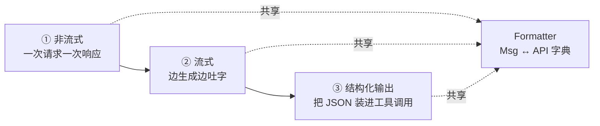
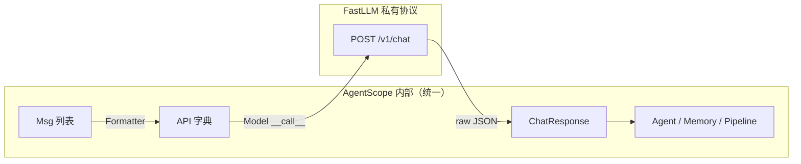
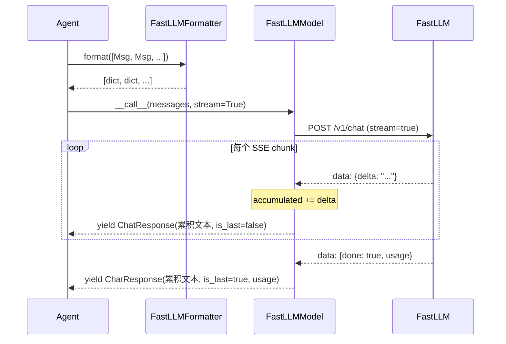

# 第 23 章 造一个新 Model Provider

> 你已经会造 Tool 了——那是给智能体"加手"。这一章我们给智能体"换脑"：把一个新的大模型服务接进 AgentScope。换脑的过程，会让你看清 Model 与 Formatter 这对搭档到底各管什么、消息如何在 Agent 与远端 API 之间流动、流式与结构化输出又是怎么被统一抽象掉的。

> **上一章：[造一个新 Tool](./ch22-new-tool.md)**

---

## 23.1 路线图：从"能跑通"到"成体系"

设想你要接入一个名叫 "FastLLM" 的大模型服务。它的 API 格式既不像 OpenAI，也不像 Anthropic——你没法直接拿现成的适配器套上去。本章我们用三步把它接进来：



第一步让模型"开口说话"，第二步让它"边想边说"，第三步让它"按格式说话"。这三步背后共用同一件翻译工具——Formatter。理解了这个分工，你就理解了 AgentScope 整个 Model 子系统的组织方式。

我们在卷一的[第 6 章（Model 与对话协议）] 里已经讲过 ChatModelBase、Formatter、ChatResponse 这些抽象层"是什么"。这一章要回答的是"怎么扩展它"——即，当你遇到一个框架还没适配的模型供应商时，你需要亲手实现哪两块拼图，它们之间又如何咬合。

---

## 23.2 知识补全：两块拼图和一个返回契约

在动手之前，先把要实现的两个基类的"形状"看清楚。我们不贴源码，只看接口签名——这是你和框架之间的契约。

### 23.2.1 ChatModelBase：唯一一个抽象方法

所有模型适配器都继承自 `ChatModelBase`。它只强迫你实现一个东西：

```python
class ChatModelBase:
    model: str          # 模型名，如 "fastllm-v1"
    stream: bool        # 是否启用流式
    context_size: int   # 上下文窗口大小，供截断使用

    async def __call__(self, *args, **kwargs):
        """唯一抽象方法。返回 ChatResponse 或产生它的异步流。"""
```

就这一个方法。它的妙处在于返回值类型是"双态"的：非流式时直接返回一个 `ChatResponse`；流式时它是一个 `AsyncGenerator`，逐个 `yield` 出 `ChatResponse`。框架下游（Agent 的推理循环）用一个统一的"等结果"逻辑就能同时吃下这两种形态。

> **设计一瞥**：为什么用 `__call__` 而不是叫 `chat` 或 `generate`？
> 因为模型适配器本质上是一个"可调用对象"。Agent 拿到一个 model 实例，像调函数一样 `await model(...)` 就行。这种约定让"模型"在代码里读起来就像一个动词——"去，回答它"。比写 `await model.generate_response(...)` 干净得多。

### 23.2.2 ChatResponse：模型的回答长什么样

模型无论流式还是非流式，吐出来的每一份产出都包成 `ChatResponse`：

```python
@dataclass
class ChatResponse:
    content: Sequence[TextBlock | ToolCallBlock | ThinkingBlock | DataBlock]
    is_last: bool            # 这一份是不是最终结果（流式时区分中间帧）
    id: str                  # 这次调用的唯一 id
    created_at: str          # 时间戳
    type: Literal["chat_response"] = "chat_response"
```

关键在 `content` 这个字段——它是一个**内容块（ContentBlock）序列**，而不是一段裸文本。一段回答里可能既有普通文字（`TextBlock`），也有模型决定要调用的工具（`ToolCallBlock`），还有它内部的思考过程（`ThinkingBlock`），甚至附带的二进制数据（`DataBlock`）。用"块序列"而非"字符串"来建模回答，是 AgentScope 能优雅支持 ReAct、思维链、多模态的根基。

`is_last` 是一个容易忽略但很重要的字段：流式场景下，框架收到一连串 `ChatResponse`，靠它来知道"这条之后没了，可以收尾了"。

### 23.2.3 ChatUsage：记账

```python
@dataclass
class ChatUsage:
    input_tokens: int
    output_tokens: int
    time: float
    cache_creation_input_tokens: int = 0
    cache_input_tokens: int = 0
```

每次调用记下进了多少 token、出了多少 token、花了多久。这两个 cache 字段是给支持提示缓存（prompt caching）的服务用的——Anthropic、DeepSeek 等会把缓存命中和未命中分开报。你可以先全部填 0，等接通缓存再补。

### 23.2.4 FormatterBase：Msg 和 API 字典之间的翻译官

模型适配器只管"打电话"，但打电话前得把 AgentScope 内部的 `Msg` 对象翻成 FastLLM 能懂的 JSON 字典。这件翻译活儿由 Formatter 干：

```python
class FormatterBase:
    input_types: list[str]   # 这个格式器能处理的输入类型（文本/图片/音频...）

    async def format(self, msgs, ...) -> list[dict]:
        """把 Msg 列表翻成 API 期望的消息字典列表。"""
```

`FormatterBase` 还有两个更具体的子类需要你了解：`ChatFormatterBase`（带多智能体场景下的对话轮次整理）和 `TruncatedFormatterBase`（在 `format` 之上加了上下文超长自动截断的能力，要求你额外实现 `_count` 和 `_truncate`）。

> **设计一瞥**：为什么 Model 和 Formatter 要分开？
> 你可能会想："格式转换不就是 Model 自己份内的事吗，何必拆两个类？" 答案在于**复用**：很多模型服务都兼容 OpenAI 协议（DeepSeek、Moonshot、xAI、各种本地部署……）。如果 Formatter 和 Model 绑死，每接入一个兼容服务就得重写一遍格式逻辑。拆开后，一套 `OpenAIChatFormatter` 能喂给所有兼容 OpenAI 协议的 Model——你只需要为协议本身写一次翻译。代价是用户得自己挑"哪对 Model + Formatter 组合"，但卷四的 ModelCard 机制会帮你自动配对。这章我们先手搓，第四章再看自动化。

把这个分工记牢：**Model 管网络往返，Formatter 管语言翻译。** 接下来三步，都是先写 Formatter，再写 Model。

---

## 23.3 第一步：非流式——让模型先开口

### 23.3.1 先约定 FastLLM 的"方言"

要翻译，得先知道目标语言长什么样。假设 FastLLM 的 HTTP 协议长这样：

**请求**（`POST /v1/chat`）：

```json
{
  "model": "fastllm-v1",
  "messages": [{"role": "user", "content": "你好"}],
  "stream": false
}
```

**响应**：

```json
{
  "id": "resp_123",
  "output": {"text": "你好！有什么可以帮你？", "tool_calls": null},
  "usage": {"input_tokens": 5, "output_tokens": 8}
}
```

看起来和 OpenAI 很像，但有两处坑：一是回复的文本不在 `choices[0].message.content`，而在 `output.text`；二是 `usage` 的字段名也略不同。这些"细微差别"就是 Formatter 存在的意义。

### 23.3.2 写 Formatter：把 Msg 翻成 FastLLM 字典

Formatter 的核心活儿，是遍历 Msg 列表，把每条消息的 `content`（可能是字符串，也可能是内容块列表）压成 FastLLM 期望的 `{role, content}` 字典：

```python
async def _format(self, msgs, **kwargs) -> list[dict]:
    result = []
    for msg in msgs:
        # 把 Msg 的 content（可能是 str 或 ContentBlock 列表）压成纯文本
        text = _flatten_to_text(msg.content)
        result.append({"role": msg.role, "content": text})
    return result
```

如果你继承的是 `TruncatedFormatterBase`，还要补两个方法：

| 方法 | 职责 | 类比 |
|------|------|------|
| `_format(msgs)` | Msg 列表 → API 字典列表 | 把中文信翻成英文信 |
| `_count(formatted)` | 估算这批字典占多少 token | 称这封信有几克重 |
| `_truncate(msgs)` | 上下文超长时，删掉最早的非系统消息 | 信箱满了，扔掉最旧的信 |

`_count` 在生产环境应该用真实的 tokenizer（比如 `tiktoken`）；教学阶段先按字符数粗估也行。`_truncate` 的策略通常是"保住最前面的系统提示，从第二条开始往下删"——因为系统提示往往是角色设定，删了智能体就"失忆"了。

### 23.3.3 写 Model：发请求、收响应、装进 ChatResponse

Model 的 `__call__` 在非流式下做三件事：组装 payload、发 HTTP 请求、把返回的 JSON 拆开装进 `ChatResponse`。

```python
async def __call__(self, messages, tools=None, tool_choice=None, **kwargs):
    start = time.time()

    # 1. 组装 payload
    payload = {"model": self.model, "messages": messages, "stream": False}

    # 2. 发请求（httpx / aiohttp，此处略）
    raw = await self._post("/v1/chat", payload)

    # 3. 把 FastLLM 的 JSON 翻译成 AgentScope 的 ChatResponse
    return ChatResponse(
        content=[TextBlock(type="text", text=raw["output"]["text"])],
        is_last=True,
        id=raw["id"],
        usage=ChatUsage(
            input_tokens=raw["usage"]["input_tokens"],
            output_tokens=raw["usage"]["output_tokens"],
            time=time.time() - start,
        ),
    )
```

注意第 3 步——这是 Model 适配器最实质性的工作：**把一个供应商私有的 JSON 形状，规整成 AgentScope 全局通用的 ChatResponse**。一旦封装进 ChatResponse，下游的 Agent、Memory、Pipeline 就再也不用关心"这回答是 FastLLM 还是 OpenAI 给的"了。这就是抽象层的价值：把异质性挡在边界之外。



到这里，非流式的 FastLLM 已经能用了。但它一次才吐一整句——用户得干等。真实的产品几乎都想要"打字机效果"。这就需要第二步。

---

## 23.4 第二步：流式——让模型边想边说

### 23.4.1 SSE：服务端把回答拆成一小片一小片

流式的本质，是服务端不一次给完整答案，而是把答案切成很多片，用 SSE（Server-Sent Events）一片片推过来。FastLLM 的流式响应长这样：

```
data: {"id": "resp_123", "delta": {"text": "你"}, "done": false}
data: {"id": "resp_123", "delta": {"text": "好"}, "done": false}
data: {"id": "resp_123", "delta": {"text": "！"}, "done": true, "usage": {...}}
```

每一片叫一个 **chunk**（增量），关键字段是 `delta`——这一片新增了什么。注意"你""好""！"是分三次到的，**没有任何一片包含完整答案**。

### 23.4.2 流式解析的本质：累积

这是整个流式实现里最关键的一个概念。解析器收到的是碎片，但下游 Agent 需要的是"到目前为止的完整状态"。所以解析器必须**边收边拼**：

```python
async def _stream_call(self, messages, tools):
    start = time.time()
    accumulated = ""          # ← 累积器，记住从开头到现在所有碎片

    async for chunk in self._sse_stream(messages):
        accumulated += chunk["delta"]["text"]    # 把新碎片贴上去

        yield ChatResponse(
            content=[TextBlock(type="text", text=accumulated)],  # 喂的是累积值
            is_last=chunk["done"],
            id=chunk["id"],
            usage=ChatUsage(...) if chunk["done"] else None,
        )
```

读这段代码时，盯住 `accumulated` 这个变量。它是流式解析的"灵魂"：

- 每个 chunk 带来的 `delta.text` 只是**增量**（"好"）；
- 但 `yield` 出去的 `TextBlock.text` 是**累积值**（"你好"）；
- `is_last` 只在最后一个 chunk（`done=true`）时为真，此时才带上完整的 `usage`。

> **为什么 yield 累积值而不是增量？**
> 因为下游消费者（Agent 的 ReAct 循环、Memory 的写入、UI 的渲染）在任何时刻都可能想要"模型现在说到哪儿了"的完整快照，而不是"刚才又多了俩字"。让 Model 负责累积，下游就不用各自维护一份拼装逻辑——这是把复杂度收敛在一处的典型设计。

### 23.4.3 流式 + 非流式合在一个 `__call__` 里

你的 `__call__` 要同时支持两种模式。最常见的写法是按 `self.stream` 分流：

```python
async def __call__(self, messages, tools=None, **kwargs):
    if self.stream:
        return self._stream_call(messages, tools)   # 返回 async generator
    return await self._non_stream_call(messages, tools)  # 返回 ChatResponse
```

注意两种分支的返回方式不一样：流式分支**直接 return 一个 async generator 对象**（不加 `await`，因为你不是要等它跑完，而是要把这个"流"本身交出去）；非流式分支要 `await`，真正等那个完整结果。

工具调用（`ToolCallBlock`）在流式下也要累积——只不过累积的是工具名和参数 JSON 字符串（参数经常跨多个 chunk 才拼完整）。OpenAI 适配器用 `OrderedDict` 按 `index` 累积每个工具调用的 `arguments` 片段，原理和上面的文本累积完全一样。



---

## 23.5 第三步：结构化输出——让模型"按表格填"

很多时候，你不想要一句自由发挥的话，而想要一个**结构化的对象**：从用户话里抽出 `{name, age, interests}`，或者让模型输出一个严格符合 schema 的配置。这就是结构化输出。

### 23.5.1 核心套路：把 JSON Schema 伪装成工具

第 9 章讲过这个想法的原理。这里我们看它在 Model 适配器里怎么落地。诀窍是——**把想要的输出格式包装成一个"工具"，骗模型去"调用"它**：

```python
async def structured_call(self, messages, schema_cls: type[BaseModel]):
    # 1. 把 Pydantic 类变成一个工具定义
    fake_tool = {
        "type": "function",
        "function": {
            "name": "generate_structured_output",
            "description": "Produce the structured response.",
            "parameters": schema_cls.model_json_schema(),
        },
    }

    # 2. 强制模型必须"调用"这个工具（tool_choice="required"）
    resp = await self._non_stream_call(messages, tools=[fake_tool],
                                       tool_choice="required")

    # 3. 从工具调用块里取出参数 —— 那就是 JSON
    return _extract_tool_call_input(resp)
```

模型看到这个"工具"，就乖乖地按 `parameters` 的 schema 填一份参数。它填的参数本质上就是你想要的 JSON。AgentScope 的 ReActAgent 在结束推理时也是用同一招（那个工具叫 `generate_response`），但那是另一层的机制，别和这里的结构化输出工具混了。

### 23.5.2 两条路：原生支持 vs 工具回退

现实里，AgentScope 的 OpenAI 适配器对结构化输出有**两条路径**，新写适配器时也可以参考：

| 路径 | 触发条件 | 做法 | 优点 |
|------|----------|------|------|
| 原生 `response_format` | 端点支持 JSON Schema 格式 | 把 schema 直接塞进请求的 `response_format` 字段 | 模型 SDK 原生保证返回合规 JSON |
| 工具回退 | 端点不支持，或原生路径报 `BadRequestError` | 走上面"伪装成工具"的套路 | 兼容性广，但靠文本解析 |

为什么需要回退？因为不是所有 OpenAI 兼容端点都支持 `response_format: {type: "json_schema"}`——DashScope、DeepSeek 早期版本等就不支持。适配器先用原生路径试，撞墙了再退到工具方案。这种"先试好的，不行再兜底"是写适配器的常见思路。

工具回退里取参数这一步还有个小坑：模型吐的参数 JSON 偶尔会有语法瑕疵（多了个逗号、引号没闭合）。AgentScope 用一个 `_json_loads_with_repair` 工具函数做容错修复，而不是直接 `json.loads` 一炸了之。生产环境的适配器建议复用它。

---

## 23.6 把两块拼图咬合起来：一次完整往返

现在两块拼图都有了，我们用一张表把它们的职责彻底分开，免得写代码时混淆：

| 维度 | Formatter | Model |
|------|-----------|-------|
| 输入 | `list[Msg]`（AgentScope 内部格式） | `list[dict]`（已经翻好的 API 字典） |
| 输出 | `list[dict]`（API 期望的消息格式） | `ChatResponse` 或它的异步流 |
| 关心网络 | 不关心 | 关心（HTTP/SSE/重试） |
| 关心 token | 估算与截断时关心 | 报告实际消耗（ChatUsage） |
| 谁来调用它 | Agent / Model | Agent |

注意一个细节：**Agent 先调 Formatter，拿到字典列表，再把字典喂给 Model**。Formatter 不直接和 Model 说话，Model 也不认识 Msg。两者唯一的交汇点是"字典列表"这个中间产物。这种"通过中间表示解耦"的设计，让你可以随意组合：换 Formatter 不用动 Model，换 Model 也不用动 Formatter。

> **设计一瞥**：中间表示的力量
> 想象 Formatter 是"中文→英文翻译"，Model 是"英文明信片寄送服务"。寄送服务只懂明信片上的英文，完全不知道寄信人原本说的是中文；翻译也完全不管信最后寄到哪儿。两边各司其职，靠"英文明信片"这个中间格式衔接。只要中间格式稳定，两边就能独立演化。

---

## 23.7 写适配器时容易踩的坑

把这一节当成一份"血泪清单"，每条都对应一个真实的、新手常犯的错误：

**坑 1：流式时 yield 增量而不是累积值。**
新手容易想当然地 `yield TextBlock(text=delta)`。结果 Agent 收到的是一堆孤立字符（"你""好""！"），还得自己拼。正确做法是 Model 内部累积，对外始终给完整状态。

**坑 2：忘了填 `is_last`。**
非流式下它必须恒为 `True`；流式下只有最后一帧为 `True`。如果全填 `True` 或全填 `False`，下游的 ReAct 循环会在错误的时候收尾，要么提前停、要么死等。

**坑 3：把 ContentBlock 类型用错。**
`content` 只能装 `TextBlock`/`ToolCallBlock`/`ThinkingBlock`/`DataBlock` 这几种合法块。新人有时会塞个裸 dict 进去，下游序列化就炸了。文本用 `TextBlock`，工具调用用 `ToolCallBlock`，别张冠李戴。

**坑 4：ChatUsage 漏报或乱报。**
`input_tokens`/`output_tokens` 要尽量从 API 返回的真实数据里取，别瞎编。`time` 是从发请求到收完响应的真实耗时。这两个字段下游会被计费、监控、上下文截断逻辑用到。

**坑 5：Formatter 和 Model 写死绑定。**
千万别在 Model 里硬编码"我只配某个 Formatter"。把选择权留给用户或 ModelCard——这样你的 FastLLM 适配器将来能复用任何兼容协议的 Formatter。

**坑 6：结构化输出取 JSON 时不容错。**
模型偶尔吐非法 JSON。直接 `json.loads` 会让整个调用挂掉。用 `_json_loads_with_repair` 之类的容错解析，或者在异常时把原始文本塞进 metadata 让上层处理。

---

## 23.8 一份"接入清单"

提交一个新 Model Provider 时，按这张清单自查，基本不会漏：

- **ChatModelBase 子类**：`__call__` 正确分流流式/非流式，签名带 `tools`、`tool_choice`、`**kwargs`。
- **配套 Formatter**：继承合适的基类（`TruncatedFormatterBase` 最常见），实现 `_format`，并按需补 `_count`/`_truncate`。
- **ChatResponse 构造**：`content` 用合法的 ContentBlock 类型；`is_last`、`id`、`usage` 字段齐全。
- **ChatUsage 准确**：token 数取自 API 真实返回，`time` 反映真实耗时。
- **结构化输出**：支持原生路径就优先走，否则实现工具回退。
- **导出注册**：在 `model/__init__.py` 和 `formatter/__init__.py` 里把新类加进 `__all__`，让它能从包顶层 import。
- **Docstring**：按项目规范（Args/Returns 分段）写好公共方法。
- **测试**：非流式、流式（用 mock）、结构化输出三条线各覆盖一遍。

---

## 检查点

到这里你应该能回答下面几个问题。如果某个答不上来，回去看对应小节。

1. **为什么 Model 只暴露一个 `__call__` 抽象方法，却同时能服务流式和非流式两种调用？**
   提示：想想返回值类型的"双态"——一个方法签名，两种返回语义。

2. **流式解析中，`yield` 出去的 `TextBlock.text` 应该是这一片的增量（"好"），还是到这一片为止的累积值（"你好"）？为什么？**
   提示：站在下游 Agent 的角度想——它在任意时刻想看到什么？

3. **Formatter 和 Model 为什么必须拆成两个类？合并成一个"大 Model"会有什么坏处？**
   提示：考虑"一个 Formatter 喂多个 Model"和"一个 Model 配多个 Formatter"两种复用场景。

4. **结构化输出的"工具回退"路径里，模型到底"调用"了一个什么工具？这个工具和 ReActAgent 结束推理用的工具是同一个吗？**
   提示：工具名不同，一个是 `generate_structured_output`，一个是 `generate_response`，分属不同层。

5. **`is_last` 字段在流式场景下如果一直填 `False` 会发生什么？一直填 `True` 又会怎样？**
   提示：它是下游判断"该收尾了"的唯一信号。

---

## 下一站预告

这一章我们给智能体换了脑——把一个全新的模型服务接进来，并在过程中看清了 Model 与 Formatter 这对搭档的分工：一个管打电话，一个管翻译。下一章，我们给智能体换**记忆**。我们会用 SQLite 实现一个持久化的 Memory Backend，让智能体关机重启之后还记得上次聊到哪儿——这是把"金鱼脑"变成"长记性"的关键一步。

> **下一章：[造一个新 Memory Backend](./ch24-new-memory.md)**
