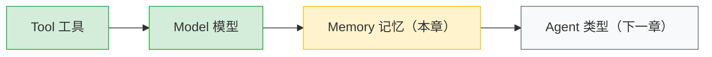
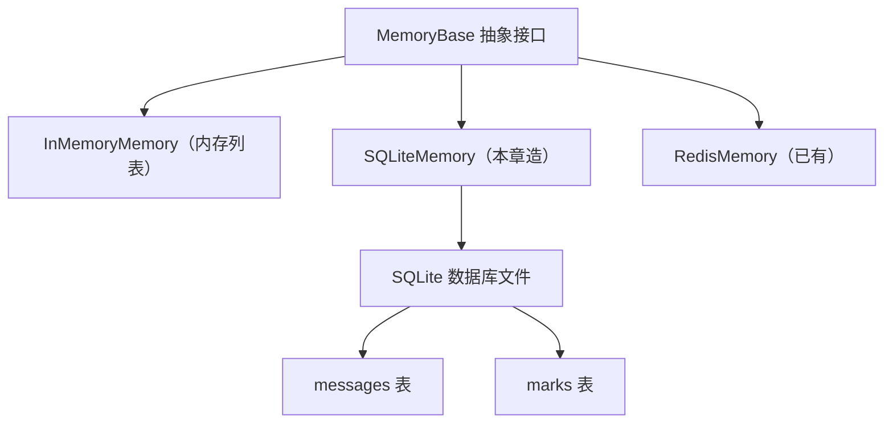
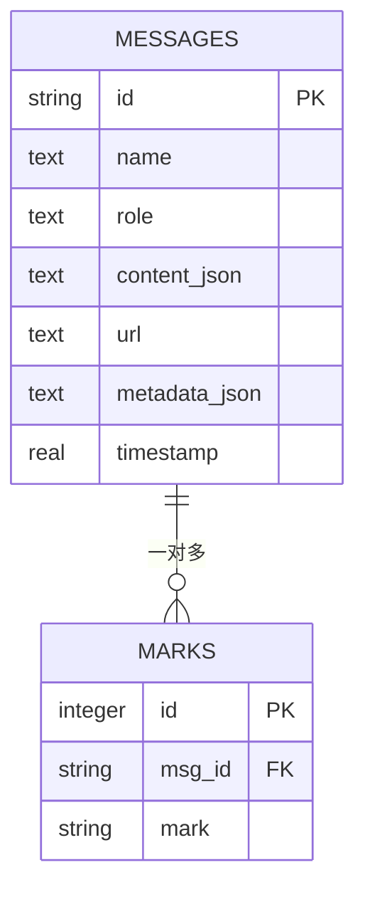
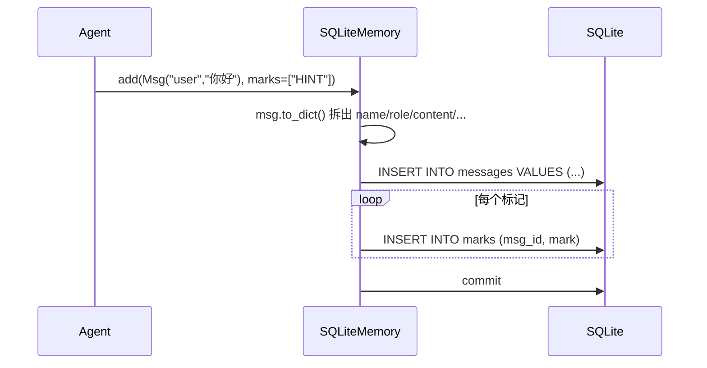
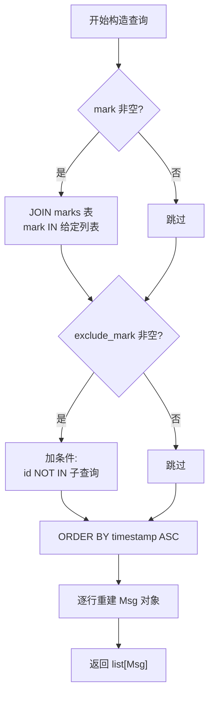
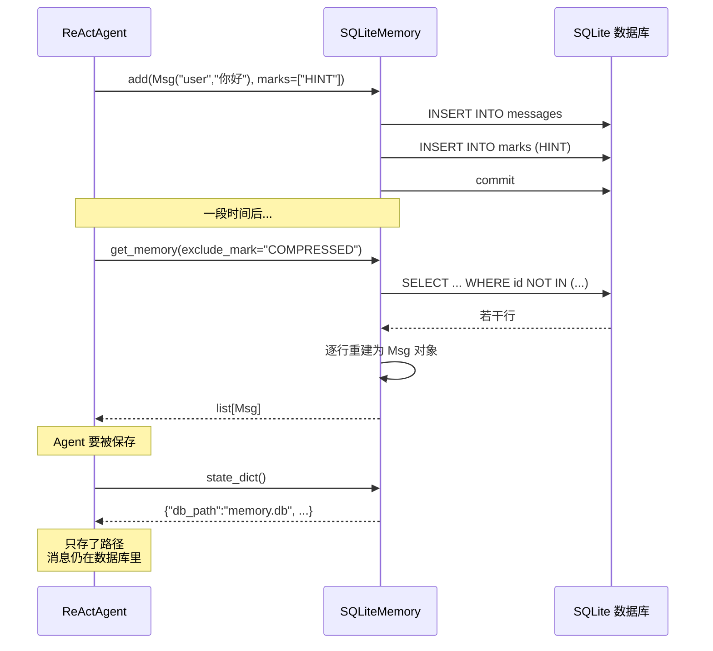

# 第 24 章 造一个新 Memory Backend

Agent 的记忆如果只活在内存里，进程一退出就随风而散。这一章我们走出 `InMemoryMemory`，造一个能把对话持久化到磁盘的 Memory Backend——用 SQLite 当存储。过程中你会看清记忆抽象的真正用意：它把"消息怎么存"和"消息怎么用"彻底解耦。

> Memory 的抽象层是一个承诺：只要你能写进列表里的东西，我就能从任何地方取出来——内存、文件、数据库、远端服务，对上层 Agent 透明。

> **上一章：[造一个新 Model Provider](./ch23-new-model.md)**

## 24.1 路线图

前三章我们造了 Tool（工具）、Model（模型）这两个齿轮，现在轮到 Memory（记忆）。本章的位置：



本章要做的事，可以浓缩成一张图：把"内存里的列表"换成"磁盘上的数据库"，而上层调用者完全无感。



## 24.2 知识补全：记忆抽象到底抽象了什么

在动手之前，先建立两个直觉。

### 一个饭店的类比

把 Agent 想象成一位厨师，Memory 就是厨师的"笔记本"：

- **写入（add）**：每做完一道菜，厨师把心得记到本子上。
- **读取（get_memory）**：下次做菜前，翻一翻本子，看看之前记了什么。
- **删除（delete）**：撕掉几页过时的笔记。
- **标记（mark）**：用红笔给某些心得打星——"重要""已压缩""临时"——需要时只看带星的，或跳过带星的。

`InMemoryMemory` 是一本写在黑板上的本子，厨师下班（进程退出）就擦掉了。`SQLiteMemory` 是一本真正的纸质本子，厨师明天上班翻开还能接着写。Redis 是一台放在公用厨房的云端笔记本，多个厨师能同时翻。

关键在于：**厨师记笔记和翻笔记的动作，不因为本子的材质而改变**。这就是抽象的意义。

### MemoryBase 承诺的五个动作

`MemoryBase` 是一个抽象基类，它定义了一个 Memory 必须会做的事。可以用这张表记住：

| 方法 | 动作 | 饭店类比 |
|---|---|---|
| `add(memories, marks)` | 写入若干消息，可附带标记 | 记一条心得，可打星 |
| `delete(msg_ids)` | 按消息 ID 删除，返回删除数量 | 撕掉指定页 |
| `size()` | 返回消息总数 | 本子有多少页 |
| `clear()` | 清空全部 | 换一本新本子 |
| `get_memory(mark, exclude_mark)` | 按标记过滤后读取 | 只看带星的，或跳过带星的 |

其中 `get_memory` 最有讲究：它接受 `mark`（"我要带这些标记的"）和 `exclude_mark`（"我要不带这些标记的"）两种过滤，这正是 mark 系统的用武之地。

除了这五个"必答题"，还有两个"选答题"：

| 方法 | 默认行为 | 为什么不是必答 |
|---|---|---|
| `delete_by_mark(mark)` | 抛 `NotImplementedError` | 不是所有存储都方便按标记批量删 |
| `update_messages_mark(...)` | 抛 `NotImplementedError` | 批量改标记也是可选能力 |

这里有个精妙的设计区分：**必答题是 `@abstractmethod`，子类不实现就实例化不了；选答题只在运行时才报错**。这样，简单的键值存储可以光明正大地忽略选答题，而不会在导入阶段就崩。抽象基类给的是"最低承诺"，不是"全部能力"。

> **设计一瞥**：`@abstractmethod` vs `raise NotImplementedError`
> 前者是编译期约束——少实现一个方法，类都建不起来；后者是运行期约束——平时不调用，永远不会出错。把核心能力设成 abstract，把增强能力设成可选 + 抛错，是在"严格契约"和"实现自由"之间留出弹性。这是框架抽象的常见手法。

### InMemoryMemory 的参考实现长什么样

在我们造新轮子前，先看现有轮子是怎么转的。`InMemoryMemory` 的内部存储极其朴素——一个列表，每条记录是一个元组：

```python
content: list[tuple[Msg, list[str]]] = []
```

每条记录是 `(消息对象, 标记列表)`。比如一条消息带 `["HINT", "COMPRESSED"]` 两个标记，就表示"这条是提示信息，并且已经被压缩过"。

`add` 是往列表里 append，`get_memory` 是遍历列表按标记过滤，`delete` 是按 ID 移除。一切都在内存里，快但易失。

它的序列化（`state_dict`）也很直白——把整个列表搬出来：

```python
def state_dict(self) -> dict:
    return {
        **super().state_dict(),
        "content": [[msg.to_dict(), marks] for msg, marks in self.content],
    }
```

记住这个细节，后面会看到 `SQLiteMemory` 在序列化上做出了一个截然不同的选择，那正是两者最有趣的分野。

## 24.3 概念一：mark 系统的设计意图

mark（标记）是 Memory 抽象里最容易被新手忽略、却又最核心的机制。它不是普通的"标签"，而是 Memory 自我管理的命脉。

### 为什么需要 mark

考虑两个真实场景：

**场景一：对话压缩。** 一个长对话聊了几百轮，token 数已经爆炸。Memory 需要把旧消息压缩成一段摘要，但**原始消息不能删**——万一用户问起细节还得回看。怎么办？给被压缩过的消息打上 `COMPRESSED` 标记，平时 `get_memory` 用 `exclude_mark="COMPRESSED"` 把它们藏起来，需要时再用 `mark="COMPRESSED"` 单独取出。

**场景二：提示注入。** Memory 里混进了一些系统提示信息（HINT），它们不该参与普通的对话检索，又得随时可取。给它们打上 `HINT`，按需过滤。

mark 让 Memory 能"在同一份存储里维持多个视图"——这正是 mark 系统的设计意图。

### mark 在两种存储里的形态对比

| 存储方式 | mark 的物理形态 | 过滤方式 |
|---|---|---|
| `InMemoryMemory` | 每条消息附带一个 `list[str]` | Python 列表推导，逐条判断 |
| `SQLiteMemory`（本章） | 独立的 `marks` 表，外键关联消息 | SQL 的 `JOIN` 和 `NOT IN` 子查询 |

形态不同，但语义一致：上层 Agent 永远只调 `get_memory(mark=..., exclude_mark=...)`，不关心底下是列表还是表。这就是抽象的回报。

## 24.4 概念二：SQLite 的表结构如何映射 Memory

把"消息 + 标记"这套语义塞进关系数据库，需要设计两张表。这是整个 Backend 设计里最关键的一步。

### 表设计



**messages 表**存消息本身。其中 `content_json` 是个值得展开的字段——`Msg.content` 既可能是纯字符串（如 `"你好"`），也可能是内容块列表（如多个 `TextBlock`、`ToolUseBlock`）。因为它类型不固定，所以序列化成 JSON 文本存进去，读出时再反序列化。这是"把半结构化数据塞进关系列"的常见手法。

**marks 表**存标记关系。一条消息可以有多少个标记，所以是"一对多"——用外键 `msg_id` 关联回 messages 表。给 `msg_id` 和 `mark` 各建一个索引，是因为查询时既会"按消息找标记"也会"按标记找消息"，两个方向都要快。

### 为什么不把 marks 塞进 messages 表的一列

一个诱人的偷懒方案是：在 messages 表加一列 `marks_json`，存成 `["HINT","COMPRESSED"]`。为什么不这么做？

**查询效率**。当 Agent 说"给我所有不带 COMPRESSED 标记的消息"，如果 marks 是 JSON 列，每条消息都得反序列化再判断；用独立的 marks 表，一句 `id NOT IN (SELECT msg_id FROM marks WHERE mark='COMPRESSED')` 就交给数据库引擎优化了。数据量一上来，差距立现。

**更新效率**。给一条消息加标记，独立表只需 `INSERT` 一行；JSON 列得读出整条消息、改 JSON、再写回。

这就是为什么 mark 值得有自己的表。设计存储时，"关系型数据的关联"和"文档型数据的内嵌"是两种思路，选哪种取决于**你会怎么查、怎么改**。

## 24.5 概念三：六个方法的职责与数据流

有了表结构，MemoryBase 的五个必答题加一个选答题，每一个都对应一种 SQL 操作。我们不逐行读实现，而是用一张表把"职责 → SQL 形态 → 数据流"讲透。

| 方法 | 核心职责 | SQL 形态 | Msg 的来回 |
|---|---|---|---|
| `add` | 写入消息并附标记 | `INSERT` messages + `INSERT` marks | 入参 Msg → 拆字段入表 |
| `get_memory` | 按标记过滤读取 | `SELECT ... JOIN/WHERE` | 出库行 → 重建 Msg |
| `delete` | 按 ID 删消息（连带标记） | `DELETE FROM marks` + `DELETE FROM messages` | 只关心数量 |
| `delete_by_mark` | 按标记批量删 | `SELECT msg_id` 再调 `delete` | 委托给 delete |
| `size` | 数总数 | `SELECT COUNT(*)` | 返回整数 |
| `clear` | 清空 | `DELETE` 全表 | 无 |

`add` 的数据流值得用一张时序图看清——它涉及"把 Msg 拆成字段"和"循环写标记"两个动作：



`get_memory` 是反方向——把数据库的行重新拼装回 Msg 对象。难点不在 SQL，而在"按标记过滤"的 SQL 拼装逻辑，可以分两支看：



两个分支可以同时存在——既"只要带某标记的"又"排除带另一标记的"。SQL 的拼装就是个条件累加的过程：有 mark 就加 JOIN，有 exclude_mark 就加 NOT IN 子查询，最后都凑到 WHERE 子句里。这是关系数据库过滤的典型写法。

`delete_by_mark` 这个选答题的实现有个优雅之处：**它复用 `delete`**。先查出某个标记下所有 `msg_id`，再把这批 ID 交给 `delete` 去真正删除。不要小看这个复用——它让"按 ID 删"和"按标记删"共享同一套连带删除逻辑（删消息时连带删它在 marks 表的记录），避免了两处代码各写一遍、日后改一处忘一处。

## 24.6 概念四：序列化的根本分野

现在来到本章最有思想性的一节。前面我们看到 `InMemoryMemory` 的 `state_dict` 把整个 `content` 列表都搬出来。那 `SQLiteMemory` 呢？

**它只保存一个数据库路径。**

```python
def state_dict(self) -> dict:
    return {
        "db_path": self.db_path,
        "_compressed_summary": self._compressed_summary,
    }
```

恢复时也不需要把数据搬回来——重新连上同一个数据库文件就行：

```python
def load_state_dict(self, state_dict, strict=True) -> None:
    self.db_path = state_dict.get("db_path", self.db_path)
    self._compressed_summary = state_dict.get("_compressed_summary", "")
    self._init_db()
```

这是两种存储范式的根本差异，值得用一张表对比：

| 维度 | InMemoryMemory | SQLiteMemory |
|---|---|---|
| 数据住哪 | 进程内存 | 磁盘文件 |
| 序列化要搬什么 | 搬全部消息 | 只搬一个文件路径 |
| 序列化体积 | 与消息数成正比 | 常数 |
| 恢复方式 | 把 dict 里的消息塞回列表 | 重新连上同一个数据库 |
| 进程重启后 | 数据丢失（除非已序列化） | 数据天然还在 |

> **设计一瞥**：序列化的"搬什么"由存储介质决定
> 内存的本质是易失——进程一退出，数据就没了，所以序列化必须把数据本身搬出去，否则找不回来。磁盘和远端服务的本质是持久——数据天然在那里，序列化只需要记住"去哪找"。这是存储抽象里一条普适的规律：序列化的体积，反比于存储介质的持久性。

理解这一点，你就能举一反三：如果将来要造一个 `S3Memory`（消息存到对象存储），它的 `state_dict` 也只需要保存 bucket 名和前缀；如果造一个 `VectorMemory`（带向量的记忆），需要保存的是向量库的连接信息。**记忆本身在哪儿，序列化就指向哪儿。**

### `_compressed_summary` 是什么

`state_dict` 里那个 `_compressed_summary` 不是我们造的，它是 `MemoryBase` 在初始化时通过 `register_state` 注册的一个属性——用来存放长对话被压缩后的摘要文本。任何 Memory 子类都得在序列化时保留它，否则压缩功能就丢了。这个细节提醒我们：**覆盖父类方法时，别漏掉父类已经管理的状态。**

## 24.7 概念五：与现有 Backend 的横向对比

AgentScope 已经自带了 `InMemoryMemory` 和 `RedisMemory`。我们造的 `SQLiteMemory` 该摆在什么位置？三种存储各有适用场景：

| 维度 | InMemoryMemory | SQLiteMemory | RedisMemory |
|---|---|---|---|
| 依赖 | 无 | 无（Python 自带） | 要装 Redis 服务 |
| 持久化 | 否（重启丢） | 是（.db 文件） | 是（看配置） |
| 并发 | 单进程 | 单进程为主（写锁限制） | 多进程高并发 |
| 性能 | 最快 | 中等（磁盘 IO） | 快（内存+网络） |
| 部署难度 | 零 | 零 | 中 |
| 适用 | 测试、临时 | 开发、小规模、嵌入式 | 生产、多实例 |

`MemoryBase` 的抽象让你可以在三者之间无缝切换——上层代码只调用 `add`/`get_memory`，不关心底层存储。一个 ReActAgent 今天用 `InMemoryMemory`，明天换 `SQLiteMemory`，后天换 `RedisMemory`，业务代码一行都不用改。这就是抽象层最大的价值：**它把"换存储"从一次大重构降级成一次配置改动。**

### 什么叫"行为一致"

要让新 Backend 真正可替换，光实现方法还不够，行为得和 `InMemoryMemory` 对齐。所谓"对齐"，是指同一组操作在两种存储上产生同样的可观察结果：

- 写入 5 条消息后，两者的 `size()` 都返回 5。
- 用相同的 `mark`/`exclude_mark` 过滤，两者返回的消息集合相同。
- 删除同一条消息后，两者都不再返回它。

这是契约的另一半——**接口对齐 + 行为对齐**才等于可替换。验证方法叫"对偶测试"（parity test）：用同一组输入分别跑两个实现，断言输出一致。这种测试在造抽象的替代实现时极其有用，能抓住那些"看起来实现了但其实语义偏了"的 bug。

## 24.8 把零件组装起来：一次完整的调用

最后用一张完整时序图把所有概念串起来，看看一个 Agent 用上 `SQLiteMemory` 后，一次"写入 + 读取 + 序列化"的完整旅程：



注意最后一步：`state_dict()` 返回的字典里**没有消息内容**，只有数据库路径。等这个 Agent 从磁盘恢复时，重新连上 `memory.db`，所有对话历史原封不动地在原地等它。这就是持久化 Memory 的全部魔法——它不是把记忆搬来搬去，而是让记忆待在该待的地方。

## 检查点

到这里，你应该能回答下面几个理解性问题。

**1. mark 系统解决的是什么问题？为什么不能简单地"把旧消息删掉"？**

mark 是 Memory 在同一份存储里维持多个视图的手段。比如压缩后的旧消息不能真删——用户问细节时还得回看——但日常检索又不想让它们出现。mark 让你"既保留又隐藏"。直接删除会丢失信息，无法回溯。

**2. 为什么 marks 要单独建一张表，而不是塞进 messages 表的一个 JSON 列？**

两个原因。查询效率：按标记过滤时，独立表能用 `JOIN` 和 `NOT IN` 子查询交给数据库优化，JSON 列得逐行反序列化。更新效率：加标记时独立表只需 INSERT 一行，JSON 列得读改写。选哪种存储形态，取决于"怎么查、怎么改"。

**3. `SQLiteMemory.state_dict()` 为什么只保存数据库路径，而不保存消息？**

因为数据本身已经持久化在磁盘上了，序列化只需要记住"去哪找"。这是持久化存储相比内存存储的根本优势——序列化体积是常数，与消息数量无关。内存存储则必须搬出全部数据，否则进程退出就丢了。

**4. `delete_by_mark` 为什么不是抽象方法（`@abstractmethod`），而是一个抛 `NotImplementedError` 的普通方法？**

抽象方法强制子类实现，否则无法实例化；普通方法允许子类不实现，只在被调用时才报错。mark 批量删除是"可选能力"——简单的键值存储可能根本不方便按标记删，让它们能安全忽略这个方法，比强制实现更合理。这是框架在"严格契约"和"实现自由"之间留弹性。

**5. 如果要让 `SQLiteMemory` 替换一个生产中的 `RedisMemory`，需要保证什么？**

接口对齐（实现 MemoryBase 全部必答方法）+ 行为对齐（同一组操作产生同样的可观察结果）。验证方式是对偶测试：用同一组输入跑两种实现，断言输出一致。两者都对齐了，业务代码才能零改动切换。

## 下一站预告

我们依次造了 Tool（工具）、Model（模型）、Memory（记忆）三个齿轮。它们各自独立，但要真正组合成一个有性格的 Agent，还需要最后一块——一个**新的 Agent 类型**来调度它们。下一章我们造最复杂的一个：一个 Plan-Execute Agent，让模型先做计划再执行，看看 ReAct 之外另一种推理范式长什么样。

> **下一章：[造一个新 Agent 类型](./ch25-new-agent.md)**
