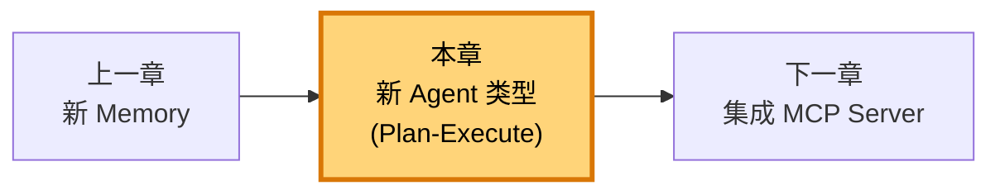
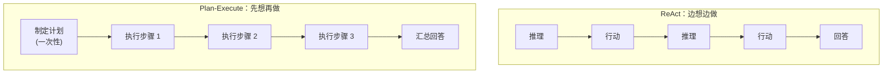
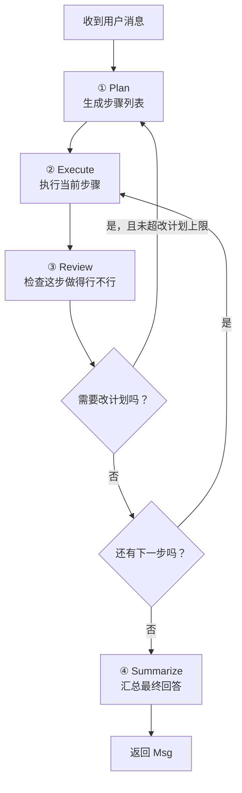
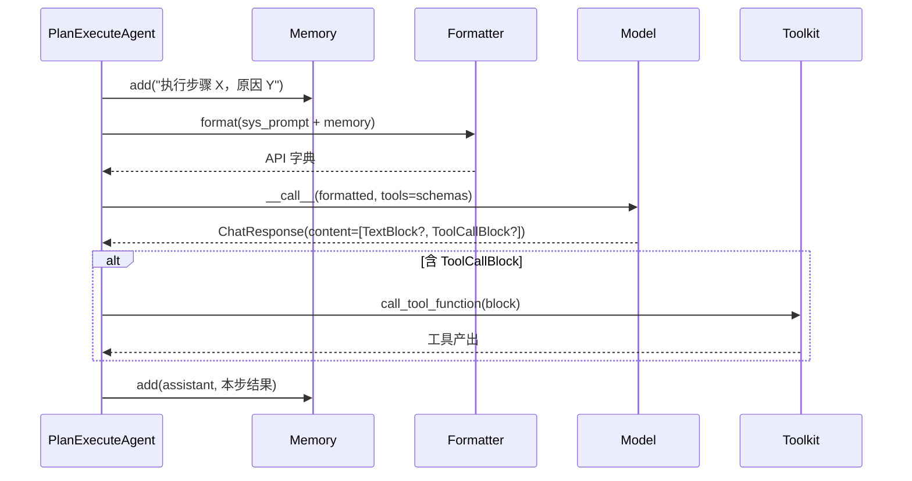

# 第 25 章 造一个新 Agent 类型

你已经会造 Tool、Model、Memory 了——它们分别是给智能体的"手""脑""记性"。但前面三章造的都是**零件**，零件还得装进一台机器里才能干活。这台机器，就是 Agent 本身。这一章，我们不再扩展零件，而是造一种**新机器**：一个 Plan-Execute Agent。

> AgentScope 把 ReAct 当作"出厂标配"——但它从不假定 ReAct 是唯一的思考方式。当你想换一种思考的节奏时，你要做的是造一个新 Agent 类型，而不是把 ReAct 改得面目全非。

> **上一章：[造一个新 Memory Backend](./ch24-new-memory.md)**

---

## 25.1 路线图：从"用现成的 Agent"到"造一种新节奏"

ReAct Agent 的思考节奏是固定的：**想一步、做一步、再想一步**。这种"边想边做"对付大多数任务都够用，但有一类任务它会露怯——那种**先得把整体计划想清楚，动手才不返工**的复杂活儿。

设想你要做一个"调研助手"：用户问"帮我对比一下三家云厂商的向量数据库定价"。ReAct 会怎么干？它可能搜一下 A 厂商，搜一下 B 厂商，搜到一半发现忘了查某个维度，又回头补——三步并作五步走，中间反复横跳。而一个有经验的调研员不会这么干：他会先列出"我要查哪几家、每个查哪几个维度、最后怎么汇总"，按表逐项填，最后一次性出报告。

后一种节奏，就是 **Plan-Execute（先规划再执行）**。本章我们要造一个这种节奏的 Agent：



本章做三件事：第一，看清楚"造一个新 Agent 类型"到底要实现什么（答案出乎意料地少）；第二，把 Plan-Execute 的节奏拆成 Plan / Execute / Review / Summarize 四拍，用示意片段讲清每一拍该做什么、为什么这么组织；第三，回头对比 Plan-Execute 与 ReAct 这两种节奏的取舍，让你以后能自己判断"这个任务该用哪种 Agent"。

---

## 25.2 知识补全：AgentBase 到底要你实现什么

造一台新机器，第一步永远是搞清楚它的"出厂接口"——你装上什么零件、拧紧哪几颗螺丝，这台机器就能被框架当成"一个 Agent"来用。AgentScope 里这个接口叫 `AgentBase`。

### 25.2.1 只有一个方法是你非写不可的

`AgentBase` 给所有 Agent 立了一条规矩：你必须告诉我，当一条消息递到你面前时，你要怎么回。这个规矩落在一个叫 `reply` 的方法上：

```python
class AgentBase:
    async def reply(self, msg: Msg | list[Msg] | None = None, **kwargs) -> Msg:
        """子类必须覆盖：收到消息后，返回一条回复。"""
        raise NotImplementedError
```

`reply` 不是用 `@abstractmethod` 标注的——它直接 `raise NotImplementedError`。效果是一样的：子类不覆盖它，框架就让你跑不起来。但用 `raise` 而非抽象装饰器有一个好处：你可以**临时**实例化一个 `AgentBase` 子类去做别的事（比如拿它当基类探测），不至于被元类拦在门口。

`reply` 收一条 `Msg`（或一组），回一条 `Msg`。就这么简单。Agent 的全部"个性"——它是 ReAct 还是 Plan-Execute、它用什么模型、它带不带工具、它记不记历史——全都藏在这个方法的实现里。

### 25.2.2 你不用碰的那个入口：__call__

有人会问：调用 Agent 不都是写 `await agent(some_msg)` 吗？这个 `agent(...)` 走的是哪个方法？答案是 `__call__`，而**它你不用碰**。

```python
class AgentBase:
    async def __call__(self, *args, **kwargs) -> Msg:
        """入口：跑 pre-reply 钩子 → 调 reply → 跑 post-reply 钩子
        → 处理中断 → 把回复广播给订阅者。"""
```

`__call__` 是"前台"，`reply` 是"业务部门"。前台负责排场——进门前签到（pre-reply 钩子）、出门后整理（post-reply 钩子）、遇到突发情况拦一下（中断处理）、出门后还要把你的话传给所有盯着你的人（发布订阅）。这些"排场"对所有 Agent 都一样，所以框架把它们焊死在 `__call__` 里，你只管把业务写进 `reply`。

> **设计一瞥**：这种"骨架方法 + 业务钩子"的切法，是面向对象设计里**模板方法模式（Template Method）**的经典做法。父类把控整体流程（钩子、广播、中断），子类只填最核心的那一步。卷二的[第 15 章（元类与 Hook）]详细讲过这套机制——这里你只要记住一条：**写 Agent = 写 `reply`，其余白送。**

### 25.2.3 中间层 ReActAgentBase：可选，不是必经

在 `AgentBase` 和最常用的 `ReActAgent` 之间，还夹着一层 `ReActAgentBase`。它把"推理-行动"这对动作抽象成两个骨架方法 `_reasoning` 和 `_acting`，并统一管理 `model`、`formatter`、`toolkit`、`memory` 这几个属性。

听起来很贴心——但注意，它是**为 ReAct 节奏量身定做的**。它的循环骨架长成"推理 → 行动 → 推理 → 行动"的交错结构。如果你要造的 Agent 节奏跟 ReAct 不一样（比如本章的 Plan-Execute 是"先计划、再执行"的分离结构），硬套这层骨架只会让你跟它的假设打架，代码越写越拧。

所以本章的 PlanExecuteAgent 我们**直接继承 `AgentBase`**。代价是 `model`/`formatter`/`memory` 这些属性得自己在 `__init__` 里收一下；换来的，是对循环结构的**完全掌控**。这是"继承现成骨架"和"自己拼零件"之间的经典权衡，卷四的架构篇会再聊。

### 25.2.4 框架里已有的 Agent 类型

写新类型前，先看一眼货架上已经有什么，免得重复造轮子。`src/agentscope/agent/` 目录下：

| 文件 | Agent 类型 | 它的节奏 |
|------|-----------|---------|
| `_agent_base.py` | `AgentBase` | 所有 Agent 的根，只定 `reply` 契约 |
| `_react_agent.py` | `ReActAgent` | 推理-行动交错，边想边做 |
| `_user_agent.py` | `UserAgent` | 把人类输入包成 Agent，给对话凑人 |
| `_a2a_agent.py` | `A2AAgent` | 跨进程的 Agent-to-Agent 协议端点 |
| `_realtime_agent.py` | `RealtimeAgent` | 实时语音，低延迟流式 |

我们的 PlanExecuteAgent 跟它们都不一样，确实有理由单开一类。

---

## 25.3 设计方案：Plan-Execute 是一种什么节奏

在写任何代码之前，先用一张图把 Plan-Execute 和 ReAct 这两种节奏并排摆开。理解了节奏，实现就是顺着节奏填空。

### 25.3.1 两种节奏对照



关键差别在**计划与执行的耦合方式**上：

- ReAct 是**交错**的——每一步行动都基于上一步行动的结果即时推理，计划藏在脑子里、边走边改。
- Plan-Execute 是**分离**的——先把整张计划摊在桌上，再逐项执行，必要时回头改计划，但"规划"和"执行"是两段独立的对话。

打个比方：ReAct 像一个人**边查菜谱边做菜**，看到冰箱里少了一味料临时改菜单；Plan-Execute 像一个人**先写完整张采购清单再去超市**，到了超市才发现缺货才会回来改清单。前者灵活、响应快，后者更有全局感、不容易漏项。

### 25.3.2 Plan-Execute 的四拍

我们把 Plan-Execute 拆成四个阶段，每一拍都是对模型的一次独立调用：



四拍各自的职责：

| 拍 | 做什么 | 调工具吗 | 输出 |
|----|--------|---------|------|
| ① Plan | 把任务拆成有序步骤，每步说明"做什么、用什么工具、为什么" | 否 | 一份结构化计划 |
| ② Execute | 按计划执行**当前**这一步，可调工具、可读历史 | **是** | 这一步的产出 |
| ③ Review | 评估这步的产出，判断计划要不要回头改 | 否 | "满意吗 / 要改吗 / 为什么" |
| ④ Summarize | 所有步骤跑完，把结果汇成给用户的最终回答 | 视情况 | 一条 `Msg` |

这里有两个值得专门点出的设计决定：

**第一，只有 Execute 拍调工具。** Plan 和 Review 都是"纯思考"——Plan 在脑子里排步骤，Review 在脑子里打分，都不该有副作用。这把"决策"和"行动"严格隔开，避免模型在规划阶段手痒去调一个还没想清楚的接口。

**第二，Review 之后允许回头改计划，但有上限。** 完全不让改计划，等于把 Plan-Execute 退化成"固执的计划表"，遇到意外就只能硬撑；完全放开改，又可能陷入"改计划—执行—再改计划"的死循环。我们引入一个 `max_plan_revisions`（默认 3 次）做闸门，给修正留余地，给兜底设边界。

### 25.3.3 类的形状

把上面的节奏翻译成类的字段，是这样：

```python
class PlanExecuteAgent(AgentBase):
    """Plan-Execute 节奏的 Agent。"""

    name: str                  # 继承自 AgentBase
    sys_prompt: str            # 系统提示，给每一拍定基调
    model: ChatModelBase       # 四拍都用同一个模型
    formatter: FormatterBase   # Msg → 模型 API 的翻译
    toolkit: Toolkit | None    # 仅 Execute 拍会用到
    memory: MemoryBase         # 跨拍保留对话历史

    max_plan_revisions: int    # 改计划次数的上限
    _plan: list[dict]          # 当前计划（每项含 step/tool/reason）
    _current_step: int         # 执行到第几步
    _results: list[dict]       # 每步的执行产出
```

注意三个内部状态 `_plan` / `_current_step` / `_results`——它们是 Plan-Execute 这种**有阶段、有进度**的节奏特有的。ReAct Agent 不需要它们，因为 ReAct 没有显式的"计划表"。状态字段的存在，本身就是节奏差异的指纹。

> **设计一瞥**：把"计划"显式存成 `_plan` 这个字段，而不是让它只活在对话历史里，是一个有意识的选择。显式存储意味着 Plan、Execute、Review 三拍可以随时读到"我现在执行到第几步、这一步原本打算干什么"，而不必从一堆对话消息里反推。这叫**把隐式状态显式化**——一个让你 agent 更可控、更可调试的小技巧。

---

## 25.4 reply：把四拍串成一个循环

`reply` 是整个 Agent 的灵魂。它要把"收消息 → Plan → 循环(Execute → Review) → Summarize → 回消息"串起来。我们用伪代码骨架看清它的形状：

```python
async def reply(self, msg=None, **kwargs) -> Msg:
    # 0. 把用户消息记进记忆
    for m in ([msg] if isinstance(msg, Msg) else (msg or [])):
        await self.memory.add(m)

    # 1. Plan 拍：拿到一份初始计划
    self._plan = await self._plan_phase()
    self._current_step, self._results, revisions = 0, [], 0

    # 2. Execute + Review 循环
    while self._current_step < len(self._plan):
        step_result = await self._execute_step(self._plan[self._current_step])
        self._results.append(step_result)

        review = await self._review_phase()
        if review["needs_revision"] and revisions < self.max_plan_revisions:
            self._plan = await self._plan_phase(is_revision=True)  # 回头改计划
            revisions += 1
        else:
            self._current_step += 1                                # 推进到下一步

    # 3. Summarize 拍
    return await self._summarize_results()
```

读这段骨架，注意三个"接缝"是怎么缝的：

- **记忆的接缝**：每拍调模型前，相关上下文都先进 `memory`，再由 `formatter` 把 `sys_prompt` 和记忆一起翻译成模型 API 要的格式。这保证四拍看到的是**同一份不断增长的对话历史**，而不是各自为政。
- **循环的接缝**：Review 的判定决定了"回头改计划"还是"推进下一步"。`revisions` 计数器配合 `max_plan_revisions` 防止改计划失控。
- **状态的接缝**：`_current_step` 和 `_results` 在循环里被读、也被写——它们让每一步都能知道"我前面做了什么、轮到我了吗"。

下面三节，我们逐拍拆开看。

---

## 25.5 Plan 拍：把任务摊成一张清单

Plan 拍的职责只有一个：把一个可能含糊的用户请求，翻译成一份**机器可读、有顺序**的步骤清单。它的输出必须是结构化的，否则后续 Execute 拍没法按字段取值。

### 25.5.1 提示模型输出结构化计划

我们让模型把计划输出成一个 JSON 数组，每个元素描述一步：

```json
[
  {"step": "搜索 A 厂商向量数据库的定价页",   "tool": "search_web", "reason": "需要拿到原始定价"},
  {"step": "提取 A 厂商的按量计费单价",       "tool": "read_page",  "reason": "对比需要归一化指标"},
  {"step": "对 B、C 厂商重复以上两步",         "tool": "search_web", "reason": "保证三家口径一致"},
  {"step": "生成一张横向对比表",               "tool": "make_table", "reason": "用户要的是可读结论"}
]
```

每步三个字段——`step`（干什么）、`tool`（用什么工具）、`reason`（为什么）。`reason` 看似多余，其实很有用：它强迫模型在规划阶段就把"这一步的价值"讲清楚，能在 Review 拍作为"这一步到底值不值得做"的判据。

### 25.5.2 提示词与调用形态

Plan 拍往记忆里塞一条系统消息，描述要它干什么、按什么格式输出，然后走标准的"formatter.format → model(...)"流程：

```python
async def _plan_phase(self, is_revision: bool = False) -> list[dict]:
    if is_revision:
        prompt = "根据已完成的步骤结果，修正剩余计划。已完成：{self._results}"
    else:
        prompt = "把用户请求拆成有序步骤，每步含 step/tool/reason，输出 JSON 数组。"

    await self.memory.add(Msg("system", prompt, "system"))
    formatted = await self.formatter.format([
        Msg("system", self.sys_prompt, "system"),
        *await self.memory.get_memory(),
    ])
    response = await self.model(formatted, tools=...)   # Plan 拍其实可以不传 tools
    plan = self._extract_json_array(response)
    await self.memory.add(Msg("assistant", plan_text, "assistant"))  # 让后续拍能看到
    return plan
```

注意最后一行：模型吐出的计划文本，**也要写回记忆**。这样 Execute 拍调模型时，模型能在历史里读到"我之前定的计划是什么"，从而知道当前这一步的来龙去脉。

### 25.5.3 从自由文本里挖出 JSON：一个绕不开的小麻烦

LLM 不会老老实实只吐 JSON——它经常在前后加一堆"好的，这是您的计划："之类的客套话。于是你需要从一段自由文本里**挖出**那段 JSON。一个简单可靠的做法是在文本里找第一个 `[` 和最后一个 `]`，把中间这段切出来再解析：

```python
def _extract_json_array(self, response) -> list[dict]:
    text = "".join(b["text"] for b in response.content if b.get("type") == "text")
    start, end = text.find("["), text.rfind("]")
    try:
        return json.loads(text[start:end+1]) if start >= 0 < end else [...]
    except json.JSONDecodeError:
        return [{"step": text, "tool": None, "reason": "直接回答"}]  # 兜底
```

这个"挖 JSON"的模式在 Agent 开发里反复出现——结构化输出永远在和模型的"话痨倾向"作斗争。严肃项目里你会想用**原生结构化输出**（如 OpenAI 的 `response_format` 或工具调用强约束），让模型直接吐 JSON 而非自由文本；这里用文本挖取，只是为了把注意力放在 Agent 的节奏上，而不是输出协议上。

> **设计一瞥**：兜底那行 `return [{"step": text, ...}]` 不是凑数。它表达一种态度：**当模型不按格式出牌时，Agent 不应该崩，而应该降级**。把整段文本当成"唯一的一步"，相当于把 Plan-Execute 临时退化成"直接回答"——能用总比报错强。第 24 章造 Memory 时我们见过同样的"优雅降级"哲学，这里再出现一次，它是 AgentScope 一以贯之的设计味道。

---

## 25.6 Execute 拍：按表执行，可能有副作用

Execute 拍是唯一真正"动手"的拍。它按 `_plan[_current_step]` 这一项干活，干活的过程可能调工具。

### 25.6.1 一次 Execute 的数据流



读这张时序图，关键是看到**两种内容块的不同处理**：

- `TextBlock`：模型用文字描述这一步的思考或结论，直接拼进结果文本。
- `ToolCallBlock`：模型决定调一个工具——这时候 Agent 要**真的去调**，把工具的产出并入这一步的结果。

这正是 ContentBlock 序列建模的威力：一个模型回答可以同时含"我说"和"我做"，Agent 只需遍历内容块、按类型分发。

### 25.6.2 调用工具的标准形态

调工具的代码骨架，跟第 22 章造 Tool 时讲过的一致：

```python
for block in response.content:
    if block.get("type") == "text":
        result_text += block["text"]
    elif block.get("type") == "tool_use":
        async for chunk in self.toolkit.call_tool_function(block):
            for c in chunk.content:
                tool_results.append(c.get("text", ""))
```

两个细节值得停一下：第一，`call_tool_function` 是个**异步生成器**，工具产出可能分多块回来（比如流式搜索结果），所以用 `async for` 收；第二，工具调用的产出要并进这一步的 `result_text`，再随这条 assistant 消息写回记忆，让 Review 拍能"读到工具回了什么"。

### 25.6.3 为什么不在 Execute 里改 _current_step

注意 Execute 拍本身**不负责推进指针**——它只产出这一步的结果。指针的推进（`_current_step += 1`）或回头（重新 Plan）由 Review 拍的判定来决定。这又是一个"决策与行动分离"的小动作：Execute 只管埋头干，回头还是前进交给 Review 判。让一个方法只干一件事，循环的逻辑才读得清。

---

## 25.7 Review 拍：给这一步打分

Review 拍在每步执行后跑一次。它读这一步的产出，回答两个问题：这步做得行不行？要不要回头改计划？同样要求模型吐结构化输出：

```json
{"satisfied": true, "needs_revision": false, "reason": "已拿到 A 厂商完整定价表"}
```

`satisfied` 是给当前步打分，`needs_revision` 是对**后续计划**表态——这两件事是分开的：当前步可能做得不错，但暴露出"后面三步其实没必要做"，这时候 `satisfied=true` 但 `needs_revision=true`。

```python
async def _review_phase(self) -> dict:
    prompt = (
        f"检查步骤「{self._plan[self._current_step]['step']}」的结果：\n"
        f"{self._results[-1]['result']}\n"
        '以 JSON 回答 {"satisfied":bool, "needs_revision":bool, "reason":"..."}'
    )
    await self.memory.add(Msg("system", prompt, "system"))
    response = await self.model(await self.formatter.format([...]))
    return self._extract_json_object(response)  # 同样有兜底
```

Review 不调工具，因为它只评估、不行动。这一拍的存在让 Plan-Execute 比 ReAct 多了一份**自我监督**：每一步都有人（其实是同一个模型的另一次调用）在旁边打分，发现走偏了能及时回头。

> **设计一瞥**：让"做事的模型"和"评审的模型"是同一次模型调用的不同轮次，而非两个不同的模型实例——这是工程上的妥协。理想做法是用一个**更强的模型**来当评审（甚至是规则引擎、人类反馈），但本章为了把焦点放在节奏上，用同一模型分饰两角。真到生产里，把 Review 拍换成更强的模型，往往是提升整体质量性价比最高的一步。

---

## 25.8 Summarize 拍：收口成一句话

所有步骤跑完，用户要的不是一堆分步结果，而是一份**成形的回答**。Summarize 拍把 `_results` 里每一步的产出聚起来，让模型基于这份"成果汇编"给出最终回复：

```python
async def _summarize_results(self) -> Msg:
    digest = "\n".join(f"- {r['step']['step']}: {r['result']}" for r in self._results)
    prompt = f"所有步骤已执行完毕，结果如下：\n{digest}\n请给出最终回答。"
    formatted = await self.formatter.format([
        Msg("system", self.sys_prompt, "system"),
        Msg("user", prompt, "user"),
    ])
    response = await self.model(formatted)
    text = "".join(b["text"] for b in response.content if b.get("type") == "text")
    final = Msg(self.name, text, "assistant")
    await self.memory.add(final)
    return final
```

返回的这条 `Msg` 会经 `__call__` 的"出门排场"——post-reply 钩子、中断处理、订阅广播——最终递回给调用方。注意 Summarize 把最终回答也写进了记忆：下次同一个 Agent 收到新消息时，它能记得自己上次给过什么结论。这是"无状态调用"和"有状态会话"的分水岭，由 `memory` 这一拍有没有 add 决定。

---

## 25.9 把零件装上：构造与调用

四拍都讲完了，回头看一眼整台机器怎么组装。构造一个 PlanExecuteAgent，本质是把前面几章造好的零件挂上来：

```python
agent = PlanExecuteAgent(
    name="researcher",
    sys_prompt="你是一个调研助手，先制定计划再逐步执行。",
    model=OpenAIChatModel(model_name="gpt-4o"),
    formatter=OpenAIChatFormatter(),
    toolkit=toolkit,            # 第 22 章造的
    memory=InMemoryMemory(),    # 第 24 章造的
    max_plan_revisions=3,
)
```

调用它跟调用任何 Agent 没有区别——前台都是 `__call__`：

```python
reply = await agent(Msg("user", "对比三家云厂商的向量数据库定价", "user"))
```

这一行背后，四拍按顺序跑完，用户只看到一条最终回答。节奏的差异被完全封装在 `reply` 实现里——这正是多态带来的好处：调用方不关心、也不需要关心你内部是 ReAct 还是 Plan-Execute。

---

## 25.10 Plan-Execute vs ReAct：什么时候用谁

造完了一种新节奏，最后一件事是搞清楚它的适用边界。下面这张表把两种节奏放在几个维度上对照：

| 维度 | ReAct | Plan-Execute |
|------|-------|--------------|
| 节奏 | 推理-行动交错，边想边做 | 先一次性规划，再逐项执行 |
| 适合任务 | 探索性、每步结果难预测 | 步骤可预见、有明确结构 |
| 全局感 | 弱，容易钻进细节 | 强，先有全局图 |
| 容错 | 每步即时修正 | 靠 Review 周期性回头 |
| Token 成本 | 较低（每步只看近期） | 较高（Plan/Review 是额外开销） |
| 实现复杂度 | 框架自带，开箱即用 | 需自己写四拍循环 |

几个具体的判断信号：

- **任务步骤可数、口径明确**（"对比 N 家""查 M 个维度""按清单逐项核对"）→ Plan-Execute 更稳，不容易漏项。
- **任务高度探索性**（"调试这个 bug""调研一个新领域"）→ ReAct 更灵活，每步结果都可能改写下一步方向，Plan-Execute 的预先规划反而成了束缚。
- **任务对"全局一致性"敏感**（写报告、做表格、跨多源对齐）→ Plan-Execute 的 Summarize 拍天然擅长收口。
- **预算紧张**→ ReAct 的额外开销更小。

> **设计一瞥**：Plan-Execute 不是 ReAct 的"升级版"，而是它的"另一面"。真正成熟的 Agent 系统，往往是**两种节奏混用**的——外层用 Plan-Execute 把大任务切成几块，每一块内部交给一个 ReAct Agent 去灵活执行。卷二的[第 12 章（智能体团队）]展示过这种"规划层 + 执行层"的协作模式，回过头看，它本质上就是 Plan-Execute 思想在多 Agent 尺度上的复刻。

---

## 25.11 从 Plan-Execute 抽象出"造 Agent"的一般方法论

本章虽然造的是 Plan-Execute，但更想留给你的是一套**可复用的造 Agent 方法论**。回头看，我们做的事情可以归纳成四步：

1. **确认节奏**：先想清楚这个 Agent 的思考节奏长什么样——是交错（ReAct）、分离（Plan-Execute）、还是别的（比如树搜索、辩论、投票）。节奏决定了循环的骨架。
2. **画数据流**：用一张时序图或流程图，把"模型调用、工具调用、记忆读写"在节奏里的位置标出来。这一步让你在写代码前就发现"哪些状态需要显式存"。
3. **填 reply**：把节奏翻译成 `reply` 方法里的一个循环，每个阶段抽成一个私有方法（`_plan_phase` / `_execute_step` / ...）。`__call__` 不动。
4. **降级兜底**：每一拍都要想"模型不按格式出牌怎么办""工具失败怎么办""循环跑飞怎么办"。兜底不是怕麻烦，是 Agent 能上生产的门票。

这四步不依赖 Plan-Execute 这个具体节奏。下次你想造一个辩论 Agent、一个树搜索 Agent、一个自我反思 Agent——都是同一套流程，只是第一步的节奏不同。

---

## 检查点

走到这里，你应该能用自己的话回答下面几个问题。

**1. 造一个新 Agent 类型，最小必须实现的方法是哪个？为什么 `__call__` 不用碰？**

必须实现的是 `reply`——它承载 Agent 的全部业务逻辑。`__call__` 是 AgentBase 已经焊好的"前台"，负责 pre/post-reply 钩子、中断处理、订阅广播，这些对所有 Agent 都一样，所以不用碰。这正是模板方法模式：父类把控流程骨架，子类只填业务。

**2. 为什么本章的 PlanExecuteAgent 直接继承 `AgentBase`，而不是继承更"贴心"的 `ReActAgentBase`？**

`ReActAgentBase` 的骨架是"推理-行动交错"的循环，那是 ReAct 的节奏。Plan-Execute 的节奏是"先规划再执行"的分离结构，跟 ReAct 假设的交错结构对不上。硬套那层骨架会跟它的假设打架，代码更拧巴。直接继承 `AgentBase` 代价是要自己管理 `model`/`formatter`/`memory`，但换来了对循环的完全掌控。

**3. Plan-Execute 的四拍里，为什么只有 Execute 拍允许调工具？**

因为 Plan 和 Review 都是"纯思考"——Plan 在脑子里排步骤，Review 在脑子里打分，它们不该产生副作用。把"决策"和"行动"严格隔离，能避免模型在规划阶段手痒去调一个还没想清楚的接口，也让 Review 能干净地评估"这一步做完之后值不值得继续"。

**4. 如果模型在 Plan 拍返回的不是合法 JSON（夹了一堆客套话），Agent 会怎样？**

会走兜底路径——从文本里挖第一个 `[` 到最后一个 `]` 之间的内容尝试解析；挖不到或解析失败，就降级成"把整段文本当作唯一的一步"。Agent 不会崩，而是退化成"直接回答"模式。严肃项目里更好的做法是用模型的原生结构化输出（`response_format` 或工具调用强约束）从源头避免这个问题。

**5. `max_plan_revisions` 这个参数解决的是什么问题？**

它给"回头改计划"设了上限。完全不让改，计划就成了固执的清单，遇到意外只能硬撑；完全放开改，又可能陷入"改计划—执行—再改计划"的死循环。设一个上限（默认 3），给修正留余地，给兜底设边界。

---

## 下一站预告

到目前为止，我们造齐了 Tool、Model、Memory、Agent 四个齿轮——它们各自能跑，组合起来就是一台完整的智能体机器。但这台机器能用的工具，还局限在**我们自己注册的那些函数**里。下一章，我们把它接上一个更广阔的工具生态——MCP Server。接上之后，你的 Agent 能在一夜之间获得成百上千个由社区维护的现成工具，从读文件到查数据库，从发邮件到调浏览器，一应俱全。

> **下一章：[集成 MCP Server](./ch26-mcp-server.md)**
