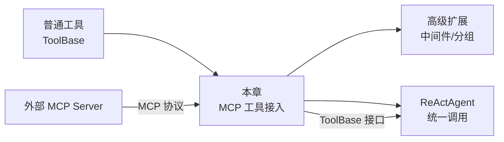
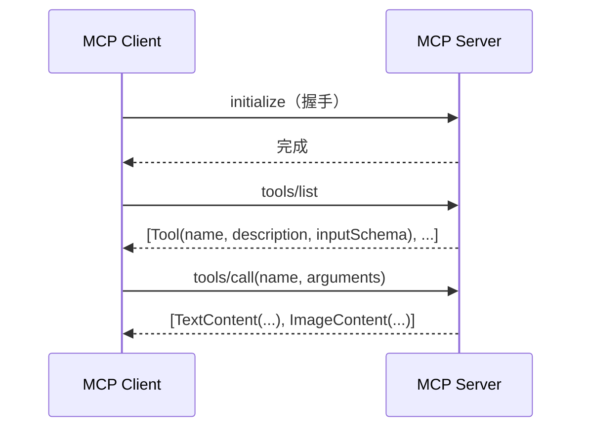
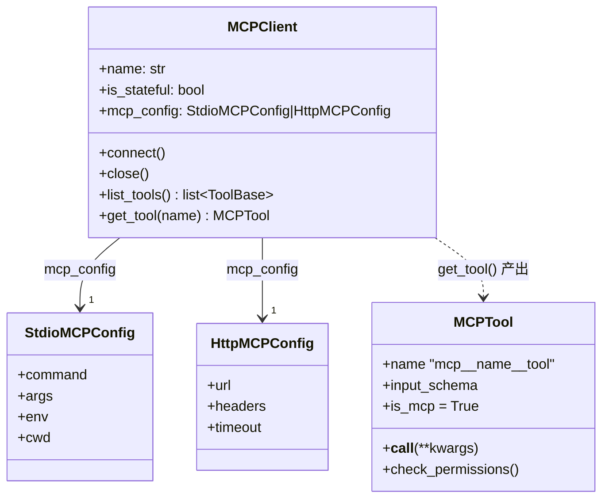
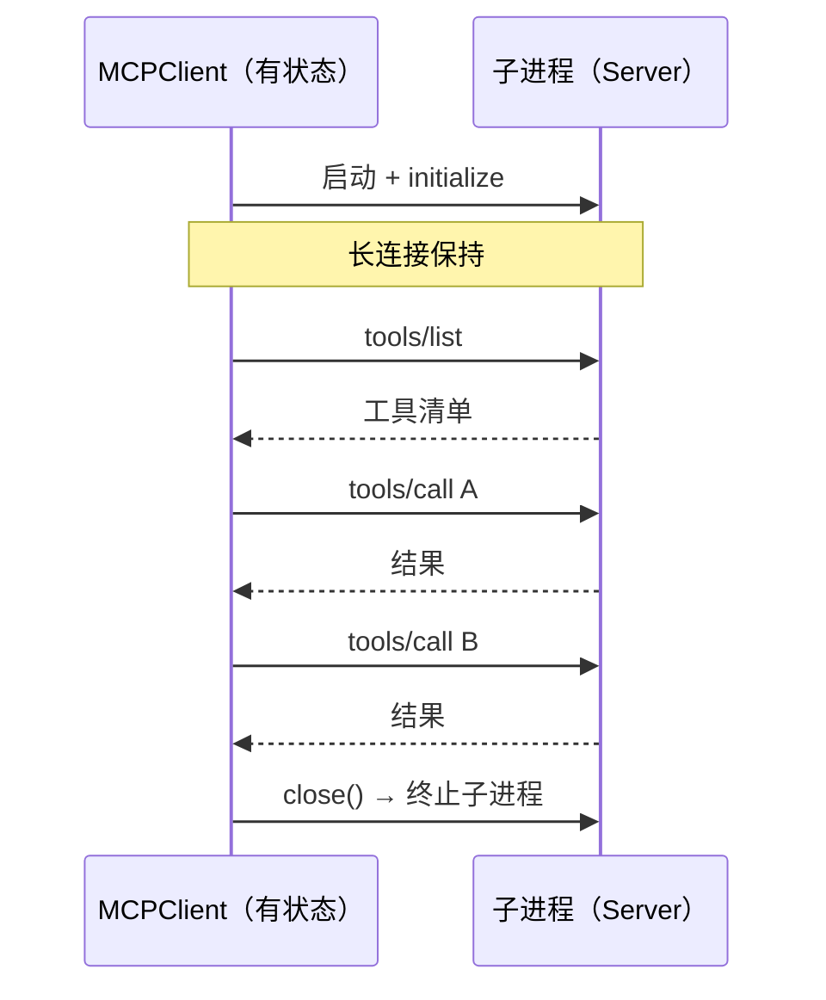
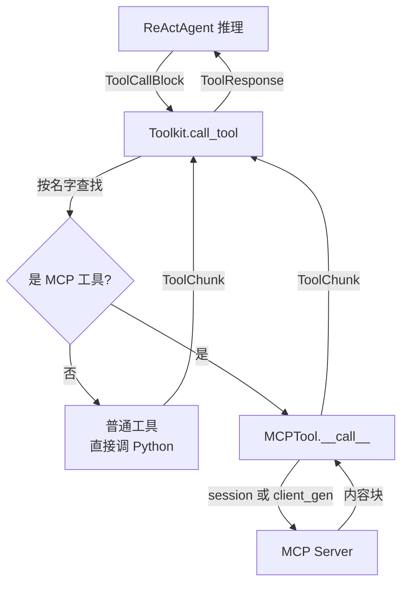
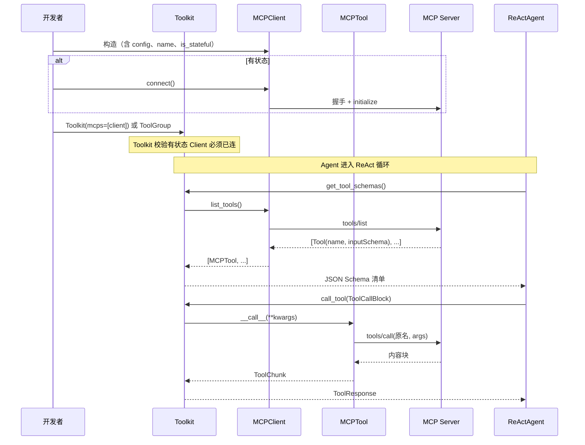

# 第 26 章 集成 MCP Server——对接本地工具服务

你的 Agent 想读本地文件、查公司内网、操作 GitHub。这些能力你都懒得自己写一遍——市面上早有现成的 MCP Server（文件系统、数据库、搜索、Git……）。怎么让 AgentScope 的 Toolkit 把它们像自家工具一样调用？这一章讲的就是这件事：把一个"讲 MCP 协议的外部工具服务"接到 Agent 的工具箱上，让 Agent 完全感觉不到它是外人。

> 点题：MCP 是 AI 应用连接外部工具的开放协议；AgentScope 把它"翻译"成自家工具接口，于是远程工具与本地函数在 Agent 眼里再无分别。

> **上一章：[造一个新 Agent 类型](./ch25-new-agent.md)**

---

## 26.1 路线图

本章处在第三卷"构建"的工具集成一环：你已经会写普通 Python 工具、会造新 Agent 类型，现在把视野从"自己写工具"扩展到"接别人的工具"。



读完本章，你应该能说清楚：MCP 协议长什么样、AgentScope 用哪几个类把它接进来、为什么接进来之后 Agent 端的代码一行都不用改。

---

## 26.2 知识补全：MCP 协议是什么

MCP（Model Context Protocol，模型上下文协议）是 Anthropic 在 2024 年底推出的开放协议，目标是给 AI 应用和外部数据/工具之间定一个标准化的"插头标准"。在那之前，每个工具服务都要为 OpenAI、Anthropic、各家 Agent 框架各写一遍适配；有了 MCP，工具方只需实现一个 MCP Server，任何懂 MCP 的客户端都能用——就像 USB 出现之前，每个外设都自带一种专用接口，USB 之后大家长一个样。

> MCP 提供了一个开放标准，让 AI 应用以统一的方式连接到任意外部数据源和工具，从而把 M×N 的集成问题简化成 M+N。
> —— MCP 官方文档

### 三种角色

一次 MCP 通信里始终有三个角色：

| 角色 | 职责 | 在 AgentScope 里对应 |
|------|------|---------------------|
| **MCP Server** | 真正提供能力的一方，声明自己有哪些工具、资源、提示 | 外部进程或远程服务（如 `mcp-server-filesystem`） |
| **MCP Client** | 连接 Server、发现工具、发起调用的中间人 | `MCPClient` |
| **Host / 用户** | 把 Client 接进自家框架、最终使用工具的 AI 应用 | AgentScope 的 `Toolkit` 与 `ReActAgent` |

### 三种通信方式（Transport）

MCP 定义了几种 Client 与 Server 之间的"传输方式"：

- **stdio**：把 Server 当作一个子进程启动，靠它的标准输入/标准输出收发消息。适合本地命令行工具，比如文件系统访问、Git 操作。
- **Streamable HTTP**：Server 是一个 HTTP 端点，每次请求发一个 POST。适合远程服务、需要独立部署的工具。
- **SSE（Server-Sent Events）**：HTTP 的一种变体，用于服务器需要持续推送结果的场景。

### 一次工具调用的标准流程

不论走哪种传输，MCP 的工具调用都遵循同一个"四步舞"：

1. **握手**：Client 连上 Server，完成初始化，交换彼此支持的能力（capabilities）。
2. **发现**：Client 调用 `tools/list`，拿到 Server 暴露的全部工具清单——每条记录是一个 `Tool` 对象，含 `name`、`description`、`inputSchema`（一份 JSON Schema）。
3. **调用**：Client 调用 `tools/call`，带上工具名和参数，Server 执行后返回若干**内容块**（文本、图片、音频等）。
4. **拆包**：Client 把这些内容块翻译成自家框架能理解的格式。



记住这张图，下面所有 AgentScope 的设计都是在"怎么把这张图里的每一步包装得让上层无感"。

> **设计一瞥**：MCP 工具的"说明书"是现成的。普通 Python 工具的 JSON Schema 是框架从函数签名和 docstring 里**猜**出来的；而 MCP 工具的 `inputSchema` 是 Server **主动声明**的，框架直接拿来用，既准又省事。这一个小差别，决定了 MCP 工具不需要任何代码层面的元数据推断。

---

## 26.3 AgentScope 怎么接 MCP：三个关键类

AgentScope 把 MCP 接进来只用三个主角，关系很简单：



### `MCPClient`——统一的客户端门面

`MCPClient` 是一个 Pydantic 模型，是所有 MCP 连接的统一入口。它有两个核心字段：

- **`name`**：给这次连接起个名，会进到工具名里（`mcp__{name}__{tool}`），所以只能用字母、数字、下划线、短横线。
- **`mcp_config`**：一个配置对象，告诉它怎么连。两种配置决定两种传输：

```python
# stdio 传输：把 Server 当子进程拉起来
StdioMCPConfig(command="npx", args=["-y", "@modelcontextprotocol/server-filesystem", "/tmp"])

# HTTP 传输：连一个远程端点
HttpMCPConfig(url="https://api.example.com/mcp", timeout=30.0)
```

`mcp_config` 用一个 `type` 字段做判别（`"stdio_mcp"` 或 `"http_mcp"`），Pydantic 据此走不同的校验分支——这就是为什么一份客户端代码能同时管两种传输。

### 有状态 vs 无状态

`MCPClient` 还有一个关键字段 `is_stateful`，它决定了连接的生命周期：

| 模式 | 何时用 | 连接管理 | 适用传输 |
|------|--------|---------|---------|
| **有状态**（`is_stateful=True`） | 长期、反复调用同一 Server | 必须显式 `connect()` / `close()`，维持一个长连接会话 | stdio 必须有状态；HTTP 也可以 |
| **无状态**（`is_stateful=False`） | 偶发调用、Server 无状态 | 每次调用临时建一个会话，用完即弃，无需 `connect()` | 仅 HTTP |

一条硬规则：**stdio 传输必须是有状态的**——因为子进程的 stdin/stdout 流不能"每次重新开"。构造时框架会直接拒绝 `is_stateful=False` 的 stdio 配置。

### `MCPTool`——把 MCP 工具翻译成 ToolBase

`MCPClient.get_tool(name)` 的产物是一个 `MCPTool` 实例。`MCPTool` 继承自 `ToolBase`，实现了和普通工具一模一样的接口（`__call__`、`input_schema`、`check_permissions` 等），于是它就可以无缝混进任何接收 `ToolBase` 的地方。

它的内部做了三件关键的"翻译"工作：

1. **改名**：MCP 工具的原名（比如 `search-files`）可能含 LLM 提供商不允许的字符。`MCPTool` 把它改写成 `mcp__{mcp_name}__{sanitized_tool}`——前缀 `mcp__` 让模型一眼看出这是外部工具，中间是 Server 名，最后是工具名。非法字符会被替换成 `x`（注意不是 `_`，以免和分隔符 `__` 撞车）。原始名字保留在内部，真正调用 Server 时再用原名。
2. **搬 Schema**：直接把 MCP Server 给的 `inputSchema` 拷过来当 `input_schema`，并补齐缺失的 `type`/`properties`/`required` 三个默认键。注意它**保留完整的 Schema**（包括 `$defs`、`anyOf` 等嵌套定义），而不是只摘 `properties` 和 `required`——否则带 `$ref` 引用的复杂参数会被悄悄截断。
3. **转结果**：Server 返回的是 MCP 的 `TextContent` / `ImageContent` 等内容块，`MCPTool.__call__` 把它们打包成 AgentScope 的 `ToolChunk`，让上层调用流程和普通工具完全一致。

### 一句话总结这套设计

> **设计一瞥**：`MCPClient` 管"怎么连"，`MCPTool` 管"怎么调"。两者一道把"MCP 协议"这层完全埋掉——上层只看到 `ToolBase`，根本不知道某个工具背后是本地 Python 函数还是地球另一端的 HTTP 服务。这就是抽象层的价值。

---

## 26.4 接入的三种姿势

知道了主角，再看怎么把它们装进 Toolkit。AgentScope 提供了三种入口，对应三种使用习惯。

### 姿势一：Toolkit 构造时直接传 `mcps`

最省事——`Toolkit` 的构造函数就吃 `mcps` 参数：

```python
toolkit = Toolkit(
    tools=[my_python_tool],
    mcps=[filesystem_client, search_client],
)
```

这些 MCP 会和普通工具一起被放进一个叫 `"basic"` 的默认工具组里，从一开始就对 Agent 可见。

### 姿势二：放进 `ToolGroup`，按需激活

如果不想让一堆 MCP 工具一开始就挤占模型的注意力，可以把它们装进**工具组**（`ToolGroup`），默认不激活，等 Agent 自己判断需要时再唤醒：

```python
fs_group = ToolGroup(
    name="filesystem",
    description="本地文件读写工具，仅在需要操作文件时激活",
    mcps=[filesystem_client],
)
toolkit = Toolkit(tool_groups=[fs_group])
```

`ToolGroup` 和 `Toolkit(mcps=...)` 的关系是：构造函数里的 `mcps` 其实只是 `"basic"` 组的快捷方式。任何 MCP 都可以独立成一个组，由 `ResetTools` 这个**元工具**（meta tool）在运行时激活/停用。Agent 在推理循环里看到任务涉及文件，会自己调用 `ResetTools` 把 `filesystem` 组打开——这正是第 27 章"分组"要展开讲的主题。

> **设计一瞥**：工具组是 Agent 的"抽屉"。把所有工具一股脑塞给模型，它会眼花；把它们分门别类放进抽屉，平时合上，需要时打开，模型的注意力负担骤降。MCP 工具天然适合这种组织方式——一个 Server 通常就是一类能力（"文件操作""网络搜索""数据库查询"），刚好一个抽屉。

### 姿势三：手动取工具

最灵活也最啰嗦——直接调 `client.get_tool(name)`，拿到 `MCPTool` 后自己处理：

```python
client = MCPClient(name="fs", is_stateful=True, mcp_config=stdio_cfg)
await client.connect()
tool = await client.get_tool("read_file")   # 一个 MCPTool
# 之后 tool 就是一个普通 ToolBase，可以登记、可以 await tool(path=...)
```

这个姿势适合需要对单个工具做精细控制（比如改名、套中间件、单独设权限）的场景。日常用前两种就够。

---

## 26.5 stdio 与 HTTP：两种连接的生命周期

理解 `is_stateful` 的最好办法，是看两种连接"活多久"。

### stdio：长链接，子进程陪你到 close

stdio 客户端启动时，框架会用配置里的 `command` / `args` 拉起一个子进程，握住它的 stdin/stdout。这个子进程在 `connect()` 之后一直活着，所有工具调用都复用同一条管道，直到 `close()` 把它收掉。



好处是省去反复建连的开销，坏处是子进程占着资源，而且**必须**有状态——你不能"用一次就关一次管道"，那对子进程不友好。

### HTTP 有状态：一条长会话

HTTP 也可以有状态：`connect()` 时建一条 Streamable HTTP 或 SSE 会话，之后所有调用走同一条会话。适合要高频调用同一远程 Server 的场景。

### HTTP 无状态：每次调用都是新的

无状态模式最"佛系"：连 `connect()` 都不用调。每次 `list_tools` 或工具调用时，`MCPTool` 内部临时建一个会话，调完立刻丢弃。好处是**完全无副作用、天然适合并发和负载均衡**——远程 Server 不需要记得你是谁；坏处是每次调用都有建连成本。对那种"问一次就够"的查询型工具特别合适。

### 一个对照表

| 维度 | stdio 有状态 | HTTP 有状态 | HTTP 无状态 |
|------|-------------|-------------|-------------|
| 需要 `connect()` | 是 | 是 | 否 |
| 连接复用 | 全程一条管道 | 一条 HTTP 会话 | 每次新建 |
| 资源占用 | 持有一个子进程 | 持有一条会话 | 调用完即释放 |
| 适合场景 | 本地命令行工具 | 高频远程调用 | 偶发查询、无状态 Server |
| 并发安全 | 受限于单进程 | 取决于 Server | 天然好 |

> **设计一瞥**：`MCPTool` 的构造函数里有一个二选一约束——要么传 `session`（有状态），要么传 `client_gen`（无状态，一个能产出临时会话的工厂函数），两者不能同时给也不能都不给。这个约束在类型层面就锁死了"无状态必须有工厂、有状态必须有会话"，把容易踩的坑前置成了编译期错误。

---

## 26.6 调用阶段：Agent 眼里没有"MCP"这回事

接好之后，运行时的故事极其平淡——平淡到值得专门讲，因为这种"平淡"正是好抽象的标志。

### 从 Agent 的视角

`ReActAgent` 走它的 ReAct 循环：拿到模型返回的 `ToolCallBlock`，交给 Toolkit 执行，Toolkit 根据 `tool_call.name` 找到对应的 `ToolBase` 调用它的 `__call__`。对 Agent 来说，那个工具是 `MCPTool` 还是普通 `FunctionTool` 完全不重要——它们都实现 `ToolBase`，都返回 `ToolChunk` / `ToolResponse`。



注意中间那个判断框 `是 MCP 工具?` 在代码里其实不存在——Toolkit 根本不判断，它只管调 `__call__`。是 MCP 还是普通函数，是 `MCPTool` 自己内部的事。这就是为什么我们说"上层代码一行都不用改"。

### 从 MCPTool 的视角

`MCPTool.__call__` 内部做的事，本质上就是把 AgentScope 的 kwargs 翻译成一次 `tools/call`：

1. 拿到连接（有状态用现成的 `session`，无状态用 `client_gen` 临时建一个）。
2. 用**原始工具名**（不是改名后的 `mcp__...`）和参数调用 Server。
3. 把 Server 返回的内容块逐一翻译成 AgentScope 的 `TextBlock` / `ImageBlock` / `AudioBlock` / `VideoBlock`。
4. 打包成 `ToolChunk` 返回。

如果配置了 `execution_timeout`，整次调用会被一个超时包裹住——避免远程 Server 卡死把 Agent 也拖死。

### 命名规范的小心思

`mcp__{mcp_name}__{tool}` 这个三段式命名不只是好看。它解决了两个问题：

- **模型可识别**：模型看到 `mcp__` 前缀，立刻知道这是外部工具，描述里通常会带上来源信息，便于它判断该不该用。
- **避免重名**：两个不同 MCP Server 可能都叫 `search` 的工具，加上 `mcp_name` 中段就天然区分开了，不会在 Toolkit 的工具表里撞车。

而调用 Server 时用的还是原名，因为 Server 只认自己声明的 `search`，不认你的 `mcp__xxx__search`——`MCPTool` 内部保留了原始名字，这种"对外一个名、对内一个名"的双名设计，是适配器模式的典型手法。

---

## 26.7 权限与安全：外部工具要"多问一句"

普通工具是你自己写的，你信它；MCP 工具是外部服务，框架对它天然多一分警惕。`MCPTool` 默认禁用状态注入（`is_state_injected = False`），并且实现了 `check_permissions`——这是普通工具不会强制的安全闸门。

它的默认策略很朴素：

- 如果工具声明自己是**只读**的（MCP 的 `annotations.readOnlyHint`），自动放行。
- 否则，**默认要 ASK**——也就是需要用户或上层显式确认才能执行。

```python
# MCPTool.check_permissions 的默认逻辑（示意）
if self.is_read_only:
    return PermissionDecision(behavior=ALLOW, ...)
return PermissionDecision(behavior=ASK, ...)
```

> **设计一瞥**：这条"外部工具默认询问"的策略，对应的是现实里一种朴素的信任观——自己家的菜刀随便用，借邻居的电器总得先问一句。MCP 的只读标记（`readOnlyHint`）相当于"这把工具只会看不会改，放心用"，于是框架放行；只要可能改动外部世界（写文件、发请求、改数据库），就先问。子类可以重写 `check_permissions`，按自己的安全策略收紧或放宽。

---

## 26.8 全景：一次完整的接入到调用

把前面所有零件拼起来，一次"MCP 工具接入 Agent"的全过程长这样：



几个细节值得再点一下：

- **工具发现的时机是惰性的**：不是构造 `MCPClient` 时就把工具列表拉回来，而是在 Toolkit 真正需要给模型出 Schema 时（`get_tool_schemas`）才调 `list_tools`。这避免了连上 Server 就被一堆无关元数据拖着。
- **有状态 Client 必须先 `connect()` 再交给 Toolkit**：Toolkit 在构造时会检查"有状态但未连接"的情况并直接报错，把一个容易踩的运行时坑前置到初始化阶段。
- **缓存**：`MCPClient` 会把工具列表缓存起来（`_cached_tools`），这样后续 `get_tool` 不用反复问 Server。但缓存也会带来一致性问题——Server 后来新增了工具，Client 不会自动知道。设计上这是一个"发现期快照"的取舍。

---

## 检查点

到这里，你应该能用一段话回答下面几个问题。如果某个答不上来，回去看对应小节。

1. **MCP 协议解决了什么问题？** 想想"USB 之前每个外设一种接口"这个类比。如果没有 MCP，5 个工具服务 × 4 个 Agent 框架 = 20 套适配代码；有了 MCP，工具方写 1 份 Server、框架方写 1 个 Client，共 5+4=9 份。这就是协议标准化的价值。

2. **`MCPClient` 的 `is_stateful` 在 stdio 和 HTTP 下分别意味着什么？为什么 stdio 必须有状态？** stdio 持有的是子进程的 stdin/stdout 管道，不能反复开关；HTTP 有状态则持有一条长会话，无状态则每次调用临时建会话。stdio 无状态在物理上没意义（你不能"开一次子进程用一次就杀掉"），所以框架直接禁止。

3. **`MCPTool` 做了哪三件"翻译"工作，让一个外部 MCP 工具看起来和普通 Python 工具一样？** 改名（`mcp__name__tool`，含非法字符清洗）、搬 Schema（直接用 Server 给的 `inputSchema`，保留嵌套定义）、转结果（把 MCP 内容块翻译成 AgentScope 的 `ToolChunk`）。

4. **为什么 Agent 端的调用代码完全不用关心工具是不是 MCP？** 因为 `MCPTool` 实现了 `ToolBase` 接口，Toolkit 只按名字查表后调 `__call__`，不判断来源。"是 MCP 还是普通函数"是 `MCPTool` 内部的实现细节，对上层不可见——这是适配器模式带来的透明性。

5. **MCP 工具的权限策略默认是什么？为什么这样设计？** 只读工具（Server 标了 `readOnlyHint`）自动放行，其他默认要 ASK 显式确认。因为 MCP 是外部服务，框架对它的信任度低于自家代码，写操作可能改动外部世界，所以多一道确认闸门。子类可以重写收紧或放宽。

---

## 下一站预告

MCP 工具已经接好，Agent 现在能调本地文件、远程搜索、公司内网。但工具一多，新问题来了：怎么给所有工具（不管是自家的还是 MCP 的）统一加上限流、日志、审计？怎么让一组工具按场景一起激活、一起停用？怎么把一段可复用的能力封装成"技能"？下一章我们把工具管理再往上推一层。

> **下一章：[高级扩展：中间件与分组](./ch27-advanced-extension.md)**
