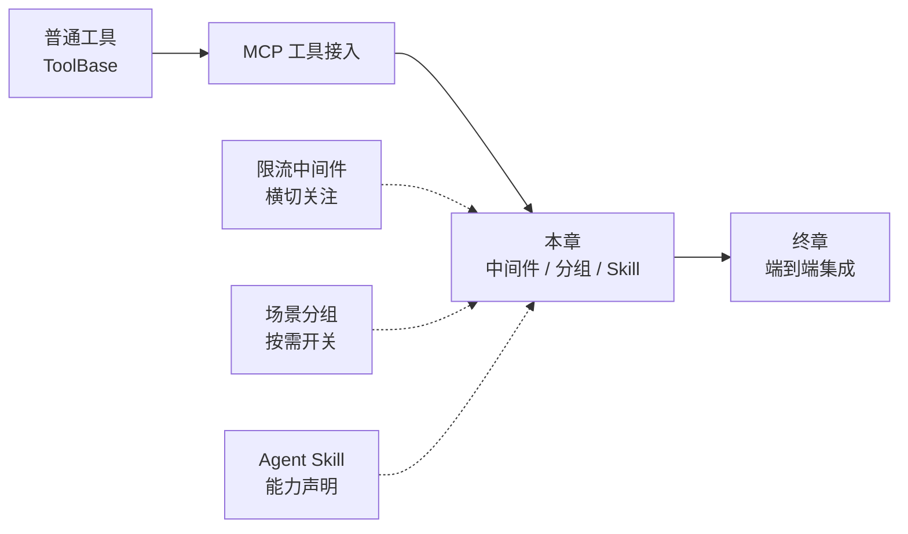
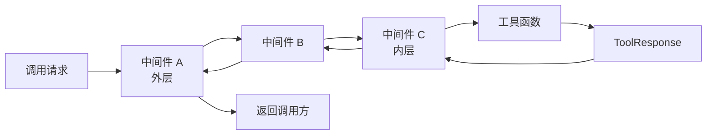
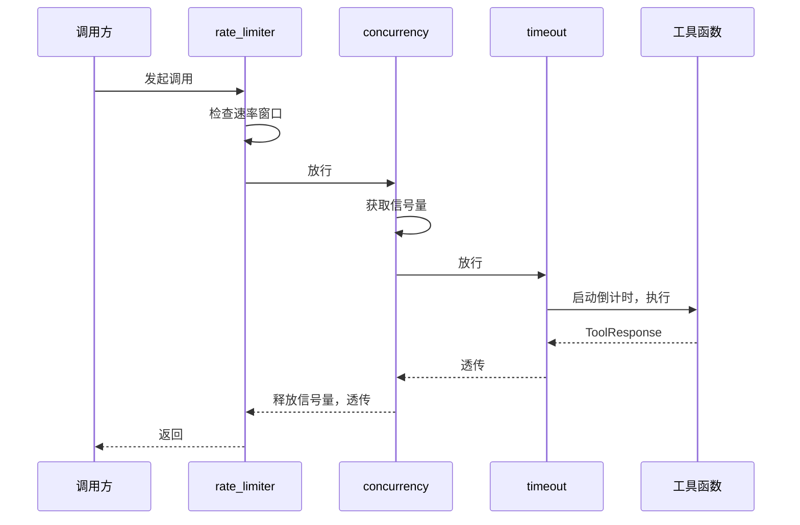
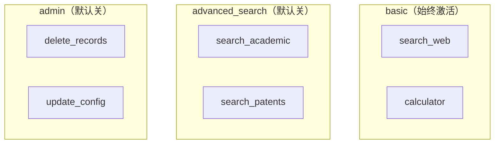
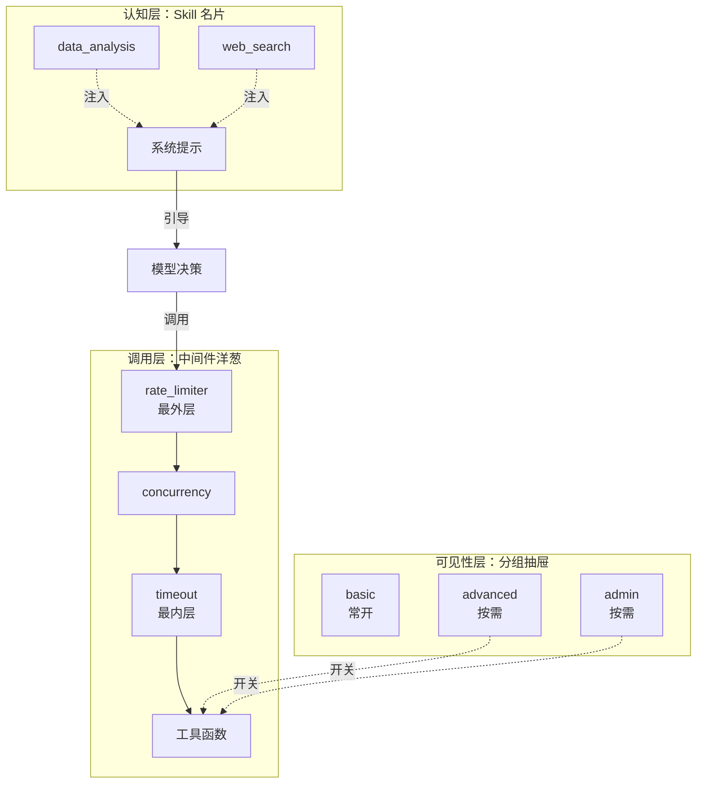

# 第 27 章 高级扩展——中间件与分组

你的 Agent 跑起来之后，真实世界会甩给你三类新问题：十几个工具同时被调用、数据库连接被打爆；管理类工具和普通工具混在一起，模型老是不该用的时候用了它；你明明给 Agent 装了一身本事，模型却不知道它自己擅长什么。这一章把这三个问题一次讲透——它们对应 AgentScope 工具系统的三把高级"手术刀"：**限流中间件**、**场景分组**、**Agent Skill**。

> 点题：中间件给工具调用套上"洋葱衣"做横切关注，分组把工具按场景分进"抽屉"按需开合，Skill 则给 Agent 贴上"能力标签"引导模型决策。三者都不改工具本身的逻辑，却从外部把工具系统调校得井井有条。

> **上一章：[集成 MCP Server](./ch26-mcp-server.md)**

---

## 27.1 路线图

本章是第三卷"构建"在工具方向上的最后一站。前面你已经会写普通工具、会接外部 MCP Server，现在要解决"工具多了之后怎么管"的工程问题。



读完本章，你应该能回答：中间件为什么是"洋葱"而不是"流水线"、分组怎么让工具像灯泡一样按开关亮灭、Skill 为什么是一张"标签"而不是一段"代码"。

---

## 27.2 知识补全：中间件与洋葱模型

在动手做限流之前，先把"中间件"这件事讲清楚。AgentScope 的工具调用走的是**异步生成器**：一个工具函数被调用后，会产出（yield）一个或多个 `ToolResponse`，调用方逐个消费这些响应。中间件就是套在这个生成器外层的一层壳。

### 洋葱模型

想象一个快递分拣中心。包裹（调用请求）从外面进来，要经过安检、称重、贴标三层处理，最后到达真正的分拣员（工具函数）；分拣员处理完，结果又原路返回——贴标员贴回执、称重员记录、安检员放行。每一层都是"进来时做点事，出去时再做点事"。这就是**洋葱模型**：每一层中间件是一圈洋葱皮，请求从外向内穿透，响应从内向外返回。



一个中间件长这样：

```python
async def my_middleware(kwargs, next_handler):
    # 前置处理：请求进来时做的事
    async for response in await next_handler(**kwargs):
        yield response
    # 后置处理：响应出去时做的事
```

两个关键点：`kwargs` 是这次调用的参数字典，`next_handler` 是下一层（更靠近工具函数的那一层）。中间件不直接调用工具，而是**调用下一层并把它的结果透传出去**——这正是"洋葱"的精髓：每一层只关心自己那一刀，把活儿交给自己更内层的邻居。

> **设计一瞥**：为什么中间件是异步生成器而不是普通函数？因为工具调用可能产出**多个**响应（比如流式输出），中间件需要在每个响应上都有机会插手。用 `async for ... yield` 的形式，中间件既能拦截前置、又能逐个处理流式结果、还能在结束后做收尾——一个签名覆盖三种时机。

### 中间件的注册与组装

中间件通过 `Toolkit.register_middleware(...)` 注册，可以注册任意多个。运行时，AgentScope 会动态把所有中间件和最内层的工具函数串成一条链。组装顺序有一个反直觉但很重要的规则：**最先注册的中间件是最外层**——也就是请求最先经过、响应最后离开的那一层。

用饭店点菜的类比：先在后厨把厨师（工具函数）准备好，然后从内向外一层层套上助手——第一个派来的助手站在最外面迎客，最后一个派来的助手贴着厨师传菜。注册顺序决定了"谁站在最外面"。

---

## 27.3 限流中间件：给工具调用装上红绿灯

理解了洋葱模型，限流中间件就是三层洋葱皮，分别管"同时能有几个""一秒能几次""一次最多多久"。

### 并发控制：同时只准 N 个进店

并发控制用信号量（Semaphore）实现。信号量就像餐厅门口那个写着"本店限流，最多容纳 N 人"的牌子：每进来一个客人取走一个号，每走一个客人还回一个号；号发完了，新客人就得在门口排队。

```python
def create_concurrency_limiter(max_concurrent: int = 5):
    semaphore = asyncio.Semaphore(max_concurrent)

    async def concurrency_middleware(kwargs, next_handler):
        async with semaphore:                       # 取号
            async for response in await next_handler(**kwargs):
                yield response                      # 还号（with 退出时自动还）
    return concurrency_middleware
```

注意它没有"后置处理"——拿到号就立刻进下一层，干完活自动放号。这种中间件叫**纯前置**，它的全部职责就是在工具函数外面套一个并发上限。当 10 个调用同时涌进来、`max_concurrent=3`，只有 3 个会真正执行，其余 7 个卡在 `async with semaphore` 上排队。

### 速率限制：每秒最多 N 次

速率限制关心的是"频率"而不是"瞬时并发"。它用一个小本子（`deque`）记下最近一段时间内的调用时刻，发现本子满了就让新调用先睡一会儿。

```python
def create_rate_limiter(max_calls: int = 10, period: float = 1.0):
    call_times = collections.deque()

    async def rate_limit_middleware(kwargs, next_handler):
        now = time.time()
        while call_times and call_times[0] < now - period:
            call_times.popleft()                    # 撕掉过期记录
        if len(call_times) >= max_calls:
            await asyncio.sleep(period - (now - call_times[0]))  # 罚站
        call_times.append(time.time())
        async for response in await next_handler(**kwargs):
            yield response
    return rate_limit_middleware
```

这是个典型的**滑动窗口**算法：窗口大小是 `period`，窗口内最多 `max_calls` 次。新调用进来先清理窗口外的旧记录，再看窗口满没满；满了就计算"最早那条记录还有多久过期"，睡那么久再放行。

并发控制和速率限制的区别值得记住：

| 维度 | 并发控制（Semaphore） | 速率限制（滑动窗口） |
|------|----------------------|---------------------|
| 管的是 | **同一时刻**有几个在跑 | **一段时间内**总共调了几次 |
| 类比 | 餐厅最多坐几桌 | 餐厅每小时最多接几单 |
| 卡住的代价 | 排队等座位 | 等时间窗口滚动 |
| 适合场景 | 限制数据库连接、线程池 | 尊重外部 API 的 QPS 配额 |

### 超时控制：一次最多跑多久

超时中间件给单次调用装一个闹钟。它把下一层包进 `asyncio.wait_for`，闹钟一响就抛 `TimeoutError`，中间件捕获后**不向上传播异常**，而是产出一个"超时了"的 `ToolResponse` 交给模型——这样模型看到的是一条可读的提示，而不是程序崩溃。

```python
def create_timeout(timeout_seconds: float = 30.0):
    async def timeout_middleware(kwargs, next_handler):
        try:
            async for response in asyncio.wait_for(
                _collect(next_handler(**kwargs)),
                timeout=timeout_seconds,
            ):
                yield response
        except asyncio.TimeoutError:
            yield ToolResponse(
                content=[TextBlock(type="text",
                                   text=f"工具调用超时（{timeout_seconds}秒），已取消。")],
                is_last=True,
            )
    return timeout_middleware
```

这里的"把异常翻译成响应"是一个值得借鉴的模式：**横切关注点（这里是对错误的统一处理）应该尽可能在中间件里消化掉，别让它污染业务代码**。模型拿到超时提示后会自己决定是重试、换工具，还是放弃——这正是 ReAct 循环擅长的事。

### 把三层叠起来

三个中间件可以同时注册，按顺序套成洋葱：

```python
toolkit.register_middleware(create_rate_limiter(max_calls=20, period=1.0))
toolkit.register_middleware(create_concurrency_limiter(max_concurrent=5))
toolkit.register_middleware(create_timeout(timeout_seconds=30.0))
```

因为"先注册 = 最外层"，执行顺序是：**rate_limit（最外）→ concurrency → timeout（最内）→ 工具函数**。一次请求的旅程是这样的：先被速率限制检查"现在这一秒还能不能调"，通过后再去抢 5 个并发名额里的一个，抢到后启动 30 秒倒计时，最后才真正执行工具函数。



中间件顺序不是任意的——它有实际后果。把限速器放最外层，意味着"先看配额、再争并发名额"，适合外部 API 配额很紧的场景；反过来把并发器放最外层，则是"先占住名额、再看能不能调"，适合并发槽位是稀缺资源的场景。两者的差别在极端高并发下会显现，大多数应用两种顺序都够用。

> **设计一瞥**：为什么 AgentScope 把限流做成"工厂函数 + 中间件"而不是内置几个开关参数？因为限流策略千变万化——有人要令牌桶、有人要漏桶、有人要按用户隔离、有人要分布式限流。用中间件这种"可组合的壳"，框架只提供机制（洋葱模型），策略全部交给用户自己写。这是典型的"机制与策略分离"。

---

## 27.4 场景分组：给工具装抽屉

中间件解决的是"调用怎么管"，分组解决的是"工具怎么收"。当一个 Agent 身上挂了几十个工具，问题就来了：管理类工具（删数据、改配置）平时根本不该让模型看到，可一旦需要又要随时能上；高级搜索工具只在特定对话里才用得到。如果所有工具一股脑全塞给模型，模型既要在一堆无关工具里费力挑选，又可能在错误时机调用危险工具。

### 分组是什么

分组把工具收进命名好的"抽屉"。每个抽屉有一个开关——`active`。抽屉关着的时候，里面的工具**对模型不可见**：它们不会出现在发给模型的工具 Schema 列表里，模型根本不知道它们存在；即便模型误判尝试调用，也会被拦下来返回"该工具当前未激活"的提示。抽屉打开，工具才重新现身。

一个分组的结构很简单：

| 字段 | 含义 |
|------|------|
| `name` | 分组名，唯一标识 |
| `active` | 是否激活——决定工具是否对模型可见 |
| `description` | 给人看（也给模型看）的分组说明 |
| `notes` | 备注字段，可选 |

创建一个分组并往里塞工具，API 形态是这样：

```python
toolkit.create_tool_group(
    group_name="admin",
    description="管理操作：删除数据、修改配置等",
    active=False,                                  # 默认关着
)
toolkit.register_tool_function(delete_records, group_name="admin")
toolkit.register_tool_function(update_config,  group_name="admin")
```

### 一个内置的特殊分组：basic

AgentScope 内置了一个叫 `"basic"` 的分组，它是所有工具的默认归宿，**永远处于激活状态、不能被关闭、也不能被 `create_tool_group` 重建**。普通工具注册时不指定 `group_name`，就自动进 `basic`。这个设计的意思是：**总要有一层工具是"永远在场"的**，否则模型可能陷入"一个能用的工具都没有"的窘境。

`"basic"` 的存在回答了一个隐含问题——为什么分组默认 `active=False`？因为凡是用户**显式**建出来的分组，多半是"按需才用"的高级或敏感工具；而那些需要常驻的普通工具，留在 `basic` 里就行。一个合理的工具布局往往是这样的：



普通问答时，模型只看到 `basic` 里的两个工具；当对话进入学术研究场景，Agent（或上层应用）把 `advanced_search` 打开，学术搜索工具就现身了；遇到管理任务，再单独打开 `admin`——这样模型在绝大多数时候面对的是一个干净、小巧的工具集，选择成本和误用风险都大大降低。

### 动态开合：谁来按开关

分组的开关不是写死的，而是**运行时动态切换**的。AgentScope 提供了一个叫 `reset_equipped_tools` 的元工具（meta-tool）——它本身也是一个工具，模型可以在 ReAct 循环里调用它来激活或停用某个分组。这等于把"我现在需要哪一组工具"的决策权也交给了模型自己。

整个机制形成一个有趣的闭环：

1. 对话开始，只有 `basic` 工具在场，模型视野清爽。
2. 模型判断"这件事我需要高级搜索"，调用 `reset_equipped_tools` 把 `advanced_search` 打开。
3. 高级搜索工具现身，模型正常调用它们完成任务。
4. 任务完成后，模型（或应用逻辑）可以再把分组关上，恢复清爽视野。

这背后的检查发生在工具执行的最前面：每次模型试图调用一个工具，AgentScope 都会先看它属于哪个分组、那个分组是不是激活的；不在 `basic` 又没激活，直接返回一条 `FunctionInactiveError` 提示，工具函数根本不会被调用。这是一种**双保险**——Schema 层面藏起来是为了不让模型乱选，执行层面再拦一次是为了防止模型靠记忆硬调。

---

## 27.5 Agent Skill：给 Agent 贴能力标签

中间件管"调用"，分组管"可见性"，Skill 管的是另一件事——**模型对自己能力的认知**。

### Skill 不是工具，是一张名片

想象你雇了一个新员工。你给他一张名片，上面写着"擅长数据分析、会写 SQL、能做可视化"。这张名片本身不会替他干活，但同事看到名片就知道该把什么样的活儿派给他。Agent Skill 就是这张名片：它告诉模型"这个 Agent 擅长什么"，但**它本身不提供任何可执行代码**。

一个 Skill 在数据上只是三个字段：

| 字段 | 含义 |
|------|------|
| `name` | 技能名（如 `data_analysis`） |
| `description` | 一句话描述这个技能 |
| `dir` | 技能所在的目录路径（指向一份说明文件） |

### Skill 从哪里来

每个 Skill 对应磁盘上的一个目录，里面有一份 `SKILL.md`。文件头是 YAML front matter，声明 `name` 和 `description`；正文是给人或模型看的详细说明。注册时只要把目录路径传进去，AgentScope 会自动读 front matter、组装成 `AgentSkill`：

```python
toolkit.register_agent_skill("/path/to/skills/data_analysis")
```

对应的 `SKILL.md` 长这样：

```markdown
---
name: data_analysis
description: 分析 CSV 和 Excel 数据，生成统计报告
---

# 数据分析技能

这个 Agent 擅长读取 CSV/Excel、计算统计指标、生成报告。
```

### Skill 如何影响模型行为

注册完之后，Skill 并不会自动起作用——它要被"念出来"给模型听。`get_agent_skill_prompt()` 把所有注册过的 Skill 整理成一段文本，注入到 Agent 的系统提示里。模型每次推理时都会读到这段话，于是它知道：哦，我身上挂着 `data_analysis` 和 `web_search` 两个本事。

注入的提示形态大致是：

```text
# Agent Skills
## data_analysis
分析 CSV 和 Excel 数据，生成统计报告
Check ".../skills/data_analysis/SKILL.md" for how to use this skill
## web_search
搜索互联网获取最新信息
Check ".../skills/web_search/SKILL.md" for how to use this skill
```

注意最后那句"Check .../SKILL.md"——它给了模型一个**指向详细说明的指针**。如果模型在推理时需要用到某个技能，它可以（通过文件读取工具）去打开那份 `SKILL.md`，按里面的步骤办事。这是一种"**懒加载的能力描述**"：名片上一句话足够模型做路由决策，真正要用时再去翻详细手册。

### Skill、工具、分组：三者各管什么

到这里三个概念容易混。用一张表把它们彻底分开：

| 概念 | 本质 | 给谁看 | 何时起作用 |
|------|------|--------|-----------|
| **工具** | 可执行函数 | 给模型调用 | 模型决定调用时执行 |
| **分组** | 工具的容器+开关 | 给模型可见性控制 | Schema 生成与调用拦截时 |
| **Skill** | 能力描述标签 | 给模型认知 | 系统提示注入时 |

工具是"手"，分组是"手套箱的抽屉"，Skill 是"自我介绍"。三者正交：一个工具可以属于任何分组，一个 Skill 可以描述一组跨分组的工具，分组和 Skill 之间没有直接绑定关系。

> **设计一瞥**：为什么 Skill 是声明式的纯文本，而不是一段注册代码？因为 Skill 的目的从来不是"执行"，而是"**引导模型的行为选择**"。模型看到"你擅长数据分析"，会更倾向于调用数据分析类工具、更愿意在回答里走数据驱动的路子。这是一种对模型推理方向的软性引导，和工具的硬性执行是两个层次的事。这也解释了 Skill 和 MCP 工具的微妙对比：MCP 工具对模型是"隐式"的（模型不关心它是远程还是本地），Skill 对模型是"显式"的（专门讲给模型听）。

---

## 27.6 把三件事放在一起看

一个生产级的 Agent 往往同时用到这三件套。把它们组装起来的画面是这样的：



三条线各司其职：**Skill 在最上游**，塑造模型"我想用什么"的倾向；**分组在中游**，决定模型"能看见、能调到"哪些工具；**中间件在最下游**，在工具真正执行的那一刻给它套上流量、并发、超时的护栏。三者都不改动任何工具函数本身的代码——这是它们共同的灵魂：**用横切的方式从外部给系统加秩序，而不是把秩序硬塞进每个工具**。

---

## 检查点

1. **洋葱模型里，"先注册的中间件是最外层"为什么是合理的？** 想想饭店迎客的助手：最外层要最先接触请求、最后接触响应，所以它需要"包住"所有其他层。注册顺序对应"从内向外包裹"的施工顺序——最后包上去的那层自然在最外面。所以最先注册的反而在最外，是个施工顺序的副产物，但符合直觉：你最关心、最先想到要加的那层（比如限流），理应是请求最先撞上的那层。

2. **并发控制和速率限制到底差在哪？** 一句话：并发控制管"瞬时同时在跑的数量"（餐厅座位数），速率限制管"一段时间内总调用次数"（每小时接单数）。10 个请求同时来、每个跑 1 秒，并发上限 3 意味着分 4 批跑完；速率上限 10 次/秒意味着这一秒全放行、下一秒就得等。两者解决的是不同维度的过载。

3. **如果一个工具被分到了未激活的分组，模型却硬要调用它，会发生什么？** 会被执行前的分组检查拦下，返回一条 `FunctionInactiveError` 提示，工具函数根本不会被触发。这是双保险的第二道——第一道是 Schema 生成时就把它藏起来了，模型理论上不该看到它；万一模型靠记忆硬调，执行层再兜一次底。

4. **为什么 `"basic"` 分组不能被关闭、也不能被重建？** 因为总要留一层"永远在场"的工具，避免模型陷入"一个工具都没有"的死局。`"basic"` 是内置的默认归宿，所有不显式指定分组的工具都进它。把它做成不可关闭、不可重建，就是用约束守住这条底线。

5. **Skill 既然不执行任何代码，它到底改变了什么？** 它改变了模型的**推理倾向**。通过注入系统提示，Skill 让模型知道"自己擅长什么"，于是在面对问题时更可能选择与自身技能匹配的工具、走匹配的解题路径。它是一种对模型行为的软引导，和工具的硬执行、分组的硬开关是三个不同层次的控制手段。

---

## 下一站预告

到这里，第三卷"构建"的全部零件都备齐了：你能造新 Model、新 Memory、新 Agent，能写普通工具、能接 MCP Server、还能用中间件和分组把工具系统调校得井井有条。下一章是这一卷的终章，我们要把这些零件**装到同一台机器上**，跑通一个端到端的集成实例，看看它们啮合在一起时是怎么转起来的。

> **下一章：[终章：集成实战](./ch28-integration-capstone.md)**
