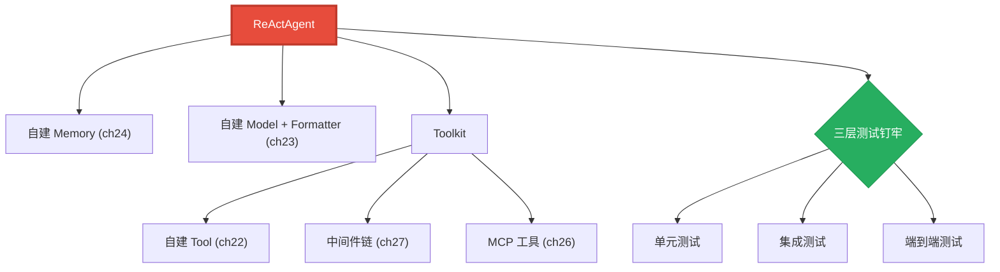
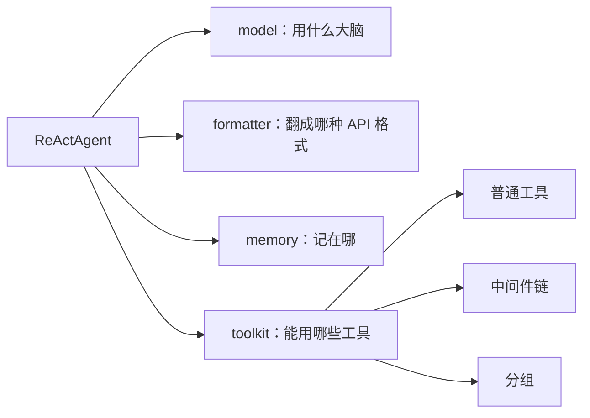
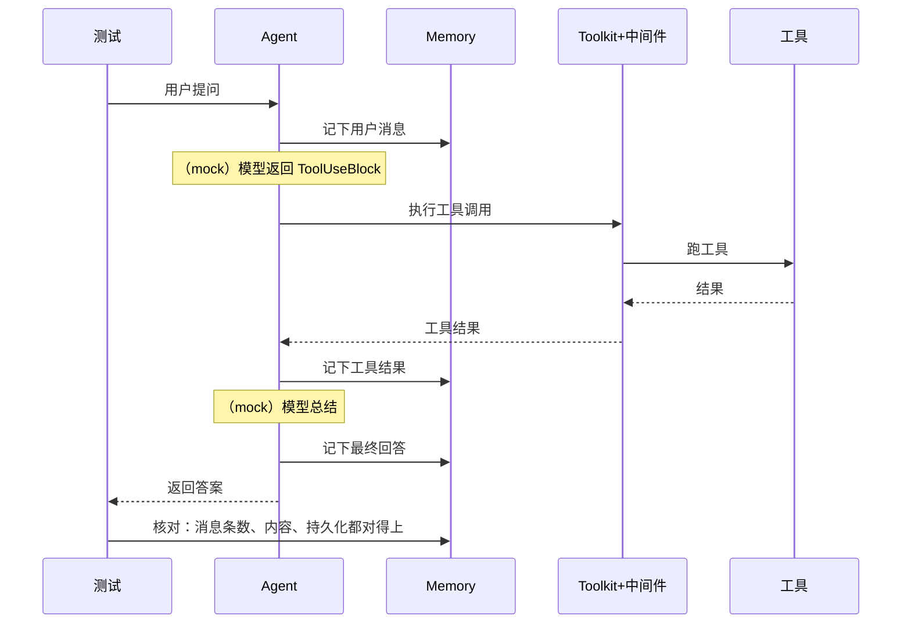

# 第 28 章 终章：集成实战

> 前面六章（ch22-ch27），我们一块块地造好了零件：工具、模型、记忆、Agent、MCP 集成、中间件与分组。这一章不造新零件，而是把它们**组装**成一台完整的机器，并回答一个更重要的工程问题：怎么知道这台机器真的能用？

> **上一章：[第 27 章 高级扩展：中间件与分组](./ch27-advanced-extension.md)**

---

## 28.1 路线图

第三卷走到尾声。我们把分散的能力收拢成一个端到端的系统，再用一套分层测试把它钉死。



红色是组装的核心，绿色是验收的手段。集成这一步看似只是"把现成零件拼起来"，实则考验的是另一种能力：你能不能看出每个零件的"接口形状"，把它们插到正确的位置，并在出问题时精准定位是哪个接缝漏了气。

---

## 28.2 知识补全：测试金字塔

要验证一个由多组件拼成的系统，最朴素的办法是"写个完整例子跑一遍看结果对不对"。但这远远不够——一旦出错，你根本不知道是哪个零件坏了，只能在整条链路里大海捞针。成熟的做法是**测试金字塔**：从底到顶分三层，每层管不同的事。

| 层次 | 测什么 | 特点 |
|------|--------|------|
| **单元测试** | 单个组件（一个工具、一个 Memory） | 快、多、隔离，不依赖外部 |
| **集成测试** | 两个或几个组件的**组合**（工具 + 记忆） | 验证接缝处对得上 |
| **端到端测试** | 完整的 Agent 循环（用户问 → 工具 → 回答） | 慢、少、最接近真实，但最易受干扰 |

底层的单元测试最多、最快，能瞬间告诉你"这个零件本身没毛病"；顶层的端到端测试最少、最贵，但能确认"整条链路通"。出错时，从下往上排查：单元过了查集成，集成过了查端到端。

### 为什么是金字塔，而不是一层

为什么不直接全写端到端测试？因为端到端测试有三个天然的短处：**慢**（要跑完整循环，可能几十秒一个）、**贵**（常常要消耗真实的模型调用）、**定位差**（一个测试红了，可能是任何一环的问题）。如果只有这一层，你的测试套件会又慢又难诊断，最后谁也不想跑。

金字塔的智慧在于**用便宜的测试覆盖大部分问题**：单元测试快如闪电，能高频跑、覆盖大量边界；集成测试只挑那些"单元测不出、端到端又太重"的接缝问题；端到端只保留少量最有代表性的"全链路冒烟"。这样，大多数 bug 在又快又多的底层就被拦住，只有真正涉及全局配合的问题才上升到顶层。

### Mock 策略：把不确定的部分钉死

端到端测试有个老大难：它要调用大模型，而模型的输出**不确定**——同样的输入，这次返回工具调用，下次可能直接编一段答案。如果测试依赖模型的具体行为，它就会时过时不过，变成"薛定谔的测试"：今天绿明天红，谁也不知道是代码改坏了还是模型心情不好。

解法是 **mock（模拟）**：在测试里跳过真实的模型调用，**手动构造模型"本该返回"的内容**（比如一个 `ToolUseBlock`），直接喂给下游。这样测的是"工具注册 → 参数解析 → 函数执行 → 结果回填"这条**确定性的链路**，模型的随机性被隔离在测试之外。

> **类比**：调试一辆车，你不会一边轰油门一边找异响。你会先架空发动机单独测（单元），再接上传动轴测（集成），最后才上路（端到端）。而模型那部分，就像路况——你不能控制，所以测试时干脆把它换成一段固定的"假路况"。

这种做法的本质是**控制变量**：你想测的是"工具链路对不对"，那就要把"模型这次会返回什么"这个变量固定下来，否则测试失败时你分不清是工具链坏了，还是模型这次没按预期返回。Mock 就是那个"固定变量"的手段。

---

## 28.3 组装：把零件插到一起

集成的第一步，是理解每个零件的"接口形状"，然后把它们插对位置。一个完整的 Agent，本质上是四样东西的组合：



组装时，记忆、模型、格式器、工具箱各自实例化，再一起传给 Agent。工具箱内部则把工具、中间件、分组配置好。整个过程不需要写新的业务逻辑，只是**接线**——这正是因为前面每一章都遵守了统一的接口契约（`MemoryBase`、`ChatModelBase`、`FormatterBase`、`Toolkit`）。

### 可替换性：换个零件，整机照跑

抽象层的真正回报，在集成时才看得清。假设你想把基于 SQLite 的记忆换成纯内存版本，需要改多少？答案是：**只改一行实例化**。

```python
# 用 SQLite 记忆
memory = SQLiteMemory(db_path="agent.db")
# 换成内存记忆——其余代码一字不改
memory = InMemoryMemory()
```

因为两者都实现 `MemoryBase` 的同一组方法（`add`、`get_memory`、`size`……），Agent 根本不关心记忆存在哪里。这就是"依赖接口而非实现"的力量：底层可以自由替换，上层无感。模型、格式器同理——换一家模型提供商，往往只换 `model` 和 `formatter` 两个参数。

这种可替换性不只方便，更是**测试策略的基石**。正因为你能在测试里把"要连真实数据库的记忆"换成"一个不依赖外部的假记忆"，单元测试才能又快又隔离地跑。抽象层同时服务了"生产时的灵活性"和"测试时的可隔离性"——一石二鸟。

---

## 28.4 三层测试，各管一段

### 单元层：每个零件单独过

给每个自建组件写独立的测试。测工具，就只喂它一个 `ToolUseBlock`，看返回对不对；测记忆，就只 `add` 再 `get_memory`，看存取一致。这一层不涉及 Agent、不涉及模型，跑得飞快，能高频执行。

单元测试该测什么？一句话：**测这个组件承诺的行为，不测它的内部实现**。测记忆就测"存进去能取出来、计数对不对"，而不是测它内部用哪种数据结构。这样当实现换了（比如从列表换成字典），只要对外行为不变，测试就不用改。

### 集成层：接缝处对得上

单元都过了，不代表拼起来没问题——组件之间的**接缝**可能漏气。集成测试专挑这些接缝：

- **工具 + 记忆**：工具执行的结果，能不能正确地作为一条消息存进记忆？
- **中间件 + 工具箱**：注册了限流、并发、超时中间件后，一次工具调用是否按"洋葱模型"的顺序穿过它们？

这一层验证的不是"零件好不好"（单元层已管），而是"零件之间握手对不对"。很多隐蔽的 bug 都藏在这里：A 组件返回的格式，B 组件以为换了一种；中间件注册顺序错了导致超时没生效……这些只有把组件拼起来才暴露得出来。

### 端到端层：完整循环

最后，构造一次完整的 ReAct 循环：用户提问 →（mock 模型返回工具调用）→ 工具执行 → 结果回填 →（mock 模型总结）→ 最终回答。然后把整条记忆拉出来，核对消息条数和内容是否符合预期。



注意全程没有真实模型调用——这正是它稳定可重复的原因。端到端测试断言的是"整条链路按预期流转"（用户消息进了记忆、工具被调用、结果被回填、最终回答生成），而不是"模型说了什么具体的话"。前者是确定性的，后者不是。

### 测行为，不测实现

单元测试的写法有个关键原则：**测组件承诺的行为，不测它的内部实现**。比方说测记忆，只断言"存进去能取出来、计数对不对"，而不关心它内部用的是列表还是字典：

```python
async def test_memory_roundtrip():
    mem = InMemoryMemory()           # 换成 SQLiteMemory，这个测试照样过
    await mem.add(Msg("user", "你好", "user"))
    assert await mem.size() == 1
    msgs = await mem.get_memory()
    assert "你好" in msgs[0].content
```

这个测试断言的是"存取行为"，不是"内部数据结构"。所以当你把 `InMemoryMemory` 换成 `SQLiteMemory`——只要对外行为不变——这个测试一个字都不用改。这就是"依赖接口而非实现"在测试侧的直接回报：抽象层让实现可替换，也让测试可复用。反过来说，如果一个测试非得窥探内部字段才能写，那往往是个信号——这个组件的抽象边界还不够干净。

---

## 28.5 设计一瞥：为什么"可测试"本身是一种设计目标

这一章表面在讲测试，背后其实是个设计哲学：**一个系统好不好测，反映了它设计得好不好**。

- 如果换一个记忆实现要改十处代码，说明耦合太重。
- 如果不 mock 模型就没法测工具链，说明组件边界没切干净。
- 如果端到端测试时灵时不灵，说明确定性逻辑和随机性逻辑混在了一起。

这些"测不了"的症状，本质上都是设计缺陷的信号。反过来，当你能轻松地为每个零件写单元测试、为每条接缝写集成测试、为整条链路写稳定的端到端测试时，说明这套架构的抽象是到位的——组件边界清晰、依赖的是接口而非实现、确定性与随机性被恰当分离。

AgentScope 通过统一的基类接口、洋葱模型的中间件、可控的 Hook，把"可替换"和"可隔离测试"做成了默认能力。这不是巧合，而是刻意的设计：**可测试性不是事后补的，而是从抽象那一刻就埋下的**。

> **设计一瞥：抽象的最终裁判是"换"和"测"**
>
> 判断一个抽象好不好，有两个最朴素的实验：**能不能换**（替换实现时上层无感），**能不能测**（能否隔离地验证某一层）。卷三造的每一个齿轮，都在这两个维度上经得起检验——这才是"集成实战"真正想教会你的事。当你以后设计自己的系统时，把这两个问题挂在嘴边，能省掉无数返工。

---

## 28.6 第三卷总结

第三卷，我们从**读者**变成了**作者**：

| 章 | 构建内容 | 核心抽象 |
|----|----------|----------|
| 21 | 开发环境与扩展准备 | 测试、打包、pre-commit |
| 22 | 一个新工具 | `ToolResponse`、`register_tool_function` |
| 23 | 一个新模型提供商 | `ChatModelBase`、`TruncatedFormatterBase` |
| 24 | 一个新记忆后端 | `MemoryBase` 的抽象方法 |
| 25 | 一个新 Agent 类型 | `AgentBase.reply()` |
| 26 | MCP Server 集成 | MCP 客户端、函数暴露 |
| 27 | 中间件、分组、技能 | 洋葱模型、`ToolGroup`、技能加载 |
| 28 | 集成与三层测试 | 测试金字塔、mock 策略 |

走到这里，你已经能为框架添砖加瓦，并把它钉牢。

---

## 28.7 检查点

**1. 测试金字塔的三层各管什么？为什么底层最多、顶层最少？**

单元测试管单个组件，快且隔离，所以数量最多、跑得最频；集成测试管组件接缝（那些单元测不出、端到端又太重的问题）；端到端测试管完整循环，最贵最慢也最易受干扰，所以最少。端到端测试慢、贵、定位差，不能全用它；用又快又多的底层测试拦住大部分 bug，只有全局配合问题才上升到顶层。

**2. 端到端测试为什么常常要 mock 掉模型层？这背后的原则是什么？**

因为模型输出不确定，依赖它的测试会时过时不过。手动构造模型"本该返回"的内容（如 `ToolUseBlock`），能隔离地测工具链路的确定性部分，让测试稳定可重复。背后的原则是**控制变量**：要测"工具链路对不对"，就得把"模型返回什么"这个变量固定下来，否则失败时分不清是工具链坏了还是模型没按预期返回。

**3. 把 SQLite 记忆换成内存记忆，为什么几乎不用改测试？这和测试策略有什么关系？**

因为两者都实现 `MemoryBase` 同一组方法，Agent 依赖的是接口而非实现。换底层只需改实例化那一行，测试用例本身不变。这同时服务了测试策略：正能在测试里把"连真实数据库的记忆"换成"不依赖外部的假记忆"，单元测试才能又快又隔离——抽象层一石二鸟。

**4. "可测试性"反映了什么？它和设计质量是什么关系？**

反映架构的解耦程度。能轻松换实现（低耦合）、能隔离测某一层（边界清晰）、端到端测试稳定（确定性与随机性分离），都说明抽象到位。可测试性不是事后补的，而是从抽象那一刻就埋下的——它是设计质量的裁判。

---

## 28.8 下一站预告

第三卷我们学会了**构建与验证**。第四卷要换一副眼镜——不再问"怎么造"，而是问"**为什么这样造**"。每一个设计决策背后，都有一场"如果当初选了另一条路会怎样"的权衡。下一卷，我们走进这些权衡。

> **下一章：[第 29 章 消息为什么是唯一接口](../volume-4-why/ch29-msg-interface.md)**