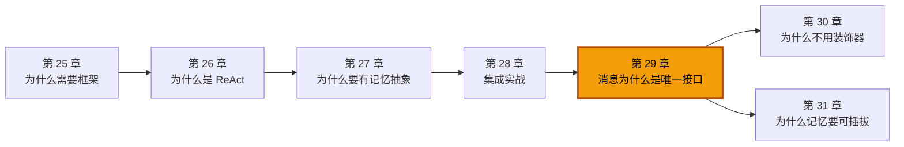
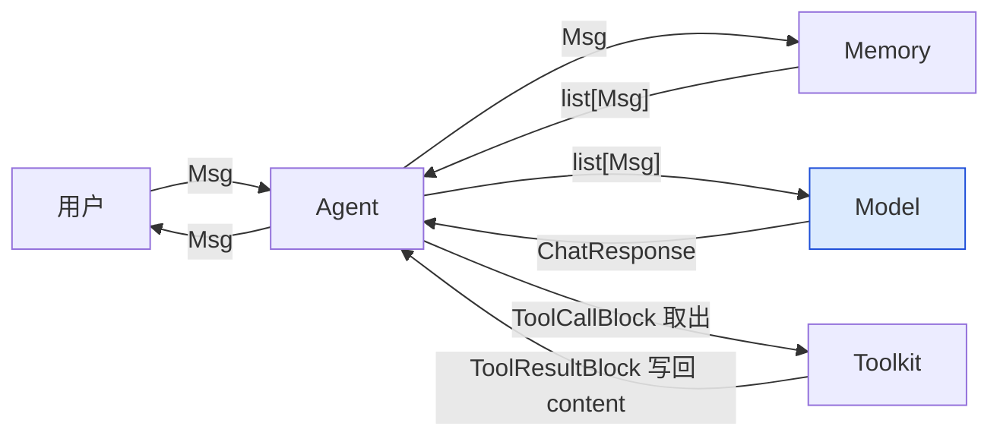

# 第 29 章 消息为什么是唯一接口

你在前面几卷里已经无数次见过 `Msg`：用户和 Agent 说话是 `Msg`，Agent 回话是 `Msg`，Agent 把工具结果写进记忆还是 `Msg`。一种对象，反复出现，几乎填满了整个系统的通信管道。这一章要回答的问题只有一句：**为什么是它一个？** 为什么不定义十几种消息类型，也不让 Agent 直接返回字符串？

> 一种数据结构，撑起了整个框架的通信。这听上去像偷懒，其实是一种刻意的设计选择——把"多态"从类的层次结构里搬出来，塞进一个对象的 `content` 列表里。

> **上一章：[第 28 章 终章：集成实战](../volume-3-building/ch28-integration-capstone.md)**

## 29.1 路线图

第四卷的主题是"为什么这么设计"。前一章我们用一个完整集成案例把所有组件串了一遍，你已经知道它们怎么协作；这一章我们退回来，专门盯住那条把它们串起来的"线"——`Msg`。后面几章会继续追问其它设计选择（工具注册、记忆形态等等）。



本章的路线是这样的：先看看 `Msg` 长什么样、它的 `content` 里能装什么；再讨论两个被否决的方案（多种消息类、纯字符串），理解为什么都被淘汰；然后剖析"单一类型"带来的好处和它必须付出的代价；最后看 `Msg` 自身提供了哪些支撑方法，让"唯一接口"这句承诺不是空话。

## 29.2 知识补全：Msg 到底是什么

在讨论"为什么唯一"之前，得先看清"唯一"的那个东西长什么样。`Msg` 是一个 Pydantic `BaseModel`，字段不多，但每一个都有用：

```python
class Msg(BaseModel):
    name: str                              # 发送者名字
    content: list[ContentBlock]            # 内容，永远是内容块列表
    role: Literal["user", "assistant", "system"]  # 角色
    id: str                                # 唯一标识
    metadata: dict                         # 任意附加数据
    created_at: str                        # 创建时间
    finished_at: str | None                # 完成时间（流式时填）
    usage: Usage | None                    # token 用量
```

这里有几个值得立刻记住的设计选择。

**第一，`content` 永远是列表。** 不管你想表达一句"你好"，还是一段夹杂着思考、工具调用、图片的复杂回复，`content` 都是 `list[ContentBlock]`。区别只在于列表里装的是什么块。如果用户传进来一个纯字符串，框架会自动把它包成一个 `TextBlock` 再放进列表——这种"自动包装"是构造函数帮你做的，对调用者来说写 `Msg("alice", "你好", "user")` 和写 `Msg("alice", [TextBlock(text="你好")], "user")` 等价。

**第二，`role` 只有三个值。** 这是直接对齐了主流大模型 API 的角色约定（OpenAI、Anthropic、Gemini 都用这三个）。这意味着 `Msg` 在结构上就与模型 API 同构，翻译到具体的厂商格式时几乎不需要做角色层面的改写。

**第三，角色会反向约束内容。** `Msg` 在校验时会检查：`user` 角色的消息只允许放 `TextBlock` 和 `DataBlock`（图片、音频这类二进制），`system` 角色只允许放 `TextBlock`，只有 `assistant` 角色才能放 `ToolCallBlock`、`ThinkingBlock` 这些"模型产物"。这是一种很有意思的约束——它把"谁可以产生什么内容"的语义编进了类型系统里。

### content 里的六种积木

`ContentBlock` 不是单个类，而是一个联合类型，目前有六种：

| 块类型 | 谁来产生 | 装什么 |
|--------|---------|--------|
| `TextBlock` | 任何角色 | 一段纯文本 |
| `DataBlock` | user / assistant | 图片、音频、视频（base64 或 URL） |
| `ThinkingBlock` | assistant | 模型的思维链（reasoning） |
| `ToolCallBlock` | assistant | 模型发起的一次工具调用 |
| `ToolResultBlock` | assistant | 工具执行完返回的结果 |
| `HintBlock` | 系统注入 | 给模型的提示，传给 API 时转成 user 消息 |

这张表里藏着两个微妙之处。一是 `ToolCallBlock` 和 `ToolResultBlock` 都归在 `assistant` 角色下——这反映了"工具调用和结果都发生在模型的回复回合里"这个事实，而不是说工具是模型自己执行的。二是 `HintBlock` 很特别，它本身不是模型产物，而是框架在 ReAct 循环里塞进去的"提示给模型看的旁白"，但在传给厂商 API 时会被 Formatter 转译成普通的 user 文本。

> **设计一瞥**：`content` 用"块的联合类型 + 一个列表"来表达多态，而不是给每种内容做一个子类。这背后的取舍是——块与块之间的差异是数据形态的差异，不是行为的差异。用 `type` 字段加一个联合类型（Union）就够，没必要继承。

用一个日常类比来建立直觉：把 `Msg` 想象成一个**快递包裹**。`name` 是寄件人，`role` 是寄件人身份（个人/公司/系统），`content` 是包裹里的物品清单——清单可能只有一件（一封短信），也可能是个混装（一封信、几张照片、一张工具使用申请单）。无论装什么，外面那个包裹壳永远是同一种规格。这正是"唯一接口"想要的效果。

## 29.3 单一类型如何撑起整条流水线

现在来看 `Msg` 在系统里到底流过哪些环节。下图是一次完整对话的数据流，注意箭头上的标注——几乎全是 `Msg` 或 `Msg` 的列表：



有一个地方值得特别强调：**Model 直接吃的就是 `list[Msg]`**。和上一卷讲的不同，AgentScope 2.0.1 里 Formatter 并不在 Agent 和 Model 之间作为独立的中转站，而是藏在 Model 适配器内部——`Model.__call__` 接收 `list[Msg]`，进到适配器里才调 `self.formatter.format(messages)` 把 `Msg` 翻译成厂商 API 要的 `list[dict]`。换句话说，**从用户一直走到模型边界，全程都是 `Msg`**；只有跨过最后一道门、要打进具体厂商的 HTTP 接口时，才翻译成字典。

这恰恰是"唯一接口"最实在的体现：你可以把一个 `Msg` 实例从用户手里直接交给 Memory、再交给 Model，不需要任何类型转换。每一站都认识它，每一站都知道从它的 `content` 里取自己关心的那部分。

把它和"快递分拣中心"做个对比就清楚了：分拣中心里所有传送带上跑的都是同一种规格的包裹（`Msg`），不同工位（Memory、Model、Toolkit）根据需要打开包裹看不同的物品块。如果每种物品都得用一种不同规格的包裹，分拣线就得为每种包裹单独建一条，复杂度立刻爆炸。

## 29.4 被否决的方案一：多种消息类型

最直觉的替代方案是给每种语义的消息单独做一个类：

```python
class UserMessage: ...      # 用户说的话
class AssistantMessage: ... # 模型的回复
class ToolMessage: ...      # 工具结果
class SystemMessage: ...    # 系统提示
```

这是 LangChain 走的路子——`HumanMessage`、`AIMessage`、`ToolMessage`、`SystemMessage` 各自一个类。听上去类型更精确，但代价立刻显现。

**代价一：类型爆炸。** 每增加一种新场景，就得定义一个新类，再为它写一遍序列化、一遍反序列化、一遍"怎么转成厂商 API 格式"。`Msg` 现在能装六种内容块，按这种思路就得是六个类起步；以后模型学会了输出视频，又得加一个 `VideoMessage`。

**代价二：接口割裂。** Memory 的 `add()` 方法要怎么签名？写 `UserMessage | AssistantMessage | ToolMessage | SystemMessage` 这种丑陋的联合类型，还是写一个共同的基类再让四个类继承？前者难维护，后者等于绕一圈又回到"基类统一"。

**代价三：转换税。** Agent 内部从模型拿到回复、又要把工具结果拼进去，得在几种消息类之间反复 new 来 new 去。本来一次 `append` 就能搞定的事，变成一系列类型构造。这种税在 ReAct 循环里特别致命——每一轮 reasoning-acting 都要拆开模型回复、取出工具调用、执行、再把结果以另一种消息类的形态拼回去，循环 N 次就交 N 次税。

**代价四：多模态无处安放。** 当消息要同时携带文本和图片，多种消息类的方案要么再加一个 `MultiModalMessage`（又是一个类），要么让每个类都支持可选的图片字段（把所有类都变臃肿）。无论怎么选，"多模态"都成了一个需要被特殊对待的特例，而不是默认能力。

这四个代价指向同一个深层问题：**按角色切分类型，是在错误的维度上做分类**。角色只有三个值，是粗粒度的；真正承载信息多样性的是内容，是细粒度的。把类型系统挂在粗粒度的维度上，等于让"用户消息"这个壳被迫承载"纯文本""图片+文本""工具结果"等差别巨大的内容形态，壳和内容对不上。

AgentScope 的选择正好相反：**一个 `Msg` 类 + `role` 字段区分身份 + `content` 列表区分内容形态**。角色用枚举表达，内容用联合类型表达，身份和内容是两个独立的维度，互不绑架。这样分类的颗粒度落在了真正承载多样性的维度（内容）上，角色只负责贴一个轻量标签。

> **设计一瞥**：在"按角色分"和"按内容分"之间，AgentScope 选了"按内容分"。"角色"其实是个很粗的标签（就三个值），而"内容"才是真正承载信息的地方。把分类的颗粒度放在内容上，让角色退回成一个字段，是一种把复杂度押在正确维度的做法。

## 29.5 被否决的方案二：纯字符串

另一个极端是干脆什么都不要，让 Agent 直接返回字符串：

```python
async def reply(self, msg: str) -> str: ...
```

这种方案简单到诱人——但它在第一步就撞墙了：**模型一次回复里经常同时包含文字和工具调用**。模型一边说"我去查一下北京天气"，一边真的发出了一次 `get_weather` 的调用请求。这两部分是同一次回复里并列的产物，谁也不能丢。一个字符串装不下它们，除非你发明一套转义语法把工具调用编进文本里——那就是在自己造一个比 JSON 还难用的格式。

纯字符串还有别的硬伤：**没有地方放元数据**。token 用量、创建时间、消息 id、流式的 `finished_at` 时间戳……这些数据本身不是"内容"，但系统处处要用。把它们塞进字符串需要约定分隔符，从字符串里解析回来又要写解析器，最后你重新发明了一个更糟的 JSON。

**流式生成更是灾难。** 现代模型回复常常是流式的——一段文字吐到一半，模型决定发一次工具调用，然后继续吐文字。AgentScope 2.0.1 用 `Msg` 上的 `append_event` 方法处理这种场景：每个流式事件到来时，往 `content` 列表里追加或更新对应的块（`TEXT_BLOCK_DELTA` 给现有 `TextBlock` 追加字符，`TOOL_CALL_START` 新开一个 `ToolCallBlock`，等等），同时累积 `usage`、盖 `finished_at` 时间戳。一个字符串做不到"边收边拼"——它既无法表达"一段还没说完的文字 + 一个正在累积参数的工具调用"这种中间态，也无法在拼接过程中同步维护 token 用量。流式恰恰是字符串方案最无力的一幕。

AgentScope 的回答是 `content` 用列表：简单场景列表里就一个 `TextBlock`，复杂场景列表里可以混排 `TextBlock` + `ToolCallBlock` + `ThinkingBlock`。同一份数据结构，既能表达"一句话"，也能表达"一句话加一次工具调用加一段思考"，不需要切换类型。

```python
# 一句话——内部其实是 [TextBlock(text="你好")]
UserMsg("alice", "你好")

# 一次完整的助手回复
AssistantMsg("weather_bot", [
    TextBlock(text="我来查一下北京天气"),
    ToolCallBlock(id="c1", name="get_weather", input='{"city":"北京"}'),
])
```

注意 `input` 是字符串形式的 JSON——这是为了适配流式生成时"参数一点一点累积"的真实场景，模型吐出来的参数本来就是字符流。

## 29.6 单一接口的收益

把上面两条否决的路径走完，就能看清"唯一接口"到底赢在哪里。

**收益一：通用接口，零适配。** 任何新组件——一个 `Planner`、一个 `Critic`、一个未来的 `Router`——只要学会读写 `Msg`，就能无缝接入系统。它不需要知道"对方发过来的是哪种消息类"，也不用为了和 Memory 对话而学一套新签名。这是降低框架扩展成本的关键。

**收益二：序列化只写一遍。** 因为 `Msg` 是 Pydantic `BaseModel`，序列化和反序列化是免费送的：`msg.model_dump()` 出字典，`Msg(**d)` 从字典恢复。所有内容块本身也是 `BaseModel`（或本质是 dict 的结构），嵌套序列化不需要任何手工代码。Memory 要把消息存进 Redis、RAG 要把消息拼进上下文，都直接复用这一套。

**收益三：扩展内容不碰 Msg 本身。** 假如明天有家模型厂商发明了一种新的输出形态（比如"置信度块"），AgentScope 只需要在 `ContentBlock` 联合类型里加一个 `ConfidenceBlock`，`Msg` 的字段一个都不用改。这就是把多态下沉到联合类型带来的好处——新增是加法，不是改法。

**收益四：泛化能力。** 文本、图片、音频、视频、工具调用、思维链、工具结果……全都能装进同一艘船。这让"多模态 Agent"在框架层面不是特例，而是默认能力。

> AgentScope 1.0 论文里把这件事说得很清楚：他们"抽象出 Agent 应用必需的基础组件，并提供**统一的接口**与可扩展的模块"。
>
> —— AgentScope 1.0: A Comprehensive Framework for Building Agentic Applications, arXiv:2508.16279, Section 2

"统一消息格式（unified message format）"不是一句口号，而是整个框架协同的根基——所有组件用同一种 `Msg` 通信，才保证了它们能无缝组合。

## 29.7 单一接口的代价

但世上没有免费的设计。单一类型也带来了三笔必须正视的账单。

**代价一：运行时才能发现的类型错误。** `content` 是 `list[ContentBlock]`，但具体装的是 `TextBlock` 还是 `ToolCallBlock`，静态类型检查器看不到——它只能告诉你"里面是某种 ContentBlock"。如果你写 `msg.content[0].text`，而那一条碰巧是 `ToolCallBlock`，类型检查不会报错，运行时才会炸。框架用 `role` 校验在构造时挡住一部分明显错误（比如 user 角色塞 ToolCallBlock 会直接抛异常），但挡不住"在 assistant 消息里取一个不存在的 `.text` 字段"这类问题。

**代价二：角色语义的隐性约定。** `role` 只有三个值，但现实里的语义要丰富得多。比如工具结果在 OpenAI API 里约定用 `tool` 角色，但 AgentScope 把它装进 `assistant` 角色的 `ToolResultBlock` 里——这是为了让"一次模型回复回合"在 `Msg` 层面保持完整。这种映射是合理的，但读代码的人需要知道约定，否则会觉得"为什么工具结果是 assistant 角色发的"。Formatter 在翻译成厂商 API 时会再做一次角色改写。

**代价三：metadata 是个无底洞。** `metadata: dict` 是个自由字典，框架对它不做任何校验。这让它非常适合放"框架不关心但应用需要"的附加数据（比如结构化输出的 schema、业务追踪 id）。但同时，它也是个诱人的垃圾桶——什么都可以往里塞，久而久之就没人说得清每个 key 是谁写进去的、谁在用。社区项目里这类"自由字典"通常会随时间膨胀，是单一接口最大的长期风险。

这三笔账加起来，其实就是"灵活"和"严格"之间的经典权衡。AgentScope 明确地押在了灵活这一边——在框架层让类型宽松，把严格性留给具体应用自己用 Pydantic 模型去约束。

### 横向对比

把主流框架放一起看，这个权衡就更清楚了：

| 框架 | 消息形态 | 优势 | 代价 |
|------|---------|------|------|
| **AgentScope** | 1 个 `Msg` 类 + 6 种内容块 | 接口统一、扩展是加法、多模态原生 | 运行时类型检查、metadata 易膨胀 |
| **LangChain** | 4+ 个消息类（Human/AI/Tool/System…） | 角色类型严格、可读性好 | 类型爆炸、跨类转换成本高 |
| **AutoGen** | 字典 | 极灵活、无类定义 | 完全无类型检查、靠约定 |
| **CrewAI** | 字符串 + 元组 | 极简、上手快 | 无法承载多模态与工具调用的复杂组合 |

可以看到，四种选择其实是同一条光谱上的四个点：从"完全自由"（AutoGen 的字典）到"完全严格"（LangChain 的多类），AgentScope 选的是中间偏自由的位置——一个类加联合类型，既有类型骨架，又不被角色枚举绑死。

## 29.8 让"唯一接口"成立的支撑方法

如果说前面讲的还是"为什么这样设计"，那这一节回答的是"凭什么能这样设计"。`Msg` 敢说自己是唯一接口，是因为它自己提供了足够多顺手的方法，让消费者**不需要手动去翻 `content` 列表**。

**类型安全地取块。** `get_content_blocks()` 配合 `@overload`，让你能精确地取某一类块，而且类型检查器知道返回的确切类型：

```python
calls = msg.get_content_blocks("tool_call")   # 返回 list[ToolCallBlock]
text  = msg.get_content_blocks("text")         # 返回 list[TextBlock]
all_  = msg.get_content_blocks()               # 返回 list[ContentBlock]
```

第一行之后，`calls[0].name`、`calls[0].input` 这些字段类型检查器都认识——这就是 overload 的威力，它用静态层面的"多签名"骗过类型系统，让你不用写 `cast` 也能拿到精确类型。这件事和第 30 章讲的"用联合类型代替继承"是一脉相承的思路：**用类型系统的手段（Union + overload）提供多态，而不是用 OOP 的子类继承**。

**便捷的纯文本提取。** `get_text_content()` 把"列表里有几个 TextBlock"这件事压扁成一句字符串：

```python
msg.get_text_content()  # 把所有 TextBlock.text 用 \n 拼起来；没有文本块则返回 None
```

对那些只关心"用户到底说了啥文字"的下游组件（比如日志、UI 渲染），这一个方法就够了，完全不用关心 `content` 里还混着什么别的块。

**存在性检查。** `has_content_blocks()` 让你一句话判断"这条消息里有没有工具调用"：

```python
if msg.has_content_blocks("tool_call"):
    ...  # 走工具执行分支
```

**序列化是免费的。** 因为 `Msg` 是 Pydantic `BaseModel`，`model_dump()` 把整个对象（含嵌套的所有块、`metadata`、`usage`）序列化成纯字典和列表；反过来 `Msg(**d)` 能完整还原，连 `id` 都不丢。这意味着 Memory 存取、跨进程传输、日志落盘，都不需要写一行序列化代码。

> **设计一瞥**：`get_content_blocks` 的 `@overload` 是一种"穷人版多态"——不用子类也能实现类型安全的返回值。配套的 `has_content_blocks`、`get_text_content` 则是把"最常见的几种读取姿势"做成了一行 API。这套支撑方法的存在，让"唯一接口"从一句设计宣言变成了一个真的好用的事实：消费者绝大多数时候根本不需要知道 `content` 的内部结构。

## 29.9 设计一瞥：把多态从继承里搬出来

回头看整章，`Msg` 的设计可以浓缩成一句话：**把多态从类的继承树里搬出来，搬进一个对象的字段里**。

传统 OOP 的做法是定义一个 `Message` 基类，再派生 `TextMessage`、`ToolCallMessage`、`ImageMessage`……每加一种内容，新建一个子类，重写一遍序列化。AgentScope 的做法是保留一个 `Msg` 类，把"内容形态的多样性"塞进 `content` 这个列表里，用 `ContentBlock` 联合类型表达多态，用 `role` 这个枚举表达角色维度。

这种做法的好处是**加法式扩展**：新增一种内容块不需要碰 `Msg`，不需要改任何消费者的签名，只需要在联合类型里加一个新成员。代价是消费者在读取时要做类型分流（正是 `get_content_blocks` 存在的理由）。

这是一笔非常清醒的交易：把"写新类"的成本换成"读时分流"的成本。在一个内容形态会持续增长（今天有文本和图片，明天可能有视频和置信度）的领域里，这个交易是划算的——因为写的次数少、读的次数多，而且读的姿势可以被工具方法（`get_content_blocks`、`get_text_content`）封装掉。

## 检查点

**1. 为什么 `content` 永远是 `list[ContentBlock]`，而不是 `str | list`？**

因为消息内容天然可以是"多种形态混排"的：模型一次回复里可能既有文字又有工具调用。如果 `content` 允许是纯字符串，"一句话"和"多种内容"就会走两条不同的数据通路，消费者得先判断类型再处理。统一成列表（纯字符串自动包成 `[TextBlock]`）让所有消息走同一条路，类型分流交给 `get_content_blocks` 这种工具方法。代价是写 `Msg("a", "hi", "user")` 时心里要清楚它内部其实是 `content=[TextBlock(text="hi")]`。

**2. `ToolCallBlock` 和 `ToolResultBlock` 为什么都是 `assistant` 角色？它们不是工具产生的吗？**

它们确实是工具执行的结果，但在语义上它们都发生在"模型的那一次回复回合里"——模型发起调用（`ToolCallBlock`），框架执行工具，结果（`ToolResultBlock`）作为同一回合的延续。把它们归在 `assistant` 角色下，让"一次完整的模型动作"在 `Msg` 层面保持完整。Formatter 在翻译成具体厂商 API 时会再根据需要做角色改写（比如把 tool result 单独翻译成 OpenAI 的 `tool` 角色消息）。

**3. 如果要加一种全新的内容块（比如"置信度块"），需要改 `Msg` 本身吗？**

不需要。只需要在 `ContentBlock` 联合类型里加一个 `ConfidenceBlock`（它自己是一个 Pydantic `BaseModel`，带 `type: Literal["confidence"]` 字段），然后让相关的 Formatter 知道怎么翻译它。`Msg` 的字段、构造函数、序列化代码一行都不用动——这就是把多态下沉到联合类型带来的"加法式扩展"。

**4. `metadata: dict` 是单一接口设计里最危险的部分，为什么？**

因为框架对它完全不做校验，任何 key 都可以塞进去。这让它既能优雅地承载"框架不关心、应用需要"的附加数据（schema、追踪 id），也容易沦为什么都往里扔的垃圾桶。一旦多个组件都往 `metadata` 写同名字段、或者依赖某个没文档化的 key，就会形成隐性的全局耦合。缓解的办法是应用层用 Pydantic 模型约束自己写入 `metadata` 的结构，把它从"自由字典"变成"有 schema 的字典"。

**5. Model 直接接收 `list[Msg]`，那 Formatter 在哪里？**

Formatter 不在 Agent 和 Model 之间作为独立中转站，而是藏在 Model 适配器内部。`Model.__call__` 接收 `list[Msg]`，进到具体厂商适配器里才调 `self.formatter.format(messages)` 把 `Msg` 翻译成厂商 API 要的 `list[dict]`。这样的设计让 `Msg` 的"唯一接口"地位一直延伸到模型边界——只有跨过最后一道门、要打进具体厂商 HTTP 接口时，才发生翻译。

## 下一站预告

`Msg` 解决了"通信用什么形状"的问题，让所有组件能无缝对接。但工具系统还有另一个设计选择值得追问：**工具函数为什么是用 `toolkit.register_tool_function(func)` 这种显式调用注册的，而不是在函数头上加 `@tool` 装饰器？** 装饰器看起来更"Pythonic"，AgentScope 却选了更显式的路。下一章我们看这个选择背后的取舍。

> **下一章：[第 30 章 为什么不用装饰器注册工具](./ch30-no-decorator.md)**
