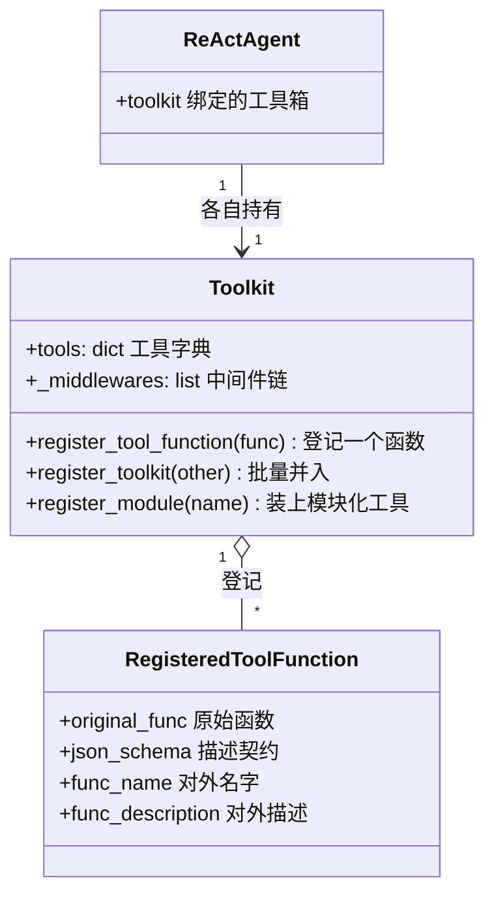
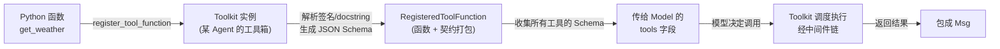

# 第 30 章 为什么不用装饰器注册工具

如果你看过别的 Agent 框架的教程，第一眼撞见的往往是一行装饰器：在函数头上敲一个 `@tool`，这个函数就被"注册"成工具了，简洁得像变魔术。等你翻开 AgentScope，却看到的是另一种姿势——先建一个 `Toolkit` 对象，再把函数喂给它的一个方法。多写了几个字符，看上去更啰嗦。这章要回答的就是：**这多出来的几步，究竟买到了什么？**

> 装饰器把"注册"这件事藏到了一个语法糖里；显式调用把"注册"暴露成一个动作。前者好写，后者好懂、好隔离、好在运行时做决策。

> **上一章：[消息为什么是唯一接口](./ch29-msg-interface.md)**

## 30.1 路线图

第四卷一直在追问"为什么这么设计"。上一章我们盯住的是消息这条线——为什么所有通信都用 `Msg` 一种对象。这一章把目光转向工具：注册一个工具，框架为什么偏要让你多写一个 `toolkit.register_tool_function(...)`，而不是给函数贴个标签了事。


本章的走法是：先把两种注册姿势摆在一起，看清它们到底差在哪；再用一个饭店后厨的类比建立直觉；接着剖析被否决的"全局装饰器"方案，看清它在哪里摔跟头；然后看 AgentScope 选择的"实例级注册"到底买到了什么、又付了什么代价；最后看一个常被忽略但很关键的副产品——同一个函数可以在不同工具箱里戴着不同的"面具"出场。

## 30.2 知识补全：工具注册到底在注册什么

讨论"怎么注册"之前，先得明白"注册"是在注册什么。

在 AgentScope 里，一个工具本质上是 **一个 Python 函数 + 一份描述它的元数据**。元数据从哪来？框架会读这个函数的签名、类型标注和 docstring，自动把它翻译成一份 JSON Schema——也就是告诉大模型"这有个工具叫这个名字，它接收这几个参数，参数分别是这些类型、这个含义"。大模型拿到这份 Schema，才能判断要不要调用这个工具、调用时该填什么参数。

```python
def get_weather(city: str) -> ToolResponse:
    """获取指定城市的天气"""
    ...
```

就这么一个函数，框架能自动产出大致这样一份契约：工具名 `get_weather`，有一个必填字符串参数 `city`，描述是"获取指定城市的天气"。

> **设计一瞥**：docstring 和类型标注不只是写给人看的注释，它们同时是写给的"机器看的说明书"。一次书写，两个读者——人类读语义、模型读契约。注册工具，本质上是把这份双用途的书写，正式"装订"成一份可被调度的契约。

那么"注册"这个动作，做的就是 **把函数 + 元数据收进一个工具箱，登记造册，等待被大模型查阅和调用**。问题是：这个"造册"应该发生在哪一层？是发生在全局——所有工具都进一个公共大册子；还是发生在某个具体对象上——每个对象有自己的小册子？这正是这一章的分水岭。

## 30.3 两种姿势摆在一起

先用最短的示意片段看清两种姿势长什么样。

LangChain 风格的装饰器注册，大致是这样：

```python
@tool
def get_weather(city: str) -> str:
    """获取天气"""
    ...
```

AgentScope 的显式实例级注册，是这样：

```python
toolkit = Toolkit()
toolkit.register_tool_function(get_weather)
```

看起来装饰器只是少写了一行。但差别藏在"这个 `@tool` 把函数注册到哪去了"这个问题里。

**装饰器是一个语法糖，它在你定义函数的那一刻就执行了。** 也就是说，Python 解释器读到 `@tool` 那一行时，会立刻把 `get_weather` 这个函数对象塞进某个地方——在纯装饰器的世界里，那个"某个地方"通常是一个框架维护的全局注册表。函数定义即注册，全局生效，无差别可见。

而 `toolkit.register_tool_function(...)` 是一个 **方法调用**，它把函数塞进了 `toolkit` 这个特定对象内部的字典里。函数定义和注册被解耦了：你先定义函数，再 **决定** 要把它登记到哪个工具箱、要不要登记、什么时候登记。

## 30.4 一个类比：饭店后厨的刀架

想象两家饭店。

第一家饭店有一个 **公共刀架**，立在厨房正中央。所有厨师进厨房时，都从同一把刀架上取刀。新来的厨师想加一把自己的刀，就把它往公共刀架上一插，全厨房立刻都看得到这把刀。简单，省事。问题来了：今天来了一位专门做刺身的师傅，他的刀别人不能碰；又来了一位只做甜点的师傅，她根本不该看到杀鱼的刀。可所有刀都摆在一个架子上，谁该拿哪把、谁不该碰，全靠口头规矩和自觉。

第二家饭店是 **每位厨师一个刀箱**。师傅上岗时，主管按他的工种，往他自己的刀箱里发哪几把刀，他就用哪几把。刺身师傅的箱子里只有刺身刀，甜点师傅的箱子里只有裱花刀。同一个"削皮刀"，可以同时发到三个师傅的箱子里——它在每个箱子里都叫削皮刀，干一样的活。想要换工种？关箱、发新刀，互不干扰。

装饰器全局注册，是第一家饭店——一个公共刀架，所有人的刀都在上面。实例级注册，是第二家饭店——每个智能体一个刀箱，发什么刀、什么时候发，由现场主管（你的应用代码）决定。

> **设计一瞥**：工具不是函数的全局属性，而是某个智能体此刻的"能力清单"。一个函数能不能用、对谁可用、以什么名字可用，应该是 **由场景决定** 的，而不是 **由函数定义那刻决定** 的。

## 30.5 被否方案：全局装饰器

把"全局刀架"方案正经摆出来，是这样的——一个全局装饰器，函数定义即注册，进了一张公共大表：

```python
@tool(name="get_weather", description="获取天气")
def get_weather(city: str) -> str:
    ...
```

写起来确实干净，一行搞定。但在多智能体场景里，它会撞上三堵墙。

**第一堵墙：所有智能体被迫共享同一套工具。** 全局注册表里有什么，每个智能体就能调什么。可真实业务里，权限往往是分层的。设想你的系统里有两个 Agent：一个面向普通用户，一个面向管理员。管理员 Agent 手里有一把"删除数据库"的刀，普通用户 Agent 不该碰。在全局注册模型下，这把刀只要定义了，就对全局可见——你只能事后想办法把某个 Agent 从公共表里"减掉"，既别扭又容易漏。

```python
@tool
def admin_delete_database():  # 这把刀一旦定义，全局可见
    ...

# 普通用户的 Agent 怎么"看不到"这把刀？全局表里没有"按 Agent 过滤"的概念
agent_a = ReActAgent(..., tools=???)
```

**第二堵墙：测试之间互相污染。** 全局注册表是个全局可变状态。上一个测试往里加了一把刀，下一个测试如果不手动清理，那把刀就还在那里。写单元测试的人都知道，"看不见的全局状态"是 flaky test（不稳定测试）的头号嫌疑人——你的测试在自己机器上绿油油，到 CI 上偶尔红一下，因为执行顺序变了，全局表里残留了别的东西。为了对付它，你得在每个测试的 setup/teardown 里手动清空全局表，又脏又容易忘。

**第三堵墙：运行时无法做决策。** 全局装饰器在 **函数定义的那一刻** 就把注册做完了，这意味着你没法根据运行时的情况决定要不要注册、注册到哪。比如你想"只有当用户拥有天气权限时，才把 `get_weather` 发给他的 Agent"——在全局模型下，这个条件判断无处下手，因为函数早被注册走了。

> **设计一瞥**：装饰器把"注册时机"焊死在了"导入时机"上。导入一个模块，副作用就是工具被注册了——这是一种隐式副作用，也是全局可变状态之所以难管的根源。显式调用把注册时机还给程序员，副作用就变成了一条你看得见、读得懂的语句。

## 30.6 AgentScope 的选择：实例级注册

AgentScope 把"刀架"从一个全局单例，变成了每个智能体各自持有的一个工具箱对象。注册动作落在实例上，而不是落在全局表上。

概念上，`Toolkit` 是这么个东西：它内部维护一张 **属于自己的工具字典**，每条登记记录是一个把"函数 + 元数据"打包好的结构体；此外还能挂一串中间件（middleware），用来在工具调用前后插逻辑。



这张类图说的是三件事：`Toolkit` 持有一张工具字典和一串中间件；字典里每条记录把"原始函数"和"对外契约"打包在一起；每个 `ReActAgent` 持有自己的 `Toolkit` 实例。**工具的归属是顺着"Agent → Toolkit → 工具"这条对象引用链找到的，而不是去查一张全局表。**

这么一改，前面三堵墙全都塌了。

**多智能体各持其刀**：管理员和普通用户各建各的工具箱，互不可见。

```python
admin_toolkit = Toolkit()
admin_toolkit.register_tool_function(delete_database)

user_toolkit = Toolkit()
user_toolkit.register_tool_function(query_database)

admin_agent = ReActAgent(..., toolkit=admin_toolkit)
user_agent   = ReActAgent(..., toolkit=user_toolkit)
```

普通用户的 Agent 从结构上就不可能碰到 `delete_database`——它压根不在它的工具箱里，连读都读不到。这不是靠"运行时权限检查"兜的底，而是靠 **对象隔离** 从根上杜绝的。

**运行时按需发刀**：注册变成了一条普通语句，于是你可以用任何控制流来决定发不发。

```python
toolkit = Toolkit()
if user_has_permission("weather"):
    toolkit.register_tool_function(get_weather)
if user_has_permission("database"):
    toolkit.register_tool_function(query_db)
```

发不发刀，跟用户的权限、当前的会话、A/B 实验的分桶挂钩都没问题——因为这就是普通的 `if` 语句，不是什么特殊机制。

**测试天然隔离**：每个测试 `new` 一个 `Toolkit`，测完对象被垃圾回收，自然清空。不用手动 cleanup，不会有残留。

```python
def test_a_tool():
    toolkit = Toolkit()                 # 每个测试一个全新实例
    toolkit.register_tool_function(my_tool)
    # 测试结束，toolkit 出作用域即销毁，零全局污染
```

## 30.7 数据是怎么流动的

把注册之后的整条链路画出来，能更清楚地看到"实例级"这三个字是怎么一路传递下去的。



注意中间那个 `Toolkit 实例` 节点——它是整条链路的"分叉点"。不同的 `Toolkit` 实例，从同一些 Python 函数出发，会各自生成各自的 `RegisteredToolFunction` 集合，进而各自生成各自的 `tools` 字段传给各自的模型。**全局注册的版本里，这个分叉点是不存在的——只有一条公共链路，所有人都走它。** 实例级注册最根本的价值，就是把这个分叉点显式地建了出来。

## 30.8 横向对比

把几个主流框架的注册方式摆在一起，能看出一条清晰的谱系。

| 框架 | 注册方式 | 作用域 | 多 Agent 隔离 |
|------|---------|--------|---------------|
| **AgentScope** | `toolkit.register_tool_function()` | 实例级 | 天然隔离 |
| **AutoGen** | 函数列表作为参数传入 | 实例级 | 天然隔离 |
| **CrewAI** | 装饰器 + 类方法 | 类级 | 部分隔离 |
| **LangChain** | `@tool` 装饰器 | 全局 | 需手动过滤 |

两个以多智能体为核心卖点的框架——AgentScope 和 AutoGen——都不约而同地选了实例级。这不是巧合。**当系统的常态是"多个智能体协作、各司其职"时，工具集天然就该是每个智能体私有的、可独立组装的。** 全局注册是单智能体时代的简洁默认值，到了多智能体时代就成了负担。

AgentScope 1.0 论文对工具系统的定位是这样写的：

> "flexible and efficient tool-based agent-environment interactions for building agentic applications"
>
> —— AgentScope 1.0: A Comprehensive Framework for Building Agentic Applications, arXiv:2508.16279, Section 1

这句"flexible"（灵活）背后，工具怎么注册、注册给谁，正是关键的一环。

## 30.9 一个被忽略的副产品：同名函数多副面孔

实例级注册还有一个常被忽略、但其实非常顺手的能力：**同一个函数，在不同的工具箱里可以戴着不同的面具出场**——不同的名字、不同的描述。

为什么 `register_tool_function` 接受可选的 `func_name` 和 `func_description` 参数？就是为了这：

```python
# 方法签名示意
register_tool_function(func, func_name=None, func_description=None)
```

设想同一个搜索函数，管理员和普通用户都能用，但你希望它在两边的"外观"不一样——管理员看到的是"全库检索"，普通用户看到的是"公开数据检索"：

```python
def search(query: str) -> ToolResponse:
    """搜索数据库"""
    ...

admin_toolkit.register_tool_function(search, func_name="admin_search",
                                      func_description="全库检索")
user_toolkit.register_tool_function(search, func_name="public_search",
                                    func_description="仅检索公开数据")
```

底层是同一份代码，但在管理员的工具箱里它叫 `admin_search`、自我介绍说"全库检索"；在普通用户的工具箱里它叫 `public_search`、只承认搜公开数据。大模型看到的，是两份不同的 JSON Schema，引导它在不同语境下提出不同的查询。

> **设计一瞥**：函数的身份（identity）和它在某个工具箱里的"对外形象"（projection）被拆开了。函数还是那个函数，但它对外的名字和描述，是注册那一刻才确定的、且可以随注册上下文而变。全局装饰器做不到这一点——`@tool(name=...)` 一旦写死，全局只有一副面孔。

这一步是在 **生成 JSON Schema 之前** 完成的：覆盖后的 `func_name` 和 `func_description` 会替换掉框架从 docstring 里解析出来的原始值，再交给 Schema 生成器（这一点和第 17 章讲过的工具元数据解析是同一条链路）。所以同一份 Python 代码，可以服务出 N 种不同的"工具契约"，而不需要复制 N 份函数。

## 30.10 收益与代价

把账算清楚。

**买到的：**

- **无全局状态**：工具的归属顺着对象引用链找，没有一张谁都能摸的公共表。
- **运行时灵活**：注册是一条语句，能塞进任何控制流，按权限、按场景、按实验分桶发刀。
- **多智能体天然隔离**：不同 Agent 各持其箱，从结构上杜绝越权。
- **测试友好**：`new` 一个实例即隔离，无残留、无 teardown 负担。
- **一函数多面孔**：同一函数在不同工具箱里可换名、换描述、换语义边界。

**付出的：**

- **多写两行**：得先建 `Toolkit` 实例，再调方法。对单工具、单 Agent 的小脚本，这点啰嗦是真实存在的。
- **装饰器不能"独立"使用**：AgentScope 也支持 `@toolkit.register_tool_function` 这种写法，但它绑定在某个 `toolkit` 实例上，不是脱离实例的全局装饰器。换句话说，你写不出一个"纯粹的全局 `@tool`"——这恰恰是设计者想要的，但对习惯了全局装饰器的人有个适应期。

> **设计一瞥**：这是一种典型的"用一点点书写成本，换一大块工程能力"的取舍。在单 Agent 的 demo 里，全局装饰器赢在简洁；一旦系统长成多智能体、要跑测试、要做权限分层，实例级注册的优势就开始指数级兑现。框架要服务的是后者。

## 检查点

1. **有人问你"为什么 AgentScope 不学 LangChain 用 `@tool`"，你会怎么用一句话回答？**
   答：全局装饰器把工具焊死在了一张公共表上，而 AgentScope 的常态是多个智能体各持其工具集，所以它选择把注册落在实例上，让工具的归属可隔离、可按需组装。

2. **如果一个系统里只有一个 Agent，实例级注册还有意义吗？**
   有，但收益变小。即使单 Agent，运行时按权限决定发哪些刀、测试时无全局残留、同一函数换多副面孔这些好处依然成立。只是"多写两行"的成本在小脚本里会显得更扎眼——这是诚实的代价。

3. **为什么说"装饰器在导入时就执行"是一个隐患？**
   因为这意味着导入一个模块会产生副作用（工具被注册），而这个副作用是隐式的、全局可见的。测试之间互相污染、工具在不该出现的地方出现，往往都源于这种"看不见的导入副作用"。显式调用把副作用变成了一条可读的语句，时序和作用域都清楚了。

4. **同一个函数在两个工具箱里用不同名字注册，这背后是什么机制？**
   `register_tool_function` 的可选参数 `func_name` / `func_description` 在生成 JSON Schema **之前** 覆盖掉函数的原始名字和 docstring 解析结果。所以同一个底层函数，对外可以投影出多份不同的契约。函数的身份不变，但它的"对外形象"是注册时确定的。

5. **横向对比里，为什么 AutoGen 和 AgentScope 都选了实例级？**
   两者都以多智能体协作为核心场景。当系统的常态是多个智能体各司其职、工具集需要按角色组装时，实例级注册是最自然的模型；全局注册则是单智能体时代的简洁默认值，在多智能体语境下会变成持续的抗争来源。

## 下一站预告

这一章聚焦在"工具怎么注册"——一个 API 形态上的取舍。但顺着工具这个话题往下看，还有另一个更大的问题在等着：所有跟工具相关的代码——注册、Schema 生成、中间件、调度、模块化加载——全都聚在一个 `Toolkit` 类里，文件有上千行。这是经典的"上帝类"（God Class）味道，还是一个合理的、内聚的设计？什么时候该把一个大类拆开，什么时候该让它继续胖下去？下一章我们看模块拆分这件事的权衡。

> **下一章：[上帝类 vs 模块拆分](./ch31-god-class.md)**
