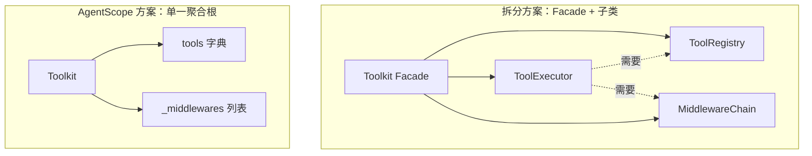

# 第 31 章 上帝类 vs 模块拆分

打开 `src/agentscope/tool/_toolkit.py`，你会看到一个近一千七百行的类——`Toolkit`。注册、调用、中间件、分组、Schema、异步任务、MCP 对接、技能系统、序列化，全塞在一起。第一反应通常是"这是上帝类（God Class），该拆了"。但 AgentScope 的维护者选择了不拆。这一章就来拆解这个选择：什么样的"大"是病，什么样的"大"只是聚合。

> **判断一个类是否过大，不要只看行数，要看职责之间是否共享同一套心智模型。**

> **上一章：[为什么不用装饰器注册工具](./ch30-no-decorator.md)**

## 31.1 路线图

这一章属于"为什么不"系列——为什么没有把 `Toolkit` 拆成一堆小类。


我们走过的路径是：先看 `Toolkit` 装了多少职责，再看被否决的"按职责拆类"方案，接着建立判断大类好坏的标准，最后用 `Toolkit` 和 `ReActAgent` 两个大文件做对照，看清"何时该拆、何时不该拆"。

## 31.2 知识补全：上帝类、内聚、聚合根

在进入 `Toolkit` 之前，先把三个容易被混为一谈的概念分清楚。

**上帝类（God Class）** 是一个贬义词。它指的是一个类知道得太多、管得太多，且管的这些事彼此并无紧密关联。经典症状是：改 A 功能时，B 功能的代码就在旁边碍眼；测试 A 必须连 B 一起初始化；新人打开文件完全找不到入口。上帝类的本质问题不是"大"，而是"低内聚 + 高耦合"。

**内聚（Cohesion）** 指一个模块内部各元素是否围绕同一个目标。一个类里所有方法都在谈"工具"，那是高内聚；一半在谈工具、一半在谈消息序列化、还有几个在管日志，那是低内聚。内聚是判断大类好坏的核心标尺。

**聚合根（Aggregate Root）** 借自领域驱动设计。它指的是一个对外统一暴露的对象，外部只通过它访问一组相关的子能力，不必关心内部如何切分。饭店里的服务员就是一个聚合根：点菜、催单、结账、开发票都找他，你不需要知道后厨分炒锅组、面点组、凉菜组。

> **设计一瞥**：聚合根的价值在于"隐藏内部边界"。只要对外接口稳定，内部怎么切分是自己的事。`Toolkit` 正是把自己定位成工具相关能力的唯一入口。

用一句话总结这三个词的关系：**大类未必是上帝类；只要内聚，大类可以是聚合根；拆分与否，取决于内聚度，而非行数。**

## 31.3 `Toolkit` 装了多少职责

先把 `Toolkit` 身上的职责摊开来看。下表归纳了它的主要方法组：

| 职责 | 代表方法 | 服务的概念 |
|------|---------|-----------|
| 注册工具 | `register_tool_function` | 把函数变成工具 |
| 调用工具 | `call_tool_function` | 执行工具并返回结果 |
| 中间件 | `register_middleware`、`_apply_middlewares` | 在调用前后插入逻辑 |
| 工具分组 | `create_tool_group`、`update_tool_groups` | 动态激活/停用一组工具 |
| Schema 管理 | `get_json_schemas`、`set_extended_model` | 生成给模型看的工具描述 |
| 异步任务 | `view_task`、`cancel_task`、`wait_task` | 跟踪后台执行的工具 |
| MCP 对接 | `register_mcp_client` | 接入外部 MCP 工具源 |
| 技能系统 | `register_agent_skill`、`get_agent_skill_prompt` | 工具之上的更高层封装 |
| 序列化 | `state_dict`、`load_state_dict` | 保存/恢复整个工具箱 |

九种职责，聚在一个类里。这就是引发"要不要拆"争论的源头。

值得注意的一点是：这九种职责**全部围绕"工具"这一个概念**。注册是为了有工具可调，调用是工具的核心动作，中间件是给调用加料，分组是控制哪些工具可见，Schema 是把工具翻译给模型，异步任务是工具执行的延伸，MCP 和技能是工具的两种来源/封装，序列化是工具箱的整体存档。它们共享同一套心智模型——"管理一个智能体能用的工具集合"。

## 31.4 被否决的方案：按职责拆成多个类

最直觉的重构方案，是每个职责拆成一个类，`Toolkit` 退化成一个门面（Facade）：

```python
class ToolRegistry:        # 只管注册
class ToolExecutor:        # 只管调用
class MiddlewareChain:     # 只管中间件
class ToolGroupManager:    # 只管分组
class SchemaBuilder:       # 只管 Schema

class Toolkit:             # Facade，组合上面这些
    def __init__(self):
        self.registry = ToolRegistry()
        self.executor = ToolExecutor(self.registry)
        self.middlewares = MiddlewareChain()
        self.groups = ToolGroupManager()
```

这看起来很"干净"，每个类职责单一。但维护者否决了它，理由可以归成四条。

**第一条，调用链被拉长。** 原本 `toolkit.register_tool_function(f)`，拆分后调用者要决定去找 `toolkit.registry.register(f)` 还是别的地方。聚合根的最大好处——"统一入口"——随之消失。对一个面向开发者的框架，API 表面积的简洁性往往比内部整洁更重要。

**第二条，状态共享变复杂。** `ToolExecutor` 调用工具时需要同时拿到已注册的函数（来自 `ToolRegistry`）和中间件链（来自 `MiddlewareChain`）。拆开之后，这些子类之间要么互相传引用，要么都由 `Toolkit` 居中转发——后者等于把拆出去的复杂度又搬回了门面，拆了个寂寞。

**第三条，序列化要协调多个子对象。** 一个 `state_dict` 就能存档整个工具箱，是因为所有状态都在一个对象里。拆分后，序列化代码要在多个子类之间游走，保证它们按一致的顺序和键名保存恢复，复杂度立刻上升。

**第四条，过度工程。** 绝大多数开发者只用 `Toolkit` 的注册和调用两组方法。为了少数人会用到的中间件、技能、MCP，把所有人都要经过的入口拆成五个类的协作图，是把局部复杂度转嫁给了全体使用者。

> **设计一瞥**：Facade 模式本身是好东西，但它的价值在于"对外简化、对内保留拆分"。当内部子类彼此紧耦合、必须协同工作时，Facade 就退化成了一层无意义的转发壳，反而增加了间接层。`Toolkit` 选择直接做大聚合根，省掉了这层壳。

可以把这个权衡画成一张图：



注意拆分方案里那条虚线——`ToolExecutor` 必须回头依赖 `ToolRegistry` 和 `MiddlewareChain`。子类之间的依赖网一旦织起来，Facade 就压不住内部复杂度了。

## 31.5 怎么区分"上帝类"和"大聚合类"

既然大不一定坏，那判断标准是什么？下表把两种形态对着看：

| 维度 | 上帝类（坏） | 大聚合类（可接受） |
|------|-------------|------------------|
| 职责关系 | 职责之间互不相关 | 职责围绕同一概念 |
| 修改影响 | 改一处会牵连其他职责 | 修改被方法边界隔离 |
| 可测试性 | 难以独立测试单个功能 | 每个方法组可独立测试 |
| 对外接口 | 接口臃肿、调用者无所适从 | 接口简洁、单一入口 |
| 数据共享 | 多个不相关的数据子集混在一起 | 共享核心数据结构 |

`Toolkit` 落在右侧。它的所有方法围绕"工具"展开，注册、调用、分组共享同一个 `tools` 字典，中间件用独立的 `_middlewares` 列表互不干扰，每个方法组都能单独写测试。它大，但内聚。

这里有一个反直觉的判断点：**共享同一份数据，往往是高内聚的信号，而不是低内聚的证据。** 很多人误以为"一个类应该只碰一份数据"，于是看到 `Toolkit` 同时管 `tools` 字典和 `_middlewares` 列表就想拆。但真正的判据是：这些数据是否服务于同一个概念。`tools` 和 `_middlewares` 都服务于"让工具调用可被注册、可被增强、可被执行"这件事，它们属于同一个聚合。

> **设计一瞥**：Refactoring Guru 把"过大的类"归入 Bloaters（膨胀体）这类代码味道，并提示它们通常不是一夜之间长成的，而是随着程序演进慢慢累积。它给出的处理手段是 Extract Class——但前提是"一部分方法使用独立的数据子集"。`Toolkit` 的中间件方法确实只碰 `_middlewares`，理论上满足提取条件；而注册、调用、分组方法都共用 `tools` 字典，不满足。这就是为什么维护者认为"中间件可拆，其余不可拆"。

## 31.6 实际的边界：方法组而非类

虽然 `Toolkit` 没有拆类，但它内部有清晰的方法组边界。开发者实际接触到的 API 形态是这样的：

```python
# 注册相关：往工具箱里放工具
toolkit.register_tool_function(my_func)
toolkit.register_mcp_client(mcp_client)

# 调用相关：执行工具
await toolkit.call_tool_function("my_func", args={...})

# 配置相关：调整工具箱行为
toolkit.register_middleware(logger)
toolkit.create_tool_group("search", tools=[...])
toolkit.set_extended_model("gpt-4o")

# 查询相关：读取工具箱状态
toolkit.get_json_schemas()
toolkit.view_task(task_id)
```

这四组方法在概念上是分离的，开发者通常只用其中两三组。换句话说，`Toolkit` 在物理上是一个类，在认知上是四个分区。这也是它即使行数很大、仍然不算难用的原因——你不需要同时记住全部九种职责，按需查表即可。

用一个类比：`Toolkit` 像一家大型综合超市。它卖生鲜、日用、家电、服装，听起来"什么都卖"很像上帝店。但所有商品都围绕"日常采购"这个概念，分区清晰（生鲜区、家电区），顾客各取所需，不会因为超市大就觉得难用。反过来，如果一家店既卖菜又办银行业务又开加油站，那才是上帝店——因为它的职责之间没有共同概念。

## 31.7 后果：聚合根的代价

聚合根不是免费的。把九种职责留在一个类里，维护者付出了四笔明确的代价。

第一，**代码审查变重**。一个 PR 改了 `Toolkit`，评审者必须先判断它落在哪个方法组，再评估影响。文件越长，这个定位成本越高。

第二，**新人的认知门槛**。一千七百行的文件天然让人畏惧，哪怕内部组织得很清楚。文档和导航能缓解，但不能消除第一眼的压迫感。

第三，**合并冲突**。多人同时改同一个大文件，git 合并冲突的概率高于改分散的小文件。虽然方法组之间逻辑独立，但物理上挤在一起。

第四，**导入开销**。即便只用注册功能，模块加载时也会把中间件、MCP、技能相关的代码一并解析进来。对于追求启动速度的场景，这是个隐藏成本。

这四条都是真实的，不是"以后再说"的假想问题。维护者之所以接受它们，是因为聚合根带来的好处——统一入口、状态一致、序列化简单——对使用者而言价值更大。框架设计经常要在这类"维护者痛苦 vs 使用者简便"之间做权衡，`Toolkit` 选了后者。

## 31.8 横向对比：`Toolkit` vs `ReActAgent`

`Toolkit` 不是 AgentScope 里唯一的大文件。`ReActAgent` 的实现也有一千多行，包含推理、行动、总结、记忆压缩等步骤。把两个大文件放在一起看，能更清楚地分辨"该不该拆"。

| 维度 | `Toolkit` | `ReActAgent` |
|------|-----------|--------------|
| 核心概念 | 工具的注册与执行 | ReAct 推理循环 |
| 职责数量 | 九种 | 五到六种 |
| 职责之间关系 | 围绕工具，相对并列 | 推理→行动→总结，紧密顺序 |
| 共享数据 | `tools` 字典 + `_middlewares` 列表 | 循环各步共享对话与记忆状态 |
| 拆分可行性 | 中间件、MCP 可独立抽离 | 循环步骤紧密耦合，难拆 |
| 拆分收益 | 中间件可独立测试 | 拆开会增加状态传递复杂度 |

关键差别在最后一行。`ReActAgent` 的推理、行动、总结是一个循环的三个阶段，前一步的输出是后一步的输入，它们共享同一份对话状态和记忆。强行拆成三个类，状态要在三个对象之间来回传递，循环的连贯性被打破，复杂度不降反升。

`Toolkit` 则不同。它的中间件管理只依赖 `_middlewares` 列表，与 `tools` 字典几乎没有交叉；MCP 对接本质上是一种特殊的工具注册。这两块满足"使用独立数据子集"的提取条件，是天然的拆分候选。

可以画成这样：

```mermaid
classDiagram
    class Toolkit {
        +tools: dict
        +_middlewares: list
        +register_tool_function()
        +call_tool_function()
        +register_middleware()
        +_apply_middlewares()
        +create_tool_group()
        +register_mcp_client()
        +state_dict()
    }
    note for Toolkit "中间件方法只依赖 _middlewares&#10;满足 Extract Class 条件&#10;循环各步依赖共享状态&#10;不满足提取条件"

```



所以如果将来 `Toolkit` 继续膨胀，最可能的重构不是整体拆分，而是局部提取——把中间件抽成一个独立类：

```python
class MiddlewareChain:
    def __init__(self):
        self._middlewares: list = []
    def register(self, middleware): ...
    async def apply(self, func, *args, **kwargs): ...

class Toolkit:
    def __init__(self):
        self.middlewares = MiddlewareChain()
```

代价是调用从 `toolkit.register_middleware(m)` 变成 `toolkit.middlewares.register(m)`，链长了一截。收益是中间件可以独立测试，构造函数更干净。这是一个典型的"当膨胀到某个临界点才值得做"的局部手术，而不是现在就要动的全面拆分。

> **设计一瞥**：Extract Class 的触发条件不是"类太大"，而是"一组方法使用独立的数据子集且彼此内聚"。用这条标准去扫 `Toolkit`：中间件满足、MCP 勉强满足、其余都不满足。这就是为什么维护者说"中间件可拆，其余不可拆"——它不是品味问题，而是结构事实。

## 31.9 与其他框架的对照

把视野放宽一点，看看同类框架怎么组织工具能力：

| 框架 | 工具模块组织 | 倾向 |
|------|------------|------|
| **AgentScope** | 单一 `Toolkit` 聚合根 | 集中 |
| **LangChain** | `Tool` 基类 + 每个工具一个子类/文件 | 分散 |
| **AutoGen** | 函数列表 + `FunctionTool` 包装 | 分散 |
| **CrewAI** | `Tool` 基类 + 装饰器 | 中等 |

AgentScope 的选择偏极端集中。它的逻辑是：工具不是孤立对象，而是一组需要被统一注册、统一调度、统一序列化的能力，用一个聚合根管理最自然。LangChain 走另一条路，把每个工具当成独立单元，好处是单工具自包含、易复用，代价是没有一个统一的地方管理"工具箱"这个概念，分组、中间件这类跨工具的能力就无处安放。

两种取向没有绝对优劣，反映的是对"工具"本质的不同假设。AgentScope 假设工具总是成群出现、需要协同管理，所以选了聚合根；LangChain 假设工具是独立积木，所以选了扁平的类层级。`Toolkit` 的大，本质上是这个假设的直接产物。

## 检查点

**1. "上帝类"和"大聚合类"的核心区别是什么？是行数吗？**
不是行数，是内聚度。上帝类的职责之间没有共同概念，改一处会牵连其他；大聚合类的职责围绕同一个概念，修改被方法边界隔离。一个一千行的类如果全是高内聚的，可能完全健康；一个三百行的类如果职责七零八落，可能已经是上帝类。

**2. 为什么 AgentScope 否决了"每个职责一个类 + Facade"的方案？**
四条理由：调用链被拉长、子类之间状态共享变复杂、序列化要协调多个子对象、对大多数只用注册和调用的开发者构成过度工程。Facade 在子类紧耦合时会退化为无意义的转发壳。

**3. 用 Extract Class 的标准去扫 `Toolkit`，哪部分最值得抽离？为什么？**
中间件管理最值得抽离，因为它的方法只依赖 `_middlewares` 列表，与核心的 `tools` 字典几乎没有交叉，满足"使用独立数据子集"的条件。注册、调用、分组方法都共用 `tools` 字典，不满足提取条件。

**4. `Toolkit` 的大和 `ReActAgent` 的大，性质有什么不同？**
`Toolkit` 的职责相对并列，中间件和 MCP 可以独立抽离；`ReActAgent` 的推理、行动、总结是紧密的循环顺序，前一步输出是后一步输入，共享对话与记忆状态，强行拆分会增加状态传递复杂度。前者拆分收益为正，后者为负。

**5. 聚合根方案让维护者付出了哪些代价？**
代码审查变重、新人认知门槛高、合并冲突概率上升、模块导入开销增大。这些代价被接受，是因为统一入口、状态一致、序列化简单给使用者带来的价值更大。

## 下一站预告

这一章讨论的是"空间维度"的设计选择——一个类该不该把多种职责聚在一起。下一章换到"时间维度"：Hook 为什么在类定义时（编译期）注入，而不是在调用时（运行时）动态添加？同样是"什么时候做"的问题，答案背后是另一种权衡。

> **下一章：[编译期 Hook vs 运行时 Hook](./ch32-compile-time-hooks.md)**
