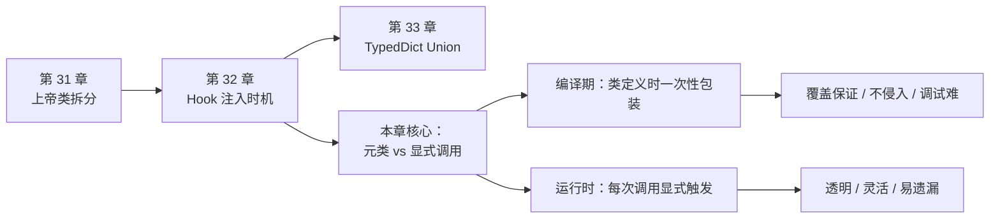
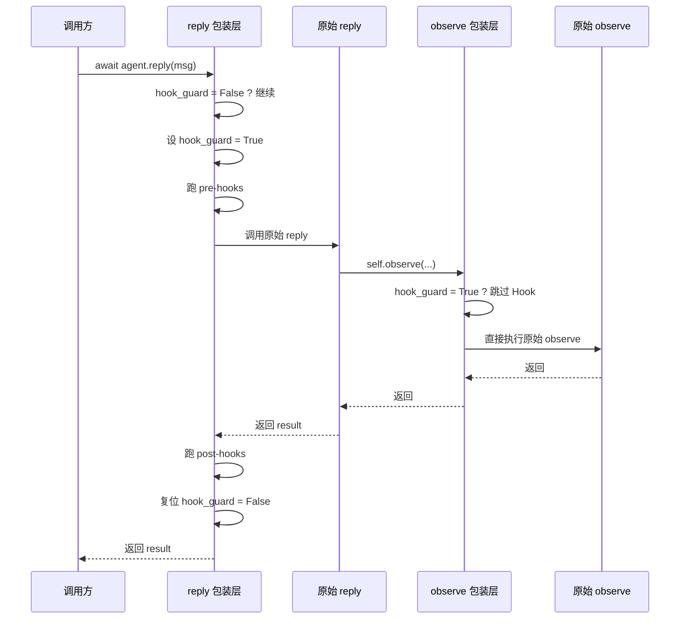

# 第 32 章 编译期 Hook vs 运行时 Hook

> "好的默认值胜过显式配置。" 同样地，好的注入时机，胜过把责任甩给每一个实现者。

> **上一章：[上帝类 vs 模块拆分](./ch31-god-class.md)**

写框架的人总会撞到同一个岔路口：那些"每一段业务逻辑前后都要做的事"——日志、追踪、埋点、缓存、权限——你打算放在哪一层？

放在业务代码里，每个写 `reply` 的人都得记得加一遍，迟早有人忘；放在框架核心里，业务代码又脏，看不出主流程。AgentScope 的选择是第三条路：**用元类（metaclass）在类定义的那一刻，自动把 Hook 包装套上去**。业务代码干干净净，Hook 一个都跑不掉。

这一章我们就来掰扯这个选择：什么是"编译期 Hook"和"运行时 Hook"，AgentScope 为什么挑了前者，以及它付出了什么代价。

## 32.1 路线图



上一章我们讨论了"一个大类要不要拆成小模块"，那是**结构**层面的取舍。本章是**机制**层面的取舍：同样一段拦截逻辑，用元类在定义期织入，还是用显式调用在运行期触发。两者能做同样的事，但编程模型的"手感"完全不同。

## 32.2 知识补全：Hook 到底是什么

先把术语对齐。Hook（钩子）就是一段**插在主流程前后、对输入或输出做加工的代码**。它最经典的形态是一个"三明治"：

```
pre-hook   ←  改输入（msg）
  ↓
业务逻辑   ←  reply / observe / print
  ↓
post-hook  ←  改输出（result）
```

用日常类比：Hook 就像快递公司的**安检机**。你寄的包裹（消息 Msg）先进安检（pre-hook），安检合格才放行给分拣员（业务逻辑 `reply`），分拣完再过一遍 X 光（post-hook）确认没问题才发车。寄包裹的人（写 `reply` 的开发者）根本不需要知道有安检——安检机就嵌在传送带上，自动运行。

这个类比里藏着一个关键区分：安检机有两种装法。一种是**把安检机焊死在传送带上**——任何包裹经过这条传送带都必须过安检，分拣员想绕也绕不开；另一种是**让每个分拣员自己记得拿检测仪扫一下**——他记得扫就扫了，忙起来忘了也就忘了。前一种是"编译期"，后一种是"运行时"。你愿意把"包裹一定过安检"这件事，托付给哪一种？

答案取决于"漏一次安检"的后果有多严重。漏一次日志，最多少几条数据；漏一次计费，就是真金白银的损失；漏一次安全审计，可能是合规事故。后果越严重，你越倾向于第一种——把保证焊死在流程里，不给人留遗忘的空间。

在 AgentScope 里，被 Hook 保护的三个核心方法是：

| 方法 | 职责 | Hook 的典型用途 |
|------|------|----------------|
| `reply` | 智能体的一次完整回复 | 会话日志、token 计费、链路追踪 |
| `observe` | 观察（只读地接收消息，不回复） | 消息审计、黑名单过滤 |
| `print` | 主动打印输出 | 输出格式化、敏感词脱敏 |

ReAct 智能体额外还有 `_reasoning`（思考阶段）和 `_acting`（行动阶段）的 Hook，用来在"想一想"和"动一动"这两步前后插桩。

一段示意性的 Hook 长这样（只是展示形态，不是可运行程序）：

```python
async def my_hook(agent, msg):
    print(f"[trace] {agent.name} 收到消息")
    return msg  # 可以修改后再传出去

agent.register_instance_hook("reply", "pre", my_hook)
```

注册完之后，每次 `await agent.reply(msg)`，`my_hook` 都会先跑一遍。问题是——**这个"自动跑一遍"是怎么实现的？** 这就引出了两条路。

## 32.3 两条路：编译期 vs 运行时

### 运行时方案：显式调用

最直观的做法是——**每次调用时，框架显式地把 Hook 跑一遍**。业务方法里直接写着 Hook 调用：

```python
class AgentBase:
    async def __call__(self, msg=None):
        for hook in self._pre_reply_hooks.values():
            msg = await hook(self, msg)          # 显式跑 pre-hook
        result = await self.reply(msg)
        for hook in self._post_reply_hooks.values():
            result = await hook(self, msg, result)  # 显式跑 post-hook
        return result
```

Django 的 middleware 就是这个路子：请求处理函数里清清楚楚写着"先过中间件链，再进视图"。FastAPI 的依赖注入也偏向这一类——你能"看见"拦截发生。

### 编译期方案：元类自动包装

AgentScope 走的是另一条路。它的元类 `_AgentMeta` 在**类被 Python 解释器加载的那一刻**，就把 `reply`、`observe`、`print` 这几个方法悄悄换成了一个"包装版"：

```python
class _AgentMeta(type):
    def __new__(mcs, name, bases, attrs):
        for fn in ("reply", "observe", "print"):
            if fn in attrs:
                attrs[fn] = _wrap_with_hooks(attrs[fn])  # 定义期就换掉
        return super().__new__(mcs, name, bases, attrs)

class AgentBase(metaclass=_AgentMeta):
    ...
```

这里有个关键认知点：`metaclass=_AgentMeta` 这一行一旦写上，**所有继承 `AgentBase` 的子类**——不管是框架自己写的 `ReActAgent`，还是你自己写的 `MyCustomAgent`——在定义的那一瞬间，它们的 `reply` 方法就已经被换成包装版了。开发者完全感知不到这件事。

> **设计一瞥**：所谓"编译期"是借用 C/C++ 的术语。Python 没有传统意义的编译阶段，准确的说是"类定义时"（class creation time）。但效果上很接近——它在程序运行主逻辑**之前**就织入了拦截代码，而且只织入一次。本文统一用"编译期"指代这种"定义时一次性注入"的时机。

## 32.4 为什么选编译期

把两条路摆在一起，差异主要在三个维度。

| 维度 | 编译期（元类） | 运行时（显式调用） |
|------|---------------|-------------------|
| 注入时机 | 类定义时，只做一次 | 每次调用都触发 |
| 覆盖范围 | 所有子类自动获得 | 需每个方法手动加 Hook 代码 |
| 遗漏风险 | 无（元类自动包装） | 有（实现者可能忘写） |
| 透明度 | 低（看不见包装代码） | 高（Hook 调用就在眼前） |
| 调试难度 | 较高（调用栈里是 `async_wrapper`） | 较低（代码直接可见） |

下面把"为什么选编译期"拆成三条具体的理由。

### 理由一：覆盖保证——一个都不能少

`reply`、`observe`、print` 这三个方法是智能体与外界交互的咽喉要道。**日志、计费、追踪这类横切关注点，绝不允许漏掉任何一次调用。**

如果用运行时方案，每写一个子类、每重写一个 `reply`，实现者都得记得"哦，我得把 Hook 代码加上"。框架越庞大、贡献者越多，漏掉的概率就越高。而元类方案下，无论谁继承 `AgentBase`，只要他在类体里写了 `async def reply`，这个方法在类创建的一刻就被自动包好——**你忘了，框架替你记着**。

这是"覆盖保证"的真正含义：不是"我们鼓励你加 Hook"，而是"你根本没法不加"。

再用一个工厂的类比。假设一条流水线上有十个工位，质检是硬性要求。你可以在每个工位贴一张纸条："请记得质检"——这就是运行时方案，纸条会被风吹掉、会被新员工忽视、会赶工期时被跳过。你也可以在每个工位装一道自动质检门，过门必检、不过不放行——这就是编译期方案。两种方案质检的内容一模一样，区别只在"质检到底要不要发生"这件事，是托付给人的自觉，还是焊死在机器里。

框架的核心方法往往承担着计费、追踪、审计这类"漏了就要出事"的职责。把它们焊死，是框架作者能送给使用者最实在的礼物之一。

### 理由二：继承链安全——防重入只能交给框架

这条更微妙，也更能说明编译期方案的价值。

考虑 `ReActAgent.reply()` 内部可能会调用 `self.observe(...)`——而 `observe` 本身也是被 Hook 保护的方法。于是一次 `reply` 调用，理论上会触发两套 Hook：reply 的、以及它内部那次 observe 的。

但你不希望 observe 的 Hook 在"嵌套调用"时再跑一遍——那会造成日志重复、计费翻倍。AgentScope 用一个**实例级标志位**（俗称 `hook_guard`）来防止这种重入：进入 reply 时置为 `True`，reply 内部再调 observe 时，observe 的包装发现标志位是 `True`，就跳过自己的 Hook、直接执行原始逻辑。



这个防重入逻辑**只能由框架在编译期统一注入**。如果改用运行时方案，每个 `reply` 实现者都得在自己的方法开头手写一段"我在重入吗？是的话就裸跑"的样板代码：

```python
async def reply(self, msg):
    if getattr(self, "_hook_running", False):
        return await self._raw_reply(msg)   # 防重入：裸跑
    self._hook_running = True
    try:
        # ... pre-hook + 业务 + post-hook
        ...
    finally:
        self._hook_running = False
```

这段样板要复制到**每一层每一个方法**里。一旦某个实现者漏写，防重入就失效，日志立刻重复。编译期方案把这段逻辑收敛进元类的 `async_wrapper`，所有方法共享一份正确实现——这就是"继承链安全"。

> **设计一瞥**：防重入是横切关注点里最难管理的一类，因为它跨方法、跨调用层级。把它交给框架在注入期统一处理，比指望每个业务方法记得写，要可靠得多。这和上一章"把职责拆给专门的模块"是同一个思想——**容易出错的事，就别让人来干**。

### 理由三：不侵入业务逻辑

第三个理由关乎代码的可读性。编译期方案下，`reply` 的实现者可以写纯粹的业务逻辑：

```python
class ReActAgent(ReActAgentBase):
    async def reply(self, msg=None):
        # 这里只有"怎么思考、怎么调用工具、怎么回复"
        # 不需要 super().reply()
        # 不需要手动触发任何 Hook
        ...
```

阅读这段代码的人，看到的就是 ReAct 的核心流程——感知、推理、行动、输出。Hook 的存在被"吸收"进了元类，业务代码因此保持了它本该有的干净。

如果换成运行时方案，`reply` 里就得穿插 Hook 调用，主流程被埋在一堆横切代码中间。短方法还行，长一点的 `reply` 会让"这段到底在干嘛"变得很难一眼看穿。

## 32.5 代价：编译期方案不便宜

没有银弹。编译期注入换来覆盖保证的同时，也背上了几样麻烦。

### 麻烦一：调试栈里全是 `async_wrapper`

你给 `reply` 打断点、看异常栈，会看到一串 `async_wrapper`，而不是亲切的 `reply`。包装代码和业务代码不在同一个文件，IDE 的"跳转到定义"点过去看到的也是**原始的 `reply`**，不是真正在跑的那个包装版。

这对第一次接触元类的开发者是个坎——明明 `reply` 里没写 Hook，Hook 却在跑，得回过头去理解元类到底干了什么。

调试体验的落差，本质上是"显式"和"隐式"的落差。运行时方案的好处是**所见即所得**：你打开 `reply`，Hook 调用就在那儿，断点打上去、变量看一眼，全清楚。编译期方案是**所读非所得**：你打开 `reply`，看到的是没插桩的纯净版，可真正执行的却是元类悄悄塞进去的包装版。这种"代码文本"和"运行实体"之间的距离，是元类方案最常被诟病的地方。

缓解的办法通常是文档和工具：在框架文档里把元类的行为讲清楚，让读者知道"这些方法被自动包装了"；配合 IDE 插件或调试器，在调用栈里把包装层折叠或标注，减少视觉噪音。但这些补救措施都治标不治本——只要注入是隐式的，调试就永远比显式方案多绕一层。

### 麻烦二：元类恐惧

"元类"在 Python 社区里几乎是个禁忌词。Python 之禅里那句"元类是给 99% 用不到它的人准备的深魔法"，让很多人一看到 `metaclass=` 就本能紧张。AgentScope 把元类用在这么核心的位置，等于把它的复杂性摆在了每个想读懂框架的人面前。

### 麻烦三：多重继承的元类冲突

Python 有一条铁律：一个类如果继承多个父类，而这些父类的元类不同（或不是彼此的子类），就会报元类冲突错误。这意味着你想混搭"一个用了元类的框架类"和"另一个也用了元类的第三方类"，常常会撞墙。元类一旦铺开，整个继承树的"元类拓扑"就被锁死了。

### 麻烦四：参数归一化的额外成本

Hook 可能要改输入参数，而 Python 方法调用既可以是 `reply(msg)` 也可以是 `reply(msg=msg)`。为了让 Hook 有统一的签名，编译期方案引入了一道**参数归一化**：无论怎么调，都先转成 `{"msg": msg}` 这样的字典，Hook 统一操作这个字典。

```python
# 这两种调用，归一化后 Hook 看到的都是 {"msg": msg}
await agent.reply(msg)
await agent.reply(msg=msg)
```

运行时方案其实可以省掉这步——Hook 直接拦 `*args, **kwargs` 就行。但代价是 Hook 函数的签名变得复杂、不统一。归一化是用一点点开销，换来 Hook 接口的整齐划一。

## 32.6 横向对比：别的框架怎么选

把视野放大，主流框架在"拦截"这件事上的选择各不相同。

| 框架 | 拦截方式 | 时机 | 典型代表 |
|------|---------|------|---------|
| **AgentScope** | 元类自动包装 | 编译期（类定义时） | `_AgentMeta` 包装 reply/observe/print |
| **LangChain** | 回调函数传参 | 运行时 | `callbacks=[my_handler]` |
| **Django** | middleware 显式链 | 运行时 | `process_request` / `process_response` |
| **FastAPI** | 依赖注入 + 装饰器 | 混合 | `Depends` + 路由装饰器 |

LangChain 走的是**运行时传参**路线：每次调用时把 `callbacks` 列表传进去，框架在关键节点遍历这个列表。优点是灵活——同一个链可以传不同 callbacks；缺点是容易遗漏——某个调用忘传 callbacks，那一次就完全没埋点。

Django 的 middleware 也是运行时，但它通过统一的 `MIDDLEWARE` 配置和请求处理函数显式编织，相对不容易漏。

> 摘录：AgentScope 官方文档的 Building Blocks > Hooking Functions 一节，列出了两类注册接口——`register_instance_hook`（只对某个实例生效）和 `register_class_hook`（对该类的所有实例生效），并给出一张 Hook 类型表：reply / observe / print 各有 pre 与 post 两个钩子点；ReAct 智能体在此基础上额外支持 reasoning 和 acting 两个阶段钩子。这套注册 API 是运行时层面的——而"注册了就一定能生效"的底层保证，则是由编译期的元类包装兜底的。

这两层的关系值得咂摸：**注册是运行时的（灵活），注入是编译期的（可靠）**。开发者用运行时 API 按需加减 Hook，框架用编译期机制保证"不管你注册没注册、注册了几个，被包装的方法一定会走 Hook 这一道"。两种时机各司其职，互不干扰。

## 32.7 有没有第三条路：`__init_subclass__`

聊到元类，总有人会问：Python 3.6 之后有个更轻的钩子叫 `__init_subclass__`，能不能替代元类？

`__init_subclass__` 是父类里的一个类方法，每当有子类被定义时就会被调用。它确实能做"类定义时注入"这件事，而且不用碰元类：

```python
class AgentBase:
    def __init_subclass__(cls, **kwargs):
        super().__init_subclass__(**kwargs)
        for fn in ("reply", "observe", "print"):
            if fn in cls.__dict__:
                setattr(cls, fn, _wrap_with_hooks(cls.__dict__[fn]))
```

效果上和元类的"定义时包装"几乎等价，而且没有元类冲突的麻烦——任何类都能继承 `AgentBase`，不用操心元类拓扑。

那 AgentScope 为什么还是用了元类？几种可能的考量：

| 维度 | 元类 `_AgentMeta` | `__init_subclass__` |
|------|------------------|---------------------|
| 触发时机 | 类对象创建时（`__new__`/`__init__`） | 类创建后（`__init_subclass__`） |
| 能否改类属性字典 | 能（在 `__new__` 里直接改 `attrs`） | 只能 `setattr`（类已建好） |
| 元类冲突风险 | 有 | 无 |
| 语义清晰度 | 低（元类黑魔法） | 高（普通方法） |
| 多层继承控制力 | 强（可定义元类的元类） | 弱（只有一层钩子） |

`__init_subclass__` 在大多数"定义时注入"场景里其实是够用的，而且更友好。AgentScope 选元类，可能既有历史包袱（早期版本就建立在元类之上），也有"想统一管理多个相关类的包装策略"的考虑——比如 ReAct 智能体有自己的 `_ReActAgentMeta`，在父元类基础上额外包装 `_reasoning`/`_acting`，这种"元类继承"的能力 `__init_subclass__` 表达起来就没那么顺。

对今天的框架作者来说，如果你只是要做"自动包装方法"这一件事，**`__init_subclass__` 往往是更克制的选择**；元类更适合"需要一套完整的类创建协议"的复杂场景。

这其实呼应了全书反复出现的一个主题：**同一件事往往有多种实现机制，选哪种不只看"能不能做"，更看"代价摊给了谁"**。元类把代价摊给了"读框架的人"（要懂元类），`__init_subclass__` 把代价摊给了"写框架的人"（要处理更受限的钩子）。两种摊法都成立，关键是你更愿意让谁承担复杂度。AgentScope 在它诞生的年代选了元类，今天的新框架则越来越倾向于更朴素的机制——这不是谁对谁错，而是社区对"可读性 vs 表达力"的权衡点在缓慢漂移。

## 32.8 把两条路的本质说穿

绕了一大圈，编译期和运行时的本质差异其实就一句话：

> **编译期方案把责任放在框架身上，运行时方案把责任放在每个实现者身上。**

- 编译期：框架在类定义时就替你包好，你只管写业务。代价是调试不透明、元类有学习成本。
- 运行时：你自己在每个方法里显式触发 Hook，所见即所得。代价是覆盖靠人肉保证、防重入靠每个方法自觉。

AgentScope 选前者，是因为它把"Hook 一定要被正确执行"看得比"代码一目了然"更重要——对一个要承载追踪、计费、审计的生产级框架来说，**少跑一次 Hook 可能就是一次线上事故**，而元类恐惧最多只是开发体验上的不适。这笔账，框架作者算得很清楚。

但这也意味着：如果你只是写一个内部小工具、Hook 漏一两次无所谓，那运行时方案完全够用，没必要上元类。**工具的选择永远跟着场景走，没有绝对的最优。**

把这一章和上一章连起来看，你会发现一条暗线：无论是"把大类拆成小模块"，还是"把 Hook 焊在编译期"，背后都是同一种工程哲学——**把容易出错、容易遗漏、容易不一致的事，从人的手上挪到机制的手上**。人不可靠，机制可靠；人会忘，机制不会忘。框架的价值，很大程度上就体现在这种"替人兜底"的设计里。理解了这一点，你再去看 AgentScope 的任何一个设计选择，都不再是"它为什么这么写"，而是"它想替我兜住什么"。

## 检查点

1. **用自己的话讲**：为什么"防重入"这件事，编译期方案比运行时方案更适合兜底？提示：想想如果防重入逻辑要由每个实现者自己写，会发生什么。

2. **场景判断**：你给一个智能体注册了一个 reply 的 pre-hook，用来记录每次对话的输入。这个 Hook 是在"编译期"跑的，还是"运行时"跑的？注册 API 和底层注入分别属于哪个时机？

3. **代价权衡**：某团队抱怨 AgentScope 的调用栈里全是 `async_wrapper`，很难调试，提议改用运行时方案。你会如何回应这个提议？提示：覆盖保证和调试透明，哪个更难补救。

4. **替代方案**：如果把 `_AgentMeta` 换成 `__init_subclass__`，框架会失去什么、得到什么？什么情况下这个替换是值得的？

5. **横向迁移**：Django middleware 和 AgentScope 元类都能做"请求前后插逻辑"。为什么 Django 选了运行时、AgentScope 选了编译期？从两个框架各自要保证的东西出发思考。

## 下一站预告

Hook 的注入时机是一个"何时做"的设计选择。下一章我们换一个角度，看一个"用什么做"的选择——AgentScope 的消息内容为什么用 `TypedDict`（Union 类型）来表示，而不是经典的 OOP 类继承？

> **下一章：[为什么 ContentBlock 是 Union](./ch33-typedict-union.md)**
