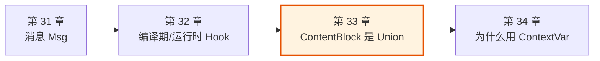
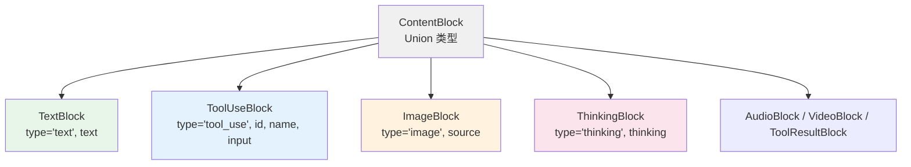
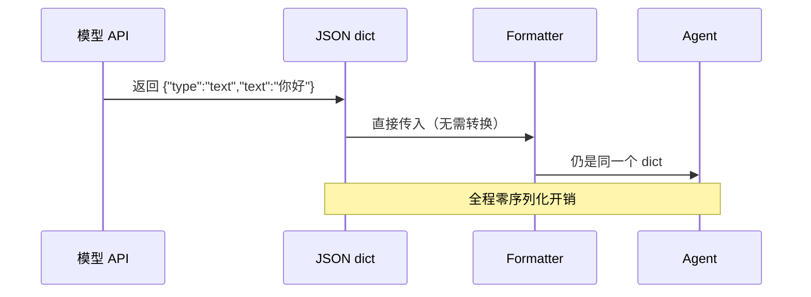

# 第 33 章 为什么 ContentBlock 是 Union

> 点题：ContentBlock 不是类，是一组 TypedDict 的并集。这个看似"土"的选择，背后是对"消息的本质是什么"的判断——它是数据，不是行为。

> **上一章：[编译期 Hook vs 运行时 Hook](./ch32-compile-time-hooks.md)**

## 33.1 路线图

前一章我们讨论了 Hook 在编译期和运行时的不同形态。这一章我们把镜头拉近到一个看似不起眼、却贯穿整个框架的数据类型：`ContentBlock`。

当你打开任意一条 AgentScope 消息，里面的"内容"不是一段裸字符串，而是一串"内容块"——文本块、思维链块、工具调用块、图片块……这些块是怎么定义的？为什么它们长这样、不长那样？



本章要回答一个问题：**为什么这七种内容块都是 `TypedDict`，而它们之间用 Union 连起来，而不是用一个共同基类 + 子类继承？** 这不是顺手为之，而是框架对"消息数据该用什么承载"的一次明确投票。

## 33.2 知识补全：TypedDict 与 Union 是什么

要理解这个选择，先得明白两件事。

**第一，TypedDict 是什么。** 普通 dict 在 Python 里类型是宽松的——`d: dict` 告诉你"这是字典"，但不知道里面有什么键、值是什么类型。`TypedDict`（PEP 589）补上了这个缺口：它让你声明一个 dict 必须有哪些键、每个键的值是什么类型，但它**运行时仍然是 dict**，不是新对象。

```python
class TextBlock(TypedDict, total=False):
    type: Literal["text"]
    text: str
```

这一段定义读起来像 class，但 `TextBlock` 在运行时就是 dict 的一个"形状标注"。类型检查器（mypy / pyright）会照着它检查你写的代码，而 Python 解释器运行时并不创建任何 `TextBlock` 对象——你创建的就是一个普通 dict。

> 一个好类比：TypedDict 像**快递单的模板**。模板规定了这张单子上必须有"收件人""电话""地址"几栏，每一栏该填什么类型的东西（地址是字符串、保价金额是数字）。但填单子时，你写的还是一张普通纸，不是某种"快递单对象"。模板只是用来让人填对、让质检员（类型检查器）检查对。

**第二，Union 是什么。** `A | B | C` 表示"这个值可能是 A，也可能是 B，也可能是 C 中任意一种"。在 Python 3.10+ 里，`X | Y` 是 `Union[X, Y]` 的简写。`ContentBlock = TextBlock | ToolUseBlock | ImageBlock | ...` 意思就是：一个内容块，是这七种形状里的一种，具体是哪一种，由它里面的 `type` 字段说了算。

把这两点合起来：**ContentBlock 是"一组 dict 形状的并集"，每个形状由一个 `type` 字段（如 `"text"`、`"tool_use"`）来标识自己属于哪一支。** 这就是全部核心。

## 33.3 七种块：共同的 type 字段

先看这七种块各自长什么样。它们唯一的共同点是都有一个 `type` 字段，用字符串字面量（`Literal`）来标记自己的身份。

```python
class TextBlock(TypedDict, total=False):
    type: Literal["text"]
    text: str

class ToolUseBlock(TypedDict, total=False):
    type: Literal["tool_use"]
    id: str
    name: str
    input: dict

class ImageBlock(TypedDict, total=False):
    type: Literal["image"]
    source: dict

class ThinkingBlock(TypedDict, total=False):
    type: Literal["thinking"]
    thinking: str
```

（此外还有 `AudioBlock`、`VideoBlock`、`ToolResultBlock`，形态类似。）注意每个块的 `type` 字段值是固定的——`TextBlock` 永远是 `"text"`，`ToolUseBlock` 永远是 `"tool_use"`。这就是"自带身份证"。



为什么用 `type` 字段当身份证，而不是用"类"？因为下游判断"这是一个什么块"时，最自然的动作是读它的 `type` 字符串——尤其是当这个块来自 OpenAI、Anthropic 的 API 返回时。

## 33.4 数据是 JSON 的影子

要理解为什么偏偏选 TypedDict，得先看一个事实：**这些块，绝大多数时候不是 AgentScope 自己造出来的，而是模型 API 吐回来的 JSON。**

OpenAI 的接口返回这样一段：

```json
{"type": "text", "text": "你好"}
```

Anthropic 的接口返回这样一段：

```json
{"type": "tool_use", "id": "toolu_01", "name": "get_weather", "input": {"city": "上海"}}
```

这些 JSON 被 `json.loads` 解析后，就是 Python dict。它们已经是这个形状了——有 `type` 键，有对应的字段键。AgentScope 的 `TextBlock`、`ToolUseBlock`，**就是这个 dict 形状的精确描述**。

> 类比：API 返回的 JSON dict 是**原版照片**，TypedDict 是**照片的尺寸规格表**。规格表告诉你"这张照片宽多少、高多少、什么格式"，但它本身不是照片。你拿着规格表（TypedDict 类型）去标注那些原版照片（dict），照片一张都不用重洗。

这正是 AgentScope 选择 TypedDict 的根本动机：**让类型定义成为 JSON 数据的影子，而不是另起炉灶造一套对象。** 数据从 API 进来是 dict，在框架里流转是 dict，写回日志或发给另一个 API 还是 dict——全程不需要任何转换。

## 33.5 被否方案一：OOP 继承

最直觉的替代方案是面向对象：定义一个抽象基类 `ContentBlockBase`，每种块是一个子类。

```python
class ContentBlockBase(ABC):
    @abstractmethod
    def to_dict(self) -> dict: ...
    @abstractmethod
    def get_type(self) -> str: ...

class TextBlock(ContentBlockBase):
    def __init__(self, text: str):
        self.text = text
    def to_dict(self) -> dict:
        return {"type": "text", "text": self.text}
```

听起来很"正规"，但它在 ContentBlock 这个场景里处处别扭。首先是**多此一举的转换**：API 已经给了 dict，你却要先 `TextBlock(text="你好")` 造一个对象，等要发出去时又得 `.to_dict()` 转回 dict。对象只是 dict 的一个临时包装，进来拆一次、出去装一次，纯粹是搬运成本。

其次是**与生态不兼容**。`json.dumps` 不认识你的自定义对象，得自己写序列化器；其他库传过来的 dict 也不是你的子类实例，`isinstance` 一律失效。你为了"面向对象"的体面，给自己套了一层处处要打补丁的壳。

最深层的问题在于判断错了**这些块的本质**。OOP 适合"数据 + 行为"绑在一起的东西——一个 `Account` 对象知道怎么 `deposit`、怎么 `transfer`，它的方法是它身份的一部分。而 ContentBlock 呢？它们没有行为。一个 `TextBlock` 不会"做"任何事，它只是"是"一段文本。**把纯数据塞进类，就像给一张快递单配了一个"快递单经理"——经理啥活都不干，每天的工作就是被叫来把单子念一遍。**

## 33.6 被否方案二：dataclass

第二候选是 `dataclass`，比手写 OOP 轻得多。

```python
@dataclass
class TextBlock:
    type: str = "text"
    text: str = ""
```

dataclass 解决了"写一堆样板代码"的痛苦，但没解决核心矛盾：**它仍然不是 dict。** `json.loads` 拿到的是 dict，你要用就得 `TextBlock(**d)` 转成对象；要发出去又得 `asdict(block)` 转回 dict。这个"对象 ↔ dict"的来回折腾，正是 dataclass 在 JSON 密集场景下的硬伤。

而且 dataclass 默认的 JSON 序列化不直接工作——`json.dumps(dataclass 实例)` 会报错，必须借助 `asdict` 或第三方库。对于一个**生命周期几乎全在 JSON 边界上**的数据结构来说，这层隔阂得不偿失。

> 一句话区分三种方案的角色：OOP 适合"有行为的领域对象"；dataclass 适合"需要在内存里长期存活、被业务逻辑操作的值对象"；而 TypedDict 适合"数据的形状描述，尤其是和数据外部表示（JSON）一一对应的形状"。ContentBlock 属于第三类。

## 33.7 AgentScope 的选择：TypedDict + Union

把上面的取舍综合起来，AgentScope 的选择就清晰了。TypedDict 的核心优势可以用一句话概括：**它既是 dict，又有类型提示。**

```python
# 创建——和写普通 dict 一模一样
block = {"type": "text", "text": "你好"}

# 类型检查——mypy 能照着 TextBlock 检查字段
def echo(b: TextBlock) -> None:
    print(b["text"])    # OK
    print(b["foo"])     # mypy 报错：没有这个字段

# 序列化——它就是 dict，json.dumps 直接能用
import json
json.dumps(block)       # 不需要 .to_dict()

# 与 API 响应兼容——返回的 dict 天然就是 TextBlock 形状
resp = {"type": "text", "text": "你好"}   # 这就是 TextBlock，无需转换
```

Union 类型则把七种形状粘在一起，并依靠 `type` 字段做"运行时分发"。Python 3.10 引入的 `match/case` 和这套设计是天作之合：

```python
def handle(b: ContentBlock) -> None:
    match b.get("type"):
        case "text":
            print(b["text"])       # 类型检查器知道这是 TextBlock
        case "tool_use":
            print(b["name"])       # 类型检查器知道这是 ToolUseBlock
        case "image":
            print(b["source"])
```

类型检查器能根据 `type` 字段的值（所谓"字面量 narrowing"）推断出在哪个分支里 `b` 是哪一种具体形状，从而允许你安全地访问该形状独有的字段。**判别靠字符串，类型安全靠编译期——两者各司其职。**



## 33.8 Required 与 total=False：精细化的字段控制

讲到这里有个细节值得补一笔。前面所有定义都带着 `total=False`，意思是"这些字段都不是必须的"。这听起来会让 `ToolUseBlock` 的 `id`、`name`、`input` 也变成可选——那岂不是可以造出一个没有 `name` 的工具调用块？

实际不会。Python 3.11+ 的 TypedDict 提供了 `Required` 标记，可以**在 `total=False` 的总基调上，单独把某些字段重新标成必填**。框架正是这么做的：关键字段用 `Required[...]` 覆盖默认的可选语义。

| 字段标记组合          | 含义                           | 典型用途                     |
|---------------------|------------------------------|----------------------------|
| `total=False`        | 整个类所有字段默认可选          | 允许灵活构造、容错           |
| `Required[...]` 覆盖  | 把某字段强制改回必填            | `ToolUseBlock.id` 等关键字段 |
| 未标记 + `total=False` | 该字段保持可选                  | 调试用辅助字段、原始输入回填   |

这种"宽松默认 + 重点收紧"的组合，让类型系统能在该严的地方严、在该松的地方松。它体现的是 TypedDict 这个工具的能力上限——只要你愿意精细标注，它并不比 dataclass 粗糙。

> 设计一瞥：`total=False` 而不是 `total=True`，是因为这些块常在**不完整构造**的状态下流转。比如一个待补全的 `ToolUseBlock`，可能在流式输出过程中先有 `type` 和 `name`，`input` 要等流到结尾才完整。默认可选，让中间状态合法地存在，比强迫每一步都凑齐字段更贴近真实数据流。

## 33.9 后果：得到了什么，失去了什么

每种设计都是一次取舍。TypedDict Union 给 AgentScope 带来了明显的好处，也留下了明确的代价。

**得到的好处：**

1. **零序列化成本。** 没有 `.to_dict()` / `.from_dict()`，数据进出不用任何转换。
2. **API 原生兼容。** OpenAI、Anthropic 返回的 JSON dict 就是 ContentBlock，直接拿来用。
3. **类型安全。** mypy / pyright 能检查字段名和类型，写错字段名会编译期报错。
4. **轻量。** 没有对象创建开销，热路径上省掉一大笔构造和析构成本。

**失去的东西：**

1. **没有共享基类。** 不能写 `isinstance(b, ContentBlockBase)`，只能 `b.get("type") == "text"` 来判别。
2. **没有行为。** 不能给块加方法，比如 `b.is_text()` 或 `b.merge(other)`——任何"操作"都得写成外部函数。
3. **IDE 补全较弱。** 相比 dataclass，TypedDict 的字段补全体验要差一些，尤其是在动态构造时。
4. **校验逻辑无处安放。** "ToolUseBlock 必须有 id"这类规则只能靠 `Required` 标记和外部校验函数来表达，不像 Pydantic 那样能挂在类上自动执行。

> 关键判断：ContentBlock 是**传输数据的信封**，不是**业务实体**。信封的职责是"准确地把内容从一个地方送到另一个地方"，它越薄、越贴近传输格式（JSON）越好。给它塞行为，相当于让信封自己决定要不要投递——职责错位。损失的那点"对象优雅"，换来的是整条数据通路上的零摩擦。

## 33.10 横向对比：其他框架怎么选

把视野放宽，看看同类框架在"消息块用什么承载"这个问题上的不同投票。

| 框架          | 消息块类型             | 主要优点              | 主要代价             |
|--------------|----------------------|---------------------|---------------------|
| **AgentScope** | TypedDict Union       | 零序列化、API 原生兼容    | 无共享行为、IDE 补全弱   |
| **LangChain**  | Pydantic / dataclass  | 有方法、有自动验证       | 进出 JSON 需要转换     |
| **AutoGen**    | 纯 dict               | 极简、无依赖           | 完全无类型安全          |
| **OpenAI SDK** | dataclass-like 对象    | 与官方 API 形态一致      | 框架锁定、序列化需额外步骤 |

AgentScope 的位置很明确：**比 AutoGen 的裸 dict 多了类型安全，比 LangChain 的 Pydantic 少了转换开销。** 它押注的是"在 Agent 框架里，消息数据的高频流转比对象的丰富行为更重要"。

这个押注对不对，取决于场景。如果你的应用里消息块需要大量自定义行为（校验、变换、业务方法），Pydantic 可能更顺手；如果消息块主要是"在模型、记忆、工具之间高速搬运的货物"，TypedDict 的零摩擦优势就会被放大。AgentScope 判断自己属于后者，于是下了注。

PEP 589 对 TypedDict 的定位，正好支撑了这个选择：

> "A TypedDict type represents dictionary objects with a specific set of string keys, and with specific value types for each valid key."
>
> —— PEP 589, "Specification"

它生来就是描述"有特定键和值类型的 dict"的，而 JSON 对象恰好就是这样的 dict。两者天然对齐。

## 检查点

1. **为什么 ContentBlock 不用抽象基类 + 子类？** 请从"数据的来源"和"对象在生命周期里需要做什么"两个角度回答。
   提示：想想这些块通常从哪里来（API 返回的 JSON），以及它们在框架里有没有需要被反复调用的方法。

2. **`ContentBlock = TextBlock | ToolUseBlock | ...` 这个 Union 是怎么做到"运行时分发"的？** 如果给你一个 `b: ContentBlock`，你怎么安全地拿到它的 `text` 或 `name` 字段？
   提示：靠 `type` 字段判别，配合 `match/case` 让类型检查器做字面量收窄。

3. **`total=False` 加上 `Required[...]` 的组合解决了什么问题？** 为什么不全用 `total=True`，或全用 `total=False`？
   提示：考虑"宽松默认便于中间态构造"和"关键字段不能漏"这两个矛盾的需求。

4. **TypedDict 相比 dataclass，在"JSON 密集"场景下的核心优势是什么？代价又是什么？**
   提示：一句话——"它就是 dict"，这带来了什么、又失去了什么。

5. **如果未来要给 ContentBlock 加上"自动校验 id 唯一"这类规则，TypedDict Union 还扛得住吗？你会怎么补？**
   提示：TypedDict 本身不带运行时校验，但可以靠外部校验函数或 Pydantic 适配层来补。

## 下一站预告

ContentBlock 的选择，本质是一次"**数据优先还是行为优先**"的投票——AgentScope 投给了数据。接下来的章节，我们看另一个和数据环境相关的选择：为什么配置要用 `ContextVar`，而不是全局变量或线程局部存储？这背后是另一组取舍，关于"状态怎么在异步的多个任务之间安全地共享"。

> **下一章：[为什么用 ContextVar](./ch34-contextvar.md)**
