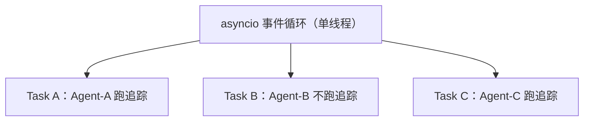
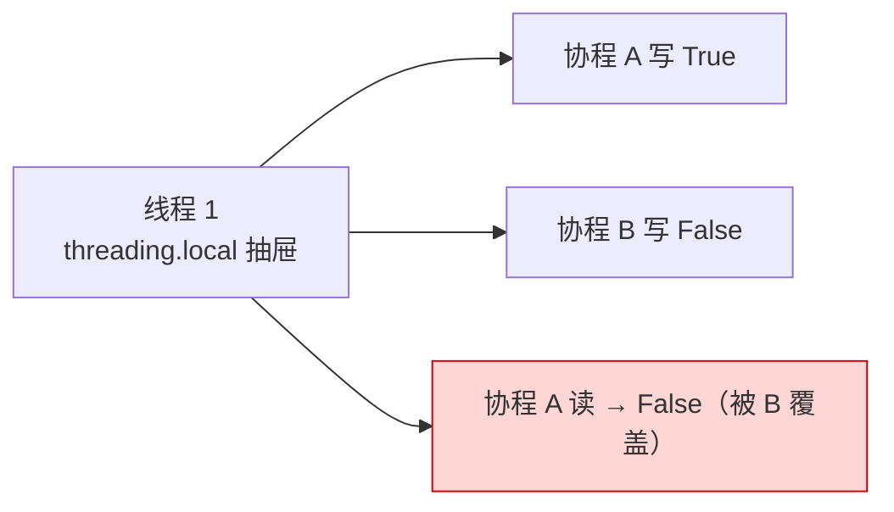
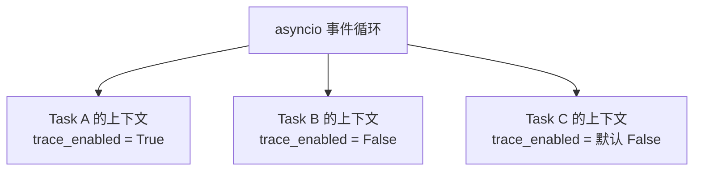
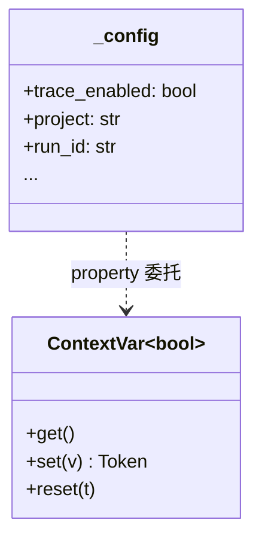
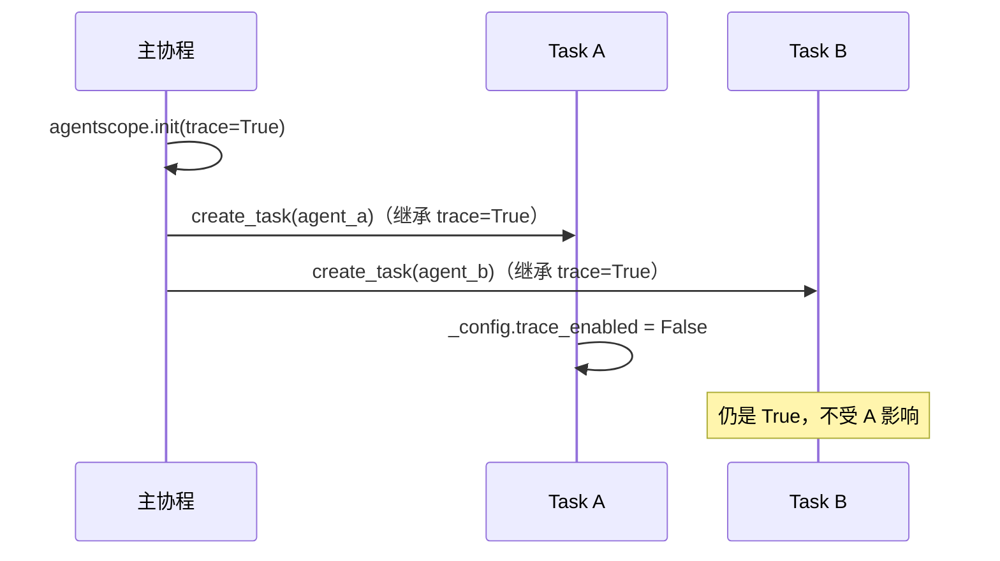

# 第 34 章 为什么用 ContextVar

你写下一行 `agentscope.init(trace=True)`，整个进程仿佛就"知道"了一件事：从这一刻起要开启追踪。你不必把 `trace=True` 沿着 `agent.reply()` → `model()` → `tool()` 一层层传下去，也不必担心两个并发跑着的 Agent 互相把对方的配置覆盖掉。这种"配置会自己找到该去的地方"的魔法，背后是一个不起眼却关键的选择——`ContextVar`。

> 配置是全局的直觉，却必须有局部的边界。

> **上一章：[为什么 ContentBlock 是 Union](./ch33-typedict-union.md)**

---

## 34.1 路线图

本章是"为什么这样设计"系列的第三站。前两章我们看了数据怎么塑形（`Msg` 的内容块、`ContentBlock` 的联合类型），现在换个角度，看**配置怎么流动**。


为什么一个并发 Agent 框架要为"存几个开关"专门引入 `ContextVar`？答案是：**异步并发会把看似简单的全局变量撕成碎片**。我们要搞清楚三件事——全局变量为什么不行、`threading.local` 为什么也不行、`ContextVar` 凭什么同时解决了线程和协程两道题。

---

## 34.2 知识补全：三种"放东西的地方"

在进入 AgentScope 的具体选择前，先建立直觉。要存一个"全局可读"的值，Python 至少给了我们三块"储物空间"。

### 全局变量：公共布告栏

最朴素的做法是模块级变量，像一块公共布告栏：

```python
_trace_enabled = False
_model_name = "gpt-4o"
```

谁都能写，谁都能读。问题在于——**只有一个布告栏**。十个人同时往上贴便签，后贴的把先贴的盖掉。

### threading.local：每人一个抽屉

```python
import threading
_local = threading.local()
_local.trace_enabled = False
```

`threading.local` 的承诺是"每个线程看到自己的副本"。可以理解为给每个线程配了一只私人抽屉，A 线程往自己抽屉放东西，B 线程看不见。这解决了多线程并发的覆盖问题。

### ContextVar：每个任务一份便签

`ContextVar`（Python 3.7+，`contextvars` 模块）承诺的是"每个异步上下文看到自己的副本"：

```python
from contextvars import ContextVar
trace_enabled: ContextVar[bool] = ContextVar("trace_enabled", default=False)

# 当前上下文里读
trace_enabled.get()
# 当前上下文里写
trace_enabled.set(True)
```

它的隔离单位不是"线程"，而是"上下文（Context）"——而 asyncio 的每个 Task 恰好自带一份上下文。

### 一张表先记下区别

| 方案 | 隔离单位 | 多线程安全 | asyncio 安全 | 维护成本 |
|------|---------|-----------|-------------|---------|
| 全局变量 | 无（共享） | 否 | 否 | 最低 |
| `threading.local` | 线程 | 是 | 否（同线程协程互相覆盖） | 中 |
| `ContextVar` | 上下文 | 是 | 是 | 中 |
| 函数参数显式传递 | 调用栈 | 是 | 是 | 最高（代码冗长） |

记住这张表的最后一列：`ContextVar` 的胜利不是"更安全"那么简单，而是"在安全与简洁之间找到了平衡点"。

---

## 34.3 问题从哪来：异步会让全局变量"打架"

AgentScope 是全异步框架——`agent(msg)`、`model()`、`tool()` 全是 `async`。一个典型的多智能体场景里，事件循环里同时跑着好几个 Task：



假设我们用全局变量存 `trace_enabled`。Task A 把它设成 `True`，正准备记录一次模型调用；就在它 `await` 让出控制权的间隙，Task B 把它改回 `False`。等 Task A 醒过来，追踪开关已经被悄悄关掉。

> 协程在单线程里交替执行，没有锁能救你——因为问题根本不是"同时写"，而是"交错地写"。

用一个极简示意体会这种交错（这只是说明形态，不是可跑的 demo）：

```
时刻 t1：Task A 写  trace_enabled = True
时刻 t2：Task A await，让出 CPU
时刻 t3：Task B 写  trace_enabled = False   ← A 还以为自己是 True
时刻 t4：Task A 醒来读 trace_enabled        ← 读到 False，错！
```

全局变量在异步世界里像一块**被所有人共用的黑板**，谁都以为自己在写自己的笔记，其实全写在了同一张纸上。

---

## 34.4 threading.local 为什么也不够

一个有经验的同学会想：那就用 `threading.local` 呗？它在多线程下可是久经考验。

问题恰恰在于——**asyncio 是单线程的**。事件循环里所有的协程跑在同一个线程上。`threading.local` 的隔离粒度是"线程"，于是对同一根线程里的所有协程来说，它退化为一块公共黑板：



抽屉只有一个，进去的人轮番改，最后留下的是最后一个人的笔迹。`threading.local` 解决的是"多线程打架"，但 asyncio 的战场在"同一根线程内的协程打架"，两者错位。

这就是为什么 Python 3.7 引入了 `ContextVar`——专门为协程模型准备的上下文隔离机制。

---

## 34.5 ContextVar 的隔离原理

理解 `ContextVar` 的关键，是理解 asyncio 给每个 Task 配了一只"私塾"。



关键机制有两条：

1. **`asyncio.create_task()` 复制当前上下文**。新 Task 拿到的是父上下文的一份快照，从此各过各的。
2. **`ContextVar.set()` 只改当前上下文里的副本**。Task A 写 `True`，改的是 A 自己的副本，B 那边的副本纹丝不动。

用日常类比：全局变量是大厅里的告示牌，所有人盯着同一块；`threading.local` 是按工位分的储物柜，但一个工位（线程）里所有协程共用一个柜子；`ContextVar` 则是**给每一项独立任务发一张便签**，任务拿到便签后随便涂改，跟别人的便签互不相干。

> 设计一瞥
>
> `ContextVar.set()` 返回一个 `Token`，可以用 `var.reset(token)` 把值退回设置之前的状态。这在"临时改一下、用完还原"的场景下很有用——比如某个工具想临时关掉追踪再恢复。AgentScope 内部的 `_config` 也可以借助这个机制实现配置的临时覆盖。

---

## 34.6 AgentScope 的两层结构：壳与芯

讲到这里，看 AgentScope 是怎么用 `ContextVar` 的。它的设计分两层——**壳**和**芯**。

**芯**：一组真正的 `ContextVar(...)` 实例，每项配置一个：

```python
run_id       = ContextVar("run_id",       default=...)
project      = ContextVar("project",      default=...)
name         = ContextVar("name",         default=...)
created_at   = ContextVar("created_at",   default=...)
trace_enabled= ContextVar("trace_enabled",default=False)
```

**壳**：一个叫 `_config` 的对象，把这些 `ContextVar` 包成普通 property：

```python
class _ConfigCls:
    def __init__(self, run_id, project, ..., trace_enabled):
        self._trace_enabled = trace_enabled   # 接收 ContextVar
        ...

    @property
    def trace_enabled(self) -> bool:
        return self._trace_enabled.get()      # 读 = 当前上下文的值

    @trace_enabled.setter
    def trace_enabled(self, value: bool) -> None:
        self._trace_enabled.set(value)        # 写 = 改当前上下文
```

对外暴露的是壳：

```python
import agentscope
agentscope._config.trace_enabled      # 读
agentscope._config.trace_enabled = True  # 写
```



### 为什么分两层

这层 property 外壳换来三样好处：

1. **使用面干净**。调用方写 `agentscope._config.trace_enabled`，跟访问普通属性没区别，不必知道底下是 `ContextVar`，更不必写 `.get()`/`.set()`。
2. **芯可替换、可测试**。真正的 `ContextVar` 实例从外面注入到 `_ConfigCls`，意味着测试或扩展时可以替换隔离源（例如换成 mock）。
3. **集中一处管"哪些是配置"**。所有 `ContextVar` 在包初始化时统一创建并喂给壳，避免散落在各模块各自创建造成"配置项没人知道全貌"。

> 设计一瞥
>
> 注意追踪模块（`tracing`）自己并**不**持有一份 `trace_enabled` 的 `ContextVar`，而是通过 `agentscope._config.trace_enabled` 去读。这样"配置的真相只有一个"，跨模块不会出现两份对不上的副本。

---

## 34.7 agentscope.init() 到底做了什么

现在把视角拉回 `agentscope.init()`。它的职责是设置这些 `ContextVar` 的初值：

```python
agentscope.init(
    model_config=...,
    trace=True,          # 内部： _config.trace_enabled = True
    project="my-exp",
    ...
)
```

由于底层是 `ContextVar`，这次调用本质上做的是：**在当前上下文里把几个开关拨到位**。

这件事有两层含义值得注意：

- **作用域是"当前上下文"**。如果你在主协程里调 `init()`，然后 `asyncio.create_task()` 派生出的子任务会**继承**这份快照——这是 ContextVar 最贴心的特性，无需手动转发。
- **跨任务不串味**。如果两个 Task 各自调了 `init()`（比如跑两个独立实验、各自配置不同模型和追踪开关），它们各设各的副本，互不污染。



这就是为什么 AgentScope 文档里说"在程序入口调一次 `init()` 即可"——它的效果会顺着上下文继承自然流到所有派生 Task，而不需要你做任何显式转发。

---

## 34.8 后果：得到了什么，付出了什么

每一个设计都是一笔交易。`ContextVar` 给 AgentScope 带来的，是三个实实在在的好处和三个不大不小的代价。

### 得到的

1. **异步安全**。每个 Task 独立副本，无需加锁，也无需担心交错写入。
2. **隐式传递**。配置像空气一样弥漫在调用栈里，`model()`、`tool()` 这些下层组件不用为"要不要传 `trace` 参数"而纠结。
3. **天然可组合**。多个并行实验、多次 `init()` 可以在各自的任务里和平共处，这对多智能体并行评测尤其重要。

### 付出的

1. **不可见的"全局状态"**。配置值不在函数签名里，读代码时看不出来某个函数依赖了它。新人要靠 `print(_config.trace_enabled)` 才能确认当前值。
2. **测试要小心隔离**。同一个测试任务里多次 `init()` 会彼此影响；并行测试如果共享上下文要显式管理。这也是为什么 AgentScope 测试常用 `--forked` 之类的隔离手段。
3. **学习曲线**。`ContextVar` 在 Python 社区不算大众，不少开发者第一次见会困惑"为什么不是普通变量"。

### 一句话权衡

> 用显式参数传递，代码啰嗦但每一处依赖都看得见；用 `ContextVar`，代码干净但依赖隐在空气里。AgentScope 选了后者，因为它本质上是一个**高度异步、组件层级深、配置项要贯穿全栈**的框架——这里"隐式传递"省下的样板代码量是巨大的。

---

## 34.9 横向再看一次

把四种方案并排放，结论就很清楚了：

| 方案 | 线程安全 | 异步安全 | 代码简洁 | 依赖可见性 | AgentScope 适配度 |
|------|---------|---------|---------|-----------|-----------------|
| 全局变量 | ✗ | ✗ | ✓ | 中（能看到变量名） | 不及格 |
| `threading.local` | ✓ | ✗ | ✓ | 低 | 不及格 |
| `ContextVar` | ✓ | ✓ | ✓ | 低 | **满分** |
| 函数参数传递 | ✓ | ✓ | ✗ | 高 | 可行但啰嗦 |

AgentScope 是全异步框架，所以"异步安全"是硬门槛——前两个方案直接出局。剩下的两个里，"参数传递"在样板上代价过高（每个 `model()`、`tool()` 调用都要带一长串配置），于是 `ContextVar` 成了唯一同时满足"异步安全 + 代码简洁"的选择。

> 设计一瞥
>
> `ContextVar` 的隔离边界是"上下文"而非"线程"，这意味着它对**未来的多线程 + 异步混合**场景同样有效——只要每个线程跑自己的事件循环，各线程、各 Task 的配置副本天然独立。换句话说，这个选择还顺手为 AgentScope 日后扩展到多线程运行时留了余地。

---

## 检查点

1. **假如 AgentScope 改用全局变量存 `trace_enabled`，在两个并发 Agent 的场景里会出什么具体问题？** 会发生交错覆盖——Task A 设 `True` 后 `await` 让出 CPU，Task B 设 `False`，Task A 醒来读到的是 B 的值，追踪行为被悄悄改变。原因是全局变量在单线程内对全部协程共享同一份存储。

2. **`threading.local` 在 asyncio 里为什么会"失效"？** 因为 asyncio 通常单线程运行，所有协程处于同一线程，`threading.local` 按线程隔离就退化成"全部协程共享一个抽屉"，无法阻挡协程间的交错写入。它的隔离粒度（线程）与 asyncio 的并发单位（协程/任务）错位。

3. **`asyncio.create_task()` 与 `ContextVar` 是怎么配合的？** `create_task()` 会复制当前上下文给新任务，新任务对 `ContextVar` 的 `set()` 只作用于自己这份副本，父任务和其他兄弟任务的副本不受影响。这就是为什么父协程里 `init()` 的配置能自动"流"到子任务，而子任务的修改不会回流。

4. **AgentScope 为什么把 `ContextVar` 再包一层 `_config` property？** 为了使用面的干净——调用方写 `agentscope._config.trace_enabled` 就像普通属性，不必关心 `.get()`/`.set()`；同时把"哪些字段是配置"集中在一处声明，便于维护与测试时替换底层隔离源。

5. **`ContextVar` 这套方案最痛的代价是什么？** 是"不可见性"——配置依赖不在函数签名里，读代码时看不出某个函数用了哪项配置，排查时往往要靠 `print(var.get())` 才能确认当前值。这是为"隐式传递 + 代码简洁"付出的可读性代价。

---

## 下一站预告

`ContextVar` 解决的是**配置在并发环境里怎么安全流动**——这是一个跨层的问题。下一章我们看另一个跨层的设计选择：Formatter 为什么要独立于 Model 存在？把"消息怎么塑形"从"模型怎么调用"里拆出来，框架得到了什么？

> **下一章：[为什么 Formatter 独立于 Model](./ch35-formatter-separate.md)**
