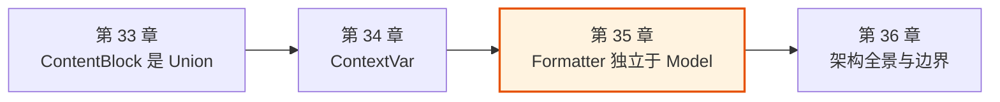
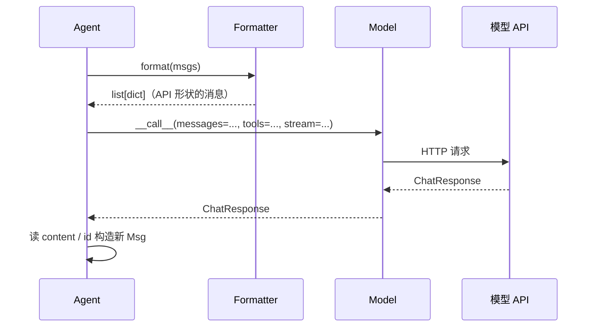
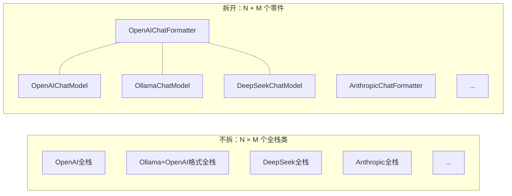
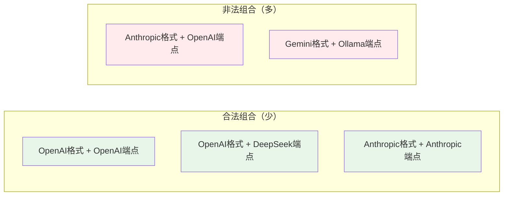

# 第 35 章 为什么 Formatter 独立于 Model

> 点题：把"消息怎么翻译成 API 字典"和"怎么把字典发给 HTTP"拆成两个类，看起来是多此一举——一个类不就完了？但当你数到第二个、第三个模型供应商时，这个拆分就还清了它的成本：N 种格式和 M 种通信方式，从乘法变成加法。

> **上一章：[为什么用 ContextVar](./ch34-contextvar.md)**

## 35.1 路线图

前一章我们讨论了用 `ContextVar` 在异步任务间共享配置状态。这一章我们回到组件的边界上，看一个更朴素、却频繁被新手质疑的拆分：**格式器和模型为什么是两个对象。**

在很多 Agent 框架里，"把消息翻译成 OpenAI 字典"和"调用 OpenAI 接口"是写在一起的——一个类全包。AgentScope 偏要把这两件事切开：`Formatter` 只管 `Msg ↔ dict` 的翻译，`Model` 只管把 `dict` 发出去并把响应收回来。多出来的一个类到底买到了什么？



本章先回到调用流程本身看这两个类各自做什么，再算一笔"如果不拆会怎样"的账，然后拆开看它们的接口契约、以及这样拆带来的代价。

## 35.2 知识补全：一次调用里发生了什么

在讨论该不该拆之前，先看清拆的是什么。Agent 的每一次"思考"，背后是一条流水线：

```
Msg 列表 → Formatter.format() → list[dict] → Model.__call__() → ChatResponse → 构造回 Msg
```

这条流水线上有两个角色，职责泾渭分明：

- **格式器 Formatter**：输入是一串 `Msg`（AgentScope 自己的消息对象），输出是一串 `dict`——长得像某家 API 期望的那种 JSON 形状。它不碰网络、不碰密钥、不需要 mock。
- **模型 Model**：输入是那一串 `dict` 加上工具描述、流式开关等参数，输出是 `ChatResponse`。它关心的是 HTTP 客户端、超时、重试、密钥管理。

> 一个好类比：把 Formatter 想成**翻译官**，把 Model 想成**快递员**。翻译官只负责把一封中文信翻成对方看得懂的语言（OpenAI 的 JSON？Anthropic 的 JSON？），翻完交到快递员手里。快递员只负责按地址把信送出去、把回信取回来，他不关心信里写的什么语言。你可以换翻译官（换一种目标语言）而不动快递员，也可以换快递员（走空运还是海运）而不动翻译官——只要交接的那张纸格式对得上。

这条流水线的关键在于：**两个角色交接的"货物"是一个平凡的 `list[dict]`。** 这就是它们之间唯一的契约。



## 35.3 不拆会怎样：一个全栈类

最直觉的写法是把翻译和投递焊在一起。这也是 LangChain 等 many 框架的做法：

```python
class OpenAIChatModel:
    async def __call__(self, msgs: list[Msg], tools=None):
        messages = self._convert_msgs(msgs)        # 翻译
        resp = await self.client.chat.completions.create(
            model=self.name, messages=messages, tools=tools,
        )                                          # 投递
        return self._convert_response(resp)        # 回程翻译
```

一个类，三个步骤，看着很整洁。问题不在"整洁不整洁"，而在**当供应商数量涨上去之后会发生什么**。

### 乘法爆炸：N 种格式 × M 种通信

现实世界里的供应商不是铁板一块。以 AgentScope 2.0.1 实际的代码组织为例，`src/agentscope/formatter/` 目录下有 OpenAI、Anthropic、DashScope、Gemini、Ollama、DeepSeek、Moonshot、xAI 等若干个格式器；`src/agentscope/model/` 目录下对应地有同等数量的聊天模型类。

关键是这两者**并不是一一对应**的。存在这样几种现实情况：

- **Ollama 的 API 兼容 OpenAI 格式**，但 HTTP 通信方式（端口、流式协议）是自己的。于是 Ollama 可能用 `OpenAIChatFormatter` 配 `OllamaChatModel`，也可能用自己的 `OllamaChatFormatter`。
- **DeepSeek、Moonshot、xAI 这一类"OpenAI 兼容"供应商**，格式上几乎照搬 OpenAI 的 JSON 形状，但端点、鉴权、计费各自不同，因此各自有独立的 `Model` 子类。
- **真正自家格式的 Anthropic、Gemini**，格式和通信都是自己的。

把这些组合摊开看：

| 通信方式（Model）\ 格式（Formatter） | OpenAI 格式 | Anthropic 格式 | Gemini 格式 |
|---|---|---|---|
| OpenAI 端点 | ✅ 主力 | — | — |
| Anthropic 端点 | — | ✅ 主力 | — |
| Gemini 端点 | — | — | ✅ 主力 |
| Ollama 端点 | ✅ 兼容 | — | — |
| DeepSeek 端点 | ✅ 兼容 | — | — |
| Moonshot 端点 | ✅ 兼容 | — | — |

如果不拆，每多一种"通信方式 × 格式"的合法组合，就要写一个新类。N 种格式、M 种通信，最坏要 N × M 个类。拆开之后，只要 N + M 个类，组合是**运行时拼**出来的。



> 设计一瞥：这不是为了"解耦而解耦"。它对应的是 2024 年以来 LLM 供应商生态的真实形态——大量供应商宣称"OpenAI 兼容"，却又各有自己的端点和小动作。一个能在这种生态里活下去的框架，必须把"信封格式"和"邮路"分开，否则每出一个新供应商都要克隆一遍整套代码。

## 35.4 拆开之后：Formatter 的职责

把"翻译"独立出来，它就只回答一个问题：**一条 `Msg`，怎么变成某家 API 的字典。** 看一下它的抽象方法形态就够了：

```python
class FormatterBase:
    async def format(self, *args, **kwargs) -> list[dict]: ...
```

注意几件事：

1. **只翻译消息，不翻译工具。** 工具的 JSON Schema 是另一条路——`Toolkit` 直接产出 schema，交给 `Model.__call__` 的 `tools` 参数，**完全不经过 Formatter**。这一点经常被新手忽略，也是 Formatter 能保持小巧的原因之一。
2. **不管流式。** 流不流式是 `Model` 的事（`stream` 参数在 `Model.__call__` 上），Formatter 不掺和。
3. **不管密钥、HTTP、超时。** 它甚至不需要任何外部依赖，是个纯函数式的转换器。

不同供应商的 Formatter 差异，本质上是在抹平各家 API 的语义细节。最典型的一处：**工具结果的角色名。** OpenAI 要求工具调用的回填写成 `{"role": "tool", ...}`，而 Anthropic 要求挂在 `{"role": "user", ...}` 里、用专门的 `tool_result` 内容块。同一个"我把工具的结果告诉你"的语义，两种信封格式装法不同。这正是 Formatter 存在的核心价值——**把语义的同一性从语法的差异里解救出来**。

| 差异点 | OpenAI 风格 | Anthropic 风格 |
|---|---|---|
| 工具结果角色 | `role: "tool"` | `role: "user"` + `tool_result` 块 |
| 系统消息 | 一个 `system` 角色消息 | 顶层独立 `system` 字段 |
| 思维链 | （无原生字段） | 原生 `thinking` 内容块 |

每多一种这样的差异，就是 Formatter 要写的一段适配逻辑。但它被关在 Formatter 这个盒子里，不会污染 Model。

## 35.5 拆开之后：Model 的职责

`Model` 拿到 Formatter 翻译好的 `list[dict]`，加上工具 schema 和流式开关，发出请求，收回 `ChatResponse`：

```python
class ChatModelBase:
    async def __call__(
        self,
        messages: list[dict],
        tools: list[dict] | None = None,
        tool_choice: ... = None,
        stream: bool = True,
    ) -> ChatResponse: ...
```

这里有几个设计信号值得点出：

- **入参就是裸 dict。** `Model` 不认识 `Msg`，它只认 API 字典。这让 `Model` 可以被独立测试——喂数组字典进去，看它怎么发请求、怎么解析响应，不需要先构造一整套 `Msg` 对象。
- **`tools` 是 JSON Schema 列表。** 来自 `Toolkit.get_json_schemas()`，是上游已经生成好的 schema。Model 把它原样塞进 HTTP 请求，不在 Formatter 这条路上绕。
- **`stream` 在这一层。** 流式与否影响的是 HTTP 的读法（SSE 解析、分块 yield），这天然属于"投递"的职责，不属于"翻译"。

`ChatResponse` 是 Model 给 Agent 的回执。Agent 直接读它的 `.content`、`.id` 等字段来构造新的 `Msg`——**回程不需要 Formatter 参与**。这一点和很多新手的预期不同：他们以为"进的时候 Formatter 翻译一次，出的时候 Formatter 再翻译回来"，但其实出去这一步是 Model 直接产出了结构化的 `ChatResponse`，Agent 照着拼 Msg 即可。

> 设计一瞥：为什么回程不用 Formatter？因为 `Msg` 是 AgentScope 自己的数据结构，`ChatResponse` 也是 AgentScope 自己定义的——两者都是"内部表示"，没有第三方 API 的差异要抹平。Formatter 存在的意义是消除"我们和外部 API 之间的格式差"，回程既然已经回到内部表示，翻译的使命就结束了。

## 35.6 两个独立对象换来的东西

把上面几节合起来，分离买到了四样东西。

**1. 组合自由（N + M 替代 N × M）。** 这是最大的收益。新增一个"OpenAI 兼容"的供应商，往往只需要写一个薄薄的 `XChatModel`（继承 OpenAI 的通信逻辑、改个端点），格式直接复用 `OpenAIChatFormatter`。

**2. 各自独立测试。** Formatter 的测试是纯函数式的——丢一串 Msg 进去，看输出的 dict 长什么样，不碰网络、不 mock 客户端。Model 的测试反过来——丢一串 dict 进去，mock 掉 HTTP 客户端，看它怎么构造请求、怎么解析响应。两边都不需要为了测一边而拖着另一边。

**3. 运行时替换格式策略。** 因为 Formatter 是个独立的、可替换的对象，理论上同一个 Model 可以挂不同的 Formatter。这在适配小众供应商、或调试格式差异时很顺手。

**4. 关注点清晰。** 读 Formatter 的人不需要懂 HTTP；读 Model 的人不需要懂消息角色语义。两个文件各自薄、各自聚焦。

## 35.7 拆分的代价

把话说全——分离不是免费的。它至少有三处可见的麻烦。

**1. 接口必须匹配。** Formatter 产出的 `list[dict]`，必须正好是 Model 能塞进 HTTP 请求的形状。一旦某家 API 升级、字段变了，可能 Formatter 和 Model 都要跟着改——而全栈方案里这种改动至少只在一个文件里。这是"分离"对"内聚"支付的利息。

**2. 多一个概念。** 新手要理解"为什么是两个类"，这本身是一道认知成本。LangChain 的 `ChatOpenAI` 一个类搞定，心智负担确实更轻。

**3. 组合不是都合法。** 理论上 N × M 种组合，实际可行的远没那么多——`OllamaChatModel` 配 `AnthropicChatFormatter` 这种组合通常没意义，因为 Ollama 服务端根本不认 Anthropic 格式。分离给的是"组合的潜力"，不是"任意组合都能工作"的保证。



关键判断是：**框架不替你保证组合合法，它只提供零件让你能拼。** 合不合法由真实的服务端说了算。这种"给自由但不兜底"的姿态，是分离设计的诚实之处。

## 35.8 横向对比：其他框架怎么选

放到更大的视野里看，AgentScope 的选择并非唯一答案。

| 框架 | 格式与调用的组织 | 优点 | 代价 |
|---|---|---|---|
| **AgentScope** | 分离（Formatter + Model 正交） | 组合自由、独立测试 | 两个类、接口要匹配 |
| **LangChain** | 合并（`ChatOpenAI` 等按供应商分） | 一个类搞定、心智简单 | 每个供应商一个全栈类 |
| **LiteLLM** | 合并（一个类适配所有 API） | 接口极统一、调用零配置 | 内部藏大量 if-else，扩展靠改内部 |

LiteLLM 走了第三条路：外面看只有一个 `completion()` 函数，内部根据模型名分发到各家。它追求的是"调用方零认知负担"，代价是把所有格式的差异都吃进了同一个函数体里。这套思路对**调用者**最友好，但对**框架维护者**最重——每加一家供应商，都得在那一个巨函数里开一条分支。

AgentScope 的分离方案押注的是另一头：**调用方多懂一点（知道有 Formatter 和 Model 两个概念），换来框架在供应商爆炸式增长时的可维护性。** 它假设的使用者，是会自己组合、甚至自己写一个新 Formatter/Model 的开发者，而不是只想 `completion(model="xxx")` 一行调通的人。

AgentScope 1.0 论文对这一类取舍有一段总括性的说明：

> "we abstract foundational components essential for agentic applications and provide unified interfaces and extensible modules, enabling developers to easily leverage the latest progress, such as new models and MCPs"
>
> —— AgentScope 1.0: A Comprehensive Framework for Building Agentic Applications, arXiv:2508.16279, Section 2

Formatter 与 Model 的分离，正是"可扩展模块"思想的具体落地——新增一个供应商，只需实现 `ChatModelBase` 子类，必要时配一个 `FormatterBase` 子类，两者独立演进、独立替换。

## 35.9 一个反事实：如果未来所有 API 都兼容 OpenAI 格式

值得想清楚的一个反事实是：**如果某天所有模型 API 都统一到 OpenAI 格式，Formatter 还有必要存在吗？**

这是 LiteLLM 阵营的隐含赌注——他们认为格式差异会收敛，所以不值得为它单独抽一层。

AgentScope 的回答隐含在它的设计里：**就算格式收敛了，"消息角色语义"这一层差异也不会消失。** 工具结果该写 `"tool"` 还是 `"user"`、系统消息该放顶层还是混在消息列表里、思维链有没有原生字段——这些不是"OpenAI 格式"能统一掉的，因为它们是各家对"对话模型该长什么样"的不同看法。只要 Anthropic 和 OpenAI 还在各自演进自己的 API 形态，就永远需要一个地方去抹平这些差异。Formatter 就是那个地方。

换言之：**Formatter 押注的不是"格式差异永远存在"，而是"语义差异永远存在"。** 前者可能收敛，后者几乎不会。这是一个比 LiteLLM 更长期、也更悲观的押注——但它换来的，是当某家供应商突然发明一种新角色（就像 Anthropic 当年引入 thinking 块那样）时，框架有一个明确的扩展点，而不是去那个巨函数体里开分支。

## 检查点

1. **Formatter 和 Model 各自的输入输出是什么？它们之间交接的"货物"是什么类型？**
   提示：回忆那条流水线——Formatter 吃 `Msg` 吐 `list[dict]`，Model 吃 `list[dict]` 吐 `ChatResponse`。交接的货物是裸字典列表。

2. **如果不把 Formatter 拆出来，新增一个"OpenAI 兼容"的供应商会付出什么代价？拆出来后又是什么代价？**
   提示：前者要么克隆整个全栈类（N × M），要么在一个巨类里开分支；后者只需写一个薄薄的 `Model` 子类，格式直接复用（N + M）。

3. **为什么工具的 JSON Schema 不经过 Formatter，而是直接传给 Model？**
   提示：工具 schema 是上游 `Toolkit` 直接产出的标准 JSON Schema，本来就是各家 API 通用的格式，没有"翻译"的必要；Formatter 只负责消息语义的翻译。

4. **回程（从 ChatResponse 构造 Msg）为什么不需要 Formatter 参与？**
   提示：回程两端都是 AgentScope 的内部表示，没有外部 API 的格式差要抹平；Formatter 的使命是消除"我们和外部 API 之间"的差异。

5. **如果所有模型 API 未来都统一到 OpenAI 格式，Formatter 还有存在意义吗？为什么？**
   提示：区分"格式差异"和"语义差异"。格式可能收敛，但消息角色语义（工具结果角色、系统消息位置、思维链字段）几乎不会统一。

## 下一站预告

至此我们走完了七个具体的设计决策——从消息的接口、到工具的注册方式、到记忆的组织、再到这一章 Formatter 与 Model 的分离。每个决策单独看都是一次取舍，合起来就构成了一幅架构图。最后一章，我们把镜头拉到最远，看整个 AgentScope 的全景：这些决策之间怎么咬合，框架的边界又画在哪里。

> **下一章：[架构的全景与边界](./ch36-panorama.md)**
