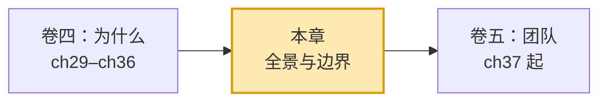
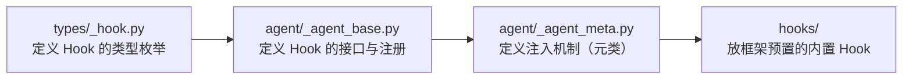
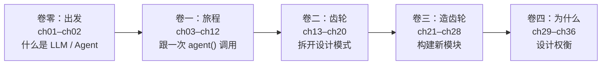

# 第 36 章 架构的全景与边界

前 7 章我们钻进了一个又一个具体决策：`Msg` 的接口长什么样、工具为什么不用装饰器、`god class` 怎么拆、`Hook` 为什么在编译期注入、`ContentBlock` 为什么是联合类型、配置为什么用 `ContextVar`、`Formatter` 为什么独立于 `Model`。每一章都是一次"放大镜下的特写"。这一章换一个镜头——把镜头拉到最远，看整座框架的全景：哪几根柱子撑起了它，柱子之间怎么咬合，哪里留着缝，哪里还在长。

> 架构不是一张设计图，而是无数局部决策沉淀出的形状——你只有在拉远时，才看得见它的边界。

> **上一章：[为什么 Formatter 独立于 Model](./ch35-formatter-separate.md)**

---

## 36.1 路线图

本章是第四卷的收官，也是整本书前 36 章的"地图复盘"。我们要把分散在各卷的概念重新拼回一张完整的依赖网络里。

读完这一章，你应该能回答三个问题：框架的 25 个模块怎么分层、谁站在哪一层、哪些角落是"合理但别太较真"的妥协。带着这三个问题往下走。

---

## 36.2 知识补全：什么叫"分层架构"

在拉全景之前，先建立一点关于"分层"的直觉。

想象一栋楼。地基只负责承重，不关心楼上是写字楼还是酒店；二楼的装修可以挑自己喜欢的地板，但绝不能砸承重墙；三楼的租户用着二楼的水电，却不需要知道水管怎么走的。楼能盖高，靠的是一条朴素的规矩——**上层用下层，下层不知道上层存在**。

软件里的分层架构是同一个道理：把模块按"谁依赖谁"排成几层，规定**依赖只能向下指**。它的好处不是"好看"，而是两条硬道理：

- **可替换**。换掉上层的实现，下层纹丝不动；换掉下层的供应商（比如把 Redis 记忆换成向量库记忆），上层只要接口没变就能继续跑。
- **无环**。只要依赖单向流动，就不会出现"A 用 B、B 用 A"的循环导入——那是最难解的工程债。

> 分层不是把代码物理地放进几个文件夹，而是让"谁认识谁"形成一棵向下生长的树。树没有环，导入就没有死结。

AgentScope 的 25 个顶层模块自然地落进四层。下面我们就按这四层，把全景图摊开。

---

## 36.3 四层全景：从地基到编排

AgentScope 的顶层模块分布在 `src/agentscope/` 下，按依赖关系分四层。先看图，再拆解。

```mermaid
flowchart TD
    subgraph L1["基础层 · 谁也不依赖"]
        MSG["message<br/>消息类型"]
        MOD["module<br/>StateModule"]
        TYP["types<br/>跨模块类型"]
        UTL["_utils<br/>公共工具"]
    end

    subgraph L2["核心层 · 只依赖基础层"]
        MEM["memory<br/>记忆"]
        MDL["model<br/>模型适配"]
        FMT["formatter<br/>格式转换"]
        TOK["token<br/>Token 计数"]
        TOL["tool<br/>工具"]
        EMB["embedding<br/>向量嵌入"]
    end

    subgraph L3["Agent 层 · 依赖核心层"]
        AGT["agent<br/>Agent 实现"]
        PLN["plan<br/>规划"]
        TTS["tts<br/>语音合成"]
    end

    subgraph L4["编排层 · 依赖 Agent 层"]
        PIP["pipeline<br/>多智能体编排"]
        RAG["rag<br/>检索增强"]
        SES["session<br/>会话"]
        TRC["tracing<br/>追踪"]
        A2A["a2a<br/>A2A 协议"]
        RLT["realtime<br/>实时交互"]
        MCP["mcp<br/>MCP 客户端"]
        EVL["evaluate<br/>评估"]
    end

    L1 --> L2 --> L3 --> L4
```

四层依赖规则只有三条，可以背下来：

1. **基础层不依赖任何其他层**。`message`、`module`、`types`、`_utils` 是独立的。
2. **每一层只依赖它下面的层**。`memory` 依赖 `module` 和 `message`，`agent` 依赖 `memory`、`model`、`formatter`、`tool`。
3. **依赖必须单向向下**。让 `message` 反过来依赖 `agent`，立刻出现循环导入。

> **设计一瞥**
>
> 这套分层不是某个人拍脑袋规定的，而是**长出来的**。当你尝试给每个模块找到"最少的依赖集合"，它会自动滑进这四层里的某一层。反过来，当某个模块"想往上层走"（比如让基础层依赖编排层），导入系统会用一个 `ImportError` 告诉你越界了。

### 每层在做什么

用一栋楼打比方，把四层对应起来：

| 层 | 框架模块 | 类比角色 | 关键词 |
|---|---|---|---|
| 基础层 | `message`、`module`、`types`、`_utils` | 地基与承重墙 | 稳定、零依赖 |
| 核心层 | `memory`、`model`、`formatter`、`tool`、`token`、`embedding` | 水电与电梯 | 单一职责、可换供应商 |
| Agent 层 | `agent`、`plan`、`tts` | 楼层租户 | 组合核心能力 |
| 编排层 | `pipeline`、`rag`、`session`、`tracing`、`a2a`、`realtime`、`mcp`、`evaluate` | 楼顶花园与天线 | 协作、可观测、对外协议 |

最有意思的是**承重墙**：`message`（`Msg` 类型）和 `module`（`StateModule` 抽象）几乎被所有上层依赖。本书卷一跟过一次 `agent()` 调用，那次旅程的起点和终点都落在 `Msg` 上——它就是贯穿整栋楼的主水管。

---

## 36.4 核心与边缘：哪些是"主线"，哪些是"侧线"

不是所有模块地位相等。本书前 35 章反复出现的，是 8 个"核心模块"；另外十几个是"边缘模块"或"集成模块"——它们存在、可用，但不是理解框架设计的必经之路。

### 核心八件套

| 模块 | 职责 | 本书的章节归属 |
|---|---|---|
| `message` | `Msg`、内容块、思维链 | 卷一、卷四 |
| `module` | `StateModule` 序列化与子模块追踪 | 卷二、卷三 |
| `memory` | 工作记忆、长期记忆、多种后端 | 卷二、卷三 |
| `model` | OpenAI / Anthropic / DashScope 等模型适配 | 卷一、卷四 |
| `formatter` | 消息↔模型 API 的双向翻译 | 卷一、卷四 |
| `tool` | `Toolkit`、注册、中间件、分组 | 卷二、卷三 |
| `agent` | `ReActAgent` 及推理循环 | 卷一、卷二、卷三 |
| `pipeline` | `MsgHub` 与多智能体编排 | 卷二 |

这八个是"承重结构"。看懂了它们，就看懂了 AgentScope 90% 的设计意图。

### 边缘模块：存在但不展开

| 模块 | 职责 | 为什么是边缘 |
|---|---|---|
| `rag` | 检索增强生成 | 是 `embedding` + 向量库 + `memory` 的组合，本质是核心能力的应用 |
| `embedding` | 向量嵌入 | 专为 `rag` 服务 |
| `token` | Token 计数 | 为 `formatter` 的截断服务，是个小工具 |
| `tracing` | OpenTelemetry 追踪 | 生产可观测性，非设计主线 |
| `session` | 跨请求状态持久化 | 工程化能力，不影响核心抽象 |
| `plan` | 规划子系统 | `ReActAgent` 的进阶功能 |
| `tts` | 语音合成 | 服务于 `realtime`，语音场景专用 |

### 协议与集成模块

| 模块 | 职责 | 定位 |
|---|---|---|
| `a2a` | Agent-to-Agent 协议 | 对接 Google A2A 标准，跨框架协作 |
| `mcp` | Model Context Protocol 客户端 | 接入外部 MCP Server，扩展工具来源 |
| `realtime` | 实时语音交互 | WebSocket + 流式音频 |
| `evaluate` | 评测与基准 | Benchmark 工具 |

### 一处历史痕迹：弃用与迁移

框架里还有一对"老与新"：旧的 `tune` 已弃用并改名为 `tuner`。`import tune` 会直接抛 `ImportError`，提示用户改用新名字。这是框架自我演进时留下的化石——旧入口不删（怕老代码直接断），但用 `raise ImportError` 主动报错，把人引到新地址。一个成熟框架对"改名"这种破坏性变更的处理，往往就藏在这种小细节里。

> **设计一瞥**
>
> 像 `rag` 和 `memory` 这种"含多种后端"的模块，目录体积看着很大，但绝大部分行数来自各种 adapter（`rag/` 下的多种向量库、`memory/` 下的 Redis / SQLAlchemy / Mem0 / ReMe）。**核心抽象本身很小**——读它们时，先认准 `MemoryBase`、`VectorStoreBase` 这种基类，比读十个 adapter 高效得多。

---

## 36.5 边界模糊处：架构也有"灰色地带"

四层分层听起来干净，但真到细节里，总有些地方说不清该归哪层。这些"模糊处"不是 bug，而是真实工程里的妥协痕迹。挑三处最典型的看。

### 模糊处一：`_utils/_common.py`——工具箱还是垃圾桶

每个项目都有这样一个文件：名字叫"公共工具"，实际什么都往里塞。`_parse_tool_function`（给函数生成 JSON Schema）其实属于 `tool` 模块；`_remove_title_field`（处理 Schema）也是；只有 `_get_timestamp` 这种才真是通用的。

为什么放这儿？因为这些函数被 `tool` 模块和它的**测试文件**同时需要，放在 `tool` 内部会让测试跨包导入，放在最底层 `_utils` 则谁都方便拿。这是一个典型的"为可测试性付出的分类代价"——逻辑上该归 `tool`，物理上放 `_utils`。

> 判断一个 `_utils` 文件健不健康，有个简单标准：如果它的内容能被一句话概括（"时间工具""序列化工具"），健康；如果列出来是一锅杂烩，它就开始变垃圾桶了。

### 模糊处二：`Hook` 的定义散在三处

本书第 32 章讲过 `Hook` 是怎么在编译期注入的。这里从"全景"角度再看一次——`Hook` 的相关定义其实分散在三处：

- **类型**在 `types/_hook.py`（`AgentHookTypes`、`ReActAgentHookTypes`）
- **接口与注册**在 `agent/_agent_base.py`（`register_instance_hook`、`register_class_hook`）
- **注入机制**在 `agent/_agent_meta.py`（在元类的 `__new__` 里把方法包起来）
- **内置实现**在 `hooks/` 目录（框架自带的、开箱即用的 Hook 函数）

这里的认知陷阱是：看到 `hooks/` 目录会以为"Hook 的定义都在这儿"，其实它只放预置实现。这是一种"类型/接口/注入/内置实现"的多处分离——合理，但第一次看的人会迷糊。这正是为什么第 32 章要专门用一整章讲清楚 `Hook` 的来龙去脉。

### 模糊处三：`types/` 不是 Python 的 `typing`

`types/` 目录里放的是 AgentScope 自己定义的跨模块类型——`ToolFunction`、`JSONSerializableObject` 之类。它处在依赖图的最底层，几乎所有模块都要导入它。

注意它**不是** Python 标准库的 `typing`。名字撞车纯属巧合，但确实容易让新人误以为"这是类型注解工具"。事实上，它更像是框架的"共享类型字典"——当多个不相邻的模块需要用到同一个类型（比如 `tool` 和 `agent` 都需要 `ToolFunction`），就把它提到最底层共享，避免跨层依赖。

> 三个模糊处的共性是：**物理位置服从依赖约束，而不是服从"概念归属"**。当一个东西该放哪，工程师优先考虑的是"放在哪不会产生循环依赖、哪一层都能拿到"，其次才是"放在哪最语义化"。理解了这一点，再看任何大型框架的目录结构，都不会觉得"乱"了。

---

## 36.6 扩展点：框架在哪里留了口子

一个好的框架不只是"代码写得好"，更是"给别人留了改的地方"。AgentScope 留下的扩展点，覆盖了几乎每一层。把前面各章的扩展点汇总成一张表：

| 扩展点 | 入口 | 替换什么 | 本书的章节 |
|---|---|---|---|
| 自定义记忆 | 继承 `MemoryBase` | 记忆后端与策略 | 卷三 |
| 自定义格式器 | 继承 `FormatterBase` | 消息↔API 的翻译 | 卷三、卷四 ch35 |
| 自定义模型 | 继承 `ChatModelBase` | 接入新模型供应商 | 卷三 |
| 自定义智能体 | 继承 `AgentBase` | 改写推理循环 | 卷三 |
| 自定义工具 | `register_tool_function` | 注册普通函数为工具 | 卷二、卷四 ch30 |
| 自定义中间件 | `register_middleware` | 包裹工具调用 | 卷二 |
| 自定义 Hook | `register_*_hook` | 在生命周期事件里插入逻辑 | 卷四 ch32 |

这张表读出两件事：

1. **每一层都开放**。从地基（`StateModule`）到顶层（`pipeline`），每一层都允许子类化或注册式扩展。没有一个"封闭的内核"。
2. **扩展方式高度一致**。换记忆、换格式器、换模型、换智能体，套路是同一个：继承基类 + 实现约定接口。学会了一种，其他几种触类旁通。

### 可能往哪长

框架不是博物馆展品，它在持续长。从现在的扩展点结构，能合理推测几个演化方向：

- **更多记忆后端**。向量库记忆、图数据库记忆。`MemoryBase` 已经把口子留好，新后端只是又一个 adapter。
- **更多模型适配**。新模型 API（Grok、Mistral、国产新模型）——只要它符合 `ChatModelBase` 的接口契约，就能挂进来。
- **A2A 生态**。跨框架 Agent 协作。`a2a` 模块是 AgentScope 跟外部世界对话的窗口，未来会出现"用 AgentScope 写的 Agent 跟用 LangChain 写的 Agent 协作"的场景。
- **MCP 集成加深**。MCP 让工具来源不再局限于本地注册——任何 MCP Server 都能成为工具供应商。
- **多模态 Agent**。视觉、语音、视频输入。`ContentBlock` 用联合类型设计，本就是为了多模态预留——加一种新内容块，不改既有消息结构。

> **设计一瞥**
>
> 注意这些演化方向**没有一个需要改动基础层**。它们要么是新增 adapter，要么是新增子类，要么是新增协议模块。这说明框架的分层在"承重墙"意义上是稳固的——地基不会因为楼上装修而动摇。这是分层架构最深的价值：**它让系统可演化，而不必推倒重来**。

---

## 36.7 全书复盘：你走过的 36 章

把镜头再拉远一档，回看整个旅程。

从"什么是 LLM"到"为什么这样设计"，36 章串成一条线：

- **卷零**给你两个锚点——LLM 是什么、Agent 又是什么。
- **卷一**陪一次 `agent(msg)` 调用走完全程，看一条消息怎么从入口流到模型再流回来。
- **卷二**把旅途里遇见的零件拆开看：记忆、工具、Hook、Pipeline 各自怎么工作。
- **卷三**教你怎么造新零件——自定义记忆、格式器、智能体。
- **卷四**（你刚走完的）解释**为什么是这种形状**：消息接口为什么这么定、工具为什么不用装饰器、`god class` 怎么拆、`Hook` 为什么编译期注入、`ContentBlock` 为什么是联合类型、配置为什么用 `ContextVar`、`Formatter` 为什么独立于 `Model`。

走到这里，你现在能够：

- 看懂 AgentScope 任意模块的**职责边界**和**依赖位置**。
- 追踪一个请求从入口到返回的**完整路径**，并解释每一跳的"为什么"。
- 构建新的工具、记忆、格式器、智能体、Pipeline，知道扩展点在哪、套路是什么。
- 理解框架的**设计权衡**——以及每个权衡背后付出的代价。
- 在参与框架讨论或贡献代码时，知道改动落在哪一层、会不会越界。

> 36 章下来，最值得带走的不只是"AgentScope 怎么用"，而是**一种读框架的方法**：先看分层、再找扩展点、最后看边界模糊处。这套方法用在任何大型代码库上都成立。

---

## 36.8 从这里往哪去

本书是"概念与设计之书"，刻意没有写成操作手册。如果你想从"读懂"走到"用熟"和"贡献"，三条路值得走：

1. **动手实现一个扩展**。挑一个扩展点（比如自定义记忆后端），从头实现一遍。这是检验"是否真懂了接口契约"的最快方式。
2. **读 AgentScope 1.0 论文（arXiv:2508.16279）**。论文用三大维度概括框架设计——Foundational Components（基础组件）、Agent Infrastructure（智能体基础设施）、Multi-Agent Orchestration（多智能体编排）。本书的章节结构恰好与之对应，论文提供全局视角，本书提供设计理由。
3. **跟踪官方文档与 Issues**。文档覆盖每个模块的用法和配置；Issue 区是看"真实使用者遇到的边界情况"的窗口，往往是设计权衡最鲜活的注脚。

> **设计一瞥**
>
> 论文里的一句话值得反复回味：一个 Agent 框架的核心挑战，不是"实现一个能推理的智能体"，而是"让推理、记忆、工具、格式化这些能力**可组合、可替换、可扩展**"。本书 36 章本质上都是在拆解这句话——每一个"为什么这样设计"，都是为了让这个组合承诺成立。

---

## 检查点

1. **AgentScope 的四层分层是"人为规定"还是"自然形成"的？依据是什么？** 自然形成。当你尝试给每个模块找到最少依赖集合，它会自动落进某一层；反过来，一旦越界（比如让基础层依赖编排层），Python 的导入机制会立刻报 `ImportError`。分层是依赖约束的副产品。

2. **为什么 `rag`、`memory` 这类模块目录体积很大，核心抽象却很小？** 因为这些模块含多种后端实现（多种向量库、Redis / SQLAlchemy / Mem0 / ReMe 等），绝大部分行数是 adapter。核心抽象（`MemoryBase`、`VectorStoreBase`）本身很小。读这些模块，先认准基类比读十个 adapter 高效。

3. **`Hook` 的相关定义分散在哪几个地方？这种分散是 bug 还是合理设计？** 分散在三处加一个目录：类型在 `types/_hook.py`、接口与注册在 `agent/_agent_base.py`、注入机制在 `agent/_agent_meta.py`、内置实现在 `hooks/`。这是"类型/接口/注入/内置实现"的分离，合理但容易让人误以为"Hook 都在 `hooks/` 目录"。第 32 章专门用一整章解开这个迷雾。

4. **`_utils/_common.py` 里为什么会有 `_parse_tool_function` 这种"明明属于 `tool` 模块"的函数？** 因为它被 `tool` 模块本体和它的测试文件同时需要。放在 `tool` 内部会让测试跨包导入；放在最底层的 `_utils` 则任何层都能方便取用。这是"为可测试性付出的分类代价"——物理位置服从依赖约束，而非概念归属。

5. **框架未来的演化方向（更多记忆后端、更多模型适配、A2A 生态等）为什么不需要改动基础层？这说明了什么？** 因为这些演化要么是新增 adapter、要么是新增子类、要么是新增协议模块，全都不动 `message`、`module`、`types` 这些承重墙。这说明分层架构的核心价值在于**让系统可演化**——地基不因楼上装修而动摇。

---

## 下一站预告

到此为止，你看过的 36 章讲的都是**单个智能体**怎么想、怎么记、怎么用工具、怎么被格式化、怎么被配置。但现实里的复杂任务——写一份报告、做一个产品决策、跑一次多步研究——几乎都不是一个智能体能独立完成的。

下一卷把镜头从"个体"转向"群体"。多个智能体怎么组成一支团队？谁负责指挥、谁负责执行、消息在成员之间怎么流动、怎么避免"三个和尚没水喝"？从单兵作战到协作编排，这是 Agent 框架的下一道大题。

> **下一章：[智能体团队是什么：从单兵到协作](../volume-5-team/ch37-what-is-team.md)**
