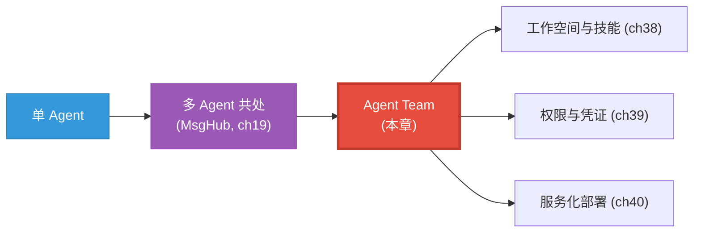
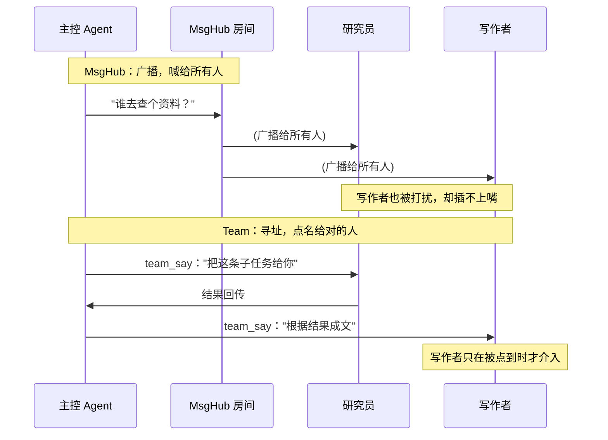
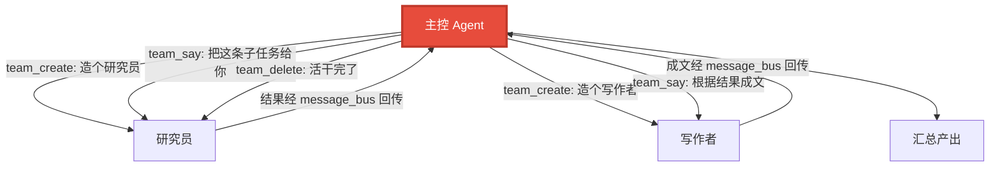

# 第 37 章 智能体团队是什么：从单兵到协作

> 一个 ReActAgent 已经能"想一步、做一步"。可一旦任务变大——策划一次跨城旅行、调研一个课题、开发一个功能——它就开始力不从心：上下文越堆越长，规划、执行、总结全挤在一个脑袋里，还没法真正并行。AgentScope 2.0.1 的回答是：把多个智能体组织成一支**团队**。

> **上一章：[第 36 章 架构的全景与边界](../volume-4-why/ch36-panorama.md)**

---

## 37.1 路线图

这是第五卷——也是 2.0.1 最重要的一条新主线——的起点。我们要从"一个聪明的个体"，走向"一支能分工协作的队伍"。



红色是当前位置：从"一群人共处"，升级到"一支有组织的团队"。

这一卷的四个章节其实是一条递进链条：本章先把"团队"这个抽象讲透——它是什么、为什么需要、和已有的 MsgHub 有什么本质区别；第 38 章给每个成员配"工位"（工作空间）和"本事"（技能）；第 39 章再加上"门禁"（凭证与权限），让团队既能干实事又不至于闯祸；第 40 章把整支团队封装成一个可部署的服务。换句话说，团队这一卷不是在讲某个孤立功能，而是在回答一个问题：**当智能体从"一个人干活"走向"一群人协作"时，框架要补齐哪些抽象，才能既灵活又可控**。本章就是这个回答的第一块基石。

---

## 37.2 单兵的极限

先说清楚单 Agent 到底卡在哪。一个 ReActAgent 的全部"记忆"是它的工作记忆——一轮轮对话和工具结果都堆在里面。任务一复杂，问题就来了：

- **上下文膨胀**：每多一步，历史就长一截，模型要消化的输入越来越多，又慢又贵，还容易"走神"。
- **职责混杂**：规划、查资料、写代码、做总结，全靠同一个系统提示和同一组工具。一个角色所需的能力，会污染另一个角色的判断。
- **无法并行**：一个 Agent 是单线程的"想—做"循环，碰上"同时查三个方向"的任务只能串行。

这些不是 bug，是"单脑"结构的固有边界。突破它的思路很自然：**别让一个脑袋扛所有事，让多个脑袋分工**。

值得把这三条再往下挖一层，因为它们是后面所有设计的动机。

**上下文膨胀为什么致命**，不只是"慢和贵"。更隐蔽的代价是**注意力稀释**：大模型虽然有很长的上下文窗口，但它对窗口里不同位置的信息并不是同等敏感——越靠后、越相关的内容权重越高，早期埋下的关键约束（比如"用户明确说预算不超过三千"）很容易被几十轮工具调用淹没，最终在第十二步被悄悄违反。这不是某个模型的缺陷，而是"把所有状态塞进一条线性历史"这种做法的通病。一个人要同时记着规划、资料、代码、还要回应你，记岔是迟早的事。

**职责混杂的真正危害**也不只是"角色串味"，而是**能力互相打架**。想象给同一个 Agent 同时挂上"写代码"和"审代码"两套工具——它既要在执行时大胆假设、快速试错，又要在审阅时挑刺求稳、宁错杀不放过。这两种心态本就矛盾，硬塞进一个系统提示里，模型在两种语气之间反复横跳，结果常常是两头不到位。人类世界都知道"作者和审稿人必须分开"，道理在这里完全适用。

**无法并行**听起来像性能问题，其实更是**能力问题**。有些任务天然是"扇出"的——调研一个课题，可能要同时看三四个方向，再交叉印证。让单 Agent 串行走，它只能查完 A 再查 B，查到一半发现 A 的结论影响了对 B 的判断，又得回头重来。这种"探查—回溯—再探查"的开销，在并行结构里几乎可以消掉。

把三条合起来看，单 Agent 卡住的根因只有一个：**一个上下文窗口装不下一个复杂任务应有的全部状态**。团队的解法也就清晰了——把状态拆开，每个成员守一份干净的、职责单一的上下文，再用一套通信机制把它们连起来。

| 单 Agent 的症状 | 表面问题 | 深层根因 |
|----------------|---------|---------|
| 上下文越长越慢越贵 | token 开销 | 关键约束在长历史里被稀释、被遗忘 |
| 一个 Agent 干多种活 | 提示词难写 | 不同角色所需的能力与心态互相打架 |
| 复杂任务走不动 | 跑得慢 | 无法并行探查、无法独立回溯 |

---

## 37.3 团队的核心思想

一支团队要做的事，抽象出来就三件：

1. **分工**：每个智能体承担一个清晰的角色——规划者负责拆任务、研究员负责查资料、写作者负责成文、审阅者负责把关。
2. **寻址**：成员之间要能"点名"对话——规划者要把子任务派给研究员，研究员要把结果回传给写作者，而不是对着空气喊话。
3. **协作**：围绕一个共同目标，把各自的结果汇拢成一个整体产出。

这三件并不是并列的清单，而是有先后因果：**分工**是前提（没有角色就没有"该找谁"的概念），**寻址**是机制（有了角色就要能准确地把消息送到对的人手里），**协作**是目标（分工和寻址最终服务于"汇拢成一个产出"）。少了任何一环，多智能体就退化成"各干各的"。

第 19 章的 `MsgHub` 已经迈出了第一步——它让一群 Agent 在一个"房间"里互相喊话（发布-订阅式的广播）。但那更像"一群人围坐闲聊"，缺少**组织结构**：没有工位、没有上下级、成员不能动态增减、更不能跨进程。Agent Team 要补齐的，正是这些。

### 广播 vs. 寻址：差在哪

为了感受"组织结构"的差别，把 MsgHub 的广播和 Team 的寻址放在一起看：



广播的好处是**简单**——谁想听谁听，不用知道对方叫什么；坏处也明显：消息没有明确接收方，无关的成员被迫陪听，对话节奏被噪声拖乱，更没法做到"我只想让研究员看见、不想让审阅者提前剧透"。寻址恰好相反：它要求你**知道要把消息送给谁**，换来的是干净的对话边界和可控的信息流。团队之所以比 MsgHub"更像一支队伍"，关键就在它默认走的是寻址，而不是广播。

### 三层类比

把三种形态摆在一起，差别就清楚了：

| 形态 | 类比 | 特征 |
|------|------|------|
| 单 Agent | 一个人单干 | 一个脑袋，串行 |
| MsgHub | 一群人在同一个房间里喊话 | 能广播，但无组织、无工位 |
| **Agent Team** | 一家有分工、工位、内部邮件系统的公司 | 可寻址、可服务化、可跨进程、成员可动态增减 |

Agent Team 是三者里最强的抽象：它有组织结构（成员有角色）、有专属资源（工作空间）、有内部通信（消息总线）、还活着——主控 Agent 可以在运行中**增减成员**。

这个"还活着"很关键，值得单独点一句。前面两种形态的组织结构都是**静态**的：单 Agent 就那一个，MsgHub 的成员在创建房间时就定死了。Agent Team 打破了这个限制——成员可以在运行中**被造出来、被派活、又被解散**，就像公司临时招个项目组、干完活就散。这不是锦上添花，而是把"组织结构本身"变成了一种可以在运行时调整的资源，下一节会看到这条性质怎么落地。

---

## 37.4 2.0.1 是怎么落地的

讲清楚"是什么"之后，看看这套能力在框架里由哪些部分承担。这里只讲概念，不钻源码。

### 服务外壳：app 模块

团队要能协作，前提是智能体得先"活"在一个可以被反复调用、能管住自己状态的地方。2.0.1 的 `app` 模块用 FastAPI 把 Agent 能力封装成**服务**——一个进程里的 Agent，变成了可以被 HTTP 调用、可以管理会话、可以横向扩展的服务端点。团队就建立在这个服务外壳之上（第 40 章详述）。

为什么团队**必须**先有服务外壳？因为团队的几条核心能力——成员可寻址、可跨进程、状态可追踪——本质上都要求每个成员是一个**有独立生命周期的、可被外部寻址的实体**。如果成员只是进程里一个普通的 Python 对象，它就没有"地址"可言，也没法被另一个进程里的成员找到。服务外壳给每个成员一个稳定的"门牌号"（一个可被 HTTP 寻址的端点 + 一个会话标识），团队的一切协作才得以建立。可以说，**服务外壳是团队的物理底座，团队是建在底座上的组织逻辑**。

### 团队工具：让"组建团队"本身成为能力

最有趣的设计在这里：**主控 Agent 可以把"创建成员""对成员说话""删除成员"当成工具来调用**。换句话说，团队的组织结构不是开发者提前在代码里写死的，而是由主控 Agent **在运行时根据任务自行决定**的。

这些"团队操作工具"大致包括：

- **创建子 Agent / 成员**（`team_create`）：照一个模板（描述"该用哪个模型、哪些工具、什么系统提示"）造一个新成员。
- **对成员说话**（`team_say`）：点名某个成员，把任务交给它。
- **删除成员**（`team_delete`）：任务做完，解散不再需要的成员。

这三个工具的命名本身就是一份团队操作语义：**造、说、散**。读起来像不像一个项目经理的日常？招人、派活、项目结束就解散——这正是 Agent Team 想建模的协作模式。



这里值得停一下，体会"造成员"的入参形态。创建一个成员，本质是递交一份**角色画像**——下面这种示意性片段能帮你看清它的轮廓（仅为示意形态，不是可运行代码）：

```text
team_create(
    role="researcher",          # 角色：决定它怎么被寻址
    model="deepseek-chat",      # 用哪个模型
    skills=["web-research"],    # 带哪套本事（见第 38 章）
    sys_prompt="你是一名严谨的研究员……",  # 它的"性格"
)
```

注意这份画像里**没有**写"它要执行哪些具体任务"——任务是通过随后的 `team_say` 一条条派下去的。这个分离很关键：**"成员是谁"和"成员此刻做什么"是两件事**。前者在创建时定型，后者在运行时流动。正因为如此，一个研究员成员可以反复接不同的子任务，而不必每次都重新造。

### 消息总线：成员之间怎么收发

成员互相通信，靠的是一条**消息总线（message_bus）**。它是个可替换的部件：

- **本地总线**：所有成员在同一个进程里，消息走进程内通道，最简单。
- **Redis 总线**：成员分布在不同进程甚至不同机器上时，换上 Redis 总线，消息照样投递。

| 维度 | 本地总线 | Redis 总线 |
|------|---------|-----------|
| 部署形态 | 单进程 | 多进程 / 多机 |
| 延迟 | 极低（进程内） | 网络 RTT |
| 依赖 | 无 | 需一个 Redis 实例 |
| 适合 | 开发、轻量任务 | 生产、横向扩展 |

总线的"可替换"是关键——它让团队既能在一个脚本里轻量跑，也能拆成多副本部署到大集群上，而团队逻辑本身不用改。背后的设计直觉很朴素：**会变的接进来，不变的留在外面**。通信管道（本地 or Redis）是会随部署形态变的，所以抽成可替换的部件；而"造—说—散"这套团队语义是稳定的，所以写在上层、不随管道变。

这条总线不只是搬运消息，它还天然地承担了**解耦**的角色：发送方不需要知道接收方此刻在哪个进程、是不是在忙着，只管把消息丢给总线；接收方按自己的节奏从总线取。这种"投递与处理分离"，正是后面要讲的"成员状态可追踪、可唤醒"能够成立的前提。

### 成员状态：可追踪、可干预

每个成员都有自己的**状态**（在框架里由专门的状态对象承载）。这意味着：一次团队协作是可以被**追踪**的（谁在干什么）、可以被**取消**的（某条岔路走错了，叫停）、也可以被**唤醒**的（等一个外部事件再继续）。这比 MsgHub 那种"喊完就散"要可控得多。

把"可追踪、可取消、可唤醒"展开一点：

- **可追踪**：因为每个成员有状态对象，外界能看到"研究员正在查资料、写作者在等结果"，协作过程从黑盒变成可观测的过程。出问题时，你能定位卡在哪一个成员、哪一步。
- **可取消**：研究走偏了，不必让整支团队陪着跑完，直接叫停那个成员。这把"试错成本"从"整次任务重来"压到"一条岔路折返"。
- **可唤醒**：成员可以停在一个"等外部事件"的状态上（比如等人审批、等一个定时触发），事件来了再继续，而不必一直占着资源空转。

这三条合起来，把团队从一个"启动了就只能等结果"的黑盒，变成一个**可观测、可干预、可调度**的运行体。这也是为什么团队比 MsgHub 更适合干"正经活"——正经活往往跑得久、岔路多、需要中途介入，黑盒扛不住。

---

## 37.5 什么时候该上团队，什么时候不该

团队强大，但不是万能。一个简单的判断标准：

**适合用团队的场景**：

- 任务能清晰地拆成不同**角色**（规划、研究、写作、审阅各有专长）。
- 需要**并行**（同时探查多个方向）。
- 需要**长期协作**（成员要保持各自的上下文，持续配合）。

**不必上团队的场景**：

- 简单问答、单线任务——一个 Agent 配几个工具就够。
- 任务没有可分工的结构——硬拆只会徒增开销和协调成本。

> **类比**：一个人的事，别开公司。让一个会调工具的 Agent 干，比养一支团队便宜得多、也好调试得多。团队解决的是"复杂分工"，不是"一切"。

光给两个清单还不够具体，落到一个常见疑问上：**"我的任务有点复杂，到底算不算复杂到要上团队？"** 一个实用的判别法是看**任务里有没有天然的扇出与汇拢**。所谓扇出，是指一个步骤会产生多个相互独立、可并行的子任务（比如"同时调研三个竞品"）；所谓汇拢，是指这些子任务的结果最终要被综合成一份产出。两个特征都有，团队大概率值得；只有一个、或者都没有，单 Agent 加几个工具往往更省心。另一个辅助判据是**角色的"心态"是否冲突**——如果一个任务天然要求"既要大胆假设、又要严苛审查"，这两种心态很难塞进同一个提示词，那拆成两个成员各司其职就明显更顺。

再多说一句反方向的话：**别为了用团队而用团队**。团队带来的不只是能力，还有协调成本（消息往返、状态同步、成员管理）和更高的不确定性（动态结构意味着每次跑的组织都可能不一样）。如果你的任务用一个 Agent 已经能稳定干完，把它硬拆成团队，往往既慢又难调试——因为现在你得追的不是一条线，而是一张网。团队的收益要大到能盖过这些额外开销，才划算。

| 决策信号 | 倾向单 Agent | 倾向 Agent Team |
|---------|-------------|----------------|
| 任务结构 | 单线、线性 | 扇出 + 汇拢 |
| 角色心态 | 一致 | 互相冲突（如执行 vs 审查） |
| 并行需求 | 无 | 明显可并行 |
| 调试成本敏感度 | 高（要快、要稳） | 低（能换来能力） |

---

## 37.6 设计一瞥：把"结构"也变成智能体的能力

这一章最值得咀嚼的设计，是**"创建成员"被设计成一个工具**。

传统思路里，多 Agent 系统的组织结构是开发者提前设计好的：谁是主管、谁有几个下属、谁向谁汇报，都写死在代码或配置里。AgentScope 2.0.1 反其道而行——把"招人""派活""解散"都做成主控 Agent 可调用的工具。于是，**团队长成什么样，由模型在看到具体任务后自己决定**：简单的任务招一两个人，复杂的多招几个；某条路走不通，就解散重召。

> **设计一瞥：结构即能力**
>
> 这和 ReAct 的精神一脉相承。ReAct 把"**下一步做什么行动**"交给模型决定；Agent Team 把"**需要哪些成员、怎么组织**"也交给模型决定。前者让"行动"成为能力，后者让"结构"成为能力。两者合起来，智能体就从"按既定流程执行"走向"根据情况自行组织"。代价是更高的不确定性和成本——所以它才需要第 38 章的工作空间和第 39 章的权限来做护栏。

把这个设计放到更宽的视角里看，其实是在回答一个长期争议：**多智能体系统的组织结构，该由人定，还是该涌现？** 两种主张各有道理。"人定派"认为结构是设计者的责任，提前画好组织图才可控、可复现；"涌现派"认为结构应该由任务驱动，不同的任务本就该有不同的组织，硬套一张固定图反而别扭。AgentScope 2.0.1 的选择很明确：**默认让结构涌现，再用工作空间和权限把涌现的边界框死**。换句话说，它不是无脑地"什么都交给模型"，而是"让模型在安全围栏里自由地组织"。这是一种很务实的折中——既拿到了动态结构的灵活性，又用工程手段兜住了失控的风险。

这个选择还有一个常被忽略的好处：**它让团队天然适合处理开放式任务**。所谓开放式，是指你在任务开始时并不完全清楚它最终需要几步、要哪些角色——比如"帮我把这个想法做成一个能演示的原型"，中途可能要调研、要画图、要写代码、要写文档，具体哪些角色用得上，要做了才知道。静态结构在这种任务前面会反复返工（你猜错了角色组合），而动态结构可以"边走边招"，按需扩张。这正是把结构变成能力之后，最闪光的用武之地。

---

## 37.7 检查点

**1. 单 Agent → MsgHub → Agent Team，能力是怎么一步步递进的？**

单 Agent 是一个脑袋串行干活；MsgHub 让多个 Agent 在一个"房间"里广播式喊话，能共处但无组织；Agent Team 进一步给出可寻址、可服务化、可跨进程、成员可动态增减的组织结构。三者是从"个体"到"乌合之众"再到"有编制的队伍"。递进的关键在于：每一步都在前一步的基础上补一块结构性能力——MsgHub 补的是"共处"（能互相听见），Agent Team 补的是"组织"（能点名、能分工、能动态调整）。所以它们不是替代关系，而是层层叠加：团队内部照样可以用 MsgHub 做广播，只是默认走更精确的寻址。

**2. 为什么"创建成员"被设计成一个工具，而不是配置项？**

因为团队的组织结构最好由**任务本身**决定。把它做成工具，主控 Agent 就能在运行时根据任务复杂度自行招人、派活、解散，而不是开发者提前猜死结构。这是"把结构变成智能体能力"的思路，与 ReAct 把行动交给模型一脉相承。再往深一层：配置项意味着开发者要预先穷举所有可能需要的角色组合，这对开放式任务根本做不到——你不知道中途会不会冒出一个"需要一个画图的人"的需求。工具化之后，"我现在缺个什么角色"成了模型在运行时能回答的问题，组织结构因此具备了随任务生长的能力。

**3. 消息总线为什么要做成可替换（本地 vs Redis）？**

因为团队的部署形态会变。一个脚本里轻量跑，用本地总线即可；拆成多副本上集群，就得换成 Redis 这类跨进程总线。可替换让团队逻辑不变，只换"通信管道"。这背后的设计直觉是"会变的接进来、不变的留在外面"：团队语义（造—说—散）是稳定的，写在管道之上；管道（本地 or Redis）是会变的，抽成可替换部件。于是"单机调试"和"集群部署"共享同一套团队代码，差别只在一个配置项。

**4. 动态创建成员会带来哪些风险？**

成本失控（招太多成员，token 和时间暴涨）、行为失控（成员互相踢皮球、无限循环建成员）、结果难追踪（谁产出了什么说不清）。正因为如此，后面要用工作空间（隔离）和权限（护栏）来约束它。这里可以补一条容易忽略的：**动态结构也意味着结构不可复现**——同一句话两次跑，招出来的成员组合可能不一样，出问题时排查难度更高。这是"涌现"的代价，也是为什么安全护栏不是可选的、而是必备的：在不可完全复现的动态结构里，只有把每个成员能干什么、能碰什么用权限死死框住，才能保证不管结构怎么长，它都不会长到危险的地方去。

如果这四个问题你都答得上来，那"团队到底是什么"已经清楚了。接下来看团队的两个基础设施工位——工作空间与技能。

---

## 37.8 下一站预告

团队要有"工位"——一块属于某个成员的、可隔离的工作区；也要有"本事"——一组可整组取用的能力。下一章我们看工作空间与技能，如何让团队成员既专业又安全。

> **下一章：[第 38 章 工作空间与技能：团队的工位与本事](./ch38-workspace-skill.md)**
