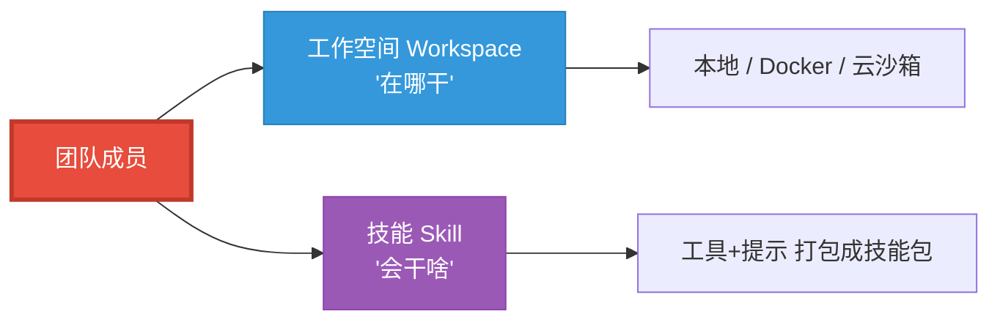
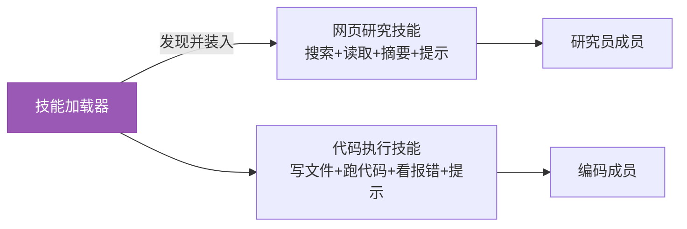
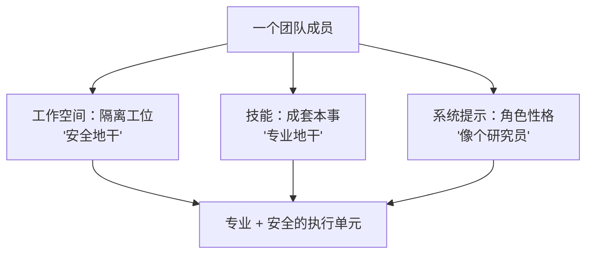

# 第 38 章 工作空间与技能：团队的工位与本事

> 上一章我们让一群智能体组成了团队。但一支真团队光有"通信系统"还不够——每个成员得有自己的**工位**（一块属于自己的、干完活不会弄乱别人家的地方），还得有各自的**本事**（按角色配备的能力包）。这一章讲这两样基础设施：工作空间（Workspace）给成员一块隔离的执行地盘，技能（Skill）给成员一整套成套的本事。

> **上一章：[第 37 章 智能体团队是什么：从单兵到协作](./ch37-what-is-team.md)**

---

## 38.1 路线图



工作空间解决"在哪里执行"，技能解决"会做什么"。单独看，一个管安全、一个管能力；合起来，它们把一个泛泛的成员，变成一个**专业且安全**的执行单元——这也是团队"专业化分工"能真正落地的两块基石。

---

## 38.2 为什么需要工作空间

智能体调工具时，常常要动"真家伙"：执行一段代码、读写文件、跑个脚本、装个依赖。问题来了——让它直接在你宿主机（就是你自己那台机器）的文件系统上乱来，风险显而易见。

### 三种会出事的场景

把风险具象一下，比抽象地讲"不安全"更有感觉：

1. **误伤自己的文件**：你让智能体"把结果写进 `output` 目录"，它理解偏了，把 `output` 当成相对当前目录、递归清空了半层家目录。没有隔离，一次手滑就是一场灾难。
2. **环境污染**：智能体为了跑某段代码，`pip install` 了一堆包，把你原本干净的环境搅乱；下次你跑别的项目，突然冒出版本冲突。
3. **执行危险命令**：智能体在 ReAct 循环里"灵机一动"执行了 `rm -rf` 之类的东西，或者跑了一段从网上拿来的、并不可信的代码。没有围栏，它就是直接在你的系统上操作。

这三类风险的共同点是：**智能体的行动有真实副作用，而它的判断并不总是可靠**。ReAct 范式本来就鼓励"大胆假设、快速试错"——这在沙箱里是优点，在宿主机上就是隐患。

解决办法是给每个成员一块**受控的工作区**：它只能在这块区域里读写和执行，越界就被拦住。智能体依然可以大胆试错，但试错的"爆炸半径"被限制在这块沙箱里。这就是工作空间的由来。

> **类比**：工作空间就是给每个员工一个独立工位，配上带锁的抽屉。他在自己工位上怎么折腾都行——哪怕把桌面砸了，也是砸自己的桌面；但伸手去翻隔壁工位的抽屉、或者去动公司的总配电箱，门禁不让。

---

## 38.3 三种工作空间：隔离与开销的阶梯

"隔离"不是非黑即白的，而是一道光谱。框架把工作空间抽象成一个统一接口（`WorkspaceBase`），底下提供三种实现，隔离强度和开销逐级递增——你可以按任务的风险等级，挑合适的那一档。

| 实现 | 隔离方式 | 隔离强度 | 开销 | 适用场景 |
|------|---------|---------|------|---------|
| **本地工作空间** | 进程内的一个目录 | 弱 | 最低 | 开发、可信任务 |
| **Docker 工作空间** | 一个容器 | 中 | 中等 | 需要环境隔离的执行 |
| **云沙箱（E2B）** | 远端云上的隔离环境 | 强 | 最高 | 执行不可信代码、多租户 |


逐个看清这三档的差别，它们不是简单的"强一点/弱一点"，而是**隔离原理根本不同**：

- **本地工作空间**只是把活动范围限制在一个目录里。它拦得住"写错地方"（路径越界），但拦不住"执行危险命令"——毕竟代码还是在你自己的操作系统上跑，权限和宿主机共享。它适合你信得过的任务：自己写的工具、读自己提供的文件。
- **Docker 工作空间**把执行整个塞进一个容器。容器有自己的文件系统视图、自己的依赖、甚至自己的网络策略，和宿主机隔开。智能体在容器里 `pip install` 不会污染你的环境，它"砸桌面"也只砸容器那张桌面。环境隔离到位了，但容器还是跑在你机器上，算力共享。
- **云沙箱**更进一步，把执行环境整个搬到远端云上（如 E2B）。智能体的代码跑在远端一台临时分配的、用完即弃的机器里，连"跑挂了影响我这台机器"都不存在了。隔离最强，代价是要联网、要付费、延迟也最高。它适合跑**完全不可信**的代码（比如执行用户提交的任意脚本），或多租户场景下必须把不同用户彻底隔开的情形。

选择哪一档，本质是"**这个任务我信几分**"和"**我愿付多少代价**"之间的权衡：

| 你的处境 | 倾向选择 |
|---------|---------|
| 开发调试、跑自己写的工具 | 本地，图快 |
| 要跑需要特定环境、但可信的代码 | Docker，图环境干净 |
| 要跑用户提交的、或天然不可信的代码 | 云沙箱，图安全 |

而这一切选择里最关键的一点是：**调用方不需要为这个选择改代码**。同一个工具、同一段智能体逻辑，丢进哪种工作空间就在哪种里跑——选哪档是"部署期的旋钮"，不是"编码期的枷锁"。

### 工作空间的接口长什么样

把"可替换"落到代码层面，工作空间抽象大致是下面这样一个接口轮廓（仅示意形态，不是完整实现）：

```python
class WorkspaceBase:
    def run(self, command: str) -> "ExecutionResult":
        """在隔离环境里执行一条命令。"""
        ...
    def read_file(self, path: str) -> str:
        """从工作区读文件。"""
        ...
    def write_file(self, path: str, content: str) -> None:
        """往工作区写文件。"""
        ...
```

三种实现（本地、Docker、云沙箱）都填满这几个方法，但对上层而言，调用方看到的永远是同一组操作。于是"让智能体跑一段代码"在调用侧长这样——它根本不知道、也不关心自己跑在哪种沙箱里：

```python
# 同一行调用，本地 / Docker / 云沙箱 零修改
workspace.run("python analyze.py")
```

本地工作空间把这条命令交给宿主 shell；Docker 工作空间把它塞进容器执行；云沙箱把它发到远端临时机器。环境天差地别，调用代码一模一样——这就是"部署期的旋钮"在代码里的具体长相。工作空间的隔离强度可以随风险调档，而智能体的工具代码一行都不用动。

---

## 38.4 技能：整组取用的能力包

有了工位，还得有本事。一个角色往往需要的不是一两件工具，而是一**组**配套的能力：研究角色要会"搜网页 + 读网页 + 摘要"，编码角色要会"写文件 + 跑代码 + 看报错"，数据分析角色要会"连数据库 + 跑查询 + 画图"。如果每次配置成员都把这些工具一个个注册，既啰嗦又容易漏——而且光给工具还不够，模型还得知道"这套工具该怎么配合着用"。

**技能（Skill）** 就是把这些"成套的能力"打包成一个可加载的整体：一组工具，外加**配套的提示**（告诉模型这套技能是干什么的、工具之间怎么配合）。加载一个技能，成员就一次性获得一整类本事。

| 概念 | 粒度 | 包含 | 类比 |
|------|------|------|------|
| 单个工具 | 一把扳手 | 一个函数 | 一件单独的工具 |
| **技能** | 一整箱配套工具 + 说明书 | 一组工具 + 使用提示 | 可整组取用的"工具套装" |

技能和单个工具的关键区别，不在"多几个函数"，而在**配套的提示**。同样是"会搜索"，光给一个 `search()` 函数，模型可能搜完就完；而一个"网页研究技能"会同时带上"先搜、再挑可信来源、最后摘要成结论"这套打法。技能把**打法**也打包了进去，这才是它比零散工具有价值的地方。

### 技能的加载

技能由一个加载器（`SkillLoaderBase`）负责发现和装入，本地实现如 `LocalSkillLoader`。团队成员按自己的角色，加载对应的技能包：研究员加载"网页研究技能"，编码者加载"代码执行技能"。换一个角色，换一个技能包，成员就"会"另一类事。



这带来一个很实际的工程好处：**能力的复用与共享**。一套精心调试好的"网页研究技能"，可以被任意多个研究员成员加载，也可以在不同项目间复用。能力沉淀在技能包里，而不是每次重新拼装。

### 技能长什么样

一个技能，大致是"一组工具 + 一段说明这套打法怎么用的提示"打包在一起。它的轮廓可以这样理解（仅示意形态）：

```python
# 一个"网页研究"技能：搜 → 读 → 摘要，外加使用提示
web_research_skill = Skill(
    name="web-research",
    tools=[search, fetch_page, summarize],
    instruction="先 search 找来源，挑可信的用 fetch_page 读，最后 summarize 成结论。",
)
```

注意它比零散工具多出来的那行 `instruction`——这才是技能的灵魂。光给 `search`、`fetch_page`、`summarize` 三个函数，模型可能搜完就停；而技能把"搜-读-摘要"这套**打法**也带了进来，模型拿到的是一个"会做研究"的整体，而不是三件散装工具。加载时，加载器把这个包整体装到成员身上，成员就一次性获得了能力加打法。这也让能力可以复用：同一套调试好的研究技能，能被任意多个研究员成员加载、在不同项目间共享。

---

## 38.5 工作空间 + 技能：让成员既专业又安全

把两者放回团队的语境里。上一章说团队成员可以动态创建、各有角色。工作空间和技能，正是让这种"专业化分工"落地的基础设施：

- **工作空间**给每个成员一块隔离的工位——它跑的代码、写的文件，都被关在自己的沙箱里，不污染宿主，也不串到别的成员那里。多个成员可以放心地并行干活，互不踩脚。
- **技能**让成员一上岗就带着成套的本事，而不必从零配置工具，也带着"怎么用"的打法。

合起来，一个"研究员成员"= **一个隔离工作空间 + 一套研究技能 + 研究角色的系统提示**。换一个"编码成员"，只是换工作空间实例和技能包，结构完全对称。这种对称性意味着团队成员可以像流水线上的标准件一样被批量制造、按需替换。



---

## 38.6 设计一瞥：执行环境即插件

工作空间抽象最妙的地方，是它把"**在哪里执行**"和"**执行什么**"彻底解耦了。

同一套工具代码、同一个智能体逻辑，既能在本地目录里轻量地跑，也能整体丢进一个 Docker 容器或云沙箱里跑——而调用它的代码一行都不用改。工作空间就像一个可插拔的"执行环境插件"：插上本地的，就是开发模式；插上云沙箱的，就是安全执行不可信代码的模式。

这条设计原则其实在全书反复出现，值得点破它的通用形态：**凡是会随场景变化的维度，都把它抽成可替换的接口**。

- 记忆存哪里会变 → 抽成 `MemoryBase`（第 6、24 章）。
- 用哪家模型会变 → 抽成 `ChatModelBase`（第 9、23 章）。
- 执行环境会变（本地、容器、云端）→ 抽成 `WorkspaceBase`（本章）。
- 通信管道会变（本地、Redis）→ 抽成可替换的 message_bus（第 37 章）。

每一次抽象，都把一个"会变的东西"关进接口背后，让上层逻辑只跟稳定的契约打交道。于是"安全级别""部署形态""服务商"这些原本会侵入业务代码的因素，都变成了部署期拧一下旋钮的事。

> **设计一瞥：把"环境"做成可替换的接口**
>
> 于是"安全级别"成了一个**部署期**的决定，而不是**编码期**的决定——你可以在不改代码的前提下，把一个 Agent 从"随便跑"升级到"关进沙箱跑"。这种灵活性，正是团队场景（成员多、来源杂、风险不一）所必需的：你可以给可信的研究员配本地工作空间图快，给执行用户代码的编码者配云沙箱图安全，而它们共享同一套上层逻辑。

---

## 38.7 检查点

**1. 三种工作空间的隔离原理有什么本质不同？**

不是简单的强弱，而是隔离"对象"不同：本地工作空间只限制路径范围（拦得住写错地方，拦不住危险命令，权限与宿主共享）；Docker 把整个执行环境塞进容器（独立的文件系统/依赖/网络，环境隔离到位）；云沙箱把执行搬到远端临时机器（连"跑挂影响本机"都不存在）。选择是"信几分"与"付多少代价"的权衡，关键是调用方代码不变。

**2. 技能和单个工具的关键区别是什么？**

不在"多几个函数"，而在**配套的提示**。单个工具只给一个函数；技能把一组工具 + "怎么配合用"的打法一起打包。光给搜索函数，模型可能搜完就完；"网页研究技能"会同时带上"搜-挑-摘要"的流程。技能让能力（含打法）可复用、可共享。

**3. 为什么工作空间要抽象成可替换的接口？**

因为执行环境会随场景变（本地、容器、云端），而智能体逻辑不该随之改动。抽象成 `WorkspaceBase` 后，"在哪执行"和"执行什么"解耦——安全级别成了部署期的旋钮，而非编码期的枷锁。这是"把会变的维度抽成接口"这一通用原则的又一次应用。

**4. 工作空间和技能如何配合，让团队成员"专业又安全"？**

工作空间给每个成员一块隔离工位，它干的活被关在自己沙箱里，多成员可放心并行不互踩；技能让成员带着成套本事（含打法）上岗。两者合起来，一个专业成员 = 隔离工作空间 + 角色技能包 + 角色提示，结构对称、可批量制造、按需替换。

---

## 38.8 下一站预告

成员有了工位和本事。但还有两道关卡：它要连外部服务，得有**凭证**（证明"我是谁、能连什么"）；它要执行可能有风险的动作，得有**权限**（决定"连上之后能不能做这件事"）。下一章看这两道安全闸，如何让团队既能干实事、又不至于闯祸。

> **下一章：[第 39 章 权限与凭证：安全地连接工具与数据](./ch39-permission-credential.md)**