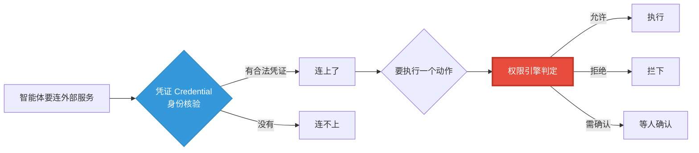
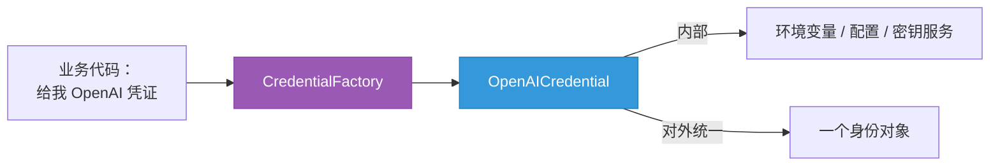
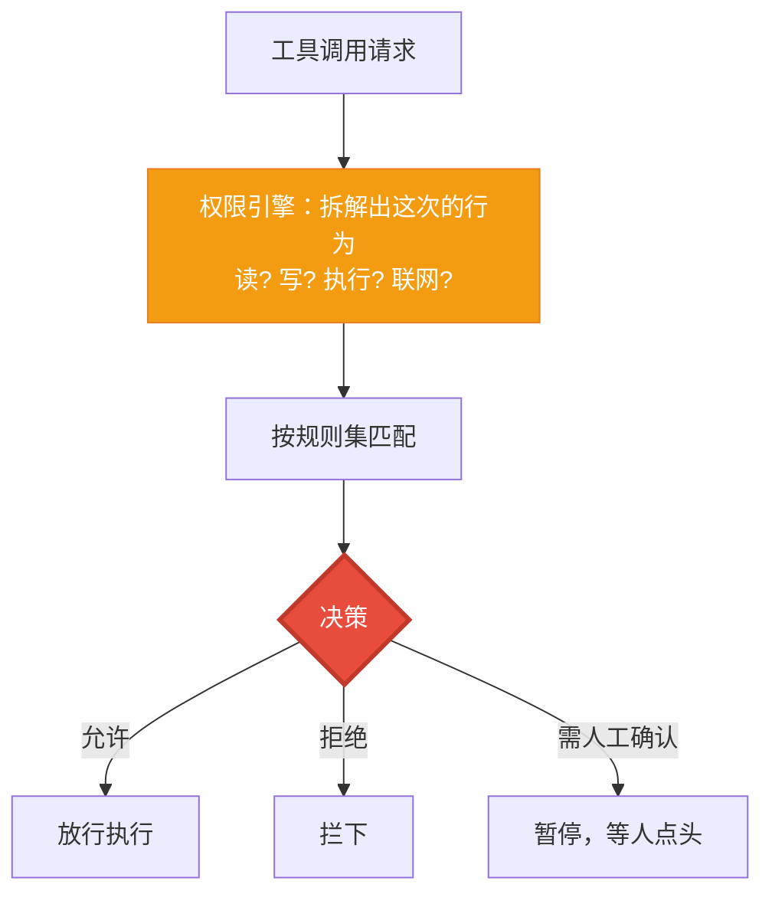

# 第 39 章 权限与凭证：安全地连接工具与数据

> 智能体要能干实事，就得连外部世界——调模型、读数据库、上网、跑代码。可"连得上"和"能乱来"是两回事。一个能删文件的智能体，如果没人管着，迟早闯祸；一把写死在代码里的 API key，迟早泄露。这一章讲两道安全闸：**凭证（Credential）** 管"能不能连上"，**权限（Permission）** 管"连上之后能不能做这件事"。

> **上一章：[第 38 章 工作空间与技能：团队的工位与本事](./ch38-workspace-skill.md)**

---

## 39.1 路线图



凭证是门外的身份核验，权限是进门后每个动作的二次授权。一个管"你是谁、能进哪栋楼"，一个管"进了这间房，这事儿让不让你做"。两者一前一后，把"连外部世界"这件事的安全风险分两层管住。

---

## 39.2 凭证：你是谁，能连什么

调用任何模型或服务，几乎都要一把"钥匙"——API key。怎么管这把钥匙，是个看似不起眼、实则到处是坑的问题。

### 把 key 写死，为什么是个坏主意

最朴素的办法是把 key 直接写在代码里。这能跑，但埋下三个雷：

1. **泄露风险**：代码会进版本库、会进日志、会进错误堆栈。一旦 key 被提交到 Git、被打印到日志里，就等于公开了——而你可能几个月后才发现，期间账单已经被刷爆。
2. **轮换困难**：key 该定期换。写死在代码里，换一次就要改代码、重新发布，没人愿意频繁换，于是 key 一用就是一年，泄露窗口越拉越长。
3. **多环境混乱**：开发、测试、生产各有各的 key，多家服务商各一把，团队成员各一份。写死的话，环境一多就乱成一锅粥，谁也说不清哪把 key 在哪能用。

### 凭证：把"钥匙从哪来"统一管起来

框架用**凭证（Credential）** 来收拾这个烂摊子。它定义一个抽象基类（`CredentialBase`），为每家服务商提供专门的实现：

| 凭证实现 | 对应服务商 |
|---------|-----------|
| `OpenAICredential` | OpenAI |
| `AnthropicCredential` | Anthropic |
| `DeepSeekCredential` | DeepSeek |
| `GeminiCredential` | Google Gemini |
| `DashScopeCredential` | 通义千问（DashScope） |
| `MoonshotCredential` | Moonshot（Kimi） |
| `OllamaCredential` | Ollama（本地） |
| `XAICredential` | xAI（Grok） |

为什么每家要一个专门的凭证类，而不是一个通用的"key 容器"？因为各家取 key 的方式并不一样：有的从环境变量取一个字符串就行，有的要一对 access key + secret，有的要额外的 endpoint 或 region。每种凭证封装自家的取值细节，对外却呈现统一的"给我身份"接口。

再加一个**工厂**（`CredentialFactory`）：你说"我要 OpenAI 的凭证"，工厂就造一个 `OpenAICredential` 给你。业务代码只认服务商名字，不关心 key 具体藏在哪、怎么取、哪家格式。key 的真实来源——环境变量、配置文件，或企业里的密钥管理服务（KMS）——被关在凭证内部，统一打理、可统一轮换。



> **类比**：凭证就是一张**门禁卡**。它能证明"你是谁"，也决定了"你能进哪栋楼"（哪几家服务）。卡本身不用你操心里面写了什么磁条——发卡中心（凭证系统 + 密钥服务）管这些；你只需要刷一下卡，门认不认你，由系统判断。

### 凭证怎么用

业务代码用凭证时，只跟工厂要、不碰 key 本身。大致是这样（仅示意形态）：

```python
# 跟工厂要一份 OpenAI 凭证——key 怎么取，凭证内部自理
cred = CredentialFactory.create("openai")
# 凭证对外暴露的是"给我身份"，而不是 key 字符串本身
identity = cred.get_identity()
```

这一层隔离带来的好处是实打实的：key 从哪来（环境变量、配置文件、密钥服务）、什么时候轮换，全关在凭证内部；业务代码和测试都不接触明文 key，自然也就不会把它写进日志或版本库。换服务商，只换工厂参数；换 key 来源，只改凭证实现——业务代码纹丝不动。

---

## 39.3 权限：连上了，这事让不让你做

凭证让你进了门，但进门不等于为所欲为。一个能写文件的智能体，你大概不想让它随手删掉关键配置；一个能联网的智能体，你也许只想让它查资料、不想让它发邮件或下大文件；一个能执行代码的智能体，你绝对不想让它跑 `rm -rf`。**权限（Permission）** 就是这道"动作级"的闸。

### 权限引擎：每次动作前先过一道关

它的核心是一台**权限引擎**（`PermissionEngine`），在每次工具调用**真正执行之前**先跑一遍判定。注意这个时机——不是"事后审计"（闯了祸再追责），而是"事前拦截"（危险动作根本不发生）。对于安全，事前拦截比事后追责有意义得多。

判定的依据是一组**规则**（`PermissionRule`），规则按"行为"粒度描述约束——读、写、执行、联网，各是一种行为。这意味着规则不是绑死在"某个具体工具"上，而是描述一类动作的属性，于是可以跨工具复用："禁止任何联网行为"这条规则，能同时管住搜索工具、下载工具、邮件工具。



### 三种决策，不止"行/不行"

判定有三种结果，这种"三态"设计比简单的允许/拒绝更贴近现实：

- **允许**——符合规则，直接放行。
- **拒绝**——触碰红线，拦下。
- **需人工确认**——介于两者之间、风险较高的动作，暂停下来等人点个头再继续。

为什么要有"需确认"这一档？因为很多动作既算不上明显违规、也不算绝对安全。比如"删一个文件"，删除本身是合法的工具能力，但删错了代价很大。一刀切允许会闯祸，一刀切拒绝又让智能体什么都干不了。"需确认"给了你一个折中：智能体照常推进到这一步，但在按下"删除"前停一下，把决定权交还给人。这种"人在回路"（human-in-the-loop）的设计，是高风险自动化系统的标配。

这套机制还引入了**模式**（`PermissionMode`）和**上下文**（`PermissionContext`，比如"额外允许的工作目录"）等概念，让你按场景调档：全自动模式让智能体放手干（适合可信、低风险任务），人工确认模式让它在关键动作前停一停（适合高风险操作）。同一个智能体，换个模式，安全姿态就变了，而工具代码不用改。

> **类比**：权限是每个房间门口的**二次授权**。门禁卡（凭证）让你进了大楼，但进了某个具体房间，还要刷一下卡确认"这张卡在这个房间能做什么"——有的房间能进能看，有的房间要主管签字，有的房间干脆刷不进。

### 权限规则长什么样

把"可配置规则"落到形态上，一条规则大致是"在什么行为上、给什么决策"。它的轮廓可以这样理解（仅示意形态）：

```python
# 一组规则示例：精细到行为粒度
rules = [
    PermissionRule(behavior="read",    decision="allow"),    # 读：放行
    PermissionRule(behavior="write",   decision="confirm"),  # 写：需确认
    PermissionRule(behavior="execute", decision="deny"),     # 执行：拒绝
    PermissionRule(behavior="network", decision="confirm"),  # 联网：需确认
]
engine = PermissionEngine(rules=rules)
```

注意规则是按**行为**描述的，不是绑死在某个具体工具上。于是"禁止一切执行行为"这一条规则，能同时管住代码执行工具、shell 工具、任何会跑命令的工具——不用为每个工具各写一遍。引擎在每次工具调用前，先拆出这次涉及的行为，再拿规则集一匹配，给出"放行 / 拦下 / 等人确认"的决策。这套机制让安全策略集中、可复用、还能按 `PermissionMode` 在全自动和严格之间整体调档。

---

## 39.4 凭证与权限：两道闸，各管一段

把两者摆在一起，职责边界就清楚了：

| | 凭证（Credential） | 权限（Permission） |
|---|---|---|
| 解决的问题 | 能不能**连上**服务 | 连上后能不能**做这件事** |
| 类比 | 大楼的门禁卡 | 房间门口的二次授权 |
| 时机 | 建立连接时 | 每次动作执行前 |
| 典型内容 | API key、身份 | 行为规则、允许范围 |
| 失败的后果 | 连不上，没法用 | 连上了但闯了祸 |

凭证解决"身份与连接"，权限解决"动作的边界"。一个智能体要安全地连外部世界，两道闸缺一不可：没有凭证，连门都进不去；没有权限，进去了也可能乱来。

举个串联的例子：智能体要"查一下生产数据库的订单数"。它先掏出门禁卡（凭证）——证明它有连这个数据库的合法身份；连上之后，要执行 `SELECT COUNT(*)`，权限引擎一看是"只读"行为、又在允许范围内，放行。但如果它接下来想 `DROP TABLE`，权限引擎识别出这是"写/破坏"行为，按规则要么直接拦下，要么弹出来等人确认。身份核验和动作授权，各司其职。

---

## 39.5 设计一瞥：可编程的自主性

权限系统最值得玩味的设计，是它**不消灭自主性，而是给自主性装上护栏**。

一种极端是"什么都让智能体自己决定"——灵活，但危险，尤其当它能动真家伙时。另一种极端是"每一步都写死、都人工批"——安全，但失去了智能体"自主"的意义，退化成需要人盯着每一步的脚本。AgentScope 选了中间路：**用可配置的规则集，在关键动作前自动判定**。

- 规则是"可编程"的——你可以精细到"只允许在工作目录内写文件""联网只允许 GET 请求""删除类操作一律要确认"。
- 模式是"可调档"的——按任务的可信度，在全自动和人工确认之间切换。

这种设计的妙处在于：**安全策略和业务逻辑解耦**。智能体和工具本身不需要"懂安全"——它们只管声明"我要做这件事"；安全判断完全集中在权限引擎这一层，由规则说了算。于是你可以给同一个智能体配不同的规则集，让它在不同环境里展现不同的安全姿态，而智能体代码一行不动。

| 模式 | 行为 | 适合场景 |
|------|------|---------|
| 全自动 | 规则允许就执行，不停顿 | 可信、低风险、可复现 |
| 需确认 | 高风险动作暂停等人 | 关键操作、不可逆动作 |
| 严格 | 大量动作被拒或需确认 | 不可信环境、高敏感数据 |

> **设计一瞥：护栏不是牢笼，是让放手成为可能**
>
> 这正是团队场景特别需要的东西。上一章说团队成员会动态创建、各有角色、各跑各的活——越是放手，越需要能在每个危险动作前自动踩一脚的机制。把权限做成"工具调用前的拦截层 + 可配置规则"，意味着你可以放心地给智能体更大的自主权，因为它在悬崖边有栏杆。自主性和安全性，在这里不是二选一，而是通过"可编程的边界"同时获得。

---

## 39.6 检查点

**1. 凭证和权限分别解决什么问题？为什么要分成两道闸？**

凭证解决"能不能连上"——管 API key 等身份信息，决定智能体能访问哪些服务，像门禁卡。权限解决"连上之后能不能做这件事"——在每次动作执行前按规则判定允许/拒绝/需确认，像房间门口的二次授权。分开是因为它们时机和对象不同：凭证管"建立连接时"的身份，权限管"每次动作前"的授权。两道闸缺一不可。

**2. 为什么每家服务商要一个专门的凭证类，还要一个工厂？**

因为各家取 key 的方式不同（单字符串、key+secret、带 endpoint/region 等），专门的凭证类封装各家细节、对外呈现统一接口；工厂（CredentialFactory）让你只说服务商名字就能拿到对应凭证，业务代码不关心 key 藏哪、怎么取。这把 key 管理（来源、轮换、多环境）统一收口，避免写死和泄露。

**3. 权限判定为什么要有"需人工确认"这一档，而不只是允许/拒绝？**

因为很多动作既非明显违规也非绝对安全（如删文件），一刀切允许会闯祸、一刀切拒绝又让智能体干不了事。"需确认"是人在回路的折中：智能体推进到这一步，但在不可逆动作前停下，把决定权交还给人。这对高风险自动化系统是标配。

**4. 为什么说权限系统让"更大的自主性"成为可能？**

因为它给自主性装上了可编程的护栏，且安全策略与业务逻辑解耦（智能体只声明"我要做什么"，安全判断集中在权限引擎）。你敢给智能体更大权限，是因为知道危险动作前有规则自动刹车。自主性和安全性不是二选一，而是通过"可配置边界"同时获得——这正是动态、多成员的团队场景所必需的。

---

## 39.7 下一站预告

凭证和权限把"安全"补齐了。最后一步，是把这一切——团队、工作空间、技能、权限、凭证——装进一个能上线服务的外壳里。下一章，我们从开发态走向部署态，看智能体如何从"脚本里的一行 await"变成"生产环境里的一个服务"。

> **下一章：[第 40 章 从开发到部署：服务化与生产考量](./ch40-deploy-app.md)**