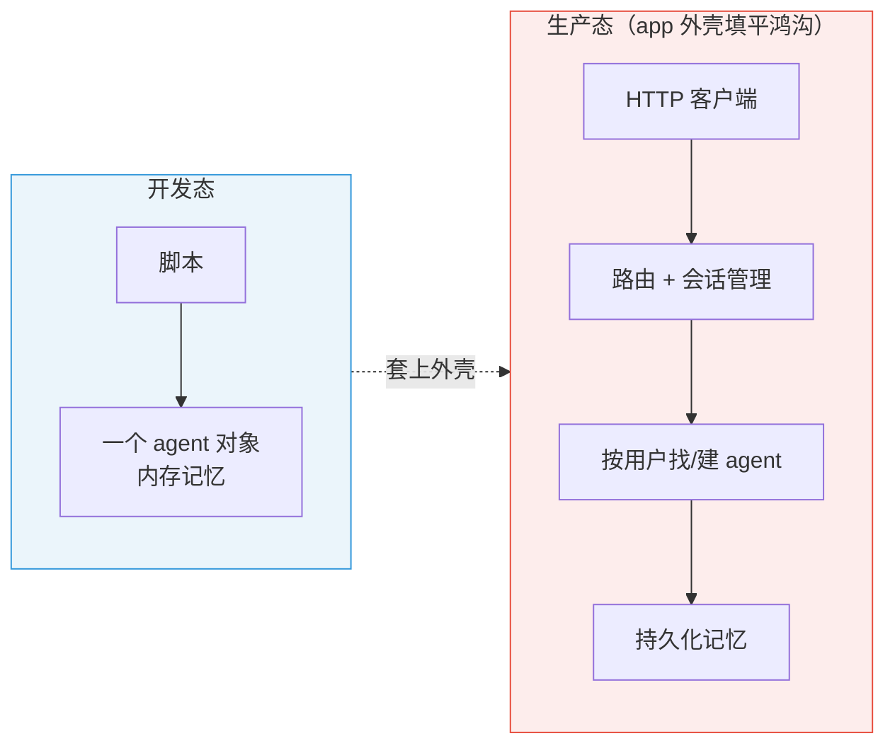
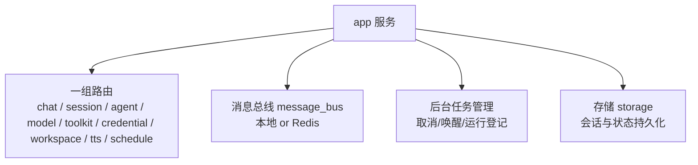
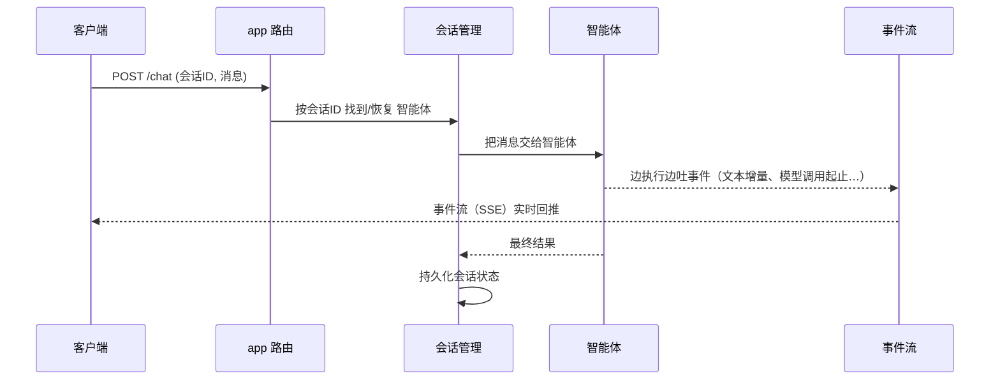

# 第 40 章 从开发到部署：服务化与生产考量

> 前面三十九章，我们都在跟"一个进程里的智能体"打交道——`await agent(msg)`，它就近在咫尺。可真要把智能体做成产品，它得能被网络调用、能同时伺候很多人、能记住跨请求的对话、能在出问题时被追踪和取消。这一章，我们把整本书的能力装进一个**服务外壳**，完成从开发态到生产态的最后一跃——这也是全书的终章。

> **上一章：[第 39 章 权限与凭证：安全地连接工具与数据](./ch39-permission-credential.md)**

---

## 40.1 路线图


红色是本章核心：那个把内存里的智能体变成线上服务的"外壳"。从蓝色（开发态）到绿色（生产态），中间隔着的就是这一层外壳要填平的鸿沟。

---

## 40.2 从一行调用，到一个服务

开发时，智能体就在你手边：

```python
result = await agent(Msg("user", "今天天气如何？", "user"))
```

这一行能跑，是因为智能体、记忆、工具都在同一个进程里，你直接拿着它的引用调它，调完它就在原地等你下一次。这种"近在咫尺"的调用方式，掩盖了一堆生产环境里根本绕不开的问题。一旦你要对外提供服务，这些被掩盖的问题就全冒出来了：

- **客户端在另一台机器上，它怎么"调用"这个智能体？** 本地调用靠的是"对象引用"，引用只在一个进程里有意义；跨机器，你得有一套协议（HTTP）让远程的人也能"按一下"。
- **成百上千个用户同时来问，智能体怎么区分谁是谁、各自记住各自的对话？** 开发时只有一个 `agent`、一段记忆；上线后有无数用户，每人有自己的历史，不能串台。
- **一个回答要好几十秒，客户端怎么等、怎么中途取消？** 同步等几十秒连接会超时、用户体验也差；用户改主意了，还得能叫停。
- **服务重启了，对话历史还在不在？** 开发时记忆在内存里，进程一关就没了；生产环境绝不能"重启一次，所有用户对话清零"。

这四个问题——远程调用、多用户隔离、长任务管理、状态持久化——是任何"把能力变成服务"都要解决的共性难题。答案是一层**服务外壳**。2.0.1 的 `app` 模块用 FastAPI 提供了它：一个工厂函数（`create_app`）造出一个 Web 应用，把智能体的能力暴露成一整套 HTTP 接口，并顺手把上面四个问题都接管了。



---

## 40.3 app 外壳里有什么

这个服务外壳不是简单包一层 HTTP，它替"裸智能体"补上了一整套生产级能力：



- **一组路由**：对话、会话、智能体、模型、工具箱、凭证、工作空间、语音、调度，各是一组接口。客户端要发起对话，就调对话接口；要管理会话，就调会话接口。把能力按领域切成一组组接口，远比把所有东西塞进一个端点好维护。
- **消息总线**：成员之间（或副本之间）投递消息的通道。本地能跑，跨副本时换 Redis（第 37 章讲过它为何可替换）。
- **后台任务管理**：一次对话可能要跑很久，它被登记成一个可追踪、可取消的后台任务；还能在某个外部事件到来时把任务唤醒。
- **存储**：把会话和状态持久化下来，服务重启后对话还能接上。

### 会话管理：多用户各记各的

"会话管理"值得单独点一下，因为它是多用户隔离的关键。上线后，服务端不可能为每个用户各起一个独立的智能体进程——那太奢侈。实际做法是：用一个**会话 ID** 把"同一个用户的连续对话"串起来。每次请求带着会话 ID 来，服务端按这个 ID 找到（或新建）对应的智能体实例和它的记忆，处理完再把状态存回去。于是成百上千个用户共享同一套服务代码，却各自拥有独立的、连续的对话——靠的就是会话 ID 这把"钥匙"。

### 一次请求的端到端旅程

把上面这些串起来，一次"客户端提问 → 服务回答"的旅程是这样的：



注意关键的一点：**回答不是等全部生成完才一次性返回，而是以"事件流"的方式边生成边推**。客户端几乎能立刻看到智能体开始"说话"，体验远好于干等几十秒。

---

## 40.4 事件流：让执行过程可见

"事件流"值得单独说。服务化之后，客户端（往往是一个前端界面）想看到的不是最后那句答案，而是**智能体工作的过程**：它开始想了吗？调了哪个工具？工具返回了什么？现在写到哪了？

框架的 `event` 模块定义了一组**细粒度事件**来描述这个过程：

- 模型调用开始 / 结束；
- 文本块的开始 / 增量 / 结束（于是前端能逐字显示）；
- 数据块的增量（结构化输出的实时推送）；
- 思考块（把模型的思维链也推出来）。

这些事件通过 SSE（服务器推送事件）源源不断地送到客户端，撑起实时、可观测的交互界面。

为什么要分得这么细？至少有两个理由。**第一是体验**：把"等一个完整答案"变成"看它逐字写出来"，主观等待感会大幅下降——这和打字机效果让人感觉"更快的聊天"是同一个心理学。**第二是可控**：细粒度事件让前端能实时反映智能体在干什么（"正在调用天气工具…""工具返回了：晴，25℃"），一旦它走偏，用户能更早发现并叫停，而不是干等几十秒后才发现答非所问。事件的"细粒度"是刻意的设计——粒度越细，前端能呈现的"过程感"越强，用户越不觉得在干等，也越能在出问题时及时干预。

### 事件长什么样

"细粒度事件"落到数据上，每个事件大致是一个带"类型 + 内容"的小消息。它的轮廓可以这样理解（仅示意形态）：

```python
# 文本增量事件：模型又吐了几个字
TextBlockDeltaEvent(type="text_block_delta", delta="今天")

# 模型调用起止：前端能显示"正在思考…"
ModelCallStartEvent(type="model_call_start")
ModelCallEndEvent(type="model_call_end", usage=ChatUsage(input=120, output=0))

# 思考块：把模型的思维链也推出来
ThinkingBlockDeltaEvent(type="thinking_block_delta", delta="先确认城市…")
```

前端收到 `TextBlockDeltaEvent`，就把这几个字接在当前回答末尾，实现逐字显示；收到 `ModelCallStartEvent`，就点亮一个"思考中"的指示灯；收到 `ThinkingBlockDeltaEvent`，就把思维链折进一个可展开的面板。事件越细，前端能呈现的"过程感"越丰富，用户越不觉得在干等——也越能在智能体走偏时及早发现。

---

## 40.5 生产环境的几条命脉

把智能体从"能跑"推到"能上线"，有几件事绕不过去：

| 关注点 | 做什么 | 为什么 |
|--------|--------|--------|
| **横向扩展** | 多副本部署，消息总线换 Redis | 一个进程扛不住，要多份一起干，副本间靠共享总线通信 |
| **会话持久化** | 把会话和状态存进 storage | 服务重启或故障后，对话能接上，不丢历史 |
| **后台任务与取消** | 登记运行、支持取消、支持唤醒 | 长任务可控，用户改主意能叫停，外部事件能触发续跑 |
| **凭证与权限** | 安全地配置 key、按场景设权限 | 上线后面对真实数据和真实风险，安全闸必须到位 |
| **可观测性** | 接入 tracing | 出问题时能顺着调用链定位是哪一环 |

逐条点一下它们各自的分量：

- **横向扩展**是应对流量的刚需。单进程扛不住高峰，得多副本分流；但副本一多，"同一个会话的两次请求落到不同副本"就成了常态，本地记忆和本地总线都跨不过去——所以才要持久化存储 + Redis 总线把状态和消息"搬"到副本之外。
- **会话持久化**是可靠性的底线。生产环境随时可能重启、宕机、滚动更新；没有持久化，一次重启就清空所有用户的历史，这是事故级的问题。
- **后台任务与取消**是长任务场景的必需。智能体回答动辄几十秒，用户随时可能失去耐心或改主意；让任务可登记、可取消、可唤醒，意味着你能优雅地处理"跑到一半叫停""等一个外部事件再继续"。
- **凭证与权限**在第 39 章讲过，上线后它们面对的是真实数据和真实风险，比开发时严格得多。
- **可观测性**是运维的眼睛。一个请求穿过了路由、会话、智能体、模型、工具这么多层，一旦慢了或错了，没有追踪就只能瞎猜；接入 tracing（第 20 章的可观测性）才能顺着调用链定位是哪一环出了问题。

这些都不是"裸智能体"自带的能力，而是 `app` 这层外壳加上去的。也正因如此，团队（第 37 章）、工作空间与技能（第 38 章）、权限与凭证（第 39 章），最终都要经由这个外壳才能被组装、暴露、安全地跑在生产环境里。**外壳是这卷所有能力的汇流处。**

---

## 40.6 设计一瞥：运行时与外壳分离

这一章最根本的设计思想，是**把"智能体运行时"和"服务外壳"分开**。

`ReActAgent` 本身只关心"怎么想、怎么做"——它根本不在乎自己是被你在脚本里直接 `await`，还是被一个 Web 框架通过 HTTP 触发。协议怎么传、并发怎么管、状态怎么存、结果怎么流式推——这些"生产杂务"全归 `app` 这层外壳。于是同一个智能体，既能在你的笔记本脚本里轻量地跑，也能原封不动地塞进一个线上服务。

这条原则其实贯穿全书：**让内核纯粹，把复杂度赶到外围**。Formatter 把"各家 API 差异"赶出 Model（第 35 章）；MemoryBase 把"存哪里"赶出 Agent（第 6 章）；Hook 把"横切逻辑"赶出业务方法（第 15 章）；这里，app 外壳又把"生产杂务"赶出智能体内核。每一次"赶"，都是在让一个组件更纯粹、更可复用、更好测。

> **设计一瞥：同一个内核，两副面孔**
>
> 这种分离带来的好处是深远的。开发时，你面对的是一个纯粹、好调试的智能体内核；上线时，给它套上外壳，它就具备了并发、持久化、流式、可观测全部生产属性——而内核一行没改。反过来，外壳的演进（换更快的 Web 框架、换更强的消息总线）也不污染内核。**关注点分离**，让一个智能体能同时是"研究的玩具"和"生产的工作马"。

---

## 40.7 第五卷总结

第五卷围绕 2.0.1 的主线，把智能体从"个体"带到了"能上线的产品"：

| 章 | 主题 | 关键词 |
|----|------|--------|
| 37 | 智能体团队 | 分工、寻址、动态建员、消息总线 |
| 38 | 工作空间与技能 | 隔离工位、能力包、执行环境即插件 |
| 39 | 权限与凭证 | 连接的身份、动作的护栏、可编程自主性 |
| 40 | 服务化与生产 | app 外壳、事件流、多副本、持久化、可观测 |

至此，你已经能看懂从一条 `Msg` 的诞生，到一支智能体团队在服务端协作运转的整条链路。

---

## 40.8 检查点

**1. app 外壳给"裸智能体"补上了哪些生产级能力？解决了哪四个开发态被掩盖的问题？**

一组 HTTP 路由（对话/会话/智能体/模型/工具箱/凭证/工作空间/语音/调度）、可替换的消息总线、后台任务管理（登记/取消/唤醒）、会话与状态持久化存储。它们分别填平了四个鸿沟：远程调用（HTTP 路由）、多用户隔离（会话 ID + 按需找/建智能体）、长任务管理（后台任务 + 取消 + 唤醒）、状态持久化（storage）。

**2. 会话管理是怎么实现"多用户各记各的对话"的？**

靠会话 ID。每个请求带会话 ID 来，服务端按 ID 找到（或新建）对应的智能体实例和记忆，处理完把状态存回去。成百上千用户共享同一套服务代码，却各自有独立、连续的对话——不需要为每用户各起一个进程。

**3. 为什么回答要以"事件流"的方式回推？事件为什么要分得那么细？**

一次智能体回答可能要几十秒，干等体验极差。细粒度事件（文本增量、模型调用起止、思考块）通过 SSE 边生成边推，一是降低主观等待感（逐字显示），二是让前端实时反映过程，出问题时用户能更早发现并叫停。粒度越细，过程感越强、越可控。

**4. "运行时与外壳分离"带来了什么好处？它和全书哪些设计一脉相承？**

智能体内核只管"怎么想怎么做"，生产杂务（协议、并发、持久化、流式）全归外壳。同一内核既能开发态轻量跑，也能生产态上线，互不污染。它和全书"让内核纯粹、把复杂度赶到外围"一脉相承：Formatter 把 API 差异赶出 Model、MemoryBase 把存储赶出 Agent、Hook 把横切逻辑赶出业务方法——app 外壳把生产杂务赶出智能体内核。

---

## 40.9 全书尾声

我们从一句话开始这趟旅程：

> 用户问"北京今天天气怎么样？"，这条请求会经历什么？

四十章走下来，你已亲眼看过它如何变成一条 `Msg`，如何被 Agent 接收、写进记忆、翻译成模型格式、调用大模型、执行天气工具、在 ReAct 循环里判断去留，最终把答案送回。你也看到了这背后的设计权衡——为什么消息是唯一接口、为什么不用装饰器注册工具、为什么 Formatter 独立于 Model。

然后，在最后这一卷里，这个单兵智能体长成了一支能分工协作的团队：有了隔离的工作空间、整组的技能、凭证与权限的安全闸，最终被装进一个可扩展、可持久化、可观测的服务外壳，真正跑进了生产环境。

理解了这些，你就不仅能用 AgentScope，更能判断它为什么这样设计、在什么场景下该怎么取舍、以及——当你的需求超出它的边界时——该往哪里动手。

愿你带着这套地图，去搭建属于你自己的智能体系统。

> 全书至此结束。

> **上一章：[第 39 章 权限与凭证：安全地连接工具与数据](./ch39-permission-credential.md)**
>
> **[返回目录](../README.md)**